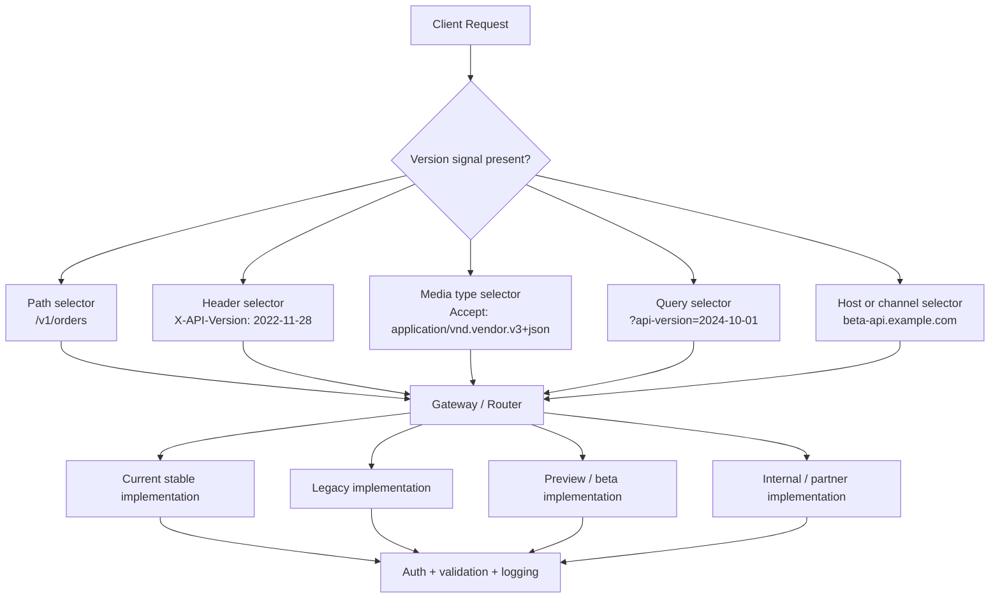
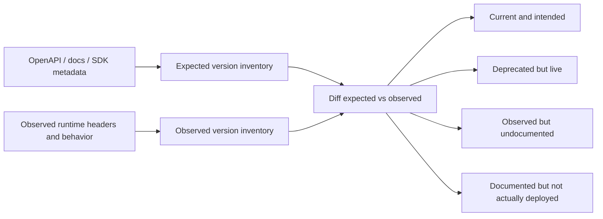
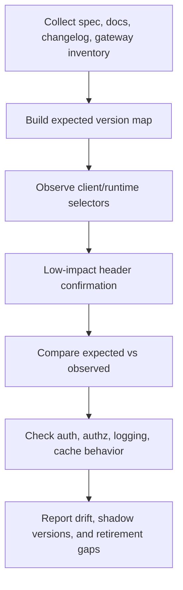
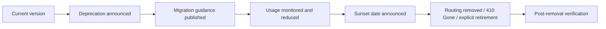

# Version Hunting

> **Version hunting is the disciplined process of identifying which API versions exist, how clients select them, where legacy or preview variants still live, and whether those versions enforce the same security controls. In authorized API recon, version hunting is less about “guessing URLs” and more about building an accurate inventory of contract drift, deprecation state, and hidden trust boundaries.**

> **Authorized use only:** Keep this work inside scope, prefer specs, logs, docs, code, and low-impact confirmation, and avoid turning recon into noisy enumeration. The goal is defensive visibility and safer retirement of old API surface.

---

## Table of Contents

1. [Why Version Hunting Matters](#1-why-version-hunting-matters)
2. [The Core Mental Model](#2-the-core-mental-model)
3. [Where Versions Actually Hide](#3-where-versions-actually-hide)
4. [Use the API Spec as Your Baseline](#4-use-the-api-spec-as-your-baseline)
5. [Common Versioning Schemes and What They Reveal](#5-common-versioning-schemes-and-what-they-reveal)
6. [A Safe, High-Signal Workflow](#6-a-safe-high-signal-workflow)
7. [Interpreting Runtime Clues](#7-interpreting-runtime-clues)
8. [High-Risk Patterns Version Hunting Commonly Finds](#8-high-risk-patterns-version-hunting-commonly-finds)
9. [Logging, Detection, and Inventory Design](#9-logging-detection-and-inventory-design)
10. [Hardening and Retirement Strategy](#10-hardening-and-retirement-strategy)
11. [Quick Checklist](#11-quick-checklist)
12. [References and Public Research](#12-references-and-public-research)

---

## 1. Why Version Hunting Matters

Teams often think of versioning as a developer-experience detail:

- `/v1/` vs `/v2/`
- `2022-11-28` vs `2024-10-01`
- `beta` vs `stable`
- `X-API-Version` vs `Accept: application/vnd.vendor.v3+json`

From a security perspective, versioning is much more important.

It determines:

- **which code path executes**
- **which gateway policy applies**
- **which schema validators run**
- **which authz middleware is attached**
- **which clients are still allowed to call the service**
- **which deprecated or shadow routes remain reachable**

That is why OWASP API9:2023 treats old versions, unclear ownership, and incomplete host/version inventory as a real security problem rather than a documentation nuisance.

### Beginner mental shortcut

> **An API version is not just a label. It is a routing and policy decision.**

If version selection changes the route, middleware, backend, cache key, or authentication expectation, then version hunting becomes attack-surface mapping.

### Why defenders care so much

| Security question | Why version hunting answers it |
|---|---|
| Are old versions still reachable? | Legacy routes often survive long after docs say they are deprecated |
| Do all versions enforce the same auth? | Newer versions often fix authz or validation flaws that older ones never received |
| Are preview or internal channels exposed? | `beta`, `alpha`, `internal`, or partner-only variants frequently leak through shared gateways |
| Can logs tell versions apart? | If not, investigations and rate limiting become much weaker |
| Do docs match runtime? | Drift between documented and live versions is a classic inventory-management failure |

---

## 2. The Core Mental Model

The easiest way to think about version hunting is to stop thinking in terms of “find `/v1/` and `/v2/`” and start thinking in terms of **version selectors**.

A version selector is any signal the platform uses to decide **which contract or behavior** the request should receive.



### The five-layer mental model

| Layer | What you are looking for | Example clues | Security meaning |
|---|---|---|---|
| **Contract layer** | How the API documents versions | `info.version`, changelog, deprecation notes, `deprecated: true` | Tells you what should exist |
| **Routing layer** | How the request selects a version | path, query, header, host, media type | Tells you how runtime chooses behavior |
| **Behavior layer** | What the selected version actually does | different status codes, fields, auth requirements | Tells you whether versions drifted |
| **Lifecycle layer** | Whether the version is current, deprecated, or retiring | `Deprecation`, `Sunset`, docs, announcements | Tells you whether removal is real or only promised |
| **Observability layer** | Whether defenders can see version usage | access logs, traces, metrics, cache keys, `Vary` | Tells you whether inventory and incident response are trustworthy |

### The key shift for advanced testers

Beginners ask:

> “What versions are in the URL?”

More mature defenders ask:

> “What inputs select behavior, and are those selectors consistently authenticated, authorized, logged, and retired?”

---

## 3. Where Versions Actually Hide

Most teams can spot path-based versioning. Fewer teams reliably track the other places version signals appear.

### Version signal matrix

| Version location | What it looks like | Common example | What it usually means |
|---|---|---|---|
| **Path segment** | `/api/v1/users`, `/v2/orders` | Google guidance requires major versions in REST URI paths | Easiest to see, easiest to log, easiest to inventory |
| **Header** | `X-GitHub-Api-Version`, `x-ms-version` | GitHub and Azure examples | Version can be invisible in URL-based logs unless explicitly recorded |
| **Vendor media type** | `Accept: application/vnd.github.v3+json` | OpenAPI examples include vendor-specific media types | Content negotiation doubles as version negotiation |
| **Query parameter** | `?api-version=2024-10-01` | Common in cloud/provider APIs | Frequently overlooked in WAF, cache, and logging design |
| **Hostname / channel** | `beta-api.example.com`, `partner-api.example.com` | preview or partner edge hosts | Versioning and trust boundary become coupled |
| **Document or SDK metadata** | `v1beta1`, `2022-11-28`, changelog entries | client SDK release notes, generated clients | Often reveals supported but undocumented channels |
| **Runtime lifecycle headers** | `Deprecation`, `Sunset`, `Link: rel="deprecation"` | RFC 9745 / RFC 8594 | Indicates retirement state, but not necessarily removal |

### Why this creates blind spots

A team may have excellent route inventory for:

- `GET /api/v1/orders`

and almost no inventory for:

- `GET /orders` with `X-API-Version: 2024-10-01`
- `GET /orders` with `Accept: application/vnd.vendor.v3+json`
- `GET /orders?api-version=2024-10-01`
- `GET https://beta-api.example.com/orders`

Those four requests may hit different code, but only one makes the version obvious in the path.

### Practical defensive rule

> **Inventory the selector, not just the string.**

For each API, record:

- where the version lives
- who sets it
- who validates it
- where it is logged
- how it affects routing and authorization

---

## 4. Use the API Spec as Your Baseline

The OpenAPI Specification is one of the best places to start because it is designed to let humans and tools understand an HTTP API without needing source code or live traffic. For version hunting, the spec gives you the **declared version model** before you look at runtime.

### The first important distinction

OpenAPI contains **two very different kinds of versions**:

| Field | Meaning | Why it matters |
|---|---|---|
| `openapi: 3.1.0` | Which OpenAPI Specification version the document uses | Tooling/format version, **not** the API version |
| `info.version: 2024-10` | Metadata about the API being documented | Usually the API or release version you care about |

The OpenAPI Specification is explicit about this distinction: the root `openapi` field identifies the OAS version, while the API's own version belongs under `info.version`.

### A tiny but important example

```yaml
openapi: 3.1.0
info:
  title: Orders API
  version: 2024-10
servers:
  - url: https://api.example.test/v2
  - url: https://beta-api.example.test/v2
paths:
  /orders:
    get:
      summary: List orders
  /legacy/orders:
    get:
      deprecated: true
      summary: Legacy list endpoint
```

This short snippet already gives you version-hunting clues:

- the spec format is OAS `3.1.0`
- the API contract version is `2024-10`
- the published base path suggests `v2`
- a beta host exists
- a legacy path is still documented
- a deprecated operation is still part of the contract

### What to extract from an approved local spec

When you have an authorized local `openapi.json` or `openapi.yaml`, pull out these fields first:

| Spec element | What it tells you for version hunting |
|---|---|
| `info.version` | Declared API release version |
| `servers` | Alternate hosts, environments, base paths, and channel hints |
| `paths` | Whether versions are explicit in routes |
| `deprecated` | Which operations are supposed to be retiring |
| `tags`, summaries, descriptions | `legacy`, `beta`, `preview`, `internal`, `partner` clues |
| examples and media types | vendor media types and date/header-based hints |

### Safe local extraction examples

```bash
# Show OpenAPI format version vs documented API version
jq -r '.openapi, .info.version' openapi.json
```

```bash
# Review published server URLs for version/channel clues
jq -r '.servers[]?.url' openapi.json | sort -u
```

```bash
# List documented deprecated operations
jq -r '
  .paths
  | to_entries[] as $p
  | $p.value
  | to_entries[]
  | select(.key | test("^(get|put|post|delete|patch|options|head|trace)$"))
  | select(.value.deprecated == true)
  | "\(.key | ascii_upcase) \($p.key)"
' openapi.json | sort -u
```

```bash
# Search descriptions, tags, and examples for version/channel hints
jq -r '.. | strings | select(test("v[0-9]+|beta|alpha|preview|legacy|deprecated|sunset"; "i"))' openapi.json | sort -u
```

### Spec-first mental model



That diff is where most high-value version findings come from.

---

## 5. Common Versioning Schemes and What They Reveal

Different organizations version APIs in different ways for good business reasons. The security issue is not the existence of versioning; it is whether the versioning scheme creates blind spots.

### Comparison table

| Scheme | Example | Public guidance / example | Main advantage | Main risk |
|---|---|---|---|---|
| **Major version in path** | `/v1/projects`, `/v2/projects` | Google AIP-185 requires a major version in the REST URI path | Very visible and easy to inventory | Old paths often linger forever |
| **Date-based header** | `X-GitHub-Api-Version: 2022-11-28` | GitHub REST API versioning | No path churn for clients | Easy to miss in logs and cache design |
| **Version header** | `x-ms-version: 2026-02-06` | Azure Storage service versioning | Clear explicit selector | Header may be lost in proxies, telemetry, or WAF policy |
| **Vendor media type** | `application/vnd.github.v3+json` | OpenAPI spec examples of vendor media types | Works with content negotiation | Hidden in `Accept`, can create cache confusion if `Vary` is wrong |
| **Query parameter** | `?api-version=2024-10-01` | Common cloud API pattern | Easy for SDKs and docs | Often under-logged and mishandled by caches or route controls |
| **Channel suffix** | `v1beta1`, `v1alpha`, `preview` | Google AIP-185 guidance for alpha/beta channels | Makes pre-release state explicit | Preview exposure often outlasts intent |
| **Hostname/channel split** | `beta-api.example.com` | operational pattern | Separates audiences operationally | Shadow infrastructure and weaker controls are common |

### What SemVer helps with — and what it does not

Semantic Versioning explains the meaning of `MAJOR.MINOR.PATCH`:

- increment **MAJOR** for incompatible API changes
- increment **MINOR** for backward-compatible additions
- increment **PATCH** for backward-compatible fixes

That is useful for contracts and client expectations.

But security teams should remember:

> **Semantic meaning does not guarantee runtime retirement.**

A service can claim `v3.2.1` while still exposing `v1`, `v2beta`, and an undocumented header-selected path to the same backend.

### Safe examples of what to look for

#### 1) Path-based versions

```text
https://api.example.test/v1/orders
https://api.example.test/v2/orders
```

Good for visibility, but you should still verify whether:

- both versions are meant to be public
- both hit the same database
- both use the same gateway controls
- the older version is truly retired or only ignored by the frontend

#### 2) Header-based versions

```http
GET /repos/octo-org/octo-repo/issues HTTP/1.1
Host: api.github.com
X-GitHub-Api-Version: 2022-11-28
Accept: application/vnd.github+json
```

This is operationally clean for providers, but your access logs and cache keys must retain the header context or defenders lose visibility.

#### 3) Media-type versions

```http
Accept: application/vnd.github.v3+json
```

The OpenAPI examples of vendor-specific media types show why version hunting must include content negotiation review, not just paths.

#### 4) Lifecycle headers

```http
Deprecation: @1688169599
Sunset: Sun, 30 Jun 2024 23:59:59 UTC
Link: <https://developer.example.com/deprecation>; rel="deprecation"
```

Per RFC 9745 and RFC 8594:

- `Deprecation` tells clients a resource **will be or has been deprecated**
- `Sunset` tells clients a resource is **expected to become unresponsive** at a later time
- the deprecation signal does **not** itself change resource behavior

That last point is critical: a deprecated API can remain fully functional and therefore fully risky.

---

## 6. A Safe, High-Signal Workflow

The best version hunting workflows are low-noise and evidence-driven.

### Step 1: Build the expected version inventory

Start from approved sources:

- OpenAPI / Swagger descriptions
- generated SDKs
- internal docs
- changelogs
- gateway config exports
- service catalogs

Create a normalized record with fields like:

| Field | Example |
|---|---|
| Service | `orders-api` |
| Host | `api.example.test` |
| Version selector type | `path`, `header`, `query`, `media-type`, `host` |
| Version value | `v2`, `2022-11-28`, `v1beta1` |
| Status | current, preview, deprecated, sunset planned |
| Expected audience | public, partner, internal |
| Source | OpenAPI, gateway config, changelog, code |

### Step 2: Observe how real clients choose versions

Look at:

- browser or mobile client traffic already produced during normal use
- generated SDK defaults
- docs examples
- reverse proxy or gateway logs

You want to learn:

- whether the version is explicit or implicit
- whether the client overrides defaults
- whether preview or legacy channels are still referenced
- whether version selection depends on headers, `Accept`, or query params

### Step 3: Perform low-impact confirmation on approved routes

Use benign methods and metadata checks. Avoid brute-forcing version guesses.

```bash
# Inspect lifecycle and content-negotiation headers on an approved endpoint
curl -sI https://api.example.test/orders \
  | sed -n '/^HTTP\|^Content-Type\|^Deprecation\|^Sunset\|^Link\|^Vary\|^Cache-Control\|^X-/p'
```

What this can safely reveal:

- deprecation state
- sunset plans
- header-based version exposure
- whether `Vary` includes version-selecting headers
- whether caches might treat different versions as the same object

### Step 4: Compare expected vs observed

This is the most valuable step.

| Comparison result | Meaning |
|---|---|
| Documented and observed | likely current or intentionally supported |
| Documented but not observed | stale docs, dead code, or environment mismatch |
| Observed but undocumented | shadow version, drift, or hidden exposure |
| Deprecated and still observed heavily | retirement plan is not working |
| Different selector types across environments | inventory and monitoring likely fragmented |

### Step 5: Ask the “same controls?” question

Once versions are identified, compare whether they share the same:

- authentication model
- authorization decisions
- rate limiting
- schema validation
- output filtering
- deprecation warnings
- logging and telemetry

Version hunting becomes valuable when it answers:

> **Is the old or alternate version merely different, or materially weaker?**

### Workflow diagram



---

## 7. Interpreting Runtime Clues

Version hunting is mostly about reading clues correctly.

### High-signal clues table

| Clue | What it likely means | What to verify next |
|---|---|---|
| `/v1/`, `/v2/`, `/v3/` in paths | explicit route versioning | Is the old path still reachable and still intended? |
| `v1beta1`, `v1alpha`, `preview` | pre-release channel | Is the preview audience restricted and logged separately? |
| `X-GitHub-Api-Version`-style headers | header-selected versioning | Do logs, caches, and auth middleware preserve header context? |
| `x-ms-version`-style headers | service-version selection | Are unsupported versions rejected consistently? |
| `application/vnd.vendor.v3+json` | media-type versioning | Does `Vary` include `Accept`? |
| `?api-version=` | query-based versioning | Are query params included in telemetry and allowlists? |
| `Deprecation` header only | resource is deprecated, still operational | Is there a real migration timeline and client usage visibility? |
| `Sunset` header | service or resource is expected to become unavailable | Is retirement enforced when the date passes? |
| `Link: rel="deprecation"` | human-readable migration/deprecation docs exist | Do those docs match runtime reality? |
| `legacy`, `compat`, `old`, `migration` in docs/tags | historical or compatibility surface exists | Is it still needed, scoped, and monitored? |

### Cache and proxy interpretation

One of the most overlooked version risks is **cache confusion**.

If version selection happens in:

- `Accept`
- `X-API-Version`
- another request header

then intermediaries need to vary cache entries correctly.

A simplified defensive example:

```http
Vary: Accept, X-GitHub-Api-Version
```

If the cache key does not reflect version selectors, one client can receive a representation intended for another version.

### Lifecycle interpretation

RFC 9745 is especially important here:

> **Deprecation is a hint, not a shutdown.**

That means this is entirely possible:

- API is documented as deprecated
- runtime still serves it normally
- old clients still call it heavily
- monitoring treats it like normal traffic
- defenders assume it is “basically gone”

That gap is exactly what version hunting is meant to expose.

---

## 8. High-Risk Patterns Version Hunting Commonly Finds

The point of version hunting is not to build pretty inventories. It is to surface patterns that create real security risk.

### 8.1 Security drift between versions

A common real-world pattern:

- `v2` adds stronger authz checks
- `v1` remains reachable for “backward compatibility”
- both versions still talk to the same business objects

That creates a classic downgrade-style risk even when the modern path is hardened.

### 8.2 Hidden version selectors

A team may believe there is “one endpoint” because the URL never changes, while the actual behavior changes based on:

- `Accept`
- `X-API-Version`
- `api-version`
- gateway-only routing headers

If those selectors are not visible in logging or rate limiting, defenders lose operational control.

### 8.3 Deprecated but still live

This is one of the most important lessons from RFC 9745 and OWASP API9.

A deprecated API is not a dead API.

| State | What many teams assume | What may actually be true |
|---|---|---|
| **Deprecated** | “We are basically done with it” | still fully operational |
| **Sunset announced** | “Clients will migrate soon” | heavy production usage continues |
| **Removed from docs** | “No one uses it now” | hidden clients or partner integrations still depend on it |
| **New version released** | “Security fixes are universal now” | older versions never got backported controls |

### 8.4 Preview and beta leakage

Google's versioning guidance makes alpha/beta channels explicit for good reason: preview channels are different surfaces. Problems appear when:

- preview hosts are reachable from public networks
- preview endpoints share production data
- preview logs are weaker
- preview auth rules are softer because “only internal users know about it”

### 8.5 Shared backend, different policy layers

Two versions may call the same database and business logic while passing through different:

- gateways
- service mesh filters
- auth middleware
- schema validators

That often produces subtle inconsistencies such as:

- one version stripping sensitive fields
- another version returning raw internal objects
- one version rate limiting by token
- another limiting only by IP

### 8.6 Version-aware cache failures

If the cache key ignores the selector, you can get:

- wrong representation served across versions
- stale preview responses reaching stable consumers
- deprecation or schema drift hidden behind cached responses

### Secure vs insecure version handling summary

| Category | Insecure pattern | Better defensive pattern |
|---|---|---|
| **Inventory** | Versions known only from tribal knowledge | Central inventory of hosts, selectors, audiences, owners |
| **Routing** | Hidden header/query selectors | Explicitly documented selector rules |
| **Logging** | Access logs record path only | Logs record selector type and value |
| **Retirement** | Deprecated forever | Deprecation timeline + sunset + enforced removal |
| **Preview exposure** | `beta` reachable publicly with prod data | preview isolated, access-scoped, separately logged |
| **Cache behavior** | Header/media-type versioning without `Vary` | Cache keys and `Vary` aligned to selectors |
| **Auth consistency** | New version hardened, old version ignored | Security controls compared and enforced across all supported versions |

---

## 9. Logging, Detection, and Inventory Design

Version hunting is much easier when defenders log version context intentionally.

### What to log for every API request

| Field | Why it matters |
|---|---|
| Normalized route | Lets you compare behavior across versions |
| Version selector type | path, header, query, host, media type |
| Version selector value | `v1`, `2022-11-28`, `v1beta1`, etc. |
| Audience / channel | public, partner, internal, beta |
| Authentication mechanism | bearer, API key, mTLS, session |
| Caller identity | user, client app, service principal |
| Upstream service chosen | reveals routing drift or legacy backends |
| Deprecation/Sunset metadata served | confirms lifecycle signaling |
| Response schema or representation family | useful when content negotiation changes behavior |

### Minimal structured log example

```json
{
  "service": "orders-api",
  "route": "/orders/{id}",
  "method": "GET",
  "version_selector_type": "header",
  "version_selector_value": "2022-11-28",
  "audience": "public",
  "auth_mechanism": "bearer",
  "client_id": "portal-web",
  "upstream_cluster": "orders-v2",
  "deprecation": null,
  "sunset": null,
  "status": 200
}
```

### Why this is operationally important

Without version-aware logging, teams cannot reliably answer:

- which versions still receive production traffic
- whether deprecated versions are still active
- whether preview channels are being called unexpectedly
- whether abuse or errors are concentrated in an old version
- whether rate limiting and anomaly detection are version-aware

### Inventory fields worth keeping outside logs

A central version inventory should also track:

| Field | Example |
|---|---|
| Owner | `payments-platform-team` |
| Lifecycle | active, deprecated, sunset announced, removed |
| Migration target | `v1 -> v2` |
| Retirement date | `2025-12-31` |
| Audience | public, internal, partner |
| Data classification | public, internal, regulated |
| Docs source | OpenAPI path, internal portal, SDK |

That turns version hunting from ad hoc recon into repeatable governance.

---

## 10. Hardening and Retirement Strategy

Version hunting is most useful when it produces concrete hardening work.

### Defensive priorities

#### 1) Make version selection explicit

- Document where the version selector lives
- Reject unsupported selectors cleanly
- Avoid undocumented fallback behavior
- Keep selector rules consistent across edge, gateway, and service

#### 2) Treat all supported versions as production security surface

OWASP API9 is clear on the core idea: if older or alternate versions remain exposed, they need the same security treatment as the current one.

That means:

- authentication parity
- authorization parity
- validation parity
- rate limiting parity
- logging parity
- incident-response parity

#### 3) Use standards-based lifecycle signals

RFC 9745 and RFC 8594 give a useful lifecycle model:

- use `Deprecation` to signal that a resource will be or has been deprecated
- use `Link: rel="deprecation"` to point to migration guidance
- use `Sunset` when the resource is expected to become unavailable later

But do not stop there.

> **Headers are communication controls, not retirement controls.**

A good retirement plan still needs:

- usage monitoring
- owner accountability
- migration deadlines
- removal from routing
- post-removal verification

#### 4) Make caches and intermediaries version-aware

If selectors live in headers or media types:

- include the right fields in `Vary`
- validate proxy behavior
- make CDN and gateway cache keys version-aware
- test that preview and stable responses do not collapse into one cache entry

#### 5) Separate non-production and preview channels properly

- do not mix preview traffic with production data unless strictly justified
- isolate preview hosts and credentials
- label beta/alpha surfaces clearly in docs and logs
- retire preview channels promptly once stable replacements exist

### Retirement lifecycle diagram



### Practical hardening checklist

- Maintain a version inventory for every API host and audience
- Record version selector type and value in logs
- Compare security controls across all supported versions
- Use OpenAPI specs and generated docs as inventory inputs, not sources of blind trust
- Publish deprecation guidance with a clear migration path
- Use `Sunset` only when actual retirement is planned and enforceable
- Remove deprecated routes from gateways and service routers when retirement arrives
- Replace production-like example data in docs with synthetic values
- Ensure `Vary` and cache keys reflect any header or media-type-based versioning
- Keep preview, beta, internal, and partner channels clearly separated

---

## 11. Quick Checklist

Use this during an authorized review.

### Discovery and inventory

- [ ] I know whether the API versions by path, header, media type, query parameter, host, or a mix
- [ ] I extracted `info.version`, `servers`, and deprecated operations from the approved spec
- [ ] I identified every documented version/channel: stable, beta, alpha, preview, legacy, partner, internal
- [ ] I compared expected versions from docs/specs to observed versions in traffic or logs

### Runtime review

- [ ] I checked low-impact response headers for `Deprecation`, `Sunset`, `Link`, `Vary`, and version-specific metadata
- [ ] I verified whether unsupported versions are rejected cleanly
- [ ] I confirmed whether old versions still receive traffic
- [ ] I looked for hidden selectors not visible in the URL

### Security parity

- [ ] I compared authn, authz, validation, and rate limiting across supported versions
- [ ] I checked whether preview or beta channels are exposed more broadly than intended
- [ ] I reviewed whether caches and proxies vary correctly on version selectors
- [ ] I confirmed version selector type/value are captured in logs and traces

### Retirement

- [ ] Deprecated versions have an owner and a removal date
- [ ] `Deprecation` and `Sunset` signals match real migration plans
- [ ] Old routes are not merely undocumented; they are actually retired when promised
- [ ] Post-retirement verification exists to confirm removal

---

## 12. References and Public Research

This note was informed by the following public sources:

1. **OpenAPI Specification 3.1 / 3.1.1** — distinction between OAS format version and API metadata version, examples of vendor media types, guidance on OpenAPI structure  
   https://swagger.io/specification/  
   https://raw.githubusercontent.com/OAI/OpenAPI-Specification/main/versions/3.1.0.md

2. **OWASP API Security Top 10 2023 — API9: Improper Inventory Management** — why old versions, undocumented hosts, and unclear retirement plans become security risk  
   https://owasp.org/API-Security/editions/2023/en/0xa9-improper-inventory-management/

3. **RFC 9745 — The Deprecation HTTP Response Header Field** — formal semantics of `Deprecation` and `Link: rel="deprecation"`  
   https://datatracker.ietf.org/doc/html/rfc9745

4. **RFC 8594 — The Sunset HTTP Header Field** — semantics of `Sunset` and the distinction between deprecation and actual unresponsiveness  
   https://datatracker.ietf.org/doc/html/rfc8594

5. **Semantic Versioning 2.0.0** — meaning of major, minor, and patch changes and why public API clarity matters  
   https://semver.org/  
   https://raw.githubusercontent.com/semver/semver.org/master/index.md

6. **GitHub REST API Versioning** — real-world example of date-based header versioning with `X-GitHub-Api-Version`  
   https://docs.github.com/en/rest/about-the-rest-api/api-versions  
   https://raw.githubusercontent.com/github/docs/main/content/rest/about-the-rest-api/api-versions.md

7. **Google AIP-185 — API Versioning** — guidance on major versions in REST URI paths and explicit alpha/beta channel naming  
   https://cloud.google.com/apis/design/versioning

8. **Azure REST API / Azure Storage Versioning** — examples of query-string and header-based version selection in cloud APIs, including `x-ms-version`  
   https://learn.microsoft.com/en-us/rest/api/azure/  
   https://learn.microsoft.com/en-us/rest/api/storageservices/versioning-for-the-azure-storage-services
