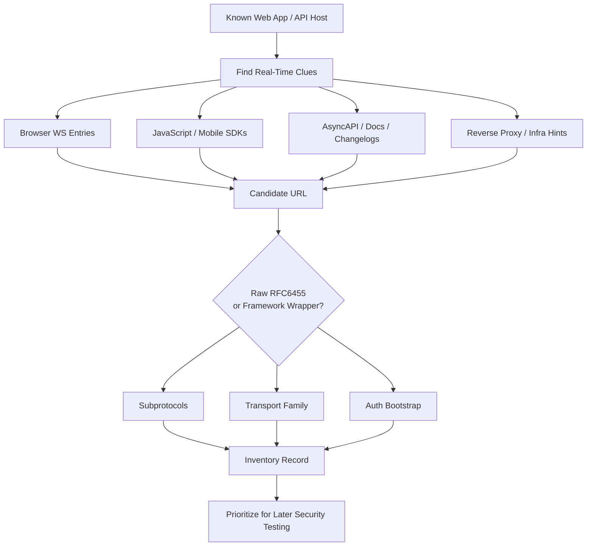
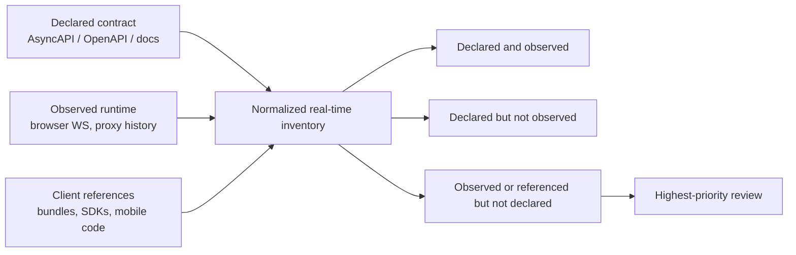
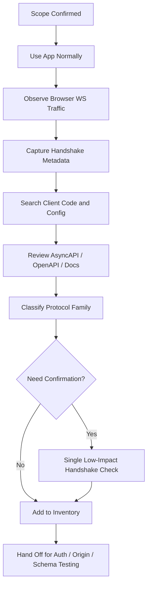

# WebSocket Endpoint Discovery

> **Module:** API Pentesting → API Enumeration & Reconnaissance  
> **Difficulty:** Beginner → Advanced  
> **Tags:** `#websocket` `#api-recon` `#asyncapi` `#socket-io` `#graphql-subscriptions` `#burp-suite`

WebSocket endpoint discovery is the process of identifying **where real-time API communication happens, how clients reach it, what protocol flavor is actually in use, and what security context wraps the connection**. In mature applications, the "endpoint" is rarely just a single `/ws` path. It is often a combination of:

- A base URL or upgrade path
- A framework-specific transport layer (`Socket.IO`, `SockJS`, `SignalR`, Phoenix Channels, STOMP)
- A negotiated subprotocol (`graphql-transport-ws`, `v12.stomp`, custom app protocols)
- An authentication bootstrap step over HTTP
- A long-lived message schema that may not appear anywhere in REST documentation

For defenders and authorized testers, the goal is **coverage**, not noise: find every real-time entry point, record its trust boundary, and hand a clean inventory into later validation work.

> **Authorization required:** Even low-impact WebSocket discovery sends real traffic and can create authenticated sessions, logs, and alertable events. Only perform active confirmation against systems explicitly in scope and inside the rules of engagement.

---

## Table of Contents

1. [Why WebSocket Discovery Matters](#why-websocket-discovery-matters)
2. [Mental Model — What Counts as an "Endpoint"](#mental-model--what-counts-as-an-endpoint)
3. [REST vs WebSocket Recon](#rest-vs-websocket-recon)
4. [High-Signal Discovery Sources](#high-signal-discovery-sources)
5. [Browser-First Discovery Workflow](#browser-first-discovery-workflow)
6. [Client Code, Mobile App, and Bundle Analysis](#client-code-mobile-app-and-bundle-analysis)
7. [Using API Specs and Documentation](#using-api-specs-and-documentation)
8. [Framework and Protocol Fingerprints](#framework-and-protocol-fingerprints)
9. [Low-Impact Handshake Confirmation](#low-impact-handshake-confirmation)
10. [Authentication and Session Clues to Capture](#authentication-and-session-clues-to-capture)
11. [Building a WebSocket Inventory](#building-a-websocket-inventory)
12. [Common False Positives and Blind Spots](#common-false-positives-and-blind-spots)
13. [Defensive Logging and Hardening Priorities](#defensive-logging-and-hardening-priorities)
14. [Authorized Discovery Workflow](#authorized-discovery-workflow)
15. [Checklist](#checklist)
16. [References and Public Research](#references-and-public-research)

---

## Why WebSocket Discovery Matters

Traditional API recon tends to revolve around **URLs, methods, parameters, and schemas**. WebSockets change the shape of the attack surface:

- The connection starts as HTTP, then upgrades into a long-lived channel
- Authentication may happen in cookies, bearer tokens, signed query parameters, or a prior REST bootstrap
- Critical business actions may move from `POST /api/...` into message types like `subscribe`, `join_room`, `place_order`, or `presence_diff`
- Standard HTTP access logs often capture only the **initial upgrade**, not the full message stream
- Security teams sometimes document the REST API well while under-documenting the real-time plane

That means WebSocket discovery is often where you learn:

- Which apps actually support real-time data exchange
- Which backend stacks are in play
- Whether the connection is cross-origin reachable
- Whether there is a separate event API not obvious from OpenAPI
- Which flows deserve deeper authorization, origin, and schema validation later



---

## Mental Model — What Counts as an "Endpoint"

A WebSocket endpoint is not just a path. Treat it as a **5-part object**:

| Layer | Questions to Answer | Example |
|---|---|---|
| **Origin** | Which host serves it? Same host as REST API, CDN edge, dedicated real-time domain? | `wss://realtime.example.com` |
| **Upgrade path** | What URI upgrades to a socket? | `/ws`, `/graphql`, `/socket.io/`, `/live/websocket` |
| **Protocol family** | Raw RFC 6455, GraphQL subscriptions, STOMP, Socket.IO, SignalR, Phoenix, SockJS? | `Socket.IO` over WebSocket |
| **Subprotocol** | What does `Sec-WebSocket-Protocol` negotiate? | `graphql-transport-ws`, `v12.stomp` |
| **Security context** | Cookies, bearer token, signed URL, session bootstrap, origin policy, CSRF binding? | Cookie-authenticated session with origin allowlist |

### The core mental shift

With REST, you usually ask:

> "What route exists?"

With WebSockets, you should ask:

> "What long-lived communication channel exists, how is it reached, and what application protocol runs inside it?"

This matters because two applications can both use `wss://api.example.com/graphql` while exposing completely different real-time surfaces depending on:

- GraphQL subscription schema
- Auth bootstrapping
- Tenant scoping
- Message types accepted after connection
- Framework-specific fallback or negotiation behavior

---

## REST vs WebSocket Recon

| Dimension | REST API Discovery | WebSocket Discovery |
|---|---|---|
| **Primary artifact** | Endpoint path + method | Upgrade path + connection context |
| **Discovery source** | OpenAPI, crawling, route fuzzing | Browser observation, client code, AsyncAPI, subprotocol clues |
| **Auth placement** | Header, cookie, query, body | Handshake cookie/header/query or pre-connection bootstrap |
| **Visibility in logs** | Usually every request | Often only handshake is obvious |
| **Schema location** | OpenAPI / server code | AsyncAPI, client code, message handlers, docs |
| **Common blind spot** | Hidden routes | Hidden event channels and undocumented subprotocols |
| **Low-noise validation** | Safe GET/HEAD | Safe handshake or passive browser observation |

From a defender's perspective, WebSocket discovery fills a specific gap:

- OpenAPI may describe the REST control plane
- AsyncAPI or code may describe the event plane
- Browser telemetry reveals what production users actually open

You need all three to build a complete attack surface map.

---

## High-Signal Discovery Sources

Not all signals are equally valuable. Start with the sources that produce **high-confidence candidates** with minimal noise.

| Source | Typical signal | Confidence | Noise / Risk | Why it matters |
|---|---|---|---|---|
| **Browser DevTools / Burp history** | `101 Switching Protocols`, WS frames, `Sec-WebSocket-Protocol` | Very high | Low | Shows real traffic actually used by the app |
| **Client JavaScript / mobile code** | `new WebSocket(...)`, `io(...)`, `SockJS(...)`, `HubConnectionBuilder` | High | Low | Reveals hidden paths, fallback logic, message names |
| **API specs / AsyncAPI** | `servers`, `channels`, `ws` / `wss` bindings | Very high | Low | Structured source of truth for event-driven APIs |
| **OpenAPI / general API docs** | Auth bootstrap routes, environment URLs, links to subscriptions | Medium | Low | Indirect clues when WebSockets are not documented directly |
| **CSP / config artifacts** | `connect-src wss://...` | Medium | Low | Reveals destinations the frontend is allowed to contact |
| **Reverse proxy / infra config** | `Upgrade` handling, hub routes, `/socket.io/` rewrites | High | Low | Often reveals real-time services hidden behind a gateway |
| **Archive / changelog / docs search** | Release notes mentioning live updates or subscriptions | Medium | Very low | Great for old or deprecated endpoints |

### High-value keywords to search for

When reviewing code or downloaded bundles, look for:

- `new WebSocket`
- `ws://` or `wss://`
- `Sec-WebSocket-Protocol`
- `socket.io`
- `SockJS`
- `graphql-ws`
- `graphql-transport-ws`
- `subscriptions-transport-ws`
- `stomp`
- `ActionCable`
- `Phoenix.Socket`
- `LiveSocket`
- `HubConnectionBuilder`
- `signalr`
- `realtime`
- `presence`
- `subscribe`

---

## Browser-First Discovery Workflow

If the application is already using a socket in normal operation, **the browser is usually the cleanest source of truth**.

### What to look for in DevTools

In Chromium-based browsers:

1. Open **Network**
2. Filter by **WS**
3. Exercise features likely to be real-time:
   - notifications
   - chat
   - dashboards
   - collaborative editing
   - live search
   - order books / prices
   - admin consoles
4. Preserve the log and note each socket opened during page load, auth, and navigation

Record these handshake fields:

| Field | Why it matters |
|---|---|
| `Request URL` | Canonical socket location |
| `Status Code` | `101` confirms upgrade, `401/403/426` is still useful evidence |
| `Origin` | Indicates browser trust boundary |
| `Cookie` / `Authorization` presence | Reveals auth model |
| `Sec-WebSocket-Protocol` | Identifies application-layer protocol |
| `Sec-WebSocket-Extensions` | May reveal compression like `permessage-deflate` |
| First server frames | Often reveal channel names, heartbeat format, welcome banners |

### Burp Suite as a recon tool

Per PortSwigger guidance, Burp is excellent for **observing** WebSocket use without jumping straight into message tampering:

- **Proxy → WebSockets history** shows each upgraded connection
- **Repeater** can clone or reconnect a handshake for controlled validation
- The handshake often exposes:
  - hostnames
  - path structure
  - auth tokens
  - subprotocol negotiation
  - whether the app reconnects automatically

### Safe observation strategy

During discovery, prefer this sequence:

1. **Observe existing app traffic**
2. **Capture handshake metadata**
3. **Record first few benign frames**
4. **Stop**

Do **not** turn discovery into message fuzzing. Endpoint discovery should answer:

- Where is the socket?
- What protocol is it?
- What auth model is in use?
- Which feature or page triggers it?

Detailed validation of message handlers belongs later.

---

## Client Code, Mobile App, and Bundle Analysis

Real-time endpoints are often easier to find in code than on the wire because frontend frameworks centralize connection setup.

### Local artifact search

If you have a checked-out frontend, mobile package, or downloaded JS bundle directory:

```bash
rg -n "new WebSocket|wss?://|socket\\.io|SockJS|graphql-ws|graphql-transport-ws|subscriptions-transport-ws|stomp|ActionCable|Phoenix\\.Socket|LiveSocket|HubConnectionBuilder|signalr" .
```

This is one of the highest-signal searches you can run during authorized recon because it often reveals:

- hardcoded real-time hosts
- versioned paths
- environment fallbacks
- custom subprotocol names
- token acquisition functions
- reconnection logic

### Common code patterns and what they imply

| Code clue | Likely technology | What it tells you |
|---|---|---|
| `new WebSocket("wss://...")` | Raw RFC 6455 | Direct endpoint is probably visible |
| `io("https://...")` or `/socket.io/` | Socket.IO | Expect transport negotiation and Engine.IO parameters |
| `SockJS("/ws")` | SockJS | WebSocket may be one of several transports |
| `createClient({ url: "wss://.../graphql" })` | GraphQL subscriptions | Likely `graphql-transport-ws` or legacy `graphql-ws` |
| `Stomp.client(...)` / `@stomp/stompjs` | STOMP over WebSocket | Subprotocol often matters more than path |
| `new signalR.HubConnectionBuilder()` | SignalR | Expect `/hub` plus negotiation flow |
| `ActionCable.createConsumer(...)` | Rails Action Cable | Common path is `/cable` |
| `new Phoenix.Socket(...)` or `LiveSocket(...)` | Phoenix Channels / LiveView | Common paths include `/socket/websocket` or `/live/websocket` |

### Source maps, config files, and CSP

Do not stop at app code:

- Search `.map` files for unobfuscated endpoint strings
- Search `config.js`, `appsettings.json`, `.env.example`, Helm charts, or ingress files
- Review CSP `connect-src` entries for `wss://...`

Example:

```bash
rg -n "connect-src|wss://|ws://|realtime|socket|subscriptions" .
```

The CSP angle is especially useful because frontend teams often update `connect-src` when adding a new real-time domain, even if the feature documentation lags behind.

---

## Using API Specs and Documentation

This is where many teams miss coverage.

### Use the API spec as your baseline, not your proof

The strongest recon mindset is to treat documentation as the **declared contract** and runtime behavior as the **observed contract**.



That gives you three especially valuable review sets:

| Set difference | Meaning | Why it matters |
|---|---|---|
| `Declared ∩ Observed` | Expected real-time surface | Normal inventory |
| `Observed - Declared` | Live but undocumented channel | Highest-priority WebSocket review |
| `Referenced by client - Declared` | Feature-flagged, internal, or stale real-time behavior | Often reveals hidden environments or drift |

### 1. AsyncAPI is the best-case scenario

If the organization documents event-driven APIs, AsyncAPI is often the closest equivalent to OpenAPI for WebSockets. MDN explicitly points to AsyncAPI as a specification for protocols like WebSocket.

In practice, AsyncAPI can reveal:

- production and staging real-time hosts
- `ws` vs `wss`
- channel addresses
- operation names
- message schemas
- security schemes

A minimal example:

```yaml
asyncapi: 3.0.0
servers:
  production:
    host: api.example.com
    protocol: wss
channels:
  notifications:
    address: /realtime/notifications
operations:
  receiveNotifications:
    action: receive
    channel:
      $ref: '#/channels/notifications'
```

From a discovery standpoint, that is enough to derive a candidate like:

```text
wss://api.example.com/realtime/notifications
```

### 2. OpenAPI still helps indirectly

OpenAPI often does **not** model the socket itself, but it still reveals supporting infrastructure:

- login and token issuance endpoints
- environment hostnames
- session bootstrap calls
- notification or subscription bootstrap routes
- links to developer docs or SDKs that mention the real-time channel

Useful searches across docs or specs:

```bash
find . -iregex '.*\(asyncapi\|openapi\|swagger\).*'

rg -n "asyncapi:|channels:|websocket|socket.io|graphql-ws|graphql-transport-ws|subscriptions|stomp|signalr|realtime|connect-src|wss://" .
```

### 3. GraphQL docs deserve special attention

A GraphQL API may use the **same logical endpoint** for both HTTP queries/mutations and WebSocket-based subscriptions.

Discovery clues include:

- `/graphql`
- `graphql-transport-ws`
- `graphql-ws`
- documentation mentioning **subscriptions**
- client code calling `splitLink`, `GraphQLWsLink`, or subscription helpers

### 4. Changelogs and product docs are often gold

Search release notes, help centers, and status pages for phrases like:

- "live updates"
- "presence"
- "real-time notifications"
- "streaming events"
- "subscriptions"
- "push updates"

Those phrases often lead to the real-time feature before they reveal the actual path.

---

## Framework and Protocol Fingerprints

Many "WebSocket endpoints" are really framework conventions. Recognizing them prevents you from treating every candidate as raw RFC 6455.

| Fingerprint | Likely path pattern | Recon implication |
|---|---|---|
| **Raw WebSocket** | `/ws`, `/websocket`, `/realtime`, `/stream` | Path is usually the important part |
| **Socket.IO / Engine.IO** | `/socket.io/?EIO=4&transport=websocket` | Expect negotiation, fallback polling, engine parameters |
| **GraphQL subscriptions** | `/graphql` | Subprotocol is critical; path may overlap with HTTP GraphQL |
| **STOMP over WS** | `/ws`, `/stomp`, `/websocket` | Look for `v10.stomp`, `v11.stomp`, `v12.stomp` |
| **SockJS** | `/sockjs/`, `/stomp/` | May downgrade to non-WS transports; don't confuse fallback traffic with true WS |
| **SignalR** | `/hub`, `/hubs`, plus negotiate flow | WebSocket may be one transport option, not the only one |
| **Action Cable** | `/cable` | Rails apps often expose one main cable endpoint |
| **Phoenix Channels / LiveView** | `/socket/websocket`, `/live/websocket` | Path conventions strongly fingerprint the stack |

### Good recon habit

When you find one candidate, ask:

> "Is this a raw socket, or is this just the transport endpoint for a higher-level framework?"

That answer changes what you inventory next:

- raw sockets → endpoint + message schema
- GraphQL → schema + subscription operations
- Socket.IO / SignalR → transport negotiation + namespace / hub model
- STOMP → destinations, broker paths, and subprotocols

---

## Low-Impact Handshake Confirmation

If passive observation is not enough, the next step is **single-candidate confirmation**, not mass scanning.

### What success looks like

Any of these responses are useful:

| Response | Meaning |
|---|---|
| `101 Switching Protocols` | Confirmed WebSocket upgrade path |
| `401 Unauthorized` | Candidate exists, auth required |
| `403 Forbidden` | Candidate exists, access or origin blocked |
| `426 Upgrade Required` | Path may exist but request format is wrong |
| Framework-specific negotiation response | May indicate Socket.IO / SignalR instead of raw WS |

### Minimal confirmation example

Use a single in-scope candidate and stop after the handshake:

```bash
curl -i --http1.1 \
  -H 'Connection: Upgrade' \
  -H 'Upgrade: websocket' \
  -H 'Sec-WebSocket-Version: 13' \
  -H 'Sec-WebSocket-Key: SGVsbG9XZWJTb2NrZXQxMjM=' \
  -H 'Origin: https://app.example.com' \
  https://api.example.com/realtime
```

Why this is useful:

- Confirms whether the path is live
- Shows `101` vs `401/403/426`
- Surfaces server headers and negotiated protocol details
- Produces far less noise than opening many connections or sending business messages

### Rules for safe confirmation

- Confirm **one candidate at a time**
- Prefer candidates already seen in browser or code artifacts
- Do **not** brute-force large path lists with upgrade requests
- Do **not** send application messages during the recon phase unless the engagement explicitly calls for it
- Record the result and move on

---

## Authentication and Session Clues to Capture

Discovery is not only about location. It is also about **security context**.

RFC 6455 defines the opening handshake and uses the browser's origin-based security model. In practice, the most important recon question is:

> "What identity material accompanies the upgrade request?"

| Auth pattern | Where you will see it | Recon notes |
|---|---|---|
| **Session cookies** | `Cookie:` on handshake | High priority for later origin / session validation testing |
| **Bearer token in header** | Often non-browser clients or proxies | Capture whether browser actually uses this or a backend proxy injects it |
| **Signed query parameter** | URL query string | Useful for inventory, but be careful not to preserve live secrets in notes |
| **Bootstrap over REST first** | Prior `POST /session`, `/negotiate`, `/token`, `/subscriptions/bootstrap` | OpenAPI may document this even when the socket is missing from docs |
| **Anonymous handshake + app auth message** | First frame after connection | Important to record, but do not turn discovery into protocol abuse |

### What to record during recon

- Which page or user action opened the socket
- Whether cookies were attached automatically
- Whether the `Origin` header is present
- Whether a subprotocol was negotiated
- Whether the first server message contains tenant, room, or user metadata
- Whether logout or session expiration appears to close the socket

### Defensive significance

OWASP's WebSocket Security Cheat Sheet highlights several recurring issues defenders should care about:

- Cross-Site WebSocket Hijacking (CSWSH) risk when cookie-authenticated sockets accept hostile origins
- Long-lived connections outlasting the HTTP session lifecycle
- Monitoring gaps when only the handshake is logged
- `permessage-deflate` compression exposure when not truly needed

That means recon notes should capture **enough context for the hardening team**, not just enough context to reconnect.

---

## Building a WebSocket Inventory

If you discover three socket URLs but do not normalize them into an inventory, you will lose coverage later.

### Recommended inventory fields

| Field | Description |
|---|---|
| `asset_host` | Host serving the socket |
| `ws_url` | Full observed or derived URL |
| `feature_trigger` | What page or action opened it |
| `transport_family` | Raw WS, GraphQL, Socket.IO, STOMP, SignalR, Phoenix, etc. |
| `subprotocol` | Value from `Sec-WebSocket-Protocol`, if any |
| `auth_model` | Cookie, bearer, signed URL, bootstrap, unknown |
| `origin_seen` | Origin value observed during handshake |
| `status_or_handshake` | `101`, `401`, `403`, framework negotiate, unknown |
| `message_schema_hint` | JSON event names, GraphQL subscription, STOMP frame family, binary, unknown |
| `source_of_truth` | Browser, JS bundle, AsyncAPI, docs, proxy config, archive |
| `notes` | Environment, tenanting, fallback transport, hardening observations |

### Example inventory row

| asset_host | ws_url | transport_family | subprotocol | auth_model | source_of_truth |
|---|---|---|---|---|---|
| `api.example.com` | `wss://api.example.com/graphql` | GraphQL subscriptions | `graphql-transport-ws` | Session cookie + CSRF bootstrap | Browser DevTools + client bundle |

### The key output

Your deliverable from this phase should be:

1. A deduplicated list of real-time endpoints
2. A mapping from each endpoint to the feature using it
3. The apparent auth and origin model
4. Enough protocol identification to plan later testing safely

---

## Common False Positives and Blind Spots

### False positives

| Signal | Why it misleads |
|---|---|
| `socket` or `realtime` in a path | Marketing names are not proof of WebSocket use |
| Long polling or SSE | Real-time does not always mean WebSocket |
| `connect-src` allowing `wss://...` | CSP allows the destination, but the app may never use it |
| Framework package import | Library presence does not prove a live endpoint |

### Blind spots

| Blind spot | Why it matters |
|---|---|
| Socket opens only after auth or role change | Anonymous browsing may miss admin or tenant-specific channels |
| Endpoint hidden behind gateway negotiation | SignalR / Socket.IO / brokered systems can obscure the final transport |
| Binary frames | Message purpose may not be obvious from passive captures |
| Native mobile clients | Browser-only recon can miss mobile-only real-time channels |
| Separate real-time domain | API host inventory may omit `rt.`, `live.`, or `stream.` subdomains |

### Practical lesson

Never treat absence of `/ws` as absence of WebSockets. Modern stacks often hide real-time transport behind:

- `/graphql`
- `/socket.io/`
- `/cable`
- `/hub`
- `/live/websocket`
- `/sockjs/...`

---

## Defensive Logging and Hardening Priorities

Endpoint discovery should feed defenders directly.

### What defenders should log

| Event | Why it matters |
|---|---|
| Upgrade request with `101/401/403` | Confirms exposure and access patterns |
| Host, path, origin, user/session ID | Core correlation fields |
| Negotiated subprotocol and extensions | Helps distinguish GraphQL, STOMP, compression use |
| Connection start / end and close code | Long-lived abuse and failure visibility |
| Re-auth or session expiry events | Detect stale or orphaned connections |
| High-level message schema identifiers | Safer than full payload logging in many environments |

### Hardening priorities after discovery

Based on RFC 6455, MDN, and OWASP guidance, the big follow-up controls are:

- Use **`wss://`** in production
- Validate **`Origin`** with an explicit allowlist
- Treat cookie-authenticated sockets as CSWSH-sensitive
- Revalidate sessions on long-lived connections
- Close sockets on logout or privilege change
- Disable `permessage-deflate` unless it is actually needed
- Ensure reverse proxies and WAFs correctly handle upgrade traffic

### Why recon matters to blue teams

If you cannot enumerate all real-time endpoints, you cannot:

- write coverage rules for them
- confirm they require the right auth
- test origin enforcement consistently
- monitor them properly
- document them for engineering teams

---

## Authorized Discovery Workflow



### Recommended priority order

1. **Observed browser traffic**
2. **Client code and bundles**
3. **AsyncAPI and documentation**
4. **Reverse proxy / infrastructure artifacts**
5. **Single-candidate confirmation**

That order gives maximum confidence with minimum operational noise.

---

## Checklist

- [ ] Scope and authorization confirmed for active confirmation
- [ ] Browser Network tab reviewed with `WS` filter
- [ ] Burp WebSockets history reviewed
- [ ] All observed `101`, `401`, `403`, and `426` candidates recorded
- [ ] Handshake fields captured: URL, host, origin, auth, subprotocol, extensions
- [ ] Client bundles searched for WebSocket and framework fingerprints
- [ ] CSP / config files reviewed for `wss://` destinations
- [ ] AsyncAPI, developer docs, changelogs, and GraphQL subscription references reviewed
- [ ] Transport family identified for each candidate
- [ ] Auth bootstrap path recorded where applicable
- [ ] Inventory normalized and deduplicated
- [ ] Findings handed off for later origin, session, and message-schema validation

---

## References and Public Research

These public sources are especially useful for accurate, defensive WebSocket recon:

- **RFC 6455 — The WebSocket Protocol**  
  Canonical reference for the handshake, framing, masking, and browser origin-based security model.

- **MDN WebSockets API**  
  Practical reference for handshake headers, browser behavior, and surrounding tooling. MDN also points to **AsyncAPI** as a specification for describing WebSocket-based APIs.

- **OWASP WebSocket Security Cheat Sheet**  
  Strong defensive guidance on CSWSH, session handling, compression, logging gaps, and proxy/WAF considerations.

- **PortSwigger WebSockets**  
  Useful operational guidance for observing and safely manipulating WebSocket handshakes and messages with Burp Suite during authorized testing.

### Final mental model

Treat WebSocket endpoint discovery as **real-time API surface mapping**, not just path hunting.

The mature question is:

> "Which long-lived channels exist, which trust boundaries protect them, and how do we document them well enough to secure and test them responsibly?"
