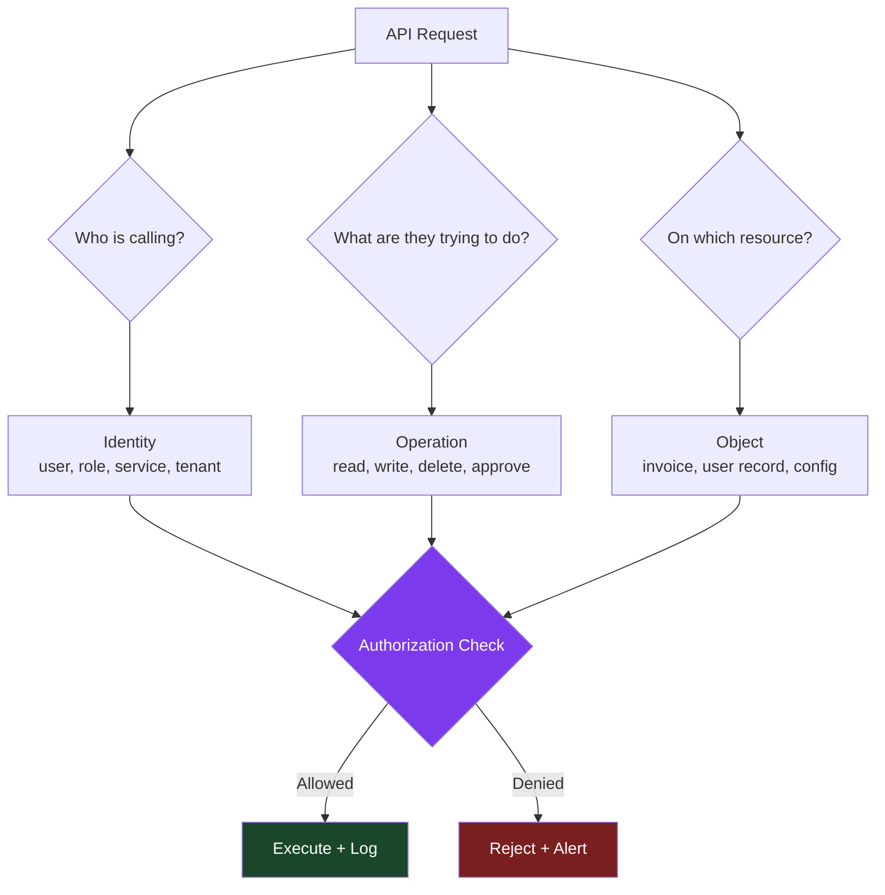
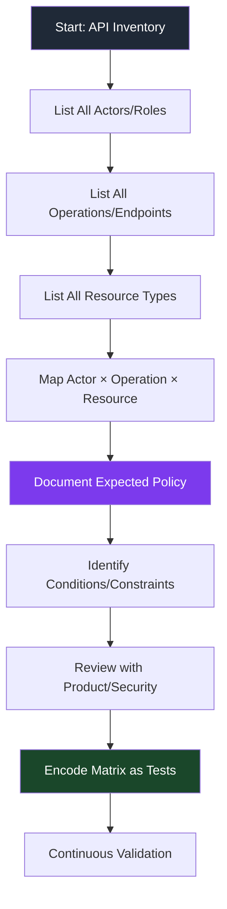

# Authorization Matrix

> **An authorization matrix is a structured map showing which actors can perform which operations on which objects. In authorized API testing, it helps detect access-control gaps, role confusion, and privilege escalation paths before they reach production.**

---

## Table of Contents

1. [What Is It? (Beginner Explanation)](#what-is-it-beginner-explanation)
2. [Why It Belongs in API Attack-Surface Mapping](#why-it-belongs-in-api-attack-surface-mapping)
3. [Core Mental Model — Identity × Operation × Object](#core-mental-model--identity--operation--object)
4. [Authorization Matrix Structure](#authorization-matrix-structure)
5. [Building an Authorization Matrix from Scratch](#building-an-authorization-matrix-from-scratch)
6. [Common Authorization Models in APIs](#common-authorization-models-in-apis)
7. [Authorization Matrix for Different API Patterns](#authorization-matrix-for-different-api-patterns)
8. [Reading an API Spec for Authorization Metadata](#reading-an-api-spec-for-authorization-metadata)
9. [Testing Methodology — Authorized Validation](#testing-methodology--authorized-validation)
10. [High-Risk Authorization Gaps](#high-risk-authorization-gaps)
11. [Worked Example — Multi-Tenant SaaS API](#worked-example--multi-tenant-saas-api)
12. [Common Matrix-Building Mistakes](#common-matrix-building-mistakes)
13. [Authorization Matrix in Microservices](#authorization-matrix-in-microservices)
14. [Defensive Uses of the Authorization Matrix](#defensive-uses-of-the-authorization-matrix)
15. [Authorization Matrix Testing Checklist](#authorization-matrix-testing-checklist)
16. [References](#references)

---

## 🧠 What Is It? (Beginner Explanation)

Imagine a company building with different rooms and different types of people. You need a document that says:

- **Who** can enter **which room**
- **Who** can read documents, modify them, or delete them
- **Who** can approve requests or change settings

That document is an **access control matrix**.

In APIs, the same idea applies, except:

- **rooms** = API endpoints or resources
- **people** = user roles, API clients, service identities
- **actions** = create, read, update, delete, approve, share, export

An **authorization matrix** in API security is simply a structured table or map answering:

> "**Who** (identity/role) can perform **what action** (operation) on **which resource** (object/data)?"

### Authentication vs Authorization (Again)

| Concept | Question it answers | Example |
|---|---|---|
| **Authentication** | Who are you? | "This is user Alice with ID `uid_12345`" |
| **Authorization** | What are you allowed to do? | "Alice can read invoices but not delete them" |
| **Authorization matrix** | Explicit mapping of who-can-do-what | Table showing all roles × operations × objects |

A beginner mistake is assuming "I logged in" means "I can do everything." The authorization matrix shows **exactly** what each identity should and should not be able to do.

### One Sentence to Remember

> **The authorization matrix is the map that answers: for every API operation and every resource, which identities have legitimate access?**

---

## Why It Belongs in API Attack-Surface Mapping

Authorization issues represent some of the most common and damaging API vulnerabilities. OWASP API Security Top 10 (2023) dedicates multiple entries to authorization failures:

- **API1:2023 Broken Object Level Authorization (BOLA)** — users accessing objects they shouldn't
- **API5:2023 Broken Function Level Authorization (BFLA)** — users calling operations they shouldn't
- **API3:2023 Broken Object Property Level Authorization** — users reading or modifying fields they shouldn't

An authorization matrix helps you map, test, and validate controls **before** these issues reach production.

### Why Build the Matrix During Attack-Surface Mapping?

The matrix sits in attack-surface mapping for strategic reasons:

1. **Before testing** — you cannot validate access controls without knowing what access **should** look like
2. **Before code review** — you cannot assess whether enforcement logic is correct without a policy reference
3. **Before deployment** — you cannot detect drift or misconfiguration without a baseline
4. **Before incidents** — reactive security is expensive; the matrix is a proactive control inventory

### Matrix-Driven Security Benefits

| Without authorization matrix | With authorization matrix |
|---|---|
| Testers guess what "should" be allowed | Clear reference for what is intended |
| Developers implement controls inconsistently | Authoritative source for all endpoints |
| Security reviews rely on ad-hoc checks | Systematic validation against policy |
| Authorization drift goes undetected | Automated testing can compare matrix vs reality |
| BOLA/BFLA issues discovered in production | Issues caught during development and CI/CD |

---

## 🏗️ Core Mental Model — Identity × Operation × Object

The clearest way to think about API authorization is through three dimensions:

```text
Authorization decision = f(Identity, Operation, Object)
```



### The Three Key Questions

Every API call should trigger these three authorization questions:

| Question | Technical translation | Example |
|---|---|---|
| **Who?** | Extract identity from token claims, session, or client cert | `sub: user_123`, `role: customer`, `tenant_id: acme_corp` |
| **What?** | Map HTTP method + endpoint to a capability | `DELETE /invoices/{id}` → "delete_invoice" operation |
| **Which?** | Extract target object from path, query, or body | Invoice ID `inv_999`, owned by `tenant: acme_corp` |

Then evaluate:

```python
allowed = policy.check(
    identity=user_123,
    operation="delete_invoice",
    resource=invoice_999
)
```

If **any dimension is wrong**, access should be denied:

- right user, right operation, **wrong object** → BOLA violation
- right user, **wrong operation**, right object → BFLA violation
- **wrong user**, otherwise correct → authentication or tenant isolation issue

---

## Authorization Matrix Structure

A minimal authorization matrix has three axes:

```text
    ┌─────────────────────────────────────────────────┐
    │ Actors (rows) × Operations (columns) × Objects  │
    └─────────────────────────────────────────────────┘
```

### Basic Matrix Format

The simplest form is a table:

| **Actor / Role** | **Operation** | **Resource / Object** | **Allowed?** | **Conditions** |
|---|---|---|---|---|
| Anonymous | `GET /products` | Product list | ✅ Yes | Public endpoint |
| Customer | `GET /orders/{id}` | Own orders | ✅ Yes | `order.user_id == caller.user_id` |
| Customer | `GET /orders/{id}` | Other customer's orders | ❌ No | BOLA check required |
| Admin | `DELETE /users/{id}` | Any user | ✅ Yes | Requires `admin` role |
| Support | `GET /users/{id}` | Any user | ✅ Yes | Read-only access |
| Support | `DELETE /users/{id}` | Any user | ❌ No | Insufficient privilege |

### Advanced Matrix with Scopes

For OAuth2 or fine-grained systems:

| **Role** | **OAuth Scope** | **Endpoint** | **Object** | **Allowed?** | **Notes** |
|---|---|---|---|---|---|
| User | `read:profile` | `GET /me` | Own profile | ✅ | Token must have scope |
| User | `write:profile` | `PATCH /me` | Own profile | ✅ | Needs write scope |
| User | `admin:users` | `GET /admin/users` | All users | ❌ | Scope exists but role check fails |
| Service | `billing:process` | `POST /webhooks/stripe` | Webhook | ✅ | Service-to-service |

### Multi-Dimensional Matrix

In complex systems, you might track:

```text
Matrix = Actors × Operations × Objects × Environments × Tenants
```

Example:

| **Tenant** | **Role** | **Environment** | **Endpoint** | **Allowed?** |
|---|---|---|---|---|
| `acme_corp` | Admin | Production | `DELETE /config` | ✅ Yes |
| `acme_corp` | Admin | Production | `DELETE /logs` | ❌ No (immutable) |
| `beta_inc` | Admin | Staging | `DELETE /config` | ✅ Yes |
| `beta_inc` | User | Production | `DELETE /config` | ❌ No (role) |

---

## Building an Authorization Matrix from Scratch

### Step-by-Step Workflow



### 1. Enumerate Actors and Roles

Start by listing **every identity type** that interacts with the API:

**Human identities:**
- Anonymous / unauthenticated user
- Registered user (free tier)
- Registered user (paid tier)
- Organization member
- Organization admin
- Support agent
- System administrator

**Non-human identities:**
- Service accounts
- Background workers
- Partner integrations
- Webhook sources
- Mobile app clients
- Third-party OAuth apps

**Tenant/scope dimensions:**
- Own data
- Team/organization data
- Cross-tenant data (if applicable)
- Global/system data

### 2. Enumerate Operations

List every distinct **capability** the API exposes:

**HTTP endpoint view:**
```text
GET    /users/{id}
PATCH  /users/{id}
DELETE /users/{id}
POST   /users/{id}/reset-password
GET    /orders
POST   /orders
GET    /orders/{id}
DELETE /orders/{id}
POST   /admin/reports/export
```

**Functional view (better for complex APIs):**
```text
read_own_profile
update_own_profile
read_other_user_profile
delete_user_account
list_orders
create_order
cancel_order
refund_order
export_admin_reports
```

Functional naming is clearer because a single HTTP endpoint may map to multiple operations depending on **who is calling** and **which object** they target.

### 3. Enumerate Objects and Resources

Identify **what data or entities** the API manages:

- User profiles
- Organizations/tenants
- Orders
- Invoices
- Products
- API keys
- Webhook configurations
- Audit logs
- System settings

For each object type, note:
- **Ownership model** — who "owns" this object?
- **Visibility model** — who can see it exists?
- **Mutability** — who can change it?
- **Lifecycle** — can it be soft-deleted, archived, or made immutable?

### 4. Map Expected Access

Now cross-reference **actors × operations × objects** and document the intended policy:

**Simple example:**

| Operation | Anonymous | User (self) | User (other) | Admin |
|---|---|---|---|---|
| `GET /users/{id}` | ❌ | ✅ (own) | ❌ | ✅ (all) |
| `PATCH /users/{id}` | ❌ | ✅ (own) | ❌ | ✅ (all) |
| `DELETE /users/{id}` | ❌ | ✅ (own) | ❌ | ✅ (all) |
| `GET /orders/{id}` | ❌ | ✅ (own) | ❌ | ✅ (all) |
| `POST /admin/export` | ❌ | ❌ | ❌ | ✅ |

### 5. Document Conditions and Constraints

Authorization is rarely binary. Capture **context-dependent rules**:

| Operation | Actor | Allowed? | Conditions |
|---|---|---|---|
| `DELETE /orders/{id}` | Customer | ✅ | Only if order status is `pending` |
| `POST /refunds` | Support | ✅ | Only if refund amount ≤ original payment |
| `GET /invoices/{id}` | Partner API | ✅ | Only if partner_id matches invoice.partner_id |
| `PATCH /config` | Admin | ✅ | Only in non-production environments |

These conditions often reveal **business logic controls** that standard RBAC doesn't capture.

### 6. Encode the Matrix as Automated Tests

The matrix should not live only in a spreadsheet. Encode it as:

- **Unit tests** for authorization logic
- **Integration tests** that validate role enforcement
- **Contract tests** for each actor type
- **Continuous tests** in CI/CD

Example test pseudocode:

```python
def test_user_cannot_read_other_user_profile():
    user_a = create_user("alice")
    user_b = create_user("bob")
    
    response = api_call(
        endpoint=f"/users/{user_b.id}",
        token=user_a.token
    )
    
    assert response.status == 403  # Forbidden
    assert "BOLA" not in response.body  # Don't leak error detail
```

---

## Common Authorization Models in APIs

Understanding the authorization **model** helps you design the right matrix structure.

### Role-Based Access Control (RBAC)

**What it is:**
- Access decisions based on **roles** assigned to users
- Roles group related permissions

**Authorization matrix structure:**

| Role | Permissions |
|---|---|
| `viewer` | `read:users`, `read:orders` |
| `editor` | `read:users`, `read:orders`, `write:orders` |
| `admin` | `read:*`, `write:*`, `delete:*` |

**When to use:**
- Relatively stable set of roles
- Permissions grouped by job function
- Multi-tenant systems where roles apply within a tenant

**Matrix example:**

| Endpoint | Viewer | Editor | Admin |
|---|---|---|---|
| `GET /orders` | ✅ | ✅ | ✅ |
| `POST /orders` | ❌ | ✅ | ✅ |
| `DELETE /orders/{id}` | ❌ | ❌ | ✅ |

### Attribute-Based Access Control (ABAC)

**What it is:**
- Access decisions based on **attributes** of user, resource, action, and environment
- More dynamic and context-aware than RBAC

**Example attributes:**
```json
{
  "user.department": "engineering",
  "user.clearance_level": 3,
  "resource.classification": "internal",
  "resource.owner": "alice",
  "environment.time": "2024-01-15T14:30:00Z",
  "environment.ip_range": "10.0.0.0/8"
}
```

**Authorization rule:**
```text
ALLOW if:
  user.clearance_level >= resource.classification_level
  AND (resource.owner == user.id OR user.department == resource.department)
  AND environment.time within business_hours
```

**Matrix structure** is harder to represent as a static table; instead use **policy expressions**:

| Operation | Resource | Policy |
|---|---|---|
| `GET /documents/{id}` | Document | `user.clearance >= doc.level AND (doc.owner == user.id OR user.dept == doc.dept)` |
| `DELETE /documents/{id}` | Document | `user.role == "admin" OR doc.owner == user.id` |

### Relationship-Based Access Control (ReBAC)

**What it is:**
- Access decisions based on **relationships** in a graph
- Common in social platforms, collaboration tools, and multi-tenant systems

**Example relationships:**
```text
alice --[owns]--> document_1
alice --[member_of]--> team_engineering
team_engineering --[can_read]--> project_alpha
```

**Authorization check:**
```text
Can alice read project_alpha?
  → alice --[member_of]--> team_engineering --[can_read]--> project_alpha
  → Yes
```

**Matrix representation:**

| User | Relationship Path | Resource | Access |
|---|---|---|---|
| alice | `member_of → can_read` | project_alpha | ✅ |
| bob | (no path) | project_alpha | ❌ |

**Real-world example:** Google Drive, Slack, GitHub organizations

### OAuth2 Scopes

**What it is:**
- Delegated authorization using **scope strings**
- Client app requests scopes; user consents; API validates token scopes

**Matrix structure:**

| Scope | Operation | Notes |
|---|---|---|
| `read:profile` | `GET /me` | Read own profile |
| `write:profile` | `PATCH /me` | Update own profile |
| `read:orders` | `GET /orders` | List own orders |
| `admin:users` | `GET /admin/users`, `DELETE /users/{id}` | Admin operations |

**Combined with roles:**

| Role | Allowed Scopes |
|---|---|
| User | `read:profile`, `write:profile`, `read:orders` |
| Admin | `read:profile`, `write:profile`, `read:orders`, `admin:users` |

**Why it matters for the matrix:**
- Token may have scope `admin:users` but **user lacks admin role** → denied
- User has admin role but **token lacks scope** → denied
- Both must align for access to succeed

---

## Authorization Matrix for Different API Patterns

### REST APIs

**Matrix structure:** HTTP method + path + role

| Role | `GET /users/{id}` | `PATCH /users/{id}` | `DELETE /users/{id}` |
|---|---|---|---|
| Anonymous | ❌ | ❌ | ❌ |
| User (self) | ✅ | ✅ | ✅ |
| User (other) | ❌ | ❌ | ❌ |
| Admin | ✅ | ✅ | ✅ |

**Key insight:** REST's resource-centric design makes the matrix intuitive — each row is a role, each column is a resource+method.

### GraphQL APIs

**Matrix structure:** Query/mutation + field + role

GraphQL is trickier because a **single request** can access multiple operations and fields.

**Schema:**
```graphql
type Query {
  me: User
  user(id: ID!): User
  users: [User]
}

type Mutation {
  updateProfile(input: UpdateProfileInput!): User
  deleteUser(id: ID!): Boolean
}

type User {
  id: ID!
  email: String
  ssn: String  # sensitive
  role: String
}
```

**Authorization matrix:**

| Role | Query | Field | Allowed? | Notes |
|---|---|---|---|---|
| User | `me` | `id, email, role` | ✅ | Own data |
| User | `me` | `ssn` | ❌ | Sensitive field |
| User | `user(id)` | `id, email` | ❌ | BOLA risk |
| Admin | `user(id)` | `id, email, role` | ✅ | Admin access |
| Admin | `user(id)` | `ssn` | ✅ | Admin + audit |
| User | `updateProfile` | N/A | ✅ | Own profile only |
| User | `deleteUser` | N/A | ❌ | Admin operation |
| Admin | `deleteUser` | N/A | ✅ | Admin operation |

**GraphQL-specific risks:**
- **Field-level authorization** — even if query is allowed, certain fields may be restricted
- **Depth and complexity** — authorization may need rate limiting or query cost analysis
- **Introspection** — anonymous users querying schema may leak operation names

### gRPC APIs

**Matrix structure:** Service + RPC method + role

**Proto definition:**
```protobuf
service UserService {
  rpc GetUser(GetUserRequest) returns (User);
  rpc UpdateUser(UpdateUserRequest) returns (User);
  rpc DeleteUser(DeleteUserRequest) returns (Empty);
}
```

**Authorization matrix:**

| Role | `GetUser` | `UpdateUser` | `DeleteUser` |
|---|---|---|---|
| User (self) | ✅ | ✅ | ✅ |
| User (other) | ❌ | ❌ | ❌ |
| Admin | ✅ | ✅ | ✅ |

**gRPC-specific considerations:**
- **Metadata/headers** for passing tokens
- **Interceptors** for centralized authorization
- **Bi-directional streams** — authorization may need per-message checks

### WebSocket / Realtime APIs

**Matrix structure:** Connection + message type + role

**Example messages:**
```json
{ "type": "subscribe", "channel": "order_updates", "order_id": 123 }
{ "type": "send_message", "chat_id": 456, "text": "Hello" }
{ "type": "admin_broadcast", "message": "System maintenance" }
```

**Authorization matrix:**

| Role | `subscribe` (own orders) | `subscribe` (other orders) | `send_message` | `admin_broadcast` |
|---|---|---|---|---|
| User | ✅ | ❌ | ✅ (own chats) | ❌ |
| Admin | ✅ | ✅ | ✅ | ✅ |

**WebSocket-specific challenges:**
- **Stateful connection** — authorization at connection time vs per-message
- **Long-lived tokens** — refresh or re-auth strategy
- **Subscriptions** — user may subscribe to channel, but does that grant access to all messages?

---

## Reading an API Spec for Authorization Metadata

Good API documentation includes authorization hints. Here's what to extract:

### OpenAPI / Swagger

**Global security schemes:**
```yaml
components:
  securitySchemes:
    bearerAuth:
      type: http
      scheme: bearer
      bearerFormat: JWT
    apiKey:
      type: apiKey
      in: header
      name: X-API-Key
```

**Per-endpoint security:**
```yaml
paths:
  /users/{id}:
    get:
      summary: Get user by ID
      security:
        - bearerAuth: []
      x-required-role: "user"  # Custom extension
      responses:
        '200':
          description: User object
        '403':
          description: Forbidden - insufficient permissions
```

**What to extract for the matrix:**
- Which endpoints require authentication (`security` field)
- Which roles or scopes are needed (custom extensions like `x-required-role`, `x-scopes`)
- Error responses (`403`, `401`) indicating authorization enforcement

### GraphQL Schema Directives

**Custom directives:**
```graphql
directive @auth(requires: [Role!]!) on FIELD_DEFINITION

type Query {
  me: User @auth(requires: [USER])
  users: [User] @auth(requires: [ADMIN])
}

type Mutation {
  deleteUser(id: ID!): Boolean @auth(requires: [ADMIN])
}
```

**What to extract:**
- Which queries/mutations/fields have `@auth` or similar directives
- Required roles, scopes, or permissions

### gRPC + Protobuf Annotations

**Custom options:**
```protobuf
import "google/api/annotations.proto";

service UserService {
  rpc GetUser(GetUserRequest) returns (User) {
    option (google.api.http) = {
      get: "/v1/users/{user_id}"
    };
    option (auth.required_role) = "USER";
  };
  
  rpc DeleteUser(DeleteUserRequest) returns (Empty) {
    option (google.api.http) = {
      delete: "/v1/users/{user_id}"
    };
    option (auth.required_role) = "ADMIN";
  };
}
```

### Documentation Clues

Even informal docs can help:

| Doc phrase | Matrix implication |
|---|---|
| "Requires admin privileges" | Operation restricted to `admin` role |
| "Only the resource owner can modify" | Object-level authorization required |
| "Public endpoint" | No authentication needed |
| "Scopes: `read:orders`, `write:orders`" | OAuth scope-based authorization |
| "Accessible to members of the organization" | Tenant or team-level check |

---

## Testing Methodology — Authorized Validation

The authorization matrix is a **reference**, not just documentation. Use it to drive systematic testing.

### Test Design from the Matrix

For each cell in the matrix, design a test case:

**Matrix cell:**

| Role | Operation | Resource | Expected |
|---|---|---|---|
| User | `GET /orders/{id}` | Own order | ✅ Allow |
| User | `GET /orders/{id}` | Other's order | ❌ Deny |

**Test cases:**

```python
# Test 1: User can read own order
def test_user_reads_own_order():
    user = create_user()
    order = create_order(owner=user)
    response = api.get(f"/orders/{order.id}", auth=user.token)
    assert response.status == 200
    assert response.json["id"] == order.id

# Test 2: User cannot read other user's order
def test_user_cannot_read_other_order():
    user_a = create_user()
    user_b = create_user()
    order = create_order(owner=user_b)
    response = api.get(f"/orders/{order.id}", auth=user_a.token)
    assert response.status == 403  # Forbidden
```

### Coverage Metrics

Track which matrix cells have been tested:

```text
Matrix coverage = (tested cells) / (total expected cells) × 100%
```

Example:

| Metric | Value |
|---|---|
| Total matrix cells | 120 |
| Cells with automated tests | 95 |
| Coverage | 79% |
| Untested high-risk cells | 3 (admin delete operations) |

### Negative Testing is Critical

For authorization, **negative tests** (testing that denial works) are just as important as positive tests:

**Positive test:**
```python
admin_can_delete_user()  # Should return 200
```

**Negative tests:**
```python
user_cannot_delete_other_user()  # Should return 403
anonymous_cannot_delete_user()   # Should return 401
support_cannot_delete_user()     # Should return 403
```

Many BOLA/BFLA vulnerabilities exist because **negative tests were never written**.

---

## High-Risk Authorization Gaps

Not all matrix cells have equal risk. Prioritize testing these patterns:

### 1. Privilege Escalation Paths

**Pattern:** Lower-privileged role can perform admin operations

**Example matrix:**

| Role | `POST /admin/promote` | Risk |
|---|---|---|
| User | ❌ Expected | 🔴 Critical if actually ✅ |
| Admin | ✅ Expected | ✅ Correct |

**Test:**
```python
def test_user_cannot_promote_to_admin():
    user = create_user(role="user")
    response = api.post("/admin/promote", auth=user.token, json={"user_id": user.id, "role": "admin"})
    assert response.status == 403
```

### 2. Horizontal Privilege Escalation (BOLA)

**Pattern:** User A can access User B's resources

**Example matrix:**

| Actor | Resource | Expected | Risk |
|---|---|---|---|
| User A | User A's orders | ✅ | ✅ Correct |
| User A | User B's orders | ❌ | 🔴 Critical if actually ✅ |

**Common mistake:** API checks authentication but not **object ownership**:

```python
# Vulnerable code
@app.get("/orders/{order_id}")
def get_order(order_id: int, user: User = Depends(get_current_user)):
    order = db.get(Order, order_id)
    return order  # ❌ No ownership check!

# Fixed code
@app.get("/orders/{order_id}")
def get_order(order_id: int, user: User = Depends(get_current_user)):
    order = db.get(Order, order_id)
    if order.user_id != user.id and not user.is_admin:
        raise Forbidden  # ✅ Ownership check
    return order
```

### 3. Function-Level Authorization Gaps (BFLA)

**Pattern:** User can call admin-only functions

**Example:**

| Role | `DELETE /users/{id}` | Expected |
|---|---|---|
| User | ❌ | 🔴 Critical if ✅ |
| Admin | ✅ | Correct |

**Common mistake:** Relying on UI to hide admin features, but API enforces nothing:

```javascript
// Frontend hides button for non-admins, but API allows anyone
DELETE /admin/users/123
Authorization: Bearer <normal_user_token>

// Response: 200 OK ❌ Should be 403
```

### 4. Missing Multi-Tenant Isolation

**Pattern:** User in Tenant A can access Tenant B's data

**Matrix:**

| Tenant | Actor | Resource | Expected |
|---|---|---|---|
| Acme Corp | Admin | Acme Corp orders | ✅ |
| Acme Corp | Admin | Beta Inc orders | ❌ 🔴 Critical if ✅ |

**Test:**
```python
def test_tenant_isolation():
    tenant_a_admin = create_admin(tenant="acme")
    tenant_b_order = create_order(tenant="beta")
    
    response = api.get(f"/orders/{tenant_b_order.id}", auth=tenant_a_admin.token)
    assert response.status == 403  # Should be forbidden
```

### 5. State-Dependent Authorization

**Pattern:** Authorization should change based on object state

**Matrix:**

| Order State | User Action | Expected |
|---|---|---|
| `pending` | Cancel order | ✅ |
| `shipped` | Cancel order | ❌ Too late |
| `pending` | Refund order | ❌ Nothing to refund yet |
| `completed` | Refund order | ✅ |

**Test:**
```python
def test_cannot_cancel_shipped_order():
    user = create_user()
    order = create_order(user=user, state="shipped")
    
    response = api.post(f"/orders/{order.id}/cancel", auth=user.token)
    assert response.status == 400  # Business rule violation
```

---

## Worked Example — Multi-Tenant SaaS API

Let's build an authorization matrix for a hypothetical **project management SaaS API**.

### System Overview

**Tenants (Organizations):**
- Acme Corp
- Beta Inc

**Roles per organization:**
- `viewer` — read-only
- `member` — read + create/edit own items
- `admin` — full access within organization

**Resources:**
- Projects
- Tasks
- Comments

### Step 1: Enumerate Actors

| Actor Type | Examples |
|---|---|
| Anonymous | Unauthenticated visitor |
| Viewer | `alice@acme.com` (viewer in Acme Corp) |
| Member | `bob@acme.com` (member in Acme Corp) |
| Admin | `charlie@acme.com` (admin in Acme Corp) |
| Cross-tenant user | `dave@beta.com` (member in Beta Inc) |
| System service | Background job processor |

### Step 2: Enumerate Operations

| Operation | HTTP Mapping |
|---|---|
| `list_projects` | `GET /projects` |
| `create_project` | `POST /projects` |
| `read_project` | `GET /projects/{id}` |
| `update_project` | `PATCH /projects/{id}` |
| `delete_project` | `DELETE /projects/{id}` |
| `list_tasks` | `GET /projects/{id}/tasks` |
| `create_task` | `POST /projects/{id}/tasks` |
| `update_task` | `PATCH /tasks/{id}` |
| `delete_task` | `DELETE /tasks/{id}` |

### Step 3: Build the Matrix

| Operation | Anonymous | Viewer (same tenant) | Member (same tenant) | Admin (same tenant) | User (other tenant) |
|---|---|---|---|---|---|
| `list_projects` | ❌ | ✅ | ✅ | ✅ | ❌ |
| `create_project` | ❌ | ❌ | ✅ | ✅ | ❌ |
| `read_project` | ❌ | ✅ | ✅ | ✅ | ❌ |
| `update_project` | ❌ | ❌ | ✅ (own) | ✅ | ❌ |
| `delete_project` | ❌ | ❌ | ❌ | ✅ | ❌ |
| `list_tasks` | ❌ | ✅ | ✅ | ✅ | ❌ |
| `create_task` | ❌ | ❌ | ✅ | ✅ | ❌ |
| `update_task` | ❌ | ❌ | ✅ (own) | ✅ | ❌ |
| `delete_task` | ❌ | ❌ | ✅ (own) | ✅ | ❌ |

### Step 4: Add Conditions

| Operation | Role | Allowed | Condition |
|---|---|---|---|
| `update_project` | Member | ✅ | Only if `project.created_by == user.id` |
| `delete_task` | Member | ✅ | Only if `task.created_by == user.id` |
| `delete_project` | Admin | ✅ | Only if no active tasks remain |

### Step 5: Encode as Tests

```python
def test_viewer_can_list_projects():
    viewer = create_user(role="viewer", tenant="acme")
    response = api.get("/projects", auth=viewer.token)
    assert response.status == 200

def test_viewer_cannot_create_project():
    viewer = create_user(role="viewer", tenant="acme")
    response = api.post("/projects", auth=viewer.token, json={"name": "New Project"})
    assert response.status == 403

def test_member_cannot_update_other_member_project():
    member_a = create_user(role="member", tenant="acme")
    member_b = create_user(role="member", tenant="acme")
    project = create_project(owner=member_b, tenant="acme")
    
    response = api.patch(f"/projects/{project.id}", auth=member_a.token, json={"name": "Hacked"})
    assert response.status == 403

def test_cross_tenant_isolation():
    acme_admin = create_user(role="admin", tenant="acme")
    beta_project = create_project(tenant="beta")
    
    response = api.get(f"/projects/{beta_project.id}", auth=acme_admin.token)
    assert response.status == 403
```

---

## Common Matrix-Building Mistakes

### 1. Forgetting Anonymous and Service Identities

**Mistake:** Only documenting authenticated user roles

**Fix:** Always include:
- Anonymous / unauthenticated
- Service accounts
- Background workers
- Webhook callers

### 2. Conflating Authentication and Authorization

**Mistake:** Assuming "logged in" = "can do anything"

**Fix:** Authentication proves **identity**; authorization proves **permission**. The matrix maps the latter.

### 3. Not Documenting Negative Cases

**Mistake:** Only writing "✅ Allowed" cases

**Fix:** Explicitly document "❌ Denied" cases — they're just as important for testing.

### 4. Ignoring Object-Level Checks

**Mistake:** Only checking role, not object ownership

**Example:**
```text
❌ Admin can delete any project (missing tenant isolation)
✅ Admin can delete projects in their tenant only
```

### 5. Treating the Matrix as Static

**Mistake:** Building the matrix once and never updating it

**Fix:** The matrix should evolve with:
- New roles added
- New endpoints deployed
- Business logic changes
- Incidents or vulnerabilities discovered

Integrate matrix updates into your **change management** process.

---

## Authorization Matrix in Microservices

In microservices architectures, authorization becomes distributed.

### Challenges

| Challenge | Description |
|---|---|
| **No central enforcement point** | Each service may implement authorization differently |
| **Token propagation** | How does identity flow through service calls? |
| **Partial authorization** | Service A allows the call, but Service B denies downstream |
| **Drift** | Services deploy independently; authorization policies may diverge |

### Distributed Matrix Strategy

**Option 1: Service-level matrices**
- Each service maintains its own matrix
- Risk: inconsistency across services

**Option 2: Centralized policy service**
- Authorization decisions delegated to a central service (e.g., Open Policy Agent, AWS Verified Permissions)
- Services query the policy engine

**Option 3: Sidecar enforcement**
- Service mesh (e.g., Istio, Linkerd) enforces policies at the proxy layer
- Centralized policy, distributed enforcement

### Example: Service Mesh Authorization

**Policy:**
```yaml
apiVersion: security.istio.io/v1beta1
kind: AuthorizationPolicy
metadata:
  name: order-service-authz
spec:
  action: ALLOW
  rules:
  - from:
    - source:
        principals: ["cluster.local/ns/default/sa/api-gateway"]
    to:
    - operation:
        methods: ["GET"]
        paths: ["/orders/*"]
  - from:
    - source:
        principals: ["cluster.local/ns/default/sa/admin-service"]
    to:
    - operation:
        methods: ["DELETE"]
        paths: ["/orders/*"]
```

**Matrix representation:**

| Caller Service | Method | Path | Allowed? |
|---|---|---|---|
| `api-gateway` | `GET` | `/orders/*` | ✅ |
| `api-gateway` | `DELETE` | `/orders/*` | ❌ |
| `admin-service` | `DELETE` | `/orders/*` | ✅ |

---

## Defensive Uses of the Authorization Matrix

The matrix is not just for testers. Defenders use it for:

### 1. Security Review Checklist

Before deploying a new endpoint:
- [ ] Endpoint added to authorization matrix
- [ ] Expected roles/permissions documented
- [ ] Positive and negative tests written
- [ ] Code review confirms enforcement logic matches matrix
- [ ] Deployment includes authorization policy update (if centralized)

### 2. Incident Response

When a BOLA or BFLA issue is reported:
1. **Locate the matrix cell** for the affected operation
2. **Compare expected vs actual** behavior
3. **Identify root cause** — missing check? Logic error? Configuration drift?
4. **Update matrix** if expected behavior was unclear
5. **Add regression test**

### 3. Compliance and Audit

Auditors often ask: "Who can access what?"

The authorization matrix provides a **clear, testable answer**:
- Map compliance controls to matrix cells
- Demonstrate enforcement with test results
- Show policy evolution over time

**Example: SOC 2 Type II**
- **Control:** Only admins can delete user accounts
- **Matrix evidence:** `DELETE /users/{id}` → Admin only
- **Test evidence:** Automated tests prove non-admins receive 403

### 4. Threat Modeling

Use the matrix to identify high-value targets:

| Operation | Impact if abused | Mitigation priority |
|---|---|---|
| `DELETE /users/{id}` | Account takeover, data loss | 🔴 Critical |
| `POST /admin/export` | Mass data exfiltration | 🔴 Critical |
| `GET /profile` | Minimal (own data) | 🟢 Low |

---

## Authorization Matrix Testing Checklist

Use this checklist to validate your matrix and enforcement:

### Pre-Deployment

- [ ] Authorization matrix exists and is up-to-date
- [ ] All roles/actors documented
- [ ] All operations/endpoints documented
- [ ] All resource types documented
- [ ] Conditions and constraints captured
- [ ] Matrix reviewed by product, engineering, and security
- [ ] Automated tests cover all matrix cells (or risk-prioritized subset)
- [ ] Negative tests exist for high-risk denials

### Testing Scenarios

For each matrix cell, verify:

- [ ] **Positive case** — allowed actor can perform operation
- [ ] **Negative case** — denied actor receives 403 (or appropriate error)
- [ ] **Object-level check** — actor cannot access other users' objects
- [ ] **Tenant isolation** — actor cannot cross tenant boundaries
- [ ] **Token/scope validation** — correct scopes required
- [ ] **State-dependent rules** — authorization respects object state
- [ ] **Error handling** — no information leakage in error responses

### Continuous Validation

- [ ] Matrix tests run in CI/CD
- [ ] New endpoints trigger matrix update + tests
- [ ] Role changes trigger matrix review
- [ ] Periodic audit of matrix vs live policies
- [ ] Incident learnings feed back into matrix

---

## References

### OWASP Resources

- **OWASP API Security Top 10 (2023)**
  - API1:2023 — Broken Object Level Authorization (BOLA)
  - API5:2023 — Broken Function Level Authorization (BFLA)
  - API3:2023 — Broken Object Property Level Authorization
  - https://owasp.org/API-Security/

- **OWASP Application Security Verification Standard (ASVS)**
  - V4: Access Control Verification Requirements
  - https://owasp.org/www-project-application-security-verification-standard/

### Industry Standards

- **NIST SP 800-162: Guide to Attribute Based Access Control (ABAC)**
  - https://csrc.nist.gov/publications/detail/sp/800-162/final

- **NIST SP 800-192: Verification and Test Methods for Access Control Policies/Models**
  - https://csrc.nist.gov/publications/detail/sp/800-192/final

### Authorization Frameworks and Tools

- **Open Policy Agent (OPA)**
  - Policy-based authorization engine
  - https://www.openpolicyagent.org/

- **AWS IAM Policy Simulator**
  - Test AWS authorization policies
  - https://policysim.aws.amazon.com/

- **Zanzibar (Google)**
  - Relationship-based access control at scale
  - https://research.google/pubs/pub48190/

- **Ory Keto**
  - Open-source implementation of Zanzibar-style authorization
  - https://www.ory.sh/keto/

### API Security Research

- **Imperva API Security Research**
  - Real-world API attack patterns
  - https://www.imperva.com/blog/

- **Salt Security API Threat Report**
  - Annual trends in API security
  - https://salt.security/api-security-trends

- **Traceable AI API Security Blog**
  - Authorization testing techniques
  - https://www.traceable.ai/blog

### Books and Guides

- **"API Security in Action" by Neil Madden** (Manning, 2020)
  - Chapter 7: Authorization and access control

- **"OAuth 2.0 in Action" by Justin Richer and Antonio Sanso** (Manning, 2017)
  - Covers OAuth scopes and authorization flows

- **"Microservices Security in Action" by Prabath Siriwardena and Nuwan Dias** (Manning, 2020)
  - Chapter 5: Authorization at the edge and service-to-service

---

## Summary

An **authorization matrix** is a structured map of **who can do what** in your API. It transforms vague access-control policies into a testable, reviewable artifact.

**Key takeaways:**

1. **Three dimensions matter:** Identity × Operation × Object
2. **Build the matrix early** — during attack-surface mapping, not after incidents
3. **Encode as tests** — the matrix should drive automated validation
4. **Negative tests are critical** — proving denial works is as important as proving access works
5. **Keep it updated** — the matrix evolves with your API

The matrix helps you prevent **BOLA**, **BFLA**, and authorization drift before they reach production. It's not just documentation — it's a **living security control**.

