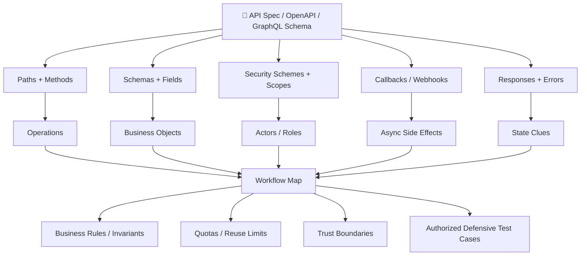
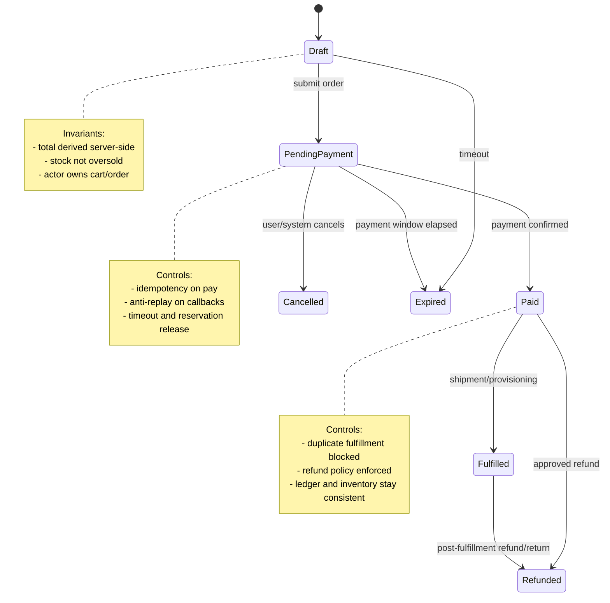

# Business Logic Analysis

> **Business logic analysis is the process of modeling what an API is supposed to allow, forbid, sequence, and remember — then verifying the implementation enforces those rules server-side.**

---

## Table of Contents

1. What Is It? (Beginner Explanation)
2. Why It Belongs in API Attack-Surface Mapping
3. Core Mental Model — APIs Are State Machines
4. Reading the API Spec Like a Workflow Document
5. A Structured Workflow for Business Logic Analysis
6. High-Value API Flows to Analyze
7. Red Flags in API Specs and Traffic
8. Authorized Defensive Test Ideas
9. A Memorable Analysis Checklist
10. Business Logic Analysis in Microservices and Async APIs
11. What Good Defenses Look Like
12. Detection and Telemetry Clues for Defenders
13. How to Document a Finding Well
14. Practical Takeaways
15. References

---

## 🧠 What Is It? (Beginner Explanation)

If **endpoint mapping** tells you *where the doors are*, **business logic analysis** tells you:

- which doors are supposed to open first,
- who is allowed to use them,
- how many times they may be used,
- what state the system must be in before and after,
- and what should happen if a flow is interrupted.

That is why business logic sits at the heart of API attack-surface work. APIs are not just collections of URLs. They are **programmable workflows** for things like:

- registering accounts,
- verifying identities,
- creating orders,
- reserving inventory,
- issuing refunds,
- granting credits,
- approving actions,
- and triggering downstream systems.

A normal parser bug breaks syntax. A business logic bug often uses **perfectly valid requests** but in a way the designers did not expect.

> **One sentence to remember:** Endpoints tell you what exists; business logic tells you what must happen before, after, and never.

---

## Why It Belongs in API Attack-Surface Mapping

This topic sits in the **attack-surface mapping** phase for a reason. Before you hunt for advanced logic vulnerabilities, you first need a map of:

1. **Actors** — anonymous user, customer, support agent, admin, partner, webhook sender, background worker
2. **Objects** — account, session, order, coupon, wallet, booking, invoice, payout, approval request
3. **States** — draft, pending, verified, paid, shipped, cancelled, refunded, expired
4. **Rules** — quantity must be positive, coupon usable once, refund requires payment, approval requires role X
5. **Side effects** — inventory reservation, email, webhook, ledger entry, queue message, notification
6. **Time constraints** — expiration, retry windows, race windows, cooldowns, daily quotas

### Attack-Surface View vs Logic View

| Mapping activity | Main question | Output |
|---|---|---|
| **Endpoint mapping** | What routes and methods exist? | URI inventory |
| **Parameter mapping** | What inputs are accepted? | Field inventory |
| **Request/response analysis** | What does each call look like? | Protocol understanding |
| **Data flow analysis** | Where does data travel? | System/data path map |
| **Business logic analysis** | What workflow rules must hold across requests? | State machine + invariants |
| **Trust boundary mapping** | Where does authority change? | Trust model |
| **Authorization matrix** | Who can do what? | Role/capability matrix |

Business logic analysis connects all of them.

---

## 🏗️ Core Mental Model — APIs Are State Machines

A practical way to analyze API business logic is to think in six linked questions:

```text
Actor → Action → Object → State → Rule → Time
```

If you can answer those six questions for a flow, you usually understand its business logic.

| Lens | What to ask | Example |
|---|---|---|
| **Actor** | Who is making this request? | User, admin, service, webhook provider |
| **Action** | What capability is being invoked? | Create, approve, redeem, cancel, refund |
| **Object** | What business object changes? | Order, seat, wallet, coupon, subscription |
| **State** | What state is the object in now? | `pending_payment`, `verified`, `fulfilled` |
| **Rule** | What invariant must remain true? | Total must be server-calculated; one refund only |
| **Time** | What changes with retries, delays, or concurrency? | Token expiry, duplicate callback, race window |

A business logic flaw usually appears when one of those controls is missing:

- the wrong **actor** can trigger an action,
- the object can move to the wrong **state**,
- a business **rule** is enforced only in the client,
- or **time** and retries create duplicate or inconsistent outcomes.

---

## 📊 Diagram — From API Spec to Business-Flow Map



---

## Reading the API Spec Like a Workflow Document

The API spec is more than a route list. It often contains the clues you need to reconstruct the business model.

### What to Extract From the Spec

| Spec artifact | Logic clue | What to ask |
|---|---|---|
| **Paths + HTTP methods** | Workflow steps and available actions | Which calls create, approve, cancel, redeem, refund, or publish? |
| **`operationId` / tags** | Business domain grouping | Which endpoints belong to the same flow? |
| **Request schemas** | User-controlled inputs | Which fields must be ignored, recomputed, or range-checked server-side? |
| **Response schemas** | State and authority clues | Do responses expose `status`, `approvedBy`, `role`, `balance`, `remainingUses`? |
| **Enums** | Hidden state machine | What transitions should be impossible? |
| **Security schemes / scopes** | Role expectations | Who may initiate vs approve vs override? |
| **Callbacks / webhooks** | Asynchronous trust edges | How are authenticity, replay, and deduplication handled? |
| **Headers** | Idempotency and concurrency controls | Is there an `Idempotency-Key`, `If-Match`, nonce, or request signature? |
| **Status codes** | Defensive intent | Do invalid transitions return `409`, `422`, or only `200`? |
| **Deprecated or versioned endpoints** | Alternate paths | Can older endpoints bypass newer workflow checks? |
| **Examples / defaults** | Developer assumptions | Are defaults safe, or do they imply hidden trust in the client? |

### A Small OpenAPI-Style Example

```yaml
paths:
  /orders:
    post:
      operationId: createOrder
  /orders/{id}/pay:
    post:
      operationId: payOrder
  /orders/{id}/cancel:
    post:
      operationId: cancelOrder
components:
  schemas:
    Order:
      type: object
      properties:
        status:
          type: string
          enum: [draft, pending_payment, paid, fulfilled, cancelled, refunded]
        total:
          type: number
        couponCode:
          type: string
```

That tiny spec fragment already gives you high-value logic questions:

- Can `cancel` happen after `fulfilled`?
- Can `pay` be replayed?
- Is `total` calculated server-side or trusted from input?
- Is `couponCode` one-time, per-user, per-order, or reusable?
- What does the API do on duplicate calls or delayed callbacks?

---

## A Structured Workflow for Business Logic Analysis

The safest and most effective approach is to model first, then validate.

### 1. Identify Sensitive Flows

OWASP API6:2023 focuses on **sensitive business flows** — flows where unrestricted or poorly controlled access can directly harm the business even without a classic technical exploit.

Common examples:

- purchase and checkout
- booking and reservation
- signup, verification, and referral
- coupon, loyalty, credit, and wallet logic
- moderation, approval, or escalation workflows
- bulk export, payout, refund, and transfer operations

### 2. Draw the Happy Path

Document the intended sequence:

```text
register → verify email → add payment method → create order → pay → fulfill → refund
```

If you cannot explain the happy path clearly, you are not ready to analyze the unhappy paths.

### 3. List the Invariants

**Invariants** are the rules that must always stay true.

Examples:

- an unpaid order must never become fulfilled,
- a coupon intended for one use must not reduce multiple orders,
- one seat should correspond to one valid reservation,
- a low-privilege user must not approve their own request,
- a webhook must not create the same business event twice.

### 4. Map Alternate Paths

For each flow, ask whether the server safely handles:

- **step skipping**,
- **step repetition**,
- **step reordering**,
- **cross-role use**,
- **cross-tenant use**,
- **stale or replayed requests**,
- **concurrent requests**,
- **recovery and rollback**.

### 5. Map Side Effects

A large percentage of API logic risk lives in the side effects, not the immediate HTTP response.

Examples:

- payment authorized but inventory not reserved,
- order cancelled but loyalty points remain,
- duplicate webhook creates duplicate shipment,
- refund issued but entitlement stays active,
- admin action logged but not actually enforced downstream.

### 6. Validate Telemetry

If a sensitive flow has no meaningful logging, deduplication, or reconciliation, it is already a risk signal.

---

## 📊 Diagram — Example Order State Machine



This is what business logic analysis tries to recover: not just endpoints, but the **allowed transitions** and the **rules attached to each transition**.

---

## High-Value API Flows to Analyze

| Flow | Core invariant | Common logic failure pattern | Defensive controls |
|---|---|---|---|
| **Registration + verification** | Unverified users should not reach verified-only actions | Verification check applied only in UI or one endpoint | Server-side verification gate on all protected transitions |
| **Password reset / invite acceptance** | Token should be single-use, scoped, and expiring | Replay, token reuse, weak binding to identity/state | Single-use tokens, state binding, expiry, audit trail |
| **Checkout / payment / refund** | Payment state must control fulfillment and refunds | Fulfillment without payment, duplicate refund, stale totals | Server-calculated totals, ledger, idempotency, reconciliation |
| **Coupon / credit / loyalty** | Benefit should apply only under defined limits | Stacking, reuse, rollback gaps, self-referral | Benefit ledger, one-time semantics, abuse scoring |
| **Reservation / booking** | One scarce resource should not be reserved inconsistently | Oversubscription, held inventory never released | Reservation TTL, lock strategy, conflict handling |
| **Approval workflows** | Initiator and approver duties remain separated | Self-approval, role confusion, alternate API path | Explicit separation-of-duties enforcement |
| **Subscription lifecycle** | Entitlements must match billing state | Cancelled account still active, downgraded plan retains premium access | Central entitlement service, periodic reconciliation |
| **Bulk import / export** | High-impact actions require policy and rate control | Low-friction mass abuse of a sensitive flow | Business-rate limiting, quotas, review gates |
| **Webhooks / async jobs** | One external event should produce one internal outcome | Duplicate callbacks, unsigned callbacks, delayed replay | Signature verification, dedupe store, event IDs |
| **Partner / internal APIs** | Internal trust should not equal full trust | Overprivileged service accounts, hidden bypass routes | Service authn/authz, scoped tokens, network + app controls |

---

## Red Flags in API Specs and Traffic

| Red flag | Why it matters |
|---|---|
| Client-submitted `total`, `price`, `discount`, `balance`, or `role` | Indicates possible server trust in caller-controlled business values |
| Writable `status`, `approved`, `verified`, `tier`, or `entitlement` fields | Signals possible state-transition or privilege issues |
| Missing `409 Conflict` / `422 Unprocessable Entity` responses | May indicate invalid workflow states are not modeled explicitly |
| `POST` endpoints for powerful actions with no visible quota/idempotency hints | Sensitive flow may be replayable or automatable |
| Separate mobile, web, and partner endpoints for the same action | One channel may enforce fewer checks |
| Deprecated or legacy endpoints still exposed | Older logic paths often miss current controls |
| Async callbacks without signature, nonce, or event ID fields | Replay and forgery risks increase sharply |
| Business objects with many optional security-sensitive properties | More room for unexpected state combinations |
| Rich admin-style actions mixed into user-facing schemas | Indicates confused boundaries between public and privileged models |
| “Best effort” compensating behavior with no reconciliation job | Failures can leave business state inconsistent |

---

## Authorized Defensive Test Ideas

This note is about **authorized, non-destructive security analysis**. The goal is to verify business rules, not to abuse real systems.

### Safe analysis themes

| Theme | Defensive question |
|---|---|
| **Sequence validation** | Does the server reject impossible step orderings? |
| **Reuse limits** | Can single-use or rate-limited actions be repeated safely? |
| **Integrity checks** | Does the server recompute sensitive values instead of trusting input? |
| **Cross-role consistency** | Do user, admin, partner, and service routes enforce the same core invariants? |
| **Concurrency handling** | Are duplicate or simultaneous requests deduplicated or serialized correctly? |
| **Rollback correctness** | If a flow fails halfway, are all spawned actions reversed or reconciled? |
| **Async trust** | Are webhooks, queues, and callbacks authenticated and replay-safe? |
| **Tenant isolation** | Can one tenant's workflow affect another tenant's state, stock, credits, or data? |
| **Observability** | Are suspicious repeats, conflicts, and state anomalies logged and detectable? |

### Especially important API-specific checks

OWASP WSTG breaks business logic testing into useful sub-areas that map well to API work:

- **data validation** — range, unit, and semantic validation
- **ability to forge requests** — server must not rely on the official client
- **integrity checks** — server recalculates and verifies business-critical values
- **process timing** — retries, races, and delayed callbacks stay safe
- **use limits** — one-time and quota-based functions remain one-time and quota-based
- **workflow circumvention** — skipping or reordering steps fails safely
- **misuse defenses** — the system recognizes and resists abuse patterns
- **payment functionality** — pricing, refunds, and settlement stay trustworthy

That list is valuable because it turns a vague idea — “test business logic” — into concrete analysis buckets.

---

## A Memorable Analysis Checklist

When reading an API spec or captured traffic, walk the flow with this mnemonic:

### **AORTA**

- **A — Actor:** who is allowed?
- **O — Object:** what business object changes?
- **R — Rule:** what must always be true?
- **T — Time:** what happens on retries, delays, and races?
- **A — Aftermath:** what side effects and logs must also be correct?

If you cannot answer all five, the flow likely needs deeper review.

---

## Business Logic Analysis in Microservices and Async APIs

Modern APIs rarely complete a business flow inside one process. A single user action may cross:

- API gateway
- auth service
- order service
- payment provider
- inventory service
- queue/stream
- notification service
- analytics or fraud engine

That architecture increases logic risk because each component may be individually correct while the **end-to-end workflow** is wrong.

### Common distributed-logic failure modes

| Failure mode | Example |
|---|---|
| **Partial success** | Payment captured, but order remains pending |
| **Duplicate side effect** | Same event processed twice after retries |
| **Out-of-order event handling** | Cancellation processed before create/confirm event settles |
| **Stale authorization context** | Old role cached and reused after privilege change |
| **Missing compensating action** | Reservation cancelled, but inventory or credits not restored |
| **Inconsistent policy enforcement** | Gateway blocks an action, internal endpoint still allows it |

### Defensive pattern to prefer

Treat workflow integrity as a **system property**, not an endpoint property.

---

## What Good Defenses Look Like

| Control | Why it helps |
|---|---|
| **Explicit server-side state machine** | Makes invalid transitions rejectable and testable |
| **Idempotency keys / event deduplication** | Prevents duplicate side effects from retries and replays |
| **Server-side recalculation of business values** | Stops trust in client-supplied totals, discounts, or roles |
| **Business-rate limits** | Limits abuse of sensitive flows, not just requests per IP |
| **Separation of public and internal models** | Prevents sensitive fields from leaking into user-controlled schemas |
| **Signed callbacks and webhook verification** | Reduces trust on external asynchronous triggers |
| **Compensating transactions and reconciliation jobs** | Repairs partial failures and drift between services |
| **Abuse-case-driven tests** | Exercises realistic misuse, not just happy-path validation |
| **Immutable audit/ledger records** | Supports detection, forensics, and financial integrity |
| **Centralized authorization and policy checks** | Reduces inconsistent enforcement across channels |

---

## Detection and Telemetry Clues for Defenders

Business logic issues often look like valid traffic, so defenders need **business-aware telemetry**, not just payload signatures.

Useful signals include:

- repeated invocation of a “single-use” action,
- unusual conflict rates around reservations or approvals,
- negative or zero-value edge cases reaching critical workflows,
- fulfillment events without matching payment state,
- rapid creation/cancellation loops,
- excessive referrals, credits, comments, or reservations from one entity,
- duplicate webhook event IDs,
- state transitions that skip expected intermediate states,
- high-value actions executed through deprecated endpoints.

A good rule of thumb: **if you can describe the business invariant, you can usually log for its violation.**

---

## How to Document a Finding Well

When business logic analysis reveals a weakness, strong reporting should capture:

1. **The intended workflow**
2. **The violated invariant**
3. **The affected actors, roles, or tenants**
4. **The resulting business impact** — fraud, denial of inventory, privilege misuse, financial loss, integrity loss
5. **The exact state mismatch** — what should have happened vs what happened
6. **The evidence that the server, not just the client, failed to enforce the rule**
7. **The fix** — policy, validation, idempotency, separation of duties, reconciliation, or state-machine enforcement

This is especially important because business logic findings are often dismissed unless the broken rule is described clearly.

---

## Practical Takeaways

- APIs expose **workflows**, not just resources.
- The API spec often contains enough clues to reconstruct the workflow.
- The highest-value logic analysis focuses on **state transitions, invariants, quotas, and side effects**.
- In distributed systems, logic flaws often emerge **between services**, not inside a single controller.
- Good defenders model abuse cases early and enforce business rules in the **server-side source of truth**.

> **If you remember only one thing:** treat every sensitive API flow as a state machine with actors, invariants, timing, and side effects. That is where business logic risk lives.

---

## 📚 References

- [OWASP Web Security Testing Guide — Business Logic Testing](https://github.com/OWASP/wstg/tree/master/document/4-Web_Application_Security_Testing/10-Business_Logic_Testing)
- [OWASP API Security Top 10 2023 — API6: Unrestricted Access to Sensitive Business Flows](https://github.com/OWASP/API-Security/blob/master/editions/2023/en/0xa6-unrestricted-access-to-sensitive-business-flows.md)
- [PortSwigger Web Security Academy — Business Logic Vulnerabilities](https://portswigger.net/web-security/logic-flaws)
- [OWASP Abuse Case Cheat Sheet (Historical)](https://github.com/OWASP/CheatSheetSeries/blob/master/cheatsheets/Abuse_Case_Cheat_Sheet.md)
- [OWASP Threat Modeling Cheat Sheet](https://cheatsheetseries.owasp.org/cheatsheets/Threat_Modeling_Cheat_Sheet.html)
