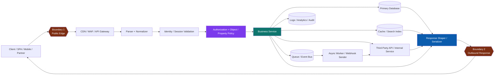
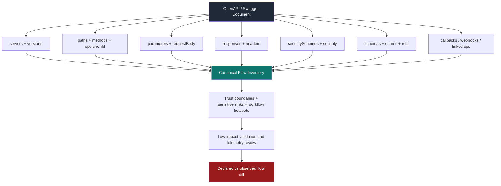
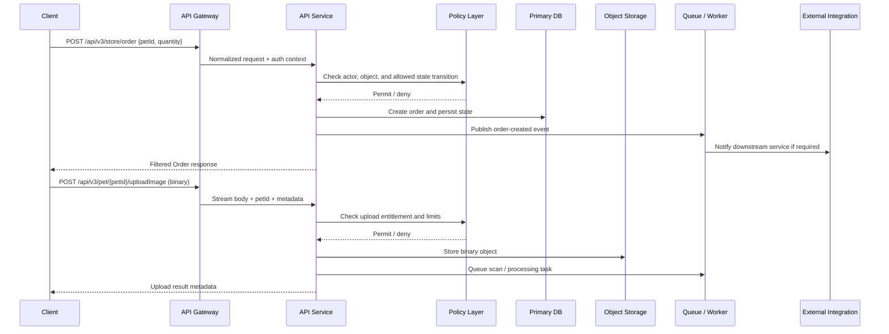

# Data Flow Analysis

> **Phase 06 — API Attack Surface Mapping**  
> **Focus:** tracing how request data, identity, object selectors, and side effects move through an API system so defenders can see where controls must exist.  
> **Safety note:** use this methodology only for systems you own or are explicitly authorized to assess. The goal is modeling, low-impact validation, and hardening — not harmful abuse.

---

**Difficulty:** Beginner → Advanced  
**Category:** API Pentesting — Attack Surface Mapping  
**Relevant risks:** OWASP API1:2023, API3:2023, API4:2023, API9:2023, API10:2023  
**Spec anchors:** OpenAPI `servers`, `paths`, `parameters`, `requestBody`, `responses`, `security`, `components.schemas`, `links`, `callbacks` / `webhooks`

---

## Table of Contents

1. [What Data Flow Analysis Means](#what-data-flow-analysis-means)
2. [Why It Matters for API Security](#why-it-matters-for-api-security)
3. [Beginner Mental Model](#beginner-mental-model)
4. [Diagram 1: The End-to-End API Data Path](#diagram-1-the-end-to-end-api-data-path)
5. [The Seven Questions of API Data Flow Analysis](#the-seven-questions-of-api-data-flow-analysis)
6. [Reading the API Spec as a Flow Map](#reading-the-api-spec-as-a-flow-map)
7. [Worked Example Using a Public OpenAPI Spec](#worked-example-using-a-public-openapi-spec)
8. [Diagram 2: From OpenAPI Document to Flow Inventory](#diagram-2-from-openapi-document-to-flow-inventory)
9. [A Safe Workflow for Authorized Testers and Defenders](#a-safe-workflow-for-authorized-testers-and-defenders)
10. [High-Value Flow Hotspots and Blind Spots](#high-value-flow-hotspots-and-blind-spots)
11. [Protocol-Specific Flow Nuances](#protocol-specific-flow-nuances)
12. [Common Failure Patterns Revealed by Data Flow Analysis](#common-failure-patterns-revealed-by-data-flow-analysis)
13. [Diagram 3: Worked Example — Order + Upload Flow](#diagram-3-worked-example--order--upload-flow)
14. [Detection and Telemetry](#detection-and-telemetry)
15. [Mitigation and Defense](#mitigation-and-defense)
16. [Data Flow Analysis Checklist](#data-flow-analysis-checklist)
17. [References](#references)

---

## What Data Flow Analysis Means

**Data flow analysis** is the practice of following data through an API system from its **source**, through every **decision point** and **transformation**, to every **sink** where it is stored, forwarded, rendered, or returned.

In API work, that means you do not just ask:

- which endpoint exists
- which parameters it accepts
- which method it uses

You also ask:

- which field selects the target object
- which identity is attached to the request
- which policy decides whether the request is allowed
- which downstream systems receive a copy of the data
- which fields are persisted, transformed, enriched, cached, queued, logged, or returned

A simple memory hook is:

```text
Data flow = source → selector → decision → transformation → sink → response
```

### What counts as “data” in an API flow?

A beginner mistake is to think only about the JSON body.

For security review, **all of these are part of the flow**:

| Data element | Example | Why it matters |
|---|---|---|
| **Path parameters** | `/users/{userId}` | Often select the target object for BOLA-style review |
| **Query parameters** | `?tenant=acme&status=pending` | Can alter scope, filtering, and resource cost |
| **Headers** | `Authorization`, `X-Tenant-ID`, `X-Forwarded-For` | Can change identity, routing, or policy context |
| **Cookies / session IDs** | session cookie, CSRF token | Carry authentication and state |
| **Request body fields** | `email`, `role`, `quantity`, `status` | Can create, update, or over-post sensitive properties |
| **Binary uploads** | images, PDFs, protobuf payloads | Follow different parsing, storage, and scanning paths |
| **Response bodies** | JSON objects, files, streams | Can leak sensitive fields or inconsistent state |
| **Response headers** | rate-limit headers, token expiry headers | Carry control metadata clients may trust |
| **Async payloads** | webhook events, queue messages | Extend the flow beyond the original response |
| **Logs / traces / analytics** | structured logs, audit events | Create extra sinks for sensitive data |

### The core security idea

APIs rarely fail because a single field is “bad.”

They fail because **the same field crosses multiple layers with inconsistent assumptions**.

Examples:

- an object ID reaches the data layer before object-level authorization happens
- a writable field reaches an ORM model before allowlisting happens
- a partner API response reaches business logic before schema validation happens
- a file reaches storage before scanning, type validation, or quota checks happen

That is exactly why data flow analysis belongs inside **attack-surface mapping**, not only inside exploitation.

---

## Why It Matters for API Security

Modern APIs are not just request/response functions. They are **distributed data pipelines**.

A single request may pass through:

- a CDN or API gateway
- an authentication service
- an authorization engine
- one or more backend services
- a cache
- a primary database
- a search index
- a queue or event bus
- a third-party API
- a webhook receiver or callback
- a serializer that shapes the response back to the client

That means the real attack surface is not only the edge route. It is the **entire path the data takes after crossing the edge**.

### Why public guidance keeps pointing here

Several public sources converge on the same lesson:

- **OWASP Threat Modeling Cheat Sheet** says data flow diagrams are one of the most common modeling approaches and should clearly show **trust boundaries, data flows, data stores, processes, and external entities**.
- **OWASP API Security Top 10 2023** repeatedly ties risk to poor visibility of objects, properties, inventory, third-party data, and business flows.
- **OpenAPI Specification** says a properly defined API description lets humans and tools understand API capabilities without source code or traffic inspection. That makes the spec a powerful starting point for flow mapping.
- **NIST SP 800-207** emphasizes that no implicit trust should be granted based solely on network location. In API terms, internal hops are still part of the security model.
- **RFC 9110** reminds us HTTP includes not only origin servers, but also intermediaries, representations, and control data — all relevant to data movement.

### Without vs. With Data Flow Analysis

| Situation | What the team sees | What gets missed |
|---|---|---|
| **Only endpoint inventory** | Route exists | What object it selects, what it writes, and who else receives the data |
| **Only parameter mapping** | Fields accepted by the edge | Whether downstream services trust extra or transformed fields |
| **Only auth review** | Token is required | Whether object, property, and workflow checks happen later |
| **Only response review** | Current output looks safe | Hidden downstream copies in logs, queues, or third-party calls |
| **Data flow analysis done well** | End-to-end lineage of identifiers, business fields, trust decisions, storage, fan-out, and response shaping | Far fewer blind spots |

### The security connection to specific OWASP API risks

| Risk | What data flow analysis helps uncover |
|---|---|
| **API1: Broken Object Level Authorization** | Object selectors reaching data access without per-object policy checks |
| **API3: Broken Object Property Level Authorization** | Sensitive fields being accepted, persisted, or returned without field-level control |
| **API4: Unrestricted Resource Consumption** | Expensive flows, fan-out, large uploads, search amplification, retry storms |
| **API9: Improper Inventory Management** | Undocumented versions, hidden hosts, shadow integrations, untracked data sharing |
| **API10: Unsafe Consumption of APIs** | Third-party or internal API responses trusted too early or too broadly |

---

## Beginner Mental Model

Think of an API like an **airport baggage system**.

- The **traveler** is the client.
- The **bag tag** is the identifier: `userId`, `orderId`, `tenantId`, `sessionId`.
- The **security checkpoint** is authentication and authorization.
- The **sorting belts** are service-to-service calls and message queues.
- The **storage room** is the database, object store, cache, or log pipeline.
- The **claim belt** is the response sent back to the client.

The important lesson is this:

> **A bag that enters the airport does not go straight to the plane. It passes through several checkpoints, transfers, and storage areas. API data behaves the same way.**

If one checkpoint assumes another checkpoint already validated something, security gaps appear.

### Four things you should trace every time

When analyzing any API request, trace these four tracks together:

1. **Identity flow** — who is the caller, and how is that identity propagated?
2. **Object flow** — which object or tenant is selected by the request?
3. **Data flow** — which fields enter, change, persist, or leave the system?
4. **Control flow** — which policy, rate, business-rule, or workflow decisions are applied?

If you only trace one of those four, your map will be shallow.

---

## Diagram 1: The End-to-End API Data Path



### What this diagram teaches

A single HTTP request can create several distinct data paths:

- **synchronous read path** → request selects an object, service reads data, serializer returns a view
- **synchronous write path** → request updates state in a database or object store
- **async side-effect path** → request publishes an event, later consumed elsewhere
- **integration path** → request triggers outbound communication to another service
- **observability path** → request metadata and payload fragments enter logs and traces

That is why “the endpoint” is never the whole story.

---

## The Seven Questions of API Data Flow Analysis

A reliable map comes from asking the same questions for every important operation.

| Question | What to identify | Example clues |
|---|---|---|
| **1. What is the source?** | Where data first enters this flow | path param, query param, JWT claim, request body, file upload, webhook payload |
| **2. What selects the target?** | Which field determines object, tenant, or business scope | `userId`, `orderId`, `accountNumber`, search filter, GraphQL variable |
| **3. Where is trust decided?** | Which layer performs authn/authz/policy | gateway, middleware, service code, database row filter, resolver policy |
| **4. What transformations occur?** | Validation, coercion, enrichment, serialization, defaults, ORM binding | schema parser, DTO mapping, ORM model bind, template render |
| **5. Where does the data persist?** | Any durable or semi-durable sink | SQL row, cache entry, file store, queue, analytics event |
| **6. Who else receives a copy?** | Downstream or third-party fan-out | webhook target, fraud API, search index, audit service |
| **7. What returns to the caller?** | Response body, headers, status codes, errors | JSON object, download, redirect, `X-Rate-Limit`, verbose stack trace |

### A compact notation you can reuse

```text
Operation = source + selector + trust decision + transformation + sinks + return path
```

For example:

```text
PATCH /v2/accounts/{accountId}
= path accountId + body fields + user token
→ object authorization
→ field allowlist + validation
→ DB write + audit event + CRM sync
→ filtered response to caller
```

That one line is already much more useful than a path list alone.

---

## Reading the API Spec as a Flow Map

The OpenAPI Specification describes an API in a way that humans and tools can understand without reading source code or passively observing network traffic. That is exactly why it is so useful for data flow analysis.

The key mindset is:

> **An API spec is not just a route list. It is a partial data-flow map.**

### What the spec can tell you

| Spec element | Flow clue | Why it matters |
|---|---|---|
| `servers` | Environments and base URLs | Helps separate prod, beta, partner, and internal flow paths |
| `paths` + methods | Entry points and callable operations | Starting nodes for the flow graph |
| `parameters` | Selectors and controls | Shows path/query/header/cookie data entering the flow |
| `requestBody` | Writable payloads and content types | Shows ingress structure and parser paths |
| `responses` | Return shapes and error behaviors | Shows what leaves the system |
| `components.schemas` | Object models and field relationships | Helps identify sensitive, writable, or derived fields |
| `securitySchemes` + `security` | Intended trust model | Reveals auth context expected for each flow |
| `links` | Declared operation relationships | Useful for modeling flow chaining |
| `callbacks` / `webhooks` | Outbound or event-driven paths | Expands the flow beyond the original request/response |
| `tags`, `operationId`, descriptions | Business context | Helps group operations into workflows |
| examples / headers | Realistic values and control metadata | Highlights IDs, rate limits, expirations, locations |

### What the spec cannot prove by itself

A spec usually shows **intended** behavior, not complete runtime truth.

It does **not** prove:

- whether authorization is actually enforced the way the spec implies
- whether deprecated versions are still deployed elsewhere
- whether internal services or queues exist behind an operation
- whether logs, analytics, and caches store more than the spec suggests
- whether clients or workers use the data safely after receipt

So the rule is:

```text
Spec = declared flow
Traffic + telemetry = observed flow
Diff between them = risk
```

### Spec-reading habits that improve flow analysis

1. Start with `servers` and versioning.
2. List every operation and its selectors.
3. Mark which fields are client-controlled.
4. Mark which fields look security-sensitive or workflow-sensitive.
5. Note content types, especially binary and multipart inputs.
6. Note response headers and examples.
7. Mark callbacks, webhooks, or links to other operations.
8. Compare the declared model with observed traffic and logs.

---

## Worked Example Using a Public OpenAPI Spec

To keep this note safe and reproducible, use the public **Swagger Petstore OpenAPI 3.0.4** document as a harmless example.

### Small excerpt from the public spec

```yaml
openapi: 3.0.4
servers:
  - url: /api/v3
paths:
  /pet/{petId}:
    get:
      operationId: getPetById
      parameters:
        - name: petId
          in: path
          schema:
            type: integer
      security:
        - api_key: []
        - petstore_auth: [write:pets, read:pets]
  /pet/{petId}/uploadImage:
    post:
      operationId: uploadFile
      parameters:
        - name: petId
          in: path
          schema:
            type: integer
      requestBody:
        content:
          application/octet-stream:
            schema:
              type: string
              format: binary
  /store/order:
    post:
      operationId: placeOrder
      requestBody:
        content:
          application/json:
            schema:
              $ref: '#/components/schemas/Order'
components:
  schemas:
    Order:
      properties:
        petId:
          type: integer
        quantity:
          type: integer
        status:
          type: string
          enum: [placed, approved, delivered]
```

### What a defender can extract immediately

| Spec clue | Flow meaning | Defensive review question |
|---|---|---|
| `servers: /api/v3` | The API has an explicit versioned base path | Do older versions or alternate hosts still point at the same stores? |
| `petId` in the path | The route selects an object directly from client input | Does every operation enforce object-level authorization at the business layer? |
| Two security options on `GET /pet/{petId}` | One operation may accept different auth contexts | Are object and response rules consistent across all auth modes? |
| `application/octet-stream` on upload | Binary data follows a distinct parser and storage path | Are there size limits, scanning, type checks, and storage segregation? |
| `Order.status` enum | Status is part of the business state machine | Which actor is allowed to move an order between states? |
| Request body for `/store/order` | Client controls business fields that may trigger downstream actions | Which fields are authoritative, recomputed, or ignored server-side? |

### Add one more clue from the same public spec

The Petstore login route returns headers such as `X-Rate-Limit` and `X-Expires-After`.

That matters because **response headers are also data flow**. They are control signals clients may act upon, log, cache, or misunderstand.

### The key lesson from the example

Even a simple public spec already exposes four different flow types:

1. **object retrieval flow** — `GET /pet/{petId}`
2. **binary upload flow** — `POST /pet/{petId}/uploadImage`
3. **business transaction flow** — `POST /store/order`
4. **control-metadata flow** — login responses carrying rate and expiry headers

That is enough to prioritize defensive review before any deep runtime testing.

---

## Diagram 2: From OpenAPI Document to Flow Inventory



### A practical output format

A useful flow inventory row often looks like this:

| Field | Example |
|---|---|
| `operation` | `POST /api/v3/store/order` |
| `source_fields` | `petId, quantity, complete` |
| `selectors` | `petId` |
| `auth_context` | `user token` |
| `transformations` | `schema validation, defaulting, state initialization` |
| `sinks` | `orders table, inventory table, audit event` |
| `downstreams` | `queue, billing service` |
| `response_view` | `Order summary JSON` |
| `telemetry` | `gateway log, order audit log, trace span, event ID` |

That converts a static spec into a security-useful ledger.

---

## A Safe Workflow for Authorized Testers and Defenders

The safest and most effective approach is **spec-first, low-impact, evidence-driven**.

### Phase 1 — Build the declared flow map

Start from approved sources:

- OpenAPI / Swagger
- Postman collections
- GraphQL schema docs
- `.proto` files or reflection output
- internal design docs and sequence diagrams
- gateway route tables and service ownership data

At this stage, do not guess implementation details. Record what is declared.

### Phase 2 — Normalize the callable units

Normalize by protocol:

| Protocol | Useful unit |
|---|---|
| **REST** | method + canonical path |
| **GraphQL** | operation type + root field(s) + important variables |
| **gRPC** | service + method + message schema |
| **WebSocket** | handshake route + message action/event type |
| **Webhook receiver** | receiver path + event type + verification logic |

### Phase 3 — Trace high-value fields

For every important operation, mark:

- object selectors
- tenant selectors
- role or scope indicators
- state fields such as `status`, `approved`, `complete`, `verified`
- file, URL, redirect, callback, and integration fields
- search, pagination, bulk, and export controls

### Phase 4 — Add the runtime evidence

Now enrich the declared map with observed data from approved sources:

- proxy history
- browser/mobile traffic
- traces and metrics
- access logs
- queue/event telemetry
- audit logs

The goal is not noisy collection. The goal is to answer:

```text
What really happened to this data after it entered the system?
```

### Phase 5 — Mark trust boundaries and sinks

For each flow, mark where:

- identity is established or changed
- authorization is decided
- data is persisted
- data is copied elsewhere
- data is sent outside the trust domain
- a different serializer or parser is used

### Phase 6 — Compare declared and observed reality

Look for three especially important mismatches:

| Mismatch | Why it matters |
|---|---|
| **Documented but not observed** | May be stale, dormant, admin-only, or forgotten surface |
| **Observed but undocumented** | Strong signal for shadow API or drift |
| **Observed fan-out not documented** | Indicates hidden integrations, logging sinks, or queue paths |

### Safe local parsing example

Using a public spec or an approved local copy, derive a first-pass flow inventory without touching the live application logic.

```bash
curl -s https://petstore3.swagger.io/api/v3/openapi.json \
| jq -r '
    .paths
    | to_entries[]
    | .key as $path
    | .value
    | to_entries[]
    | [
        (.key | ascii_upcase),
        $path,
        (.value.operationId // "-"),
        ((.value.parameters // []) | map("\(.in):\(.name)") | join(",")),
        ((.value.requestBody.content // {}) | keys | join(",")),
        ((.value.responses // {}) | keys | join(",")),
        ((.value.security // []) | map(keys | join("+")) | join(";"))
      ]
    | @tsv
  '
```

### Why this is useful

This gives you a structured list of:

- operations
- selectors
- input types
- response shapes
- security hints

That is enough to start a data-flow review **without performing disruptive actions**.

---

## High-Value Flow Hotspots and Blind Spots

Not every data path deserves the same attention. Some flow shapes create outsized security risk.

| Hotspot | Why it is high-value | Typical blind spot |
|---|---|---|
| **Object selectors** | Decide which record is touched | Authn exists, but per-object policy is missing |
| **Writable business fields** | Can change money, status, entitlement, or workflow | Client fields are bound too early or too broadly |
| **Response shaping** | Determines what data leaves the system | Internal fields accidentally serialized |
| **Binary and multipart inputs** | Follow alternate parsing and storage paths | File is stored before scanning or quota checks |
| **Third-party API responses** | Cross an external trust boundary | Upstream data trusted more than browser input |
| **Async events / webhooks** | Extend the flow after the response | Teams forget replay, duplication, or extra sinks |
| **Versioned hosts and beta paths** | Old routes may share live data | Inventory shows current version only |
| **Caches / search indexes / logs** | Create extra copies of data | Sensitive fields persist beyond the main response path |

### A useful way to score hotspot priority

Score each flow using these lenses:

| Lens | High-risk example |
|---|---|
| **Sensitivity** | PII, tokens, secrets, financial state, admin objects |
| **Breadth** | Bulk export, batch update, search, list-all, wildcard query |
| **Mutability** | Create/update/delete/approve/refund flows |
| **Fan-out** | Queue + third-party + audit + cache all receive copies |
| **Opacity** | No logging, weak ownership, undocumented integration |
| **Longevity** | Deprecated but still deployed version |

The most important flows are usually not the most technically fancy ones. They are the ones that move **sensitive data across several boundaries**.

---

## Protocol-Specific Flow Nuances

Different API styles hide their flow differently.

| Protocol | What looks simple | What is actually important to trace |
|---|---|---|
| **REST** | `GET /users/{id}` | path IDs, query filters, body fields, serializers, headers, caching |
| **GraphQL** | single `/graphql` endpoint | operation name, root fields, variables, resolver chain, field-level authorization |
| **gRPC** | one TCP service and protobuf messages | metadata headers, service/method, unary vs streaming, message-to-object mapping |
| **WebSocket** | one handshake route | per-message actions, subscriptions, channel scope, server push |
| **Webhook receiver** | one callback path | signature verification, replay keys, event type, retry handling, downstream triggers |

### REST

REST data flows often look explicit, but teams still miss:

- selectors hidden in nested JSON or query filters
- differences between `PUT` and `PATCH`
- response headers that carry security-relevant control data
- caching layers serving data shaped for the wrong audience

### GraphQL

GraphQL compresses many data flows behind one URL.

The real flow units are:

- operation name
- variables
- resolver chain
- requested fields
- field-level authorization and filtering

A single mutation can touch several object types and publish side effects long after the HTTP response returns.

### gRPC

gRPC flows often hide risk in places web testers forget to map:

- metadata-based auth context
- protobuf message defaults and optional fields
- internal service-to-service identity
- streaming flows where authorization must be re-evaluated over time

### WebSockets and event-driven APIs

For WebSockets, the handshake is only the door.

The real data flow lives in:

- message types
- subscriptions
- per-message authorization
- broadcast scope
- retention of pushed events or presence data

### Webhooks

Webhook flows are especially important because they cross both **network** and **business trust** boundaries.

You should map:

- who is allowed to send the event
- how authenticity is verified
- where the payload is persisted
- which downstream action it triggers
- how duplicate or delayed events are handled

---

## Common Failure Patterns Revealed by Data Flow Analysis

Data flow analysis is valuable because many different vulnerability classes create the **same structural smell**: data crosses a boundary before the right control happens.

| Failure pattern | What the flow looks like | Associated risk |
|---|---|---|
| **Selector reaches data access too early** | `userId`, `orderId`, or `tenantId` goes straight into lookup logic | API1 / object-level authorization failure |
| **Writable field reaches internal object too early** | client-supplied properties bind directly to domain model | API3 / mass-assignment-style failure |
| **Response generated from raw internal model** | serializer exposes fields never meant for the caller | API3 / excessive exposure |
| **Outbound trust happens too early** | third-party response used before validation | API10 / unsafe consumption |
| **Fan-out happens without governance** | same data copied to queue, logs, analytics, partner | API9 / data-flow blind spot |
| **Expensive path lacks cost control** | search, export, upload, or callback chain consumes large resources | API4 / resource consumption |
| **Old version shares same sink** | `/v1` and `/v3` hit the same data but only one is protected well | API9 / inventory + version drift |
| **Async worker assumes edge validation already happened** | queue consumer trusts producer payload blindly | authorization, integrity, and replay issues |

### A powerful review question

For every important field, ask:

```text
Where is the earliest point this field could cause harm,
and is the right control already in place before that point?
```

That one question catches a surprising number of real issues.

### Example failure chains

| Field type | Bad assumption | Result |
|---|---|---|
| `accountId` | “The caller is authenticated, so the ID must be theirs.” | Cross-account access |
| `role` | “The client UI would never send an admin role.” | Unauthorized privilege change |
| `status` | “Only the official app can move objects between states.” | Workflow abuse |
| partner response body | “It came from a trusted vendor.” | Injection, bad decisions, or data leakage |
| file upload metadata | “The content type header is accurate.” | Unsafe parser or storage path |
| `beta-api` host | “Only the latest gateway path matters.” | Shadow surface with weaker controls |

---

## Diagram 3: Worked Example — Order + Upload Flow



### What this example shows

Even in a relatively simple API, one request can involve:

- a selector (`petId`)
- an auth context
- a policy decision
- a stateful sink (database or object store)
- an asynchronous side effect
- a filtered response back to the caller

That is the minimum useful level of detail for security-focused data flow analysis.

---

## Detection and Telemetry

A mature data-flow review is much stronger when each step has matching telemetry.

| Flow stage | Useful evidence |
|---|---|
| **Edge / gateway** | request ID, host, route, method, status, auth outcome, rate decision |
| **Parser / validation** | schema failures, rejected content types, body size violations |
| **Authorization layer** | object/property/function policy decisions |
| **Business service** | operation name, actor, tenant, object, state transition |
| **Database / persistence** | audit trail, changed fields, data classification tags |
| **Queue / async worker** | event ID, deduplication key, retry count, producer identity |
| **Outbound integration** | destination allowlist hit, timeout, redirect block, response validation result |
| **Response shaping** | serialized view name, redaction path, field filtering metrics |

### What good telemetry enables

Good telemetry makes it possible to answer:

- which version and host handled the request
- which object and tenant were targeted
- whether the authorization decision actually happened
- whether the request fanned out to external systems
- whether the response view matched the caller’s role
- whether deprecated or shadow flows are still in use

### Correlation IDs matter

Without stable correlation IDs, data flow analysis becomes guesswork.

At minimum, important flows should be traceable across:

- gateway log
- application log
- audit event
- async event
- outbound integration log

That turns data flow mapping from theory into operations.

---

## Mitigation and Defense

Good defense means making the intended flow **explicit, narrow, and observable**.

### Defensive principles

| Principle | What it looks like in practice |
|---|---|
| **Validate early** | Parse and validate structure before business logic |
| **Authorize on the real object** | Check object, tenant, function, and property permissions at the point of use |
| **Transform into safe internal models** | Never bind raw client input directly to domain objects |
| **Filter responses explicitly** | Serialize only approved fields for the caller’s context |
| **Constrain outbound trust** | Validate third-party responses, destinations, redirects, sizes, and timeouts |
| **Track fan-out** | Inventory queues, webhooks, analytics, and partner data sharing |
| **Version intentionally** | Apply protections to all exposed versions and retire old ones quickly |
| **Instrument the path** | Log policy decisions, sinks, and outbound calls with correlation IDs |

### Secure implementation sketch

```js
const createOrderSchema = z.object({
  petId: z.number().int().positive(),
  quantity: z.number().int().positive().max(50)
}).strict();

app.post('/api/v3/store/order', async (req, res) => {
  const input = createOrderSchema.parse(req.body);

  const allowed = await policy.canCreateOrder({
    actorId: req.user.id,
    petId: input.petId,
    tenantId: req.user.tenantId
  });

  if (!allowed) {
    return res.status(403).json({ error: 'forbidden' });
  }

  const order = await orderService.create({
    petId: input.petId,
    quantity: input.quantity,
    actorId: req.user.id
  });

  audit.log('order.create', {
    requestId: req.id,
    actorId: req.user.id,
    orderId: order.id
  });

  res.status(201).json(orderView(order));
});
```

### Why this helps

This pattern narrows the flow:

- only approved fields enter the internal model
- authorization is evaluated on the actual object
- auditing is tied to the same request
- the response is shaped through a dedicated view function

### Defensive questions for third-party or internal upstream data

When consuming another API’s response, ask:

1. **Who are we really talking to?**
2. **Do we validate the response schema and semantics?**
3. **Do we block unsafe redirects and unapproved destinations?**
4. **Do we enforce size limits and timeouts?**
5. **What happens if the upstream lies, fails, or drifts?**

### Configuration habits that reduce flow surprises

- generate and publish API documentation from source-controlled contracts
- attach data classification to important schemas and fields
- tag operations with owners and environments
- require explicit review for new callbacks, webhooks, or third-party fan-out
- maintain retirement dates for all published versions
- avoid sending production data through weaker non-production deployments

---

## Data Flow Analysis Checklist

Use this checklist when documenting or reviewing an API flow.

- [ ] Identify the **callable unit**: route/method, GraphQL operation, gRPC method, WebSocket action, or webhook event.
- [ ] Record every **source of input**: path, query, header, cookie, body, file, token claim, or upstream API response.
- [ ] Mark the **object or tenant selectors**.
- [ ] Mark where **authentication** is established and where **authorization** is re-evaluated.
- [ ] Record every important **transformation**: validation, coercion, defaults, ORM binding, serialization, enrichment.
- [ ] Record every **sink**: database, cache, object storage, queue, analytics, logs, outbound API.
- [ ] Record the **response view** and any sensitive headers.
- [ ] Compare **declared flow** from the spec with **observed flow** from traffic and telemetry.
- [ ] Check whether **old versions, beta hosts, or internal routes** share the same sinks.
- [ ] Check whether **async workers and integrations** trust input too broadly.
- [ ] Verify there is enough telemetry to follow the flow end-to-end with a correlation ID.
- [ ] Document ownership, environment, and retirement plan for every important flow.

### Final mental model

```text
Good API data flow analysis is not “where can I send a request?”
It is “where does the request's data go, who trusts it, who can change it,
and who receives a copy before the system is done with it?”
```

---

## References

- [OWASP API Security Top 10 (2023)](https://owasp.org/API-Security/editions/2023/en/0x11-t10/)
- [OWASP API1:2023 — Broken Object Level Authorization](https://owasp.org/API-Security/editions/2023/en/0xa1-broken-object-level-authorization/)
- [OWASP API3:2023 — Broken Object Property Level Authorization](https://owasp.org/API-Security/editions/2023/en/0xa3-broken-object-property-level-authorization/)
- [OWASP API9:2023 — Improper Inventory Management](https://owasp.org/API-Security/editions/2023/en/0xa9-improper-inventory-management/)
- [OWASP API10:2023 — Unsafe Consumption of APIs](https://owasp.org/API-Security/editions/2023/en/0xaa-unsafe-consumption-of-apis/)
- [OWASP Threat Modeling Cheat Sheet](https://cheatsheetseries.owasp.org/cheatsheets/Threat_Modeling_Cheat_Sheet.html)
- [Swagger / OpenAPI Specification](https://swagger.io/specification/)
- [Swagger Petstore OpenAPI 3.0.4 Example Spec](https://petstore3.swagger.io/api/v3/openapi.json)
- [NIST SP 800-207 — Zero Trust Architecture](https://csrc.nist.gov/pubs/sp/800/207/final)
- [RFC 9110 — HTTP Semantics](https://datatracker.ietf.org/doc/html/rfc9110)
