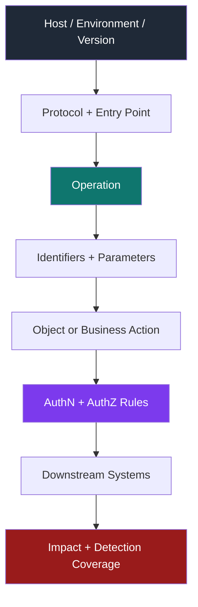
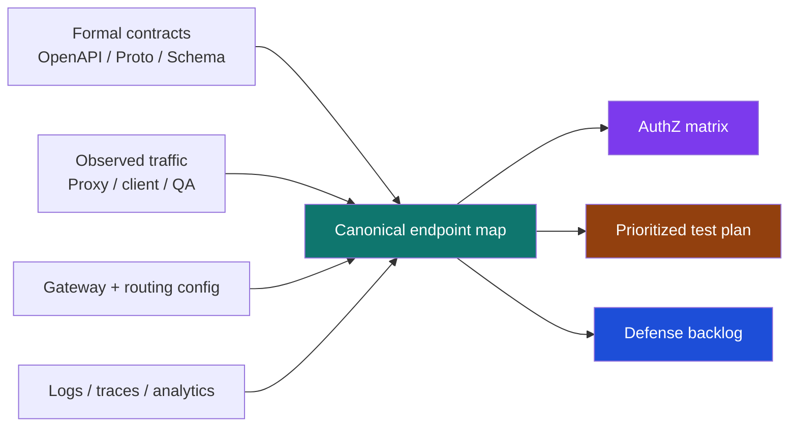

# Endpoint Mapping

> **Difficulty:** Beginner → Advanced | **Category:** API Pentesting  
> **Use case:** Authorized API security testing, API inventory building, and attack-surface reduction

**Endpoint mapping** is the process of turning a raw list of paths, hosts, and requests into a model of how an API actually works: **which identities can call which operations, against which objects, through which trust boundaries, with which downstream effects**.

For API security work, this is the bridge between **endpoint discovery** and **real testing**. Discovery tells you that something exists. Endpoint mapping tells you **what it does, who can reach it, what data it touches, and why it matters**.

> **Defensive framing:** This note is for **authorized** assessment and hardening. The goal is to build a precise inventory, reduce blind spots, and prioritize validation safely — not to provide abuse playbooks.

---

## Table of Contents

1. [Why Endpoint Mapping Matters](#why-endpoint-mapping-matters)
2. [Mental Model — From Route to Risk](#mental-model--from-route-to-risk)
3. [Core Terminology](#core-terminology)
4. [The Right Unit of Mapping](#the-right-unit-of-mapping)
5. [Where Good Endpoint Maps Come From](#where-good-endpoint-maps-come-from)
6. [Building a Canonical Endpoint Inventory](#building-a-canonical-endpoint-inventory)
7. [Authorized Endpoint Mapping Workflow](#authorized-endpoint-mapping-workflow)
8. [Protocol-Specific Mapping Patterns](#protocol-specific-mapping-patterns)
9. [Prioritizing the Map](#prioritizing-the-map)
10. [Worked Example — Commerce API](#worked-example--commerce-api)
11. [Common Mapping Errors](#common-mapping-errors)
12. [Defensive Uses of the Endpoint Map](#defensive-uses-of-the-endpoint-map)
13. [Endpoint Mapping Checklist](#endpoint-mapping-checklist)
14. [References](#references)

---

## Why Endpoint Mapping Matters

API security failures are usually not caused by “mystery routes.” They are caused by **poorly understood legitimate routes**:

- object IDs that are trusted too broadly
- admin functions mixed into normal API shapes
- old versions left online
- partner or internal paths exposed through the same edge
- webhook receivers and callback handlers omitted from inventory
- single-endpoint protocols like GraphQL or WebSockets hiding many distinct actions

OWASP API Security Top 10 (2023) makes this explicit:

- **API1** and **API5** depend on understanding which operations touch which objects and functions.
- **API3** depends on understanding which **properties** of an object are exposed or writable.
- **API9** emphasizes that outdated or incomplete API inventory creates a **documentation blind spot** and expands attack surface.

The OpenAPI Specification makes the same point from an engineering angle: when an API is properly described, humans and tools can understand its capabilities **without reading source code or inferring everything from traffic**. In practice, that means a good endpoint map should combine:

1. **formal contracts** — OpenAPI, Postman collections, `.proto`, schema docs
2. **observed behavior** — proxy traffic, client calls, gateway analytics, traces
3. **security meaning** — identities, authorization scope, sensitive data, downstream effects

### Without Mapping vs With Mapping

| Situation | What the tester/defender sees | What gets missed |
|---|---|---|
| **Only path discovery** | `/api/v1/users/{id}` exists | Whether it reads PII, accepts cross-tenant IDs, or bypasses the gateway |
| **Only documentation review** | The happy-path contract | Undocumented versions, beta hosts, drift, operational toggles |
| **Only traffic observation** | What one client currently uses | Dormant operations, admin-only flows, webhook/event paths |
| **Endpoint mapping done well** | Route + method + identity + object + trust boundary + data sensitivity + telemetry | Far fewer blind spots; much better prioritization |

> **Mental rule:** Do not count pages. Do not count only URLs. Count **callable operations** and the **data/actions each operation unlocks**.

---

## Mental Model — From Route to Risk



When mapping an endpoint, ask these questions in order:

1. **Where is it exposed?** Host, version, environment, protocol, gateway path
2. **What is the callable unit?** REST operation, GraphQL mutation, gRPC method, WebSocket message type, webhook event
3. **What selects the target object?** Path ID, tenant ID, query filter, body field, resolver argument, message field
4. **What trust decision should happen?** Authentication, object-level authorization, function-level authorization, property filtering
5. **What happens if the call succeeds?** Data disclosure, state change, third-party effect, cost/resource consumption, audit trail

This order matters because **risk is rarely attached to the URL alone**. It is attached to the **operation + object + identity + side effect** combination.

---

## Core Terminology

| Term | Meaning | Example | Why it matters |
|---|---|---|---|
| **Host** | The network location exposing the API | `api.example.com`, `beta-api.example.com` | Old hosts often survive after version migrations |
| **Route / Path** | URL path template | `/v2/accounts/{accountId}` | Paths must be normalized or inventories explode with duplicates |
| **Method** | HTTP verb or equivalent action indicator | `GET`, `POST`, `PATCH` | Same path with different methods can have different risk |
| **Operation** | The actual callable function | `getAccount`, `createTransfer`, `IssueRefund` | Best unit for ownership, logging, and testing |
| **Object** | Resource or business entity touched | `Account`, `Invoice`, `Ticket`, `User` | Object mapping drives BOLA/BOPLA thinking |
| **Action** | What the operation does | `read`, `search`, `create`, `approve`, `export` | State-changing actions deserve extra focus |
| **Identity** | Who or what calls it | end user, admin, partner, service account | “Authenticated” is not enough; scope matters |
| **Trust boundary** | Where control changes hands | client → gateway → service → third party | Bugs often hide where policy shifts |
| **Canonical path** | Template form of a path | `/users/{userId}` instead of `/users/42` | Enables deduplication and role analysis |
| **Source of truth** | Evidence used to record the operation | OpenAPI, gateway logs, proxy history | Every map entry should be traceable |

### Endpoint Anatomy Example

| Layer | Example value |
|---|---|
| Environment | `production` |
| Host | `api.example.com` |
| Protocol | `REST` |
| Operation | `PATCH /v2/accounts/{accountId}` |
| Object | `Account` |
| Action | `update profile` |
| Selectors | `accountId`, body fields `email`, `phone`, `marketingOptIn` |
| Identity types | customer token, support token |
| Controls expected | JWT validation, object-level authorization, field allowlist |
| Sensitive fields nearby | email, phone, KYC status |
| Downstreams | CRM sync, audit log, notification queue |

---

## The Right Unit of Mapping

One of the biggest API mistakes is using the word **endpoint** too loosely.

For REST, the security unit is often **method + canonical path**. For GraphQL, one HTTP path can hide hundreds of effective operations. For gRPC, the useful unit is **service/method**. For WebSockets, the handshake path is not enough; the real surface is in **message types/actions**.

| Protocol | User-visible entry point | Real security unit to map | Extra things to record |
|---|---|---|---|
| **REST / HTTP API** | `/v2/users/{id}` | method + canonical path + operationId | versioning, path params, query filters, idempotency |
| **GraphQL** | `/graphql` | operation type + operation name + root field/resolver set | introspection posture, persisted queries, field sensitivity |
| **gRPC** | `api.example.com:8443` | service + method | unary vs streaming, reflection, message schema, transport auth |
| **WebSocket / SSE** | `/ws`, `/stream` | handshake route + message action/event type | subscription scope, per-message authorization, channel identity |
| **Webhook receiver** | `/webhooks/provider-x` | receiver path + event type + verification logic | signature validation, replay protection, retry semantics |

> **Important:** A single `/graphql` or `/ws` URL can represent a larger attack surface than dozens of REST paths. Map the **callable action**, not just the transport address.

---

## Where Good Endpoint Maps Come From

A strong map is built from **multiple evidence sources**. Every source is incomplete by itself.

| Source | What it reveals well | Strengths | Blind spots | Best defensive use |
|---|---|---|---|---|
| **OpenAPI / Swagger** | documented HTTP paths, methods, schemas, tags, security schemes, webhooks | formal, parseable, CI-friendly | may omit deprecated, internal, or drifted routes | baseline inventory and contract diffing |
| **Gateway / ingress config** | externally exposed hosts, route prefixes, auth and rate policies | closest to edge reality | may not show direct-to-service bypass paths | validate exposure boundaries |
| **Proxy history / captured traffic** | what real clients actually call | shows headers, tokens, errors, sequence | only what was exercised | enrich happy-path behavior |
| **Mobile/web client code** | hidden routes, feature-flagged operations, environment URLs | reveals intended usage | may be stale or generated | identify dormant but shipped functionality |
| **GraphQL schema docs / introspection** | root queries, mutations, types, descriptions | very rich semantic map | may be disabled or partial in production | field-level operation mapping |
| **gRPC `.proto` or reflection** | services, methods, message schema | precise for RPC systems | reflection often disabled in hardened environments | service-method inventory |
| **Observability data** | operations actually hit, error rates, unauthorized requests, geo/time patterns | reality check at scale | depends on good labeling and retention | coverage validation and drift detection |
| **Postmortems / incident reports** | forgotten paths, bypass routes, unexpected data flows | exposes real weak spots | retrospective, incomplete | strengthen retirement and logging plans |

### Why OpenAPI Matters So Much

The OpenAPI Specification treats the API description as a standard interface that helps tools and humans understand the API surface. In OAS 3.1, the description can formally contain **paths**, **components**, and **webhooks**. That is exactly why OpenAPI is such a strong starting point for mapping — not because it is always complete, but because it gives you a structured place to begin.

### Why Telemetry Matters Too

Docs show **intended** surface. Gateway and monitoring data show **actual** surface.

Modern gateway platforms can group requests by API and operation, show unauthorized requests, and surface which operations are really being used. That is valuable for finding:

- documented but dead operations
- live but undocumented operations
- old versions still receiving traffic
- endpoints with no useful telemetry or ownership

### Safe Example — Export a Contract-Derived Operation List

```bash
# Authorized use: build an inventory from a known OpenAPI document
curl -s https://api.example.com/openapi.json \
  | jq -r '
      .paths
      | to_entries[]
      | .key as $path
      | .value
      | to_entries[]
      | [(.key | ascii_upcase), $path, (.value.operationId // "-"), ((.value.tags // []) | join(","))]
      | @tsv
    '
```

Example output:

```text
GET     /v2/accounts/{accountId}        getAccount          accounts
PATCH   /v2/accounts/{accountId}        updateAccount       accounts
POST    /v2/transfers                   createTransfer      payments
POST    /webhooks/banking-provider      receiveProviderHook webhooks
```

This is not the final map. It is the **starting ledger**.

---

## Building a Canonical Endpoint Inventory

A useful endpoint map is **normalized**. Without normalization, one logical operation turns into many noisy records.

### Normalization Rules

1. **Separate environment from route**  
   `prod`, `stage`, `beta`, and `internal` must not collapse together.

2. **Normalize path values into templates**  
   Convert `/users/7`, `/users/19`, `/users/42` into `/users/{userId}`.

3. **Deduplicate by callable unit**  
   REST: method + canonical path  
   GraphQL: operation name + root field(s)  
   gRPC: service + method  
   WebSocket: channel + message action

4. **Record identity and authorization context**  
   public, authenticated user, support user, admin, partner, service account

5. **Record object selectors and sensitive fields**  
   IDs, tenant selectors, body properties, filters, exported columns

6. **Record downstream effects**  
   database writes, payment processor calls, email/SMS, webhook fan-out, queues, internal services

### Fields Worth Tracking

| Field | Why it matters |
|---|---|
| `environment` | Production and non-production often have different controls |
| `host` | Old or partner hosts often expose older versions |
| `protocol` | REST, GraphQL, gRPC, WebSocket, webhook |
| `operation` | Best key for ownership and telemetry |
| `canonical_route` | Enables deduplication and auth matrixing |
| `object` | Required to reason about BOLA/BOPLA |
| `action` | Read, list, search, create, approve, delete, export |
| `identity_types` | Which users, roles, or services can call it |
| `selectors` | IDs, tenant keys, filters, sort parameters, body fields |
| `sensitive_data` | PII, tokens, financial data, secrets, internal metadata |
| `side_effects` | Payments, notifications, privilege changes, external calls |
| `authn` | JWT, OAuth, mTLS, API key, signed webhook, session |
| `authz_notes` | object-level, field-level, function-level, tenant checks |
| `rate_controls` | important for resource abuse and business-flow risk |
| `source_evidence` | OpenAPI, logs, proxy capture, client code, gateway config |
| `owner` | team or system accountable for hardening and retirement |
| `telemetry_coverage` | whether logs, traces, and alerts can actually see it |
| `status` | current, deprecated, beta, shadow, internal-only |

### Example Inventory Table

| Env | Host | Proto | Operation | Object / Action | Identity | Key selectors | Sensitive data | Downstream / notes |
|---|---|---|---|---|---|---|---|---|
| prod | `api.shop.example` | REST | `GET /v2/accounts/{accountId}` | Account / read | customer, support | `accountId` | email, balance, KYC status | reads account store |
| prod | `api.shop.example` | REST | `POST /v2/transfers` | Transfer / create | customer | `fromAccountId`, `toAccountId`, `amount` | payment metadata | touches ledger + fraud service |
| prod | `api.shop.example` | GraphQL | `mutation updateProfile` | Account / update | customer | `id`, input fields | email, phone | field-level allowlist needed |
| prod | `hooks.shop.example` | Webhook | `POST /payments/provider-x` | Payment event / ingest | provider service | event ID, signature, timestamp | settlement metadata | verify signature + replay window |
| internal | `payments-grpc.internal` | gRPC | `RefundService/IssueRefund` | Refund / admin action | support tool, service token | `order_id`, `reason` | refund reason, payment state | must stay behind internal trust boundary |

---

## Authorized Endpoint Mapping Workflow



### Phase 1 — Ingest the Formal Surface

Start with what the organization already believes exists:

- OpenAPI/Swagger
- Postman collections
- gateway route definitions
- GraphQL schema docs
- `.proto` files or service catalogs
- webhook provider documentation and callback definitions

Goal: create the initial operation list quickly and consistently.

### Phase 2 — Observe Real Client Behavior

Use authorized client activity, QA flows, or proxy captures to learn:

- required headers
- auth scheme actually used
- parameter shapes
- multi-step business flows
- error patterns and alternate states

This turns a path list into a **behavior map**.

### Phase 3 — Normalize and Deduplicate

Collapse concrete traffic into logical operations.

Examples:

- `/v2/users/101`, `/v2/users/102` → `GET /v2/users/{userId}`
- GraphQL requests with different variables but same mutation → one logical operation
- gRPC method calls over different clients → one service/method entry

### Phase 4 — Annotate Trust and Identity

For each operation, record:

- who can reach it
- who should be able to reach it
- whether the gateway enforces auth or only passes identity through
- whether the service performs object/property/function checks itself
- whether any third party is trusted in the flow

### Phase 5 — Add Data and Side Effects

Identify:

- object identifiers
- tenant identifiers
- fields that should never be overexposed
- state-changing operations
- downstream systems touched
- expensive operations that can create cost or availability risk

### Phase 6 — Validate Against Telemetry

Compare the map against logs, traces, and gateway analytics.

Look for:

- live operations absent from documentation
- undocumented status codes or methods
- high-value endpoints with weak or missing telemetry
- deprecated versions still receiving production traffic

### Phase 7 — Prioritize What Gets Reviewed First

Use the map to drive safe, focused validation instead of broad guessing.

Best first targets are usually:

- state-changing operations
- cross-tenant selectors
- admin/support functions
- export/report/search endpoints
- webhook receivers
- old versions and alternate hosts
- operations with weak ownership or missing logging

---

## Protocol-Specific Mapping Patterns

### 1. REST APIs

For REST, map the following as a minimum:

- host + version prefix
- HTTP method
- canonical path template
- path parameters
- query filters and sort/pagination controls
- request body schema
- response schema
- operationId / tag / owner if available

#### REST Questions That Matter

| Question | Why it matters |
|---|---|
| Does the path contain object or tenant IDs? | BOLA/BOPLA and cross-tenant risk |
| Does the same path support multiple methods? | Read vs update vs delete often have different controls |
| Is the version in the URI, header, or media type? | Old versions are often forgotten |
| Is the endpoint documented but reachable on another host? | Edge/gateway drift |
| Does the response return more fields than the UI needs? | Overexposure and property-level issues |

### 2. GraphQL

GraphQL changes endpoint mapping completely.

The visible HTTP route may be only `/graphql`, but the real map should include:

- query, mutation, and subscription names
- root fields and high-value nested fields
- object types and field sensitivity
- whether introspection is enabled in production
- whether persisted queries or allowlists are enforced
- whether operation cost, depth, alias, and breadth controls exist

The GraphQL Foundation documents introspection as a built-in way to learn the schema. It also notes that disabling introspection in production is common for APIs intended only for first-party applications. From a mapping perspective, that means:

- schema visibility can massively accelerate endpoint mapping in development and testing
- production posture itself is part of the attack surface model

### 3. gRPC

For gRPC, do not stop at “port 8443 is open.”

Map:

- service name
- method name
- request/response message types
- unary vs client-streaming vs server-streaming vs bidi-streaming
- transport controls (mTLS, gateway proxying, internal-only exposure)
- whether reflection or schema distribution exists

Useful mental model:

```text
Host:Port  ->  Service  ->  Method  ->  Message fields  ->  Authz boundary
```

### 4. WebSockets and Server-Sent Events

The route only establishes the channel. The real surface lives in message semantics.

Map:

- handshake endpoint
- channel or subscription type
- message actions / event names
- auth at connection time and per-message auth thereafter
- tenant scoping in subscriptions
- whether the client can influence topics, rooms, or filters

### 5. Webhooks

Webhook receivers are often missing from inventories because they are “not user-facing.” That is exactly why they need explicit mapping.

Record:

- receiver path
- sending third party
- event types accepted
- signature scheme
- replay controls / timestamp window
- idempotency key or duplicate handling
- downstream side effects after acceptance

> **Rule:** If an external system can cause your API platform to do something, that path belongs in the endpoint map.

---

## Prioritizing the Map

Not every endpoint deserves the same attention. The map should help rank review effort.

### High-Value Signals

| Signal | Why it matters | Priority |
|---|---|---|
| **State-changing method** (`POST`, `PATCH`, `DELETE`, mutation, RPC action) | Can change money, identity, data, or workflow state | High |
| **Object or tenant selector from caller input** | Core condition for object-level authorization mistakes | High |
| **Bulk export/search/report endpoint** | Data-density and scraping risk | High |
| **Admin/support/internal action** | Function-level authorization risk | High |
| **Webhook receiver or callback URL** | Third-party trust and replay/signature risk | High |
| **File import / upload / async job trigger** | Validation, cost, and downstream processing risk | High |
| **Deprecated version / beta host** | Inventory drift, weaker controls, forgotten monitoring | High |
| **Gateway bypass or direct service exposure** | Policy drift between edge and backend | High |
| **Expensive query / aggregation** | Resource consumption and business-flow abuse | Medium–High |
| **Read-only low-sensitivity endpoint** | Usually lower immediate business impact | Lower |

### Lightweight Risk Scoring Model

Score each operation from **1–5** across these dimensions:

| Dimension | What to ask |
|---|---|
| **Exposure** | Public, partner, internal, or hidden behind multiple layers? |
| **Sensitivity** | Does it touch secrets, PII, money, admin state, tenant data? |
| **Actionability** | Read-only, or does it change something important? |
| **Trust Crossing** | Does it call another service, queue, or third party? |
| **Monitoring Gap** | Would defenders notice misuse quickly? |

Simple triage:

- **22–25** → immediate review
- **17–21** → next wave
- **12–16** → regular review
- **5–11** → lower-priority inventory completeness

This is not a replacement for severity scoring. It is a **mapping-first prioritization model**.

---

## Worked Example — Commerce API

Imagine an organization with web, mobile, partner, and internal payment workflows.

### Inventory Slice

| Surface | Operation | Identity | Object / action | Notable selectors | Why it is interesting |
|---|---|---|---|---|---|
| REST | `GET /v2/orders/{orderId}` | customer, support | Order / read | `orderId` | classic object-level authorization target |
| REST | `POST /v2/orders/{orderId}/cancel` | customer | Order / state change | `orderId` | business-flow and timing controls matter |
| GraphQL | `mutation updateShippingAddress` | customer | Order / update | `orderId`, address input | field-level authorization and ownership |
| Webhook | `POST /hooks/payments/provider-a` | provider service | Payment event / ingest | event ID, signature | trust boundary from third party into internal state |
| gRPC | `RefundService/IssueRefund` | support tool, service token | Refund / admin action | `payment_id`, `reason_code` | high-value function-level authorization path |
| REST | `GET /beta/reports/export` | analyst token | Report / export | date range, tenant ID | deprecated host + bulk export = high priority |

### What the Map Reveals

1. **Same object, multiple protocols**  
   Orders appear in REST and GraphQL. Mapping by URL alone would miss that the same authorization assumptions must hold across both.

2. **Third-party state injection**  
   The payment webhook is not a “background integration.” It is an external trust boundary that can change internal payment state.

3. **Old-host risk**  
   `/beta/reports/export` may be less monitored, less rate-limited, or missing newer security controls.

4. **Internal RPC risk**  
   The gRPC refund method might never appear in browser traffic, but it is business-critical and deserves explicit ownership and telemetry.

### Test Planning Outcome

A mature team would likely review these in this order:

1. refund RPC and admin/support functions
2. order object selectors across REST and GraphQL
3. export/report operations
4. payment webhook verification and replay handling
5. deprecated or beta exposure

Notice that the outcome is **not** “test everything equally.” Endpoint mapping turns a large surface into a **reasoned queue**.

---

## Common Mapping Errors

### 1. Treating Paths as the Whole Story

`/graphql` and `/ws` prove why this fails. The path is only the transport address.

### 2. Trusting Documentation as Ground Truth

Docs are essential, but OWASP API9 is correct: documentation drift is itself a risk signal.

### 3. Ignoring Environment and Hostnames

`api.example.com`, `beta-api.example.com`, `partner-api.example.com`, and `internal-api.example.local` may expose different controls for the same logical operation.

### 4. Not Recording Who Can Call the Operation

An inventory without identity types becomes a route list, not a security map.

### 5. Mapping Objects but Not Properties

A user profile endpoint may be object-authorized but still leak privileged fields. Endpoint mapping should note **which properties matter**.

### 6. Forgetting Third-Party Data Flows

If the API forwards data to or accepts events from another service, the map should record that dependency.

### 7. Not Tracking Retirement State

Deprecated, beta, and “temporary” versions often become long-lived production attack surface.

### 8. Ignoring Detection Coverage

An endpoint with weak logging, no operation labels, and unclear ownership is a security problem even before a vulnerability is found.

---

## Defensive Uses of the Endpoint Map

A high-quality endpoint map is useful well beyond pentesting.

| Use | How the map helps |
|---|---|
| **Inventory management** | Prevents API9-style blind spots and forgotten versions |
| **Authorization review** | Connects operations to object/function/property checks |
| **Gateway hardening** | Verifies routing, auth, and rate policies apply to every exposed version |
| **Observability** | Ensures every high-value operation has usable logs, metrics, traces, and owner tags |
| **Deprecation** | Makes it possible to remove versions safely because usage is visible |
| **Incident response** | Clarifies which operations touch which data and which third parties |
| **CI/CD drift detection** | Compare generated route inventories against deployed edge configs and telemetry |

### Practical Defensive Pattern

1. Generate the expected surface from contracts during CI/CD.
2. Compare it to gateway route config and service manifests.
3. Compare both to observed production operations.
4. Alert on:
   - undocumented but live operations
   - deprecated versions still in use
   - high-value operations without auth or telemetry labels
   - webhook/event paths missing verification metadata

This is how endpoint mapping becomes **attack surface management**, not just note-taking.

---

## Endpoint Mapping Checklist

Use this checklist during an authorized review or internal hardening exercise.

### Coverage

- [ ] All API hosts are listed by environment and exposure level
- [ ] Versioning style is recorded for each host (`/v1`, header, media type, schema version)
- [ ] REST, GraphQL, gRPC, WebSocket, and webhook surfaces are all considered where relevant
- [ ] Deprecated, beta, partner, and internal-only routes are explicitly marked

### Operation Detail

- [ ] Each entry records the real callable unit, not just the URL
- [ ] Object selectors and tenant selectors are identified
- [ ] Sensitive request and response properties are noted
- [ ] State-changing operations are clearly marked
- [ ] Downstream systems and third-party trust boundaries are captured

### Identity and Control

- [ ] Allowed identity types are documented per operation
- [ ] Expected authn mechanism is recorded
- [ ] Object/function/property authorization expectations are noted
- [ ] Rate or cost controls are recorded for expensive operations
- [ ] Telemetry coverage and ownership are known

### Drift and Defense

- [ ] Documentation matches real routing
- [ ] Observability confirms which operations are actually active
- [ ] Old versions have a retirement plan
- [ ] Webhook receivers have signature and replay controls documented
- [ ] Single-endpoint protocols are decomposed into real operations

---

## References

- [OWASP API Security Top 10 (2023)](https://owasp.org/API-Security/editions/2023/en/0x11-t10/)
- [OWASP API9:2023 — Improper Inventory Management](https://owasp.org/API-Security/editions/2023/en/0xa9-improper-inventory-management/)
- [OpenAPI Specification 3.1.1](https://swagger.io/specification/)
- [GraphQL Foundation — Introspection](https://graphql.org/learn/introspection/)
- [OWASP Web Security Testing Guide — WSTG-INFO-02 Fingerprint Web Server](https://owasp.org/www-project-web-security-testing-guide/latest/4-Web_Application_Security_Testing/01-Information_Gathering/02-Fingerprint_Web_Server)
- [Microsoft Learn — Monitor API Management](https://learn.microsoft.com/en-us/azure/api-management/monitor-api-management)
