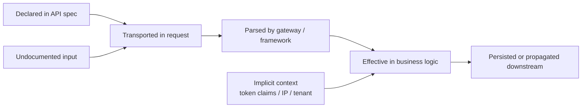
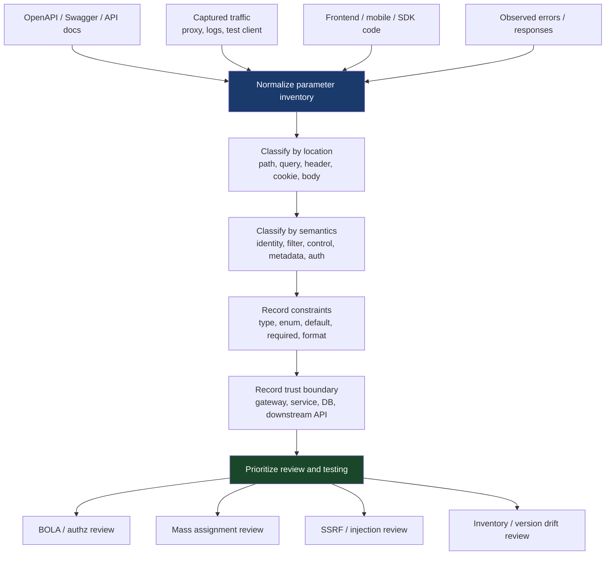

# Parameter Mapping

> **Parameter mapping is the discipline of turning “this endpoint accepts input” into a precise model of _which_ inputs exist, _where_ they enter, _how_ they are serialized, _what_ they control, and _which trust boundaries they cross. In authorized API testing, a good parameter map is what turns random request poking into systematic coverage.**

---

## 🧠 What Is It? (Beginner Explanation)

When people first learn API testing, they usually think about **endpoints**:

- `GET /users/{id}`
- `POST /orders`
- `PATCH /profile`

But endpoints are only half the story.

The real behavior of an API is controlled by **parameters**:

- the `id` in `/users/{id}`
- the `limit=50` in `?limit=50`
- the `X-Tenant-ID` header
- the `session` or `csrftoken` cookie
- the JSON fields in the request body
- the GraphQL variables or gRPC message fields behind the HTTP request

So **parameter mapping** means building a complete map of every input the API can process, including:

- **documented inputs** from the API spec
- **observed inputs** from real traffic
- **implicit inputs** the server derives from headers, tokens, cookies, and context
- **hidden or drifted inputs** that exist in behavior but not in the documentation

A simple mental model:

> **Endpoint mapping tells you _where_ you can talk to the API. Parameter mapping tells you _how_ you can influence it.**

---

## 🎯 Why It Matters

Incomplete parameter maps cause incomplete testing.

If you only test the obvious parameters, you miss the ones that actually drive risk:

- object identifiers used in authorization decisions
- filter and sort fields that change data scope
- body properties that frameworks auto-bind to internal objects
- headers that influence tenancy, caching, locale, client IP, or upstream routing
- URL fields that later trigger outbound fetches
- versioning and feature-flag parameters that expose hidden behavior

That is why parameter mapping sits directly upstream of many major API weakness classes:

| Parameter characteristic | What it often leads to |
|---|---|
| Object IDs and owner fields | BOLA / IDOR |
| Hidden writable properties | Broken object property-level authorization / mass assignment |
| Undocumented version or mode flags | Improper inventory management |
| URL-like body fields | SSRF risk |
| Pagination, filters, search, export fields | Data overexposure and resource abuse |
| Tenant, org, region, or role selectors | Trust-boundary failures |
| Content negotiation / format controls | Parsing inconsistencies and validation gaps |

OWASP API Security guidance repeatedly points toward the same lesson: **you must understand which properties are exposed, writable, and actually enforced server-side** before you can reason about authorization or data exposure.

---

## 🧩 Core Mental Model — Five States of a Parameter

A mature tester does not stop at “I saw this field in a request.” A parameter can exist in several different states:

1. **Declared** — documented in the API specification
2. **Transported** — present on the wire in the HTTP request
3. **Parsed** — accepted and decoded by the gateway/framework
4. **Effective** — actually used by business logic
5. **Persisted / Propagated** — written to storage or forwarded to another service



Why this matters:

- some parameters are **declared but never effective**
- some are **transported but ignored**
- some are **effective but undocumented**
- some are **derived from other inputs** and never appear as standalone fields

That gap between declared, transported, and effective behavior is where a lot of API bugs live.

---

## 📊 Diagram — Building a Parameter Map



---

## 🗂️ Parameter Taxonomy

### 1) By transport location

OpenAPI 3.x defines four parameter locations in the **Parameter Object**: `path`, `query`, `header`, and `cookie`. Request bodies are modeled separately as **`requestBody`**, but from a tester’s perspective they still belong in the parameter map.

| Location | Example | Typical use | Important nuance |
|---|---|---|---|
| **Path** | `/users/{userId}` | Resource identity | In OpenAPI, path parameters are always required |
| **Query** | `?limit=50&status=active` | Filtering, pagination, optional behavior | Often where undocumented toggles and alternate formats appear |
| **Header** | `X-Tenant-ID: acme` | Metadata, routing, tracing, tenant selection | Some headers act like control-plane inputs, not just metadata |
| **Cookie** | `Cookie: session=...; locale=en` | Session state, stickiness, CSRF, feature flags | Easy to underestimate in API environments |
| **Request body** | JSON / XML / form / multipart | Object creation and update | In many APIs, this is the highest-risk input surface |
| **Multipart parts** | file + metadata fields | Uploads and mixed-content operations | Metadata fields often matter as much as file content |

### 2) By semantic role

| Semantic role | Examples | Why it matters |
|---|---|---|
| **Identity selector** | `userId`, `orderId`, `accountNumber` | Usually central to authorization decisions |
| **Scope / filter** | `status`, `fromDate`, `tenant`, `region` | Changes what data is returned |
| **State mutation** | `role`, `approved`, `plan`, `ownerId` | Can change privileges, workflow state, or ownership |
| **Control / mode** | `debug`, `preview`, `version`, `format` | Often exposes hidden functionality or alternate paths |
| **Security material** | API key, bearer token, CSRF token | Affects trust establishment, not just business logic |
| **Routing / integration** | callback URLs, webhook targets, import sources | Often where SSRF and unsafe consumption issues begin |
| **Metadata / observability** | correlation IDs, locale, client hints | Sometimes low risk, sometimes unexpectedly security-relevant |

### 3) By visibility

| Visibility state | Meaning |
|---|---|
| **Documented** | Explicitly present in OpenAPI or human docs |
| **Observed** | Seen in captured requests or app behavior |
| **Inferred** | Deduced from responses, errors, SDK code, or patterns |
| **Implicit** | Not supplied as a field, but derived from auth token, IP, session, tenant context, mTLS identity, etc. |
| **Drifted** | Exists in runtime behavior but is missing from the current docs/spec |

---

## 📘 What the API Spec Tells You

If you have an OpenAPI / Swagger document, start there.

From a parameter-mapping perspective, the spec gives you a structured first-pass inventory:

- **name**
- **location** via `in`
- **required**
- **schema** or **content**
- **type / format**
- **enum**
- **default**
- **examples**
- **serialization details** like `style`, `explode`, and `allowReserved`

### High-value OpenAPI details testers should notice

| Spec field | Why it matters for mapping |
|---|---|
| `in: path/query/header/cookie` | Tells you where the input arrives |
| `required: true` | Helps distinguish mandatory vs optional surface |
| `schema.type` / `format` | Hints at identifiers, timestamps, URLs, UUIDs, booleans, money, etc. |
| `enum` | Reveals allowed states, roles, modes, and workflow values |
| `default` | Shows what happens when the client omits a field |
| `example` / `examples` | Gives realistic seed values for safe validation |
| `style` + `explode` | Explains array/object serialization and parser expectations |
| `allowReserved` | A clue that reserved characters may be meaningful in values |
| `requestBody.content` | Identifies media types and body shapes |
| `security` / `securitySchemes` | Important because auth inputs are often not modeled as normal parameters |

### Important specification nuance

In OpenAPI, some security-relevant inputs are **not** represented as normal header parameters:

- `Authorization` is typically described through `securitySchemes`
- `Content-Type` is modeled through `requestBody.content`
- `Accept` is modeled through response content definitions

So if you build your map from only `parameters[]`, you will miss real input surface.

---

## 🧪 OpenAPI Example — Turn the Spec into a Map

```yaml
openapi: 3.1.0
paths:
  /v1/users/{userId}:
    patch:
      summary: Update a user profile
      parameters:
        - in: path
          name: userId
          required: true
          schema:
            type: string
            format: uuid
        - in: query
          name: notify
          schema:
            type: boolean
            default: false
        - in: header
          name: X-Tenant-ID
          required: true
          schema:
            type: string
      requestBody:
        required: true
        content:
          application/json:
            schema:
              type: object
              properties:
                displayName:
                  type: string
                locale:
                  type: string
                  enum: [en, fr, de]
                role:
                  type: string
              required: [displayName]
```

### Resulting map

| Input | Location | Type | Required | Meaning |
|---|---|---:|---:|---|
| `userId` | Path | UUID-like string | Yes | Selects which user object is targeted |
| `notify` | Query | Boolean | No | Changes side effect after update |
| `X-Tenant-ID` | Header | String | Yes | Selects trust boundary / tenant context |
| `displayName` | JSON body | String | Yes | Intended writable profile field |
| `locale` | JSON body | Enum | No | Controlled profile preference |
| `role` | JSON body | String | No | High-risk field because it may influence authorization or privilege |

That final line is exactly why parameter mapping matters.

Even before any testing, the map tells you:

- object identity is path-based
- tenancy is header-based
- update behavior is partly controlled by a query flag
- the body contains a potentially dangerous writable property (`role`)

---

## 🔡 Serialization Matters More Than People Think

The OpenAPI serialization model, based partly on RFC 6570 URI templates, tells you how arrays and objects are encoded.

If you do not map serialization, you can misunderstand how the API really parses input.

### Common OpenAPI serialization behaviors

| Location | Common styles | Example |
|---|---|---|
| **Path** | `simple`, `label`, `matrix` | `/users/3,4,5`, `/users/.3.4.5`, `/users/;id=3;id=4` |
| **Query** | `form`, `spaceDelimited`, `pipeDelimited`, `deepObject` | `?id=3&id=4`, `?id=3,4`, `?id[a]=1&id[b]=2` |
| **Header** | `simple` | `X-Fields: a,b,c` |
| **Cookie** | `form` | `Cookie: prefs=theme,dark,lang,en` |

### Why this matters in practice

- `?tag=a&tag=b` and `?tag=a,b` may reach the same code or different code
- `deepObject` query structures often map cleanly into nested server objects
- matrix and label forms are rare, so they are often forgotten in validation logic
- reserved characters such as `/`, `?`, `#`, and `;` may be percent-encoded or accepted literally depending on parser behavior and `allowReserved`

A parameter map should therefore record not just **the name of a parameter**, but also:

- how it is serialized
- whether repeated keys are allowed
- whether arrays or objects are accepted
- whether percent-encoding changes semantics

---

## 🧭 Authorized Parameter-Mapping Workflow

This workflow stays on the defensive side of the line: it is about building coverage, validating behavior, and documenting risk — not abusing production systems.

### Phase 1 — Build the documented inventory

Use the API spec to extract every declared input.

```bash
# Save a machine-readable spec if one is available
curl -s https://api.example.test/openapi.json -o openapi.json
```

```bash
# Extract parameter objects and request body fields from an OpenAPI JSON spec
python3 - <<'PY'
import json
from pathlib import Path

spec = json.loads(Path('openapi.json').read_text())
for path, path_item in spec.get('paths', {}).items():
    for method, op in path_item.items():
        if method.lower() not in {'get','post','put','patch','delete','options','head'}:
            continue
        params = []
        params.extend(path_item.get('parameters', []))
        params.extend(op.get('parameters', []))
        for p in params:
            schema = p.get('schema', {})
            print(f"{method.upper()} {path}\t{p.get('in')}\t{p.get('name')}\t{p.get('required', False)}\t{schema.get('type','?')}")
        body = op.get('requestBody', {})
        for ctype, meta in body.get('content', {}).items():
            props = meta.get('schema', {}).get('properties', {})
            for name, prop in props.items():
                print(f"{method.upper()} {path}\tbody:{ctype}\t{name}\tFalse\t{prop.get('type','?')}")
PY
```

This gives you a fast first-pass map that you can load into a spreadsheet or notes table.

### Phase 2 — Capture observed behavior

Then compare the spec to **real** traffic from your own authorized sessions:

- browser or mobile app traffic through a proxy
- SDK examples
- integration tests
- Postman collections
- staged client workflows

What you are looking for is drift:

| Drift signal | What it may mean |
|---|---|
| Traffic contains a field absent from the spec | Hidden or undocumented input |
| Spec lists a field never seen in traffic | Dead path, legacy input, or privileged-only feature |
| Same field name, different type | Parser mismatch or stale docs |
| Same operation, different media type | Alternate processing path |
| Field only appears after auth or role change | Context-dependent attack surface |

### Phase 3 — Add semantic labels

For each parameter, record:

- **what object it selects**
- **what state it changes**
- **what scope it widens or narrows**
- **what trust boundary it crosses**
- **what downstream service or store it influences**

This is where a raw list becomes a real map.

### Phase 4 — Separate explicit from implicit inputs

Many APIs appear simple until you list the inputs that do **not** look like ordinary parameters:

| Implicit input | Example | Why it belongs in the map |
|---|---|---|
| JWT claims | `sub`, `scope`, `tenant_id`, `role` | They often drive authorization and scoping |
| Session identity | Cookie-backed session | Controls effective behavior without appearing in the URL/body |
| Client certificate identity | mTLS subject | Can change trust level or partner scope |
| Source IP / forwarded headers | `X-Forwarded-For`, `X-Real-IP` | Sometimes used for allowlists or geo logic |
| Content negotiation | `Accept`, `Content-Type` | Can switch parsers and representations |
| Versioning | `/v2`, `Accept: application/vnd...`, `api-version=...` | Often exposes shadow inventory |

### Phase 5 — Prioritize high-risk parameters first

Focus early on parameters that are:

- identifiers
- ownership-related fields
- role, permission, plan, status, or approval fields
- URL- or host-like fields
- tenant or organization selectors
- export / search / filter / pagination controls
- version or debug toggles
- object-shaped arrays or nested structures

---

## 🧱 A Practical Parameter-Mapping Table

A good working table usually includes more than just name and location.

| Column | What to record |
|---|---|
| **Operation** | `PATCH /v1/users/{userId}` |
| **Parameter name** | `userId`, `notify`, `role` |
| **Location** | path / query / header / cookie / body |
| **Type / format** | string, integer, uuid, uri, enum, array, object |
| **Required** | yes / no / conditional |
| **Default / enum** | default values and allowed states |
| **Serialization** | form, deepObject, repeated key, JSON object, multipart part |
| **Semantic role** | selector, filter, mutation, control, auth, routing |
| **Object / workflow touched** | user, invoice, subscription, approval flow |
| **Trust boundary** | gateway, app, DB, downstream service, third-party API |
| **Sensitivity** | low / medium / high |
| **Source** | spec, observed traffic, client code, inferred |
| **Status** | documented, observed, drifted, implicit, unknown |
| **Testing notes** | safe validation ideas and findings |

### Example working entry

| Operation | Parameter | Location | Semantic role | Trust boundary | Notes |
|---|---|---|---|---|---|
| `GET /v1/orders/{orderId}` | `orderId` | path | object selector | API → order service | Authorization-critical |
| `GET /v1/orders/{orderId}` | `expand` | query | representation control | API serializer | Can expose extra properties |
| `PATCH /v1/users/{userId}` | `role` | JSON body | state mutation | API → user model | High-risk writable property |
| `POST /v1/import` | `sourceUrl` | JSON body | routing / integration | API → outbound fetcher | Review for SSRF-safe design |
| `GET /v1/report` | `X-Tenant-ID` | header | tenant selection | gateway → multi-tenant service | Boundary-defining input |

---

## 🔍 Spec vs Runtime: Questions to Ask for Every Parameter

### Existence questions

- Is it documented?
- Is it observed in real traffic?
- Is it accepted if omitted?
- Is it accepted if repeated?
- Does the server ignore it, reject it, or act on it?

### Semantics questions

- Does it identify an object, a collection, a tenant, or a workflow step?
- Does it change what is returned, what is updated, or what happens next?
- Is it intended for the client, or is it an internal field that leaked outward?

### Boundary questions

- Is the parameter enforced at the gateway, application, or downstream service?
- Does it influence database queries, cache keys, queues, webhooks, or third-party calls?
- Is its value trusted too early?

### Safety questions

- Is the parameter tightly typed and constrained?
- Does the server reject illegal combinations?
- Is it overexposed in responses?
- Is it writable when it should be derived server-side?

---

## ⚠️ Common Mapping Blind Spots

### 1. Treating the API spec as perfect truth

Specs are useful, but real systems drift.

The spec is often:

- outdated
- incomplete
- generated from partial annotations
- missing privileged or legacy flows
- inaccurate around auth, defaults, or alternate content types

### 2. Ignoring body fields because only URL parameters feel “real”

In modern APIs, the body is often the main control surface.

That is especially true for:

- create / update operations
- nested objects
- admin or workflow actions
- mass-assignment-prone frameworks

### 3. Missing headers and cookies

API testers sometimes focus almost entirely on JSON bodies.

But headers and cookies may influence:

- tenant selection
- locale and representation
- canary / feature flags
- upstream identity or partner context
- proxy-based trust decisions
- caching and routing behavior

### 4. Missing parser ambiguity

The same semantic input may be accepted in multiple forms:

- query string and JSON body
- repeated query keys and comma-separated lists
- camelCase and snake_case aliases
- typed JSON and stringified JSON-in-query

A parameter map should note when multiple encodings appear to reach the same logic.

### 5. Confusing exposed fields with safe fields

Just because a field is visible in a response does not mean it is safe to make writable.

OWASP’s API guidance on property-level authorization and mass assignment exists precisely because APIs often expose or bind more object properties than intended.

---

## 🌐 Protocol-Specific Notes

### REST / OpenAPI APIs

This is where parameter mapping is usually most explicit.

Focus on:

- `parameters`
- `requestBody`
- `securitySchemes`
- versioning strategy
- content-type-specific schemas
- array/object serialization details

### GraphQL APIs

GraphQL compresses many operations into a small number of endpoints, so parameter mapping shifts from URL layout to:

- query variables
- input object types
- field selection sets
- mutations and their nested inputs
- directives and optional arguments

A GraphQL endpoint can look simple at the transport layer and still have a huge parameter surface at the schema layer.

### gRPC APIs

For gRPC, the parameter map lives primarily in:

- protobuf message fields
- repeated fields
- oneof branches
- metadata headers
- method-specific request messages

The path may look small, but the message schema can still expose a large writable object surface.

### WebSocket / event-driven APIs

For WebSockets, map:

- message types
- action names
- envelope metadata
- channel / topic selectors
- nested payload fields

The absence of classic query parameters does not mean the absence of parameterization.

---

## 🛡️ Defensive Design Recommendations

Good parameter mapping is not just a testing technique. It is also a design discipline.

### For API designers and defenders

| Control | Why it helps |
|---|---|
| Maintain accurate machine-readable API specs | Reduces inventory drift and improves reviewability |
| Use schema validation on requests and responses | Prevents undocumented or malformed properties from silently flowing inward or outward |
| Prefer allowlists for writable fields | Strong defense against mass assignment |
| Derive security-sensitive fields server-side | Avoids trusting client-supplied ownership, role, or price data |
| Strongly type identifiers, enums, and URLs | Reduces ambiguous parsing and input confusion |
| Enforce authorization at object and property level | Stops “valid object, wrong field” failures |
| Log rejected parameters and validation failures | Helpful for both defense and authorized assessment |
| Track API versions and deprecations centrally | Reduces shadow and drifted input surfaces |

### A powerful design rule

> **If a field is security-sensitive, workflow-sensitive, or financially sensitive, prefer deriving it on the server rather than accepting it from the client.**

Examples:

- derive `ownerId` from the authenticated user
- derive `tenantId` from trusted identity context
- derive `price`, `discount`, and `approvalState` from server-side business logic
- derive `role` changes from privileged workflows, not generic profile updates

---

## ✅ Parameter-Mapping Checklist

Use this as a quick review aid during an authorized assessment.

- [ ] Extract all declared parameters from the machine-readable spec
- [ ] Include request body fields, not just `parameters[]`
- [ ] Record auth inputs described outside normal parameter objects
- [ ] Capture real traffic from your own test workflows
- [ ] Compare documented vs observed fields
- [ ] Mark hidden, drifted, or implicit inputs separately
- [ ] Record serialization rules for arrays and objects
- [ ] Identify which parameters select objects, tenants, roles, or workflow states
- [ ] Highlight server-derived values that should not be client-controlled
- [ ] Prioritize IDs, tenant selectors, URLs, approval flags, and writable role/status fields
- [ ] Note which service boundary each high-risk parameter crosses
- [ ] Keep the parameter map current as new versions or media types appear

---

## 📚 References and Further Reading

- **OpenAPI / Swagger docs — Describing Parameters**: `https://swagger.io/docs/specification/v3_0/describing-parameters/`
- **OpenAPI / Swagger docs — Parameter Serialization**: `https://swagger.io/docs/specification/v3_0/serialization/`
- **OWASP API Security Top 10 2023**: `https://owasp.org/API-Security/editions/2023/en/0x11-t10/`
- **OWASP API3:2023 Broken Object Property Level Authorization**: `https://owasp.org/API-Security/editions/2023/en/0xa3-broken-object-property-level-authorization/`
- **OWASP REST Security Cheat Sheet**: `https://cheatsheetseries.owasp.org/cheatsheets/REST_Security_Cheat_Sheet.html`
- **OWASP Mass Assignment Cheat Sheet**: `https://cheatsheetseries.owasp.org/cheatsheets/Mass_Assignment_Cheat_Sheet.html`
- **PortSwigger Web Security Academy — API testing**: `https://portswigger.net/web-security/api-testing`
- **RFC 6570 — URI Template**: `https://www.rfc-editor.org/rfc/rfc6570`
- **RFC 3986 — URI Generic Syntax**: `https://www.rfc-editor.org/rfc/rfc3986`
- **Microsoft Azure Architecture Center — API design best practices**: `https://learn.microsoft.com/en-us/azure/architecture/best-practices/api-design`

---

## Final Takeaway

Parameter mapping is where API testing becomes disciplined.

A mature map does not stop at “these fields exist.” It answers:

- which inputs are documented
- which are actually observed
- which are security-significant
- which trust boundaries they cross
- and which values the client should never truly control

If endpoint mapping gives you the doors, **parameter mapping gives you the handles, locks, keys, and hidden switches**.
