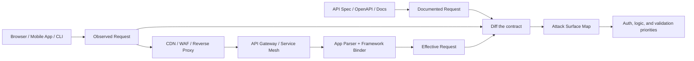
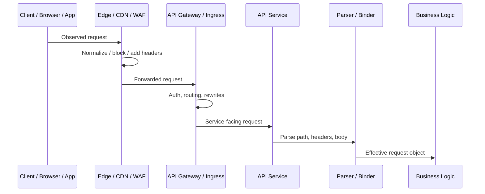
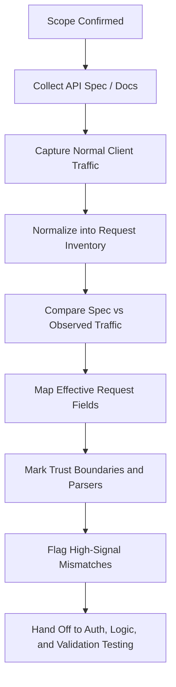

# Request Analysis

> **Module:** API Pentesting → API Attack Surface Mapping  
> **Difficulty:** Beginner → Advanced  
> **Tags:** `#http` `#openapi` `#request-analysis` `#attack-surface` `#api-security` `#burp-suite` `#mitmproxy`

Request analysis is the discipline of understanding **what an API request is supposed to look like, what the client actually sends, and what the backend finally processes after gateways, proxies, and parsers have normalized it**. In authorized API testing, this is one of the highest-signal activities because almost every later finding — broken authorization, mass assignment, business logic abuse, unsafe third-party consumption, shadow endpoints, and parser confusion — depends on understanding requests correctly first.

For defenders and authorized testers, the goal is not to generate noisy or malformed traffic blindly. The goal is to build a **clean request inventory**, identify **trust boundaries and parsing behavior**, and highlight **mismatches between the API spec and reality**.

> **Authorization required:** Request analysis often starts passively, but even “simple replay” sends real traffic and can trigger state changes, audit logs, and alerts. Stay inside scope, use dedicated test identities, prefer low-impact observation first, and reserve malformed or ambiguity-focused validation for explicitly approved environments.

---

## Table of Contents

1. [Why Request Analysis Matters](#why-request-analysis-matters)
2. [Mental Model — Documented vs Observed vs Effective Request](#mental-model--documented-vs-observed-vs-effective-request)
3. [Anatomy of an API Request](#anatomy-of-an-api-request)
4. [Start with the API Spec](#start-with-the-api-spec)
5. [Building a Request Inventory](#building-a-request-inventory)
6. [Request Normalization and Intermediaries](#request-normalization-and-intermediaries)
7. [Parameter Placement and Serialization](#parameter-placement-and-serialization)
8. [Authentication, Identity, and Tenant Signals](#authentication-identity-and-tenant-signals)
9. [Content Types, Parsers, and Body Models](#content-types-parsers-and-body-models)
10. [Protocol-Specific Request Analysis](#protocol-specific-request-analysis)
11. [High-Signal Mismatches Between Spec and Traffic](#high-signal-mismatches-between-spec-and-traffic)
12. [Safe Authorized Workflow](#safe-authorized-workflow)
13. [Tools and Low-Noise Commands](#tools-and-low-noise-commands)
14. [Defensive Logging and Hardening Priorities](#defensive-logging-and-hardening-priorities)
15. [Reporting Guidance](#reporting-guidance)
16. [Checklist](#checklist)
17. [Key Takeaways](#key-takeaways)
18. [References and Public Research](#references-and-public-research)

---

## Why Request Analysis Matters

Many testers jump directly from endpoint discovery to vulnerability hunting. That skips the layer where the highest-quality understanding lives:

- **Which request fields actually control behavior?**
- **Which parts are documented vs undocumented?**
- **Which identity signals are trusted by the backend?**
- **Which parser really handles the body?**
- **Which intermediary rewrites the message before it reaches application code?**

A good request analysis phase turns scattered traffic into a structured model of the API surface.

| If you skip request analysis | What you usually miss |
|---|---|
| You only record paths and methods | Hidden auth headers, tenant selectors, override headers, serialization quirks |
| You trust the docs blindly | Shadow parameters, outdated versions, mobile-only request shapes |
| You trust the client blindly | Extra backend-accepted fields, implicit defaults, gateway-injected identity |
| You only inspect the raw wire message | You miss what proxies normalize, strip, merge, or rewrite |
| You only inspect app code or OpenAPI | You miss the real production request shape |

### Why this matters for later vulnerability classes

| Later finding | Why request analysis is a prerequisite |
|---|---|
| **BOLA / object authorization** | You must know where object IDs, tenant IDs, and subject identifiers are supplied |
| **Broken function-level authorization** | You must know which methods, headers, or routes activate privileged actions |
| **Mass assignment / property-level issues** | You must know which body fields are accepted vs merely displayed in the UI |
| **Business logic flaws** | You must understand state-changing request sequences and control fields like coupon, quantity, status, or workflow step |
| **Unsafe API consumption** | You must know which outbound or upstream-facing values originate from the request |
| **Improper inventory management** | You must compare documented operations to observed legacy or undocumented traffic |

---

## Mental Model — Documented vs Observed vs Effective Request

The most useful advanced mental model is that an API request exists in **three versions**:

1. **Documented request** — what the API spec says should exist
2. **Observed request** — what the client actually sends over the wire
3. **Effective request** — what the backend finally interprets after proxying, normalization, auth enrichment, and parsing



### The core lesson

> **The request that matters most for security is the effective request.**

That is the request the authorization layer, routing layer, validator, ORM binder, and business logic actually consume.

### Three-request comparison table

| View | Source | Strength | Blind spot |
|---|---|---|---|
| **Documented** | OpenAPI, Postman, developer docs | Structured, explicit contract | May be outdated, incomplete, or overly idealized |
| **Observed** | Browser DevTools, Burp, mobile proxying, logs | Real traffic, real auth context | Reflects only what the client chose to send |
| **Effective** | Backend logs, gateway config, framework behavior, controlled replay | Closest to security truth | Harder to reconstruct without disciplined analysis |

A mature request-analysis workflow constantly asks:

> “What did the spec promise, what did the client send, and what did the backend trust?”

---

## Anatomy of an API Request

According to HTTP semantics, a request is made of a **start line**, **headers**, a blank line, and an optional **body**. For API work, that basic RFC view is only the beginning. Security testing cares about which fields control:

- routing
- identity
- tenant selection
- parser choice
- state change
- cache behavior
- idempotency
- downstream service behavior

### Example HTTP/1.1 request

```http
PATCH /v1/accounts/123?expand=owner&fields=id,email HTTP/1.1
Host: api.example.test
Authorization: Bearer eyJhbGciOi...
Content-Type: application/json
Accept: application/json
If-Match: "acct-v7"
Idempotency-Key: 57a5a7c4-6b08-4c7d-a69d-0d8a51b1f0d7
X-Tenant-ID: acme-prod

{
  "email": "alice@example.test",
  "role": "billing-admin"
}
```

### What each part means to a tester

| Request element | Example | Why it matters |
|---|---|---|
| **Method** | `PATCH` | Tells you whether the action is read, create, partial update, or something custom |
| **Path** | `/v1/accounts/123` | Reveals resource shape, versioning, and object identifier placement |
| **Query string** | `expand=owner&fields=id,email` | Often controls data exposure, filtering, pagination, or nested retrieval |
| **Host / authority** | `api.example.test` | Can determine environment, tenant routing, or gateway behavior |
| **Auth header** | `Authorization: Bearer ...` | Primary identity signal for most HTTP APIs |
| **Conditional / workflow headers** | `If-Match`, `Idempotency-Key` | Signal optimistic locking, replay protection, or transaction semantics |
| **Tenant / org headers** | `X-Tenant-ID` | Frequently define cross-tenant trust boundaries |
| **Content-Type** | `application/json` | Selects body parser and binding logic |
| **Body fields** | `email`, `role` | May drive property writes, privilege changes, or hidden server behavior |

### HTTP/1.1 vs HTTP/2 / HTTP/3

At beginner level, it is enough to think in terms of “method + path + headers + body.” At advanced level, you must remember that HTTP/2 and HTTP/3 do **not** carry an HTTP/1.1 textual request line. Instead they use pseudo-headers such as:

- `:method`
- `:scheme`
- `:authority`
- `:path`

That matters because some stacks accept HTTP/2 from clients but downgrade to HTTP/1.1 behind the proxy. When request analysis reaches proxy chains and parser disagreements, protocol translation becomes a real attack-surface factor.

| Version | Request representation | Security relevance |
|---|---|---|
| **HTTP/1.1** | Textual request line + headers + body framing | Classic duplicate-header and body-framing ambiguity surface |
| **HTTP/2** | Binary frames + pseudo-headers | Different parser behavior, lower direct framing ambiguity, but downgrade risks remain |
| **HTTP/3** | QUIC transport + HTTP semantics | Similar semantic analysis, different transport and observability concerns |

---

## Start with the API Spec

When an API spec exists, start there.

Per the OpenAPI Specification, the purpose of an API description is to let humans and machines understand an HTTP API **without needing source code or traffic inspection**. In practice, that means an OpenAPI file is the best structured starting point for request analysis.

### Why the API spec is so valuable

The spec tells you, in one place:

- expected servers / base URLs
- paths and methods
- operation identifiers
- parameters and where they live
- request body schemas and media types
- auth requirements
- deprecated operations
- examples and serialization hints

### Minimal OpenAPI example

```yaml
openapi: 3.1.0
servers:
  - url: https://api.example.test
paths:
  /v1/accounts/{accountId}:
    patch:
      operationId: updateAccount
      security:
        - bearerAuth: []
      parameters:
        - in: path
          name: accountId
          required: true
          schema:
            type: string
        - in: query
          name: expand
          schema:
            type: string
            enum: [owner, plan]
        - in: header
          name: Idempotency-Key
          schema:
            type: string
      requestBody:
        required: true
        content:
          application/json:
            schema:
              type: object
              properties:
                email:
                  type: string
                  format: email
                plan:
                  type: string
                marketingOptIn:
                  type: boolean
components:
  securitySchemes:
    bearerAuth:
      type: http
      scheme: bearer
```

### What to extract from the spec

| OpenAPI object | What to record for request analysis | Why it matters |
|---|---|---|
| **`servers`** | Base URL, environment clues, version prefixes | Helps identify target scope and environment drift |
| **`paths` + methods** | The documented operation inventory | Your baseline attack-surface map |
| **`parameters`** | `in: path/query/header/cookie`, required, schema, examples | Tells you where input is supposed to arrive |
| **`requestBody`** | Media type, schema, required fields | Tells you which parser and field model to expect |
| **`content`** | `application/json`, `multipart/form-data`, etc. | Parser selection and upload surface |
| **`encoding`** | Multipart or form-field encoding rules | Important for files, arrays, nested objects |
| **`security`** | Required auth mechanism / scopes | Core identity and authorization expectations |
| **`deprecated`** | Old but still described operations | Often high-signal for legacy exposure |
| **Examples** | Intended request shape | Useful baseline for diffing observed traffic |

### But never treat the spec as ground truth

A spec is a **contract claim**, not proof.

Common real-world drift:

- spec omits mobile-only headers
- backend accepts extra body fields not documented
- deprecated endpoints still function
- production gateway injects or strips headers not described in OpenAPI
- multiple content types are accepted even though only one is documented
- auth requirements differ between docs and runtime

That is why request analysis is always **spec-first, traffic-verified**.

---

## Building a Request Inventory

The goal is not to save random HTTP messages forever. The goal is to transform traffic into a **normalized request inventory** that can support later authorization, logic, and parser analysis.

### Minimum inventory fields

| Field | Example | Why record it |
|---|---|---|
| `request_id` | `REQ-042` | Stable reference for notes and findings |
| `protocol` | `HTTP/1.1`, `HTTP/2`, `gRPC` | Parser and intermediary context |
| `host` | `api.example.test` | Environment / authority context |
| `route_template` | `/v1/accounts/{accountId}` | Dedupe requests across object instances |
| `method` | `PATCH` | Action semantics |
| `auth_mechanism` | `Bearer`, `Cookie`, `mTLS` | Identity model |
| `subject_context` | `user`, `admin`, `service account` | Crucial for access-control mapping |
| `tenant_context` | `acme-prod` | Multi-tenant boundary analysis |
| `content_type` | `application/json` | Parser selection |
| `body_schema_shape` | `object(email, plan, role?)` | Property-level surface |
| `state_change` | `read`, `update`, `create`, `workflow` | Prioritization |
| `idempotency_control` | `Idempotency-Key`, `If-Match` | Business-flow signal |
| `observed_statuses` | `200/400/401/403/415/422` | Validation/auth clues |
| `spec_status` | `documented`, `undocumented`, `deprecated` | Inventory and risk management |
| `notes` | `accepts undocumented X-Tenant-ID` | High-signal observations |

### Good normalization rule

Do **not** track requests only as full raw URLs.

Instead normalize by:

- route template
- method
- content type
- auth context
- request purpose

That prevents you from treating:

- `/users/123`
- `/users/124`
- `/users/125`

as three unrelated surfaces when they are really one operation with different object identifiers.

### A mature inventory should answer

- Which requests are **public vs authenticated**?
- Which requests are **user vs admin vs service-to-service**?
- Which requests are **documented vs shadow**?
- Which requests are **read-only vs state-changing**?
- Which requests rely on **user-controlled identifiers**?
- Which requests cross **tenant, role, or workflow boundaries**?

---

## Request Normalization and Intermediaries

One of the biggest mistakes in API analysis is assuming the backend sees exactly what the client sent.

In modern architectures, requests often pass through:

- CDN or edge proxy
- WAF
- reverse proxy
- API gateway
- ingress controller
- service mesh
- framework router
- framework body binder / serializer



### What normalization can change

| Intermediary behavior | Why it matters |
|---|---|
| **Header injection** | Gateway may add identity or tracing fields the client never sent |
| **Header stripping** | Sensitive or dangerous headers may disappear before the app sees them |
| **Path rewriting** | `/api/v1/...` at the edge may become `/internal/...` upstream |
| **Host / authority translation** | Multi-tenant or environment routing may depend on hostnames |
| **Method override handling** | Hidden semantics may be activated by special headers or query params |
| **Body decompression / transformation** | The app may parse a normalized body, not the exact wire payload |
| **HTTP/2 → HTTP/1.1 downgrade** | Semantics stay similar, but framing and parser behavior change |
| **Duplicate-field merging** | First-wins, last-wins, merged-values, or rejection behavior can differ |

### High-priority normalization questions

| Question | Why it is important |
|---|---|
| Does the backend trust `X-Forwarded-*` or similar headers from the wrong boundary? | Can affect scheme, host, client IP, or downstream auth logic |
| Are duplicate headers or duplicate parameters rejected, merged, or silently accepted? | Parser inconsistencies often become security bugs |
| Does the gateway expose method overrides like `X-HTTP-Method-Override`? | Can create hidden write actions behind allowed verbs |
| Is path normalization consistent for `%2F`, `//`, `.` and `..` forms? | Routing and authorization can diverge from developer expectations |
| Is content-length / transfer framing normalized at the edge? | Critical for parser safety and request-boundary correctness |
| Are old version prefixes rewritten to new services? | Can preserve shadow APIs longer than teams realize |

### Safe validation approach

For this phase, prefer:

- passive observation
- config review
- backend log comparison
- single controlled replay in a test environment

Avoid sending malformed ambiguity-focused traffic to production unless your rules of engagement explicitly approve it.

---

## Parameter Placement and Serialization

OpenAPI treats parameter location as a first-class concept because it changes how servers parse and trust input.

### Common parameter locations

| Location | Example | Typical use | Security note |
|---|---|---|---|
| **Path** | `/users/123` | Resource identity | Often feeds object-level authorization |
| **Query** | `?page=2&limit=50` | Filtering, pagination, optional modifiers | Common place for hidden features and data-expansion controls |
| **Header** | `X-Tenant-ID: acme` | Auth, tenant routing, idempotency, feature flags | Easy to overlook in UI-driven testing |
| **Cookie** | `session=...` | Browser-session identity | Important for CSRF and session scope |
| **Body** | JSON / form / XML | Create/update payloads | Main mass-assignment and validation surface |

### Serialization is part of the attack surface

The same logical parameter can appear in multiple serialized forms.

| Pattern | Example | Why you should care |
|---|---|---|
| **Array in query** | `tags=a&tags=b` or `tags=a,b` | Different frameworks parse differently |
| **Nested object** | `filter[name]=alice` or JSON body object | Impacts validation and allowlists |
| **Deep object query** | `filter[status]=active` | Common in modern APIs, often weakly documented |
| **Multipart fields** | text fields + files in one request | Mixed parser surface, metadata handling matters |
| **Repeated keys** | `role=user&role=admin` | First-wins / last-wins behavior can matter |

### OpenAPI serialization clues to capture

| OpenAPI field | Meaning | Request-analysis value |
|---|---|---|
| **`style`** | How a parameter is serialized | Helps explain why clients send arrays/objects oddly |
| **`explode`** | Whether array/object values are expanded into separate parameters | Helps interpret repeated keys |
| **`content`** | Full media-type-based parameter representation | Important when headers or query params carry structured data |
| **`encoding`** | Part-level encoding rules for forms/multipart | Important for upload and nested-field analysis |

### Practical mental model

> **A parameter is not just a name. It is a name + location + serialization rule + parser behavior + trust decision.**

That is why two fields named `tenantId` can be very different if one lives in a signed token claim and the other lives in a user-controlled header.

---

## Authentication, Identity, and Tenant Signals

A request analysis phase should always separate **identity-bearing fields** from ordinary input fields.

### Common identity and trust signals

| Request signal | Typical purpose | Analysis question |
|---|---|---|
| `Authorization: Bearer ...` | User or service identity | Which scopes/claims actually drive authorization? |
| `Cookie: session=...` | Browser session | Is this same-site, revocable, and origin-bound appropriately? |
| `X-API-Key` / custom key header | Client or partner identification | Does it identify only the client, or also grant user-level data access? |
| mTLS client certificate | Strong client identity at transport layer | Is app-layer auth still required? |
| `X-Tenant-ID` / org header | Tenant selection | Is tenant choice trusted from the client? |
| `X-Forwarded-User` / proxy identity headers | Upstream identity propagation | Can untrusted clients inject or influence them? |
| DPoP / sender-constrained proof | Bind token to client proof | Is the proof required consistently? |
| `Idempotency-Key` | Safe replay control for create actions | Does it prevent accidental duplicate transactions? |

### High-signal risky pattern

If a request body or query string includes fields like these, mark them for special review:

- `userId`
- `accountId`
- `tenantId`
- `organizationId`
- `role`
- `isAdmin`
- `permissions`
- `status`
- `workflowState`
- `approvedBy`

These are not automatically vulnerabilities. But they often indicate places where the backend may be trusting the client to describe **who the user is** or **what they are allowed to do**.

### The healthy design principle

Identity should usually come from:

- validated token claims
- session state
- mTLS / gateway identity
- server-side subject mapping

Not from freely editable request-body or query parameters.

---

## Content Types, Parsers, and Body Models

A request body is not just “data.” It is also a parser-selection event.

### Why `Content-Type` matters so much

The `Content-Type` header tells the server what parser to use. Different parsers mean different:

- field binding rules
- duplicate key behavior
- nesting behavior
- file handling semantics
- encoding assumptions
- validation pipelines

### Common API body types

| Media type | Where it appears | What to record | Why it matters |
|---|---|---|---|
| **`application/json`** | Most REST and GraphQL-over-HTTP APIs | object keys, arrays, null handling, nested objects | Main surface for hidden fields and object/property-level issues |
| **`application/x-www-form-urlencoded`** | Login, token, legacy forms, OAuth flows | repeated keys, encoding, flattening | Duplicate and repeated-key behavior matters |
| **`multipart/form-data`** | File upload, mixed forms | filenames, part headers, mixed text/file fields | Upload + metadata + parser boundary surface |
| **`application/xml` / `text/xml`** | SOAP, legacy enterprise APIs | namespaces, schema use, parser mode | XML parser safety and strictness matter |
| **`application/grpc`** | gRPC | metadata, method path, message type | Binary protocols shift visibility to descriptors and metadata |
| **GraphQL JSON envelope** | GraphQL over HTTP | `query`, `operationName`, `variables`, batching | Single endpoint, rich request semantics inside body |

### Status codes that teach you about request handling

| Status | What it often reveals |
|---|---|
| **`400 Bad Request`** | Syntax or parser rejection; useful for understanding expected structure |
| **`401 Unauthorized`** | Missing/invalid auth |
| **`403 Forbidden`** | Auth accepted, action or object denied |
| **`405 Method Not Allowed`** | Route exists, method contract differs |
| **`415 Unsupported Media Type`** | Parser / media type restrictions are enforced |
| **`422 Unprocessable Content`** | Syntax accepted, schema or validation rejected |

### Advanced parser questions

| Question | Why it matters |
|---|---|
| Does the API accept more than one media type for the same operation? | Hidden parser paths can appear |
| Does the same operation accept both query and body forms of the same field? | Source-of-truth ambiguity can emerge |
| How are duplicate JSON keys or repeated form keys handled? | Different libraries resolve them differently |
| Are unknown fields rejected, ignored, or persisted? | Directly relevant to request-surface quality |
| Are nulls, empty strings, and omitted fields treated differently? | Strong clue for partial update and workflow logic |

---

## Protocol-Specific Request Analysis

“Request analysis” is not only a REST topic. The concept applies to every API style, but the shape of the request changes.

| API style | What a “request” really is | Main things to analyze |
|---|---|---|
| **REST** | Method + route + headers + body | resource IDs, method semantics, body schema, auth headers |
| **GraphQL** | Usually one HTTP endpoint carrying `query`, `variables`, `operationName` | operation name, variable schema, batching, persisted-query metadata |
| **SOAP** | HTTP request carrying XML envelope and action metadata | SOAPAction, namespaces, WS-Security, parser behavior |
| **gRPC** | HTTP/2 request to `/package.Service/Method` plus metadata + protobuf body | method inventory, metadata auth, deadlines, compression, descriptor alignment |
| **WebSocket handshake** | Initial HTTP upgrade request | host, path, origin, cookies/auth, subprotocol negotiation |

### REST request analysis focus

- resource identifiers in path/query
- hidden expansion fields (`fields`, `expand`, `include`)
- version drift (`/v1`, `/v2`, mobile-only)
- partial-update behavior on `PATCH`
- idempotency and conditional update controls

### GraphQL request analysis focus

The HTTP endpoint often stays constant while the real attack surface lives inside:

- `query` / `mutation` / `subscription`
- `operationName`
- `variables`
- persisted query hash / extension metadata
- batching structure

A GraphQL request inventory should therefore track both:

1. the outer HTTP request
2. the inner GraphQL operation shape

### SOAP request analysis focus

For SOAP, the path is often less informative than:

- operation name
- XML namespace
- SOAPAction header
- WS-Security headers
- schema-defined request body structure

### gRPC request analysis focus

For gRPC, pay attention to:

- `:path` like `/accounts.AccountService/UpdateAccount`
- metadata headers
- deadline / timeout headers
- compression negotiation
- protobuf message type and field numbering

In gRPC-heavy environments, the most important request artifact may be the `.proto` file or server reflection output rather than the raw body itself.

### WebSocket request analysis focus

The first request is still HTTP:

- `GET` upgrade path
- `Origin`
- cookies or auth headers
- `Sec-WebSocket-Protocol`
- environment hostnames

After the handshake, the “request” shifts into application messages, so request analysis becomes message-schema analysis.

---

## High-Signal Mismatches Between Spec and Traffic

This is where request analysis starts producing strong security leads.

| Mismatch | Why it matters | Typical follow-up |
|---|---|---|
| **Undocumented parameter accepted** | Hidden functionality or shadow logic | Map who can set it and what it changes |
| **Documented required field not actually enforced** | Validation drift | Check business impact of omitted control |
| **Deprecated route still active** | Inventory gap / legacy surface | Compare auth and behavior with current version |
| **Spec says one content type, server accepts several** | Extra parser surface | Record alternate parsing paths |
| **Client sends identity/role/tenant in body** | Possible trust-boundary weakness | Verify server derives authority from trusted context |
| **Method behavior differs from spec** | Hidden function exposure | Map effective semantics, not just docs |
| **Undocumented auth header or tenant header present** | Proxy/gateway coupling | Determine whether clients can influence it |
| **Observed request reaches different host/path than documented** | Rewrites and architecture drift | Document effective routing chain |
| **Bulk or admin-style operation absent from docs but present in traffic** | Shadow privileged surface | Prioritize for access-control review |
| **Same logical field accepted in several locations** | Source-of-truth ambiguity | Determine precedence and consistency |

### A useful prioritization rule

High priority goes to mismatches that influence:

- **who** the request represents
- **which object** the request targets
- **which tenant** the request operates in
- **which action** the request triggers
- **which parser** interprets the input
- **which downstream service** consumes derived values

That maps closely to the OWASP API Security risks around object-level authorization, function-level authorization, property-level authorization, inventory management, and unsafe API consumption.

---

## Safe Authorized Workflow

A professional request-analysis workflow should be systematic and low-noise.



### Recommended sequence

#### 1. Read the API spec first

Extract:

- paths and methods
- parameter locations
- requestBody schemas
- auth requirements
- examples
- deprecated operations

#### 2. Capture baseline traffic from real app usage

Prefer:

- browser DevTools
- Burp Suite Proxy / HTTP history
- mitmproxy for mobile or desktop apps
- API client collections already used by the team

At this stage, you are trying to observe normal behavior, not break parsing.

#### 3. Normalize requests into inventory records

Group by operation, not by random object IDs.

#### 4. Compare documented and observed shapes

Ask:

- Which documented operations never appeared?
- Which observed requests are absent from the spec?
- Which fields appear only at runtime?
- Which security controls exist only in docs or only in traffic?

#### 5. Reconstruct the effective request

Use:

- gateway behavior
- framework routing conventions
- backend logs when available
- controlled low-impact replay in approved environments

#### 6. Prioritize later testing

Good request analysis should feed directly into:

- authorization matrix work
- business logic analysis
- property exposure analysis
- data flow analysis
- inventory and deprecation review

---

## Tools and Low-Noise Commands

These examples are for **authorized observation and documentation**, not destructive testing.

### Helpful tools

| Tool | Best use in request analysis |
|---|---|
| **Browser DevTools** | Observe real browser-generated requests and headers |
| **Burp Suite** | Intercept, annotate, diff, and replay low-impact requests |
| **mitmproxy** | Mobile / thick-client traffic capture and scripting |
| **curl / HTTPie** | Controlled replay of your own requests |
| **jq / yq** | Parse OpenAPI JSON/YAML and compare schemas |
| **grpcurl** | Inspect gRPC method behavior in authorized environments |
| **Postman / Insomnia** | Organize baseline requests and document auth contexts |

### Useful low-noise examples

```bash
# Show response headers and status for a documented operation
curl -s -D - -o /dev/null \
  -H "Authorization: Bearer $TOKEN" \
  https://api.example.test/v1/profile
```

```bash
# Inspect paths from an OpenAPI JSON document
jq -r '.paths | keys[]' openapi.json
```

```bash
# Inspect paths from an OpenAPI YAML document
yq '.paths | keys' openapi.yaml
```

```bash
# View a specific operation's documented request shape
jq '.paths["/v1/accounts/{accountId}"].patch' openapi.json
```

```bash
# Record traffic from a controlled client session for later comparison
mitmproxy -w baseline-traffic.mitm
```

### What to save from each capture

- raw request
- normalized route template
- auth context used
- environment / host
- content type
- request purpose
- observed status code(s)
- notes about undocumented fields or rewrites

---

## Defensive Logging and Hardening Priorities

Good request analysis should directly improve defense.

### What defenders should log per request

| Field | Why it matters |
|---|---|
| Route template + method | Stable operation identity |
| Authenticated subject / client ID | Identity correlation |
| Tenant / org context | Multi-tenant boundary visibility |
| Request ID / trace ID | Cross-service tracing |
| Content type and body size | Parser and resource-consumption visibility |
| Result status (`2xx/4xx/5xx`) | Validation and access-control trends |
| Gateway-added identity fields | Detect trust-boundary misuse |
| Deprecated or shadow operation use | Inventory management signal |

### Hardening priorities revealed by request analysis

Based on RFC HTTP semantics, OpenAPI contract guidance, and OWASP defensive recommendations, strong next steps include:

- enforce **HTTPS** everywhere for authenticated APIs
- keep the **API spec current** and treat undocumented active routes as inventory debt
- validate **authn and authz at every operation**, not just at the gateway edge
- reject **unsupported media types** and unexpected serialization forms
- normalize and reject **ambiguous requests** consistently at the edge
- do not trust **client-supplied identity, tenant, or role fields** when server-side truth exists
- retire or block **deprecated versions** aggressively
- log enough request context to distinguish **user error, parser error, and access-control failure**

### Blue-team benefit

If defenders cannot answer “what requests does this API really accept?”, they cannot:

- build good detections
- verify auth coverage
- maintain a clean inventory
- reason about shadow endpoints
- spot dangerous contract drift

---

## Reporting Guidance

A strong request-analysis finding is usually about **mismatch**, **trust**, or **drift**.

### Good finding structure

When reporting, be explicit about:

1. **Documented expectation** — what the spec or docs say
2. **Observed behavior** — what the client or runtime actually sends/accepts
3. **Effective behavior** — what the backend appears to trust or process
4. **Security consequence** — why the mismatch matters
5. **Recommended fix** — spec update, parser restriction, auth enforcement, deprecation, logging, or gateway normalization

### Example finding language

> The OpenAPI contract for `PATCH /v1/accounts/{accountId}` documents only `email`, `plan`, and `marketingOptIn` in the JSON request body. During authorized testing, the live service also accepted an undocumented tenant-routing header and additional body properties not present in the contract. This creates request-surface drift between the published API spec and the effective backend behavior, increasing the risk of hidden authorization, property-binding, and inventory-management issues. The API contract and runtime validation should be aligned, and undocumented request inputs should be removed or formally documented with appropriate authorization checks.

### What makes this high quality

It does **not** just say “hidden parameter found.”

It explains:

- where the expected contract came from
- what drift was observed
- what security class it affects
- how engineering can fix it

---

## Checklist

- [ ] API spec, collection, or official docs reviewed first
- [ ] Documented operations, parameters, and request bodies extracted
- [ ] Real client traffic captured in a low-noise, authorized way
- [ ] Requests normalized by route template, method, auth context, and content type
- [ ] Documented vs observed request shapes compared
- [ ] Effective request behavior considered through gateways, proxies, and framework parsing
- [ ] Identity, tenant, and role-carrying fields marked for special review
- [ ] Parser and `Content-Type` behavior recorded
- [ ] Deprecated, undocumented, or mobile-only request shapes flagged
- [ ] Protocol-specific request shape captured for REST / GraphQL / SOAP / gRPC / WebSockets where applicable
- [ ] Request inventory handed off to later auth, logic, and data-flow analysis

---

## Key Takeaways

- A request has at least three useful forms: **documented**, **observed**, and **effective**
- The API spec is the best structured starting point, but **never the whole truth**
- Request analysis is where you discover **identity signals, parser choices, and trust boundaries**
- High-signal issues usually come from **contract drift**, **hidden inputs**, **client-controlled authority fields**, and **normalization gaps**
- Strong request analysis makes every later API test sharper, safer, and more complete

---

## References and Public Research

These public sources are especially valuable for accurate, defensive request analysis:

- **OpenAPI Specification**  
  Canonical reference for how HTTP APIs are formally described: paths, parameters, request bodies, media types, encoding rules, and security schemes.

- **RFC 9110 — HTTP Semantics**  
  Authoritative source for HTTP message semantics, request methods, headers, representations, and intermediary concepts.

- **RFC 9112 — HTTP/1.1**  
  Important for request syntax, parsing, message-body framing, connection handling, and the security implications of ambiguous request boundaries.

- **MDN — HTTP Messages**  
  Practical explanation of the request structure, start line, headers, body, and request-target forms.

- **OWASP API Security Top 10 (2023)**  
  Useful for connecting request-analysis observations to downstream vulnerability classes such as BOLA, property-level authorization issues, and inventory drift.

- **OWASP REST Security Cheat Sheet**  
  Strong defensive guidance on HTTPS, access control, JWT handling, and secure REST design principles.

- **PortSwigger research on request parsing and smuggling**  
  Useful for understanding why frontend/backend disagreement, downgrading, and request normalization matter — especially when multiple intermediaries handle the same request.

### Final mental model

Treat request analysis as **contract analysis + traffic analysis + parser analysis**.

The mature question is:

> “What request did the API team document, what request did the client actually send, and what request did the backend ultimately trust?”
