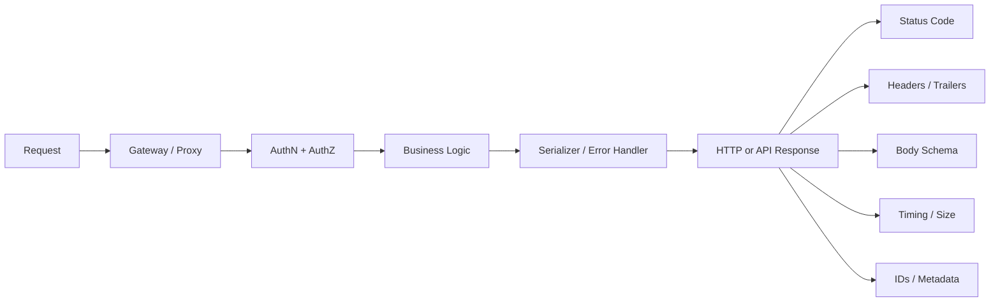
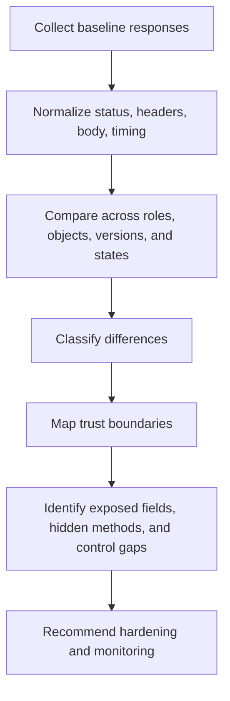

# Response Analysis

> **Response analysis** is the disciplined study of API status codes, headers, body shapes, error objects, timing, and metadata so an authorized tester can infer how the API enforces identity, authorization, data exposure, caching, and backend trust.

---

## 🧠 What Is It?

**Analogy:** If request analysis is reading the questions you ask an API, response analysis is reading the body language of the answer. Two replies might both say “no,” but one says “I do not know who you are,” another says “I know who you are, but you are not allowed,” and a third accidentally reveals the object schema, backend technology, and cache behavior while denying access.

That is why response analysis matters so much in API work.

In modern APIs, the response is often the clearest place to observe:

- **where authentication ends and authorization begins**
- **which objects and fields the server believes are in scope**
- **whether the gateway and backend behave consistently**
- **whether hidden versions, roles, tenants, or business states exist**
- **whether defensive controls such as caching, rate limiting, and CORS are correctly applied**

A mature tester does not read an API response as “success” or “failure.” They read it as a **compressed architecture diagram**.

---

## 🏗️ How It Works

Every response is evidence generated by several layers of the API stack:

1. **Transport and protocol handling** decide whether the request was syntactically acceptable.
2. **Gateway / proxy layers** may apply routing, TLS policy, rate limiting, or WAF logic.
3. **Authentication** identifies the caller or rejects them.
4. **Authorization** decides what object, action, field, or tenant scope is allowed.
5. **Business logic** performs the actual operation.
6. **Serialization and error handling** decide what gets returned and how much detail leaks.
7. **Operational controls** add headers, cache directives, correlation IDs, and telemetry hints.

That means a response can reveal far more than the data payload itself.



---

## 🧭 Mental Model: Read the 5 Rs

An easy way to remember response analysis is to read every response through the **5 Rs**:

| Lens | Key Question | Typical Clues | Why It Matters |
|---|---|---|---|
| **Route** | Did the endpoint, method, and media type really exist? | `404`, `405`, `415`, `Allow`, content negotiation errors | Maps the reachable surface |
| **Role** | Did the API recognize the caller, and at what trust level? | `401` vs `403`, `WWW-Authenticate`, role-specific fields | Separates authentication from authorization |
| **Record** | Which object, tenant, or workflow state did the server operate on? | IDs, tenant markers, state transitions, pagination cursors | Exposes object-level control assumptions |
| **Representation** | Exactly which fields, links, and metadata were returned? | JSON keys, embedded objects, enum values, null vs omitted fields | Reveals property-level exposure |
| **Runtime** | What operational behavior is visible? | timing, caching, rate-limit headers, server banners, correlation IDs | Reveals hidden controls and infrastructure |

If you consistently analyze these five dimensions, response analysis becomes repeatable instead of intuitive guesswork.

---

## 📊 Diagram: Turning Responses into an Attack-Surface Map



---

## ⚙️ Technical Details

### 1. Status Codes Are Surface-Mapping Signals

Status codes are not just success/failure markers. They tell you **which control made the decision** and often which branch of server logic executed.

| Code / Pattern | What It Often Means in API Testing | High-Value Questions |
|---|---|---|
| **200 OK** | Request succeeded and a representation was returned | Did the body expose extra fields, linked objects, or internal state? |
| **201 Created** | A new resource was created | Does `Location` expose predictable IDs or versioned paths? |
| **202 Accepted** | Async workflow accepted | Is there a job-status endpoint or queue identifier that expands the surface? |
| **204 No Content** | Action succeeded without body | Do headers still leak cache policy, versioning, or backend info? |
| **304 Not Modified** | Conditional caching path executed | Can private data be cached or revalidated unsafely? |
| **400 Bad Request** | Syntax/format/validation failed early | Does the API reveal parameter names, schema hints, or parser details? |
| **401 Unauthorized** | Authentication missing or invalid | Is the auth challenge clear without disclosing too much? |
| **403 Forbidden** | Identity recognized but blocked | Is this a real authorization boundary or should it be concealed? |
| **404 Not Found** | Resource absent or intentionally masked | Is this true absence, or “security through indistinguishable denial”? |
| **405 Method Not Allowed** | Path exists, verb denied | Does the `Allow` header expose extra methods? |
| **406 / 415** | Content negotiation or media type mismatch | Are unnecessary formats enabled? |
| **409 Conflict** | State-machine or concurrency issue | Does the workflow expose business-state assumptions? |
| **412 Precondition Failed** | Conditional request check failed | Are `ETag` / `If-Match` controls in place for update safety? |
| **422 Unprocessable Content** | Schema accepted, semantic validation failed | Does the error object over-document business rules? |
| **429 Too Many Requests** | Rate control triggered | Is rate limiting consistent across hosts, versions, and auth states? |
| **500 / 502 / 503** | Backend, upstream, or availability failure | Are stack traces, upstream names, or retry semantics exposed? |

### 2. Headers Often Reveal More Than the Body

Many teams focus on JSON bodies and ignore headers. That misses a major part of the attack surface.

| Header / Signal | What It Can Reveal | Defensive Interpretation |
|---|---|---|
| **Content-Type** | Actual response format (`application/json`, `application/problem+json`, XML, protobuf) | Restrict to intended media types and keep format handling consistent |
| **Location** | Canonical URI of created resources or redirected workflows | Useful for inventory; do not leak internal path structure unnecessarily |
| **Allow** | Methods enabled on an existing route | Useful for route mapping; disable verbs you do not need |
| **WWW-Authenticate** | Expected auth scheme, realm, token error type | Helpful to clients; avoid over-sharing token validation details |
| **Cache-Control** | Whether responses may be cached, revalidated, or stored | Sensitive API data should usually be `no-store` or tightly controlled |
| **ETag** | Representation version and conditional update support | Good for concurrency control; avoid exposing misleading validators |
| **Vary** | Which request headers influence the representation | Especially important when responses change by `Origin`, `Accept`, or language |
| **Access-Control-Allow-Origin** | Browser cross-origin exposure policy | Avoid `*` with sensitive resources; use `Vary: Origin` for reflected origins |
| **Retry-After** / rate-limit headers | Throttling and recovery semantics | Helpful for clients; should be consistent and not easily bypassed |
| **Set-Cookie** | Session design, flags, scope, SameSite behavior | Cookies should be scoped tightly and protected with `Secure` / `HttpOnly` |
| **Server / Via / X-Powered-By** | Upstream stack, proxies, framework hints | Minimize unnecessary infrastructure disclosure |
| **Traceparent / X-Request-ID / Correlation IDs** | Distributed tracing model and observability hooks | Great for support and logging; never treat them as secrets |
| **Trailer / grpc-status / grpc-message** | gRPC and streaming status behavior | Important for non-REST APIs where final status may arrive late |

### 3. The Body Tells You the Real Data-Exposure Story

OWASP API Security Top 10 2023 emphasizes that **inspecting API responses is often enough to spot sensitive property exposure**. In practice, the body is where you answer: **what did the server believe you were allowed to learn?**

#### Read bodies for these patterns

| Signal | What to Look For | Why It Matters |
|---|---|---|
| **Field overexposure** | admin flags, internal notes, tenant IDs, hashes, feature flags, workflow states | Common sign of broken object property-level authorization |
| **Embedded object leakage** | nested `owner`, `billing`, `permissions`, `recentLocation`, `internalStatus` objects | Nested representations often expose more than top-level schemas |
| **Identifier style** | numeric IDs, UUIDs, composite IDs, predictable sequences | Helps map objects and trust boundaries |
| **Null vs omitted** | field absent for one role, present-but-null for another | Can reveal field-level authorization behavior |
| **Validation detail** | exact enum values, regex rules, reserved names, parser errors | Useful for clients, but overly verbose errors expand the surface |
| **Pagination metadata** | `nextCursor`, `totalCount`, `pageSize`, filtered totals | Can reveal dataset size, segmentation, or hidden objects |
| **State indicators** | `pending`, `approved`, `archived`, `requiresReview` | Useful for workflow mapping and business-logic understanding |
| **Hypermedia links** | `links`, `actions`, `rel`, follow-up URLs | These can advertise additional callable functions |
| **Error format consistency** | same schema for auth, validation, business errors | Mature APIs are predictable; inconsistent errors often reveal architecture splits |

### 4. Problem Details and Error Objects Need Special Attention

Modern APIs increasingly use **RFC 9457 Problem Details** (`application/problem+json`) for machine-readable errors. This is good design, but it still needs careful redaction.

```json
{
  "type": "https://api.example.com/problems/validation-error",
  "title": "Validation failed",
  "status": 422,
  "detail": "One field failed validation.",
  "instance": "/requests/8d13f2c1",
  "errors": [
    {
      "field": "amount",
      "reason": "must be greater than zero"
    }
  ]
}
```

This format is helpful because it is structured and testable. It becomes dangerous when `detail` or extension fields leak:

- stack traces
- ORM class names
- SQL fragments
- filesystem paths
- upstream hostnames
- third-party API names
- tenant or object identifiers the caller should not learn

**Good error responses are descriptive for the intended client and boring for everyone else.**

### 5. Timing, Size, and Shape Differences Are Often the Hidden Signal

Even when bodies look similar, the surrounding characteristics may differ enough to reveal architecture and control flow.

| Differential Signal | What It May Mean | Example Interpretation |
|---|---|---|
| **Much faster denial** | Request rejected at gateway or auth layer | Token missing; request never reached business logic |
| **Much slower denial** | Request reached backend, DB, or policy engine | AuthZ check happened after object lookup or workflow evaluation |
| **Same status, different size** | Different logic branch | Two `403` responses may hide different role or object states |
| **Same body, different headers** | Different infrastructure path | Old version or partner host may skip cache/CORS/rate-limit policy |
| **Different field count by persona** | Property-level authorization | Admin and user routes may share path but not representation |
| **Different response format by host** | Inventory drift | One host returns Problem Details, another returns framework defaults |

This is why response analysis should never rely on status code alone.

### 6. Protocol-Specific Response Clues

API response analysis is broader than JSON over REST.

| Protocol / Style | Response Traits | High-Value Clues |
|---|---|---|
| **REST / JSON** | status line, headers, JSON body | field exposure, cache policy, method surface, pagination metadata |
| **GraphQL** | usually HTTP `200` with `data`, `errors`, `extensions` | partial success, field-level auth failures, resolver leakage, introspection hints |
| **gRPC** | HTTP/2, protobuf payloads, trailers, `grpc-status` | late status, service reflection, method naming, proxy/gateway translation gaps |
| **SOAP** | XML envelope, SOAP Faults, namespaces | fault detail leakage, backend service names, WSDL-driven schema clues |
| **WebSocket / SSE** | long-lived channel with message-level acknowledgements | message auth boundaries, event names, subscription scope, partial authorization |
| **Webhook receivers** | minimal acknowledgement responses | signature verification behavior, retry semantics, event-id handling |

#### GraphQL note

GraphQL deserves special care because **HTTP status is often not enough**. A GraphQL response can be a partial success:

```json
{
  "data": {
    "user": {
      "id": "123",
      "email": "redacted@example.com"
    }
  },
  "errors": [
    {
      "message": "Forbidden field: billingProfile",
      "path": ["user", "billingProfile"]
    }
  ]
}
```

That tells you the request reached the resolver layer, that object access may be allowed, and that field-level authorization is being enforced or inconsistently exposed.

#### gRPC note

gRPC responses often require reading **trailers** and transport metadata, not just the visible HTTP code. A proxy might show HTTP `200` while the real application outcome is carried in `grpc-status` and `grpc-message`.

---

## 🧪 Authorized Workflow: Compare Responses Safely

Use response analysis only in a **written-authorized scope** with **test accounts, test tenants, or staging environments** whenever possible. The goal is to understand controls, not to abuse them.

A safe comparison workflow looks like this:

1. Capture a **baseline** response for a normal, expected request.
2. Compare the same request across **known test personas** such as unauthenticated, standard user, and admin.
3. Compare responses for **owned test objects** in different tenants or lifecycle states.
4. Normalize and diff **headers, body shape, and timing**.
5. Record the results in a response matrix so findings become repeatable evidence.

```bash
# Example: compare responses from your own lab or staging API
BASE="https://api.lab.example"

curl -sS -D /tmp/user.headers \
  -H "Authorization: Bearer $USER_TOKEN" \
  "$BASE/v1/profile" | jq -S . > /tmp/user.body.json

curl -sS -D /tmp/admin.headers \
  -H "Authorization: Bearer $ADMIN_TOKEN" \
  "$BASE/v1/profile" | jq -S . > /tmp/admin.body.json

printf '\n--- header diff ---\n'
diff -u /tmp/user.headers /tmp/admin.headers || true

printf '\n--- body diff ---\n'
diff -u /tmp/user.body.json /tmp/admin.body.json || true
```

This simple workflow often reveals:

- fields only one role can see
- different cache or CORS behavior by persona or host
- different error envelopes from different backend paths
- headers that disappear on older versions or alternate routes

---

## 🗂️ Build a Response Fingerprint Register

A strong engagement turns raw responses into structured evidence.

| Column | Purpose |
|---|---|
| **Endpoint + method** | Identify the callable surface precisely |
| **Persona / token type** | Show which identity context produced the response |
| **Object / tenant scope** | Tie the response to a specific record or business state |
| **Status code** | Capture the coarse control outcome |
| **Content type** | Track representation differences |
| **Key headers** | Record cache, CORS, auth, rate-limit, tracing, and version signals |
| **Body schema / field count** | Detect overexposure and role-based differences |
| **Time / size** | Surface hidden logic branches |
| **Observed controls** | Note auth, authZ, concurrency, caching, or throttling behavior |
| **Risk notes** | Summarize what should be reviewed next |

Example row:

| Endpoint | Persona | Scope | Status | Notable Clues | Interpretation |
|---|---|---|---|---|---|
| `GET /v1/orders/123` | standard user | own order | `200` | `ETag`, `Cache-Control: no-store`, 11 fields | expected baseline |
| `GET /v1/orders/123` | admin | same order | `200` | 16 fields, includes `internalStatus` | admin-only representation |
| `GET /v1/orders/123` | standard user | different test tenant object | `404` | same envelope, same latency | likely intentional object-concealing denial |

That register becomes part of the **attack surface model**, not just a collection of screenshots.

---

## 🔍 What High-Quality Response Analysis Usually Finds

| Finding Theme | Response Clue | Why It Matters |
|---|---|---|
| **Broken object property-level authorization** | extra fields appear for a lower-privilege persona | Sensitive data is exposed directly in the representation |
| **Security misconfiguration** | verbose stack traces, missing cache directives, broad CORS headers | The platform leaks implementation details or weakens browser protections |
| **Inventory drift** | same endpoint behaves differently on old hosts or versions | Hidden environments or deprecated APIs enlarge the surface |
| **Gateway/backend inconsistency** | one route has rate-limit headers and another equivalent route does not | Controls are not enforced uniformly |
| **Weak workflow modeling** | different business states return overly descriptive errors | Attackers and testers can infer valid states and transitions |
| **Unsafe third-party dependence** | upstream-specific error details bubble back | Internal dependencies become externally visible |

---

## ⚠️ Common Analyst Mistakes

| Mistake | Why It Is Wrong | Better Approach |
|---|---|---|
| **“It returned 404, so it does not exist.”** | Many APIs deliberately mask forbidden objects as `404` | Compare envelopes, timing, headers, and behavior across known test objects |
| **“It returned 200, so access is fine.”** | Success may still include excessive fields or unsafe metadata | Inspect the representation, not just the status |
| **“204 means nothing to analyze.”** | Headers still reveal caching, versioning, and routing | Always capture headers on “empty” responses |
| **“Only the JSON body matters.”** | CORS, auth challenges, cache, and rate limiting live in headers | Analyze the full response envelope |
| **“One environment is enough.”** | Older versions and alternate hosts often behave differently | Sample by version, hostname, persona, and protocol |
| **“Errors are just developer noise.”** | Error objects frequently reveal the trust boundary and parser path | Normalize and classify error responses carefully |

---

## 🛡️ Defensive Guidance

Response analysis is not only a testing technique. It is also a design review tool.

### Response-hardening principles

1. **Return only the fields each client truly needs.** Avoid generic object serialization.
2. **Keep denial behavior deliberate.** Decide when to use `403` versus `404` concealment and apply it consistently.
3. **Adopt structured error formats, but redact internals.** RFC 9457 is useful when `detail` is carefully controlled.
4. **Set cache policy intentionally.** Sensitive API data should not be cached by default.
5. **Treat CORS as part of the response contract.** Reflected origins require `Vary: Origin` and tight allowlists.
6. **Minimize infrastructure disclosure.** Remove unnecessary banner and framework headers.
7. **Validate responses against schemas.** Response allowlists are as important as request validation.
8. **Compare outputs across personas and tenants in automated tests.** This is how many property-level leaks are prevented before release.
9. **Keep rate-limit semantics consistent across hosts, versions, and protocols.** Differences create shadow paths.
10. **Log rich context internally, not externally.** Clients need stable error contracts; operators need the detail in telemetry.

### Defender checklist

- [ ] Are sensitive responses explicitly marked with safe cache directives?
- [ ] Are response schemas defined for both success and error cases?
- [ ] Do equivalent routes return consistent auth, rate-limit, and CORS headers?
- [ ] Are stack traces, ORM names, upstream hosts, and filesystem paths removed from client-visible errors?
- [ ] Do role and tenant tests verify both **object access** and **field visibility**?
- [ ] Are legacy versions and alternate hosts included in response-contract testing?
- [ ] Are GraphQL, gRPC, SOAP, and webhook error paths reviewed, not just REST JSON paths?

---

## 📚 Research Notes and References

This note is aligned with the repository API architecture and with public guidance that consistently ties response analysis to **authorization**, **security misconfiguration**, **inventory management**, and **HTTP semantics**.

- **OWASP Attack Surface Analysis Cheat Sheet** — defines attack surface as data/command paths into and out of the application, plus the controls that protect those paths.
- **OWASP API Security Top 10 2023** — especially:
  - **API3: Broken Object Property Level Authorization** for field exposure and response inspection
  - **API8: Security Misconfiguration** for verbose errors, missing cache directives, and weak CORS behavior
  - **API9: Improper Inventory Management** for documentation blind spots, alternate hosts, and inconsistent versions
- **RFC 9110: HTTP Semantics** — normative semantics for status codes, representations, caching, and conditional requests.
- **RFC 9457: Problem Details for HTTP APIs** — structured machine-readable error objects for HTTP APIs.
- **MDN HTTP Status documentation** — practical status code behavior reference for API consumers and testers.
- **MDN `Access-Control-Allow-Origin` documentation** — important guidance on wildcard origins, credentials, and `Vary: Origin`.
- **MDN `ETag` documentation** — explains conditional requests, caching, and optimistic concurrency behavior.
- **Microsoft REST API design guidance** — reinforces the importance of predictable resource representations and HTTP semantics in API design.

---

## ✅ Key Takeaway

**A response is never “just output.”**

For an authorized API tester, a response is a layered signal about:

- the reachable route
- the recognized identity
- the object or tenant in scope
- the exact representation exposed
- the defensive controls wrapped around all of it

If request analysis tells you **what you asked**, response analysis tells you **how the system thinks**.
