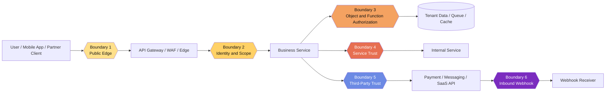
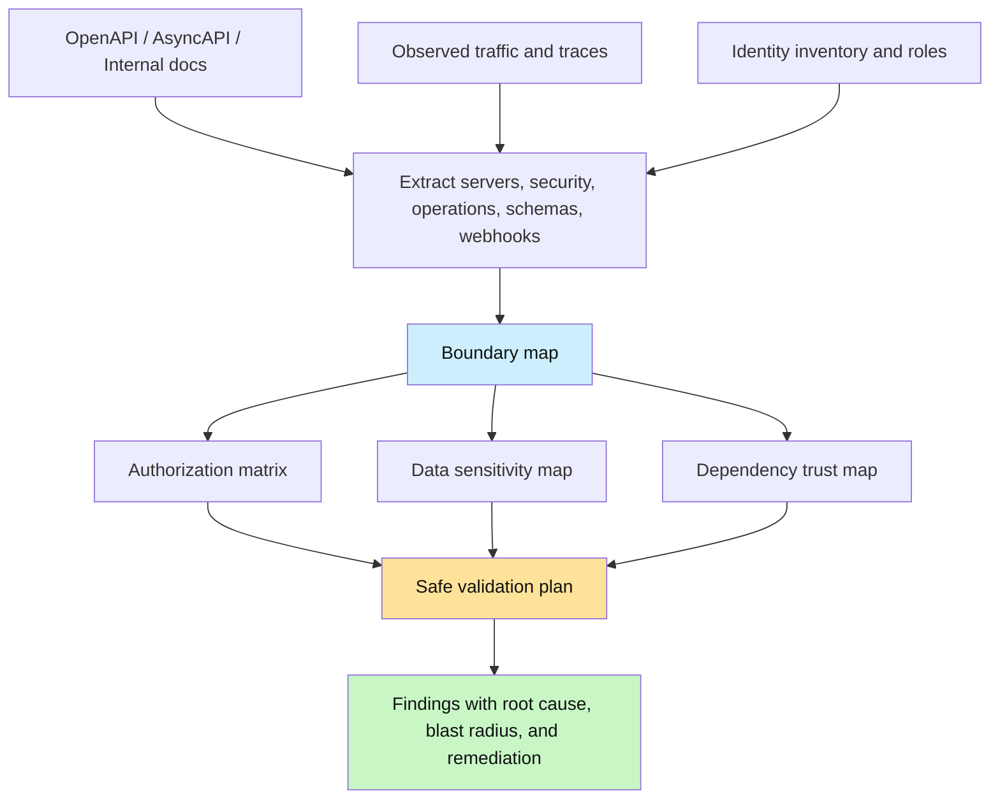
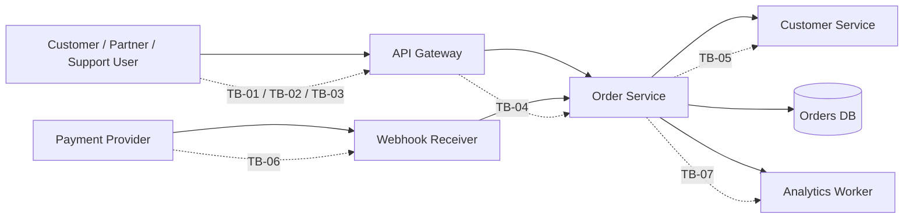

# Trust Boundary Mapping

> **Phase 06 — API Attack Surface Mapping**  
> **Focus:** understanding where trust changes across clients, gateways, services, identities, data stores, and third-party integrations.  
> **Safety note:** this note is for **authorized API security testing and defensive architecture review only**. It explains how to map trust, validate assumptions safely, and harden boundaries. It does **not** provide step-by-step abuse instructions or disruptive testing playbooks.

---

**Difficulty:** Beginner → Advanced  
**Category:** API Pentesting — Attack Surface Mapping  
**Relevant risks:** OWASP API1:2023, API3:2023, API5:2023, API9:2023, API10:2023  
**Spec anchors:** OpenAPI `servers`, `paths`, `security`, `components.securitySchemes`, schemas, `callbacks` / `webhooks`

---

## Table of Contents

1. [What Trust Boundary Mapping Means](#what-trust-boundary-mapping-means)
2. [Why It Matters So Much for APIs](#why-it-matters-so-much-for-apis)
3. [Beginner Mental Model](#beginner-mental-model)
4. [Diagram 1: The API Trust Stack](#diagram-1-the-api-trust-stack)
5. [Boundary Types That Usually Matter](#boundary-types-that-usually-matter)
6. [Reading the API Spec as a Boundary Map](#reading-the-api-spec-as-a-boundary-map)
7. [Diagram 2: From Spec to Boundary Map](#diagram-2-from-spec-to-boundary-map)
8. [A Safe Mapping Workflow for Authorized Testers](#a-safe-mapping-workflow-for-authorized-testers)
9. [Protocol-Specific Boundary Blind Spots](#protocol-specific-boundary-blind-spots)
10. [Common Boundary Failures in Real APIs](#common-boundary-failures-in-real-apis)
11. [Worked Example: Order API Trust Mapping](#worked-example-order-api-trust-mapping)
12. [Diagram 3: Worked Example Flow](#diagram-3-worked-example-flow)
13. [Reporting Guidance](#reporting-guidance)
14. [Defensive Controls That Reduce Boundary Failures](#defensive-controls-that-reduce-boundary-failures)
15. [Public References](#public-references)
16. [Key Takeaways](#key-takeaways)

---

## What Trust Boundary Mapping Means

A **trust boundary** is any place where a system changes its security assumptions.

In API work, that usually means a request, token, message, or data object moves from one context into another context with **different privileges, validation rules, or ownership**.

A good mental shortcut is:

```text
Boundary = "someone or something is trusted differently after this point"
```

That “someone or something” might be:

- an anonymous caller becoming an authenticated user
- a normal user invoking an admin-capable operation
- an API gateway forwarding a request to a backend service
- one microservice trusting another service's token or identity
- a webhook receiver trusting that an inbound event really came from a partner
- a backend trusting data returned by a third-party API
- one tenant's data context being separated from another tenant's

> **Important:** a trust boundary is **not only** a network edge. It can be an identity change, a role change, a tenant change, a protocol change, a message-queue hop, or a switch from first-party to third-party data.

If attack surface mapping asks **“what is exposed?”**, trust boundary mapping asks:

> **“Where does the system stop verifying and start assuming?”**

---

## Why It Matters So Much for APIs

Modern APIs are full of places where trust can silently expand:

- one bearer token may be accepted by many services
- one GraphQL endpoint may hide dozens of authorization boundaries
- one gateway policy may be assumed to protect backend functions that it never actually enforces
- one webhook integration may let an external system trigger internal actions
- one internal-only service may become reachable through direct routing, sidecars, or stale paths

This is why trust boundary mapping sits in the middle of API attack surface analysis.

It connects:

- **endpoint mapping** → what exists
- **parameter mapping** → what users control
- **data flow analysis** → where information travels
- **business logic analysis** → what actions matter
- **authorization matrix work** → who should be allowed to do what

### Why public guidance converges on this idea

Multiple public sources point to the same conclusion:

- **NIST SP 800-207** says there should be **no implicit trust based only on network location**. In API terms, “internal” is not enough; every resource request still needs policy.
- **OWASP API Security Top 10 2023** keeps emphasizing authorization, inventory, business flow abuse, and unsafe third-party trust. Those are all trust-boundary failures in different forms.
- **OpenAPI 3.1** makes security, servers, operations, schemas, callbacks, and webhooks explicit. A good spec is therefore not just documentation; it is a partial trust map.
- **Microsoft SDL / threat modeling guidance** emphasizes drawing the design so teams can reason about where trust changes. API boundary mapping is exactly that discipline, applied to services and identities.

---

## Beginner Mental Model

Think of an API system like an airport with multiple checkpoints.

- The **public API endpoint** is the terminal entrance.
- **Authentication** is the ID check.
- **Authorization** is whether you may enter a specific gate.
- **Field-level controls** are whether you may open a specific door inside that gate.
- **Service-to-service identity** is staff-only movement behind the scenes.
- **Webhooks and partner APIs** are deliveries arriving from outside vendors.

The key lesson is simple:

> **Passing one checkpoint does not mean you should be trusted at every checkpoint after it.**

### A memorable five-question model

Every good boundary map should answer five questions:

| Question | What it means |
|---|---|
| **Who is crossing?** | anonymous user, customer, admin, partner, service, webhook sender |
| **What proof is presented?** | cookie, JWT, API key, mTLS identity, signature, internal header |
| **What is being requested?** | object read, object update, admin function, batch action, callback |
| **What downstream trust is inherited?** | backend service access, queue access, database row access, third-party call |
| **What evidence should exist?** | logs, traces, policy decision, correlation ID, audit trail |

If one of those answers is vague, the boundary is probably weak.

---

## Diagram 1: The API Trust Stack



### What this diagram teaches

An API request rarely crosses only one security boundary.

A single “successful” call may involve:

1. edge acceptance
2. token validation
3. object-level authorization
4. service-to-service trust propagation
5. third-party dependency trust
6. asynchronous callback trust

That is why a flat endpoint list is not enough. You need the **path of trust decisions**.

---

## Boundary Types That Usually Matter

| Boundary type | What changes at the boundary? | Typical evidence source | Common failure pattern |
|---|---|---|---|
| **Anonymous → Authenticated** | caller gets an identity and session context | login flow, token issuer, security scheme | weak auth, optional auth where it should be mandatory |
| **Authenticated → Privileged action** | same identity reaches a more sensitive function | role mapping, operation security, admin tags | broken function-level authorization |
| **Caller → Object owner** | system decides whether this caller may touch this record | path parameters, object IDs, ownership checks | BOLA / IDOR-style failures |
| **Caller → Sensitive property** | system decides whether specific fields may be read or written | response schema, request schema, hidden fields | property-level authorization failures |
| **Gateway → Backend** | backend trusts headers, scopes, or prior checks from the edge | forwarded headers, service mesh config, routing rules | backend assumes gateway already enforced policy |
| **Service → Service** | one workload accepts another workload's identity | mTLS, workload identity, JWT audience, service accounts | overbroad service trust or token replay |
| **Tenant A → Tenant B** | tenant context must stay isolated | tenant IDs, org IDs, row filters, claims | cross-tenant leakage |
| **First-party → Third-party API** | outbound call relies on external system or data | partner docs, SDK config, callback contracts | unsafe consumption of external data |
| **Third-party → Inbound webhook** | external event is accepted as genuine | signature verification, timestamp, replay defense | forged or replayed webhook events |
| **Synchronous → Asynchronous** | message is trusted after queue/event hop | queues, topics, event schemas, consumers | missing producer identity or stale authorization assumptions |
| **Documented → Undocumented route** | inventory and control ownership change | traffic captures, gateway config, debug routes | shadow APIs and stale versions |
| **REST endpoint → Hidden protocol surface** | same business function may exist in GraphQL, gRPC, or WebSocket form | schema, reflection, subscriptions, callbacks | security parity gaps across protocols |

### A useful rule

If a boundary changes any of the following, it deserves explicit mapping:

- **identity**
- **role**
- **tenant**
- **data sensitivity**
- **execution context**
- **ownership**
- **protocol**
- **dependency trust**

---

## Reading the API Spec as a Boundary Map

A good API specification is not just a list of endpoints. It is often the fastest way to locate where trust should change.

### What to extract from an OpenAPI document

| Spec element | What it reveals | Boundary question to ask |
|---|---|---|
| **`servers`** | internet-facing, partner, staging, regional, or internal target URLs | Which environments exist, and are they equally protected? |
| **global `security`** | default authentication expectation | Which operations should require identity by default? |
| **operation-level `security` overrides** | exceptions to the default | Where is auth optional, weaker, or different? |
| **`paths` + HTTP methods** | object access and action surface | Which operations are reads, writes, deletes, admin actions, or workflow triggers? |
| **parameters** | user-controlled identifiers and filters | Which inputs choose the object, tenant, role, or business action? |
| **request bodies / schemas** | writable fields | Which fields should never be user-controlled or are privileged only? |
| **response schemas** | readable fields | Which properties are sensitive, tenant-specific, or admin-only? |
| **`components.securitySchemes`** | JWT, API key, OAuth, mTLS, cookie, signature models | Are there multiple identity paths with different trust levels? |
| **`callbacks` / `webhooks`** | reverse trust direction | Which inbound requests must be authenticated as external events? |
| **tags / descriptions** | business domain and ownership hints | Which teams or functions own the boundary? |
| **server variables / extensions** | hidden environment or routing clues | Are there alternate hosts, base paths, or deployment modes? |

### Spec-driven example

```yaml
openapi: 3.1.0
servers:
  - url: https://api.example.com/v1
    description: Public production API
  - url: https://partner-api.example.com/v1
    description: Partner channel
security:
  - bearerAuth: []

paths:
  /orders/{orderId}:
    get:
      summary: Read a single order
      operationId: getOrder
    patch:
      summary: Update an order
      operationId: updateOrder
      security:
        - bearerAuth: [orders.write]

  /admin/refunds/{refundId}:
    post:
      summary: Approve a refund
      operationId: approveRefund
      security:
        - bearerAuth: [refunds.approve]

webhooks:
  paymentStatusChanged:
    post:
      summary: Payment provider event
      security:
        - webhookSignature: []
```

### What a reviewer should immediately notice

- there are **multiple server contexts** (`api` and `partner-api`)
- `/orders/{orderId}` suggests an **object ownership boundary**
- `PATCH` implies a **write-trust boundary**, not just a read boundary
- `/admin/refunds/{refundId}` suggests a **function-level privilege boundary**
- `webhooks` introduces an **external-to-internal inbound trust boundary**
- a global bearer model plus scoped overrides suggests **authorization decisions should vary per operation**

### When the spec is incomplete

Many real systems have partial or stale documentation. In that case, use three inputs together:

| Source | Why it matters |
|---|---|
| **Spec** | shows intended trust and documented routes |
| **Observed traffic** | shows real behavior, hidden routes, headers, and alternate flows |
| **Identity inventory** | shows which humans, services, partners, and webhook senders actually exist |

The mismatch between those three sources is often where the most valuable findings live.

---

## Diagram 2: From Spec to Boundary Map



---

## A Safe Mapping Workflow for Authorized Testers

Trust boundary mapping should feel more like **design analysis plus controlled validation** than “trying random things.”

### 1. List every actor class

Do not stop at “user” and “admin.” Modern APIs usually have:

- anonymous callers
- registered customers
- support roles
- finance or operations roles
- partner accounts
- mobile apps
- SPA frontends
- service accounts
- CI/CD or automation identities
- webhook senders
- internal workloads

### 2. List the important objects and actions

Examples:

- accounts
- orders
- invoices
- tickets
- API keys
- invitations
- reports
- admin approvals
- exports
- webhooks
- batch jobs

Boundary mapping becomes much easier when every action is framed as:

```text
actor -> operation -> object -> downstream effect
```

### 3. Mark where trust changes

For each flow, ask:

- where is identity established?
- where is identity transformed into scopes, roles, or claims?
- where is object ownership checked?
- where are sensitive properties filtered?
- where does the backend trust edge-provided context?
- where does a service trust another service or partner?
- where does the system accept inbound events or messages?

### 4. Distinguish authentication from authorization

A repeated API mistake is documenting the first but assuming the second.

| Control type | Main question |
|---|---|
| **Authentication** | Is the caller really who they claim to be? |
| **Authorization** | Should this caller be allowed to perform this action on this object or property? |
| **Context binding** | Is the caller bound to the correct tenant, device, environment, audience, or workflow state? |

A valid token that is accepted everywhere is usually a trust design problem, not just an authn problem.

### 5. Map data sensitivity separately from endpoint sensitivity

An endpoint may look harmless while returning high-value fields.

| Endpoint question | Data question |
|---|---|
| Can this caller reach the route? | Can this caller see all returned fields? |
| Can this caller invoke the function? | Can this caller write every field in the payload? |
| Is the route documented as internal or admin? | Are internal-only properties still exposed in the schema or response? |

This is where many **property-level authorization** issues are found.

### 6. Capture what should be logged

A trust boundary without telemetry is hard to defend.

For each important boundary, note whether the system records:

- actor identity
- tenant or customer context
- object identifier accessed
- decision outcome (allowed / denied)
- policy or scope used
- service-to-service caller identity
- webhook verification result
- correlation or trace ID

### 7. Validate safely and stop once the trust failure is proven

In an authorized engagement, the goal is to show:

- **which boundary failed**
- **what control should have enforced it**
- **what business impact would reasonably follow**

It is rarely necessary to push far beyond the first clear proof.

### Boundary mapping worksheet

| Field | Purpose |
|---|---|
| **Boundary ID** | unique identifier such as `TB-01` |
| **Source actor** | who initiates the request or message |
| **Destination** | gateway, service, queue, datastore, webhook receiver |
| **Trust assumption** | what the destination assumes to be true |
| **Required control** | authn, authz, signature, mTLS, schema validation, replay defense |
| **Protected asset** | object, function, property, tenant, workflow, data class |
| **Evidence source** | spec, trace, log, config, interview, observed traffic |
| **Expected telemetry** | logs, traces, audit events |
| **Owner** | team responsible for the boundary |
| **Status** | documented, verified, missing, inconsistent |

---

## Protocol-Specific Boundary Blind Spots

Different API styles hide trust in different places.

| Protocol / pattern | Boundary that gets missed | Why teams miss it |
|---|---|---|
| **REST** | object ownership and function-level differences across verbs | route lists look simple, but `GET`, `PATCH`, and `DELETE` carry different trust |
| **GraphQL** | field-level and mutation-level authorization | one endpoint creates the illusion of one boundary |
| **gRPC** | per-method authorization and service reflection exposure | binary transport hides method surface from normal HTTP-centric review |
| **WebSockets** | message-level authorization after handshake | teams validate only the initial connection token |
| **Webhooks** | sender authenticity, replay protection, and event-to-action trust | the inbound flow is often treated like “just another POST” |
| **Async queues / events** | producer identity and stale authorization assumptions | message consumers may trust the queue more than the producer |
| **Mobile-specific APIs** | version drift and alternate base paths | mobile and web clients often follow different trust paths |
| **Partner APIs** | broader scopes and weaker operational controls | partner integrations are “trusted business” paths and get less scrutiny |

### REST-specific example

A single resource often contains at least four distinct trust decisions:

| Operation | Real boundary question |
|---|---|
| `GET /orders/{id}` | may this caller read this order? |
| `PATCH /orders/{id}` | may this caller change this order? |
| `DELETE /orders/{id}` | may this caller remove this order? |
| `POST /orders/{id}/refund` | may this caller perform a privileged workflow on this order? |

### GraphQL-specific example

In GraphQL, boundary mapping must happen at:

- query level
- field level
- mutation level
- resolver level
- subscription level

A token that may call `/graphql` is **not** proof that it may access every type, field, mutation, or nested relationship.

### gRPC-specific example

Boundary questions often live in:

- method names
- protobuf field meanings
- service-to-service identities
- reflection exposure
- trust between ingress, sidecar, and backend services

### WebSocket-specific example

There are usually two separate boundaries:

1. **connection establishment** — who may connect?
2. **message handling** — what may this connected client actually do?

### Webhook-specific example

The key question is not just “did we receive a valid HTTP request?”

It is:

> **“Why does the system believe this external event is authentic, fresh, intended for this tenant, and allowed to trigger this action?”**

---

## Common Boundary Failures in Real APIs

| Failure pattern | Boundary that failed | Why it happens | Likely impact | Strong defensive fix |
|---|---|---|---|---|
| **Gateway validates token, backend trusts everything after that** | edge → backend | ownership checks are assumed to exist upstream | unauthorized object or function access | enforce authz in backend services too |
| **Object ID accepted without ownership enforcement** | caller → object | identifier is treated as proof of ownership | BOLA / cross-account access | server-side ownership checks on every object access |
| **Client may set privileged fields** | caller → sensitive property | writable schema is broader than intended | role change, price change, status change | allowlists for writable fields and role-aware validation |
| **Admin and user actions share the same token model without strong scopes** | authenticated → privileged function | scopes/roles are vague or inconsistently enforced | high-impact function abuse | per-operation authorization with explicit scopes and policy |
| **Internal API reachable directly** | internet / partner → internal service | network path or routing bypasses expected edge controls | exposure of debug, admin, or legacy functions | network segmentation plus service identity and backend auth |
| **Tenant context taken from a controllable header or parameter** | caller → tenant | tenant binding relies on user-controlled metadata | cross-tenant leakage | derive tenant from trusted identity context, not caller input alone |
| **Webhook receiver trusts any correctly shaped request** | third-party → inbound action | no signature, timestamp, or replay defense | fraudulent status changes or workflow triggers | signed events, clock checks, nonce/replay protections |
| **Third-party API response trusted like local data** | external API → internal processing | partner data is treated as inherently safe | unsafe consumption, downstream fraud, bad state | validate source, schema, and business constraints |
| **Queue consumers assume messages came from trusted producers** | async producer → consumer | queue access implies trust | unauthorized jobs or stale authority propagation | producer identity, signed claims, and consumer-side revalidation |
| **GraphQL field auth assumed because endpoint auth exists** | caller → field | endpoint-centric thinking | hidden data exposure | field- and resolver-level authorization checks |
| **WebSocket auth checked only at handshake** | connected client → message action | long-lived channels are treated as permanently trusted | unauthorized actions after connection | message-level authorization and session revalidation |

### How these map to OWASP API risks

| OWASP API risk | Trust-boundary interpretation |
|---|---|
| **API1:2023 Broken Object Level Authorization** | object boundary is missing or weak |
| **API3:2023 Broken Object Property Level Authorization** | property boundary is missing or weak |
| **API5:2023 Broken Function Level Authorization** | privileged action boundary is missing or weak |
| **API9:2023 Improper Inventory Management** | undocumented or stale boundaries still exist |
| **API10:2023 Unsafe Consumption of APIs** | third-party trust boundary is broader than validation |

---

## Worked Example: Order API Trust Mapping

Imagine a commerce platform with these components:

- mobile app
- web frontend
- partner order portal
- API gateway
- order service
- customer profile service
- payment provider
- inbound webhook receiver
- analytics export worker

### Step 1: identify the major actors

| Actor | Why it matters |
|---|---|
| **anonymous visitor** | may create accounts, browse, or initiate checkout |
| **customer** | may read and modify only their own orders |
| **support agent** | may view more data but should not approve refunds freely |
| **finance approver** | may approve refund operations |
| **partner account** | may access only partner-owned orders |
| **order service** | may call internal services on behalf of a user flow |
| **payment provider** | may send status webhooks but should not trigger arbitrary actions |
| **analytics worker** | may read broad data sets but should not mutate business state |

### Step 2: identify the most important boundaries

| Boundary ID | Flow | What must be true |
|---|---|---|
| **TB-01** | customer → `GET /orders/{orderId}` | caller must own the order or hold a legitimate support role |
| **TB-02** | customer → `PATCH /orders/{orderId}` | caller may change only allowed fields on their own order |
| **TB-03** | support agent → `POST /admin/refunds/{refundId}/approve` | support role alone is not enough; explicit finance approval privilege is required |
| **TB-04** | gateway → order service | backend must not trust forwarded identity context blindly |
| **TB-05** | order service → customer service | service identity and user context must both be constrained |
| **TB-06** | payment provider → webhook receiver | event must be signed, fresh, and mapped to the right tenant/order |
| **TB-07** | order service → analytics export | export path must preserve tenant and sensitivity controls |

### Step 3: mark the sensitive objects and fields

| Object / field | Why sensitive? | Typical mistake |
|---|---|---|
| **`orderId`** | direct object selector | treated as enough proof of access |
| **`tenantId`** | isolation boundary | taken from caller input instead of trusted context |
| **`refundStatus`** | privileged workflow state | writable by roles that should only read |
| **`discountCode`** | business logic and fraud exposure | update allowed without workflow checks |
| **`paymentState`** | can trigger shipping, reversal, or accounting flows | changed from unverified external events |
| **`customerEmail` / `address`** | privacy-sensitive data | exposed to roles that only need summary data |

### Step 4: note what mature reviewers look for

A strong reviewer does not only ask whether the route is authenticated.

They ask:

- does the same token work across customer, partner, and support paths?
- does the order service trust gateway headers more than independently checked claims?
- is refund approval separated from refund request submission?
- can a webhook update any order, or only the intended order for the intended tenant?
- does analytics export inherit broader access than the live API?
- do support and finance workflows share objects but require different policy decisions?

That is the difference between a route inventory and a real trust map.

---

## Diagram 3: Worked Example Flow



### Simple interpretation

The highest-value question is not:

> “How many endpoints exist?”

It is:

> **“Which of these trust decisions, if wrong, would let the wrong actor read, change, approve, or trigger something important?”**

---

## Reporting Guidance

The most useful boundary-mapping findings are written around **failed trust assumptions**, not just raw endpoints.

### A good report structure

| Report element | What to write |
|---|---|
| **Boundary name** | `Support role to refund approval boundary` |
| **Expected trust rule** | only finance-approved identities may approve refunds |
| **Observed weakness** | support identities can reach the same approval path without a distinct policy decision |
| **Protected asset** | refund workflow integrity, financial controls, audit accuracy |
| **Likely impact** | unauthorized refund approval, fraud, policy bypass |
| **Telemetry expectation** | approval decisions should log actor, role, refund ID, tenant, and policy result |
| **Root cause** | gateway-level authentication exists, but backend function-level authorization is missing or inconsistent |
| **Recommended fix** | enforce backend authorization, split permissions, add approval workflow checks, strengthen audit logging |

### Questions that make reports sharper

- **Which trust boundary failed?**
- **What control should have held there?**
- **Was the failure about authn, authz, tenant binding, field filtering, service identity, or third-party trust?**
- **What realistic business outcome would follow if an attacker crossed that boundary?**
- **What would defenders expect to see in logs if this happened for real?**

### What weak reporting looks like

Weak:

```text
/admin/refunds looked sensitive.
```

Strong:

```text
The boundary between support-role access and refund-approval authority is not
cleanly enforced. The same authenticated context that is valid for support
operations can invoke a higher-trust refund approval action, creating a broken
function-level authorization condition with direct financial impact.
```

---

## Defensive Controls That Reduce Boundary Failures

| Layer | Defensive control | Why it helps |
|---|---|---|
| **Edge** | strong authn, scope-aware gateways, resource limits | reduces low-trust traffic and enforces coarse policy early |
| **Application** | object-, field-, and function-level authorization in backend code | prevents overreliance on gateway decisions |
| **Identity** | short-lived tokens, audience restriction, sender-constrained tokens, step-up auth | narrows token trust and blast radius |
| **Service-to-service** | workload identity, mTLS, explicit service authz, narrow service accounts | stops “internal equals trusted” thinking |
| **Data** | row/tenant security, field filtering, write allowlists | enforces sensitivity closer to the asset |
| **Third-party** | schema validation, signature verification, replay defense, business-rule checks | keeps partner trust bounded |
| **Async systems** | producer identity, consumer revalidation, immutable event metadata | reduces stale trust across queues and jobs |
| **Observability** | policy decision logs, correlation IDs, actor/tenant binding in traces | makes trust failures visible |
| **Governance** | up-to-date specs, threat modeling, API inventory ownership | closes API9-style inventory gaps |

### Modern design patterns worth remembering

- **Zero trust for APIs:** do not treat “internal” as automatically safe.
- **Policy near the resource:** the closer authorization lives to the protected object or function, the stronger the boundary usually is.
- **Machine identity matters:** service accounts and workload identities are part of the attack surface, not implementation details.
- **Spec-driven security review:** if the spec cannot express the trust model clearly, the implementation is usually even harder to defend.
- **Draw the system:** a visual trust map catches mistakes faster than prose alone.

### A practical defensive mantra

```text
Authenticate the caller.
Authorize the action.
Bind the tenant.
Filter the fields.
Verify the dependency.
Log the decision.
```

That sequence is easy to remember because it matches the most common places APIs fail.

---

## Public References

- **OWASP API Security Top 10 2023** — especially API1, API3, API5, API9, and API10
- **NIST SP 800-207: Zero Trust Architecture**
- **OpenAPI Specification 3.1** — `servers`, `security`, `securitySchemes`, schemas, callbacks, and webhooks
- **Microsoft Security Development Lifecycle / Threat Modeling Tool guidance**
- **OWASP Threat Dragon / OWASP threat modeling guidance**
- **SPIFFE overview** for workload identity and service-to-service trust in distributed systems

---

## Key Takeaways

- Trust boundary mapping is the move from **“what exists?”** to **“where does trust change?”**
- In APIs, the most important boundaries are often **identity, object, function, field, tenant, service, and third-party** boundaries.
- A valid token is never the whole story. Mature API review asks what the token should **not** be allowed to do.
- OpenAPI documents can act as partial trust maps when you read `servers`, `security`, operations, schemas, and webhooks carefully.
- The most valuable findings usually come from **mismatches** between the documented model, the observed behavior, and the real identity inventory.
- The best remediation is not just “add auth.” It is **tighten trust at every decision point and make those decisions visible.**
