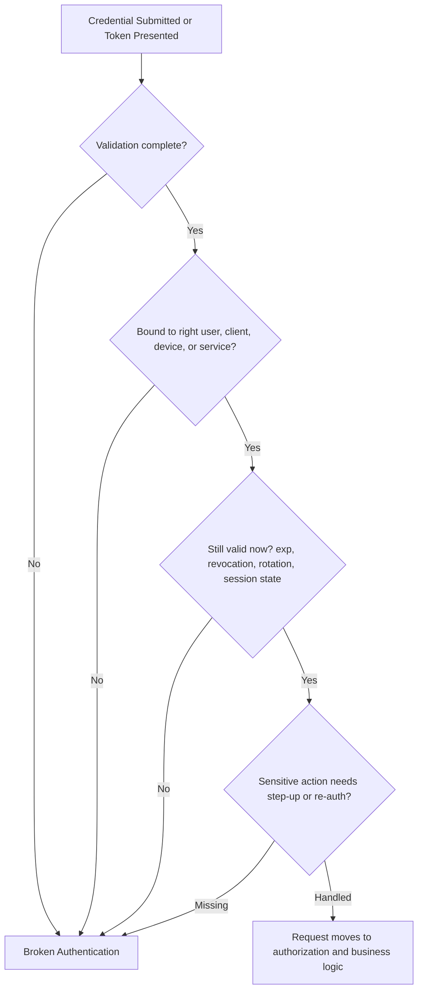
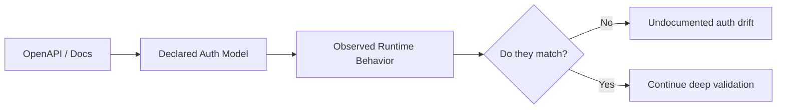
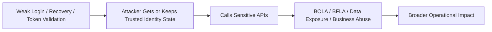
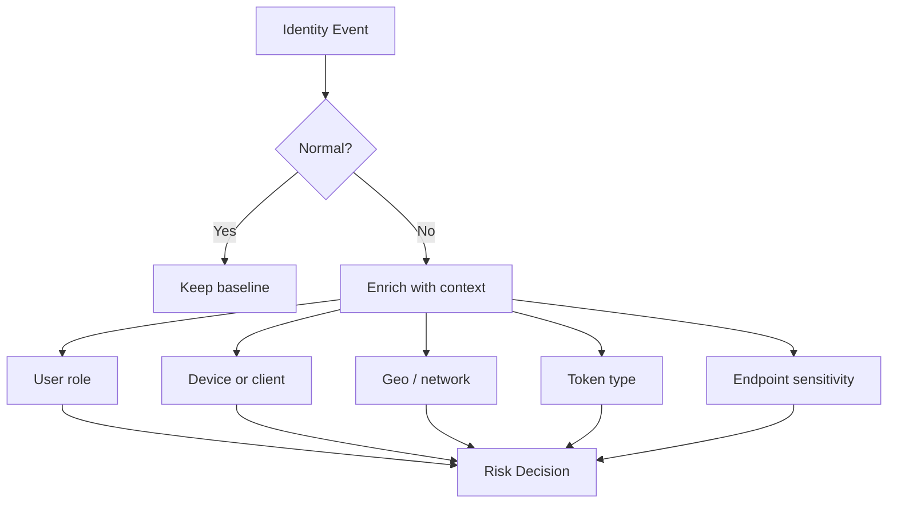

# Broken Authentication

> **Phase 07 — Core API Vulnerabilities**  
> **Difficulty:** Beginner -> Advanced  
> **Focus:** Understanding how APIs fail when they identify users, issue tokens, maintain sessions, recover accounts, or trust machine identities incorrectly.  
> **Authorized-use note:** This note is for sanctioned API security assessment, architecture review, purple teaming, and defense. It explains risk patterns, safe validation ideas, detection opportunities, and hardening guidance without providing harmful step-by-step abuse instructions.

---

## Table of Contents

1. [What Broken Authentication Means](#what-broken-authentication-means)
2. [Why APIs Break Differently](#why-apis-break-differently)
3. [Authentication vs Authorization vs Session Security](#authentication-vs-authorization-vs-session-security)
4. [Beginner Mental Model](#beginner-mental-model)
5. [How the API Authentication Trust Chain Works](#how-the-api-authentication-trust-chain-works)
6. [Common Broken Authentication Patterns](#common-broken-authentication-patterns)
7. [Where It Appears in Modern API Environments](#where-it-appears-in-modern-api-environments)
8. [How to Read the API Spec First](#how-to-read-the-api-spec-first)
9. [Safe Authorized Validation Approach](#safe-authorized-validation-approach)
10. [Impact and Vulnerability Chaining](#impact-and-vulnerability-chaining)
11. [Detection Opportunities](#detection-opportunities)
12. [Defensive Guidance](#defensive-guidance)
13. [Practical Review Checklist](#practical-review-checklist)
14. [Key Takeaways](#key-takeaways)
15. [References and Further Reading](#references-and-further-reading)

---

## What Broken Authentication Means

**Broken authentication** means the API is making bad trust decisions about identity.

That can happen before login, during login, after login, or long after login when a token, cookie, API key, refresh token, or service credential is reused incorrectly.

A beginner-friendly definition:

> **The system is accepting proof of identity that it should not trust, or it keeps trusting identity state for longer or more broadly than it should.**

In API environments, broken authentication is broader than "login bypass." It also includes things like:

- weak password and account recovery design
- missing or weak MFA enforcement for sensitive APIs
- tokens that are easy to steal, replay, or keep alive
- JWTs or opaque tokens that are not validated correctly
- session identifiers that are weak, exposed, or not rotated
- API keys used where stronger identity is required
- machine-to-machine trust with no real verification
- logout and revocation flows that do not actually end trust

OWASP API Security Top 10 2023 places this issue in **API2:2023 Broken Authentication** because modern APIs are identity-heavy. If authentication fails, the rest of the application may faithfully process attacker-controlled requests as if they were legitimate.

---

## Why APIs Break Differently

Classic web authentication usually centers on a browser session and a login page.

APIs are different because identity often spans:

- browser clients
- mobile apps
- SPAs
- backend services
- CI/CD pipelines
- third-party integrations
- service meshes
- cloud workloads
- GraphQL, REST, gRPC, WebSockets, and webhooks

That means an API auth review is not just:

```text
Can users log in securely?
```

It is also:

```text
Who can get tokens?
How are those tokens refreshed?
What accepts them?
What other services trust them?
What happens during logout, recovery, re-authentication, and step-up?
```

### Why the blast radius is often larger in APIs

| API Characteristic | Why It Increases Risk |
|---|---|
| **Token-centric design** | One valid bearer token may unlock many endpoints without another login event. |
| **Statelessness** | Stateless access tokens scale well, but revocation and session invalidation become harder. |
| **Many clients** | Web, mobile, partner, and machine clients may all use different auth paths with uneven controls. |
| **Delegated access** | OAuth and OIDC introduce consent, scope, redirect, and refresh-token complexity. |
| **Machine identity** | Service accounts and API keys often have broad access but weak monitoring. |
| **Gateway dependency** | Teams may assume the gateway solved auth while backend services still trust too much. |
| **Microservice trust chains** | One authenticated edge request can fan out into many backend calls. |

---

## Authentication vs Authorization vs Session Security

These concepts are related, but they are not the same.

| Concept | Core Question | Example API Concern |
|---|---|---|
| **Authentication** | Who are you? | Is this password, token, API key, client certificate, or session valid? |
| **Authorization** | What are you allowed to do? | Can this identity read another user's invoice or call an admin function? |
| **Session / Token Management** | Should this identity still be trusted now? | Was the cookie rotated? Was the refresh token revoked? Is replay prevented? |

### Easy way to remember it

```text
Authentication = prove identity
Authorization = enforce permissions
Session/token management = preserve trust safely over time
```

A team can get the first part right and still fail badly on the other two.

Examples:

- A user logs in correctly, but their token is accepted after logout.
- MFA is required at login, but password reset silently bypasses MFA.
- The API validates that a JWT is signed, but not whether the `aud`, `iss`, or `exp` claims are correct.

---

## Beginner Mental Model

Think of API authentication as an airport identity workflow.

- **Login or auth handshake** = showing ID at check-in
- **MFA or step-up** = extra security screening
- **Access token / session** = the boarding pass
- **Refresh token** = ability to print a new boarding pass later
- **Authorization checks** = whether the boarding pass opens your specific gate, not every gate
- **Revocation / logout** = canceling the boarding pass when it should no longer work

Broken authentication means one of these things goes wrong:

- fake or weak ID is accepted
- old boarding passes still work
- stolen boarding passes can be reused anywhere
- someone gets a new boarding pass without enough checks
- staff and service entrances trust badges more broadly than intended

### Simple mental model

```text
Identity proof -> token/session issued -> token/session stored -> token/session presented -> token/session verified -> sensitive actions rechecked -> trust revoked when needed
```

**Broken authentication can happen at any point in that chain.**

---

## How the API Authentication Trust Chain Works


### The core lesson

Security does **not** end when a token is issued.

A safe design has to answer all of these questions:

1. Was identity proof strong enough?
2. Was the credential issued correctly?
3. Is the artifact stored and transported safely?
4. Is the API validating it fully on every relevant request?
5. Are sensitive actions protected with step-up or re-authentication?
6. Can trust be withdrawn quickly when risk changes?

### Failure map



---

## Common Broken Authentication Patterns

OWASP's API guidance and broader authentication guidance repeatedly point to the same families of mistakes.

### 1. Credential verification weaknesses

The API accepts weak proof of identity or makes guessing too feasible.

Common patterns:

- no effective rate limiting on login or OTP verification endpoints
- no account lockout, challenge, throttling, or risk-based controls
- weak password policy and no screening against known-breached passwords
- default credentials or test credentials left active
- account enumeration through verbose login, signup, or recovery responses

### 2. Recovery and step-up weaknesses

The main login flow may look strong, but side doors are weaker.

Common patterns:

- password reset does not expire quickly enough or lacks strong token entropy
- email change, MFA reset, payout change, or credential rotation do not require re-authentication
- recovery flow reveals whether an account exists
- backup codes, magic links, OTPs, or recovery tokens are treated too casually

### 3. Token issuance flaws

The API or identity provider issues authentication artifacts too broadly.

Common patterns:

- long-lived bearer tokens without business justification
- refresh tokens issued to risky clients without rotation or sender constraints
- over-broad OAuth scopes at issuance time
- tokens issued to clients that cannot protect them safely
- weak service-to-service identity issuance

### 4. Token validation flaws

The receiving API checks only part of what matters.

Common patterns from OWASP API2 and OAuth guidance:

- signature checked, but issuer or audience not checked
- expiration ignored or treated loosely
- unsigned or weakly signed JWTs accepted
- token type confusion between ID tokens and access tokens
- opaque tokens trusted without introspection or equivalent validation
- service tokens accepted without checking intended service identity

### 5. Session management flaws

The system keeps trusting stale or exposed session state.

Common patterns:

- session ID not rotated after login or privilege change
- session token exposed in URLs, logs, referrers, or client-side storage
- session timeouts too long for the sensitivity of the API
- logout clears the browser state but not the server-side trust state
- concurrent sessions are unmanaged and invisible

### 6. MFA design gaps

MFA exists, but not where it matters.

Common patterns:

- admin APIs are not consistently protected by MFA
- MFA is enforced on the UI but not on direct API calls
- sensitive actions do not trigger step-up authentication
- fallback or recovery paths effectively bypass MFA intent
- push or OTP-based controls exist, but token replay still defeats the point

### 7. API key and machine-identity misuse

Non-human auth is often weaker than user auth.

Common patterns:

- API keys used as if they represent strong user identity
- unrestricted keys with no IP, referrer, service, or workload binding
- shared integration secrets across multiple systems or environments
- internal services trust any east-west traffic without mutual verification
- service accounts are long-lived, over-scoped, or poorly rotated

### 8. OAuth and delegated auth mistakes

Modern API ecosystems depend on OAuth/OIDC, which introduces its own failure modes.

Common patterns:

- refresh tokens are long-lived and replayable
- PKCE missing where public clients need it
- redirect URI handling is too permissive
- device-code or delegated-consent flows are not monitored well
- token revocation and consent revocation are operationally weak

### Pattern summary table

| Pattern Family | What Goes Wrong | Typical Impact |
|---|---|---|
| **Credential weakness** | Identity can be guessed, enumerated, or reused too easily | Account takeover, valid-account abuse |
| **Recovery weakness** | Side-channel auth path is weaker than primary login | Silent takeover of higher-value users |
| **Token issuance flaw** | API creates trust artifacts that are too strong or too durable | Long-lived access, difficult containment |
| **Token validation flaw** | API trusts a token it should reject | Authentication bypass or token replay |
| **Session flaw** | Trust state persists or leaks incorrectly | Session hijacking or re-use |
| **MFA gap** | Strong auth is inconsistent across paths | Sensitive actions performed without real assurance |
| **Machine-identity flaw** | Service auth is over-scoped or under-verified | Internal pivoting, partner abuse, automation misuse |
| **OAuth flaw** | Delegated access is granted or maintained incorrectly | Cross-app abuse, refresh-token persistence |

---

## Where It Appears in Modern API Environments

Broken authentication is not limited to `/login`.

### Common API areas to review

| Area | Why It Matters |
|---|---|
| **Login endpoints** | Primary credential verification, enumeration, throttling, MFA entry points |
| **Refresh endpoints** | May silently extend access beyond acceptable lifetime |
| **Logout / revoke endpoints** | Often look complete in the client but do not end backend trust |
| **Password reset / recovery flows** | Frequently weaker than the main login experience |
| **Profile or account-change APIs** | Email, password, MFA device, or phone changes should usually require re-authentication |
| **Partner APIs** | Shared secrets and over-broad trust are common |
| **Mobile auth flows** | Public clients need careful token and PKCE handling |
| **SPA auth flows** | Browser token storage and replay risk matter more |
| **Service-to-service APIs** | Machine identities often bypass the rigor used for human users |
| **Admin and support APIs** | Step-up and stronger assurance should be expected |

### Mechanism-focused risk map

| Mechanism | Strength When Done Well | Common Failure |
|---|---|---|
| **Session cookie** | Good server-side control and revocation | Fixation, leakage, weak flags, long lifetime |
| **JWT access token** | Scalable and easy to validate correctly | Claim validation gaps, replay, over-sharing data |
| **Opaque access token** | Easier central control with introspection | Weak introspection logic or weak trust between services |
| **Refresh token** | Better UX without constant login | Replay, no rotation, weak revocation |
| **API key** | Useful for lower-sensitivity service identification | Used as a user identity substitute, over-broad access |
| **OAuth code flow** | Strong when paired with PKCE, strict redirect rules, and scope discipline | Redirect mistakes, consent abuse, refresh persistence |
| **Client certificate / mTLS** | Strong sender binding for workloads | Operational shortcuts, poor certificate lifecycle control |

---

## How to Read the API Spec First

The API architecture document for this section says to use the spec, move from basic to advanced, and help the learner map identities and trust boundaries before testing. That is exactly the right approach here.

Before you assess behavior, inspect the API documentation or OpenAPI definition.

### Auth clues to look for in an OpenAPI spec

```yaml
openapi: 3.0.3
components:
  securitySchemes:
    bearerAuth:
      type: http
      scheme: bearer
      bearerFormat: JWT
    apiKeyAuth:
      type: apiKey
      in: header
      name: X-API-Key
paths:
  /auth/login:
    post: {}
  /auth/refresh:
    post:
      security:
        - bearerAuth: []
  /admin/users:
    get:
      security:
        - bearerAuth: [admin:read]
```

### Questions the spec should help answer

| Spec Area | Questions to Ask |
|---|---|
| `securitySchemes` | Which auth mechanisms exist? User auth, API keys, OAuth, mTLS, service tokens? |
| Global `security` | Is auth required by default, or only on some routes? |
| Operation-level overrides | Are any sensitive endpoints accidentally unauthenticated? |
| Scope definitions | Are scopes coarse, over-broad, or unclear? |
| Auth endpoint descriptions | Do docs explain login, refresh, logout, recovery, MFA enrollment, and re-auth? |
| Error model | Do responses leak account existence or token-state information? |
| Example requests | Are credentials or tokens shown in URLs, logs, or insecure patterns? |
| Versioning / deprecated paths | Are old auth flows still exposed and trusted? |

### Spec-to-reality mental model



If the spec says `admin:read` is required but the runtime does not enforce that expectation consistently, that is both a security issue and an operational warning sign.

### Useful review clues from documentation alone

Documentation can already reveal risky design choices:

- login responses that appear to differ by account state
- refresh flows with no mention of rotation
- password-reset or MFA-reset APIs lacking re-auth language
- API keys presented as the primary control for sensitive user data
- missing mention of revocation, session lifetime, or device binding
- internal or partner flows described as implicitly trusted

---

## Safe Authorized Validation Approach

This topic should be validated carefully. The goal is to prove whether trust decisions are unsafe, not to generate harmful login traffic or destabilize identity systems.

### Recommended workflow

1. **Map the authentication surface first**  
   Inventory login, signup, refresh, recovery, logout, MFA, admin, and machine-identity endpoints.

2. **Use approved test identities**  
   Prefer dedicated accounts, safe tenants, synthetic data, and pre-cleared service identities.

3. **Validate controls minimally**  
   One representative proof is usually enough. Avoid broad credential attacks unless explicitly approved.

4. **Compare documentation, policy, and runtime**  
   Many auth issues are inconsistencies between what teams think is enforced and what the API actually accepts.

5. **Capture evidence safely**  
   Record timestamps, endpoint names, status codes, claims, and policy mismatches; avoid collecting unnecessary secrets.

### Safe validation matrix

| Control Area | Safe Validation Question | Low-Risk Evidence |
|---|---|---|
| **Login protection** | Does the API meaningfully slow or challenge repeated failed attempts? | Response codes, timing, lockout/challenge behavior, documented thresholds |
| **Enumeration resistance** | Do login, signup, reset, or invite APIs reveal account existence? | Compare messages, status codes, and response shapes using approved test users |
| **Password recovery** | Are reset tokens strong, short-lived, single-use, and bound to the right workflow? | Reset policy, TTL, one-time-use behavior, audit events |
| **Re-authentication** | Do email change, password change, MFA reset, payout change, and admin actions require step-up? | Endpoint behavior before and after recent authentication |
| **JWT / token validation** | Does the API reject malformed, expired, or incorrectly scoped tokens consistently? | Validation error patterns, claim enforcement, gateway/backend consistency |
| **Refresh-token control** | Are refresh tokens rotated, revoked, and monitored for replay? | Rotation events, revocation behavior, audit logs |
| **Session hygiene** | Are session IDs rotated on login and privilege change? Are cookie attributes strong? | Before/after session identifiers, `Set-Cookie` flags, timeout behavior |
| **MFA coverage** | Is MFA enforced for the identities and actions that truly need it? | Policy mapping by role, endpoint, and transaction sensitivity |
| **Machine identity** | Are API keys or service identities scoped, rotated, and limited to their intended caller? | Key restrictions, service bindings, usage logs |
| **Logout / revocation** | Does trust actually end when a user signs out or an admin revokes access? | Post-logout behavior, session invalidation, token revocation outcome |

### A good reporting mindset

A strong finding is usually framed like this:

```text
The API's authentication control is weaker than intended on this specific trust boundary,
and a user, client, or service can continue acting as an identity longer, more broadly,
or with less proof than the design requires.
```

That is clearer and more useful than saying only "auth is broken."

---

## Impact and Vulnerability Chaining

Broken authentication often enables other high-severity API issues rather than standing alone.

### Common impacts

| Impact | Example Outcome |
|---|---|
| **Account takeover** | User account, partner account, or admin account becomes controllable |
| **Valid-account abuse** | Activity looks legitimate because the API accepts the identity |
| **Sensitive data exposure** | Authenticated APIs return PII, financial, support, or internal data |
| **Privilege escalation** | Weak step-up or reset flows help a lower-trust identity become higher-trust |
| **Persistent access** | Refresh or session flaws allow access to survive password changes or logout |
| **Cross-service spread** | One token or key reaches multiple APIs or internal services |
| **Detection blind spots** | Defenders watch for failed logins but miss session and token replay |

### Common chains

| Broken Auth Chain | Why It Matters |
|---|---|
| **Broken auth -> BOLA** | A token from the wrong account is still treated as valid access to object APIs. |
| **Broken auth -> BFLA** | Weak admin auth or step-up turns function-level authorization into a critical impact. |
| **Broken auth -> sensitive business flow abuse** | A valid but weakly protected identity can automate valuable workflows. |
| **Broken auth -> improper inventory management** | Old endpoints may still trust obsolete tokens or weak auth paths. |
| **Broken auth -> unsafe consumption of APIs** | Downstream services trust upstream identity assertions too broadly. |

### Chain diagram



### Important advanced lesson

A broken authentication issue is often really a **trust-boundary design issue**.

The risk is not just that an attacker logged in once. The risk is that the environment keeps accepting identity proof across:

- too many services
- too many actions
- too much time
- too many devices or clients
- too little monitoring

---

## Detection Opportunities

Teams often detect brute force attempts but miss stronger signals of authentication failure.

### High-value telemetry to watch

| Signal | Why It Matters |
|---|---|
| **Repeated failed login or OTP attempts** | Baseline signal for guessing and abuse pressure |
| **Enumeration-like patterns** | Many identities tested with similar timing or request shape |
| **Refresh token replay or unusual refresh geography** | Strong sign of token theft or weak sender control |
| **Access after logout or password reset** | Indicates revocation failure or parallel session risk |
| **Sensitive action without recent re-auth** | Detects missing or bypassed step-up controls |
| **MFA reset followed by privileged activity** | Recovery abuse is often under-monitored |
| **Unexpected service-token use** | A machine identity appearing from the wrong network or workload is highly suspicious |
| **JWT validation errors** | Failed `aud`, `iss`, `exp`, or signature checks can show probing or drift |
| **Old API versions still receiving auth traffic** | Suggests inventory drift and trust lingering in deprecated paths |

### Detection mental model



### What mature teams correlate

The best detections usually combine identity and application context, for example:

- MFA reset followed by API-key creation
- password change followed by continued use of an older refresh token
- token refresh from a new device followed by admin API access
- service token use outside the expected workload identity path
- session activity continuing after apparent logout

---

## Defensive Guidance

The API architecture notes for this section say every core vulnerability note should explain why the issue happens, how to recognize it, how an authorized tester validates it, common impact, chaining, and defensive guidance. This section closes that loop.

### 1. Treat authentication as a lifecycle, not a login page

Secure design must cover:

- enrollment
- login
- MFA
- re-authentication
- session issuance
- token refresh
- password and MFA recovery
- logout and revocation
- machine-identity lifecycle

If one part is much weaker than the rest, attackers will go there first.

### 2. Prefer strong, modern credential and MFA controls

Use current guidance for identity assurance:

- strong password handling and secure password storage
- breached-password screening
- phishing-resistant MFA for high-value identities where possible
- re-authentication for sensitive changes
- minimize knowledge-based recovery patterns

### 3. Design token security explicitly

Good token hygiene usually includes:

- short-lived access tokens
- refresh token rotation where appropriate
- strict validation of signature, issuer, audience, expiry, scope, and intended use
- clear token revocation strategy
- avoiding bearer portability where sender-constrained designs are possible

### 4. Make session hygiene visible and enforceable

For cookie or server-backed session models:

- rotate session identifiers on login and privilege change
- use strong cookie attributes such as `HttpOnly`, `Secure`, and appropriate `SameSite`
- enforce idle and absolute session timeouts
- invalidate server-side trust on logout and risk events

### 5. Require step-up for sensitive operations

These operations often deserve recent-auth or stronger-auth checks:

- password change
- email change
- MFA enrollment or reset
- API key creation
- payout or billing changes
- admin or support impersonation features
- token or credential export features

### 6. Harden recovery flows as much as login flows

Recovery is part of authentication.

Defensive priorities:

- strong, single-use, short-lived reset artifacts
- no account enumeration through reset responses
- rate limits and risk checks on reset and OTP verification
- audit visibility for every recovery and reset event
- step-up or manual review for especially sensitive changes

### 7. Reduce bearer-token replay risk

Replay risk is one of the most important modern API lessons.

Helpful controls include:

- sender-constrained tokens where supported
- device-bound or workload-bound trust where feasible
- token rotation and anomaly detection
- revocation on risky events
- tighter scope and audience segmentation

### 8. Treat machine identity as first-class security

Do not assume service auth is simpler or safer than user auth.

Good practice includes:

- replacing shared secrets with stronger workload identity where possible
- restricting API keys to intended services, networks, or origins
- rotating service credentials aggressively
- mapping every key or token to a specific owner and purpose
- logging machine-auth events with the same seriousness as user-auth events

### 9. Keep gateways and backends aligned

A recurring API failure pattern is:

```text
The gateway checks one thing.
The backend assumes more than the gateway actually proved.
```

Prevent this with:

- clear authn/authz responsibility boundaries
- consistent claim validation across services
- documented trust contracts for upstream identity headers and tokens
- testing old versions, internal paths, and direct-to-service access paths

### 10. Build revocation and incident response into the design

If a password, session, refresh token, API key, or service token is compromised, teams should be able to answer quickly:

- what it can reach
- where it was used
- how to revoke it
- how long it may remain effective
- which logs prove containment

---

## Practical Review Checklist

Use this as a compact assessment aid.

### Authentication design checklist

- [ ] Are authentication, authorization, and session/token management clearly separated in the design?
- [ ] Are all login, refresh, logout, reset, MFA, and step-up flows documented?
- [ ] Are deprecated auth flows or legacy API versions still reachable?
- [ ] Are passwords stored with modern password hashing and appropriate operational controls?
- [ ] Are weak, default, test, or shared credentials eliminated?
- [ ] Are account enumeration paths minimized across login and recovery?
- [ ] Are login, OTP, and recovery endpoints meaningfully throttled?
- [ ] Is MFA enforced for high-value users and sensitive actions?
- [ ] Are session IDs rotated and cookies hardened if sessions are used?
- [ ] Are access tokens short-lived and validated completely?
- [ ] Are refresh tokens rotated, revocable, and monitored?
- [ ] Are ID tokens prevented from being used where access tokens are required?
- [ ] Are service accounts, API keys, and workload identities least-privilege and well-scoped?
- [ ] Do logout and revocation actually terminate backend trust?
- [ ] Can the team investigate and revoke identity artifacts quickly during an incident?

### Fast triage questions

If you need a fast mental shortcut, ask these five questions:

1. **Can the wrong person or service become trusted?**
2. **Can a stolen or stale token keep being trusted?**
3. **Can a weaker side path bypass the stronger main path?**
4. **Can a token or key be replayed from somewhere it should not work?**
5. **Can defenders detect and revoke that trust quickly?**

If several answers are "yes," the problem is probably not just a minor auth bug. It is likely a meaningful trust failure.

---

## Key Takeaways

- **Broken authentication in APIs is bigger than login bypass.** It includes sessions, bearer tokens, refresh tokens, recovery flows, MFA coverage, API keys, and machine identity.
- **The main risk is misplaced trust.** The API is accepting proof of identity it should reject, or continuing trust longer and wider than intended.
- **Modern API environments amplify the impact.** One credential or token may unlock many services and workflows.
- **Safe testing starts with documentation and trust mapping.** Review the API spec, the auth model, and the real runtime behavior before deeper validation.
- **Recovery, refresh, re-authentication, and revocation are where mature findings often live.**
- **Defense depends on lifecycle thinking.** Identity proof, issuance, storage, validation, monitoring, and revocation all matter.

---

## References and Further Reading

These sources align well with the architecture for this API section and help keep the topic current.

- **OWASP API Security Top 10 2023 — API2:2023 Broken Authentication**  
  https://owasp.org/API-Security/editions/2023/en/0xa2-broken-authentication/

- **OWASP Authentication Cheat Sheet**  
  https://cheatsheetseries.owasp.org/cheatsheets/Authentication_Cheat_Sheet.html

- **OWASP Session Management Cheat Sheet**  
  https://cheatsheetseries.owasp.org/cheatsheets/Session_Management_Cheat_Sheet.html

- **OWASP OAuth2 Cheat Sheet**  
  https://cheatsheetseries.owasp.org/cheatsheets/OAuth2_Cheat_Sheet.html

- **OWASP Authorization Cheat Sheet**  
  https://cheatsheetseries.owasp.org/cheatsheets/Authorization_Cheat_Sheet.html

- **RFC 6819 — OAuth 2.0 Threat Model and Security Considerations**  
  https://datatracker.ietf.org/doc/html/rfc6819

- **RFC 7636 — Proof Key for Code Exchange (PKCE)**  
  https://datatracker.ietf.org/doc/html/rfc7636

- **NIST SP 800-63B — Digital Identity Guidelines: Authentication and Authenticator Management**  
  https://pages.nist.gov/800-63-4/sp800-63b.html

- **Google Cloud — Best Practices for Managing API Keys**  
  https://cloud.google.com/docs/authentication/api-keys-best-practices

- **Microsoft Entra — Token Protection**  
  https://learn.microsoft.com/en-us/entra/identity/conditional-access/concept-token-protection

---

> **Memory aid:** Broken authentication is usually a failure in one of five places: **proof, issuance, storage, validation, or revocation**. If you can remember that chain, you can usually organize the rest of the review.
