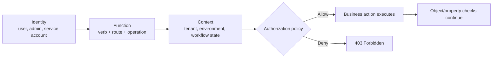
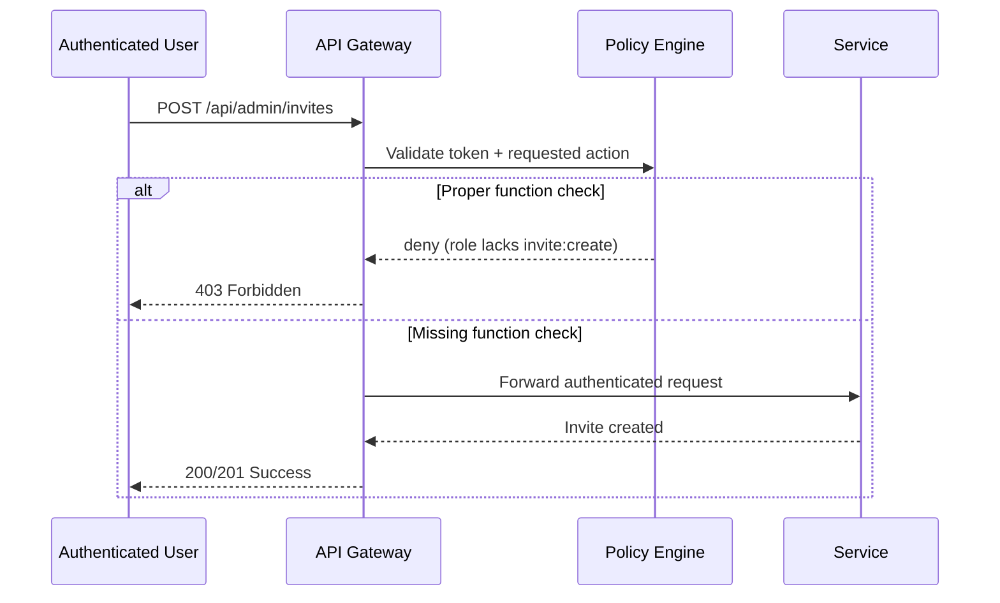

# Broken Function Level Authorization (BFLA / API5:2023)

> **Broken Function Level Authorization happens when an API correctly knows who you are, but fails to check whether you should be allowed to call a sensitive function at all.**

---

## 🧠 What Is It? (Beginner Explanation)

Imagine an office building where every employee badge opens the front door. That is **authentication**: the system knows you are a real employee.

But inside the building, some rooms should only be accessible to finance, HR, or infrastructure staff. If the building only checks, "Do you have *a* badge?" instead of, "Does your badge allow *this room*?", then any employee can reach privileged functions.

That is **Broken Function Level Authorization (BFLA)** in an API.

In practice, the "room" might be:

- an admin endpoint such as `POST /api/admin/invites`
- a sensitive method such as `DELETE` instead of `GET`
- a GraphQL mutation such as `approveRefund`
- a gRPC method such as `AdminService/RotateKey`
- an internal automation function exposed through a gateway

OWASP classifies this as **API5:2023** because modern APIs frequently expose business actions directly, and those actions are often easy to predict, replay, or reach outside the UI.

NIST defines authorization as verifying whether a requested action or service is approved for a specific entity. BFLA is the failure of that decision point.

---

## 🔑 Authentication vs Authorization vs BFLA

| Layer | Core Question | Example | If It Fails |
|---|---|---|---|
| **Authentication** | Who are you? | "This JWT belongs to user `alice`." | Anyone may impersonate users |
| **Function-level authorization** | Are you allowed to perform this action? | "Can `alice` create invites or export all users?" | BFLA / vertical privilege escalation |
| **Object-level authorization** | Are you allowed to access this record? | "Can `alice` read invoice `INV-1042`?" | BOLA / IDOR |
| **Property-level authorization** | Are you allowed to read or change this field? | "Can `alice` modify `role` or view `salary`?" | BOPLA / excessive data exposure or mass assignment |

### Quick Distinction

| Vulnerability | What Changes? | Typical Outcome |
|---|---|---|
| **BFLA** | Function, route, method, mutation, or action | Regular user reaches admin/support/finance capability |
| **BOLA** | Object identifier | User reaches someone else's record |
| **BOPLA** | Fields/properties | User reads or writes fields they should not touch |

Many real findings combine these:

- **BFLA** gets a regular user into an admin action
- **BOLA** lets that action target another user's data
- **BOPLA** exposes or changes sensitive fields during the workflow

---

## 🧭 Mental Model: Every API Call Has Four Coordinates

Authorization in APIs becomes easier to reason about when every request is treated as four separate decisions:

1. **Identity** — who is calling?
2. **Function** — what action is being requested?
3. **Object** — which tenant, record, or system resource is affected?
4. **Context** — under what conditions is this action allowed?

If the server checks identity but skips function, the user is authenticated yet still dangerous.



### Why This Matters

A surprising amount of API security breaks because teams only protect the first box:

- valid session? ✅
- signed JWT? ✅
- user exists? ✅
- allowed to execute **this** action? ❌

That last check is where BFLA lives.

---

## 🏗️ How It Works (Technical Deep Dive)

### A "Function" Is More Than a URL

In APIs, a function is the business action the server performs. That action may be represented by:

- **REST**: HTTP verb + path + handler  
  Example: `POST /api/users/export`
- **GraphQL**: mutation, query field, or resolver  
  Example: `mutation approveRefund`
- **gRPC**: service + RPC method  
  Example: `BillingAdmin/ReverseCharge`
- **WebSocket / event APIs**: message type or command  
  Example: `{ "action": "resetUserMfa" }`

This is why BFLA is not only about `/admin/*`.

A regular-looking route can still expose a privileged function:

- `POST /api/users/search/export`
- `PATCH /api/account/role`
- `POST /api/tickets/{id}/close`
- `POST /api/reports/generate?type=full-audit`

### The Classic Failure Pattern

```text
Request arrives
→ Authentication middleware validates token
→ Router selects privileged handler
→ Handler executes because "authenticated" was treated as "authorized"
→ Sensitive action completes
```

### Vertical, Lateral, and Contextual Function Abuse

| Pattern | Description | Example |
|---|---|---|
| **Vertical** | Lower-privileged user reaches higher-privileged function | Regular user triggers admin export |
| **Lateral between groups** | One peer group reaches another group's functions | Support user calls finance-only refund approval |
| **Contextual** | Function works outside the state or environment where it should | User can approve a transaction before review completes |

PortSwigger describes BFLA-style issues as **vertical access control failures**: users gain access to functions reserved for more privileged roles.

---

## 📊 Diagram — Secure vs Vulnerable Authorization Path



---

## ⚙️ Where BFLA Commonly Appears

| Surface | What the Function Really Is | Common Failure |
|---|---|---|
| **Admin endpoints** | User management, invite creation, exports, moderation | Any authenticated user can call them directly |
| **HTTP method changes** | `GET` is safe, `POST/PATCH/DELETE` are privileged | Rules applied to path but not to every method |
| **Mixed controllers** | Regular and admin actions share one controller | Middleware checks auth, not role/action |
| **GraphQL mutations** | Hidden privileged operations behind one `/graphql` endpoint | Schema exposed, resolver checks missing or inconsistent |
| **gRPC services** | Privileged RPC methods under one service | Transport auth present, method policy absent |
| **Internal/partner APIs** | Support tooling, batch jobs, back-office flows | Route exposed externally or trusted because of network location |
| **Version drift** | Old route keeps weaker checks | `/v1/` remains permissive while `/v2/` is fixed |
| **Async/admin workflows** | Job creation, report generation, webhook replay, reindexing | Background action accepted without privilege validation |

### Especially Important in Modern API Architectures

This matters even more in environments with:

- API gateways and service meshes
- microservices with service-to-service trust
- GraphQL plus REST side-by-side
- partner integrations and machine identities
- mobile-only or "internal" APIs that later become reachable

The local API architecture guidance in this repository emphasizes that modern API testing must cover **REST, GraphQL, gRPC, webhooks, gateways, microservices, and machine identities**. BFLA can appear in all of them.

---

## 🧩 Why UI Hiding Does Not Fix BFLA

Removing an admin button from the frontend is **not** authorization.

| Weak Pattern | Why It Fails |
|---|---|
| Hiding admin links in the UI | The API route still exists |
| Obscure endpoint names | Predictable through documentation, traffic, or client code |
| Trusting `role=admin` in a cookie/header/body | User-controlled data is not authorization |
| Assuming "internal network only" is enough | Proxies, gateways, and routing mistakes expose internal paths |
| Checking only at the gateway | Downstream services may still be reachable or may mis-handle forwarded identity |

OWASP explicitly warns not to assume a function is privileged only because of its URL shape. Sensitive actions often live beside normal routes inside the same controller family.

---

## 🧪 Safe Validation Workflow (Authorized Testing Only)

> **Goal:** confirm the presence or absence of function-level checks with minimal impact and no destructive abuse.

### 1. Build a Role-to-Action Matrix

Start from approved sources:

- OpenAPI / internal API design documents
- developer docs and admin guides
- UI behavior
- GraphQL schema descriptions
- observed traffic from approved test accounts

Then map:

| Role | Expected Allowed Actions | Expected Forbidden Actions |
|---|---|---|
| Anonymous | login, signup, health endpoints | admin routes, billing actions |
| Regular user | self-service actions | moderation, bulk export, user deletion |
| Support | case management | tenant-wide config changes |
| Admin | tenant/user management | platform-owner actions |
| Service account | specific machine workflows | human admin operations |

### 2. Prefer Low-Impact Proof

Use the safest possible confirmation:

- preview endpoints instead of destructive ones
- dry-run or validation modes when available
- list/read metadata rather than mutate production data
- test tenants, staging environments, or disposable objects

### 3. Validate Per Function, Not Just Per Path

Check the authorization decision on:

- each HTTP method on the same path
- alternate route aliases or versions
- GraphQL queries vs mutations
- admin actions inside otherwise normal controllers
- machine-to-machine endpoints and internal tooling routes

### 4. Record Expected vs Actual Behavior

| Observation | Likely Meaning |
|---|---|
| `401 Unauthorized` | Authentication missing or invalid |
| `403 Forbidden` | Function restriction is being enforced |
| `404 Not Found` | Could be hide-by-default; investigate carefully with approved evidence |
| `200/201/202` for forbidden action | Strong BFLA signal |
| UI blocks action but direct API call succeeds | Strong BFLA signal |
| One method is blocked but another performs the action | Function-level rule gap |

### 5. Stop After Minimal Evidence

For an authorized pentest or review, do **not** turn confirmation into unnecessary impact. One well-documented proof is enough.

---

## 🔍 Safe Example Patterns

These examples show what defenders and authorized testers should look for. They are intentionally non-destructive.

### REST Example

A refund approval endpoint should require a finance-admin role.

```http
POST /api/v1/refunds/preview-approval HTTP/1.1
Host: api.example.com
Authorization: Bearer <regular-user-token>
Content-Type: application/json

{"refundId":"rf_1042"}
```

**Secure behavior**

```http
HTTP/1.1 403 Forbidden
{
  "error": "insufficient_permissions"
}
```

**BFLA signal**

```http
HTTP/1.1 200 OK
{
  "status": "approval_preview_created"
}
```

The issue is not the object identifier. The issue is that a regular user reached a **finance-admin function**.

### Method-Level Example

| Route | Meaning | Secure Expectation |
|---|---|---|
| `GET /api/v1/users/me/api-keys` | View own API key metadata | Allowed to account owner |
| `POST /api/v1/users/me/api-keys/rotate` | Rotate credential | Requires stronger policy or recent re-auth |
| `DELETE /api/v1/users/{id}` | Delete user | Admin-only |

If the path is protected but the **mutating method** is not, that is still BFLA.

### GraphQL Example

```graphql
mutation GenerateTenantAuditExport($tenantId: ID!) {
  generateTenantAuditExport(tenantId: $tenantId) {
    jobId
    status
  }
}
```

If a normal user receives a successful response instead of an authorization error, the mutation likely lacks resolver-level policy enforcement.

### gRPC Example

```text
Service: BillingAdmin
Method: ReverseCharge
Caller: Authenticated support-agent token
Expected: PermissionDenied
Risk if allowed: Support role reaches finance-only capability
```

One TLS connection or one authenticated channel does **not** mean every RPC on that channel is permitted.

---

## 🚨 Common Root Causes

| Root Cause | Why It Creates BFLA |
|---|---|
| **Auth-only middleware** | The route checks "logged in" but never checks the requested action |
| **Default allow for new routes** | Newly added functions inherit access accidentally |
| **Path-based rules only** | `/admin/*` is protected, but sensitive actions exist elsewhere |
| **Method mismatches** | Security applied to `GET`, forgotten on `POST/PATCH/DELETE` |
| **Frontend-only role enforcement** | Buttons disappear, but backend action still works |
| **Stale or overly broad scopes** | Tokens carry claims that are too permissive or not refreshed |
| **Gateway trust without service policy** | Backend assumes gateway already checked everything |
| **Resolver/handler inconsistency** | Some code paths call policy checks; others bypass them |
| **"Internal only" assumptions** | Admin or support functions become reachable via routing drift |
| **Business-state blind spots** | Function is allowed without checking workflow state, tenant, or amount |

---

## 🛡️ Prevention and Hardening

OWASP's Authorization Cheat Sheet and CWE guidance converge on a few principles: **least privilege, deny by default, and validate permissions on every request**.

### 1. Centralize Authorization Decisions

Do not scatter role checks across random handlers.

```js
// Vulnerable: authenticated means "allowed"
app.post('/api/invites/new', requireAuth, createInvite);

// Better: explicit function-level policy
app.post(
  '/api/invites/new',
  requireAuth,
  authorize({ action: 'invite:create', roles: ['admin'] }),
  createInvite
);
```

### 2. Authorize the Action, Not Just the User

For sensitive APIs, the decision should evaluate:

- actor role or group
- action name
- tenant or ownership boundary
- environment or network zone
- business context such as approval state, amount, or time window

NIST SP 800-162 describes this as **attribute-based access control (ABAC)**: authorization decisions consider attributes of the subject, object, operation, and environment, not only a static role.

```python
def can_approve_refund(user, refund):
    return (
        user.role in {"finance_admin", "platform_admin"}
        and user.tenant_id == refund.tenant_id
        and refund.state == "pending_review"
        and refund.amount <= user.approval_limit
    )
```

### 3. Deny by Default

New functions should start as forbidden until explicitly granted.

```text
If policy is missing
→ deny

If route is undocumented
→ deny

If token lacks required permission
→ deny
```

### 4. Enforce in Every Protocol Layer

| Protocol / Pattern | Needed Control |
|---|---|
| REST | Per-route and per-method authorization |
| GraphQL | Resolver- and field-level authorization |
| gRPC | Per-RPC policy checks |
| WebSocket / event APIs | Per-message action checks |
| Async jobs / admin tooling | Policy on job creation and job execution triggers |

### 5. Separate Human and Machine Privileges

Service accounts should not inherit broad admin powers "for convenience."  
Human admin functions and machine automation functions should have distinct scopes, identities, and approval paths.

### 6. Protect Internal Functions as If They Were Public

Private network placement, gateway headers, or "only the mobile app uses this" are not enough. Sensitive handlers need real server-side authorization wherever they run.

---

## 🧪 Secure Design Patterns

### Role Matrix + Explicit Actions

```text
user:profile:read
user:profile:update
ticket:comment:create
ticket:close
tenant:export:audit
invite:create
user:delete
key:rotate:platform
```

This is usually safer than vague labels like "admin stuff" or "support things."

### Admin Controllers Inheriting Stronger Policy

OWASP recommends that administrative controllers inherit a stricter authorization baseline instead of relying on developers to remember checks manually.

```text
BaseController
├── PublicController
├── UserController
└── AdminController  -> requires admin policy by default
```

### Policy-as-Code

Large API platforms often reduce BFLA risk by moving decisions into a central policy layer:

- one vocabulary for actions and resources
- testable allow/deny rules
- reusable decisions across gateway, API, and worker services
- easier review when new functions are added

---

## 📈 Detection and Monitoring

BFLA is not only a prevention problem. It is also a monitoring problem.

### Log for These Signals

- regular users attempting admin-only actions
- support roles calling finance-only functions
- service accounts invoking human-only operations
- sudden spikes in denied access to a specific privileged route
- successful privileged actions from unexpected roles after a deployment

### Useful Telemetry Fields

| Field | Why It Matters |
|---|---|
| `actor_id` / `service_id` | Who called the function |
| `role`, `groups`, `scopes` | Why the call should or should not have been allowed |
| `action_name` | Human-readable business function |
| `route`, `method`, `operationName`, `rpc_method` | Precise protocol surface |
| `tenant_id` | Boundary crossing detection |
| allow/deny decision | Supports investigations and alerting |
| policy version | Helps detect regressions after authorization changes |

### CI/CD Checks That Catch BFLA Early

- negative authorization tests for every sensitive function
- route inventory diffs after each release
- GraphQL schema review for newly exposed mutations
- contract tests for `403` behavior, not only happy-path `200`s
- regression tests for old API versions and alternate methods

---

## 📝 Reporting Guidance

When documenting a BFLA finding, capture:

1. **Affected function** — exact route, method, mutation, or RPC
2. **Expected restriction** — which role should have access
3. **Observed behavior** — what a lower-privileged role was able to do
4. **Impact** — data exposure, privilege escalation, integrity loss, or service disruption
5. **Minimal evidence** — enough to prove the issue without causing avoidable damage
6. **Root cause hypothesis** — missing policy, method gap, gateway trust, resolver omission, version drift

### Example Impact Statements

| Scenario | Likely Business Impact |
|---|---|
| Regular user can export all tenant users | Privacy breach, regulatory exposure, large-scale data leak |
| Support role can approve refunds | Fraud, direct financial loss, audit failure |
| Any authenticated user can create admin invites | Privilege escalation and tenant compromise |
| Partner API key can access platform admin actions | Third-party trust failure and cross-tenant risk |

---

## ✅ Defensive Checklist

- [ ] Define sensitive business actions explicitly
- [ ] Map roles/groups/scopes to those actions
- [ ] Deny by default
- [ ] Check authorization on **every** request and **every** protocol
- [ ] Protect methods and mutations, not just paths
- [ ] Separate admin, support, finance, partner, and machine privileges
- [ ] Test old versions, aliases, and internal routes
- [ ] Log denied and successful privileged actions with policy context
- [ ] Add regression tests whenever new privileged functions are introduced

---

## 📚 References

- **OWASP API Security Top 10 (2023) — API5: Broken Function Level Authorization**  
  https://owasp.org/API-Security/editions/2023/en/0xa5-broken-function-level-authorization/
- **OWASP Authorization Cheat Sheet**  
  https://cheatsheetseries.owasp.org/cheatsheets/Authorization_Cheat_Sheet.html
- **MITRE CWE-862: Missing Authorization**  
  https://cwe.mitre.org/data/definitions/862.html
- **MITRE CWE-285: Improper Authorization**  
  https://cwe.mitre.org/data/definitions/285.html
- **PortSwigger Web Security Academy — Access Control**  
  https://portswigger.net/web-security/access-control
- **NIST Glossary — Authorization**  
  https://csrc.nist.gov/glossary/term/authorization
- **NIST SP 800-162 — Attribute Based Access Control (ABAC)**  
  https://csrc.nist.gov/pubs/sp/800/162/upd2/final
