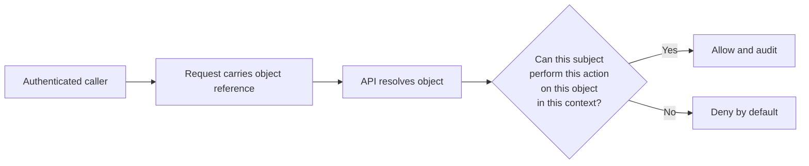
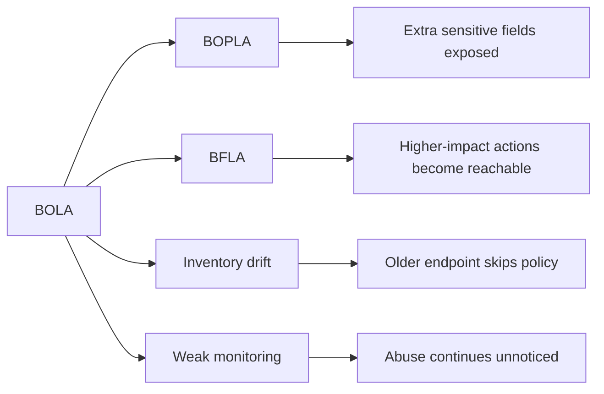

# Broken Object Level Authorization

> **Broken Object Level Authorization (BOLA)** happens when an API accepts a reference to an object and checks only whether the caller is authenticated, not whether that caller is allowed to act on that specific object. In the OWASP API Security Top 10, this is **API1:2023** because it is both common and high impact.

---

## 🧠 What Is It? (Beginner Explanation)

Think of an office building:

- **Authentication** is proving you work there and getting through the front door.
- **Authorization** is what rooms, cabinets, and systems you are allowed to access once inside.
- **Object-level authorization** is the check for one specific thing:  
  *this invoice, this project, this ticket, this device, this report, this message*.

An API is vulnerable to BOLA when it treats an object reference like proof of access:

```text
"You know the object ID, so you can use the object."
```

That assumption is wrong.

Knowing or receiving an identifier does **not** mean the caller should be able to:

- read the object
- edit the object
- delete the object
- trigger an action on the object

This is the API-focused form of what older guidance often called **IDOR**.

---

## 🧭 Core Mental Model

The safest mental model is:

> **Object reference = locator, not permission.**

Every API decision should answer four questions:

| Element | Security question | Example |
|---|---|---|
| **Subject** | Who is making the request? | User, service account, partner app |
| **Object** | What resource is being touched? | Invoice, vehicle, workspace, file |
| **Action** | What is being attempted? | Read, update, delete, approve, refund |
| **Context** | Under what conditions? | Same tenant, same owner, same region, right time, right workflow state |

If any one of these is ignored, BOLA becomes likely.



### Four ideas worth remembering

| Idea | Why it matters |
|---|---|
| **Endpoint access is not object access** | A user may be allowed to call `GET /projects/{id}` but only for projects they own or are assigned to. |
| **Opaque IDs are not a fix** | UUIDs and random IDs reduce guessing, but leaked or reused IDs still need authorization checks. |
| **Reads and writes are separate risks** | A safe `GET` does not guarantee safe `PATCH`, `DELETE`, `POST /approve`, or `POST /refund`. |
| **404 vs 403 is not the core issue** | Hiding existence is a UX choice; the real security question is whether unauthorized access is blocked server-side. |

---

## 🔬 Why APIs Are Especially Prone To BOLA

OWASP calls BOLA easy to exploit and widespread, and that matches real-world API design patterns.

### 1. APIs are naturally object-centric

APIs constantly expose identifiers in:

- URL paths
- query parameters
- JSON bodies
- GraphQL variables
- gRPC messages
- WebSocket events

That means object references travel from client to server all the time.

### 2. Statelessness pushes trust into each request

Because APIs are often stateless, the server repeatedly depends on client-supplied identifiers to decide what object to fetch. If the policy check is missing or inconsistent, the API will happily retrieve the wrong object.

### 3. Frameworks make lookup easy, policy easy to forget

Developers can write:

```javascript
const invoice = await Invoice.findByPk(req.params.invoiceId);
```

in seconds.

The dangerous part is what often gets skipped:

```text
Does the current caller have rights to this invoice in this tenant for this action?
```

### 4. Microservices can lose identity context

A gateway may validate the token, but a downstream service may only receive:

- `invoiceId`
- `tenantId`
- a trusted internal header

If the backend trusts the gateway too broadly or forgets to enforce object policy itself, cross-tenant access becomes possible.

### 5. API specs often document authentication, not ownership semantics

A spec can clearly show:

- bearer token required
- scopes required
- parameters required

But unless ownership rules are explicit, the spec does **not** prove the API is safe from BOLA.

---

## 🧩 BOLA vs Nearby API Problems

These issues are related, but they are not the same.

| Vulnerability | Core question | Example |
|---|---|---|
| **BOLA** | Can I act on the wrong object? | Read another tenant's invoice |
| **Broken Function Level Authorization (BFLA)** | Can I reach the wrong function at all? | Regular user calls admin-only endpoint |
| **Broken Object Property Level Authorization (BOPLA)** | Can I read or write the wrong fields? | Same profile, but API exposes `isAdmin` or internal notes |
| **Broken Authentication** | Am I really who I claim to be? | Forged token, weak session, bad JWT handling |
| **Mass Assignment** | Can I set fields the server should ignore? | Change `ownerId`, `role`, or approval state in request body |

### A useful distinction

If the user should never access the endpoint itself, think **BFLA**.  
If the user may access the endpoint, but only for *some objects*, think **BOLA**.

---

## 📦 Where Object References Hide

Object references are not limited to obvious REST path parameters.

| Surface | Example | Typical mistake |
|---|---|---|
| **REST path** | `/api/v1/projects/{projectId}` | Lookup by ID without scoping to owner or tenant |
| **Query string** | `/reports?accountId=...` | Trusting account selector from client |
| **JSON body** | `{ "invoiceId": "...", "action": "void" }` | State-changing operations skip ownership checks |
| **Headers** | `X-Account-ID`, `X-Tenant-ID` | Trusting caller-supplied tenancy context |
| **File/object storage keys** | `/files/{fileKey}` | Static file retrieval not bound to current user |
| **GraphQL variables** | `project(id: "...")` | Resolver fetches object directly with no policy layer |
| **gRPC request fields** | `GetInvoiceRequest.invoice_id` | Service auth present, object auth absent |
| **WebSocket messages** | `{ "type": "subscribe", "channelId": "..." }` | Subscription or event feed not scoped per user |
| **Async jobs/webhooks** | `POST /exports/{jobId}/download` | Background workflow created safely but fetched unsafely |

### Protocol note

The protocol does not change the root problem.  
Whether the API is REST, GraphQL, gRPC, or event-driven, the dangerous pattern is the same:

```text
user-controlled reference -> object lookup -> missing policy decision
```

---

## 📘 Reading The API Spec With A BOLA Lens

The API spec is one of the best places to spot **where** BOLA could exist.

### Example OpenAPI fragment

```yaml
paths:
  /v1/projects/{projectId}:
    get:
      summary: Get project details
      security:
        - bearerAuth: []
  /v1/projects/{projectId}/members/{memberId}:
    delete:
      summary: Remove a member from a project
      security:
        - bearerAuth: []
  /v1/invoices/{invoiceId}/refund:
    post:
      summary: Refund an invoice
      security:
        - bearerAuth: []
```

The spec already tells you something important:

- these operations take direct object references
- they are stateful in business impact
- bearer authentication exists

What the spec does **not** automatically prove:

- whether the caller owns the project
- whether the caller belongs to the right tenant
- whether refund rights depend on role, workflow state, or business rules
- whether the backend re-checks policy after resolving the object

### Spec review questions

| Question | Why it matters |
|---|---|
| Does the operation accept an object identifier? | Every object-bearing operation deserves an authorization review. |
| Is ownership or tenancy described anywhere? | Missing policy language is a warning sign, especially in multi-tenant APIs. |
| Are read, update, delete, and action endpoints all present? | Teams often protect reads but forget state-changing sub-actions. |
| Are nested resources used? | `/projects/{projectId}/members/{memberId}` needs checks on both relationship and object scope. |
| Does the same object appear across multiple protocols or versions? | Old versions and alternate transports often drift out of policy alignment. |
| Are async/export/download endpoints included? | Generated artifacts frequently bypass the main authorization path. |

### Turn the spec into a test matrix

OWASP's authorization testing guidance is strong here: formalize expected access before testing.

| Operation | Expected for owner/member | Expected for same-role different user | Expected for other tenant |
|---|---|---|---|
| `GET /projects/{projectId}` | Allow if assigned | Deny | Deny |
| `DELETE /projects/{projectId}/members/{memberId}` | Allow only for project admins | Deny | Deny |
| `POST /invoices/{invoiceId}/refund` | Allow only for finance role and eligible invoice state | Deny | Deny |

That matrix becomes the foundation for safe, authorized validation.

---

## ⚙️ How BOLA Usually Happens In Code

### Vulnerable pattern

```python
@app.get("/api/v1/invoices/<invoice_id>")
def get_invoice(invoice_id):
    user = require_auth()
    invoice = Invoice.get(invoice_id)
    return jsonify(invoice.to_dict())
```

The code proves the caller is authenticated, but it never asks whether that caller may access *this* invoice.

### Safer pattern

```python
@app.get("/api/v1/invoices/<invoice_id>")
def get_invoice(invoice_id):
    user = require_auth()
    invoice = Invoice.get(invoice_id)
    authorize(user=user, action="read", resource=invoice)
    return jsonify(invoice.to_dict())
```

### Better data-layer scoping

```sql
SELECT *
FROM invoices
WHERE id = :invoice_id
  AND tenant_id = :tenant_id
  AND owner_user_id = :user_id;
```

The best pattern is usually:

1. authenticate the caller
2. resolve trusted context such as tenant and role from server-side identity
3. scope the object lookup or enforce policy centrally
4. deny by default when there is no explicit allow decision

### Common anti-patterns

| Anti-pattern | Why it fails |
|---|---|
| `findById(id)` before policy | Global lookup makes it easy to forget tenant and ownership restrictions |
| Trusting `userId`, `ownerId`, or `tenantId` from the client | The client should not define authorization scope |
| Relying only on gateway auth | Downstream services still need object-level policy |
| Protecting only `GET` endpoints | High-impact actions often hide in `POST`, `PATCH`, `DELETE`, and async workflows |
| Using UUIDs as the main mitigation | Randomness is defense in depth, not authorization |

---

## 🛡️ How An Authorized Tester Validates BOLA Safely

The goal is to confirm policy correctness, not to perform uncontrolled enumeration.

### Safe validation approach

1. **Start from the API spec and auth model**  
   Identify operations that accept object references and list expected roles, tenants, and object relationships.

2. **Use only approved test identities**  
   A common pattern is:
   - one user for "own object" checks
   - one same-role user for horizontal checks
   - one elevated role for expected admin/support access

3. **Create known test objects**  
   Use controlled projects, tickets, invoices, devices, or reports so ownership and tenancy are unambiguous.

4. **Validate every action type separately**  
   Check:
   - read
   - update
   - delete
   - export/download
   - state-changing actions such as approve, refund, archive, invite, resend, or rotate

5. **Observe both direct and indirect signals**  
   Response code alone is not enough.

| Signal | Interpretation |
|---|---|
| `200/201/202/204` on an unowned object | Strong BOLA indicator |
| Different body size or metadata for unauthorized objects | Possible partial disclosure or existence leak |
| Async job accepted for another user's object | Likely blind state-change issue |
| Download URL issued for unowned export/report | Object authorization likely missing in artifact flow |
| Cache hit showing another tenant's object | Tenant scoping or cache keying problem |

6. **Test the same object across all exposed surfaces**  
   The REST endpoint may be safe while:
   - GraphQL resolver is not
   - mobile version is not
   - old API version is not
   - file download path is not

### Important testing mindset

Do not assume protection because one operation returns `403` or `404`.

Object policy must be verified consistently across:

- all methods
- all versions
- all transports
- all derived artifacts
- all background workflows

---

## 💥 Common Impact

Public guidance consistently describes BOLA as a confidentiality, integrity, and availability problem.

| Object type | Example impact | Typical severity |
|---|---|---|
| **Profiles / customer records** | PII exposure, privacy breach, regulatory risk | High |
| **Invoices / payments / billing objects** | Financial data disclosure, refund abuse, fraud | High-Critical |
| **Files / reports / exports** | Bulk sensitive data exposure | High-Critical |
| **Messages / tickets / cases** | Privacy loss, support abuse, internal note leakage | High |
| **Devices / vehicles / IoT objects** | Unsafe control over physical systems or operational state | Critical |
| **Sessions / recovery objects** | Account takeover support conditions | Critical |
| **Tenant-scoped admin objects** | Cross-tenant compromise in SaaS | Critical |

### Why impact escalates quickly

BOLA often affects **business objects**, not isolated technical metadata.  
That means the exposed thing is frequently one of:

- money
- identity
- private content
- account state
- tenant boundaries
- operational control

---

## 🔗 How BOLA Chains With Other API Weaknesses

BOLA is dangerous by itself, but it becomes worse when combined with related failures.



### Common combinations

| Combination | Result |
|---|---|
| **BOLA + BOPLA** | Unauthorized object plus overexposed sensitive fields |
| **BOLA + BFLA** | Wrong object and wrong function, often leading to severe business impact |
| **BOLA + weak inventory management** | Old or undocumented endpoints bypass newer policy logic |
| **BOLA + broken authentication** | Stolen or forged identities make cross-object abuse easier |
| **BOLA + resource abuse** | High-volume scraping across many customer objects |
| **BOLA + business flow flaws** | Unauthorized cancellations, approvals, refunds, transfers, or invitations |

---

## 🧱 Defensive Guidance

OWASP's API1 guidance, IDOR prevention advice, and authorization cheat sheets all converge on the same message:

> **authorization must be explicit, centralized where possible, and validated on every request.**

### 1. Enforce policy on every object-bearing operation

If an endpoint, mutation, method, event, or job references an object, it needs an object-level decision.

### 2. Prefer policy-based decisions over ad hoc checks

A durable authorization decision looks like:

```text
allow(user, action, object, context) ?
```

That is stronger than scattered conditional logic in controllers.

### 3. Scope queries to accessible datasets

OWASP's IDOR prevention guidance is especially practical here:

```ruby
# Risky
@project = Project.find(params[:id])

# Safer
@project = @current_user.projects.find(params[:id])
```

The pattern matters more than the language:

- fetch from the caller's allowed dataset
- not from the global table first

### 4. Derive trust context on the server side

Do not trust client-supplied:

- `ownerId`
- `userId`
- `accountId`
- `tenantId`
- `role`

These are input values, not proof of authority.

### 5. Carry identity and tenancy across service boundaries

In distributed systems, make sure:

- tenant context survives gateway-to-service hops
- background jobs re-check authorization where needed
- caches include tenant or ownership dimensions
- internal APIs do not silently bypass end-user policy

### 6. Use opaque identifiers as defense in depth

Random IDs, GUIDs, and non-enumerable references help reduce accidental discoverability, but they must never replace authorization logic.

### 7. Automate authorization testing

The OWASP Authorization Testing Automation guidance recommends formalizing an authorization matrix and validating it continuously. That is especially valuable for APIs because new endpoints and versions appear quickly.

### 8. Monitor for policy failures and strange access patterns

Good telemetry should capture:

- denied cross-tenant attempts
- repeated access to many object IDs
- unusual export or download requests
- state-changing actions on borderline objects
- service-to-service calls missing user context

---

## ✅ Review Checklist

Use this as a fast review lens during design, code review, or authorized testing.

- Does the operation accept any object identifier, directly or indirectly?
- Is the object scoped by owner, tenant, membership, or workflow state?
- Are reads, writes, deletes, and sub-actions protected equally?
- Is authorization enforced in the backend that resolves the object?
- Are alternate versions, mobile endpoints, GraphQL resolvers, and downloads aligned with the same policy?
- Are async jobs, exports, and callbacks re-checked?
- Are caches and search indexes tenant-safe?
- Is there an authorization matrix in tests for major roles and object relationships?

If any of these answers is unclear, BOLA risk is still present.

---

## 📚 References

- [OWASP API Security Top 10 2023 — API1: Broken Object Level Authorization](https://owasp.org/API-Security/editions/2023/en/0xa1-broken-object-level-authorization/)
- [OWASP Insecure Direct Object Reference Prevention Cheat Sheet](https://cheatsheetseries.owasp.org/cheatsheets/Insecure_Direct_Object_Reference_Prevention_Cheat_Sheet.html)
- [OWASP Authorization Cheat Sheet](https://cheatsheetseries.owasp.org/cheatsheets/Authorization_Cheat_Sheet.html)
- [OWASP Authorization Testing Automation Cheat Sheet](https://cheatsheetseries.owasp.org/cheatsheets/Authorization_Testing_Automation_Cheat_Sheet.html)
- [PortSwigger Web Security Academy — IDOR](https://portswigger.net/web-security/access-control/idor)
