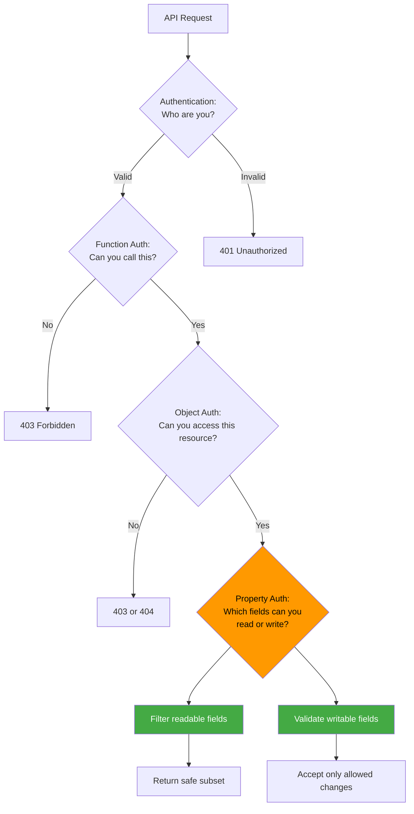
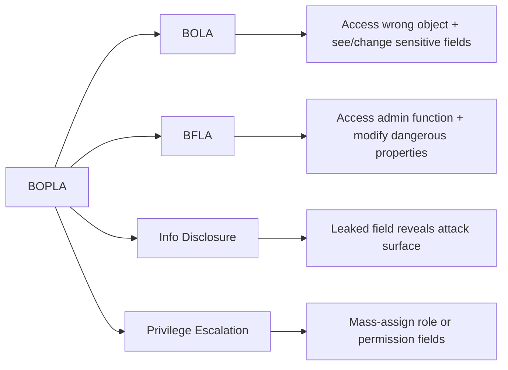

# Broken Object Property Level Authorization (BOPLA / API3:2023)

> **Broken Object Property Level Authorization happens when an API successfully controls *which objects* a caller may access, but fails to control *which properties or fields* within those objects the caller should be able to read or write.**

---

## 🧠 What Is It? (Beginner Explanation)

Imagine a medical office where every patient can access their own health record. That is **object-level authorization** working correctly.

But what if the system shows you the entire database record, including:

- internal notes meant only for doctors
- billing codes
- flags like `is_high_risk` or `payment_overdue`
- audit timestamps
- system-level IDs

Or imagine you can update your contact information, but the API also accepts and saves:

- `account_balance`
- `credit_limit`
- `role`
- `isVerified`
- `subscription_tier`

That is **Broken Object Property Level Authorization (BOPLA)**.

OWASP calls this **API3:2023** and breaks it into two related problems:

1. **Excessive Data Exposure** — the API returns fields the client should never read
2. **Mass Assignment** — the API accepts fields the client should never write

Both stem from the same root cause: the API treats the entire object as a single authorization decision instead of thinking property-by-property.

### Why "property-level" matters

Modern APIs are object-centric. They work with:

- user profiles
- customer records
- invoices
- orders
- projects
- devices
- messages

Each object contains many fields. Not all fields should be:

- visible to all callers
- editable in all contexts
- exposed in all API versions or transports

**BOPLA happens when the API says "you can access this object" but never asks "which parts of it?"**

---

## 🔑 How BOPLA Relates To Other API Authorization Issues

Authorization in APIs has multiple dimensions. Missing any one creates a different vulnerability.

| Layer | Core Question | Example | If It Fails |
|---|---|---|---|
| **Authentication** | Who are you? | "This JWT belongs to user `alice`." | Anyone may impersonate users |
| **Function-level authorization** | Are you allowed to call this operation? | "Can `alice` access admin endpoints?" | BFLA / vertical privilege escalation |
| **Object-level authorization** | Are you allowed to access this specific resource? | "Can `alice` read invoice `INV-1042`?" | BOLA / IDOR |
| **Property-level authorization** | Are you allowed to see or change this field? | "Can `alice` read `salary` or modify `role`?" | **BOPLA** / mass assignment / excessive exposure |

### Quick Summary

| Vulnerability | What Goes Wrong? | Typical Example |
|---|---|---|
| **BOLA** | Wrong object accessed | User reads another tenant's invoice |
| **BFLA** | Wrong function reached | Regular user calls admin-only export endpoint |
| **BOPLA** | Wrong fields exposed or accepted | Profile API leaks internal `credit_score` or allows client to set `is_admin=true` |

Many real-world vulnerabilities combine these. For example:

- **BOLA + BOPLA**: access another user's record **and** see their sensitive internal fields
- **BFLA + BOPLA**: reach an admin endpoint **and** manipulate dangerous properties
- **Mass Assignment + BOLA**: modify someone else's record by setting ownership fields

---

## 🧭 Core Mental Model: Objects Have Layers

Authorization should not stop at the object. It must continue into the object's structure.



### Two Directions of Failure

BOPLA splits into two attack surfaces:

#### 1. Excessive Data Exposure (Read-Side)

The API returns more fields than the caller should see.

**Example:**

```http
GET /api/v1/users/me
Authorization: Bearer <user-token>
```

**Vulnerable response:**

```json
{
  "id": "user_42",
  "name": "Alice",
  "email": "alice@example.com",
  "phone": "+1-555-0199",
  "internalNotes": "Flagged for review",
  "creditScore": 720,
  "lastLoginIP": "203.0.113.42",
  "accountFlags": ["PAYMENT_OVERDUE", "HIGH_RISK"],
  "salesforceContactId": "003...",
  "createdAt": "2022-01-15T10:00:00Z",
  "updatedAt": "2024-12-01T08:30:00Z",
  "version": 12
}
```

Fields like `internalNotes`, `creditScore`, `accountFlags`, and `salesforceContactId` are internal metadata that should never reach the client.

#### 2. Mass Assignment (Write-Side)

The API accepts more fields than the caller should modify.

**Example:**

```http
PATCH /api/v1/users/me
Authorization: Bearer <user-token>
Content-Type: application/json

{
  "name": "Alice Smith",
  "role": "admin",
  "accountBalance": 10000,
  "isVerified": true
}
```

If the API blindly applies all fields from the request body to the database record, the user just escalated their own privileges and modified financial state.

---

## 📦 Where Property-Level Issues Hide

BOPLA appears across many API surfaces. The protocol does not eliminate the risk.

| Surface | Read-Side (Excessive Exposure) | Write-Side (Mass Assignment) |
|---|---|---|
| **REST JSON** | Response includes internal or role-restricted fields | `PATCH`/`PUT` accepts unauthorized properties in request body |
| **GraphQL** | Query returns fields caller should not see | Mutation accepts input fields that should be server-controlled |
| **gRPC** | Message response includes sensitive proto fields | Request message allows modification of restricted fields |
| **File/export APIs** | CSV, PDF, Excel exports include columns with sensitive data | Import endpoints accept files with extra columns that alter protected state |
| **Search/filter APIs** | Search results leak metadata or computed fields | Filtering parameters modify internal state or logic |
| **Webhooks/integrations** | Outbound payloads expose secrets or internal IDs | Inbound webhook data overwrites protected fields |
| **Mobile/version drift** | Older mobile app versions receive full object structure | Legacy endpoints bypass newer field-level restrictions |

### Common patterns

```text
┌─────────────────────────────────────────────────────────────────┐
│ Client knows object structure from:                            │
├─────────────────────────────────────────────────────────────────┤
│  • API spec / OpenAPI / GraphQL schema                          │
│  • Reverse engineering mobile apps                              │
│  • Browser dev tools on web apps                                │
│  • Documentation / SDK / code samples                           │
│  • Accidental disclosure in error messages                      │
│  • Old API versions that were less restrictive                  │
└─────────────────────────────────────────────────────────────────┘
             ↓
┌─────────────────────────────────────────────────────────────────┐
│ Attacker attempts:                                              │
├─────────────────────────────────────────────────────────────────┤
│  READ: Request fields not shown in normal UI                    │
│  WRITE: Include extra fields in update/create requests          │
└─────────────────────────────────────────────────────────────────┘
             ↓
┌─────────────────────────────────────────────────────────────────┐
│ If backend lacks field-level authorization:                     │
├─────────────────────────────────────────────────────────────────┤
│  • ORM/database layer returns full object                       │
│  • Serializer includes all fields                               │
│  • Update logic accepts all JSON keys                           │
│  • No field-level ACL exists                                    │
└─────────────────────────────────────────────────────────────────┘
             ↓
         BOPLA
```

---

## 🔬 Why APIs Are Especially Vulnerable

BOPLA is particularly common in modern API design for several reasons.

### 1. ORMs and serializers encourage full-object thinking

Many frameworks make it easy to return entire database models:

```python
# Django REST Framework example
class UserSerializer(serializers.ModelSerializer):
    class Meta:
        model = User
        fields = '__all__'  # ⚠️ Exposes everything
```

```javascript
// Sequelize example
app.get('/api/users/:id', async (req, res) => {
  const user = await User.findByPk(req.params.id);
  res.json(user);  // ⚠️ All model attributes sent to client
});
```

The code is short and simple, but it ignores property-level authorization.

### 2. GraphQL makes field selection explicit and client-controlled

GraphQL is powerful because clients can request exactly the fields they need. But that also means:

- the client knows the full schema
- resolvers may not check field-level permissions
- deeply nested queries can expose indirect relationships

```graphql
query {
  user(id: "42") {
    name
    email
    internalNotes      # Should this be visible?
    creditScore        # Should regular users see this?
    accountFlags       # Internal metadata
  }
}
```

If the resolver does not filter fields by caller role, BOPLA results.

### 3. Update endpoints often accept raw JSON

REST APIs commonly use `PATCH` or `PUT` with JSON bodies:

```http
PATCH /api/v1/projects/123
Content-Type: application/json

{
  "name": "Updated Project Name",
  "ownerId": "user_999",           // ⚠️ Should not be writable
  "billingTier": "enterprise",     // ⚠️ Should not be writable
  "internalPriority": 10           // ⚠️ Should not be writable
}
```

If the backend applies all fields without validation, mass assignment occurs.

### 4. Mobile and web clients often share the same backend

- Web UI may only display 5 fields
- Mobile app may display 8 fields
- But the API returns 25 fields

Developers assume "the client won't use it," but that assumption is not security.

### 5. API versioning and backward compatibility

Older API versions may have been designed when all callers were trusted internal apps. As the API becomes public or multi-tenant, field restrictions are added to v2 or v3, but v1 remains overly permissive.

---

## 📘 Reading The API Spec With A BOPLA Lens

The API specification is one of the best places to identify property-level risks.

### Example: OpenAPI Schema

```yaml
components:
  schemas:
    User:
      type: object
      properties:
        id:
          type: string
        name:
          type: string
        email:
          type: string
        role:
          type: string
          enum: [user, admin, support]
        accountBalance:
          type: number
        creditScore:
          type: integer
        internalNotes:
          type: string
        createdAt:
          type: string
          format: date-time
        
paths:
  /v1/users/{userId}:
    get:
      summary: Get user details
      responses:
        '200':
          description: User object
          content:
            application/json:
              schema:
                $ref: '#/components/schemas/User'
    patch:
      summary: Update user
      requestBody:
        content:
          application/json:
            schema:
              $ref: '#/components/schemas/User'
```

### Spec-based questions

| Question | Why It Matters |
|---|---|
| Does the schema distinguish between readable and writable fields? | Many specs define one schema for both directions, which hides field-level policy |
| Are sensitive fields such as `role`, `balance`, or `internalNotes` documented? | Their presence in the schema suggests they flow through the API |
| Does the spec indicate role-based or context-based field visibility? | Without explicit documentation, assume the API returns everything to everyone |
| Are there separate schemas for create, update, and read operations? | This is a positive signal of field-level thinking |
| Does GraphQL schema include `@auth` or role directives on fields? | If not, field-level authorization may be missing |
| Are write operations documented with allowed vs forbidden fields? | If the spec says "accepts User object," mass assignment is likely |

### Translating the spec into a test matrix

Good BOPLA testing starts with a field-level authorization matrix.

#### Read-side matrix example

| Field | Regular User | Admin | Support | External Partner |
|---|---|---|---|---|
| `id` | ✅ Own record | ✅ All | ✅ All | ❌ |
| `name` | ✅ Own | ✅ All | ✅ All | ✅ Limited |
| `email` | ✅ Own | ✅ All | ✅ All | ❌ |
| `role` | ✅ Own | ✅ All | ✅ All | ❌ |
| `accountBalance` | ✅ Own | ✅ All | ❌ | ❌ |
| `creditScore` | ❌ | ✅ All | ❌ | ❌ |
| `internalNotes` | ❌ | ✅ All | ✅ All | ❌ |
| `createdAt` | ✅ Own | ✅ All | ✅ All | ❌ |

#### Write-side matrix example

| Field | User (Own Record) | Admin | Support | External Partner |
|---|---|---|---|---|
| `name` | ✅ | ✅ | ✅ | ❌ |
| `email` | ✅ | ✅ | ✅ | ❌ |
| `role` | ❌ | ✅ | ❌ | ❌ |
| `accountBalance` | ❌ | ✅ | ❌ | ❌ |
| `creditScore` | ❌ | ✅ | ❌ | ❌ |
| `internalNotes` | ❌ | ✅ | ✅ | ❌ |

This matrix becomes the ground truth for testing.

---

## ⚙️ How BOPLA Usually Happens In Code

### Vulnerable Pattern 1: Full serialization without filtering

```python
@app.get("/api/v1/users/<user_id>")
def get_user(user_id):
    user = require_auth()
    target = User.query.get(user_id)
    authorize(user, "read", target)
    return jsonify(target.to_dict())  # ⚠️ All fields sent to client
```

**Problem:** Object-level auth passed, but every field is returned regardless of role.

### Vulnerable Pattern 2: ORM mass assignment

```ruby
# Rails example
def update
  @user = User.find(params[:id])
  authorize @user
  @user.update(user_params)  # ⚠️ What if user_params includes :role or :admin?
  render json: @user
end

private
def user_params
  params.require(:user).permit!  # ⚠️ Permits everything
end
```

**Problem:** The framework allows all fields from the client request.

### Vulnerable Pattern 3: GraphQL resolver without field-level checks

```javascript
const resolvers = {
  User: {
    creditScore: (parent, args, context) => {
      // ⚠️ No check: is the caller allowed to see creditScore?
      return parent.creditScore;
    },
    internalNotes: (parent) => {
      // ⚠️ No role check
      return parent.internalNotes;
    }
  }
};
```

**Problem:** Field resolvers assume the query is already authorized at the object level, so they return data unconditionally.

### Vulnerable Pattern 4: Trusting client-side field visibility

```javascript
// Frontend only shows: name, email
// Backend returns: name, email, role, balance, internalNotes, creditScore

app.get('/api/users/:id', (req, res) => {
  const user = db.getUser(req.params.id);
  res.json(user);  // ⚠️ Developer assumes client won't look at extra fields
});
```

**Problem:** Security by obscurity. Clients can view the full JSON response.

---

## 🛡️ How An Authorized Tester Validates BOPLA Safely

The goal is to verify field-level authorization without causing harm or accessing real sensitive data.

### Safe Validation Approach

#### 1. Start from the API spec and data model

- Identify which fields exist in the schema
- Mark fields that are role-restricted, internal-only, or financially sensitive
- Build a field-level authorization matrix

#### 2. Use controlled test accounts with different roles

Common test personas:

- Regular user (viewing own record)
- Regular user (attempting to view another user's record, if BOLA testing is in scope)
- Admin user
- Support/read-only role
- Unauthenticated or low-privilege API client

#### 3. Test read-side exposure

**Method 1: Direct API requests**

```bash
# Request as regular user
curl -H "Authorization: Bearer <user-token>" \
  https://api.example.com/v1/users/me

# Check response for fields that should not be visible:
# - internalNotes
# - creditScore
# - systemMetadata
# - sensitive IDs
```

**Method 2: GraphQL introspection + query**

```graphql
query {
  user(id: "me") {
    id
    name
    email
    role              # Should regular user see this?
    creditScore       # Should this be visible?
    internalNotes     # Should this be exposed?
  }
}
```

**Method 3: Export/download endpoints**

```bash
# Check if CSV/Excel/PDF exports include columns with sensitive data
GET /api/v1/reports/users/export?format=csv
```

#### 4. Test write-side mass assignment

**Method 1: Include restricted fields in update**

```bash
# Attempt to modify role or balance
curl -X PATCH https://api.example.com/v1/users/me \
  -H "Authorization: Bearer <user-token>" \
  -H "Content-Type: application/json" \
  -d '{
    "name": "Updated Name",
    "role": "admin",
    "accountBalance": 999999
  }'
```

**Indicators of vulnerability:**

- `200 OK` response
- Fields actually updated in subsequent GET
- No error message about forbidden fields

**Method 2: GraphQL mutations with extra input**

```graphql
mutation {
  updateProfile(input: {
    name: "Alice"
    role: "admin"              # Should be rejected
    accountBalance: 50000      # Should be rejected
  }) {
    id
    role
    accountBalance
  }
}
```

**Method 3: Batch/import endpoints**

```bash
# Upload CSV with extra columns
POST /api/v1/users/import
Content-Type: text/csv

id,name,email,role,creditScore
user_1,Alice,alice@example.com,admin,800
```

Check if restricted columns like `role` and `creditScore` are applied.

#### 5. Test across all transports and versions

- REST v1, v2, v3
- GraphQL endpoint
- Mobile-specific APIs
- Legacy SOAP or XML endpoints
- Admin vs user-facing gateways

Different surfaces often have inconsistent field filtering.

#### 6. Observe indirect signals

| Signal | Interpretation |
|---|---|
| Response size differs by role | Possible correct field filtering (good) or role-based data leakage (bad, if unintended) |
| Error message reveals field names | Example: "Field `internalNotes` is read-only" confirms the field exists and was processed |
| Mutation succeeds but returns subset of fields | May indicate write succeeded but read-side is filtered; verify persistence |
| Different field sets in sync vs async responses | Async jobs or webhooks may bypass field-level controls |

---

## 💥 Common Impact

BOPLA may sound less severe than BOLA or BFLA, but the consequences are often serious.

### Read-Side (Excessive Data Exposure)

| Field Type Leaked | Example Impact | Typical Severity |
|---|---|---|
| **PII / sensitive personal data** | Privacy breach, GDPR/CCPA violation, identity theft risk | High |
| **Financial data** | Account balances, credit scores, payment history exposed | High |
| **Internal metadata** | System IDs, workflow states, flags like "fraud_risk" or "vip_customer" | Medium-High |
| **Authentication/security fields** | Password hashes, security questions, MFA secrets, reset tokens | Critical |
| **Business intelligence** | Pricing, margins, strategy notes, sales targets | High |
| **Technical internals** | Database IDs, internal service endpoints, version info | Medium |

### Write-Side (Mass Assignment)

| Field Type Modified | Example Impact | Typical Severity |
|---|---|---|
| **Role or privilege fields** | User sets `role=admin` or `isVerified=true` | Critical |
| **Financial fields** | User sets `accountBalance=999999` or `creditLimit=unlimited` | Critical |
| **Ownership fields** | User changes `ownerId`, `tenantId`, or `assignedTo` | Critical |
| **Workflow state** | User sets `status=approved` or `paymentStatus=paid` | High-Critical |
| **Timestamps** | User backdates `createdAt` or manipulates `expiresAt` | Medium-High |
| **Foreign keys / relationships** | User reassigns objects to other accounts or projects | High |

### Real-World Examples (Public Disclosures)

BOPLA has been found in major platforms:

- **E-commerce platforms**: Exposed internal pricing, supplier costs, and inventory margins
- **Social networks**: Leaked private profile flags, moderation notes, and shadow-ban status
- **Financial services**: Returned credit scores, risk ratings, and account flags in user profile APIs
- **SaaS tools**: Allowed users to modify subscription tiers, feature flags, and billing state via mass assignment
- **Healthcare apps**: Exposed diagnostic codes, provider notes, and insurance details

---

## 🔗 How BOPLA Chains With Other Vulnerabilities



### Dangerous Combinations

| Combination | Result |
|---|---|
| **BOPLA + BOLA** | Access another user's record and see their sensitive internal fields |
| **BOPLA + BFLA** | Reach admin endpoint and modify restricted properties like `isSuperAdmin` |
| **BOPLA + broken authentication** | Stolen token + mass assignment = full account takeover |
| **BOPLA + API inventory drift** | Old API version exposes fields that newer versions hide |
| **BOPLA + excessive logging** | Sensitive fields logged to third-party analytics or error tracking |
| **BOPLA + CORS misconfiguration** | Cross-origin requests leak internal fields to attacker-controlled sites |

---

## 🧱 Defensive Guidance

Modern API security guidance from OWASP, NIST, and PortSwigger all emphasize the same principle:

> **Field-level authorization must be enforced explicitly, not assumed from UI design or client behavior.**

### 1. Use explicit allow-lists for readable and writable fields

Do not serialize entire objects. Instead, define what the caller may see or change.

#### Python example (Flask + Marshmallow)

```python
from marshmallow import Schema, fields

class UserPublicSchema(Schema):
    id = fields.Str()
    name = fields.Str()
    email = fields.Email()

class UserAdminSchema(UserPublicSchema):
    role = fields.Str()
    accountBalance = fields.Float()
    internalNotes = fields.Str()

@app.get("/api/v1/users/<user_id>")
def get_user(user_id):
    user = require_auth()
    target = User.query.get(user_id)
    authorize(user, "read", target)
    
    if user.is_admin:
        return UserAdminSchema().dump(target)
    else:
        return UserPublicSchema().dump(target)
```

#### Ruby on Rails example

```ruby
class UserSerializer < ActiveModel::Serializer
  attributes :id, :name, :email

  attribute :role, if: :admin?
  attribute :account_balance, if: :admin?
  attribute :internal_notes, if: :admin_or_support?

  def admin?
    scope.admin?
  end

  def admin_or_support?
    scope.admin? || scope.support?
  end
end
```

#### GraphQL example with field-level authorization

```javascript
const resolvers = {
  User: {
    creditScore: (parent, args, context) => {
      if (!context.user.isAdmin) {
        throw new Error('Forbidden');
      }
      return parent.creditScore;
    },
    internalNotes: (parent, args, context) => {
      if (!context.user.isAdmin && !context.user.isSupport) {
        return null;  // or throw error
      }
      return parent.internalNotes;
    }
  }
};
```

### 2. Enforce strong parameter filtering on writes

Reject or ignore fields that should not be client-writable.

#### Rails strong parameters (correct)

```ruby
def user_params
  if current_user.admin?
    params.require(:user).permit(:name, :email, :role, :account_balance)
  else
    params.require(:user).permit(:name, :email)
  end
end
```

#### Node.js example

```javascript
app.patch('/api/v1/users/:id', (req, res) => {
  const allowedFields = ['name', 'email', 'phone'];
  
  if (req.user.isAdmin) {
    allowedFields.push('role', 'accountBalance');
  }
  
  const updates = {};
  allowedFields.forEach(field => {
    if (req.body[field] !== undefined) {
      updates[field] = req.body[field];
    }
  });
  
  User.update(req.params.id, updates);
});
```

### 3. Design separate DTOs/schemas for different operations

Do not reuse the same schema for read, create, and update.

| Operation | Schema/DTO Name | Purpose |
|---|---|---|
| Read (public) | `UserPublicResponse` | Fields safe for any authenticated user |
| Read (admin) | `UserAdminResponse` | Fields for privileged roles |
| Create | `CreateUserRequest` | Fields allowed during user creation |
| Update (self) | `UpdateOwnProfileRequest` | Fields user can change on their own record |
| Update (admin) | `AdminUpdateUserRequest` | Fields admin can change |

### 4. Apply field-level authorization in ORMs and resolvers

Many ORMs and GraphQL servers support field-level hooks:

- **Django REST Framework**: `SerializerMethodField` with role checks
- **Rails Active Model Serializers**: Conditional attributes
- **GraphQL Shield / GraphQL Authz**: Field-level rules
- **Prisma / TypeORM**: Select only required columns in query

### 5. Avoid `SELECT *` in database queries when possible

Fetch only the columns you intend to return or use:

```sql
-- Risky
SELECT * FROM users WHERE id = :user_id;

-- Safer
SELECT id, name, email, created_at
FROM users
WHERE id = :user_id;
```

This reduces accidental leakage if serialization logic is incomplete.

### 6. Validate and filter at multiple layers

Defense in depth for BOPLA:

1. **Gateway/API gateway**: Strip known sensitive fields early
2. **Application layer**: Role-based serializers
3. **ORM/data layer**: Column-level access control if supported
4. **Monitoring**: Alert on responses containing flagged fields for low-privilege roles

### 7. Treat GraphQL schema as a contract, not documentation

If a field exists in the schema, clients will request it. Either:

- Remove the field from the schema for roles that should not see it
- Protect it with field-level authorization in resolvers
- Use schema stitching or federation to expose different schemas per role

### 8. Document field-level policies explicitly

In API specs:

```yaml
components:
  schemas:
    User:
      properties:
        id:
          type: string
        name:
          type: string
        creditScore:
          type: integer
          x-visibility: admin-only
          description: Only visible to admin users
        internalNotes:
          type: string
          x-visibility: admin,support
          x-writable: admin-only
```

This makes policy explicit and testable.

### 9. Automate field-level authorization testing

- **Contract testing**: Validate responses against role-specific schemas
- **Property-based testing**: Fuzz requests with extra fields and verify rejection
- **Regression testing**: Maintain test matrix of roles × operations × fields

### 10. Use framework-specific protections

| Framework | Recommendation |
|---|---|
| **Django** | Use `ModelSerializer` with explicit `fields` or `exclude`; avoid `fields = '__all__'` |
| **Rails** | Use strong parameters; avoid `permit!` |
| **Express.js** | Validate with libraries like `joi`, `yup`, or `express-validator` |
| **Spring Boot** | Use `@JsonView` for role-based serialization; use `@Valid` with custom validators |
| **GraphQL** | Use `graphql-shield`, `graphql-authz`, or custom field middleware |

---

## ✅ Review Checklist

Use this during design reviews, code reviews, and authorized testing.

### Read-Side (Excessive Data Exposure)

- [ ] Are response schemas defined with explicit field lists, not "all fields"?
- [ ] Are sensitive fields (PII, financial, internal, security-related) identified?
- [ ] Do different roles receive different field sets?
- [ ] Are field-level policies documented in the API spec?
- [ ] Do serializers or DTOs filter fields based on caller role or context?
- [ ] Are GraphQL field resolvers protected individually?
- [ ] Do export/download endpoints apply the same field-level filtering?
- [ ] Are old API versions reviewed for field-level drift?
- [ ] Is there a role × field authorization matrix in tests?

### Write-Side (Mass Assignment)

- [ ] Are update operations validated with allow-lists of writable fields?
- [ ] Do admin-only fields reject modification attempts from regular users?
- [ ] Are ownership fields (`ownerId`, `tenantId`) protected from client input?
- [ ] Are workflow state fields (`status`, `approved`, `paid`) validated?
- [ ] Do create operations enforce field restrictions?
- [ ] Are batch import/upload endpoints tested for restricted fields?
- [ ] Do GraphQL mutations validate input fields by role?
- [ ] Is there automated testing for unauthorized field modification?

### General

- [ ] Are field-level policies consistent across REST, GraphQL, gRPC, and other transports?
- [ ] Do mobile and web clients receive the same field filtering?
- [ ] Are internal APIs and service-to-service calls also field-filtered?
- [ ] Is there monitoring for unexpected fields in requests or responses?

---

## 🧪 Example Test Cases

### Test Case 1: Read-side field exposure

**Objective:** Verify that regular users cannot see admin-only fields

**Steps:**
1. Authenticate as regular user
2. Request `GET /api/v1/users/me`
3. Check response for fields: `internalNotes`, `creditScore`, `accountFlags`

**Expected result:** These fields should be absent or null

**Actual result (if vulnerable):** Fields are present with real values

---

### Test Case 2: Mass assignment privilege escalation

**Objective:** Verify that users cannot modify their own role

**Steps:**
1. Authenticate as regular user
2. Send `PATCH /api/v1/users/me` with body: `{"name": "Alice", "role": "admin"}`
3. Send `GET /api/v1/users/me` to check if role changed

**Expected result:** Either `400 Bad Request` with error about forbidden field, or role unchanged

**Actual result (if vulnerable):** Role updated to `admin`

---

### Test Case 3: GraphQL field-level authorization

**Objective:** Verify GraphQL field resolvers enforce role checks

**Steps:**
1. Authenticate as regular user
2. Query:
   ```graphql
   query {
     user(id: "me") {
       id
       name
       creditScore
     }
   }
   ```

**Expected result:** Error or null value for `creditScore`

**Actual result (if vulnerable):** Real credit score returned

---

### Test Case 4: Export endpoint field filtering

**Objective:** Verify CSV exports respect field-level authorization

**Steps:**
1. Authenticate as regular user
2. Request `GET /api/v1/users/export?format=csv`
3. Check CSV columns

**Expected result:** Only public fields present (name, email, etc.)

**Actual result (if vulnerable):** CSV includes `internalNotes`, `creditScore`, etc.

---

## 📚 References

### Primary Standards and Guidance

- [OWASP API Security Top 10 2023 — API3: Broken Object Property Level Authorization](https://owasp.org/API-Security/editions/2023/en/0xa3-broken-object-property-level-authorization/)
- [OWASP API Security Top 10 2019 — API3: Excessive Data Exposure](https://owasp.org/API-Security/editions/2019/en/0xa3-excessive-data-exposure/)
- [OWASP API Security Top 10 2019 — API6: Mass Assignment](https://owasp.org/API-Security/editions/2019/en/0xa6-mass-assignment/)
- [OWASP Mass Assignment Cheat Sheet](https://cheatsheetseries.owasp.org/cheatsheets/Mass_Assignment_Cheat_Sheet.html)
- [OWASP Authorization Cheat Sheet](https://cheatsheetseries.owasp.org/cheatsheets/Authorization_Cheat_Sheet.html)

### Additional Resources

- [PortSwigger Web Security Academy — Access Control](https://portswigger.net/web-security/access-control)
- [CWE-915: Improperly Controlled Modification of Dynamically-Determined Object Attributes](https://cwe.mitre.org/data/definitions/915.html)
- [GraphQL Authorization Best Practices](https://graphql.org/learn/authorization/)
- [NIST SP 800-162: Guide to Attribute Based Access Control (ABAC)](https://csrc.nist.gov/publications/detail/sp/800-162/final)

### Framework-Specific Guides

- [Django REST Framework — Serializers](https://www.django-rest-framework.org/api-guide/serializers/)
- [Rails Strong Parameters](https://api.rubyonrails.org/classes/ActionController/StrongParameters.html)
- [GraphQL Shield — Authorization Library](https://github.com/maticzav/graphql-shield)
- [Spring Security — Method Security](https://docs.spring.io/spring-security/reference/servlet/authorization/method-security.html)
