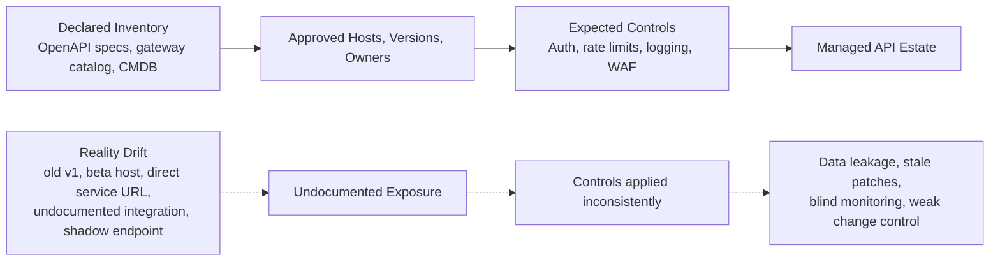
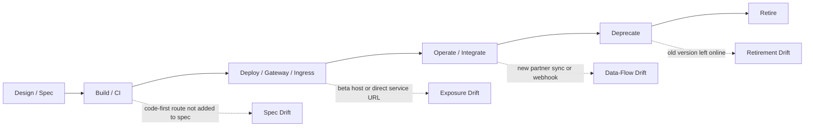
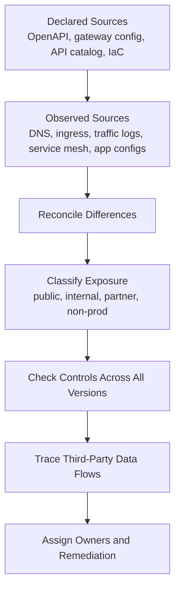
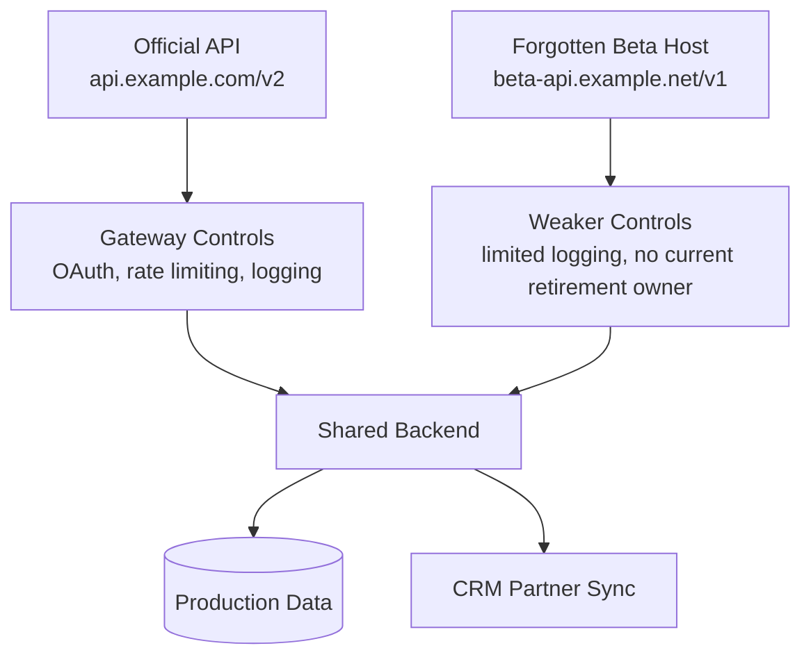

# Improper Inventory Management

> **Phase 07 — Core API Vulnerabilities**  
> **Focus:** Hidden, deprecated, undocumented, and mis-scoped APIs that expand the attack surface beyond what defenders think exists.  
> **Safety note:** This note is for **authorized API security assessment, defensive architecture review, and blue-team hardening**. It explains how inventory drift creates risk and how to validate it safely. It does **not** provide step-by-step abuse instructions.

---

**Relevant standards and references:** OWASP API9:2023, OWASP API9:2019, CWE-1059, OpenAPI Specification, Microsoft API governance guidance.

---

## Table of Contents

1. [Why It Matters](#1-why-it-matters)
2. [Improper Inventory Management in One Picture](#2-improper-inventory-management-in-one-picture)
3. [Beginner Mental Model](#3-beginner-mental-model)
4. [What Belongs in an API Inventory](#4-what-belongs-in-an-api-inventory)
5. [Documentation Blindspots and Data-Flow Blindspots](#5-documentation-blindspots-and-data-flow-blindspots)
6. [How Inventory Drift Happens](#6-how-inventory-drift-happens)
7. [Authorized Validation Workflow](#7-authorized-validation-workflow)
8. [What to Look For in Practice](#8-what-to-look-for-in-practice)
9. [Detection Opportunities](#9-detection-opportunities)
10. [Defensive Controls and Governance](#10-defensive-controls-and-governance)
11. [Reporting Guidance](#11-reporting-guidance)
12. [Conceptual Scenario](#12-conceptual-scenario)
13. [Key Takeaways](#13-key-takeaways)
14. [References](#14-references)

---

## 1. Why It Matters

Improper inventory management is the API security version of defending a building with a strong front door while forgetting about side entrances, old keys, maintenance tunnels, and vendor access.

Most teams think about API risk in terms of:

- broken authentication,
- broken authorization,
- excessive data exposure,
- or business logic abuse.

But before any of that, there is a more basic question:

> **Do we actually know which APIs, versions, hosts, protocols, environments, and third-party data flows exist?**

If the answer is incomplete, the organization may secure the **documented** API while leaving the **real** API surface only partially protected.

OWASP frames this as **API9:2023 Improper Inventory Management**. The problem is not just “bad documentation.” It is a failure of:

- asset visibility,
- ownership,
- version lifecycle control,
- environment separation,
- and data-flow awareness.

That makes it dangerous because the missing inventory often hides:

- old API versions with weaker controls,
- public beta or staging hosts,
- direct-to-service endpoints that bypass the gateway,
- undocumented GraphQL, gRPC, webhook, or mobile-only interfaces,
- and third-party integrations receiving more data than the business realizes.

In short:

> **Authentication answers who is calling. Authorization answers what they can do. Inventory management answers what exists at all.**

---

## 2. Improper Inventory Management in One Picture



The core lesson is simple:

**Improper inventory management is what happens when the organization’s mental map of the API estate is smaller than the real attack surface.**

---

## 3. Beginner Mental Model

A good way to remember this vulnerability is:

> **If authentication is the lock and authorization is the guard, inventory is the floor plan.**

A strong lock and a trained guard do not help much if defenders do not know how many doors exist.

### A simple mental model

| Security question | Primary control area | Example answer |
|---|---|---|
| **Who is calling?** | Authentication | This request carries a valid OAuth token |
| **What may they do?** | Authorization | This token can read invoices but not export billing data |
| **What API surface exists?** | Inventory management | Public host `api.example.com`, versions `v2` and `v3`, GraphQL endpoint, webhook receiver |
| **Who owns it?** | Governance / ownership | Platform team owns the gateway, billing team owns the service |
| **What data leaves the boundary?** | Data-flow inventory | Customer profile data is shared with a CRM integration |
| **What should already be retired?** | Lifecycle management | `v1` should have been removed last quarter |

### Beginner analogy

Imagine an airport.

- **Authentication** checks whether a person has a valid ID.
- **Authorization** checks whether they are allowed through a specific gate.
- **Inventory management** is the airport’s map of every terminal, service corridor, contractor entrance, and temporary access point.

If the map is wrong, security will miss doors that are still usable.

### The one sentence to remember

> **Inventory is not a spreadsheet; it is a living model of exposure, ownership, and data movement.**

---

## 4. What Belongs in an API Inventory

Many teams reduce inventory to “a list of endpoints.” That is too shallow.

A useful API inventory should cover at least these dimensions:

| Inventory dimension | Examples | Why it matters |
|---|---|---|
| **Hosts and domains** | `api.example.com`, `beta-api.example.net` | Public DNS names often expose forgotten environments |
| **Protocols and entry points** | REST, GraphQL, gRPC, webhooks, WebSockets | Different protocols may bypass existing inspection logic |
| **Paths and operations** | `/v2/orders`, `POST /refunds`, GraphQL mutations | Surface area is not just hostnames; it is callable behavior |
| **Versions and lifecycle state** | `v1`, `v2`, `beta`, deprecated, sunset date | Old versions often keep weaker controls or stale code |
| **Environment** | production, staging, test, development, partner | Exposure expectations differ sharply by environment |
| **Network exposure** | public internet, private network, partner-only, internal mesh | Inventory should describe who is supposed to reach the API |
| **Authentication model** | OAuth2, API keys, mTLS, signed webhooks | Missing or inconsistent auth often appears in shadow deployments |
| **Authorization model** | scope-based, role-based, object-level checks | Control expectations must be known across versions |
| **Owner and support team** | business owner, technical owner, on-call rotation | “No owner” usually becomes “no maintenance” |
| **Data classification** | public, internal, confidential, regulated | Inventory should say what sensitivity is at risk |
| **Third-party integrations** | CRM sync, payment processor, analytics sink | Hidden data sharing is part of the attack surface |
| **Logging and monitoring coverage** | gateway logs, SIEM enrichment, alerts | Unmonitored APIs become blind spots during incidents |
| **Retirement plan** | deprecation date, successor version, removal checklist | If retirement is informal, old APIs linger |

### Why the API spec matters

The OpenAPI Initiative describes OpenAPI as a machine-readable interface description that lets humans and computers understand service capabilities **without inspecting source code or traffic**. That is exactly why an API spec is so valuable for inventory work: it is the best candidate for a **source of truth**.

But there is an important warning:

> **A spec is only a source of truth if deployment reality is continuously reconciled back to it.**

### Example: inventory-friendly OpenAPI metadata

```yaml
openapi: 3.1.0
info:
  title: Customer Profile API
  version: 2.3.0
  description: Customer profile read/write service
  x-api-owner: identity-platform
  x-data-classification: confidential
  x-lifecycle-stage: production
  x-sunset-successor: v3
servers:
  - url: https://api.example.com/v2
    description: production
  - url: https://staging-api.example.net/v2
    description: staging
security:
  - oauth2: [profile.read, profile.write]
```

This does not solve inventory by itself, but it shows what a healthy spec can contribute:

- version clarity,
- environment clarity,
- ownership metadata,
- and security expectations.

---

## 5. Documentation Blindspots and Data-Flow Blindspots

OWASP 2023 sharpened this category by emphasizing two different blind spots.

### 1. Documentation blindspot

A documentation blindspot exists when teams cannot answer basic questions such as:

- Which environment is this API running in?
- Which version is live?
- Who should be able to reach it?
- Which controls apply to it?
- What is the retirement plan?

### 2. Data-flow blindspot

A data-flow blindspot exists when sensitive information is shared with third parties but the organization lacks:

- clear business justification,
- clear inventory of the flow,
- or deep visibility into exactly what data is being sent.

### Side-by-side view

| Blindspot type | What it usually means | Typical consequence |
|---|---|---|
| **Documentation blindspot** | Unknown hosts, versions, owners, or controls | Hidden exposure and weak maintenance |
| **Data-flow blindspot** | Unknown or poorly justified sharing with partners or external services | Silent overexposure of sensitive data |

### 2019 vs 2023 — what changed?

| OWASP edition | Name | Key emphasis |
|---|---|---|
| **2019** | Improper Assets Management | Old API versions, public non-prod assets, poor documentation |
| **2023** | Improper Inventory Management | Broader visibility problem: hosts, versions, environments, and third-party data flows |

That shift matters.

The 2023 framing recognizes that modern API estates are not just “servers with routes.” They are ecosystems involving:

- gateways,
- microservices,
- cloud ingress,
- service meshes,
- external integrations,
- and multiple machine identities.

### The advanced lesson

> **This is not just an asset problem. It is a control-plane problem.**

If teams cannot inventory APIs and data flows accurately, they cannot reliably apply security controls, monitor change, or retire risk.

---

## 6. How Inventory Drift Happens

Inventory problems rarely start with negligence alone. They often come from ordinary engineering behavior in fast-moving environments.



### Common drift sources

| Drift source | What happens | Why it becomes risky |
|---|---|---|
| **Fast versioning** | `v1`, `v2`, `beta`, and mobile-only variants coexist | Old versions remain reachable and may miss newer safeguards |
| **Microservice autonomy** | Teams deploy services independently | Local convenience creates global visibility gaps |
| **Gateway bypass** | Backend service host becomes directly reachable | Controls at the gateway do not protect the bypass path |
| **Public non-production exposure** | Staging or test hosts are reachable from the internet | Lower-trust environments may still touch real data |
| **Spec drift** | Code changes but OpenAPI is not updated | Documentation stops matching behavior |
| **Partner expansion** | New third-party data sharing is added informally | Sensitive fields leave the boundary without review |
| **Mergers and legacy carryover** | Acquired or inherited APIs stay online | Owners and lifecycle status become unclear |
| **Retirement failure** | DNS, routes, secrets, or containers remain active | “Deprecated” turns into “quietly still live” |

### Why modern architectures amplify the problem

OWASP notes that microservices and cloud-native deployment make APIs easy to deploy and independent. That convenience is great for delivery speed, but it also makes uncontrolled sprawl easier.

The more distributed the platform becomes, the easier it is to end up with:

- one documented public API,
- several internal services exposed by mistake,
- a forgotten preview environment,
- and one or more external data-sharing paths nobody fully tracks.

### A useful advanced framing

Inventory drift usually appears in four forms:

| Drift type | Core question |
|---|---|
| **Surface drift** | Are there more reachable APIs than the catalog shows? |
| **Control drift** | Do all reachable APIs have the same baseline protections? |
| **Ownership drift** | Does every API still have a real owner and support path? |
| **Data drift** | Is data leaving the system in ways the business still understands and approves? |

---

## 7. Authorized Validation Workflow

The goal of validation is not to “hunt random endpoints.” The goal is to **safely reconcile declared inventory with observed reality inside authorized scope**.



### Phase 1: Collect declared inventory

Use approved internal sources such as:

- OpenAPI or other machine-readable specs,
- API gateway and API management exports,
- infrastructure-as-code repositories,
- service registry or internal developer portals,
- deployment manifests,
- and formal data-flow documentation.

### Phase 2: Collect observed inventory

Compare declared sources against operational reality using approved visibility sources such as:

- DNS records and approved subdomain inventories,
- TLS certificate inventory,
- ingress and load-balancer configuration,
- service mesh or east-west telemetry,
- runtime traffic logs,
- mobile app configuration and client-side endpoint references,
- and partner integration records.

### Phase 3: Reconcile mismatches

The highest-value mismatches usually look like this:

| Mismatch | What it suggests |
|---|---|
| API reachable but not in catalog | Shadow API or stale inventory |
| API in spec but not in runtime | Dead documentation or incomplete retirement |
| Version live with different controls | Inconsistent policy application |
| Public host marked as internal | Exposure drift |
| Third-party data flow not documented | Governance blindspot |
| No current owner | Maintenance and incident-response weakness |

### Safe validation questions

Instead of thinking in offensive steps, ask defensive questions:

- Is every reachable version accounted for?
- Are non-production deployments isolated from production data?
- Does every public or partner-facing API have a documented owner?
- Do documented controls match what is actually enforced?
- Are undocumented APIs missing logging, rate limiting, or gateway policy?
- Are sensitive third-party data flows justified, documented, and monitored?

### Low-risk evidence examples

Evidence can often be gathered without aggressive interaction by comparing:

- gateway route lists against the OpenAPI path list,
- version headers across documented and deprecated versions,
- environment labels against public DNS exposure,
- and partner documentation against actual exported fields.

---

## 8. What to Look For in Practice

### High-signal findings

| Pattern | Why it matters | Typical evidence |
|---|---|---|
| **Deprecated version still live** | Older versions may miss auth, logging, or rate-limiting improvements | `v1` still reachable after `v2` became official |
| **Public beta or staging host** | Non-prod systems often have weaker hardening but real connectivity | Public DNS plus weaker headers, logging, or access policy |
| **Direct service exposure** | Gateway protections do not help if the backend is reachable directly | Internal service hostname exposed through load balancer or ingress |
| **Undocumented protocol surface** | GraphQL, gRPC, webhooks, or WebSockets may sit outside normal controls | Gateway catalog shows REST only, but runtime reveals more |
| **Spec-to-runtime mismatch** | Documentation is no longer trustworthy | Routes or parameters exist in traffic but not in the spec |
| **Ownerless API** | Incidents and security fixes stall when nobody is accountable | No owner metadata, unclear support path |
| **Production data in non-production** | Lower-trust environments inherit high-value data risk | Staging connected to real databases or partner systems |
| **Undocumented third-party sharing** | Sensitive data leaves the trust boundary silently | Fields sent to analytics, CRM, or partner APIs without inventory record |

### Warning signs that should raise concern quickly

- multiple active versions with no published sunset plan,
- inconsistent auth behavior across versions,
- test or preview endpoints visible in mobile apps,
- undocumented hosts in certificate or DNS inventories,
- and third-party integrations that know more than they should.

### Why this often chains with other API risks

Improper inventory management is often not the final finding. It is the **enabler** that lets other weaknesses survive unnoticed.

For example, hidden or old APIs are more likely to also contain:

- broken authentication,
- broken object or function authorization,
- weak rate limiting,
- excessive data exposure,
- or stale components.

That is why API9 frequently acts as a **force multiplier** for the rest of the API Top 10.

---

## 9. Detection Opportunities

A mature program treats inventory as both a **governance problem** and a **telemetry problem**.

### Useful detection lenses

| Telemetry source | What it can reveal |
|---|---|
| **API gateway logs** | Unknown versions, low-volume legacy traffic, odd hostnames |
| **DNS and certificate inventory** | New or forgotten `api.*`, `beta.*`, or `staging.*` exposures |
| **Ingress / load balancer changes** | Services exposed without catalog or spec updates |
| **Service mesh telemetry** | Direct-to-service access paths bypassing the intended edge |
| **CI/CD metadata** | New deployments not linked to approved inventory records |
| **OpenAPI diff checks** | Undocumented route or schema changes |
| **DLP / egress monitoring** | Sensitive fields flowing to third parties unexpectedly |
| **Identity and key management systems** | Old service accounts, API keys, or certificates tied to retired APIs |

### Defender mindset

The best detection question is not just:

> “Is this request malicious?”

It is also:

> “Why is this API reachable at all, and is it one we intended to expose?”

### A practical triage order

When defenders find a possible shadow or stale API, triage usually works best in this order:

1. confirm whether the asset is real and reachable,
2. determine intended environment and ownership,
3. identify data sensitivity,
4. compare control coverage to current production baseline,
5. decide whether to isolate, harden, or retire it.

---

## 10. Defensive Controls and Governance

### A layered control model

| Layer | Defensive objective | Good practice |
|---|---|---|
| **Design** | Make inventory part of API design | Require machine-readable specs and ownership metadata |
| **Build** | Prevent undocumented drift from shipping | CI checks that routes, versions, and schemas match the approved spec |
| **Deploy** | Keep exposure consistent | Route all supported versions through the same control plane |
| **Operate** | Continuously detect unmanaged surface | Runtime API discovery and alerting on unknown hosts or paths |
| **Retire** | Actually remove obsolete exposure | Formal deprecation, sunset dates, route removal, DNS cleanup, key revocation |

### Governance principles worth enforcing

#### 1. No owner, no deploy

Every API should have:

- a technical owner,
- a business owner,
- a support path,
- and a lifecycle state.

#### 2. Spec is the seed, runtime is the truth

OpenAPI or equivalent definitions are essential, but they must be checked against:

- gateway exports,
- runtime traffic,
- ingress exposure,
- and integration behavior.

#### 3. Every supported version gets baseline controls

Microsoft’s API management guidance emphasizes strong versioning strategy and limiting the number of supported prior versions. In practice, that means:

- old versions cannot be treated as “legacy exceptions,”
- controls must apply consistently across versions,
- and version retirement must be time-bound.

#### 4. Non-production with production data is production risk

If staging, beta, or test environments handle real data, they need production-grade security treatment.

#### 5. Third-party flows are inventory items

A partner integration is not a side note. It is part of the API estate and should include:

- purpose,
- owner,
- approved data fields,
- security controls,
- and monitoring expectations.

### Control ideas that age well

- central API catalog tied to deployment metadata,
- automated OpenAPI generation or validation in CI/CD,
- deprecation and sunset policy for all versions,
- routine runtime discovery for undocumented APIs,
- environment separation backed by infrastructure policy,
- and periodic review of partner data-sharing contracts against observed traffic.

### Why documentation quality is a security issue

CWE-1059 describes insufficient technical documentation as a weakness because poor documentation makes products harder to maintain and makes vulnerabilities harder to find and fix.

That is exactly why this category matters.

> **Bad inventory is not only an operations problem. It directly increases security blind spots.**

---

## 11. Reporting Guidance

A strong report should make the problem concrete.

### Good finding titles

- **Deprecated public API version remains reachable outside the approved inventory**
- **Public staging API processes production data without production-grade controls**
- **Undocumented partner integration receives sensitive fields beyond approved data flow**
- **Direct backend service exposure bypasses gateway logging and policy enforcement**

### What to include in the finding

| Reporting element | What the reader needs |
|---|---|
| **Asset gap** | Which host, version, protocol, or integration was missing from the inventory |
| **Exposure** | Whether it is public, internal, partner-facing, or reachable by unintended users |
| **Control difference** | Which controls are weaker than the production baseline |
| **Data sensitivity** | What type of data or business action is exposed |
| **Ownership gap** | Whether a clear owner or lifecycle plan exists |
| **Business risk** | Why the hidden surface matters to confidentiality, integrity, availability, or compliance |
| **Remediation path** | Retire, isolate, bring under gateway control, document, or reclassify |

### Severity thinking

Severity should not be based only on “an undocumented endpoint exists.”

It should consider:

- whether the asset is actually reachable,
- whether it handles sensitive data,
- whether controls are weaker than expected,
- whether it bypasses monitoring,
- and whether it materially expands attacker options.

A forgotten internal test endpoint is not the same as a public legacy API connected to real production data.

---

## 12. Conceptual Scenario



### What this scenario teaches

The issue is not simply that a beta host exists.

The real problem is that:

- the organization’s approved inventory says the current protected interface is `v2`,
- but an older `v1` host still reaches the same backend,
- and the old path does not receive the same operational attention,
- while the backend also shares data with a partner integration that may not be fully documented.

That creates a layered failure:

1. **inventory failure** — the real surface is bigger than the declared surface,
2. **control inconsistency** — protections do not apply evenly,
3. **data-flow uncertainty** — downstream sharing may exceed what teams believe is happening.

This is why API9 should be treated as a real vulnerability category, not just “housekeeping.”

---

## 13. Key Takeaways

- **Improper inventory management means the real API estate is larger, older, or more connected than defenders believe.**
- **OpenAPI and similar specs are powerful inventory seeds, but they must be reconciled against runtime reality.**
- **OWASP 2023 expanded this category beyond assets to include data-flow blind spots and third-party sharing.**
- **Shadow APIs, legacy versions, direct backend exposure, and public non-production hosts are all high-value checks.**
- **Inventory without ownership decays. Ownership without retirement discipline still leaves stale exposure behind.**
- **If you remember one thing, remember this: security controls applied only to documented APIs are not enough if undocumented APIs still exist.**

---

## 14. References

1. **OWASP API Security Top 10 (2023)** — API9:2023 Improper Inventory Management  
   https://owasp.org/API-Security/editions/2023/en/0xa9-improper-inventory-management/

2. **OWASP API Security Top 10 (2019)** — API9:2019 Improper Assets Management  
   https://github.com/OWASP/API-Security/blob/master/editions/2019/en/0xa9-improper-assets-management.md

3. **OpenAPI Initiative / OpenAPI Specification** — why machine-readable API descriptions matter for discoverability and governance  
   https://github.com/OAI/OpenAPI-Specification

4. **Microsoft Learn** — Recommendations to mitigate OWASP API Security Top 10 threats using API Management  
   https://learn.microsoft.com/en-us/azure/api-management/mitigate-owasp-api-threats

5. **MITRE CWE-1059** — Incomplete / insufficient technical documentation as a security-relevant weakness  
   https://cwe.mitre.org/data/definitions/1059.html
