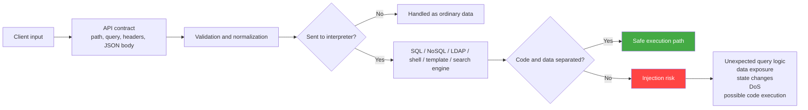
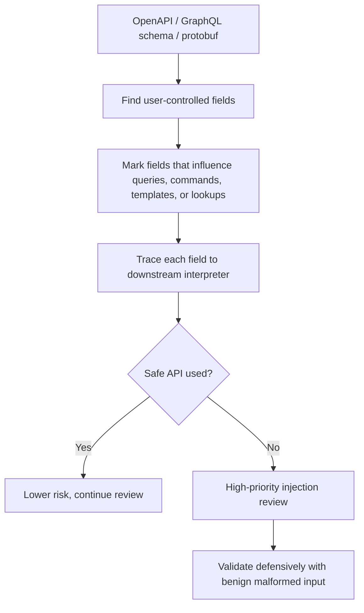
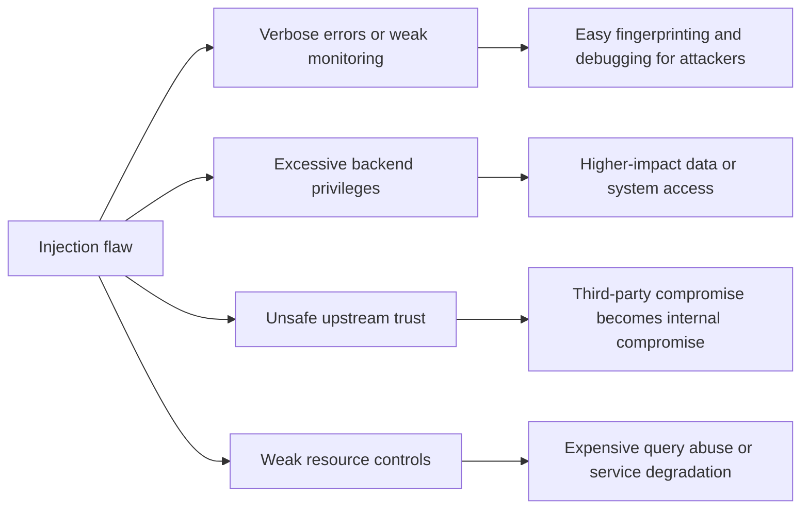

# Injection Attacks

> **Injection happens when an API passes untrusted data into a downstream interpreter in a way that lets the interpreter treat user-controlled input as instructions instead of plain data.**

---

## 🧠 What Is It? (Beginner Explanation)

Think of an API like a receptionist taking your request and forwarding it to the right internal team.

- If you ask for **data**, the receptionist should forward your message as data.
- If your message is accidentally treated like **instructions**, the internal team may do something you never should have been allowed to control.

That is the core of injection.

In APIs, this usually happens when user input reaches something that has its **own language or parser**, such as:

- a SQL or NoSQL database
- an LDAP directory
- an XPath or XQuery engine
- a shell command
- a template engine
- a search/query language
- a downstream API or integration that interprets structured input

The security failure is not "bad characters." The real failure is **collapsing the boundary between code and data**.

### Real-world analogy

Imagine writing your home address on a package label. That should be treated as delivery data only.

Now imagine the courier system reads parts of the address as routing rules, permission changes, or internal commands. Suddenly, something meant to be passive data starts changing system behavior.

That is how injection works.

---

## Why Injection Still Matters in API Security

OWASP API Security Top 10 **2019** listed **Injection** as a dedicated category (API8). OWASP API Security Top 10 **2023** no longer gives injection its own slot, but that does **not** mean the risk disappeared.

Instead, modern API guidance treats injection as a **cross-cutting failure mode** that often appears inside:

- **Security Misconfiguration**
- **Unsafe Consumption of APIs**
- **Broken Object Property Level Authorization**
- **Unrestricted Resource Consumption**
- protocol-specific implementations such as GraphQL resolvers, search backends, and template/render pipelines

APIs are especially exposed because they frequently accept structured, machine-generated input such as:

- `filter`
- `where`
- `search`
- `sort`
- `orderBy`
- `fields`
- `include`
- `expand`
- `template`
- `path`
- `filename`
- `query`
- `expression`

These parameters are convenient for clients, but they also sit close to powerful interpreters.

---

## 🧩 Core Mental Model: Find the Interpreter Boundary



The most useful question during API review is:

> **Where does client-controlled data stop being ordinary input and start influencing another language, command parser, or execution engine?**

If you can answer that, you can usually find injection risk.

---

## 📚 Injection Families You Will See in APIs

| Family | Typical API sink | What goes wrong | Common impact |
|---|---|---|---|
| **SQL / ORM injection** | Search, filter, login, reporting, export endpoints | Query text or dynamic clauses are built from user input | Unauthorized reads, writes, auth bypass, data destruction |
| **NoSQL injection** | JSON filters, document lookups, search APIs | API accepts raw operator objects or unsafe query fragments | Record overreach, logic changes, heavy queries, data leakage |
| **LDAP injection** | Directory-backed auth, user lookup, group search | User input alters LDAP filter logic | Authn/authz bypass, directory enumeration |
| **XPath / XQuery injection** | XML-backed search or config APIs | XML query expressions are built unsafely | Unexpected node access, data disclosure |
| **OS command / argument injection** | File conversion, diagnostics, backup, import/export | Input reaches a system shell or unsafe process invocation | Host compromise, file access, service disruption |
| **Template / expression injection** | Email rendering, PDF/report generation, notification templates | Template engine evaluates attacker-controlled expressions | Secret exposure, server-side execution, logic abuse |
| **Search/query-language injection** | Elasticsearch/Lucene/JSONPath/JMESPath-style search | Structured query fragments are trusted too much | Over-broad search, expensive execution, data leakage |

---

## API-Specific Clues in the Spec

When reviewing an API specification, flag operations that expose parameters or fields like these:

| Spec clue | Why it deserves attention | Safer design pattern |
|---|---|---|
| `sort`, `orderBy`, `fields` | These often control identifiers, not just values | Map to a server-side allowlist |
| `filter`, `where`, `search` | These may be converted into DB or search-engine queries | Use typed filter objects with limited operators |
| `template`, `message`, `body` | These may feed template engines or renderers | Treat as content, not executable template syntax |
| `file`, `path`, `filename` | These sometimes reach OS utilities or storage layers | Use generated filenames and internal APIs |
| `query`, `expression`, `pipeline` | These can expose raw interpreter power | Do not accept raw query languages from clients |
| webhook/integration payload mapping fields | External data may become trusted too early | Re-validate all third-party input at the boundary |

### Spec-first review workflow



A good API spec does not prove safety, but it makes risky data flows easier to find.

---

## Why It Happens

Injection flaws usually appear for one or more of these reasons:

1. **String concatenation is used where structured APIs should be used.**  
   Example: building SQL text, command strings, LDAP filters, or template expressions by hand.

2. **The API trusts structured client input too much.**  
   This is common with JSON filters, dynamic search, and raw query fragments.

3. **Developers validate values but not meaning.**  
   A string may be syntactically valid but still unsafe if it controls a column name, operator, or template expression.

4. **Integrated systems are trusted more than users.**  
   Data from mobile apps, partners, webhooks, queues, and upstream APIs is still untrusted data.

5. **Typed transport is mistaken for safe execution.**  
   REST JSON schemas, GraphQL types, and protobuf messages reduce ambiguity, but they do not protect unsafe downstream query construction.

6. **Privileges behind the interpreter are too broad.**  
   Even a small injection flaw becomes severe when the database account, shell process, or service identity has excessive access.

---

## How to Recognize Injection Risk

### High-signal code patterns

| Pattern | Why it is risky |
|---|---|
| String-built queries or filters | User input can change logic instead of only supplying values |
| Raw execution helpers | `exec`, `system`, raw SQL, template `render` with untrusted expressions |
| Client-controlled identifiers | Table names, columns, sort keys, operators, field lists |
| Accepting raw JSON query fragments | Clients can smuggle operators or nested structures |
| Generic passthrough endpoints | "search", "export", "report", and "query" APIs often hide interpreter access |
| Verbose parser errors | DB, LDAP, XML, or shell errors can reveal downstream technology and failure mode |

### High-signal endpoint types

- authentication and account recovery lookups
- advanced search/filter/reporting endpoints
- admin dashboards and exports
- file conversion and import/export features
- notification/template customization APIs
- webhook transformation and integration pipelines
- GraphQL resolvers backed by dynamic SQL or search builders

---

## ✅ How an Authorized Tester Validates It Safely

The goal is to confirm **whether input can influence an interpreter**, not to dump data, execute destructive actions, or pivot further.

### Safe validation approach

1. **Review the contract first**  
   Use the API spec, schema, or traffic capture to identify parameters that drive queries, filters, sorting, lookups, templates, or commands.

2. **Start with benign malformed input**  
   Prefer type mismatches, invalid enum values, unexpected nesting, oversized values, or unapproved field names over destructive payloads.

3. **Observe behavior differences**  
   Compare normal vs malformed requests for:
   - status code changes
   - parser/validation errors
   - timing anomalies
   - different record counts
   - unusual stack traces or downstream error messages

4. **Stop at proof of influence**  
   If the API shows that malformed input reaches a downstream interpreter unexpectedly, that is enough for a finding.

5. **Confirm root cause if you have code access**  
   Source review is safer and more reliable than pushing the system harder.

### Benign validation ideas

| Goal | Safe example approach | What you are looking for |
|---|---|---|
| Test scalar enforcement | Send an object or array where a string is expected | Weak type handling or raw object pass-through |
| Test allowlists | Use an undefined `sort` or `fields` value | Whether the API maps values server-side or concatenates them |
| Test operator control | Submit an unexpected nested filter shape | Whether arbitrary query operators are accepted |
| Test parser exposure | Use clearly invalid syntax for the declared format | Leaky backend errors that reveal interpreter details |
| Test length/resource handling | Send excessive but non-destructive length within test limits | Expensive parsing or query planning paths |

> **Defensive rule:** if you can prove untrusted input reaches the interpreter unexpectedly, document it and stop. Do not turn validation into exploitation.

---

## Example 1: SQL / ORM Injection in an API

### Vulnerable pattern

```javascript
// ❌ Risky: query text is assembled from API input
app.get('/api/orders', async (req, res) => {
  const status = req.query.status;
  const sql = "SELECT id, total FROM orders WHERE status = '" + status + "'";
  const rows = await db.query(sql);
  res.json(rows);
});
```

The bug is not only "bad input characters." The bug is that the API lets `status` participate in the SQL language itself.

### Safer pattern

```javascript
// ✅ Safer: keep SQL structure fixed, bind data separately
app.get('/api/orders', async (req, res) => {
  const status = req.query.status;
  const rows = await db.query(
    'SELECT id, total FROM orders WHERE status = ?',
    [status]
  );
  res.json(rows);
});
```

### Important API nuance: identifiers are different from values

Prepared statements help for **values**, but not usually for **identifiers** such as column names or sort directions.

```javascript
// ✅ Safer dynamic sorting: map user choice to a fixed allowlist
const SORT_FIELDS = {
  createdAt: 'created_at',
  total: 'total_amount',
  status: 'status'
};

const sortField = SORT_FIELDS[req.query.sort] || 'created_at';
const sortDirection = req.query.direction === 'asc' ? 'ASC' : 'DESC';
const sql = `SELECT id, total_amount, status FROM orders ORDER BY ${sortField} ${sortDirection}`;
```

This is a good API example because `sort` and `direction` often look harmless in the spec while still controlling query structure.

---

## Example 2: NoSQL Injection Through Flexible JSON Filters

### Vulnerable pattern

```javascript
// ❌ Risky: client body is trusted as a database filter
app.post('/api/users/search', async (req, res) => {
  const results = await db.collection('users').find(req.body.filter).toArray();
  res.json(results);
});
```

This design gives the client too much influence over the query language.

### Safer pattern

```javascript
// ✅ Safer: build a new filter object from typed, approved fields only
app.post('/api/users/search', async (req, res) => {
  const filter = {};

  if (typeof req.body.email === 'string') {
    filter.email = req.body.email.trim().toLowerCase();
  }

  if (typeof req.body.active === 'boolean') {
    filter.active = req.body.active;
  }

  const results = await db.collection('users').find(filter).toArray();
  res.json(results);
});
```

### Defensive design rules for NoSQL-backed APIs

- Do not accept raw filter JSON from clients.
- Reject unexpected keys and nested operator objects.
- Disallow server-side scripting or expression features unless there is a strong business requirement.
- Monitor for unusual query shapes, slow queries, and operator use.

---

## Example 3: Command and Argument Injection in Utility APIs

APIs often wrap OS utilities for file conversion, backup, image processing, diagnostics, or report generation.

### Vulnerable pattern

```python
# ❌ Risky: user data is embedded in a shell command string
import os

def generate_preview(filename):
    os.system("convert uploads/" + filename + " previews/output.png")
```

### Safer pattern

```python
# ✅ Safer: avoid shell invocation and separate arguments
import subprocess
from pathlib import Path

def generate_preview(filename):
    safe_name = Path(filename).name
    subprocess.run(
        ["/usr/bin/convert", f"uploads/{safe_name}", "previews/output.png"],
        check=True
    )
```

### Even better

If your language or platform has a built-in library for image processing, compression, parsing, or file movement, prefer that over spawning OS commands at all.

---

## Protocol-Specific Notes

### REST

REST APIs commonly expose injection risk through:

- query parameters used for search/filter/sort
- JSON request bodies that become ORM/ODM filters
- export/report endpoints with dynamic field lists
- admin/debug endpoints that call shell utilities

### GraphQL

GraphQL types help, but resolvers still receive untrusted values. Injection usually appears **behind** the schema when resolvers:

- build SQL dynamically
- accept arbitrary filter objects
- pass arguments to search engines
- render templates
- call shells or downstream interpreters

A typed schema reduces ambiguity; it does **not** replace safe query construction.

### gRPC / protobuf

Protobuf schemas reduce parsing ambiguity, but string fields can still flow into:

- databases
- search engines
- shells
- template engines
- filesystem operations

Type safety at the transport layer is useful, not sufficient.

### Webhooks and partner APIs

Injection is not only about direct user traffic. Upstream systems can become the attacker-controlled source if their data is trusted and forwarded without validation.

This is where injection overlaps strongly with **Unsafe Consumption of APIs**.

---

## 📉 Common Impact

| Impact area | How injection shows up in APIs |
|---|---|
| **Confidentiality** | Over-broad reads, hidden records returned, secret or metadata exposure |
| **Integrity** | Unauthorized updates, deletes, workflow tampering, search logic manipulation |
| **Availability** | Expensive queries, parser crashes, shell abuse, resource exhaustion |
| **Authentication / Authorization** | Login checks or directory lookups behave incorrectly |
| **Platform compromise** | Command/template injection may cross from API flaw to server takeover |

Impact is heavily shaped by the privileges of the downstream component.

- A read-only DB account limits blast radius.
- A highly privileged service account magnifies it.
- A shell running with broad filesystem access can turn a validation bug into infrastructure compromise.

---

## 🔗 How Injection Chains With Other API Issues



### Common chain patterns

| Chain | Why it matters |
|---|---|
| Injection + **Security Misconfiguration** | Verbose errors, debug endpoints, default features, and exposed admin tools make root cause easier to reach and diagnose |
| Injection + **Unsafe Consumption of APIs** | Third-party or partner data is trusted and then forwarded into a downstream interpreter |
| Injection + **Unrestricted Resource Consumption** | Search, regex, aggregation, or parser-heavy inputs become availability issues |
| Injection + **Broken Object Property Level Authorization** | A query flaw may expose fields the caller should never see |
| Injection + **Excessive privileges** | A low-level parser issue becomes a high-impact breach |

---

## 🛡️ Defensive Guidance

### 1. Keep code and data separate

This is the primary rule.

- use prepared statements and parameterized queries
- use driver query objects instead of query strings
- pass command arguments separately
- use safe template APIs that do not evaluate user-controlled expressions
- avoid raw interpreter access wherever possible

### 2. Treat API schemas as contracts, not decorations

- define strict types
- define enums for `sort`, `direction`, and mode selectors
- set max lengths and bounded array sizes
- reject unknown fields
- require explicit input models for complex filters

### 3. Allowlist identifiers and operators

Some inputs cannot be parameterized directly, especially:

- column names
- sort keys
- field selectors
- operation names
- command names

These should be mapped to a fixed server-side allowlist, never passed through directly.

### 4. Re-validate data from every trust boundary

Validate not only browser input, but also:

- mobile clients
- partner APIs
- webhook senders
- async queues
- imported files
- admin tooling
- internal service-to-service traffic

### 5. Reduce downstream privileges

- least-privilege DB accounts
- isolated service identities per function
- no shell where a library will do
- restricted filesystem/network access
- separate read and write roles where possible

### 6. Fail safely

- return generic client errors
- avoid exposing raw interpreter exceptions
- log detailed diagnostics server-side only
- alert on unusual query shapes, parser failures, and rejected operator patterns

### 7. Test continuously

- SAST for raw queries and command execution helpers
- code review focused on interpreter boundaries
- contract tests for allowed field/operator sets
- DAST or fuzzing with benign malformed input
- dependency and configuration review for unsafe defaults

---

## Detection and Telemetry

| Signal | Why it is useful |
|---|---|
| Repeated validation failures on filter/sort/search endpoints | Indicates probing around interpreter boundaries |
| Parser errors from SQL/LDAP/XML/template/search layers | Often the earliest visible sign of injection attempts |
| Slow-query spikes from a small set of endpoints | May indicate abusive search or query manipulation |
| Unexpected nested objects in otherwise simple parameters | Suggests operator or structure smuggling |
| Shell/process execution from API handlers | High-value telemetry for utility-style APIs |
| Large differences between normal and malformed request timing | Can reveal backend parser or query-planning behavior |

Good logs should capture:

- endpoint and operation name
- authenticated principal or service identity
- validated parameter names, not sensitive values
- rejection reason category
- downstream component involved
- latency and resource metrics

---

## Quick Review Checklist

- [ ] Have I identified every place API input reaches a downstream interpreter?
- [ ] Are values parameterized instead of concatenated?
- [ ] Are identifiers like sort keys and field names server-side allowlisted?
- [ ] Does the API reject unexpected nested structures and unknown fields?
- [ ] Are GraphQL resolvers / gRPC handlers / webhook processors reviewed like REST handlers?
- [ ] Are integrated third-party inputs validated again before reuse?
- [ ] Are backend accounts and service identities least-privileged?
- [ ] Are parser errors hidden from clients but logged internally?
- [ ] Are search/report/export endpoints resource-limited?
- [ ] Is validation confirmed through safe, non-destructive tests?

---

## Key Takeaways to Remember

1. **Injection is a boundary failure, not a punctuation problem.**
2. **The important question is always: what interpreter receives this input next?**
3. **Typed APIs help, but typed transport does not make downstream execution safe.**
4. **Dynamic identifiers (`sort`, `fields`, `orderBy`, `filter`) are frequent API blind spots.**
5. **Least privilege determines how bad the flaw becomes.**
6. **For authorized testing, proof of interpreter influence is enough; destructive follow-through is unnecessary.**

---

## Further Reading

- **OWASP API Security Top 10 (2019), API8: Injection**
- **OWASP API Security Top 10 (2023)**
- **OWASP SQL Injection Prevention Cheat Sheet**
- **OWASP NoSQL Security Cheat Sheet**
- **OWASP OS Command Injection Defense Cheat Sheet**
- **OWASP Input Validation Cheat Sheet**
- **OWASP GraphQL Cheat Sheet**
- **OWASP LDAP Injection guidance**
- **MITRE CWE-89: SQL Injection**
- **MITRE CWE-943: Improper Neutralization of Special Elements in Data Query Logic**
