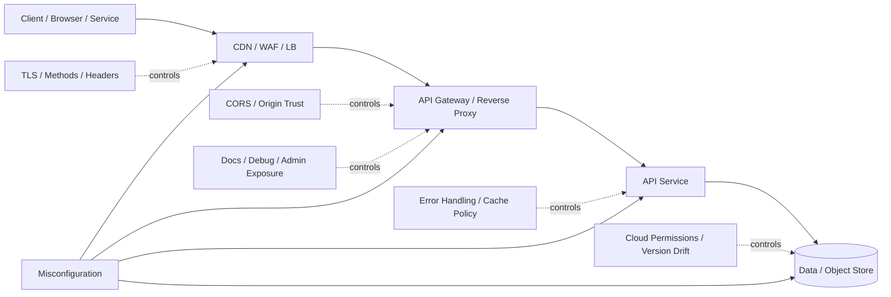
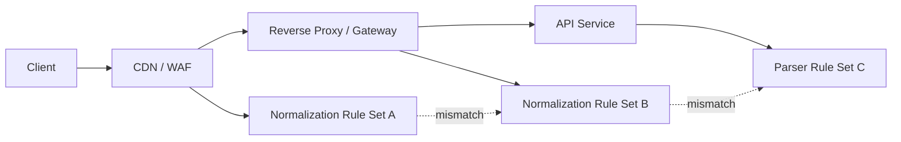

# Security Misconfiguration (API8:2023)

> **Security Misconfiguration happens when an API, gateway, proxy, cloud service, or supporting component is deployed with unsafe defaults, unnecessary exposure, or missing hardening — so the system becomes easier to access, map, abuse, or break than intended.**

---

## 🧠 What Is It? (Beginner Explanation)

A lot of security problems are not caused by a clever bug in code.

Sometimes the API is doing exactly what it was configured to do — and **that configuration is the problem**.

Think about a modern office:

- the front door badge reader works
- but the side door is propped open
- the visitor list is pinned in the lobby
- the alarm panel still has the factory code
- the CCTV room is unlocked
- and the building directory tells everyone where finance and HR sit

That is what **security misconfiguration** looks like in an API environment.

The core business logic may be fine, but the surrounding controls are weak:

- CORS trusts too many origins
- debug or admin endpoints stay exposed
- verbose errors leak stack traces and file paths
- cache headers let sensitive responses sit in browsers or shared proxies
- old versions and components remain online
- cloud storage or gateway permissions are broader than intended
- the API server chain disagrees on how to parse requests

OWASP places this in **API8:2023** because it is common, easy to introduce, and often severe in impact. It is also one of the easiest categories to underestimate, because each issue can look “small” on its own while the combined attack surface becomes large.

### Easy way to remember it

> **Misconfiguration means the system exposes more trust, behavior, or information than the design intended.**

---

## 🧭 Core Mental Model: Configuration Decides Exposure Before Business Logic Runs

A helpful way to think about API8 is this:

```text
code decides what the API can do
configuration decides who can reach it, how it behaves, and what it reveals
```

That means an API can have well-written application code and still be unsafe if the surrounding runtime is loose.

| Layer | Configuration question | Example mistake |
|---|---|---|
| **Network / edge** | Who can reach this service? | Admin API exposed to the internet |
| **Transport** | Is communication encrypted and validated? | HTTP still enabled for sensitive routes |
| **Gateway / proxy** | Are methods, paths, and headers normalized consistently? | Reverse proxy and backend parse requests differently |
| **Browser trust** | Which origins may read browser responses? | CORS reflects arbitrary `Origin` |
| **Response handling** | What metadata is returned to clients? | Stack traces, framework versions, SQL errors |
| **Caching** | Where can sensitive responses be stored? | Authenticated profile data cached in browser or proxy |
| **Operational surfaces** | Are docs, debug, metrics, and admin UIs protected? | Swagger UI, actuator, or tracing panel open externally |
| **Platform / cloud** | Are storage and permissions scoped tightly? | Public bucket for private export files |
| **Lifecycle** | Are versions patched and reviewed continuously? | Deprecated API left online with weaker hardening |



### The key lesson

Security misconfiguration is rarely one setting in one file.

In APIs, it is usually a **stack problem**:

- edge controls
- proxy behavior
- gateway policy
- application settings
- cloud permissions
- deployment drift between environments

That is why API8 frequently becomes the enabling condition for other findings, not just a standalone issue.

---

## 🌐 Why Modern APIs Drift Into Misconfiguration So Easily

OWASP API Security guidance and the broader HackerNotes API architecture both point to the same pattern: modern APIs are distributed, fast-moving, and hard to keep aligned.

### 1. APIs are rarely one service anymore

A “single API” may actually include:

- CDN
- load balancer
- WAF
- reverse proxy
- API gateway
- application service
- background workers
- object storage
- identity provider
- observability tooling

Every layer adds settings. Every setting adds drift risk.

### 2. One API often serves very different clients

The same backend may be consumed by:

- browsers
- mobile apps
- single-page apps
- partners
- internal services
- CI/CD jobs
- AI agents and automation

That matters because browser-facing APIs need careful CORS and cache handling, while service-to-service APIs need strong transport, mTLS, credential scope, and network segmentation.

### 3. Documentation and gateways make exposure easier

OpenAPI, Swagger UI, GraphQL schemas, API portals, gateway dashboards, developer sandboxes, and tracing tools help teams move faster. They also create more places where sensitive paths, methods, and identities can leak if left exposed.

### 4. Environment parity is often incomplete

A common operational pattern is:

- staging has debug features enabled for convenience
- production should disable them
- but one production node or one legacy route keeps the staging behavior

That is classic misconfiguration drift.

### 5. Vendor defaults are not deployment policy

Frameworks, gateways, and cloud services often ship with defaults intended to help teams bootstrap quickly. Those defaults are not the same thing as a hardened production profile.

---

## 🧩 Security Misconfiguration vs Related API Problems

Security misconfiguration overlaps with many other API issues, but it is not identical to them.

| Vulnerability | Main question | What makes it different? |
|---|---|---|
| **Security Misconfiguration** | Is the platform exposing too much or enforcing too little because of settings, defaults, or drift? | Focuses on operational and deployment mistakes |
| **Broken Authentication** | Is identity validation weak or bypassable? | Identity proof itself fails |
| **BOLA / BFLA / BOPLA** | Are object, function, or field permissions enforced correctly? | Authorization logic fails |
| **Improper Inventory Management** | Are old, shadow, or undocumented APIs still reachable? | Exposure comes from version and lifecycle gaps |
| **Unsafe Consumption of APIs** | Does a service trust upstream APIs too much? | Inbound trust from other APIs is the core issue |
| **Injection** | Can untrusted input reach an interpreter unsafely? | Parsing or interpreter boundary fails |

### Important connection

Misconfiguration often **enables** the others:

- exposed docs make hidden endpoints easier to find
- verbose errors reveal internal structure
- weak cache settings expose sensitive API responses
- outdated components reintroduce patched vulnerabilities
- permissive CORS turns browser access into a cross-origin data problem
- proxy inconsistencies create request smuggling or desync risk in the HTTP chain

---

## 📘 Reading the API Spec With a Misconfiguration Lens

The API spec is one of the best places to see the **intended** shape of the service. That makes it valuable for spotting where the deployed system may be drifting.

### Example OpenAPI fragment

```yaml
openapi: 3.1.0
servers:
  - url: https://api.example.com
paths:
  /v1/profile:
    get:
      summary: Get current user profile
      security:
        - bearerAuth: []
      responses:
        '200':
          description: Profile response
          headers:
            Cache-Control:
              schema:
                type: string
                example: no-store
  /v1/admin/audit-exports:
    post:
      summary: Start audit export job
      security:
        - bearerAuth: [audit:export]
components:
  securitySchemes:
    bearerAuth:
      type: http
      scheme: bearer
      bearerFormat: JWT
```

### What the spec tells you usefully

| Spec element | Why it matters for API8 |
|---|---|
| `servers` | Shows whether the intended public origin is HTTPS and explicit |
| `securitySchemes` | Reveals expected auth model and whether it is documented consistently |
| path + method inventory | Lets you compare intended methods with what the gateway actually accepts |
| response headers | Helps define expected cache and content handling for sensitive routes |
| admin or export operations | Highlights routes that should not be casually exposed or misrouted |

### What the spec does **not** prove automatically

A clean spec does not prove that the live deployment:

- disables weak or unused HTTP methods
- hides or protects Swagger UI and internal docs
- enforces the documented cache policy
- returns sanitized errors instead of stack traces
- applies CORS only to intended browser origins
- blocks access to debug panels, admin APIs, or observability tooling
- patches all running instances to the same version
- keeps every proxy and backend aligned on request parsing rules

### Practical spec review questions

| Question | Why it matters |
|---|---|
| Are all documented `servers` HTTPS-only? | API8 explicitly calls out missing TLS and weak transport handling |
| Do documented operations match the methods actually enabled at the edge? | Unexpected `TRACE`, `PUT`, or legacy methods suggest drift |
| Are sensitive responses documented with cache expectations? | Missing `no-store` for browser-accessed secrets is a real risk |
| Does the spec clearly separate public, partner, and admin surfaces? | Mixed exposure increases accidental publication |
| Are docs and try-it features intended for production? | Helpful developer tooling can become a disclosure surface |
| Are error responses schema-controlled? | Generic, structured errors reduce information leakage |
| Are old versions still listed or served? | Inventory drift often starts with version drift |

### A good defensive habit

Use the API spec as a **baseline for expected behavior**, then compare it against the running deployment:

```text
spec says what should exist
runtime shows what actually exists
API8 lives in the gap between the two
```

---

## 🧱 Common Misconfiguration Families in APIs

OWASP API8 and adjacent defensive guidance consistently point to a handful of recurring families.

| Family | What it looks like | Why it matters |
|---|---|---|
| **Permissive CORS** | Arbitrary origins, reflected origins, weak credential handling | Cross-origin browser access becomes broader than intended |
| **Missing or weak TLS posture** | HTTP still reachable, weak termination practices, mixed trusted origins | Confidentiality and session safety degrade |
| **Verbose errors** | Stack traces, SQL exceptions, file paths, framework banners | Gives attackers architecture and debugging data |
| **Unsafe caching** | Sensitive responses stored in browser or shared cache | Private data can persist or leak between users |
| **Exposed docs, debug, and admin surfaces** | Swagger UI, actuator, tracing, metrics, dashboards | Maps the platform and sometimes exposes control planes |
| **Unused methods or features still enabled** | `TRACE`, legacy routes, broad content-type acceptance | Unnecessary behavior expands the attack surface |
| **Default settings and credentials** | Factory admin accounts, unprotected management APIs | Low-effort entry point into high-value services |
| **Outdated components** | Legacy gateway/plugin/runtime version still live | Known flaws remain reachable |
| **Cloud and object storage drift** | Public buckets, broad IAM, weak metadata restrictions | Exports, uploads, or internal data become exposed |
| **HTTP chain inconsistencies** | Proxy and backend normalize requests differently | Desync, cache confusion, or policy bypass becomes possible |

---

## 🔐 CORS and Browser Trust: The Most Visible API8 Pattern

CORS is not relevant to every API client. It matters primarily when the API is accessed by browsers, browser-based frontends, or documentation/testing UIs running in a browser context.

That nuance matters:

- a pure machine-to-machine API may care little about browser-only headers
- a browser-facing JSON API must care a lot about origin trust and caching

### What safe CORS should mean

The server should answer a narrow question:

> **Which exact browser origins are allowed to read this response?**

Not:

> **Can any site that asks nicely read it?**

### Risky CORS patterns

| Pattern | Why it is dangerous |
|---|---|
| `Access-Control-Allow-Origin: *` on sensitive browser-readable APIs | Any origin may read the response in the browser context |
| reflecting arbitrary `Origin` | The policy becomes user-controlled |
| allowing credentials too broadly | Cookies or browser auth may be included from overly trusted origins |
| trusting `http://` origins for sensitive APIs | TLS trust can be weakened by mixed-origin design |
| allowing `null` origin without strong justification | Local files, sandboxed frames, or unusual contexts may be trusted accidentally |
| omitting `Vary: Origin` when responses differ by origin | Shared caches may serve mismatched CORS behavior |

### Safe example pattern

```http
OPTIONS /v1/profile HTTP/1.1
Host: api.example.com
Origin: https://app.example.com
Access-Control-Request-Method: GET

HTTP/1.1 204 No Content
Access-Control-Allow-Origin: https://app.example.com
Access-Control-Allow-Methods: GET
Access-Control-Allow-Headers: Authorization, Content-Type
Vary: Origin
```

### Misconfiguration signal

```http
HTTP/1.1 200 OK
Access-Control-Allow-Origin: https://random-origin.example
Access-Control-Allow-Credentials: true
```

The problem is not that CORS exists. The problem is that the trust boundary is too broad or too dynamic.

---

## 🧾 Error Handling, Diagnostic Exposure, and Information Leakage

OWASP API8 explicitly calls out error messages that include stack traces or internal details.

Verbose responses often reveal:

- file paths
- database technology
- ORM behavior
- dependency versions
- internal hostnames
- code locations
- feature flags or debug state

### Secure response shape

```http
HTTP/1.1 400 Bad Request
Content-Type: application/json

{
  "error": "invalid_parameter",
  "message": "The 'limit' parameter must be a positive integer.",
  "requestId": "9f7b3e5a"
}
```

### Misconfiguration signal

```http
HTTP/1.1 500 Internal Server Error
Content-Type: application/json

{
  "error": "java.lang.NumberFormatException: For input string: \"test\"",
  "stackTrace": [
    "com.example.api.OrderController.list(OrderController.java:52)",
    "org.springframework.web..."
  ],
  "sql": "SELECT * FROM orders LIMIT test"
}
```

### What defenders should remember

A good error model is:

- helpful for the client
- detailed in logs
- not detailed in the response body

That means **structured but sanitized**.

---

## 🗃️ Cache Policy Matters More for APIs Than Many Teams Realize

One of the most overlooked API8 details is caching.

If a browser-based API returns:

- profile data
- direct messages
- account statements
- tokens
- export links
- admin metadata

then the cache policy becomes a security control.

### Important distinction: `no-cache` vs `no-store`

MDN and RFC-based guidance emphasize a subtle but important difference:

| Directive | Meaning |
|---|---|
| **`no-cache`** | The response may be stored, but must be revalidated before reuse |
| **`no-store`** | The response should not be stored by private or shared caches |
| **`private`** | Response may be stored only in a private cache, not shared caches |
| **`must-revalidate`** | Stale responses must be revalidated before reuse |

For highly sensitive browser-facing API data, `no-store` is often the safer choice.

### Example secure pattern for a sensitive endpoint

```http
HTTP/1.1 200 OK
Content-Type: application/json
Cache-Control: no-store
Pragma: no-cache
```

### Why this matters operationally

If teams assume “it’s an API, not a web page” and skip cache review, private responses may still persist in:

- browser cache
- mobile web views
- shared reverse proxies
- CDN behavior that was tuned for static content

---

## 🛠️ Docs, Debug, Admin, and Observability Surfaces

Many API programs expose supporting interfaces that are not the API itself, but are tightly coupled to it.

| Surface | Typical example | Why it matters |
|---|---|---|
| **Documentation UI** | Swagger UI / Redoc | Reveals routes, parameters, auth flows, and object models |
| **Schema / spec file** | `/openapi.json`, `/swagger.json` | High-quality route inventory for anyone who can read it |
| **Debug framework pages** | development exception page, interactive debugger | Reveals internals; in worst cases can create direct compromise risk |
| **Platform diagnostics** | actuator, metrics, health, tracing | Can leak config, dependencies, heap info, or service topology |
| **Gateway/admin API** | gateway management endpoints | May expose routing, plugins, consumers, and credentials if unprotected |
| **Storage and export paths** | object URLs, temporary report downloads | Can reveal private artifacts if not scoped or expired correctly |

### A useful mental split

```text
public API surface
!=
all reachable operational surfaces
```

Security misconfiguration often happens because teams harden the application endpoints but forget the surrounding operator interfaces.

---

## 🔄 Proxy, Gateway, and HTTP Chain Misconfiguration

OWASP API8 also highlights discrepancies in how servers in the HTTP chain process requests.

That means the problem may live **between** components, not only inside one component.



### Why this matters

If one layer interprets a request differently from another, security controls can become unreliable.

Examples of defensive concerns include:

- one layer blocks a method that another still processes
- path normalization differs between edge and backend
- duplicated or conflicting headers are handled differently
- cache keys and authorization decisions are based on different normalized values

### Defensive principle

> **Every component in the chain should agree on what request arrived, which route it targets, and which methods and headers are valid.**

This is partly why API hardening belongs to platform engineering, not just application teams.

---

## ☁️ Cloud and Platform Misconfiguration Around APIs

APIs commonly rely on cloud and platform components that sit just outside the application code.

| Platform area | Example drift | Likely impact |
|---|---|---|
| **Object storage** | Export bucket or upload bucket made public | Sensitive files disclosed |
| **IAM / service identity** | API worker role can read too many secrets or buckets | Lateral movement and overexposure |
| **Secret management** | Credentials left in environment or debug endpoints | Token and key leakage |
| **Kubernetes / orchestration** | Dashboard, metrics, or internal service exposed | Cluster and service mapping exposure |
| **Gateway plugins / policies** | Auth, rate limit, or header rules only applied on some routes | Inconsistent control enforcement |
| **Version deployment** | One instance still runs an old image or dependency set | Security regressions remain reachable |

A recurring real-world pattern is that the API route itself looks fine, but the export store, callback worker, or admin plane behind it is mis-scoped.

---

## 🔍 Safe Example Patterns (Authorized and Non-Destructive)

These examples are designed for **authorized review and low-impact validation**. They show what good and bad behavior often look like without turning the note into an abuse guide.

### 1. Browser-facing CORS check

```http
OPTIONS /v1/profile HTTP/1.1
Host: api.example.com
Origin: https://app.example.com
Access-Control-Request-Method: GET
```

**Secure expectation**

```http
HTTP/1.1 204 No Content
Access-Control-Allow-Origin: https://app.example.com
Vary: Origin
```

**Misconfiguration signal**

```http
HTTP/1.1 200 OK
Access-Control-Allow-Origin: *
Access-Control-Allow-Credentials: true
```

### 2. Error handling check

```http
GET /v1/orders?limit=test HTTP/1.1
Host: api.example.com
Authorization: Bearer <approved-test-token>
```

**Secure expectation**

```http
HTTP/1.1 400 Bad Request
{
  "error": "invalid_parameter",
  "message": "The 'limit' parameter must be numeric.",
  "requestId": "..."
}
```

**Misconfiguration signal**

```http
HTTP/1.1 500 Internal Server Error
{
  "stackTrace": ["..."],
  "file": "/srv/app/controllers/order.js",
  "framework": "Express 4.17.1"
}
```

### 3. Sensitive response caching check

```http
GET /v1/profile HTTP/1.1
Host: api.example.com
Authorization: Bearer <approved-test-token>
```

**Secure expectation**

```http
HTTP/1.1 200 OK
Cache-Control: no-store
Content-Type: application/json
```

**Misconfiguration signal**

```http
HTTP/1.1 200 OK
Cache-Control: public, max-age=600
```

### 4. Unused method exposure check

```http
TRACE / HTTP/1.1
Host: api.example.com
```

**Secure expectation**

```http
HTTP/1.1 405 Method Not Allowed
```

If unnecessary methods are accepted unexpectedly, the runtime surface is broader than intended.

---

## 🧪 Authorized Validation Workflow (Defensive Focus)

The safest way to validate API8 is to compare **documented intent** with **live behavior**, using the lowest-impact requests possible.

### 1. Start with the intended inventory

Use approved sources:

- OpenAPI / Swagger spec
- architecture diagrams
- gateway configuration
- environment profiles
- cloud resource inventory
- release and dependency manifest

The goal is to answer:

```text
what should be exposed?
what should be hidden?
what should be cached?
what should only trust specific origins?
what should never run in production?
```

### 2. Separate browser-facing APIs from machine-only APIs

This helps avoid meaningless checks and focus on what matters.

| API type | Highest-value API8 checks |
|---|---|
| **Browser-facing** | CORS, cache policy, response headers, docs exposure |
| **Mobile / app backend** | TLS enforcement, error handling, version drift, debug exposure |
| **Service-to-service** | network segmentation, mTLS, IAM scope, admin plane exposure |
| **Partner APIs** | docs separation, auth consistency, rate and method policies |

### 3. Use low-impact requests first

Prefer:

- `HEAD`
- `OPTIONS`
- read-only `GET`
- deliberately invalid but harmless parameter types
- authenticated requests against disposable test data

Avoid turning a configuration check into unnecessary operational risk.

### 4. Compare each layer explicitly

| Layer | What to compare |
|---|---|
| **Spec** | intended paths, methods, auth, response behavior |
| **Gateway** | actual exposed paths, origin handling, method policy |
| **App** | error schema, debug flags, framework behavior |
| **Cloud / storage** | bucket visibility, secret scope, role permissions |
| **Versioning** | expected runtime versions vs deployed versions |

### 5. Check for drift across environments

A strong validation question is not only:

> Is production safe?

It is also:

> Are all production instances, routes, and supporting services behaving the same way?

### 6. Stop after minimal evidence

For an authorized assessment, one clean proof of misconfiguration is usually enough:

- one route showing verbose stack traces
- one sensitive response missing safe cache policy
- one externally reachable debug surface
- one route with overly permissive CORS

More traffic is not always more value.

### Low-impact example commands

```bash
# Review response headers for an authenticated browser-facing endpoint
curl -isk https://api.example.com/v1/profile \
  -H 'Authorization: Bearer <approved-test-token>' \
  | sed -n '1,30p'

# Review CORS behavior with an approved test origin scenario
curl -isk -X OPTIONS https://api.example.com/v1/profile \
  -H 'Origin: https://app.example.com' \
  -H 'Access-Control-Request-Method: GET' \
  | sed -n '/^Access-Control-/Ip;/^Vary:/Ip'

# Confirm unsupported methods are rejected
curl -isk -X TRACE https://api.example.com/ | sed -n '1,10p'

# Confirm sanitized validation errors rather than stack traces
curl -isk 'https://api.example.com/v1/orders?limit=test' \
  -H 'Authorization: Bearer <approved-test-token>' \
  | sed -n '1,40p'
```

These are review-oriented examples, not exploitation steps.

---

## 🚨 Common Root Causes

| Root cause | Why it creates API8 risk |
|---|---|
| **Default-allow startup settings** | Good for developer convenience, bad for production hardening |
| **Environment drift** | Staging or debug settings leak into production |
| **Partial gateway coverage** | Some routes bypass shared policy or use older listeners |
| **No clear browser vs machine profile** | CORS and cache behavior become inconsistent or overly broad |
| **Forgotten operational surfaces** | Docs, metrics, tracing, admin, and export stores remain reachable |
| **Weak configuration review process** | Changes deploy without security comparison or regression testing |
| **Patch inconsistency** | Some nodes or plugins lag behind known fixes |
| **Assuming the proxy or cloud default is secure enough** | Defaults are rarely tailored to business risk |
| **Spec/runtime divergence** | The contract is clean but the deployment is not |
| **Ownership silos** | App, platform, and cloud teams each assume the other owns hardening |

---

## 🛡️ Prevention and Hardening

OWASP API8, NIST server hardening guidance, and the OWASP Secure Headers work all converge on a simple message:

> **Harden by default, expose only what is required, and review the whole API stack continuously.**

### 1. Build and enforce a repeatable hardening baseline

A production API should not rely on memory or manual checklists alone.

A useful baseline covers:

- approved methods
- HTTPS/TLS requirements
- origin allowlists where browsers are involved
- safe error schemas
- cache rules for sensitive routes
- debug and docs exposure rules
- observability endpoint policy
- version and patch expectations
- cloud permission boundaries

### 2. Split API profiles by client type

Not every header or control matters equally everywhere.

| API profile | Priority hardening focus |
|---|---|
| **Browser-consumed API** | strict CORS, `Cache-Control`, content type correctness, HSTS |
| **Machine-only internal API** | network policy, mTLS, service identity, admin isolation |
| **Partner API** | separate docs, strong auth, scoped methods, monitoring and change control |

### 3. Make CORS explicit, small, and boring

CORS should be narrow and deterministic.

```javascript
const allowedOrigins = new Set([
  'https://app.example.com',
  'https://admin.example.com'
]);

app.use((req, res, next) => {
  const origin = req.headers.origin;

  if (origin && allowedOrigins.has(origin)) {
    res.setHeader('Access-Control-Allow-Origin', origin);
    res.setHeader('Vary', 'Origin');
    res.setHeader('Access-Control-Allow-Credentials', 'true');
    res.setHeader('Access-Control-Allow-Methods', 'GET,POST');
    res.setHeader('Access-Control-Allow-Headers', 'Authorization,Content-Type');
  }

  next();
});
```

Good defensive properties here:

- explicit allowlist
- no wildcard trust
- `Vary: Origin` present
- only needed methods and headers exposed

### 4. Return sanitized client errors and detailed server logs

```python
from flask import jsonify

@app.errorhandler(Exception)
def handle_error(exc):
    error_id = generate_request_id()
    log_exception(error_id, exc)  # full detail goes to logs

    return jsonify({
        "error": "internal_error",
        "message": "An unexpected error occurred.",
        "requestId": error_id
    }), 500
```

This pattern keeps operational detail for defenders without leaking it to clients.

### 5. Treat cache policy as part of authorization and privacy

For browser-facing sensitive endpoints, prefer explicit headers rather than relying on defaults.

```http
Cache-Control: no-store
Content-Type: application/json
X-Content-Type-Options: nosniff
```

### 6. Protect docs, admin, and diagnostics like sensitive assets

A strong rule is:

```text
if it helps operate the API
it should not be assumed safe to expose publicly
```

Possible controls include:

- internal-only network placement
- strong authentication
- allowlisted source IP or identity
- separate admin domains
- disabling try-it features in production where not needed
- stripping sensitive diagnostic detail from public health endpoints

### 7. Enforce least privilege in cloud and service identity

The API platform should not be able to read every bucket, secret, or queue “just in case.” Scope identities to the minimum data and actions required.

### 8. Normalize request handling across the HTTP chain

Edge, proxy, gateway, and backend should agree on:

- allowed methods
- path normalization
- header normalization
- body size limits
- transfer and framing behavior
- which component owns auth, caching, and routing decisions

### 9. Put security expectations into the API contract where useful

An OpenAPI document is not enforcement, but it can still guide secure implementation.

```yaml
components:
  responses:
    SensitiveJsonResponse:
      description: Sensitive browser-facing response
      headers:
        Cache-Control:
          schema:
            type: string
            example: no-store
```

That helps reviewers spot when runtime behavior drifts from the intended policy.

### 10. Automate drift detection

Useful controls include:

- configuration-as-code review
- environment diffing
- version inventory and patch SLAs
- response-header contract tests
- canary checks for debug flags and public docs exposure
- external attack-surface monitoring for unintended API endpoints and panels

---

## 📈 Detection and Monitoring

API8 is not only a prevention problem. It is also a visibility problem.

### High-value telemetry fields

| Field | Why it matters |
|---|---|
| `request_id` | Correlates client-visible errors with backend logs |
| `environment` / `deployment_id` | Helps identify one node or one rollout behaving differently |
| `route`, `method`, `host` | Ties misconfiguration to a precise surface |
| `origin` | Important for browser-facing CORS review |
| `cache_control` / response header set | Confirms policy enforcement in production |
| `error_code` vs exception class | Shows whether sanitized errors are leaking detail |
| `auth_type` / `client_type` | Distinguishes browser, partner, mobile, and service traffic |
| `version` / `build_sha` | Helps confirm whether outdated components remain live |

### Detection signals defenders should watch for

- public requests to docs, schema, metrics, or admin surfaces that should not be public
- sudden appearance of stack traces or framework banners after a deployment
- browser-facing endpoints missing expected `Cache-Control` or CORS headers
- inconsistent method handling across different hosts, paths, or instances
- responses from old API versions after deprecation deadlines
- object storage or export links being accessed from unexpected origins or identities

### CI/CD checks that catch API8 early

- header regression tests for sensitive endpoints
- environment parity checks between staging and production
- dependency and image version inventory checks
- route/method diffs on gateway configuration
- policy tests for debug mode and documentation exposure
- cloud configuration drift detection on storage and IAM resources

---

## 📝 Reporting Guidance

When documenting a security misconfiguration finding, capture the minimum evidence needed to show the control gap clearly.

### Include these elements

1. **Affected surface** — route, host, admin panel, docs endpoint, bucket, gateway listener, or environment
2. **Expected secure behavior** — what policy should have existed
3. **Observed behavior** — what the platform actually exposed or allowed
4. **Why it matters** — disclosure, trust expansion, operational risk, or risk of chaining into other findings
5. **Scope** — one endpoint, one environment, one node, or systemic drift across the stack
6. **Recommended fix** — exact hardening action, not just “improve security”

### Example impact statements

| Scenario | Likely impact |
|---|---|
| Browser-facing profile endpoint lacks `no-store` | Sensitive user data may persist in caches or be mishandled by intermediaries |
| Production docs UI exposes full schema and auth details | Attack surface mapping becomes dramatically easier |
| External route returns stack traces and framework versions | Internal architecture and troubleshooting details leak to untrusted clients |
| Gateway allows broader methods than the spec | Runtime surface exceeds intended contract and may expose forgotten logic |
| Public object storage serves export artifacts | Confidential reports may be accessible outside intended authorization paths |

---

## ✅ Defensive Checklist

- [ ] Document the intended public API surface and supporting operational surfaces separately
- [ ] Ensure production API `servers` are HTTPS-only
- [ ] Use explicit CORS allowlists only where browser access is required
- [ ] Add `Vary: Origin` when CORS behavior depends on origin
- [ ] Use safe cache directives for sensitive browser-facing responses, especially `no-store`
- [ ] Return structured, sanitized errors to clients; log detail server-side
- [ ] Disable or strongly protect docs, debug, tracing, metrics, and admin endpoints
- [ ] Remove unused methods, listeners, and legacy routes
- [ ] Review gateway, proxy, and backend parsing behavior for consistency
- [ ] Track patch levels and version drift across all API components
- [ ] Apply least privilege to buckets, secrets, service accounts, and platform roles
- [ ] Test for configuration regressions in CI/CD and after deployments

---

## 📚 References

- [OWASP API Security Top 10 2023 — API8: Security Misconfiguration](https://owasp.org/API-Security/editions/2023/en/0xa8-security-misconfiguration/)
- [OWASP Top 10 2021 — A05: Security Misconfiguration](https://owasp.org/Top10/2021/A05_2021-Security_Misconfiguration/)
- [OWASP Secure Headers Project](https://owasp.org/www-project-secure-headers/)
- [OWASP HTTP Headers Cheat Sheet](https://cheatsheetseries.owasp.org/cheatsheets/HTTP_Headers_Cheat_Sheet.html)
- [OWASP Web Security Testing Guide — Configuration and Deployment Management Testing](https://owasp.org/www-project-web-security-testing-guide/latest/4-Web_Application_Security_Testing/02-Configuration_and_Deployment_Management_Testing/README)
- [PortSwigger Web Security Academy — CORS](https://portswigger.net/web-security/cors)
- [MDN Web Docs — CORS](https://developer.mozilla.org/en-US/docs/Web/HTTP/CORS)
- [MDN Web Docs — Cache-Control](https://developer.mozilla.org/en-US/docs/Web/HTTP/Headers/Cache-Control)
- [MITRE CWE-209: Generation of Error Message Containing Sensitive Information](https://cwe.mitre.org/data/definitions/209.html)
- [MITRE CWE-319: Cleartext Transmission of Sensitive Information](https://cwe.mitre.org/data/definitions/319.html)
- [MITRE CWE-444: Inconsistent Interpretation of HTTP Requests ('HTTP Request/Response Smuggling')](https://cwe.mitre.org/data/definitions/444.html)
- [MITRE CWE-942: Permissive Cross-domain Policy with Untrusted Domains](https://cwe.mitre.org/data/definitions/942.html)
- [NIST SP 800-123 — Guide to General Server Security](https://csrc.nist.gov/pubs/sp/800/123/final)
