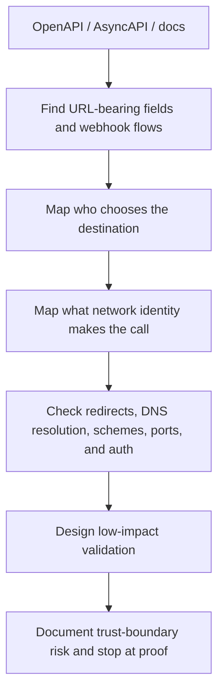
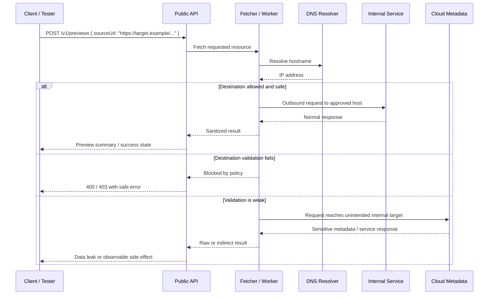
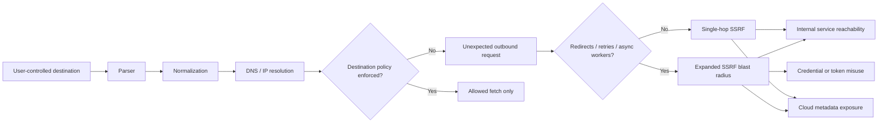

# Server Side Request Forgery

> **OWASP API7:2023** — server side request forgery (SSRF) in APIs happens when an endpoint, worker, or integration fetches a user-influenced URL or URI without strictly controlling where that request can go.

---

## 🧠 What Is It? (Beginner Explanation)

Imagine an office where visitors are not allowed into the server room, but they *are* allowed to hand a note to a trusted employee and say, “Please go get this for me.”

If the employee checks the destination carefully, that can be safe.  
If the employee just walks wherever the note says, the visitor can abuse the employee’s access.

That is SSRF.

In API environments, the “trusted employee” is often:

- a file import service
- a webhook tester
- an avatar or image fetcher
- a URL preview feature
- a PDF/screenshot renderer
- a connector that calls another API
- a background job that follows a callback URL later

The dangerous part is not just **“the user supplied a URL.”**  
The dangerous part is:

> **the API is acting as a network-capable deputy with more trust, reach, or identity than the caller should have.**

### Memory hook

> **SSRF is a trust-boundary bug disguised as a convenience feature.**

### Why APIs are especially exposed

Modern APIs are built to call other systems all the time:

- microservices call internal APIs
- SaaS products test customer webhook URLs
- import/export jobs pull remote files
- identity workflows fetch OIDC metadata or logos
- dashboards preview links and attachments
- AI/automation pipelines retrieve remote content for processing

That means API teams frequently normalize the idea that **outbound requests are part of normal business logic**. Once that becomes normal, unsafe destination handling becomes easy to miss.

---

## 🎯 Why This Matters in API Security

OWASP API Security Top 10 2023 lists SSRF as **API7** because modern APIs commonly expose exactly the patterns SSRF needs:

- **webhooks**
- **file fetching from URLs**
- **custom SSO / identity metadata**
- **URL previews**
- **integration testing endpoints**
- **callback registration**
- **service-to-service fetches based on user-controlled data**

APIs also make SSRF more dangerous because the systems behind them often have access to:

- internal admin panels
- service discovery endpoints
- cloud instance metadata services
- Kubernetes or container control-plane services
- partner or internal APIs that are not internet-exposed
- high-privilege machine credentials

### SSRF vs related API problems

| Issue | Main question | What makes it different? |
|---|---|---|
| **SSRF** | Can the API be tricked into making a request to the wrong destination? | Focuses on outbound request control and network trust boundaries |
| **Unsafe Consumption of APIs** | Does the application trust upstream APIs too much? | Broader category; SSRF is often one failure mode inside it |
| **Security Misconfiguration** | Are defaults, routing, headers, or deployment controls weak? | Misconfiguration often makes SSRF impact worse |
| **Broken Authentication / Authorization** | Are identities and permissions enforced correctly? | SSRF may bypass these indirectly by reaching trusted internal services |
| **Open Redirect** | Can a user be sent to another destination? | Redirects move the client; SSRF tricks the server into moving |

### The “confused deputy” mental model

CWE-918 maps SSRF to a form of **externally controlled resource access** and a **confused deputy** pattern.

The client cannot directly reach the protected destination, so it abuses a more trusted component that can.

---

## 🔍 Start With The API Spec

A good API spec is one of the fastest ways to find SSRF-prone functionality safely.

The OpenAPI Specification describes an HTTP API so humans and tools can understand its capabilities **without source code or packet inspection**. For SSRF review, that matters because the spec often reveals:

- URL-bearing request fields
- callback and webhook definitions
- integration testing operations
- file import and remote fetch features
- external documentation and example hosts
- auth schemes used by internal or partner connectors

### Minimal OpenAPI example

```yaml
openapi: 3.1.0
info:
  title: Partner Integration API
  version: "1.0"
servers:
  - url: https://api.example.test
paths:
  /v1/previews:
    post:
      summary: Fetch a page preview
      requestBody:
        required: true
        content:
          application/json:
            schema:
              type: object
              required: [sourceUrl]
              additionalProperties: false
              properties:
                sourceUrl:
                  type: string
                  format: uri
  /v1/webhooks/test:
    post:
      summary: Send a test event to a customer webhook
      requestBody:
        required: true
        content:
          application/json:
            schema:
              type: object
              required: [targetUrl]
              properties:
                targetUrl:
                  type: string
                  format: uri
webhooks:
  orderCreated:
    post:
      requestBody:
        content:
          application/json:
            schema:
              type: object
              properties:
                callbackUrl:
                  type: string
                  format: uri
```

### API-spec clues that deserve immediate SSRF review

| Spec clue | Why it matters | Defensive question |
|---|---|---|
| `format: uri` / `format: url` | Strong signal that a client can influence a destination | Is the destination truly user-selectable, or should it be brokered/allowlisted? |
| Fields named `url`, `uri`, `callback`, `webhook`, `endpoint`, `redirect`, `logoUrl`, `avatarUrl` | Common SSRF entry points | What exact hosts, schemes, and ports are supposed to be legal? |
| `callbacks` / `webhooks` | Outbound traffic is a designed feature | Are callback targets validated, signed, and isolated? |
| `servers` entries for internal, partner, or staging hosts | Can expose hidden trust boundaries | Could runtime traffic pivot into environments that should not be reachable? |
| Examples containing internal-looking domains or metadata paths | Sometimes reveal dangerous assumptions | Are examples sanitized, and do they hint at internal-only integrations? |
| “test connection”, “validate endpoint”, “import from URL”, “preview” operations | High-signal functionality for SSRF | Does the API return raw upstream responses or only normalized status? |
| Multiple auth schemes for connector endpoints | May indicate privileged service fetches | Are outbound requests made with machine credentials the user should never influence? |

### Spec-first review workflow



### Useful rule

> **Treat the API spec as a trust-boundary map, not just as endpoint documentation.**

---

## 🏗️ How It Works (Technical Deep Dive)

SSRF typically appears when an API takes a destination from one trust zone and lets a more privileged component act on it.

That destination might come from:

- a query parameter
- a JSON body field
- a GraphQL mutation variable
- a multipart import setting
- a stored webhook configuration
- a background job payload
- a message queue event

### End-to-end SSRF flow



### The five gates every outbound API fetch should pass

1. **Parse** — use a real URL parser, not string slicing.  
2. **Normalize** — canonicalize the scheme, host, and port before comparison.  
3. **Resolve** — understand where the hostname actually points.  
4. **Authorize** — compare against allowlists and deny private, loopback, link-local, and unexpected destinations.  
5. **Fetch safely** — disable redirects unless truly needed, cap size/time, strip sensitive response details.

If an implementation skips any gate, SSRF risk rises quickly.

### A deliberately vulnerable API example

```python
# ❌ Vulnerable: user controls the outbound destination directly.
from flask import Flask, request, jsonify
import requests

app = Flask(__name__)

@app.post('/v1/previews')
def preview():
    source_url = request.json['sourceUrl']
    r = requests.get(source_url, timeout=10, allow_redirects=True)
    return jsonify({
        'status': r.status_code,
        'body': r.text[:5000]
    })
```

What is wrong here?

- no scheme restriction
- no host allowlist
- no IP-class checks after DNS resolution
- redirects are followed automatically
- the raw upstream response is exposed back to the client
- the API server’s network identity is used on behalf of user input

### API-specific SSRF patterns

| Pattern | How it appears in APIs | Why it is risky |
|---|---|---|
| **Direct SSRF** | Response comes back to the caller | Easy to confirm and may leak sensitive data immediately |
| **Blind SSRF** | API only shows success/failure, but still makes outbound calls | Safer-looking UI can hide real impact |
| **Second-order SSRF** | URL is stored first and fetched later by a worker/retry pipeline | Harder to detect, often missed in manual review |
| **Credentialed SSRF** | Outbound call includes service auth, mTLS identity, or internal headers | Impact can exceed “simple fetch” and become privileged lateral access |
| **Parser-differential SSRF** | Validation library and HTTP client parse the same URL differently | Filters may approve a destination the fetcher reaches differently |

---

## 📊 Mental Model — SSRF Is Usually a Chain, Not a Single Bug



### Important idea

A lot of SSRF findings are not just “there is a `url` parameter.”

They are a **chain of small design decisions**:

- user can influence destination
- parser is inconsistent
- redirects are enabled
- fetcher runs on a privileged subnet
- response is returned directly
- egress rules are too broad
- metadata service is reachable

Break any one of those links and the vulnerability becomes much less severe.

---

## ⚙️ Technical Details

### API features that commonly become SSRF sinks

| API feature | Typical endpoint shape | Why it exists | SSRF concern |
|---|---|---|---|
| Link preview / rich card | `POST /preview` | Render metadata for a URL | User controls fetch destination |
| Import-by-URL | `POST /imports` | Pull CSV/JSON/images from remote source | File/content fetch becomes network pivot |
| Webhook registration or “test delivery” | `POST /webhooks` | Validate a callback target | API may contact arbitrary URLs during setup |
| Avatar/logo fetch | `POST /profile/photo-from-url` | Improve UX | “Harmless” media fetchers still reach internal hosts |
| PDF / screenshot generation | `POST /render` | Produce documents or previews | HTML or asset loading can trigger server-side requests |
| Connector setup | `POST /integrations/test` | Verify SaaS or partner endpoint | Often runs with stored machine credentials |
| OIDC / SSO bootstrap | `POST /identity/providers` | Pull discovery metadata or keys | Bad validation can trust attacker-chosen identity endpoints |
| Async callbacks / webhooks | background worker or event handler | Deliver events later | Second-order SSRF, retries, and blind fetches are easy to miss |

### Destinations defenders should think about first

| Destination class | Examples | Why impact is high |
|---|---|---|
| **Loopback / self** | `127.0.0.1`, `localhost`, `::1` | May expose admin interfaces or alternate ports |
| **RFC1918 internal ranges** | `10.0.0.0/8`, `172.16.0.0/12`, `192.168.0.0/16` | Can reach internal APIs and weakly protected services |
| **Link-local** | `169.254.0.0/16` | Includes cloud metadata services |
| **Cluster / service-mesh names** | `*.svc.cluster.local`, internal DNS names | Can reach east-west service paths users should never touch |
| **Management APIs** | Kubernetes, Consul, Elasticsearch, admin dashboards | Often trusted because of network position |
| **Unexpected external hosts** | attacker-controlled or unapproved SaaS | Can leak tokens, headers, or internal data |

### Cloud metadata services worth understanding defensively

| Platform | Typical endpoint | Important defensive detail | Why it still matters |
|---|---|---|---|
| **AWS EC2 IMDS** | `http://169.254.169.254/latest/...` | IMDSv2 requires a token obtained via `PUT`; AWS recommends IMDSv2 for defense in depth against SSRF | Legacy IMDSv1 or permissive hops can still increase impact |
| **Azure IMDS** | `http://169.254.169.254/metadata/...` | Requests require the `Metadata: true` header and should bypass proxies | If the application can set required headers, SSRF risk remains relevant |
| **GCP metadata** | `http://metadata.google.internal/computeMetadata/v1` or `169.254.169.254` | Requests require `Metadata-Flavor: Google` | Header-controlled SSRF paths and internal fetchers still deserve review |

### URL handling mistakes that often break defenses

| Mistake | Why it fails | Better approach |
|---|---|---|
| Blocklisting `localhost` only | Misses alternate forms, internal DNS, or post-redirect destinations | Canonicalize and allowlist approved destinations |
| Validating strings instead of parsed URLs | User info, ports, fragments, and encodings create parsing gaps | Parse first, compare canonical components |
| Approving hostnames but not re-checking resolved IPs | DNS can point to private or changing addresses | Resolve and enforce IP policy before connecting |
| Following redirects automatically | First URL may look safe; second hop may not | Disable redirects or re-validate every hop |
| Trusting “internal” sources more than users | Internal APIs can be compromised or misrouted too | Re-validate every trust boundary |
| Returning raw upstream responses | Converts SSRF into immediate data exfiltration | Return only normalized status/metadata |
| Ignoring async workers | Stored URLs may be fetched later outside the main request path | Review queues, schedulers, retry jobs, and webhook daemons |

### SSRF and redirects

MDN’s HTTP redirection guidance is useful here because SSRF filters often validate the **first** destination but forget that `30x` responses can move the server to a **second** destination.

That is why strong defenses usually do one of the following:

- disable redirects entirely for user-influenced fetches
- or re-run full destination policy checks on every redirect hop

---

## 🔴 Attack Surface

### High-signal clues in API traffic or code review

| Clue | Why it matters |
|---|---|
| Request fields named `url`, `uri`, `target`, `endpoint`, `webhook`, `callback`, `source`, `logoUrl`, `avatarUrl` | Common user-influenced destination fields |
| Features that say “test connection”, “send test event”, “preview”, “validate link”, “fetch metadata” | Often perform immediate outbound requests |
| Background workers consuming URL-bearing jobs | Indicates second-order SSRF risk |
| HTTP clients configured with `follow_redirects=true` / `allow_redirects=True` | Expands destination control problems |
| Code that logs full upstream bodies to clients | Raises direct data leakage risk |
| Fetchers running on app nodes with broad egress | Turns convenience features into network pivots |
| mTLS or service tokens attached to outbound requests | Can create privileged SSRF |

### API-spec review checklist for SSRF

- [ ] Search the spec for URL-bearing fields and connector-style operations.
- [ ] Review `callbacks` and `webhooks`, not just `paths`.
- [ ] Compare `servers` and examples against real deployment boundaries.
- [ ] Identify which component actually makes the outbound request.
- [ ] Determine whether redirects are followed and whether every hop is revalidated.
- [ ] Determine whether the fetcher runs with machine credentials or internal network access.
- [ ] Check whether the response is returned raw, summarized, or hidden behind async processing.
- [ ] Review egress controls for app nodes, workers, renderers, and integration services.

---

## 💥 Safe Validation (Authorized, Low-Impact)

This section is intentionally focused on **defensive, authorized validation**.  
The goal is to prove that an API can reach a destination it should not or that a control is missing — **not** to pivot further or extract sensitive data.

### Preconditions

Only proceed when all of the following are true:

- you are testing an approved environment
- the rules of engagement allow outbound-request validation
- you have a benign canary endpoint or controlled lab target
- you know which team owns the feature and can review logs if needed

### Step 1 — Read the API contract first

If the target provides an OpenAPI document, extract the operations and fields most likely to influence outbound requests.

```bash
# Find operations and URL-like field names in a local OpenAPI JSON file
jq -r '
  .paths
  | to_entries[]
  | .key as $path
  | .value
  | to_entries[]
  | .key as $method
  | .value as $op
  | (
      [$op.parameters[]?.name],
      [$op.requestBody.content[]?.schema.properties? | keys[]?]
    )
  | flatten
  | map(select(test("url|uri|callback|webhook|endpoint|target"; "i")))
  | unique
  | select(length > 0)
  | "\($method|ascii_upcase) \($path) -> " + (join(", "))
' openapi.json
```

What you want from this step is a **review queue**, not an exploit list.

### Step 2 — Use a harmless canary destination

A safe pattern is to point the API at an approved canary endpoint you control and only verify whether the outbound request occurs.

```http
POST /v1/webhooks/test HTTP/1.1
Host: api.example.test
Authorization: Bearer <TEST_TOKEN>
Content-Type: application/json

{
  "targetUrl": "https://ssrf-canary.example/trace/ssrf-check-001"
}
```

Safe evidence usually includes one of the following:

- the canary service receives exactly one request
- the platform team sees one expected outbound connection in logs
- the API returns a sanitized “delivery attempted” status

If the proof is sufficient, stop there.

### Step 3 — Compare allowlisted vs blocked behavior

Use benign test cases to verify that policy enforcement exists and is consistent.

| Test idea | Safe expected result |
|---|---|
| Approved HTTPS destination on the allowlist | Request succeeds with a normalized result |
| Unsupported scheme such as `ftp:` when the feature should only use HTTPS | API rejects input before any outbound request |
| Destination not on the allowlist | API rejects with safe error and no outbound traffic |
| Redirecting canary endpoint | API does not follow the redirect, or re-validates and blocks the next hop |
| Async webhook registration using a canary URL | Worker behavior is logged and controlled, not silent or invisible |

### Step 4 — Confirm whether the response is overly exposed

A common SSRF severity jump happens when the API returns the full upstream response body.

Safer behavior looks like this:

- `reachable: true`
- `status: delivered`
- `contentType: image/png`
- `previewTitle: "Example"`

Riskier behavior looks like this:

- full upstream HTML
- raw JSON from the fetched service
- detailed connection errors with internal hostnames
- header reflection or token leakage

### Step 5 — Document proof and stop at trust-boundary evidence

For most authorized engagements, the finding is already solid when you can show one or more of these:

- the API made an outbound request to a user-chosen destination
- destination controls were missing or incomplete
- redirects expanded the reachable destination set
- a background worker fetched a stored URL unexpectedly
- the API returned raw upstream content or detailed internal errors

There is usually **no need** to turn proof of reachability into aggressive lateral testing.

---

## 🛠️ Tools & Commands

| Tool | Purpose | Example use |
|---|---|---|
| `jq` / `yq` | Parse OpenAPI or JSON/YAML specs | Extract URL-bearing parameters and callback definitions |
| Burp Suite Repeater | Replay safe requests to approved endpoints | Validate whether a feature performs outbound fetches |
| Burp Collaborator / interactsh | Out-of-band visibility for blind SSRF in approved tests | Confirm whether an outbound request occurred without touching sensitive targets |
| `curl` | Send controlled test requests to the API | Exercise preview, import, or webhook test endpoints |
| Source review (`rg`, Semgrep, code search) | Find risky fetch implementations | Search for `requests.get`, `axios.get`, `fetch`, webhook delivery code |
| Egress / proxy logs | Confirm destination, timing, and deny decisions | Verify whether requests reached the canary or were blocked |

### Safe source-review commands

```bash
# Find common outbound HTTP client usage in a codebase
rg -n "requests\.(get|post)|axios\.(get|post)|fetch\(|httpx\.|urllib\.request|curl_exec|HttpClient" .

# Find URL-bearing fields in API schemas or examples
rg -n 'url|uri|callback|webhook|endpoint|target' openapi*.{json,yaml,yml} docs/ schemas/
```

### Safe OpenAPI extraction examples

```bash
# List paths that expose callbacks or webhooks in a JSON OpenAPI file
jq -r '
  [
    (.webhooks // {} | keys[]? | "WEBHOOK " + .),
    (.paths | to_entries[] | select(.value | tostring | test("callback|webhook"; "i")) | .key)
  ]
  | flatten
  | .[]
' openapi.json
```

```bash
# Show declared security schemes to understand which component may make privileged outbound calls
jq '.components.securitySchemes // {}' openapi.json
```

---

## 🔍 Detection

Detection works best when defenders treat outbound requests as a first-class security signal.

### What good observability looks like

| Signal | Why it helps |
|---|---|
| Destination host and resolved IP logged by the fetcher | Shows where the API actually connected |
| Redirect chain logging | Helps catch policy bypass across hops |
| Egress firewall or proxy deny logs | High-signal source for blocked SSRF attempts |
| DNS telemetry for unusual lookups from API workloads | Useful for blind SSRF confirmation and anomaly detection |
| Metadata service access alerts | Important for cloud workloads |
| Per-feature outbound identity and headers | Helps understand when machine credentials were attached |
| Queue / worker audit logs | Critical for second-order SSRF |

### Detection patterns that matter most

| Pattern | Why defenders care |
|---|---|
| API nodes making requests to `169.254.169.254` or metadata hostnames | Strong signal of cloud-focused SSRF probing or misconfiguration |
| Requests from public-facing APIs to RFC1918 or cluster-local addresses | Suggests internal pivot attempts |
| Repeated failed fetches with unusual schemes or ports | May indicate SSRF validation activity or policy gaps |
| Preview/import/webhook endpoints followed by unexpected outbound DNS | Good correlation for blind SSRF |
| Sudden outbound traffic from renderers, PDF workers, or image processors | These components are often overlooked SSRF paths |

### Example log signals

```text
component=fetch-broker request_id=8f2f requested_url=https://ssrf-canary.example/trace/001 resolved_ip=203.0.113.25 policy=allow status=200
component=fetch-broker request_id=8f30 requested_url=http://169.254.169.254/latest/meta-data/ resolved_ip=169.254.169.254 policy=deny reason=link_local_address
component=webhook-worker job_id=wh_731 redirect_from=https://customer.example/hook redirect_to=http://10.0.4.23/admin policy=deny reason=redirect_target_not_allowlisted
```

### Practical defensive analytics questions

- Which API operations can trigger outbound requests at all?
- Which workloads are allowed to resolve external DNS?
- Which workloads can reach internal-only address space?
- Which features follow redirects?
- Which features return raw upstream content?
- Which async workers fetch stored URLs later?

If you cannot answer those questions, SSRF detection will be fragile.

---

## 🛡️ Mitigation & Defense

### Design principle: do not let business features become general-purpose fetchers

The strongest SSRF mitigation is often **architectural**, not just regex-based.

Prefer this pattern:

1. the public API accepts only a constrained business input  
2. a dedicated fetch broker performs outbound requests  
3. the broker uses an allowlist of destinations, schemes, and media types  
4. the broker runs with restricted egress and no high-value cloud/admin reachability  
5. the API returns only normalized results, never raw internal responses

### Safer Python example

```python
from urllib.parse import urlparse
import ipaddress
import socket
import requests

ALLOWED_HOSTS = {"media.partner.example", "cdn.example"}
ALLOWED_SCHEMES = {"https"}
ALLOWED_PORTS = {443}
MAX_BYTES = 1_000_000


def _is_disallowed_ip(ip_text: str) -> bool:
    ip = ipaddress.ip_address(ip_text)
    return any([
        ip.is_private,
        ip.is_loopback,
        ip.is_link_local,
        ip.is_multicast,
        ip.is_reserved,
        ip.is_unspecified,
    ])


def safe_fetch(user_url: str) -> dict:
    parsed = urlparse(user_url)

    if parsed.scheme not in ALLOWED_SCHEMES:
        raise ValueError("unsupported scheme")

    if parsed.username or parsed.password:
        raise ValueError("userinfo not allowed")

    port = parsed.port or 443
    if port not in ALLOWED_PORTS:
        raise ValueError("unsupported port")

    host = parsed.hostname
    if host not in ALLOWED_HOSTS:
        raise ValueError("host not allowlisted")

    resolved_ips = {
        item[4][0]
        for item in socket.getaddrinfo(host, port, type=socket.SOCK_STREAM)
    }

    if any(_is_disallowed_ip(ip) for ip in resolved_ips):
        raise ValueError("resolved to disallowed address")

    response = requests.get(
        user_url,
        timeout=(2, 5),
        allow_redirects=False,
        stream=True,
        headers={"User-Agent": "fetch-broker/1.0"},
    )

    content_type = response.headers.get("Content-Type", "")
    if not content_type.startswith(("image/", "application/json")):
        raise ValueError("unexpected content type")

    body = response.raw.read(MAX_BYTES + 1, decode_content=True)
    if len(body) > MAX_BYTES:
        raise ValueError("response too large")

    return {
        "status": response.status_code,
        "content_type": content_type,
        "size": len(body),
    }
```

### Defense-in-depth layers

| Layer | Control | Why it matters |
|---|---|---|
| **Application** | Strict allowlists for schemes, hosts, ports, content types | Stops most unsafe destinations early |
| **Parser discipline** | Parse then canonicalize, reject userinfo/fragments/ambiguous formats | Reduces parser differential bypasses |
| **DNS / IP enforcement** | Resolve and block private, loopback, link-local, reserved targets | Prevents hostname-based pivots |
| **Redirect handling** | Disable redirects or re-validate every hop | Stops second-hop escape |
| **Network egress** | Restrict workloads to approved outbound destinations only | Shrinks blast radius even if app logic fails |
| **Privilege design** | Keep fetchers off high-privilege subnets and identities | Limits impact of mistakes |
| **Response handling** | Never return raw upstream bodies to callers | Turns severe leaks into controlled failures |
| **Observability** | Log requested URL, resolved IP, policy outcome, and request ID | Makes detection and incident response possible |
| **Cloud hardening** | Enforce IMDSv2 where applicable and limit metadata reachability | Reduces cloud-specific impact |

### Using the API spec as a security control input

The spec should help you enforce SSRF defenses, not just describe the feature.

| Spec element | Defensive use |
|---|---|
| `servers` | Build an approved destination inventory for connectors and integrations |
| `securitySchemes` | Identify which outbound fetches may carry machine identity |
| `format: uri` | Mark fields that require strict destination controls |
| `enum` / constrained schemas | Restrict business inputs so arbitrary destinations are not needed |
| `webhooks` / `callbacks` | Force callback signing, validation, and egress isolation review |
| `examples` | Sanitize sample hosts and avoid teaching unsafe destinations |

### Checklist

- [ ] Remove arbitrary destination control where the business feature does not need it.
- [ ] Prefer identifiers or pre-registered integrations over free-form URLs.
- [ ] Allowlist schemes, hosts, ports, and media types.
- [ ] Use a well-tested URL parser and validate canonicalized values.
- [ ] Resolve hostnames and block private, loopback, link-local, and reserved addresses.
- [ ] Disable redirects, or re-validate every redirect hop.
- [ ] Do not return raw upstream responses to API clients.
- [ ] Isolate fetchers on low-privilege workloads with restricted egress.
- [ ] Log outbound request intent, destination, and policy result.
- [ ] Review async workers, retries, and callback processors for second-order SSRF.
- [ ] Harden cloud metadata exposure, including IMDSv2 where applicable.
- [ ] Re-run SSRF review whenever new webhook, preview, import, or connector features are added.

---

## 📚 References

- [OWASP API Security Top 10 2023 — API7: Server Side Request Forgery](https://owasp.org/API-Security/editions/2023/en/0xa7-server-side-request-forgery/)
- [OWASP Server-Side Request Forgery Prevention Cheat Sheet](https://cheatsheetseries.owasp.org/cheatsheets/Server_Side_Request_Forgery_Prevention_Cheat_Sheet.html)
- [OWASP — Server Side Request Forgery](https://owasp.org/www-community/attacks/Server_Side_Request_Forgery)
- [PortSwigger Web Security Academy — SSRF](https://portswigger.net/web-security/ssrf)
- [CWE-918 — Server-Side Request Forgery (SSRF)](https://cwe.mitre.org/data/definitions/918.html)
- [Swagger / OpenAPI Specification Overview](https://swagger.io/specification/)
- [AWS EC2 Instance Metadata Service — IMDSv2](https://docs.aws.amazon.com/AWSEC2/latest/UserGuide/configuring-instance-metadata-service.html)
- [Azure Instance Metadata Service](https://learn.microsoft.com/en-us/azure/virtual-machines/instance-metadata-service)
- [Google Cloud — Querying VM Metadata](https://cloud.google.com/compute/docs/metadata/querying-metadata)
- [MDN — HTTP Redirections](https://developer.mozilla.org/en-US/docs/Web/HTTP/Redirections)
