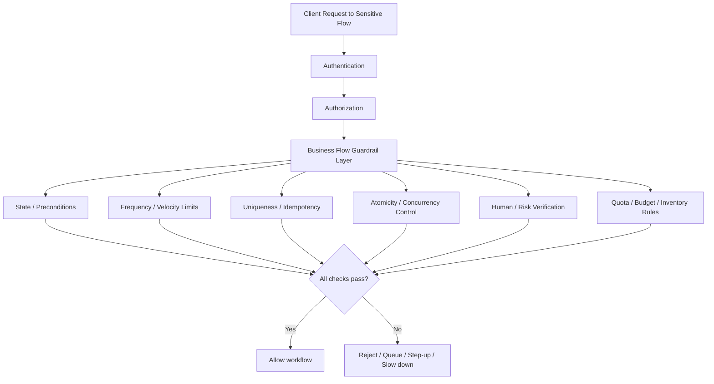
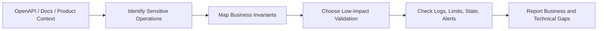

# Unrestricted Access to Sensitive Business Flows

> **Module:** API Pentesting → Core API Vulnerabilities  
> **Difficulty:** Intermediate → Advanced  
> **Tags:** `#owasp-api6` `#business-logic` `#anti-automation` `#workflow-security` `#openapi`
>
> **Unrestricted Access to Sensitive Business Flows** is not mainly about broken login or missing object authorization. It is what happens when a legitimate API feature can be used **too cheaply, too quickly, too often, in the wrong order, or at the wrong scale** for the business to safely absorb.

> **Authorization required:** even “lightweight” testing of business flows can affect stock, credits, notifications, fraud systems, queues, and customer experience. Perform validation only in approved environments, with explicit rules of engagement, synthetic data where possible, and tightly controlled rate/concurrency limits.

---

## Table of Contents

1. [🧠 What Is It? (Beginner Explanation)](#-what-is-it-beginner-explanation)
2. [Why It Matters in API Security](#why-it-matters-in-api-security)
3. [Mental Model — A Sensitive Flow Needs More Than Auth](#mental-model--a-sensitive-flow-needs-more-than-auth)
4. [How API6 Differs from Other API Risks](#how-api6-differs-from-other-api-risks)
5. [What Counts as a “Sensitive Business Flow”](#what-counts-as-a-sensitive-business-flow)
6. [Using the API Spec to Find Candidate Flows](#using-the-api-spec-to-find-candidate-flows)
7. [High-Signal Clues Inside an OpenAPI Description](#high-signal-clues-inside-an-openapi-description)
8. [Root Causes](#root-causes)
9. [Practical Authorized Review Workflow](#practical-authorized-review-workflow)
10. [Safe Validation Patterns](#safe-validation-patterns)
11. [Defensive Architecture Patterns](#defensive-architecture-patterns)
12. [Example Secure Design Pattern](#example-secure-design-pattern)
13. [Detection and Monitoring](#detection-and-monitoring)
14. [Reporting Guidance](#reporting-guidance)
15. [Checklist](#checklist)
16. [References and Public Research](#references-and-public-research)

---

## 🧠 What Is It? (Beginner Explanation)

Imagine a ticketing API that correctly requires login, correctly identifies each user, and correctly returns only that user’s own orders.

That still does **not** mean the ticket-buying flow is secure.

If one user can:

- reserve hundreds of seats faster than normal customers,
- create thousands of accounts to farm referral credits,
- request endless OTPs or signup emails,
- redeem a one-time promotion repeatedly,
- or submit the same purchase flow many times before inventory updates,

then the API may be suffering from **OWASP API6:2023 — Unrestricted Access to Sensitive Business Flows**.

A good sentence to remember is:

> **API6 happens when the API protects the user identity, but fails to protect the business rule.**

### Simple Analogy

A nightclub may check that you have a real ticket at the door.

But if the club also lets you:

- enter the queue 500 times,
- hold 50 tables without paying,
- claim the welcome drink coupon again and again,
- or bring a bot army to grab every reservation slot,

then the identity check was only one layer. The **business guardrails** were missing.

---

## Why It Matters in API Security

OWASP API Security Top 10 (2023) describes API6 as exposure of a business flow without compensating for the harm caused when that flow is used excessively in an automated manner. That framing matters because API6 often appears in systems that are otherwise “secure-looking” from a traditional auth perspective.

PortSwigger’s business-logic guidance makes a similar point from another angle: logic flaws come from unsafe assumptions about how users will behave. MITRE CWE-841 adds the workflow perspective: systems often fail when users can perform steps in the wrong sequence, skip steps, or repeat steps that were intended to be unique.

So API6 sits at the intersection of:

- **business logic**
- **workflow enforcement**
- **rate/velocity control**
- **anti-automation**
- **state consistency**
- **fraud resistance**

### Why defenders care

The primary impact is often **business harm before technical compromise**:

| Harm type | Example outcome |
|---|---|
| **Inventory denial** | Legitimate customers cannot book seats, buy products, or claim scarce resources |
| **Fraud / economic abuse** | Referral farming, coupon replay, balance inflation, unfair refunds |
| **Platform abuse** | Spam comments, fake accounts, automated reviews, queue manipulation |
| **Operational cost** | SMS/OTP spend, email spend, payment retries, manual fraud review load |
| **Trust damage** | Customers perceive unfairness, scarcity manipulation, or brand abuse |

That is why API6 can be severe even when there is no classic “data breach” headline.

---

## Mental Model — A Sensitive Flow Needs More Than Auth

A beginner often asks:

> “Can the user access the endpoint?”

An experienced API reviewer asks:

> “Can the user access this workflow under the right identity, state, sequence, frequency, uniqueness, and economic constraints?”



### The control stack to remember

```text
Sensitive flow security =
identity
+ authorization
+ state validation
+ sequence enforcement
+ uniqueness
+ concurrency safety
+ rate / quota controls
+ abuse detection
```

If any one of those is missing for a high-value workflow, the system may still “work” functionally while remaining vulnerable strategically.

---

## How API6 Differs from Other API Risks

API6 is often confused with neighboring categories. Separate them carefully.

| Category | Core question | Typical failure | Example |
|---|---|---|---|
| **API1 BOLA** | Can I access someone else’s object? | Missing object ownership checks | Viewing another user’s invoice |
| **API5 BFLA** | Can I access a function my role should not have? | Missing function-level authorization | Regular user reaches admin endpoint |
| **API4 Resource Consumption** | Can I exhaust technical resources? | Missing limits on request size, CPU, memory, bandwidth | Huge file upload or expensive query DoS |
| **API6 Sensitive Business Flows** | Can I abuse a valid business workflow at unfair scale or sequence? | Missing business guardrails, anti-automation, quotas, state controls | Buying scarce inventory faster than humans or farming referral credit |

### The shortcut

- **API1/API5** are mainly about **who may do something**.
- **API4** is mainly about **technical resource exhaustion**.
- **API6** is mainly about **how a valid action can be abused against the business model**.

Real systems can have overlap. For example:

- a coupon redemption flow might be **API6** if it lacks uniqueness or rate limits,
- **API5** if only certain customers should access it,
- and **API4** if abuse also drives major downstream SMS or payment costs.

---

## What Counts as a “Sensitive Business Flow”

A flow is “sensitive” when excessive or abnormal use can materially harm the business, users, or platform fairness.

### Common high-risk flow archetypes

| Flow type | Why it is sensitive | Common abuse outcome |
|---|---|---|
| **Purchase / checkout / reservation** | Limited goods, seats, slots, or discounts | Scalping, stock hoarding, denial of inventory |
| **Signup / trial / referral** | Creates accounts, credits, incentives, or access tiers | Fake account farms, promo abuse, referral inflation |
| **Password reset / OTP / verification** | Triggers cost-bearing or trust-bearing messages | Email/SMS flooding, reset abuse, helpdesk load |
| **Coupon / voucher / gift card / loyalty** | Converts codes into monetary value | Replay, guessing, duplicate redemption |
| **Posting / commenting / reviewing** | Changes public or private content | Spam, moderation bypass, platform pollution |
| **Withdrawal / payout / refund / transfer** | Moves money or equivalent value | Fraud, duplicate payout attempts, race conditions |
| **Invite / share / claim** | Grants access, credits, or privileged onboarding paths | Invite farming, one-time-link reuse |
| **Booking / queue / waitlist** | Controls scarce time or service access | Queue jumping, slot hoarding, availability denial |

### Beginner → advanced way to think about it

- **Beginner view:** “This endpoint creates a booking.”
- **Intermediate view:** “This endpoint creates a booking for a scarce resource.”
- **Advanced view:** “This endpoint changes inventory state, affects fairness, exposes automation value, and therefore needs rate, quota, sequence, and transactional controls.”

---

## Using the API Spec to Find Candidate Flows

When an API has an OpenAPI/Swagger description, use it as a **workflow map**.

This is the “API spec” angle that matters most for API6: you are not just reading routes, you are identifying which operations represent **economically or operationally sensitive business actions**.

### What to inspect first in the spec

| Spec area | Why it matters for API6 |
|---|---|
| **`paths` + methods** | Shows which actions create, modify, redeem, reserve, submit, or trigger workflows |
| **`tags`** | Often groups flows into `checkout`, `billing`, `booking`, `promo`, `messaging`, `referrals`, `admin` |
| **`operationId`** | Frequently exposes business intent more clearly than the path name |
| **`requestBody` / schema fields** | Reveals value-bearing fields like `couponCode`, `quantity`, `referralCode`, `seatId`, `otp`, `amount` |
| **`responses`** | Presence of `409`, `429`, or workflow-specific errors hints at concurrency and abuse handling |
| **`security`** | Tells you whether the operation only has authentication or also hints at stronger controls |
| **Headers / parameters** | Can expose idempotency keys, verification tokens, step-up inputs, or tenant scoping |
| **Descriptions / examples** | Often reveal business rules, one-time semantics, or limits the backend should enforce |
| **Callbacks / webhooks** | May indicate async approval, fulfillment, or hold-release workflows |

### Example OpenAPI clue

```yaml
paths:
  /v1/tickets/{eventId}/purchase:
    post:
      tags: [tickets, checkout]
      operationId: purchaseTicket
      security:
        - bearerAuth: []
      parameters:
        - in: header
          name: Idempotency-Key
          schema:
            type: string
      requestBody:
        required: true
        content:
          application/json:
            schema:
              type: object
              properties:
                quantity:
                  type: integer
                promoCode:
                  type: string
      responses:
        '201':
          description: Purchase created
        '409':
          description: Inventory conflict
        '429':
          description: Too many attempts
```

This snippet does **not** prove the system is secure. But it gives you a better review plan:

- Does the server really enforce idempotency?
- Is `quantity` bounded server-side?
- Is promo redemption unique?
- Is the inventory update atomic?
- Is the `429` behavior real, per-user, and resilient to automation?

### Safe local spec analysis examples

Use a **local copy of an approved spec** whenever possible.

```bash
# List write-oriented operations from a local OpenAPI JSON file
jq -r '
  .paths | to_entries[] as $p
  | $p.value | to_entries[]
  | select(.key|IN("post","put","patch","delete"))
  | "\(.key|ascii_upcase)\t\($p.key)\t\(.value.operationId // "-")\t\((.value.tags // []) | join(","))"
' openapi.json
```

```bash
# Pull business-flow keywords from the local spec for triage
jq -r '.. | strings' openapi.json \
  | grep -Ei 'purchase|checkout|reserve|redeem|invite|comment|review|verify|otp|refund|withdraw|signup|trial|referral'
```

```bash
# Flag mutating operations that do not even document 429 handling
jq -r '
  .paths | to_entries[] as $p
  | $p.value | to_entries[]
  | select(.key|IN("post","put","patch"))
  | select(((.value.responses // {}) | has("429")) | not)
  | "\(.key|ascii_upcase) \($p.key) lacks documented 429 response"
' openapi.json
```

Absence of a documented control is **not proof of absence in implementation**. But it is an excellent prioritization signal.

---

## High-Signal Clues Inside an OpenAPI Description

Think of the spec as a hint engine.

| Spec clue | What it may mean | Review question |
|---|---|---|
| `operationId: redeemCoupon` | Monetary or discount-bearing action | Is redemption unique, limited, and auditable? |
| `operationId: createReservation` | Scarce inventory or scheduling flow | Are holds time-bound and quantity-limited? |
| `operationId: sendOtp` or `requestVerification` | Cost-bearing and trust-bearing message flow | Are resend budgets, cooldowns, and abuse controls enforced? |
| `tags: [referrals, rewards]` | Incentive-bearing flow | Can one user inflate reward value through automation? |
| `quantity`, `amount`, `credits`, `discount` fields | Direct economic influence | Are bounds and invariants enforced server-side? |
| `Idempotency-Key` header documented | Team knows replay matters | Is the key mandatory and actually enforced? |
| `409 Conflict` documented | Team anticipates concurrent state changes | Does the backend truly reject duplicates and races? |
| `429 Too Many Requests` documented | Some throttling exists | Is it tied to the right identity dimensions: user, device, tenant, IP, account age? |
| Multiple async callbacks/webhooks | Multi-step workflow exists | Can intermediate states be skipped, replayed, or forced? |
| Only basic authn shown, no other controls | Identity may be checked, but workflow still weak | What business protections exist outside the spec? |

### A useful spec-driven mindset

> **API6 review starts where route discovery ends.**
>
> Once the spec tells you what the action is, the next task is to map the **business invariant** behind that action.

Examples of invariants:

- one coupon can be redeemed once,
- one verified phone can request only limited OTPs per period,
- one customer can hold only a small number of scarce reservations,
- one payout must never be executed twice,
- one “free trial” should not be reclaimable indefinitely.

---

## Root Causes

API6 usually appears because teams secure the **API surface** but under-secure the **business process**.

| Root cause | What it looks like in practice |
|---|---|
| **Authentication treated as sufficient** | “The user is logged in, so let the action happen.” |
| **Client-side limits trusted** | UI disables buttons, but API accepts unlimited calls anyway |
| **Missing workflow/state enforcement** | Steps can be skipped, replayed, or reordered |
| **Improper interaction frequency control** | No meaningful per-user, per-device, per-tenant, or per-flow velocity controls |
| **Weak uniqueness semantics** | One-time links, codes, or rewards can be reused |
| **No idempotency / replay protection** | Duplicate submissions lead to repeated business effects |
| **Non-atomic updates** | Inventory, balances, or quotas update inconsistently under concurrency |
| **Business and engineering disconnect** | Developers implement functionality without explicit abuse cases |
| **Machine-facing APIs under-protected** | Partner/B2B/developer APIs get less anti-automation protection than consumer apps |

### Useful taxonomy links

Public research maps this area well:

- **OWASP API6** emphasizes excessive automated use of sensitive flows.
- **PortSwigger** highlights unsafe assumptions and unusual states.
- **CWE-841** focuses on sequence and workflow enforcement.
- **OWASP Automated Threats** gives concrete abuse patterns such as **Scalping (OAT-005)**, **Denial of Inventory (OAT-021)**, and **Spamming (OAT-017)**.

That combination is helpful because API6 is broader than “rate limiting.” It includes **fairness, sequencing, uniqueness, and abuse economics**.

---

## Practical Authorized Review Workflow

The safest and most effective workflow is usually:



### Step 1: Build a sensitive-flow inventory

Start from the API spec, product docs, and traffic from approved test accounts.

Prioritize operations involving:

- scarce inventory,
- financial or credit value,
- content creation or amplification,
- account creation or verification,
- irreversible or high-cost side effects,
- limited-use promotions,
- queue, booking, reservation, or scheduling state.

### Step 2: Define the business invariant for each flow

For each candidate flow, write down the rule the business expects.

| Flow | Invariant examples |
|---|---|
| Coupon redemption | one code per eligible user, once, within a date window |
| Reservation hold | limited quantity, expires quickly, cannot be hoarded |
| OTP sending | limited sends per identity and timeframe |
| Referral reward | credit only after unique, real, policy-compliant referral completion |
| Posting/commenting | bounded rate, moderation state, abuse detection |
| Payout | must be unique, strongly authorized, auditable, and replay-safe |

If you cannot express the invariant clearly, that is already a risk signal.

### Step 3: Review enforcement layers

Ask where each rule is enforced:

- application code,
- gateway or WAF,
- rate limiting tier,
- database constraints,
- message queue / worker layer,
- fraud service,
- manual operations process.

A fragile design often spreads a single critical rule across several services with no clear ownership.

### Step 4: Use low-impact, approved validation

Prefer **minimal, reversible, and coordinated** checks:

- a single duplicate submission using synthetic data,
- a single near-boundary value check in staging,
- one or two controlled retries to verify idempotency,
- low-volume timing variation checks with owner approval,
- review of logs/metrics after the test.

Avoid aggressive live concurrency or large-scale automation unless explicitly approved and operationally protected.

### Step 5: Confirm detection and recovery

A mature review does not stop at “can it be abused?”

Also ask:

- Would the system notice?
- Would the business know quickly?
- Can operators reverse or contain the abuse?
- Are affected customers or transactions attributable and recoverable?

---

## Safe Validation Patterns

The goal here is **evidence with minimal business disruption**.

| Validation goal | Low-impact approach | What weakness it may reveal |
|---|---|---|
| **Replay resistance** | Repeat one approved request with the same idempotency token or transaction reference in staging | Duplicate business effect, missing replay protection |
| **Sequence enforcement** | Attempt a later workflow step without a required earlier state in a test environment | Step skipping, CWE-841-style workflow bypass |
| **Uniqueness enforcement** | Re-submit a one-time token/coupon in a controlled test case | One-time action not actually unique |
| **Cooldown enforcement** | Make a very small number of repeated requests within the documented cooldown window | Resend budgets not enforced server-side |
| **Quota enforcement** | Use a tiny, pre-agreed threshold test on a synthetic user | User/tenant quotas missing or inconsistently applied |
| **State expiry** | Let a hold, invite, or token age beyond its expected lifetime and test once | Expiry rules not honored |
| **Concurrency safety** | Only with explicit approval, run a narrowly bounded parallel test against synthetic resources | Race-prone state changes, duplicate effects |

### Important safety principle

> **For API6, small validation plus good reasoning is usually better than high-volume abuse.**

Because the risk is often about **system design**, you can frequently prove the problem through:

- code or workflow review,
- the API spec,
- a bounded test case,
- and inconsistent responses or state transitions.

---

## Defensive Architecture Patterns

OWASP API6 recommends planning mitigations in two layers:

1. **Business:** identify which flows could materially harm the business if excessively used.
2. **Engineering:** choose the correct protection mechanisms for those flows.

That becomes the layered model below.

| Layer | Defensive goal | Example controls |
|---|---|---|
| **Business policy** | Define fairness and abuse boundaries | per-customer purchase limits, referral eligibility rules, reservation expiration, refund policy |
| **Workflow/state** | Enforce valid sequencing and state transitions | explicit state machines, precondition checks, hold expiration, cancellation rules |
| **Identity and trust** | Bind actions to a real accountable principal | verified accounts, step-up auth, tenant scoping, stronger trust for value-bearing actions |
| **Frequency / quota** | Slow abusive scale | per-user, per-device, per-IP, per-tenant quotas; cooldowns; sliding-window rate limits |
| **Uniqueness / replay** | Prevent duplicate business effects | idempotency keys, one-time nonce tables, unique redemption records |
| **Concurrency / atomicity** | Keep shared state correct under contention | transactions, optimistic locking, compare-and-swap, inventory locks |
| **Automation resistance** | Raise attacker cost | device fingerprinting, risk scoring, challenge flows, queueing, bot detection |
| **Telemetry / response** | Detect, contain, and recover | anomaly dashboards, anti-fraud alerts, user journey analytics, rollback workflows |

### Particularly important controls

#### 1. Idempotency for high-value actions

Any action that can create money movement, inventory consumption, or a unique entitlement should have a strong answer to:

> “What happens if the same request is received twice?”

#### 2. Explicit state machines

If the business flow has steps, model them explicitly.

Examples:

- `created -> pending_verification -> approved -> fulfilled`
- `hold_active -> purchased` or `hold_active -> expired`

This is much safer than scattered boolean flags.

#### 3. Multi-dimensional rate limiting

Single-IP rate limits are rarely enough. Mature controls consider combinations such as:

- user ID,
- account age,
- device fingerprint,
- IP reputation,
- tenant,
- payment instrument,
- destination phone/email,
- action type.

#### 4. Abuse-aware product design

Sometimes the right fix is not just a faster limiter. It is a better product control:

- waiting rooms for scarce releases,
- reservation expiration plus payment deadlines,
- credit issuance only after fraud-safe milestones,
- delayed fulfillment until risk checks pass,
- one-time links bound to identity and short TTL.

---

## Example Secure Design Pattern

Below is intentionally defensive pseudocode. The point is not language syntax, but the **order of controls**.

```python
def redeem_promo(user, promo_code, idem_key, device_id):
    require_authenticated(user)
    require_verified_account(user)

    rate_limit.check(
        action="promo_redeem",
        user_id=user.id,
        device_id=device_id,
        tenant_id=user.tenant_id,
    )

    idempotency.require_fresh(
        action="promo_redeem",
        principal=user.id,
        key=idem_key,
    )

    with db.transaction():
        promo = promo_repo.get_active_code(promo_code)
        if not promo:
            raise InvalidRequest("promo unavailable")

        if promo.is_expired():
            raise InvalidRequest("promo expired")

        if redemption_repo.already_used(user.id, promo.id):
            raise InvalidRequest("promo already redeemed")

        if not eligibility_service.user_can_redeem(user, promo):
            raise Forbidden("not eligible")

        redemption_repo.record_once(user.id, promo.id)
        wallet.apply_credit(user.id, promo.credit_value)

    audit.log("promo_redeemed", user_id=user.id, promo_code=promo_code)
    return {"status": "accepted"}
```

### Why this pattern is safer

It enforces, in order:

1. identity,
2. account trust level,
3. velocity controls,
4. replay protection,
5. transactional uniqueness,
6. eligibility checks,
7. auditable state change.

That is the difference between a merely functional flow and a resilient one.

---

## Detection and Monitoring

OWASP API6 is easier to contain when the team watches for **behavioral anomalies**, not just server errors.

| Signal | What it may indicate |
|---|---|
| High request velocity on a specific business action | Automation against a sensitive flow |
| Many accounts from one device / fingerprint | Referral farming or signup abuse |
| High reservation volume with low completion rate | Inventory hoarding or denial of inventory |
| High OTP/send volume to clustered destinations | Messaging abuse or verification flow attack |
| Many near-identical requests with small timing gaps | Bot-driven workflow use |
| Many failed uniqueness checks / duplicate references | Replay attempts or race probes |
| Purchase or redeem activity at non-human speed | Queue bypass or scripted checkout |
| One tenant consuming disproportionate action budget | Quota or fairness control failure |

### Useful telemetry dimensions

Log and analyze at least:

- `user_id`
- `tenant_id`
- `device_id` or equivalent trust signal
- source IP / ASN / reputation
- action name / `operationId`
- idempotency key or transaction reference
- outcome state (`accepted`, `rejected`, `queued`, `challenged`)
- business object affected (reservation, code, payout, slot)
- latency and timing pattern

### One of the best defender questions

> **Can we distinguish a busy legitimate user from automated unfair use of the same workflow?**

If not, detection maturity is probably low.

---

## Reporting Guidance

When documenting API6 findings, avoid vague wording like “missing rate limit” unless that is truly the whole story.

Better phrasing usually ties the flaw to the business invariant:

- **“The reservation workflow lacks effective per-user holding limits and expiration enforcement, enabling disproportionate inventory capture by a single actor.”**
- **“The referral-credit flow appears to rely on account creation alone without adequate uniqueness, trust, or anti-automation controls.”**
- **“The OTP issuance endpoint does not appear to enforce meaningful resend budgets or cooldowns at the relevant identity dimensions.”**
- **“The purchase flow documents authentication, but evidence of replay resistance, quantity constraints, and transactional conflict handling is insufficient for a scarce-inventory action.”**

### Structure your finding around four points

1. **Sensitive flow** — what business action is at stake?
2. **Broken invariant** — what rule is not being enforced?
3. **Business impact** — fairness, fraud, cost, availability, or trust damage?
4. **Required controls** — rate, state, uniqueness, idempotency, anti-automation, monitoring?

That makes remediation far more actionable.

---

## Checklist

### Identification

- [ ] Have I listed all value-bearing, scarce, or amplification-capable flows?
- [ ] Did I use the API spec to identify mutating workflow endpoints and relevant schema fields?
- [ ] Did I map the business invariant for each sensitive flow?

### Validation

- [ ] Did I prefer low-impact, reversible, approved tests?
- [ ] Did I verify replay, uniqueness, sequence, and expiry behavior where relevant?
- [ ] Did I treat concurrency testing as a special, approved case rather than a default action?

### Control Review

- [ ] Are rate limits applied at the right dimensions, not just IP?
- [ ] Are one-time or value-bearing actions backed by server-side uniqueness controls?
- [ ] Are shared-state updates atomic and auditable?
- [ ] Are high-risk flows protected by step-up or anti-automation controls where needed?

### Detection and Operations

- [ ] Can defenders detect abnormal use of the flow?
- [ ] Can operators contain or reverse abuse quickly?
- [ ] Are logs rich enough to attribute actions to identities, devices, and business objects?

---

## References and Public Research

This note was informed by the following public sources:

1. **OWASP API Security Top 10 2023 — API6: Unrestricted Access to Sensitive Business Flows**  
   https://owasp.org/API-Security/editions/2023/en/0xa6-unrestricted-access-to-sensitive-business-flows/

2. **OWASP API Security Top 10 2023 Overview**  
   https://owasp.org/API-Security/editions/2023/en/0x11-t10/

3. **PortSwigger Web Security Academy — Business Logic Vulnerabilities / Logic Flaws**  
   https://portswigger.net/web-security/logic-flaws

4. **MITRE CWE-841 — Improper Enforcement of Behavioral Workflow**  
   https://cwe.mitre.org/data/definitions/841.html

5. **OWASP Automated Threats to Web Applications Project**  
   https://owasp.org/www-project-automated-threats-to-web-applications/

6. **OWASP Automated Threat Handbook Entries**  
   - OAT-005 Scalping: https://owasp.org/www-project-automated-threats-to-web-applications/assets/oats/EN/OAT-005_Scalping.html  
   - OAT-021 Denial of Inventory: https://owasp.org/www-project-automated-threats-to-web-applications/assets/oats/EN/OAT-021_Denial_of_Inventory.html  
   - OAT-017 Spamming: https://owasp.org/www-project-automated-threats-to-web-applications/assets/oats/EN/OAT-017_Spamming.html

7. **OWASP Abuse Case Cheat Sheet (historical, still useful for abuse-oriented thinking)**  
   https://cheatsheetseries.owasp.org/cheatsheets/Abuse_Case_Cheat_Sheet.html

8. **OWASP Denial of Service Cheat Sheet** — useful for thinking about cost, graceful degradation, and limiting expensive paths  
   https://cheatsheetseries.owasp.org/cheatsheets/Denial_of_Service_Cheat_Sheet.html

9. **OpenAPI Specification / Swagger Documentation** — relevant for using the API spec as a structured workflow inventory  
   https://swagger.io/specification/  
   https://swagger.io/tools/swagger-ui/

---

## One Last Thing to Remember

> **A sensitive API flow is secure only when the server enforces not just “who are you?” but also “should this happen now, this way, this many times, for this identity, with this business effect?”**
