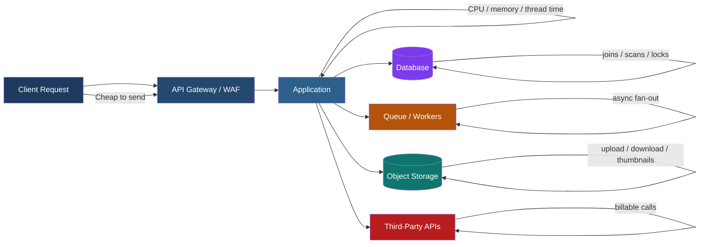
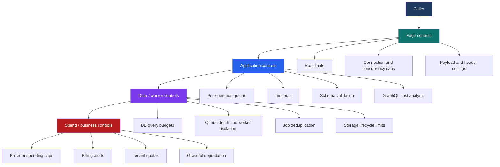

# Unrestricted Resource Consumption

> **Unrestricted resource consumption happens when an API lets a caller spend more CPU, memory, bandwidth, storage, queue depth, database work, or third-party money than the service can safely absorb.**

---

## 🧠 What Is It?

OWASP API Security Top 10 (2023) lists this as **API4: Unrestricted Resource Consumption**. The idea is simple:

- the client sends a request that looks cheap
- the server performs work that is **much more expensive**
- there are not enough **limits, budgets, or guardrails**
- availability, stability, and cost start to break

### A beginner-friendly analogy

Think of an API like a company expense account attached to a vending machine:

- every request is a swipe of the card
- some swipes are cheap
- some swipes quietly trigger a delivery truck, warehouse worker, and finance charge

If nobody sets a budget, spending cap, or approval rule, one caller can burn through the account very quickly.

### The one sentence to remember

> **This is not just “missing rate limiting.” It is any situation where the caller can force the system to do disproportionate work or spend disproportionate money.**

---

## Why APIs Are Especially Exposed

APIs are more vulnerable to this class of issue than many traditional web pages because they:

- expose raw operations directly to machines, not just humans
- often support automation, batching, and high-frequency access by design
- trigger expensive back-end workflows such as exports, search, media processing, or AI inference
- fan out into databases, caches, queues, storage, and third-party providers
- may be documented in an API spec, making high-cost operations easy to identify

That last point matters: a good API specification helps defenders build securely, but it also means **defenders should read the spec like a cost map** and ask:

- Which parameters control **size**?
- Which endpoints trigger **asynchronous jobs**?
- Which operations fan out to **third-party services**?
- Which calls can return **huge result sets**?

---

## 🏗️ Mental Model: Every Request Spends From Multiple Budgets

A safe way to reason about this vulnerability is to stop thinking in “requests per second” only and start thinking in **resource budgets**.

Each request can spend from several budgets at once:

- **edge budget**: connections, TLS handshakes, request rate
- **application budget**: CPU time, memory, worker threads
- **data budget**: query cost, row scans, cache churn
- **storage budget**: upload size, generated files, object-store reads
- **async budget**: queue depth, job concurrency, retries
- **third-party budget**: SMS, email, payment, geocoding, AI, biometrics
- **business budget**: customer experience, SLO/SLA, support load, cloud bill



### The asymmetry that makes this dangerous

The attacker cost can be tiny while the server cost is huge:

| Caller action | API work triggered | Why it becomes dangerous |
|---|---|---|
| Request page size `100000` | large query, serialization, network transfer | one request can behave like thousands |
| Upload one image | virus scan, resize, thumbnail generation, storage writes | small request can become multi-step processing |
| Trigger “export report” | queue job, DB scan, file generation, email send | async work hides the real cost |
| Send OTP / email repeatedly | third-party messaging charges | low effort creates real financial loss |
| GraphQL query with deep nesting or aliases | many resolver calls, DB fan-out | one HTTP request may contain huge internal work |

---

## 📊 Core Resource-Abuse Patterns

| Pattern | What it looks like | Typical API-spec clues | Main impact |
|---|---|---|---|
| **Volume abuse** | too many requests in a short time | auth, search, login, polling endpoints with no stated quotas | availability degradation |
| **Expensive single request** | one request is computationally heavy | report generation, analytics, search, image/video transforms | CPU and memory spikes |
| **Unbounded response size** | caller controls page size, date range, included relations | `limit`, `pageSize`, `expand`, `include=*`, export parameters | bandwidth, DB load, serialization pressure |
| **Batch amplification** | one request contains many sub-operations | bulk REST endpoints, GraphQL batching, array-based mutation bodies | hidden concurrency and fan-out |
| **Async job flooding** | cheap submission creates persistent background work | `/exports`, `/render`, `/reindex`, `/sync`, webhook replay | queue starvation, worker exhaustion |
| **Upload / transform abuse** | uploads trigger scanning, parsing, conversion, or resizing | multipart uploads, base64 fields, media/document APIs | memory, storage, processing overload |
| **Third-party spend amplification** | API indirectly buys a service per call | SMS, email, maps, OCR, AI, payments, KYC | direct financial impact |

---

## Read the API Spec Like a Cost Map

The API spec is one of the best defensive tools for spotting this weakness early.

From an **OpenAPI** point of view, high-risk areas usually include:

- parameters such as `limit`, `pageSize`, `offset`, `depth`, `expand`, `include`, `batchSize`
- request bodies containing arrays without `maxItems`
- large strings or blobs without `maxLength`
- file uploads without clear size or format constraints
- endpoints that create jobs, exports, reports, or callbacks
- webhook and callback features that can multiply work

The OpenAPI Specification defines a structured `paths` section, schemas, request bodies, parameters, and webhooks. That means defenders can inspect the spec and ask: **where are the explicit ceilings?**

### Example: risky spec fragment

```yaml
openapi: 3.1.0
paths:
  /reports/export:
    post:
      summary: Export customer report
      parameters:
        - name: format
          in: query
          schema:
            type: string
        - name: pageSize
          in: query
          schema:
            type: integer
        - name: includeHistory
          in: query
          schema:
            type: boolean
      requestBody:
        required: true
        content:
          application/json:
            schema:
              type: object
              properties:
                customerIds:
                  type: array
                  items:
                    type: string
```

### Why this is risky

- `pageSize` has no maximum
- `customerIds` has no `maxItems`
- `format` has no allowlist
- `includeHistory` may massively increase query cost
- the spec says nothing about job quotas, concurrency, or response budgets

### Hardened version

```yaml
openapi: 3.1.0
paths:
  /reports/export:
    post:
      summary: Export customer report
      parameters:
        - name: format
          in: query
          schema:
            type: string
            enum: [csv, json]
        - name: pageSize
          in: query
          schema:
            type: integer
            minimum: 1
            maximum: 500
        - name: includeHistory
          in: query
          schema:
            type: boolean
            default: false
      requestBody:
        required: true
        content:
          application/json:
            schema:
              type: object
              required: [customerIds]
              properties:
                customerIds:
                  type: array
                  minItems: 1
                  maxItems: 100
                  items:
                    type: string
                    maxLength: 64
```

### What strong specs help you enforce

| Spec element | Defensive question |
|---|---|
| `maximum`, `maxItems`, `maxLength` | Is the request shape bounded? |
| `enum` | Are costly modes explicitly allowlisted? |
| `requestBody` schema | Can tooling reject oversized or malformed payloads early? |
| `webhooks` / callbacks | Could one client action trigger additional work elsewhere? |
| operation descriptions | Does the implementation state quotas, async limits, or billing implications? |

---

## REST, GraphQL, and Async APIs Fail Differently

| API style | Common unrestricted-consumption risk | Best defensive control |
|---|---|---|
| **REST** | huge pagination, broad filters, bulk endpoints, giant exports | max page size, filter constraints, response-size caps, per-operation quotas |
| **GraphQL** | deep nesting, alias abuse, large lists, batch operations | depth limits, breadth limits, query-cost analysis, trusted documents |
| **Async job APIs** | cheap job submission creates expensive background work | job quotas, concurrency caps, deduplication, cancellation, queue budgets |
| **File / media APIs** | uploads trigger expensive parsing or transformations | file size caps, content-type validation, worker isolation, transform limits |
| **Third-party-backed APIs** | each call spends money with an upstream provider | spend limits, per-user quotas, anomaly alerts, provider-side caps |

### GraphQL deserves special attention

GraphQL security guidance emphasizes **demand control**:

- paginate list fields
- limit depth
- limit breadth and aliases
- limit batch sizes
- apply query-complexity analysis
- use trusted documents when the API is first-party only

That is the core idea of API4 in GraphQL form: **one request must not be allowed to encode unlimited work**.

---

## Safe, Authorized Validation Methodology

> **Defensive rule:** never “prove” this issue by causing an outage. Validate with controlled, low-impact testing, preferably in staging or within an approved window.

### A safe workflow

1. **Review the spec first**
   - identify endpoints with uploads, exports, search, analytics, messaging, AI, OCR, or bulk actions
   - identify parameters that control size, breadth, duration, or fan-out

2. **Measure a small baseline**
   - normal response size
   - normal latency
   - presence or absence of `429 Too Many Requests`
   - whether the API communicates limits clearly

3. **Test boundaries, not brute force**
   - try small controlled increases in page size, batch size, upload size, or date range
   - watch for graceful rejection vs. uncontrolled work

4. **Coordinate with observability**
   - check logs, queue depth, p95/p99 latency, worker saturation, and provider dashboards

5. **Stop early**
   - once you demonstrate missing controls or disproportionate cost, you already have a valid finding

### Safe indicators to look for

| Goal | Safe evidence | Avoid |
|---|---|---|
| show missing frequency control | no `429`, no quota headers, no lockout after small repeated requests | sustained high-volume traffic |
| show missing size control | large values accepted beyond business expectation | intentionally huge payloads against production |
| show async abuse risk | multiple jobs accepted quickly with no queue or user cap | flooding worker pools |
| show third-party spend risk | endpoint triggers billable action and lacks per-user quota | mass triggering live messages or paid actions |

---

## Signals That an API Is Vulnerable

### In behavior

- no `429 Too Many Requests`
- no `Retry-After` guidance when throttling should occur
- very large `limit`, `pageSize`, `first`, or `batch` values are accepted
- the API returns extremely large payloads in one response
- a single caller can enqueue many background jobs quickly
- file uploads or transformations are accepted without clear ceilings
- billing-backed actions have no cooldown, quota, or approval logic

### In design

- “rate limit by IP” is the only control
- client-side caps exist, server-side caps do not
- queue submission is limited, but worker fan-out is not
- REST limits request count but ignores **per-operation cost**
- GraphQL is treated as “one endpoint,” so all queries share the same simplistic limit
- business owners do not know the cost of an SMS, export, OCR call, or AI prompt

---

## Rate Limiting Is Necessary, But Not Sufficient

A common mistake is to equate this entire category with a single gateway throttle.

In reality, mature APIs control **four different dimensions**:

| Dimension | Example question | Example control |
|---|---|---|
| **Frequency** | How often can this caller hit the endpoint? | token bucket, sliding window, cooldowns |
| **Size** | How big can one request or response become? | `maxLength`, `maxItems`, upload caps, page caps |
| **Concurrency** | How many expensive operations can run at once? | worker pool limits, queue depth, per-tenant concurrent-job caps |
| **Cost** | How much downstream work or spend can one caller trigger? | query complexity budgets, provider quotas, billing alerts |

If you remember one design rule, use this:

> **Count requests, bound shape, cap concurrency, and budget cost.**

### Helpful HTTP semantics

When a service does need to push back, it should do so clearly.

```http
HTTP/1.1 429 Too Many Requests
Content-Type: application/json
Retry-After: 60

{
  "error": "rate_limit_exceeded",
  "message": "Too many requests for this operation. Retry after 60 seconds."
}
```

`429 Too Many Requests` and `Retry-After` make the limit visible to well-behaved clients and easier to observe during testing and monitoring.

---

## 📊 What Good Defenses Look Like

The mature defense is layered. One control is never enough.



### 1. Limit frequency

Rate limiting is still important, but it should be applied by more than one identity:

- IP address
- authenticated user
- API key or client ID
- tenant / organization
- operation name

This matters because IP-only throttling is weak for mobile networks, NAT gateways, and distributed callers.

### 2. Limit request shape

Every input that changes work should have an upper bound:

- string length
- array length
- upload size
- page size
- time range
- number of aliases or nested fields
- number of operations in a batch

### 3. Limit execution cost

Some requests are too expensive even if they are valid. Controls here include:

- execution timeouts
- per-request memory ceilings
- concurrency limits
- GraphQL query-cost scoring
- maximum resolver depth/breadth
- asynchronous execution with bounded worker pools

### 4. Limit blast radius

Even good validation can fail under stress. Reduce damage with:

- queue isolation for expensive jobs
- separate worker pools for low-priority operations
- circuit breakers and back-pressure
- caching for repeated reads
- graceful fallbacks when dependencies are unhealthy

### 5. Limit financial exposure

This is the part teams often forget.

If an endpoint indirectly spends money, you need:

- per-user and per-tenant spend quotas
- daily/monthly provider-side caps where available
- billing anomaly alerts
- approval or cooldown rules for high-cost operations

---

## Common Anti-Patterns

| Anti-pattern | Why it fails | Better approach |
|---|---|---|
| “We have a gateway limit, so we are safe.” | a global request cap does not understand query cost or downstream spend | combine edge limits with application-aware quotas |
| “The UI only allows 100 items.” | attackers do not use the UI | enforce bounds server-side from the schema/spec |
| “GraphQL is just one POST endpoint.” | one HTTP request can hide huge internal work | add depth, breadth, batch, and cost controls |
| “Exports are async, so they are safe.” | async moves cost into queues; it does not remove cost | cap job creation, deduplicate work, limit concurrency |
| “Only authenticated users can call it.” | trusted users can still abuse cost-heavy features, or accounts can be compromised | add per-user, per-tenant, and per-operation budgets |
| “We monitor uptime.” | cost amplification can hurt the bill before it hurts uptime | add spend alerts and provider quotas |

---

## Detection and Telemetry

| Layer | Useful signals |
|---|---|
| **HTTP** | 429 volume, 5xx spikes, `Retry-After` usage, response-size outliers |
| **Application** | p95/p99 latency, timeout count, memory pressure, thread-pool saturation |
| **Database** | slow queries, scan-heavy plans, lock contention, cache miss rate |
| **Workers / queues** | queue age, job backlog, retry storms, dead-letter volume |
| **Storage** | upload spikes, generated artifact growth, egress anomalies |
| **Third-party** | SMS/email/OCR/AI usage spikes, billing alarms, quota exhaustion |

### A practical defender question set

- What are our top 10 most expensive operations?
- Which parameters influence cost the most?
- Which endpoints can create background work?
- Which operations are billable per request?
- Can one tenant starve everyone else?
- Do we fail safely when a quota is hit?

---

## Reporting This Finding Well

A strong report on unrestricted resource consumption does **not** need a dramatic outage demo. It needs a clear explanation of asymmetry and business impact.

### Good evidence

- the API spec shows missing ceilings on cost-driving parameters
- controlled testing shows the API accepts values far beyond business expectations
- the API lacks meaningful throttling or quota responses
- telemetry shows latency, queue depth, or downstream cost rise quickly even under low-volume boundary testing
- provider pricing or architecture shows clear financial amplification risk

### Business impact framing

| Impact type | Example |
|---|---|
| **Availability** | search, exports, or uploads can exhaust workers and degrade the API for real customers |
| **Performance** | p95 latency rises sharply under modest misuse |
| **Operational cost** | SMS, email, AI, or OCR-backed endpoints can generate direct spend |
| **Tenant isolation failure** | one noisy customer can harm all other tenants |
| **Security control bypass** | resource exhaustion can weaken monitoring, auth flows, or incident response |

### Severity thinking

Severity should reflect:

- how easy the issue is to trigger
- whether auth is required
- whether the impact is availability, direct cost, or both
- whether the endpoint is internet-facing
- whether the operation touches shared infrastructure or a dedicated pool

---

## Quick Defensive Checklist

- [ ] Are request rate limits enforced per IP, user, API key, and tenant where appropriate?
- [ ] Do all cost-driving parameters have hard upper bounds?
- [ ] Are uploads, arrays, strings, and batch sizes bounded server-side?
- [ ] Are expensive operations isolated into bounded worker pools?
- [ ] Do async jobs have per-user and per-tenant quotas?
- [ ] Does GraphQL have pagination, depth limits, breadth limits, and cost controls?
- [ ] Are billable downstream integrations protected by quotas and alerts?
- [ ] Do throttle responses communicate `429` and `Retry-After` clearly?
- [ ] Can one tenant or operation consume disproportionate shared capacity?
- [ ] Is the API spec explicit about limits so tooling and reviewers can verify them?

---

## Key Takeaways

1. **Unrestricted resource consumption is broader than rate limiting.**
2. **The right mental model is budget control, not request counting alone.**
3. **Your API spec can reveal risky cost controls before production traffic ever does.**
4. **GraphQL, async jobs, file processing, and third-party-backed endpoints are common hotspots.**
5. **Good defenses combine quotas, validation, execution ceilings, isolation, and spend controls.**

---

## References

- OWASP API Security Top 10 2023 — API4: Unrestricted Resource Consumption  
  https://owasp.org/API-Security/editions/2023/en/0xa4-unrestricted-resource-consumption/
- OWASP GraphQL Cheat Sheet — DoS Prevention and batching guidance  
  https://cheatsheetseries.owasp.org/cheatsheets/GraphQL_Cheat_Sheet.html
- GraphQL.org Security Guidance — demand control, pagination, depth, breadth, and complexity  
  https://graphql.org/learn/security/
- MITRE CWE-770 — Allocation of Resources Without Limits or Throttling  
  https://cwe.mitre.org/data/definitions/770.html
- MITRE CWE-400 — Uncontrolled Resource Consumption  
  https://cwe.mitre.org/data/definitions/400.html
- IETF RFC 6585 — `429 Too Many Requests` and `Retry-After` guidance  
  https://www.rfc-editor.org/rfc/rfc6585
- NIST SP 800-204 — microservices security strategies including load balancing and throttling  
  https://csrc.nist.gov/pubs/sp/800/204/final
- OpenAPI Specification 3.1.0  
  https://spec.openapis.org/oas/v3.1.0
