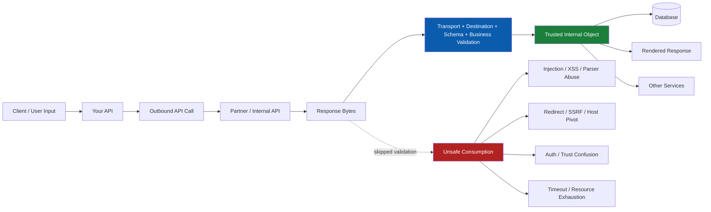
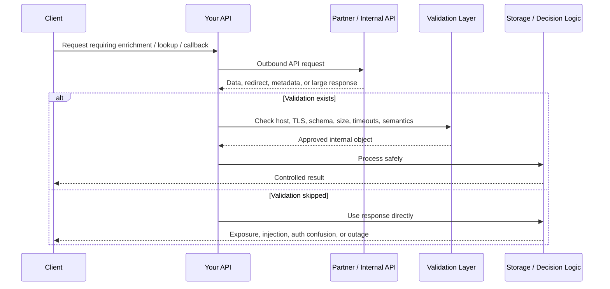
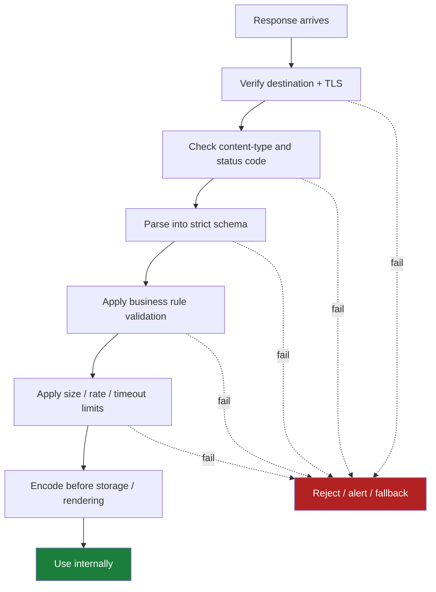

# Unsafe Consumption of APIs

> **OWASP API10:2023** — unsafe consumption of APIs happens when your application trusts another API's data, redirects, identity assertions, or availability behavior without enforcing its own security rules.

---

## 🧠 What Is It? (Beginner Explanation)

Most developers already know to distrust **browser input**.

The mistake behind this vulnerability is forgetting that **API responses are input too**.

If your service calls:

- a payment gateway
- a CRM
- a shipping provider
- a Git hosting API
- an “internal trusted microservice”
- a webhook callback URL

…then whatever comes back is still **untrusted data crossing a trust boundary**.

### Easy Analogy

Imagine a bank clerk who carefully checks every form handed in by customers, but blindly accepts anything that arrives in an envelope labeled “partner company.”

That envelope can still contain:

- false instructions
- oversized documents
- dangerous redirects
- poisoned metadata
- manipulated account details

That is **unsafe consumption** in one sentence.

### Memory Hook

> **Third-party API data is just user input wearing a nicer badge.**

---

## Why This Matters in Modern APIs

Modern systems rarely stand alone. A single request may trigger calls to:

- identity providers
- fraud engines
- payment processors
- file scanners
- recommendation engines
- internal microservices
- partner integrations

That creates a **chain of trust**. If one link is weak and the consuming API does not validate what it receives, the weakness spreads downstream.

| Integration type | Common assumption | Real risk |
|---|---|---|
| Internal microservice | “It is inside the network, so it is safe.” | Compromised service, stale auth context, schema drift |
| Famous SaaS vendor | “They must already validate everything.” | Unexpected fields, redirect abuse, auth confusion, downtime |
| Webhook/callback | “The URL came from a configured customer.” | SSRF, untrusted destinations, data leakage |
| Data enrichment API | “It only returns metadata.” | Injection, stored XSS, bad business decisions |
| Pricing/risk engine | “Its result is authoritative.” | Fraud, privilege mistakes, incorrect approvals |

---

## 📊 Core Mental Model: Every API Call Crosses a Trust Boundary



### The key idea

An upstream API response should be treated like this:

1. **Bytes on the wire**
2. **Parsed data**
3. **Validated data**
4. **Policy-approved data**
5. **Only then: business-trusted data**

Many vulnerable systems jump from step **1** to step **5**.

---

## Quick Definition Using the API Security Spec

OWASP API Security Top 10 2023 describes this issue as a pattern where developers:

- trust data from third-party APIs more than user input
- apply weaker validation and sanitization to integrated services
- fail to protect transport, redirects, timeouts, and resource limits

That is why this category often overlaps with:

- **SSRF**
- **injection**
- **data leakage**
- **denial of service**
- **business logic abuse**

---

## Unsafe Consumption vs. Related Vulnerabilities

| Vulnerability | Main question | What makes it different? |
|---|---|---|
| **Unsafe Consumption of APIs** | Do we trust upstream APIs too much? | Focuses on insecure handling of data or behavior from other APIs |
| **SSRF** | Can the server be tricked into making requests to unintended destinations? | One specific failure mode inside unsafe consumption |
| **Injection** | Can untrusted data reach interpreters unsafely? | Often the impact after upstream data is trusted |
| **Security Misconfiguration** | Are defaults, settings, or headers weak? | Broader category; unsafe consumption may be caused by it |
| **Broken Authentication / Authorization** | Are identities or permissions enforced correctly? | Unsafe consumption may trust upstream identity claims without re-checking locally |

---

## How the Vulnerability Usually Appears



### Typical anti-pattern

The consuming service assumes one or more of these are automatically true:

- the upstream host is authentic
- the response body matches the documented schema
- redirects are harmless
- response fields are safe to log, store, render, or forward
- the upstream service is always available and fast
- partner-provided role/status fields are authoritative

None of those should be assumed.

---

## Common Failure Modes

| Failure mode | What goes wrong | Likely impact |
|---|---|---|
| No transport enforcement | Calls occur without strong TLS validation | Tampering, eavesdropping, fake upstream services |
| Blind redirect following | Consumer follows `3xx` to attacker-controlled locations | Data exfiltration, SSRF, credential leakage |
| No schema validation | Unexpected keys, types, or nested structures are accepted | Injection, parser crashes, logic corruption |
| No semantic validation | Response is syntactically valid but business-invalid | Fraud, bad approvals, incorrect entitlements |
| Over-trusting upstream identity | Consumer accepts `role`, `tier`, `verified`, or `owner` claims blindly | Authorization bypass, privilege escalation |
| No response size limits | Large payloads or deep objects are processed fully | Memory exhaustion, slowdowns, cascading failures |
| No timeouts / retry budget | Stuck or repeated upstream calls tie up resources | Denial of service, thread exhaustion, cost spikes |
| Over-privileged integration credentials | Compromised upstream token unlocks too much | Lateral movement, sensitive data exposure |
| Unsafe rendering/storage | Upstream text is inserted into SQL, HTML, logs, or templates | Injection, stored XSS, log poisoning |
| Missing egress restrictions | Consumer can talk to any destination | SSRF expansion, metadata service access, shadow integrations |

---

## The Five Trust Questions Defenders Should Ask

Before consuming any upstream API response, ask:

| Question | Why it matters |
|---|---|
| **Who are we really talking to?** | Host allowlisting, TLS, certificate validation, mTLS, DNS controls |
| **What exact data shape is allowed?** | Types, enums, lengths, nested objects, `additionalProperties`, content type |
| **What business meaning is allowed?** | “Approved”, “verified”, and “admin” are policy decisions, not just strings |
| **How much resource are we willing to spend?** | Timeouts, concurrency caps, body limits, retries, circuit breakers |
| **What happens if the upstream lies or fails?** | Safe fallback behavior, deny-by-default, no silent trust escalation |

---

## Using the API Spec Defensively

If you have an OpenAPI or partner contract, use it as a **validation baseline**, not as a trust substitute.

### Treat the spec as a security control input

| Spec element | Security use |
|---|---|
| `servers` | Define the exact allowed outbound destinations |
| `securitySchemes` | Confirm the required auth method and scope |
| `type`, `enum`, `format`, `maxLength`, `maximum` | Enforce strict response validation |
| `required` + `additionalProperties: false` | Reject missing or extra fields |
| response codes | Treat undocumented responses as errors |
| `content` types | Reject unexpected MIME types |
| callback/webhook definitions | Apply signing, destination control, and replay protection |

### Example: contract-driven response hardening

```yaml
openapi: 3.1.0
info:
  title: Partner Risk API
  version: "1.0"
servers:
  - url: https://risk.partner.example
paths:
  /score/{customerId}:
    get:
      responses:
        "200":
          description: Risk score
          content:
            application/json:
              schema:
                type: object
                additionalProperties: false
                required: [customer_id, score, status]
                properties:
                  customer_id:
                    type: string
                    maxLength: 64
                  score:
                    type: integer
                    minimum: 0
                    maximum: 100
                  status:
                    type: string
                    enum: [low, medium, high]
```

### Important limitation

Even a perfect OpenAPI file does **not** prove that runtime responses are trustworthy.

You still need:

- destination controls
- runtime schema validation
- semantic validation
- auth separation
- safe failure handling

---

## A Simple Security Formula

> **Trusted integration = verified destination + authenticated channel + validated schema + enforced business rules + bounded resource usage**

If any one of those is missing, the integration is weaker than it looks.

---

## Real-World Risk Patterns

### 1) Data Enrichment Poisoning

Your API asks another service for profile, address, repository, or product metadata.

If the returned values are later:

- stored in SQL
- rendered in an admin panel
- inserted into logs
- reused in templates
- passed to shell/CLI/database/search queries

…then upstream data can become an **indirect injection source**.

### 2) Redirect Trust

Your API sends sensitive content to a provider, the provider returns a redirect, and your client follows it automatically.

That can turn a normal integration into:

- data exfiltration
- credential forwarding
- SSRF-like pivoting

### 3) Identity and Decision Trust

If an upstream service returns fields such as:

- `verified: true`
- `role: admin`
- `risk: low`
- `payment_status: paid`
- `tenant_id: 42`

…your system must still decide whether those values are:

- authentic
- fresh
- expected
- authorized for this workflow

### 4) Availability Coupling

Even when the data is honest, unsafe consumption can appear as **resilience failure**:

- no timeout
- too many retries
- unbounded body parsing
- no circuit breaker
- synchronous dependence on a flaky service

This is how a slow partner API becomes **your outage**.

---

## Diagram: Safe Consumer Pipeline



---

## Defensive Code Example

### ❌ Unsafe consumer

```python
import httpx

def enrich_account(user_input):
    # Host is indirectly influenced and redirects are followed automatically
    response = httpx.get(user_input["lookup_url"], follow_redirects=True)
    data = response.json()

    # Blind trust in upstream fields
    if data["verified"]:
        account_status = "approved"
    else:
        account_status = "pending"

    # Dangerous if later rendered or stored without control
    return {
        "display_name": data["company_name"],
        "status": account_status,
        "notes": data.get("notes", "")
    }
```

### ✅ Safer consumer

```python
from enum import Enum
from pydantic import BaseModel, ConfigDict, Field
import httpx

PARTNER_BASE_URL = "https://partner.example"
TIMEOUT = httpx.Timeout(connect=2.0, read=3.0, write=3.0, pool=3.0)

class VerificationState(str, Enum):
    verified = "verified"
    pending = "pending"
    rejected = "rejected"

class PartnerResponse(BaseModel):
    model_config = ConfigDict(extra="forbid")
    company_name: str = Field(min_length=1, max_length=120)
    verification_state: VerificationState
    confidence: int = Field(ge=0, le=100)

def enrich_account(account_id: str):
    with httpx.Client(base_url=PARTNER_BASE_URL, timeout=TIMEOUT, follow_redirects=False) as client:
        response = client.get(f"/v1/accounts/{account_id}")
        if 300 <= response.status_code < 400:
            raise ValueError("Redirects from partner API are not allowed")
        response.raise_for_status()

    if response.headers.get("content-type", "").split(";")[0] != "application/json":
        raise ValueError("Unexpected content type from partner API")

    partner = PartnerResponse.model_validate(response.json())

    # Local business policy still decides what "approved" means
    approved = (
        partner.verification_state == VerificationState.verified
        and partner.confidence >= 80
    )

    return {
        "display_name": partner.company_name,
        "status": "approved" if approved else "manual_review"
    }
```

### Why the second version is better

- fixed destination instead of user-controlled URL
- redirects disabled by default
- explicit timeout budget
- strict response schema
- extra fields rejected
- local policy decides approval
- no automatic trust in partner labels

---

## What Secure Design Looks Like

### 1) Lock Down Destinations

Only allow outbound calls to approved hosts, ports, schemes, and paths.

**Good controls:**

- strict host allowlists
- egress firewall rules
- service mesh policies
- private networking where possible
- mTLS for sensitive internal integrations

### 2) Validate Response Structure

Do not stop at “valid JSON.”

Validate:

- type
- length
- range
- enum
- required fields
- nested structure
- unexpected fields
- content type

### 3) Validate Business Semantics

A value may be syntactically valid but still unsafe.

Examples:

- price is negative
- risk score is outside operational expectations
- `role=admin` appears in a workflow that should never receive it
- `tenant_id` does not match the current tenant
- callback state does not match the current transaction

### 4) Bound Resource Consumption

Apply limits to:

- response body size
- decompressed size
- nesting depth
- request duration
- retry count
- concurrent outbound calls

### 5) Fail Closed for Sensitive Actions

If an upstream decision is missing, delayed, malformed, or suspicious:

- do not silently approve
- do not expand privileges
- do not fall back to broad access

Prefer:

- manual review
- deny-by-default
- degraded read-only behavior

### 6) Separate Identity Domains

Do not let one service define identity truth for everything else.

Examples:

- validate tokens locally or via trusted introspection
- map partner claims into internal claims explicitly
- never forward privileged internal tokens to less-trusted services

### 7) Sanitize at the Point of Use

Even validated upstream data must still be safely handled when used in:

- HTML
- SQL
- logs
- shell commands
- templates
- filenames
- search queries

Validation and output encoding solve different problems.

---

## Safe, Authorized Testing Ideas

This topic should be tested in **approved environments** such as staging, integration, mocks, or a lab—not by attacking real third-party providers.

### What to verify

| Check | Safe validation approach |
|---|---|
| Destination control | Confirm only documented hosts are reachable |
| Redirect handling | Use a controlled mock service to see whether redirects are followed |
| Response schema validation | Return extra fields, wrong types, or missing keys from a mock API |
| Content-type enforcement | Return JSON where XML is expected, or HTML where JSON is expected |
| Resource controls | Return intentionally large but non-destructive payloads in staging |
| Timeout behavior | Simulate delayed responses and observe fallback behavior |
| Business-rule validation | Return unexpected statuses like `approved`, `admin`, or out-of-range scores from a test double |
| Logging behavior | Check whether sensitive upstream fields are written to logs or traces |

### The goal of testing

The goal is not “Can we break the partner?”

The goal is:

> **If the upstream lies, drifts, slows down, redirects, or fails, does our API stay safe?**

---

## Detection and Monitoring

| Signal | Why it matters |
|---|---|
| Outbound calls to undocumented destinations | Possible SSRF, config drift, or shadow dependency |
| Sudden increase in redirects | Potential exfiltration or provider compromise |
| Schema validation failures | Contract drift, upstream bug, or malicious response |
| Large response bodies / decompression spikes | Resource abuse or parser risk |
| Timeout bursts for one dependency | Early warning for cascading failure |
| Unexpected auth claim values from partner APIs | Trust confusion or data poisoning |
| Frequent fallback to “approve” or “allow” paths | Dangerous fail-open logic |
| Sensitive fields in logs/traces | Secondary exposure from upstream data |

---

## Secure Architecture Checklist

```text
[ ] Outbound destinations are allowlisted
[ ] TLS is enforced and certificate validation is not disabled
[ ] Redirects are disabled or tightly controlled
[ ] Response schemas are validated at runtime
[ ] Undocumented fields are rejected or ignored intentionally
[ ] Business decisions are re-validated locally
[ ] Timeouts, retries, and concurrency budgets are defined
[ ] Circuit breakers or equivalent protections exist
[ ] Response size and decompression limits are enforced
[ ] Integration credentials are least-privilege and rotated
[ ] Upstream data is safely encoded before rendering or storage
[ ] Monitoring covers outbound destinations, redirect rates, and schema failures
```

---

## A Useful Mental Shortcut

When reviewing any integration, ask:

> **“If this API started lying tomorrow, what damage could our service do with the lie?”**

If the answer includes:

- approving transactions
- granting access
- storing unsafe content
- calling new destinations
- exhausting resources
- exposing secrets

…then the integration needs stronger controls.

---

## Research Notes and Defensive Takeaways

### OWASP API Security Top 10 2023

OWASP highlights that developers often trust third-party APIs more than user input and specifically calls out:

- weak transport protections
- missing validation and sanitization
- blind redirect following
- missing timeouts
- lack of resource limits

### CWE-20: Improper Input Validation

CWE-20 is directly relevant because it reminds us that untrusted input can arrive **indirectly through API calls**, not only from end users. It also emphasizes validating:

- size
- type
- syntax
- consistency
- business rules
- authenticity

### CWE-918 / SSRF Guidance

SSRF guidance matters here because unsafe consumption often begins when applications allow outbound requests or redirects to untrusted destinations. Application-layer validation and network-layer egress controls both matter.

### Microsoft Resilience Guidance

Distributed systems guidance reinforces that remote calls fail in unpredictable ways. Timeouts, retry budgets, and circuit breakers are not just availability features—they also reduce the blast radius of unsafe API consumption.

---

## References

- OWASP API Security Top 10 2023 — API10: Unsafe Consumption of APIs  
  https://owasp.org/API-Security/editions/2023/en/0xaa-unsafe-consumption-of-apis/
- OWASP Server-Side Request Forgery Prevention Cheat Sheet  
  https://cheatsheetseries.owasp.org/cheatsheets/Server_Side_Request_Forgery_Prevention_Cheat_Sheet.html
- MITRE CWE-20: Improper Input Validation  
  https://cwe.mitre.org/data/definitions/20.html
- MITRE CWE-918: Server-Side Request Forgery (SSRF)  
  https://cwe.mitre.org/data/definitions/918.html
- Microsoft Learn — Web API Design Best Practices  
  https://learn.microsoft.com/en-us/azure/architecture/best-practices/api-design
- Microsoft Learn — Circuit Breaker Pattern  
  https://learn.microsoft.com/en-us/azure/architecture/patterns/circuit-breaker
