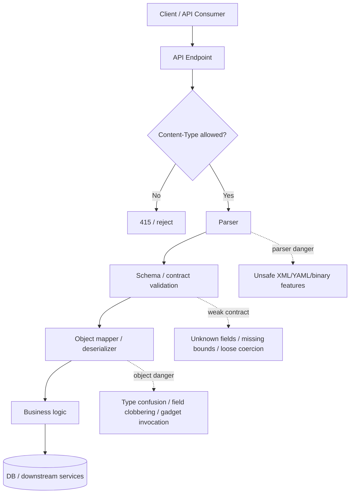
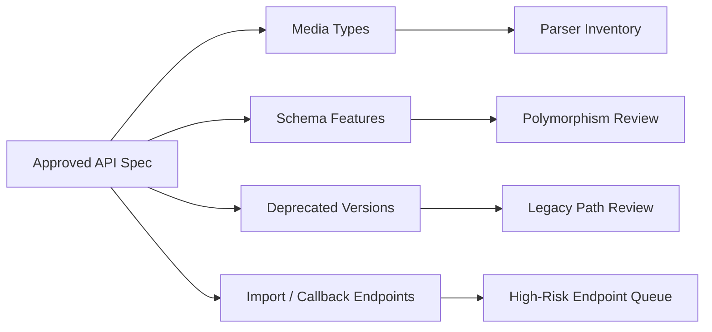
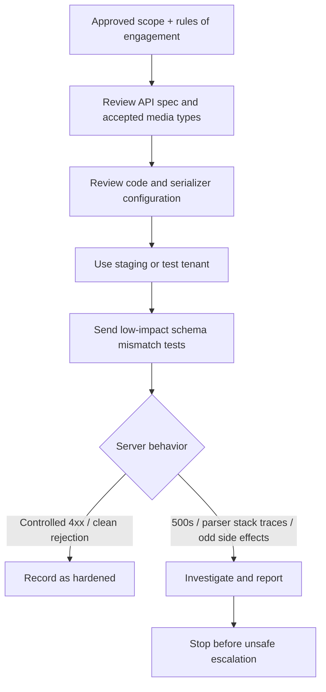

# API Deserialization

> **Module:** API Pentesting → Advanced Vulnerabilities  
> **Difficulty:** Intermediate → Advanced  
> **Tags:** `#deserialization` `#api-security` `#json` `#xml` `#yaml` `#protobuf` `#openapi` `#secure-design`

APIs rarely operate on raw strings for long. They parse request bodies, map fields into objects, and often let frameworks reconstruct complex types automatically. That convenience becomes dangerous when untrusted input can influence **which type gets created, which trusted fields get restored, or which parser features are enabled**.

In an API context, unsafe deserialization is not limited to old Java object streams. It also includes risky polymorphic JSON/XML binding, unsafe YAML loaders, insecure import endpoints, signed-but-unverified state blobs, and internal services that accept “trusted” binary formats from upstream callers. The impact ranges from field clobbering and authorization bypass to SSRF, denial of service, and sometimes code execution.

> **Easy memory hook:**  
> **Bytes → Parser → Mapper → Object → Business logic**  
> The dangerous jump is when attacker-controlled bytes become a **trusted object** before the application proves they are safe.

> **Authorization required:** Use staging or approved test tenants, prefer spec review and code review first, and keep validation low-impact. Do not turn deserialization testing into payload-driven exploitation on live systems.

---

## Table of Contents

1. [What Deserialization Means in APIs](#what-deserialization-means-in-apis)
2. [Why It Matters More Than Just Parsing](#why-it-matters-more-than-just-parsing)
3. [Where API Deserialization Risk Appears](#where-api-deserialization-risk-appears)
4. [Using the API Spec to Find Risk Faster](#using-the-api-spec-to-find-risk-faster)
5. [High-Risk Patterns by Format and Framework](#high-risk-patterns-by-format-and-framework)
6. [Authorized Validation Workflow](#authorized-validation-workflow)
7. [Safe Review and Detection Ideas](#safe-review-and-detection-ideas)
8. [Hardening and Remediation](#hardening-and-remediation)
9. [Quick Checklist](#quick-checklist)
10. [References and Public Research](#references-and-public-research)

---

## What Deserialization Means in APIs

**Serialization** means turning in-memory state into a transport or storage format.

**Deserialization** means rebuilding that data into an object, message, or internal structure the application can use.

In APIs, that often looks like:

- JSON request body → DTO or model object
- XML document → SOAP or JAXB object graph
- Protobuf message → generated class instance
- YAML or import file → configuration object
- session or state blob → server-side object restored from client-controlled data

### Parsing vs binding vs dangerous reconstruction

| Stage | What happens | Usually fine? | What increases risk |
| --- | --- | --- | --- |
| **Parsing** | Convert bytes into a syntax tree or primitive structure | Often yes | Unsafe parser features, external references, poor resource limits |
| **Binding** | Map parsed data into a fixed DTO or schema-backed object | Usually safer | Unknown field acceptance, implicit coercion, trusted field overwrite |
| **Polymorphic deserialization** | Choose runtime subtype based on input metadata | Higher risk | Broad type allowlists, default typing, reflective object creation |
| **Native object deserialization** | Restore language/runtime objects directly | Highest risk | User-controlled object graphs, magic methods, gadget availability |

A simple way to remember the difference:

> **Parsing reads data. Deserialization may also rebuild trust.**

If the framework turns untrusted input into a rich object with behavior, inheritance, callbacks, or privileged fields, the security problem is no longer “bad input” alone. It becomes **unsafe object reconstruction**.

### Diagram — where the risk sits



---

## Why It Matters More Than Just Parsing

Deserialization bugs matter in APIs because APIs are:

- **repeatable** — the same endpoint can be exercised safely and systematically during testing
- **documented** — OpenAPI or internal docs often reveal accepted media types and schemas
- **machine-oriented** — frameworks aggressively automate object creation for convenience
- **multi-format** — JSON may coexist with XML, YAML, protobuf, vendor-specific formats, and file imports
- **high-trust internally** — service-to-service APIs often assume callers are already safe

### Why API deserialization is often missed

| Common assumption | Why it is dangerous |
| --- | --- |
| “We only accept JSON, so this is not deserialization.” | JSON binding can still become unsafe when polymorphism, type metadata, or unsafe mappers are enabled. |
| “This endpoint is internal.” | Internal APIs often deserialize richer messages with weaker scrutiny and broader trust. |
| “Validation happens after mapping.” | For many serializers, damage can begin before business validation runs. |
| “We signed the blob.” | Integrity helps, but stolen keys, weak verification order, or replay still leave risk. |
| “This is just mass assignment.” | Mass assignment and unsafe deserialization overlap, but deserialization also includes type selection, graph reconstruction, and parser-side side effects. |

### Impact in practice

| Impact class | API example |
| --- | --- |
| **Trusted field clobbering** | Request body restores `role`, `tenantId`, `isInternal`, or workflow state the client should never control |
| **Authorization drift** | Runtime subtype or imported object takes a more privileged code path |
| **Data exposure** | Deserialized state reveals private fields or revives object state never meant for clients |
| **SSRF / file access** | XML or object mappers fetch external resources, local files, or internal URLs during processing |
| **Denial of service** | Deeply nested, recursive, or expensive payloads exhaust CPU or memory |
| **Code execution** | In severe cases, unsafe native or reflective deserialization reaches dangerous runtime behavior |

### Deserialization vs mass assignment

These two are related, but not identical:

| Topic | Main question |
| --- | --- |
| **Mass assignment** | “Did the framework bind too many fields onto the correct object?” |
| **Unsafe deserialization** | “Did untrusted input control how objects, types, or state were reconstructed at all?” |

A mature API review checks both.

---

## Where API Deserialization Risk Appears

Unsafe deserialization is a **pattern**, not a single protocol flaw.

| API area | What the server may deserialize | Typical risk themes |
| --- | --- | --- |
| **REST JSON endpoints** | JSON body → DTO, domain object, or polymorphic subtype | Unknown fields, type metadata, unsafe model binding, field clobbering |
| **SOAP / XML APIs** | XML body → object graph | XXE-style parser risk, unsafe unmarshalling, external resource fetching, legacy object mappers |
| **GraphQL mutations** | Nested input objects, custom scalars, raw JSON blobs | Loose scalar validation, nested input trust, admin-only object variants |
| **gRPC / protobuf APIs** | Message bytes → generated message classes | Trust of upstream callers, unsafe `Any` usage, gateway-to-internal type drift |
| **Webhook / event consumers** | Event payload → internal event object | Signature verification order, replay, weak schema enforcement, “trusted sender” assumptions |
| **Import / restore endpoints** | Uploaded config, backup, workflow state, session snapshot | Dangerous native formats, migration tools, legacy compatibility code paths |
| **Client-side state or cookies** | Encoded state blob → server object | Tamper detection failure, hidden server state restoration |

### Important nuance: not every binary or structured format is bad

Formats like Protobuf or JSON are not inherently insecure.

The risk comes from things like:

- letting the client choose runtime types
- restoring domain objects instead of plain DTOs
- enabling unsafe parser features
- trusting internal callers too much
- accepting formats that business requirements do not actually need

---

## Using the API Spec to Find Risk Faster

A good API spec is one of the fastest ways to find deserialization surface **without blindly probing**. The OpenAPI Specification explicitly allows request and response bodies that are **not** just JSON, which matters because unusual media types often map directly to special parsers and mappers.

### High-value clues in an OpenAPI or related API spec

| Spec clue | Why it matters | Safe next step |
| --- | --- | --- |
| `requestBody.content` includes `application/xml`, `text/xml`, `application/*+xml`, YAML, or `application/octet-stream` | The endpoint likely uses non-trivial parsing or object mapping | Verify whether those formats are truly required and how the server handles wrong media types |
| `oneOf`, `anyOf`, `allOf`, or `discriminator` | Polymorphic mapping may exist | Review subtype allowlists, unknown subtype handling, and whether clients can steer runtime class choice |
| Free-form objects or broad `additionalProperties` | The server may accept arbitrary keys | Test low-impact unknown fields and confirm server-side stripping or rejection |
| Examples containing `@class`, `$type`, `_type`, `__type`, or similar metadata | Strong clue that runtime type selection exists | Inspect serializer configuration before sending live requests |
| File upload, import, restore, migration, or “bulk ingest” operations | These often hide the most dangerous parser paths | Review code paths and environment isolation first |
| Webhooks, callbacks, or event ingestion endpoints | Often receive signed but externally influenced structured input | Verify signature-before-deserialize behavior and strict schema validation |
| Deprecated versions still documented | Legacy parser paths may still exist | Compare old vs new media types, schemas, and error behavior |

### Safe local analysis of an approved spec

If you have a local copy of an approved spec:

```bash
# List declared media types
jq -r '.. | objects | .content? // empty | keys[]' openapi.json | sort -u

# Search for polymorphism and type clues
rg -n 'discriminator|oneOf|anyOf|allOf|@class|\$type|__type|application/.+xml|application/octet-stream' openapi.json openapi.yaml openapi.yml
```

Those are **inventory** commands, not exploitation steps.

### Why spec review is so effective



If a spec says the API accepts only JSON but the live service also accepts XML, YAML, or binary bodies, that is a **documentation drift and attack-surface** finding even before a deeper deserialization bug is confirmed.

---

## High-Risk Patterns by Format and Framework

The same security lesson repeats across ecosystems: **deserializers should rebuild simple data, not arbitrary behavior-bearing object graphs**.

### Common patterns at a glance

| Format / mechanism | Common API symptom | Dangerous choice | Safer pattern |
| --- | --- | --- | --- |
| **Native Java serialization** | Binary body, cookie, or state blob | `ObjectInputStream.readObject()` on untrusted data | Fixed DTOs, JSON/Protobuf, `ObjectInputFilter`, allowlists |
| **.NET legacy object serialization** | Import, remoting, session, or internal admin endpoints | Runtime object restoration with legacy serializers | `System.Text.Json`, fixed DTOs, no client-controlled type reconstruction |
| **Python pickle / unsafe YAML** | Cached state, job import, worker messages | `pickle.loads()` or broad YAML loaders on untrusted input | `json.loads()`, `yaml.safe_load()`, explicit schema and depth limits |
| **PHP object deserialization** | Cookie, POST body, restore flow | `unserialize()` on client-controlled data | JSON plus explicit mapping, strong integrity controls, narrow transitional allowlists only if unavoidable |
| **Jackson / Newtonsoft / Fastjson-style polymorphism** | JSON includes type metadata | Global default typing or broad subtype handling | Explicit subtype registry, fixed DTOs, reject unknown types |
| **XStream / XMLDecoder-style binding** | XML import or legacy SOAP/REST bridge | Relaxed XML-to-object mapping | Upgrade, strict allowlist, simpler data formats where possible |
| **Protobuf with `Any` or wrapper types** | Internal service APIs | Trusting type URLs or unexpected message envelopes | Accept only expected message types and validate at gateways |
| **Opaque signed state blobs** | Remember-me, workflow state, session carry-over | Verifying too late or restoring privileged fields | Verify integrity before decode and keep restored objects minimal |

### 1) Native object deserialization

Classic native object formats remain high risk because they can restore more than just data.

```java
// ❌ Risky: user-controlled bytes become an arbitrary object graph
ObjectInputStream in = new ObjectInputStream(request.getInputStream());
Object obj = in.readObject();
```

```java
// ✅ Better: fixed DTO plus strict JSON handling
ObjectMapper mapper = JsonMapper.builder()
    .enable(DeserializationFeature.FAIL_ON_UNKNOWN_PROPERTIES)
    .build();

CreateUserRequest req = mapper.readValue(body, CreateUserRequest.class);
```

If legacy Java deserialization truly cannot be removed immediately, use a narrow allowlist filter and plan retirement:

```java
ObjectInputStream in = new ObjectInputStream(request.getInputStream());
in.setObjectInputFilter(ObjectInputFilter.Config.createFilter("com.example.dto.*;!*"));
```

### 2) Unsafe loaders in scripting ecosystems

```python
# ❌ Risky: untrusted serialized object or unsafe YAML loader
obj = pickle.loads(body)
config = yaml.load(body, Loader=yaml.Loader)
```

```python
# ✅ Better: plain data + safe loader
request = json.loads(body)
config = yaml.safe_load(body)
```

Even when the issue is “only” YAML or JSON-like input, the real danger is the same: **the server rebuilds more than the client should control**.

### 3) Polymorphic JSON binding

A lot of modern API risk is not classic binary serialization. It is **polymorphism enabled in ordinary JSON APIs**.

```csharp
// ❌ Risky: client input can influence runtime type selection
var settings = new JsonSerializerSettings {
    TypeNameHandling = TypeNameHandling.Auto
};
var message = JsonConvert.DeserializeObject<BaseMessage>(body, settings);
```

```csharp
// ✅ Better: deserialize into a fixed request type
var request = System.Text.Json.JsonSerializer.Deserialize<CreateTicketRequest>(body);
```

### 4) Trusted-field restoration

Sometimes the bug is not “new class instantiated,” but “trusted state restored from client input.”

Examples:

- `role`, `tenantId`, `isInternal`, `approved`, or `price` accepted from a restore endpoint
- hidden workflow state sent back to the server and reloaded as authoritative
- webhook event objects trusting sender-provided internal flags instead of recomputing them

That sits on the border between mass assignment and deserialization, but the defensive control is similar: **deserialize into a minimal request type, then derive server-owned fields separately**.

### Real-world lesson defenders should remember

The XStream project’s own security documentation shows years of CVEs involving code execution, SSRF, file access, and DoS. That is an important reminder that XML-to-object mappers and “helpful” framework defaults can stay risky for a long time if not tightly configured and patched.

---

## Authorized Validation Workflow

The safest way to validate deserialization risk is to move from **inventory → code review → low-impact behavior checks**.



### Low-impact checks that are usually appropriate in scope

| Safe check | What you are trying to learn | Healthy behavior | Concerning behavior |
| --- | --- | --- | --- |
| Add an unexpected field to a fixed JSON request | Does the server reject or ignore unknown properties safely? | `400` with controlled error, or field ignored consistently | `500`, inconsistent privilege/state changes, or trusted field acceptance |
| Send an unsupported media type to a documented JSON-only route | Are content types allowlisted? | `415 Unsupported Media Type` | XML/YAML/binary unexpectedly accepted |
| Use an unknown discriminator or subtype name in staging | Is polymorphic type selection constrained? | Clean validation failure | Type confusion errors, verbose stack traces, odd fallback behavior |
| Slightly tamper with a signed opaque state blob in a test account | Is integrity verified before decode? | Signature failure before parsing | Parser exceptions first, partial state restoration, or internal errors |
| Compare current and deprecated API versions | Do old versions still expose legacy parser paths? | Same safe rejection model or retired route | Older version accepts extra formats or looser schemas |

### Good testing habits

- Prefer **one variable at a time** over noisy fuzzing.
- Keep payloads **small and non-recursive** unless the engagement explicitly allows resilience testing.
- Avoid performance-heavy parser tests on production.
- If you see parser stack traces, unexpected outbound calls, or evidence of unstable behavior, **stop and report** rather than escalating blindly.

---

## Safe Review and Detection Ideas

### Code review patterns worth searching for

Run these only on approved source trees or local copies:

```bash
rg -n 'readObject|ObjectInputStream|BinaryFormatter|unserialize\(|pickle\.loads|yaml\.load\(|fromXML\(|XMLDecoder|TypeNameHandling|enableDefaultTyping|@JsonTypeInfo|\bAny\b' .
```

That search does not prove a vulnerability, but it quickly finds places where **untrusted input might be rebuilt into rich objects**.

### Runtime and logging signals

| Signal | Why it matters |
| --- | --- |
| Frequent `415 Unsupported Media Type` on strange formats | Often indicates probing or misdocumented clients |
| Serializer-specific exceptions (`InvalidTypeIdException`, `SerializationException`, XStream security errors, unsafe YAML loader errors) | High-value signal for type confusion or deserialization rejection |
| `500` responses during schema mismatches | Suggests parser or mapper errors are escaping as server faults |
| Outbound HTTP/DNS from parsing components | Strong clue of parser-side SSRF or unsafe external resolution |
| Large spikes in parse time, memory use, or worker crashes | May indicate recursive or deeply nested input exhausting resources |
| Signature verification failures on state blobs or events | Can be normal tamper detection, but should be rate-limited and correlated |

### API-level things to compare

| Comparison | Why it helps |
| --- | --- |
| Documented media types vs actually accepted media types | Finds hidden parser surface |
| Public endpoint vs internal equivalent | Internal APIs often deserialize more complex objects |
| Old version vs current version | Legacy compatibility often carries older mapper behavior |
| JSON path vs XML path for the same operation | Different serializers may enforce different validation and auth assumptions |
| Direct API call vs gateway-routed call | Gateway may validate formats differently than internal services |

### WAFs and edge controls help, but only partially

Network defenses can block obvious malformed or disallowed content types, but they do **not** solve the core issue if the application itself still rebuilds unsafe objects. Use them as defense in depth, not as the only fix.

---

## Hardening and Remediation

### Defensive controls by layer

| Layer | Recommended control | Why it helps |
| --- | --- | --- |
| **API contract** | Allowlist only required content types and keep specs accurate | Reduces accidental parser exposure and drift |
| **Schema layer** | Use explicit schemas, reject unknown fields where appropriate, constrain size/depth | Stops many unsafe inputs before they become trusted objects |
| **Mapper layer** | Deserialize into fixed DTOs, not rich domain objects | Reduces side effects and trusted-field restore risk |
| **Type handling** | Disable broad polymorphism; use narrow subtype allowlists only when necessary | Prevents client-driven class selection |
| **Parser configuration** | Disable unsafe XML/YAML features and external lookups; set resource limits | Reduces SSRF, XXE-like issues, and DoS |
| **State handling** | Verify signatures before decode and never treat restored client state as authoritative for server-owned fields | Prevents tamper-driven object restoration |
| **Architecture** | Isolate import/conversion jobs, use least privilege, restrict outbound network access | Limits blast radius if parsing is abused |
| **Dependency hygiene** | Patch serializer libraries and remove unused gadget-rich dependencies | Shrinks exposed attack surface |
| **Observability** | Log parser failures structurally and alert on repeated deserialization anomalies | Improves detection and incident response |

### Design rules worth remembering

1. **Prefer data formats that represent data, not behavior.**  
   JSON, protobuf, and explicit DTOs are usually safer than native object streams.

2. **Deserialize into boring objects.**  
   Request DTOs should be simple, side-effect-free, and separate from privileged domain models.

3. **Keep server-owned state server-owned.**  
   Never let clients restore authority-bearing fields just because they were present in a blob.

4. **Validate early, but not only after reconstruction.**  
   Some checks must happen before or during deserialization, not only after business objects exist.

5. **Assume internal callers can be wrong or compromised.**  
   Internal APIs still need format validation, schema enforcement, and type restrictions.

### A strong remediation mindset

The best long-term fix is often **removing the dangerous serializer path entirely**, not merely trying to blacklist every bad object or gadget. Post-hoc filtering is useful, but architecture simplification is usually stronger.

---

## Quick Checklist

- [ ] Only required media types are accepted
- [ ] OpenAPI or equivalent specs match the real accepted formats
- [ ] Fixed DTOs are used instead of rich domain object restoration
- [ ] Unknown fields are rejected or intentionally stripped
- [ ] Broad polymorphic type handling is disabled
- [ ] Unsafe XML/YAML features are disabled
- [ ] Signed state blobs are verified **before** decoding
- [ ] Legacy import, restore, and deprecated API versions were reviewed separately
- [ ] Internal service APIs do not blindly trust upstream message types
- [ ] Serializer libraries are patched and unused risky dependencies are removed
- [ ] Parser and mapper failures are logged without leaking stack traces to clients
- [ ] Resource limits exist for size, depth, recursion, and processing time

---

## References and Public Research

- **OWASP Deserialization Cheat Sheet**  
  Strong defensive guidance across Java, PHP, Python, and common serializer patterns.

- **PortSwigger Web Security Academy — Insecure Deserialization**  
  Clear explanation of why deserializing user-controlled data is dangerous and why post-deserialization checks are often too late.

- **CWE-502: Deserialization of Untrusted Data**  
  Useful for impact language, mitigation ideas, and mapping real findings to a recognized weakness.

- **OWASP API Security Top 10 2023 — API8: Security Misconfiguration**  
  Relevant because accepted content types, legacy options, and weak error handling frequently expose deserialization surface.

- **OpenAPI Specification**  
  Important for understanding that HTTP APIs can formally declare many media types and schema features beyond simple JSON.

- **XStream Security Framework Documentation**  
  Valuable real-world evidence that object mappers can produce RCE, SSRF, file access, and DoS issues when not tightly constrained.
