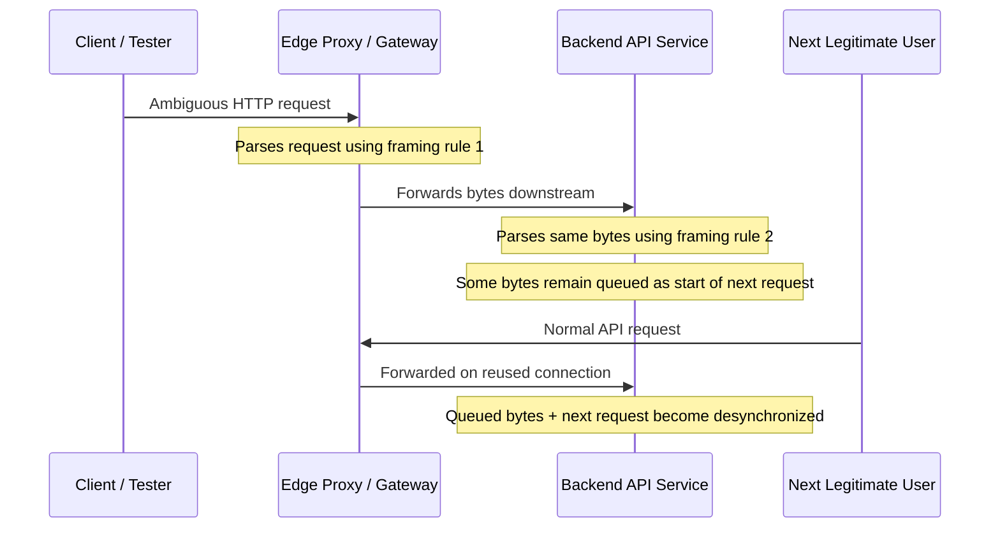
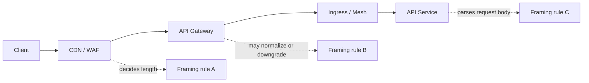
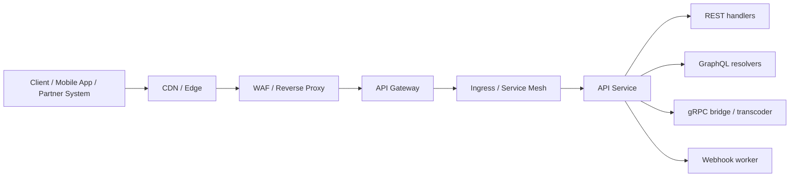
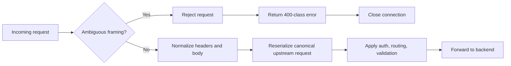

# API Request Smuggling

> **Phase 08 — Advanced API Vulnerabilities**  
> **Focus:** Understand how ambiguous request framing across API gateways, reverse proxies, load balancers, CDNs, and backend services can cause one request to be interpreted as two.  
> **Safety note:** This note is for **authorized security testing, secure architecture review, incident response, and defense**. It explains risk, validation strategy, and mitigation. It does **not** include harmful step-by-step abuse instructions.

---

**Relevant standards and guidance:** RFC 9112 (HTTP/1.1 message syntax and framing), RFC 9113 (HTTP/2), CWE-444, PortSwigger request smuggling research, and OWASP API Security Top 10 2023.

---

## Table of Contents

1. [Why API request smuggling matters](#why-api-request-smuggling-matters)
2. [Beginner mental model](#beginner-mental-model)
3. [The framing rules that make or break security](#the-framing-rules-that-make-or-break-security)
4. [Where this appears in real API architectures](#where-this-appears-in-real-api-architectures)
5. [The main desynchronization families](#the-main-desynchronization-families)
6. [Why this is especially dangerous in APIs](#why-this-is-especially-dangerous-in-apis)
7. [What authorized testers and defenders should look for](#what-authorized-testers-and-defenders-should-look-for)
8. [Safe, defensive validation workflow](#safe-defensive-validation-workflow)
9. [Prevention and hardening guidance](#prevention-and-hardening-guidance)
10. [Related issues and common confusion](#related-issues-and-common-confusion)
11. [Key takeaways](#key-takeaways)
12. [References](#references)

---

## Why API Request Smuggling Matters

**API request smuggling** happens when two HTTP-speaking components disagree about **where one request ends and the next begins**.

In a simple application, one parser reads one request. In a modern API platform, a request often passes through multiple components:

- CDN or edge network
- WAF or reverse proxy
- API gateway
- ingress controller or service mesh
- application server
- internal REST, GraphQL, gRPC, or webhook handler

If one layer parses the request differently from the next layer, a crafted request can cause **desynchronization**. That means the front-end may believe it forwarded **one valid request**, while the next layer believes it received **one request plus extra bytes that belong to the next request**.

That matters in APIs because the most important controls often live on different hops:

- authentication at the gateway
- authorization in the application
- rate limiting at the edge
- schema validation in a middleware layer
- routing and tenant isolation in backend services

When request boundaries become ambiguous, those controls can stop applying to the same logical message.

### One-sentence summary

> **Request smuggling is really a parser-agreement failure across an API delivery chain.**

---

## Beginner Mental Model

Imagine a warehouse conveyor belt with two scanners.

- **Scanner A** at the API edge decides where each package ends by using **label type A**.
- **Scanner B** deeper in the platform decides where each package ends by using **label type B**.

If the labels disagree, Scanner A forwards what it thinks is one package, but Scanner B may split it into two. The extra part gets left on the belt and can collide with the next legitimate package.

That leftover data is the heart of the problem.

### Simple analogy table

| Real component | Warehouse analogy | What can go wrong |
| --- | --- | --- |
| CDN / WAF / API gateway | First scanner | Accepts and forwards a request based on one framing rule |
| Backend service / app server | Second scanner | Interprets boundaries using a different rule |
| Shared keep-alive connection | Conveyor belt reused for many packages | Leftover bytes can affect the next request |
| Protected API route | Restricted loading zone | A hidden or misrouted request may reach it |

### Diagram — same bytes, different interpretations



This is why request smuggling is sometimes described as a **desync vulnerability**.

---

## The Framing Rules That Make or Break Security

To understand request smuggling, you need to understand **how HTTP decides message length**.

### Core framing mechanisms

| Mechanism | Typical protocol use | What it means | Why it matters |
| --- | --- | --- | --- |
| `Content-Length` | HTTP/1.1 | Declares exact body length in bytes | If two layers trust different values or duplicate headers differently, boundaries drift |
| `Transfer-Encoding: chunked` | HTTP/1.1 | Body arrives as chunks ending with a zero-length chunk | If one layer honors chunked framing and another ignores or mishandles it, desync can occur |
| HTTP/2 frame lengths | HTTP/2 | Binary frames define message boundaries | End-to-end HTTP/2 removes classic CL/TE ambiguity, but downgrade points can reintroduce it |
| Connection close | Legacy / fallback behavior | End of connection marks end of body | Fragile and risky in shared proxy chains |

### What the HTTP spec says

RFC 9112 is extremely important here:

- A sender **must not** send `Content-Length` in a message that also contains `Transfer-Encoding`.
- If a recipient receives both, **`Transfer-Encoding` overrides `Content-Length`**.
- Such a message **ought to be treated as an error** because it may indicate request smuggling or response splitting.
- A server that accepts such a request must **close the connection after responding** to avoid reuse hazards.

That gives defenders a powerful rule of thumb:

> **If framing is ambiguous, reject it early and do not reuse the connection.**

### Why real systems still fail

The RFC describes the safe behavior, but production systems are messy:

- one proxy may be old while another is patched
- one vendor may normalize whitespace differently
- one hop may allow duplicate headers while another rejects them
- one hop may downgrade HTTP/2 to HTTP/1.1
- one gateway may reserialize requests, while another forwards raw bytes more directly
- internal services may assume “trusted upstream” and parse more leniently

### Diagram — framing decisions in an API chain



The more hops you have, the more you should care about parser consistency.

---

## Where This Appears in Real API Architectures

Request smuggling is not limited to “traditional websites.” It is highly relevant to APIs because API stacks commonly chain multiple intermediaries together.

### Common API architecture pattern



### Where the risk often lives

| Hop or component | Why it matters for smuggling |
| --- | --- |
| **CDN / edge proxy** | May normalize headers differently from the origin or gateway |
| **WAF** | May inspect only the outer request seen at the edge, not the backend interpretation |
| **API gateway** | Often applies auth, rate limits, and schema checks before forwarding downstream |
| **HTTP/2 terminator** | May accept HTTP/2 from clients but downgrade to HTTP/1.1 internally |
| **Ingress controller / service mesh** | Adds yet another HTTP parser and rewrite layer |
| **REST-to-gRPC or JSON transcoder** | Translation layers can hide protocol assumptions |
| **Legacy backend** | May implement parsing differently from modern proxies |

### Why API gateways change the impact

In many environments, the gateway is trusted to do the “security work”:

- verify JWTs
- enforce client certificates
- apply throttling
- validate JSON schemas
- block dangerous paths
- strip hop-by-hop headers
- route traffic to the right tenant or service

If the backend receives a different effective request than the gateway inspected, the control gap becomes serious.

### Where the API specification helps defenders

Your **API specification** or contract artifacts are valuable here:

- **OpenAPI / Swagger** tells you intended paths, methods, versions, and auth models
- **GraphQL schema** shows operations hidden behind a single endpoint
- **gRPC `.proto` files** reveal method surfaces that may sit behind HTTP/JSON translation
- **gateway route definitions** show where protocol conversion, rewrites, or authentication happen

For safe validation, the spec helps you choose:

- low-risk **canary endpoints** like `/health`, `/status`, or a non-cacheable test route
- expected protocol behavior per host or version
- where edge and backend interpretations should match exactly

---

## The Main Desynchronization Families

You do **not** need exploit payloads to understand the families. The important point is **which layer trusts which framing rule**.

### Primary classes

| Family | Edge trusts | Backend trusts | Main idea |
| --- | --- | --- | --- |
| **CL.TE** | `Content-Length` | `Transfer-Encoding` | Edge forwards one body length, backend sees chunked termination earlier |
| **TE.CL** | `Transfer-Encoding` | `Content-Length` | Edge honors chunking, backend consumes only the declared length |
| **TE.TE** | Both think they honor `Transfer-Encoding`, but one can be confused | Also `Transfer-Encoding` or fallback behavior | Header normalization or obfuscation differences create disagreement |
| **Duplicate or inconsistent `Content-Length`** | One hop chooses one value | Another hop chooses another value | Classical parser inconsistency described by CWE-444 |
| **H2.CL** | HTTP/2 framing | Downgraded HTTP/1.1 `Content-Length` | An HTTP/2-to-HTTP/1.1 translation point introduces ambiguity |
| **H2.TE** | HTTP/2 framing | Downgraded HTTP/1.1 chunked interpretation | Forbidden or mishandled header translation creates risk |

### 1. CL.TE

In this family:

- the front-end uses `Content-Length`
- the backend uses `Transfer-Encoding: chunked`
- the backend decides the request ended earlier than the front-end expected

Result: extra bytes can remain queued for the next request.

### 2. TE.CL

In this family:

- the front-end honors chunked framing
- the backend honors `Content-Length`
- the backend consumes fewer or different bytes than the front-end intended

Result: the backend and edge stop agreeing about where the next request starts.

### 3. TE.TE

This is more subtle. Both layers may claim to support `Transfer-Encoding`, but they do **not** parse it identically.

Common causes include:

- duplicate or conflicting transfer-encoding headers
- unusual whitespace handling
- non-standard header normalization
- hidden translation behavior in intermediaries
- different tolerance for malformed input

### 4. Duplicate `Content-Length`

CWE-444 highlights another important family: different components may choose different `Content-Length` values when duplicates are present.

That is why defensive parsers should not merely “pick one.” They should reject ambiguous framing.

### 5. HTTP/2 downgrade desync

A common modern API pattern is:

```text
Client speaks HTTP/2  ->  edge accepts HTTP/2  ->  backend receives HTTP/1.1
```

End-to-end HTTP/2 is far more resistant to classic CL/TE ambiguity because length is defined by binary frames. But when the edge **downgrades** the request into HTTP/1.1 for a backend, the system must synthesize an HTTP/1.1 request safely.

If it copies unsafe headers, preserves conflicting length hints, or validates too loosely, smuggling risk comes back.

### Important nuance for gRPC and APIs

- **Pure end-to-end gRPC over HTTP/2** is not the classic request-smuggling sweet spot.
- **gRPC-Web bridges, REST-to-gRPC transcoders, ingress proxies, h2c upgrades, and HTTP/2 downgrade paths** are where API teams should focus.

---

## Why This Is Especially Dangerous in APIs

Request smuggling is often introduced as a “web bug,” but API environments amplify its impact.

### 1. Gateway policy bypass

APIs commonly rely on an edge or gateway to enforce security policies before traffic reaches the service.

If the gateway validates one effective request but the backend processes another, the gap may affect:

- authentication
- authorization
- path-based routing
- request body validation
- rate limits
- IP allowlists
- partner segregation

### 2. Cross-tenant data leakage

Multi-tenant APIs are particularly sensitive because shared backend connections and request mix-ups can cause one tenant’s context to affect another tenant’s request.

That can result in:

- wrong response delivered to the wrong client
- tenant-specific headers being applied incorrectly
- polluted routing context
- sensitive data appearing in logs, caches, or downstream processing

### 3. Single-endpoint APIs hide the blast radius

GraphQL and RPC-style APIs often concentrate many operations behind a small number of endpoints.

That means:

- a single “safe-looking” path can hide many actions
- backend routing may happen after the edge already made its decision
- discrepancies may be harder to spot from path-based logging alone

### 4. Internal API trust assumptions

Internal services often trust upstream gateways too much.

Common assumptions include:

- “the gateway already authenticated this”
- “the edge already blocked malformed traffic”
- “only trusted callers reach this service”

Smuggling can break those assumptions because the backend may end up processing a request shape the gateway never intended to approve.

### 5. Cache and response confusion risks

If an API edge, proxy, or consumer-side integration caches responses, desync can lead to:

- cache poisoning
- response queue poisoning
- mismatched response attribution
- stale or cross-user API data exposure

### API-centric impact map

| API context | Why request smuggling hurts more here |
| --- | --- |
| **REST APIs behind gateways** | Auth and validation often happen before the app sees the request |
| **GraphQL** | One endpoint hides many operations; logging may miss the real backend action |
| **gRPC behind translation layers** | Protocol bridges reintroduce parser mismatch risk |
| **Webhook receivers** | Reverse proxies and workers may disagree on body handling or connection reuse |
| **Partner APIs** | Trust boundaries and allowlists can be bypassed if only the edge checks them |
| **Multi-tenant SaaS APIs** | Cross-request contamination can become cross-tenant exposure |

---

## What Authorized Testers and Defenders Should Look For

The best signals are often **indirect**. You may not see a dramatic failure; you may see strange inconsistencies.

### Passive and architectural clues

Look for these first:

- client-facing **HTTP/2** support with **HTTP/1.1** upstream services
- multiple proxies or gateways in the request path
- recent CDN, ingress, or gateway upgrades
- vendor advisories involving parsing, chunked encoding, or HTTP/2 downgrading
- internal trust models where the backend assumes upstream validation is perfect
- caches or connection pooling in front of sensitive APIs

### Runtime symptoms

| Signal | What it can suggest | Where to look |
| --- | --- | --- |
| Unexpected `400`, `408`, `502`, or `504` spikes | Framing disagreement, backend waiting for bytes, or malformed downstream request | Edge logs, gateway metrics |
| “Invalid chunk”, “malformed request”, or “unknown method” backend errors | Backend saw a different request boundary than the edge | App logs, ingress logs |
| Different path/method recorded at different layers | One layer parsed a different effective request | WAF vs gateway vs app logs |
| Response mismatch on harmless canary routes | Possible desynchronization or response confusion | Synthetic monitoring, test accounts |
| Protocol-dependent behavior changes between HTTP/1.1 and HTTP/2 | Hidden downgrade or translation path | Controlled differential testing |
| Random auth failures or tenant-context anomalies on shared connections | Context bleed or request queue confusion | Tracing, request IDs, tenant logs |

### Telemetry that helps the most

If you design observability up front, debugging becomes much easier.

High-value logging fields include:

- request ID
- connection ID or upstream connection identifier
- negotiated client protocol (`http/1.1`, `h2`)
- upstream protocol after translation
- normalized path and method at each hop
- whether the request was reserialized or forwarded raw
- duplicate or invalid header rejection reason
- gateway policy decision ID

### Very important defender mindset

> **Do not wait for a dramatic exploit story.** Parser mismatch is already a serious finding when it exists at a trust boundary.

---

## Safe, Defensive Validation Workflow

This section is intentionally defensive. The goal is to verify risk **without creating cross-user impact**.

### 1. Establish guardrails first

Before any active validation:

- obtain explicit authorization
- prefer staging or a controlled pre-production environment
- if production testing is approved, use a **dedicated canary tenant** or non-customer route
- coordinate with platform, gateway, and incident-response owners
- define rollback and abort conditions in advance

### 2. Start with architecture and specification review

Do not begin with payload crafting. Begin with system understanding.

Review:

- OpenAPI / Swagger specs
- GraphQL schemas
- gRPC `.proto` files
- gateway route configs
- ingress or service mesh definitions
- CDN / WAF behavior documentation
- vendor change logs and security advisories

Ask:

- Which hop terminates TLS?
- Which hop speaks HTTP/2 to clients?
- Where is HTTP/2 downgraded to HTTP/1.1?
- Which component performs auth, rate limits, and schema validation?
- Which endpoints are safe canaries for low-risk testing?

### 3. Compare harmless requests across protocol paths

A safe first step is to compare a harmless route over different client protocols.

```bash
# Compare a harmless endpoint over HTTP/1.1
curl -I --http1.1 https://api.example.com/health

# Compare the same endpoint over HTTP/2
curl -I --http2 https://api.example.com/health
```

What you are looking for:

- different status codes
- different headers added or stripped
- different cache behavior
- protocol-specific routing or error handling

If you have approval and the environment supports it, `nghttp` or approved gateway diagnostics can help confirm HTTP/2 negotiation and translation behavior:

```bash
nghttp -nv https://api.example.com/health
```

### 4. Use low-risk desync checks only

If active validation is in scope, use **safe detection mode** with approved tooling and a dedicated canary route.

Good defensive practice means:

- no shared-user proof-of-impact attempts
- no cache-poisoning attempts against real users
- no auth bypass demonstrations against sensitive routes
- no replay against high-value business workflows
- stop at proof of **parser disagreement**

Safe evidence is usually enough:

- repeatable timeout anomalies
- consistent differential behavior between protocol versions
- backend parse errors paired with benign canary requests
- controlled lab reproduction with the same proxy chain

### 5. Focus on evidence quality, not spectacle

A strong report usually contains:

- the exact request path used for testing
- protocol path observed (`h2 -> h1`, `h1 -> h1`, etc.)
- why the route was safe to test
- logs from each layer showing parser disagreement
- the security controls that could be bypassed if exploited
- remediation guidance tied to the real architecture

### 6. Know when to stop

Stop testing immediately if you observe:

- unexplained user-facing errors
- cache anomalies outside the canary route
- evidence of shared-connection contamination
- instability in gateway, ingress, or backend services

In other words:

> **For authorized validation, proving desynchronization exists is enough. You do not need a damaging exploit chain to prove risk.**

---

## Prevention and Hardening Guidance

The most effective defenses are architectural and parser-level.

### Defensive design principle

> **Parse once, normalize strictly, reserialize safely, and reject ambiguity.**

### Hardening flow



### 1. Reject ambiguous framing early

Your edge should reject, not “guess,” when it sees:

- both `Content-Length` and `Transfer-Encoding`
- duplicate `Content-Length` values
- inconsistent `Content-Length` values
- malformed chunked encoding
- illegal whitespace or header formatting anomalies
- forbidden HTTP/2-to-HTTP/1.1 translation artifacts
- obsolete folding or unusual header normalization edge cases

### 2. Close the connection after framing errors

RFC 9112 explicitly matters here.

If the system accepts or detects ambiguous framing, it should **not reuse the connection**. Reusing it risks contaminating subsequent requests.

### 3. Prefer reserialization over raw forwarding

A safer gateway behavior is:

1. parse the client request into a structured representation
2. validate it strictly
3. generate a fresh canonical upstream request
4. forward only the normalized form

That is much safer than forwarding ambiguous bytes downstream.

### 4. Treat protocol downgrade as a security boundary

If you accept HTTP/2 and forward HTTP/1.1 upstream:

- document it clearly
- test it during every platform change
- ensure forbidden or conflicting headers are stripped
- synthesize correct upstream length information
- verify behavior in staging before deployment

### 5. Reduce trust in edge-only controls

Do not rely exclusively on the gateway for critical enforcement.

Backends should still enforce:

- authorization
- tenant isolation
- method and path allowlists where appropriate
- input validation for high-risk operations

The gateway should be a control layer, not the only layer.

### 6. Be careful with connection reuse and pooling

Connection reuse is not bad by itself. It is normal and efficient. But if parsing errors happen on a shared connection, reuse amplifies the risk.

Defensive options include:

- closing contaminated upstream connections
- avoiding reuse after parser anomalies
- isolating highly sensitive routes or backends where appropriate
- ensuring proxy pools are not carrying ambiguous state forward

### 7. Strengthen observability and regression testing

After every major change to:

- CDN
- WAF
- API gateway
- ingress controller
- service mesh
- HTTP library
- framework parser

run regression checks for:

- duplicate length headers
- malformed chunked bodies
- protocol downgrade behavior
- HTTP/1.1 vs HTTP/2 differences on safe endpoints

### Practical hardening checklist

| Control | Why it helps |
| --- | --- |
| Reject `CL` + `TE` combinations | Removes a classic ambiguity source |
| Reject duplicate or inconsistent `Content-Length` | Prevents parser disagreement across hops |
| Close connections after framing anomalies | Prevents poisoned connection reuse |
| Normalize and reserialize at the edge | Makes downstream interpretation deterministic |
| Test HTTP/2 downgrade paths explicitly | Many modern API issues live there |
| Enforce authz in backend services too | Limits damage if the gateway view is bypassed |
| Log negotiated and upstream protocol separately | Makes debugging translation issues possible |
| Maintain accurate API and proxy inventory | Aligns with OWASP API9:2023 |
| Keep gateway, proxies, and HTTP libraries patched | Many request smuggling issues are implementation-specific |

### What mature API teams do well

Mature teams usually:

- know every HTTP-speaking hop in front of each API
- know where protocol translation happens
- maintain canary endpoints for safe synthetic checks
- test gateway upgrades as security events, not just performance events
- treat parser consistency as part of secure API design

---

## Related Issues and Common Confusion

Request smuggling overlaps with several other topics, but it is not the same thing.

| Topic | How it relates | How it is different |
| --- | --- | --- |
| **Response splitting** | Also abuses HTTP parsing disagreement | Manipulates response boundaries rather than request boundaries |
| **Cache poisoning / cache confusion** | Smuggling can be used to poison cache entries | Cache poisoning is an impact or follow-on, not the root parser flaw |
| **Request tunneling** | Another way protocol translation can hide inner requests | Usually discussed in HTTP/2 and advanced desync contexts |
| **CRLF injection** | Can influence header parsing in some scenarios | Does not automatically create request-boundary disagreement |
| **SSRF** | Smuggling can sometimes reach unintended backend behavior | SSRF is about server-initiated requests to other targets |
| **Race conditions** | Both can create surprising cross-request outcomes | Race conditions are timing/state issues, not parser-boundary issues |

### A useful distinction

- **Request smuggling** = “two layers disagree about where the request ends.”
- **Cache poisoning** = “wrong response gets stored or served.”
- **Response splitting** = “one response is interpreted as two.”

Keeping those boundaries clear improves reporting quality.

---

## Key Takeaways

- API request smuggling is fundamentally a **parser-consistency problem across intermediaries**.
- The biggest modern API risk is often **HTTP/2-to-HTTP/1.1 translation**, not just classic HTTP/1.1 edge cases.
- API gateways increase the impact because they centralize **auth, routing, throttling, and validation**.
- End-to-end HTTP/2 is more resistant to classic CL/TE ambiguity, but downgrade points, bridges, and transcoders can reintroduce risk.
- For authorized testing, focus on **safe canary routes, parser disagreement evidence, and architecture-aware reporting**.
- For defense, the winning pattern is simple: **reject ambiguity, close contaminated connections, normalize strictly, and do not trust edge-only enforcement.**

---

## References

- **RFC 9112 — HTTP/1.1**: request framing, `Transfer-Encoding`, `Content-Length`, message body length precedence, and security considerations  
  https://www.rfc-editor.org/rfc/rfc9112.html

- **RFC 9113 — HTTP/2**: framing model, streams, connection behavior, and protocol semantics relevant to downgrade boundaries  
  https://www.rfc-editor.org/rfc/rfc9113.html

- **CWE-444 — Inconsistent Interpretation of HTTP Requests ('HTTP Request/Response Smuggling')**: parser disagreement patterns and example consequences  
  https://cwe.mitre.org/data/definitions/444.html

- **PortSwigger Web Security Academy — HTTP request smuggling**: clear explanations of CL.TE, TE.CL, TE.TE, and the role of front-end/back-end disagreement  
  https://portswigger.net/web-security/request-smuggling

- **PortSwigger Web Security Academy — Advanced request smuggling**: HTTP/2 downgrade risk, hidden HTTP/2 support, and modern desync patterns  
  https://portswigger.net/web-security/request-smuggling/advanced

- **PortSwigger Research — HTTP Desync Attacks: Request Smuggling Reborn**: influential modern research on desync methodology and impact  
  https://portswigger.net/research/http-desync-attacks-request-smuggling-reborn

- **OWASP API Security Top 10 (2023)**: useful API-specific context for security misconfiguration, inventory, and resource/control failures around API delivery chains  
  https://owasp.org/API-Security/editions/2023/en/0x11-t10/
