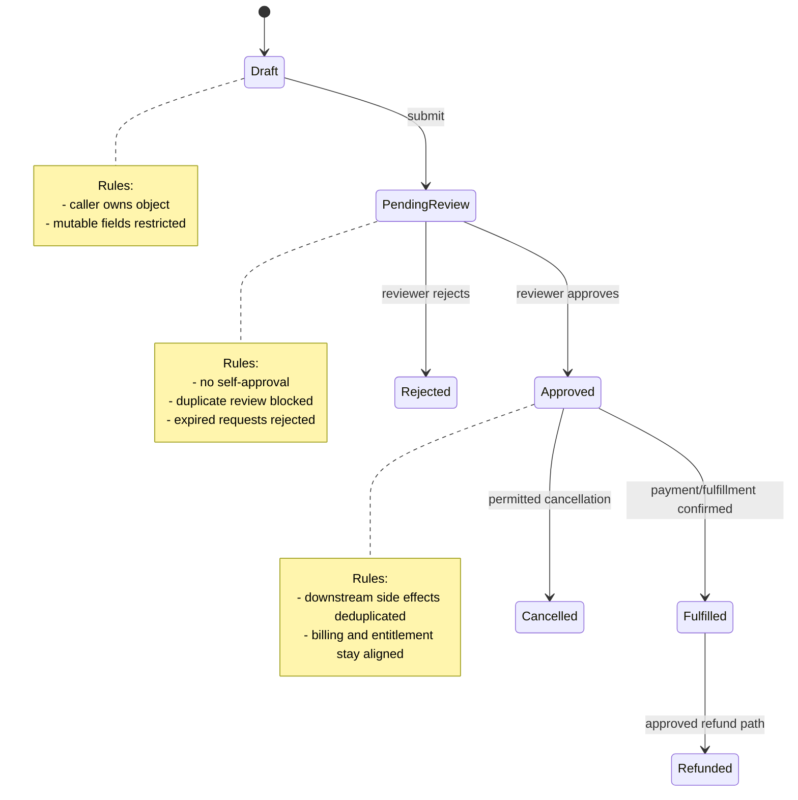
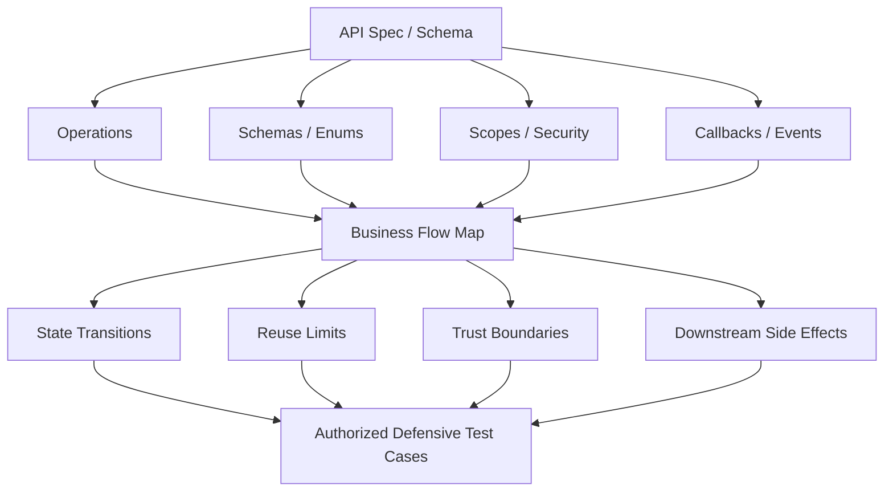

# Business Logic Vulnerabilities

> **Module:** API Pentesting → Advanced Vulnerabilities  
> **Difficulty:** Intermediate → Advanced  
> **Focus:** Understand how APIs expose business workflows, how logic flaws differ from classic technical bugs, and how to assess and defend sensitive flows during **authorized** testing.

---

## Table of Contents

1. [Overview](#1-overview)
2. [Why APIs Are a High-Risk Home for Logic Flaws](#2-why-apis-are-a-high-risk-home-for-logic-flaws)
3. [Where This Fits in API Security](#3-where-this-fits-in-api-security)
4. [Core Mental Model: Rules, State, and Timing](#4-core-mental-model-rules-state-and-timing)
5. [Common API Business Logic Vulnerability Patterns](#5-common-api-business-logic-vulnerability-patterns)
6. [How to Use the API Spec to Find Logic Risk](#6-how-to-use-the-api-spec-to-find-logic-risk)
7. [Authorized Defensive Review Methodology](#7-authorized-defensive-review-methodology)
8. [Prevention and Secure Design Patterns](#8-prevention-and-secure-design-patterns)
9. [Detection and Monitoring Clues](#9-detection-and-monitoring-clues)
10. [How to Report the Finding Clearly](#10-how-to-report-the-finding-clearly)
11. [Key Takeaways](#11-key-takeaways)
12. [References](#12-references)

---

## 1. Overview

A **business logic vulnerability** in an API is a flaw in how the system enforces the rules of a workflow.

The request may be perfectly valid JSON. The endpoint may require authentication. The server may even return a normal `200 OK` or `409 Conflict`. But if the API lets a caller perform an action that should be impossible, restricted, rate-limited, single-use, or state-dependent, the problem is often **business logic**, not syntax or parsing.

In API environments, this matters because APIs often expose the **real control plane** of the application:

- create an order,
- reserve stock,
- apply a credit,
- approve a payout,
- redeem a referral,
- invite a user,
- cancel a booking,
- or trigger a downstream workflow.

That is why logic flaws in APIs often lead to:

- fraud,
- inventory denial,
- privilege misuse,
- quota abuse,
- cross-tenant impact,
- inconsistent billing or entitlement state,
- and hard-to-detect business harm.

> **Important:** This note is for **authorized, defensive security work**. The goal is to model and verify business rules safely, not to abuse production systems or provide step-by-step misuse instructions.

### A concise definition

> **API business logic vulnerabilities occur when the server accepts or mishandles requests that violate intended business rules, state transitions, actor restrictions, reuse limits, or timing assumptions.**

---

## 2. Why APIs Are a High-Risk Home for Logic Flaws

APIs amplify logic risk because they expose workflows in a form that is:

- **direct** — clients call the business operation itself,
- **consistent** — paths, schemas, and tokens are designed for automation,
- **fast** — retries, concurrency, and bulk usage are easy,
- **multi-channel** — web, mobile, partner, internal, and admin clients may all reach the same flow,
- **distributed** — one user action can trigger multiple services and side effects.

### Why API design increases business-flow exposure

| API characteristic | Why it matters for logic flaws | Typical consequence |
| --- | --- | --- |
| **Machine-consumable workflows** | Callers interact with structured business actions, not just pages | Sensitive operations are easy to automate if controls are weak |
| **Multiple client channels** | Web, mobile, partner, and internal APIs may implement the same action differently | One channel can become the weak path |
| **Stateless request model** | The server must reconstruct workflow state correctly on every request | Step skipping or stale-state decisions become more likely |
| **Asynchronous patterns** | Retries, callbacks, queues, and eventual consistency complicate enforcement | Duplicate side effects and replay problems |
| **Documented contracts** | Specs reveal operations, fields, and state clues | Faster mapping of high-value business flows |
| **Service-to-service trust** | Internal and partner routes often assume “trusted caller” | Hidden bypass paths or overbroad authority |

### Diagram — APIs expose business workflows through many entry points

```mermaid
flowchart LR
    WEB[Web Client] --> GW[API Gateway]
    MOB[Mobile App] --> GW
    B2B[Partner / B2B Client] --> GW
    JOB[Background Worker] --> GW

    GW --> ORD[/orders]
    GW --> PAY[/payments]
    GW --> REF[/refunds]
    GW --> APP[/approvals]
    GW --> INV[/invites / referrals]

    ORD --> SVC[Business Services]
    PAY --> SVC
    REF --> SVC
    APP --> SVC
    INV --> SVC

    SVC --> DB[(Primary Data Stores)]
    SVC --> LEDGER[(Ledger / Credits)]
    SVC --> QUEUE[Queue / Event Bus]
    QUEUE --> WH[Webhook / Callback Processing]
```

The more places a workflow can be initiated, retried, resumed, or observed, the more carefully the server must enforce the same core invariant everywhere.

---

## 3. Where This Fits in API Security

Business logic vulnerabilities overlap with several OWASP API categories, but they are not identical to them.

### OWASP API Top 10 context

The clearest OWASP API Security Top 10 alignment is **API6:2023 — Unrestricted Access to Sensitive Business Flows**. That category emphasizes flows that are harmful when excessively or automatically invoked, such as:

- purchases,
- reservations,
- referrals,
- posting/commenting,
- or any action where scale or repetition itself causes harm.

However, API business logic vulnerabilities are **broader** than API6 alone. They also include wrong state transitions, role confusion inside workflows, broken single-use semantics, and mismatches between billing, fulfillment, and entitlement systems.

### Adjacent issues vs business logic

| Issue type | Core question | Example of overlap | What makes business logic distinct |
| --- | --- | --- | --- |
| **BOLA / object-level auth** | Can the caller access this object? | Order belongs to another user | Logic flaws often involve what can happen to a valid object at the wrong time or in the wrong state |
| **BFLA / function-level auth** | Can the caller perform this function? | Non-admin can access approval endpoint | Logic flaws also ask whether the *right* actor can perform the action *under the right conditions* |
| **Mass assignment / property abuse** | Can the caller set fields they should not control? | `role`, `status`, or `discount` accepted from input | The real weakness is often deeper business trust in caller-controlled values |
| **Race conditions** | What happens when requests overlap? | Duplicate apply/redeem/approve requests | Concurrency often becomes one dimension of a larger business rule failure |
| **Improper inventory management** | Are old/hidden versions still reachable? | Deprecated mobile endpoint skips newer checks | Logic flaws often survive in alternate versions and shadow workflows |
| **Unsafe consumption / third-party trust** | Does the app trust external data too much? | Callback changes internal payment state | Business logic risk appears when external inputs can move core workflow state incorrectly |

### Useful mental distinction

- **Authorization flaws** ask: *who may do this?*
- **Logic flaws** ask: *under what business conditions may this happen, how many times, in what order, and with what side effects?*

Both questions usually matter at the same time.

---

## 4. Core Mental Model: Rules, State, and Timing

The most practical way to understand API logic flaws is to treat APIs as **stateful business systems expressed through stateless requests**.

A request does not exist in isolation. It belongs to a flow.

### The seven things to model

| Lens | What to ask | Example |
| --- | --- | --- |
| **Actor** | Who is invoking the flow? | customer, support, admin, service account, partner |
| **Action** | What business capability is being requested? | create, approve, redeem, cancel, refund, transfer |
| **Object** | What business object changes? | order, booking, credit, subscription, invitation |
| **State** | What is the object's current state? | draft, pending, approved, paid, shipped, expired |
| **Rule** | What must always remain true? | total is server-calculated, self-approval is forbidden |
| **Time** | What changes with retries, delays, or overlap? | expiry, cooldown, duplicate callback, race window |
| **Aftermath** | What side effects must also stay correct? | ledger entry, notification, stock release, entitlement update |

### Diagram — the business rule is enforced across transitions, not just endpoints



### What usually goes wrong

A business logic flaw often appears when one or more of these fail:

- the wrong actor can trigger a valid transition,
- the right actor can trigger it in the wrong state,
- the system trusts a client-controlled field that should be derived server-side,
- retries or callbacks cause duplicate side effects,
- alternate channels enforce fewer checks,
- or one service updates state while another forgets to update the aftermath.

---

## 5. Common API Business Logic Vulnerability Patterns

The patterns below are especially common in APIs because business actions are explicit and highly automatable.

### 5.1 Trust in caller-controlled business values

The server should almost never trust a client-supplied value for:

- `price`,
- `discount`,
- `total`,
- `balance`,
- `role`,
- `status`,
- `entitlement`,
- `approvedBy`,
- or any field that represents a **decision** rather than a simple input.

#### Safe illustrative example

```http
POST /api/orders HTTP/1.1
Content-Type: application/json
Authorization: Bearer <token>

{
  "items": [
    { "sku": "PRO-PLAN", "quantity": 1 }
  ],
  "discountCode": "SPRING25",
  "total": 1.00,
  "status": "paid"
}
```

A secure API should treat `total` and `status` as **non-authoritative**. The server should:

- derive price and discounts from trusted data,
- calculate the total itself,
- ignore or reject writable workflow-state fields,
- and bind payment status to verified payment events instead of request input.

### 5.2 Workflow bypass: skipping, repeating, or reordering steps

Many APIs expose multi-step flows such as:

- signup → verify → activate,
- cart → checkout → pay → fulfill,
- request → approve → execute,
- invite → accept → provision.

If the server validates only the current endpoint and not the full workflow context, it may allow:

- step skipping,
- duplicate completion,
- reversal of required order,
- or completion from stale intermediate state.

### 5.3 Broken single-use, quota, or limit semantics

This is one of the most important API-specific logic areas and closely matches **OWASP API6:2023**.

Examples of sensitive flows that need business-aware limits:

- coupon redemption,
- referral credit creation,
- seat reservation,
- account creation,
- posting/commenting,
- payout initiation,
- password-reset issuance,
- or export/report generation.

The key question is not just *“is there rate limiting?”* but:

> **Does the API enforce the business meaning of the limit?**

For example:

- one refund per order,
- one bonus per legitimate referral,
- one reservation per scarce resource slot,
- one approval by an eligible reviewer,
- or one callback effect per external event.

### 5.4 Approval and separation-of-duties failures

Many high-impact workflows assume that the user who initiates an action cannot also approve or finalize it.

Examples:

- expense approval,
- account recovery override,
- privilege escalation request,
- payout release,
- subscription override,
- or support-assisted identity changes.

The flaw is not always “missing admin auth.” Sometimes the actor is privileged enough to reach the endpoint, but the server forgets to enforce **business separation of duties** such as:

- approver must differ from requester,
- approver must belong to a different team,
- threshold approvals require two distinct actors,
- or delegated actions must be scoped and logged.

### 5.5 Asynchronous side effects, replay, and idempotency gaps

Modern APIs often rely on:

- payment callbacks,
- webhook deliveries,
- job retries,
- message queues,
- partner callbacks,
- or mobile/offline retry behavior.

When the system lacks proper deduplication or event authenticity, valid-looking repeated requests can create repeated outcomes.

#### Safe illustrative example

```http
POST /api/payment-callbacks/provider HTTP/1.1
Content-Type: application/json
X-Signature: <provider-signature>

{
  "event_id": "evt_12345",
  "transaction_id": "txn_9912",
  "status": "settled",
  "order_id": "ord_447"
}
```

A secure design should verify:

- the signature,
- the source and timestamp requirements,
- whether `event_id` has already been processed,
- whether the transition to `settled` is valid from the current order state,
- and whether downstream fulfillment is also idempotent.

### 5.6 Cross-channel or cross-version inconsistency

A mature product may expose the same business action through:

- a web frontend API,
- a mobile-specific API,
- a partner/B2B API,
- an internal service endpoint,
- or an older version kept for compatibility.

If one path has weaker checks, the workflow can become inconsistent.

Common red flags:

- deprecated endpoints still active,
- mobile endpoints accepting fields rejected by web endpoints,
- internal APIs assuming trusted callers without full authorization,
- version drift between `/v1` and `/v2` business rules.

### 5.7 Tenant, delegated-action, and identity-context confusion

In multi-tenant systems, business logic often depends on **which tenant, workspace, merchant, or organization** an action belongs to.

Typical failure themes:

- tenant context taken from a mutable request field instead of the authenticated identity,
- support/impersonation features not tightly scoped,
- partner actions crossing customer boundaries,
- service accounts allowed to perform human-only transitions,
- or parent/child account rules applied inconsistently.

### 5.8 Billing, entitlement, and lifecycle drift

APIs frequently split billing, access, and product state across different services.

That creates subtle logic risk when one system says:

- “paid,”
- another says “active,”
- another says “refunded,”
- and another still serves premium functionality.

This pattern often appears in:

- subscription downgrades,
- trial expiry,
- refunds and reversals,
- credit issuance,
- cancel-and-reactivate flows,
- or partial failure during provisioning.

### Summary table — common patterns and defensive questions

| Pattern | Primary risk | Defensive question |
| --- | --- | --- |
| Caller-controlled business fields | Fraud, privilege misuse, inconsistent state | Does the server derive sensitive values from trusted sources? |
| Workflow bypass | Unauthorized completion of a flow | Does each transition verify required prior state? |
| Broken single-use or quotas | Automated business abuse | Is the limit enforced per business object and actor, not just per IP? |
| Separation-of-duties failure | Unauthorized approvals or overrides | Does the workflow require distinct eligible actors? |
| Replay / idempotency gaps | Duplicate fulfillment, duplicate credits, repeated callbacks | Are retries and callbacks safely deduplicated? |
| Cross-channel inconsistency | Weak alternate path | Do all channels enforce the same core business invariants? |
| Tenant/context confusion | Cross-tenant impact | Is tenant scope derived from trusted identity and policy? |
| Billing/entitlement drift | Revenue loss or lingering access | Are state changes reconciled across dependent services? |

---

## 6. How to Use the API Spec to Find Logic Risk

A good API specification is not just documentation. It is a **workflow map**.

Whether the team uses OpenAPI, Swagger, GraphQL schema docs, or internal interface definitions, the spec can reveal:

- what operations exist,
- who can call them,
- which fields are caller-controlled,
- what states appear in schemas,
- what async callbacks exist,
- and where alternate routes or versions may hide.

### What to extract from the spec

| Spec artifact | What it can reveal | What to ask |
| --- | --- | --- |
| **Paths + methods** | Workflow steps and alternate routes | Which operations create, approve, redeem, cancel, or refund? |
| **Tags / operationId** | Business grouping | Which endpoints belong to the same flow? |
| **Request schemas** | User-controlled inputs | Which fields must be ignored, recomputed, or tightly validated server-side? |
| **Response schemas** | State and authority clues | Do objects expose `status`, `role`, `balance`, `limit`, `remainingUses`? |
| **Enums** | Hidden state machine | Which transitions should be impossible? |
| **Security schemes / scopes** | Intended actor model | Are there different rights for initiate, approve, reverse, and override? |
| **Headers** | Idempotency and concurrency hints | Are `Idempotency-Key`, version headers, or conditional writes used? |
| **Callbacks / webhooks** | Async trust boundaries | Are replay defenses and signature requirements documented? |
| **Status codes** | Expected defensive behavior | Do invalid transitions produce `409`, `422`, or only generic success/failure? |
| **Deprecated endpoints** | Legacy workflow paths | Can older routes bypass newer rules? |

### Diagram — from spec to logic test cases



### Small OpenAPI-style fragment

```yaml
paths:
  /orders:
    post:
      operationId: createOrder
  /orders/{id}/pay:
    post:
      operationId: payOrder
  /orders/{id}/cancel:
    post:
      operationId: cancelOrder
  /orders/{id}/refund:
    post:
      operationId: refundOrder
components:
  schemas:
    Order:
      type: object
      properties:
        status:
          type: string
          enum: [draft, pending_payment, paid, fulfilled, cancelled, refunded]
        total:
          type: number
        discountCode:
          type: string
```

Even this minimal fragment should trigger high-value questions:

- Is `refund` allowed only after `paid` or `fulfilled`?
- Can `cancel` and `refund` race or conflict?
- Is `total` always derived server-side?
- Is `discountCode` single-use, per-user, per-order, or campaign-limited?
- Are retries safe on `pay` and `refund`?
- Are legacy or partner endpoints enforcing the same state model?

---

## 7. Authorized Defensive Review Methodology

Business logic work is strongest when it is **modeled first** and **validated second**.

### Step 1: Identify the sensitive flows

Prioritize workflows where misuse can directly harm the business, such as:

- payment,
- refunds,
- payouts,
- reservations,
- credits and rewards,
- referrals,
- approvals,
- account recovery,
- bulk creation/export,
- and privileged delegation.

### Step 2: Draw the happy path

Document the intended sequence clearly:

```text
register → verify → create order → pay → fulfill → refund (if policy allows)
```

If the team cannot explain the happy path unambiguously, it is unlikely that the server enforces it consistently.

### Step 3: List the invariants

Examples of invariants:

- unpaid orders must not become fulfilled,
- credits must not be issued twice for the same business event,
- self-approval must be impossible,
- tenant boundaries must not be caller-selectable,
- one external event must produce one internal outcome,
- and entitlement must match billing state.

### Step 4: Test alternate paths safely

For each flow, verify that the server handles:

- skipped steps,
- repeated steps,
- reordered steps,
- stale tokens or stale state,
- concurrent retries,
- failed rollbacks,
- async callbacks,
- and cross-channel equivalents.

### Step 5: Verify aftermath and reconciliation

The immediate response is only part of the truth.

Check whether the flow also leaves correct downstream state in:

- ledgers,
- inventory,
- queues,
- user entitlements,
- notifications,
- analytics,
- and audit records.

### Step 6: Look for abuse resistance, not just correctness

OWASP API6 emphasizes that some business flows are dangerous when **excessively used**, even if each individual request is syntactically valid.

That means reviewing:

- business-aware rate limits,
- quotas,
- one-time semantics,
- velocity checks,
- friction for automation where appropriate,
- and per-object/per-user/per-tenant controls.

### Defensive review checklist

| Review area | What “good” looks like |
| --- | --- |
| **State validation** | Invalid transitions are rejected explicitly |
| **Integrity enforcement** | Sensitive values are recalculated server-side |
| **Role and duty separation** | Initiator/approver constraints are enforced in the workflow |
| **Idempotency** | Safe retry behavior for writes and async callbacks |
| **Limit enforcement** | Business limits are tied to the right actor and object |
| **Channel consistency** | Web, mobile, partner, and internal routes enforce the same invariant |
| **Telemetry** | Anomalous repeats, conflicts, and state gaps are logged meaningfully |
| **Reconciliation** | Background jobs detect and repair cross-service drift |

---

## 8. Prevention and Secure Design Patterns

The best defense is to encode business rules as explicit, testable server-side policy.

### High-value controls

| Control | Why it helps |
| --- | --- |
| **Authoritative server-side calculations** | Prevents trust in client-supplied totals, discounts, balances, or state |
| **Explicit state machines** | Makes invalid transitions rejectable and reviewable |
| **Centralized authorization and policy checks** | Reduces inconsistent behavior across channels and services |
| **Separation of public and internal models** | Keeps sensitive fields out of user-controlled schemas |
| **Idempotency keys and dedupe stores** | Prevents duplicate outcomes from retries and replays |
| **Signed callbacks with event identifiers** | Protects async transitions and supports replay detection |
| **Business-aware quotas** | Limits harmful overuse of sensitive flows, not just raw requests |
| **Immutable ledger or audit events** | Preserves financial and workflow integrity |
| **Reconciliation jobs** | Detects drift between payment, entitlement, inventory, and fulfillment systems |
| **Abuse-case-driven tests** | Verifies misuse scenarios, not just the happy path |

### Secure design principles

1. **Treat business decisions as server authority, not client input.**  
   The client may propose; the server must decide.

2. **Model the workflow explicitly.**  
   If a transition is not allowed on paper, it should not be silently possible in code.

3. **Bind business actions to identity, object ownership, and current state.**  
   “Authenticated” is not enough.

4. **Design for retries and failure.**  
   Every external callback and every write path should have a duplicate-handling story.

5. **Assume alternate channels exist.**  
   Legacy, mobile, partner, and internal APIs must follow the same invariant set.

6. **Instrument for business anomalies.**  
   A logic flaw often looks like valid traffic until you compare it against expected workflow behavior.

### A simple secure-processing pattern

```text
Client request
  ↓
Authenticate caller
  ↓
Resolve trusted actor + tenant context
  ↓
Load current object state
  ↓
Evaluate workflow policy and invariants
  ↓
Derive sensitive values server-side
  ↓
Perform one idempotent state transition
  ↓
Record audit / ledger / event outcome
  ↓
Return response
```

If any one of those steps is weak, business logic integrity becomes fragile.

---

## 9. Detection and Monitoring Clues

Logic flaws are difficult to detect with payload signatures because requests often look normal. Defenders need **business-aware telemetry**.

### High-signal detection clues

| Signal | Why it matters |
| --- | --- |
| **Impossible transitions** | Example: fulfillment without settled payment |
| **Repeated “single-use” actions** | Suggests broken reuse limits or deduplication |
| **Rapid create/cancel/retry loops** | Often indicates automation against a sensitive flow |
| **Duplicate external event IDs** | Strong replay or retry signal |
| **Mismatch between billing and entitlement state** | Indicates lifecycle drift |
| **High conflict rates on reservation or approval objects** | Suggests concurrency or workflow abuse pressure |
| **State changes via deprecated or alternate endpoints** | Points to channel inconsistency |
| **Sensitive actions lacking expected audit context** | Suggests hidden path or weak control enforcement |
| **Actor approving their own request** | Direct separation-of-duties failure |
| **Cross-tenant anomalies in shared flows** | Can indicate context derivation problems |

### Operational lesson

If you can describe the business invariant, you can usually log for its violation.

Examples:

- one payment event should map to one ledger effect,
- one reservation should hold one scarce slot for one bounded time window,
- one approved refund should not exceed the captured amount,
- one referral event should produce one reward under documented conditions.

---

## 10. How to Report the Finding Clearly

Business logic findings are easy to dismiss if the broken rule is not described precisely.

A strong report should capture:

1. **The intended workflow**  
   What the business expected to happen.

2. **The violated invariant**  
   The rule that should always remain true.

3. **The affected actors and scope**  
   Which roles, tenants, products, or channels are involved.

4. **The actual server behavior**  
   What state change or business outcome occurred incorrectly.

5. **The business impact**  
   Fraud, inventory denial, credit inflation, unauthorized approval, lingering entitlement, or cross-tenant harm.

6. **Why this is server-side**  
   Show that the backend, not just the UI, failed to enforce the rule.

7. **Recommended fixes**  
   State-machine enforcement, idempotency, authoritative calculations, channel consistency, separation-of-duties checks, or reconciliation.

### Simple reporting template

| Element | Good example |
| --- | --- |
| **Finding title** | API workflow allows refund transition without required settled-payment state |
| **Broken rule** | Refunds must only be possible for settled, eligible orders |
| **Affected flow** | Order lifecycle across checkout, payment callback, and refund endpoints |
| **Impact** | Financial integrity loss and inconsistent ledger state |
| **Evidence** | Order moved to refund-eligible state without required preconditions |
| **Fix direction** | Enforce explicit transition rules and idempotent callback handling |

---

## 11. Key Takeaways

- APIs expose **workflows**, not just data.
- Business logic flaws are usually about **rules, states, limits, timing, and side effects**.
- **OWASP API6:2023** is especially relevant when sensitive flows can be excessively or automatically invoked.
- The **API spec** is one of the best sources for reconstructing business workflows and hidden invariants.
- Good defenses combine **server-side authority**, **explicit state transitions**, **idempotency**, **business-aware limits**, and **reconciliation**.
- Good detection focuses on **business anomalies**, not just malicious-looking payloads.

> **If you remember only one thing:** the safest way to analyze API business logic is to ask what the workflow must always guarantee — then verify the server enforces that guarantee across every channel, state, retry, and side effect.

---

## 12. References

- [OWASP API Security Top 10 2023 — API6: Unrestricted Access to Sensitive Business Flows](https://owasp.org/API-Security/editions/2023/en/0xa6-unrestricted-access-to-sensitive-business-flows/)
- [PortSwigger Web Security Academy — Business Logic Vulnerabilities](https://portswigger.net/web-security/logic-flaws)
- [OWASP Web Security Testing Guide — Business Logic Testing](https://github.com/OWASP/wstg/tree/master/document/4-Web_Application_Security_Testing/10-Business_Logic_Testing)
- [OWASP Automated Threats to Web Applications Project](https://owasp.org/www-project-automated-threats-to-web-applications/)
- [OWASP Threat Modeling Cheat Sheet](https://cheatsheetseries.owasp.org/cheatsheets/Threat_Modeling_Cheat_Sheet.html)
- [OWASP Abuse Case Cheat Sheet (Historical)](https://cheatsheetseries.owasp.org/cheatsheets/Abuse_Case_Cheat_Sheet.html)
