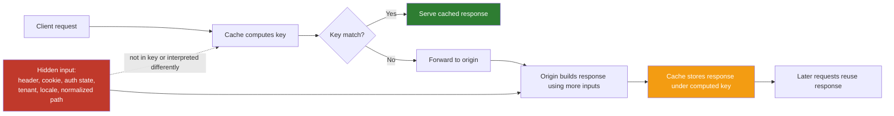
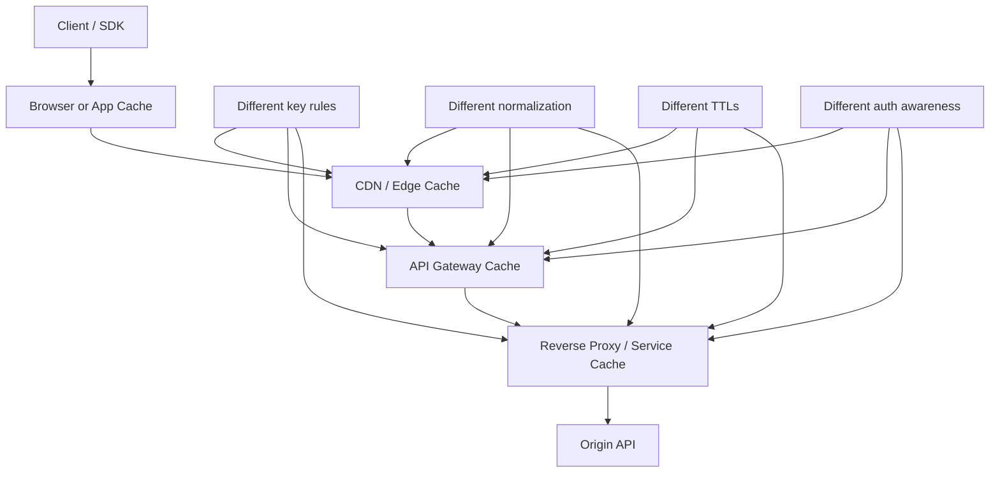
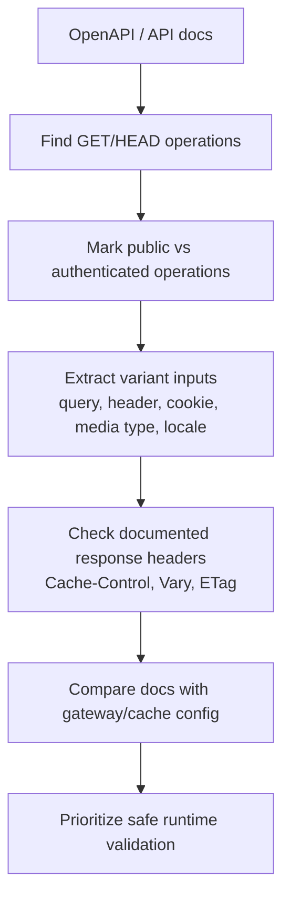

# Cache Poisoning and Cache Confusion

> **Difficulty:** Intermediate → Advanced | **Category:** API Pentesting — Advanced Vulnerabilities  
> **Focus:** Understand how caches become a security boundary in front of APIs, how **cache confusion** creates the conditions for **cache poisoning** and cross-user data leaks, and how to assess and harden this safely during **authorized** testing.

**Cache poisoning** is the act of getting an unsafe or wrong response stored and replayed from a cache.  
**Cache confusion** is the deeper design failure: the cache and origin disagree about what makes two requests “the same,” which audience a response belongs to, or which representation should be reused.

That distinction matters in API security because many modern APIs sit behind:

- CDNs
- API gateways
- reverse proxies
- service-mesh sidecars
- browser or mobile caches
- framework-level response caches

Teams often think of caches as a **performance feature**. In practice, they are also a **trust and isolation feature**. If a cache mixes tenants, authentication states, languages, versions, or representations incorrectly, the result can be:

- wrong data returned to the wrong caller
- stale or misleading API behavior
- broken client parsing due to wrong media types
- persistent delivery of unsafe content or links
- cross-tenant or cross-user information leakage

This note follows the project guidance in `remember.txt`: start simple, go deep, keep it memorable, and use diagrams where they help. It also uses an **API-spec-first** review mindset: before you send traffic, read the OpenAPI or API documentation and decide which responses are even *supposed* to be cacheable.

---

## Table of Contents

1. [Why This Matters in API Security](#1-why-this-matters-in-api-security)
2. [Mental Model — Poisoning Is the Outcome, Confusion Is the Cause](#2-mental-model--poisoning-is-the-outcome-confusion-is-the-cause)
3. [Poisoning vs Confusion vs Deception](#3-poisoning-vs-confusion-vs-deception)
4. [Why APIs Are Especially Exposed](#4-why-apis-are-especially-exposed)
5. [What To Review in the API Spec First](#5-what-to-review-in-the-api-spec-first)
6. [Common Failure Patterns](#6-common-failure-patterns)
7. [Safe Authorized Validation Workflow](#7-safe-authorized-validation-workflow)
8. [Detection and Triage](#8-detection-and-triage)
9. [Defensive Architecture and Mitigations](#9-defensive-architecture-and-mitigations)
10. [Key Takeaways](#10-key-takeaways)
11. [Public References](#11-public-references)

---

## 1. Why This Matters in API Security

Caching is normal in API delivery.

Even if an application team says “our API is dynamic,” that usually only means **the origin generates responses dynamically**. It does **not** mean those responses are never cached by:

- a CDN at the edge
- an API gateway with response caching enabled
- a reverse proxy like Nginx or Varnish
- a browser or mobile SDK cache
- a service worker or app-side offline cache
- a framework or microservice sidecar cache

### Why this becomes a security issue

RFC 9111 distinguishes between **private caches** and **shared caches**. MDN makes the practical consequence very clear: if personalized content reaches a shared cache, other users may receive it unless the response is marked appropriately, typically with `Cache-Control: private` or `no-store` depending on the design.

That means cache mistakes are often really **audience mistakes**:

| Question | Safe answer | Dangerous answer |
| --- | --- | --- |
| Who is this response for? | One caller or one well-defined public audience | “Anyone who hits the same cache key” |
| What defines the response variant? | Explicit, documented inputs | Hidden headers, cookies, routing metadata, or normalization quirks |
| How long may it be reused? | TTL chosen for the business risk | Long freshness for semi-dynamic or personalized data |
| What happens on error or staleness? | Predictable revalidation or explicit bypass | Silent reuse across auth state, tenant, locale, or media type |

### API-specific impact patterns

| API scenario | What goes wrong | Security consequence |
| --- | --- | --- |
| Public catalog/search endpoints | Cache ignores locale, format, or version inputs | Wrong representation or stale data delivered widely |
| Authenticated profile/account endpoints | Shared cache stores personalized JSON | Cross-user data exposure |
| Multi-tenant APIs | Tenant selector influences origin but not cache key | Cross-tenant leakage |
| Hypermedia or docs endpoints | Untrusted header influences generated links or hostnames | Clients follow incorrect or attacker-influenced links |
| Content-negotiated APIs | Cache ignores `Accept` or `Accept-Language` | Clients receive unexpected media type or language variant |
| Mixed public/private endpoints behind one gateway | One cache rule applied too broadly | Private responses reused publicly |

> **If you remember one sentence, remember this:**  
> **Caches do not just speed up APIs — they decide who can safely reuse which response.**

---

## 2. Mental Model — Poisoning Is the Outcome, Confusion Is the Cause

A useful way to think about these issues is:

> **Cache confusion happens when the cache and the origin disagree about request identity or audience. Cache poisoning is what happens when that disagreement gets something wrong stored and replayed.**



### The key idea

The origin may use information such as:

- `Authorization`
- cookies
- `Accept` / `Accept-Language`
- tenant or region headers
- forwarded host/proto headers
- query parameters after normalization
- path decoding or routing rules
- framework-generated absolute URLs

But the cache may key on only a smaller subset, often something like:

- method
- host
- path
- query string
- maybe selected headers

If the origin uses **more** information than the cache uses, or interprets it differently, then different logical requests can collide into the same cached object.

### A compact glossary

| Term | Meaning | Why it matters |
| --- | --- | --- |
| **Cache key** | The request components a cache uses to identify an object | If the key is too small or inconsistent, wrong responses collide |
| **Unkeyed input** | A request component that affects the origin response but not the cache key | Common root cause of poisoning and confusion |
| **Variant** | A legitimate alternate representation of the same resource | Must be separated with keying or `Vary` |
| **Normalization** | Canonicalizing inputs before matching or forwarding | Safe when consistent, dangerous when edge and origin differ |
| **Freshness** | How long a cached response may be reused without revalidation | Long freshness can magnify security mistakes |
| **Revalidation** | Checking whether a cached response is still valid | Good for consistency, not a fix for wrong audience selection |

### Why `Vary` matters

RFC 9111 defines `Vary` as the mechanism that tells caches which request headers affected response selection. MDN and Fastly both stress the practical point: if a response depends on request headers, caches need to know that.

But there is an equally important defensive nuance:

> **`Vary` only helps when the response is legitimately cacheable in the first place.**

If a response is personalized or security-sensitive, the correct answer is often:

- do **not** put it in a shared cache at all
- mark it `private` or `no-store`
- or bypass caching at the gateway/CDN for that route

---

## 3. Poisoning vs Confusion vs Deception

These terms are related but not identical.

| Term | Core idea | Typical root cause | Typical outcome |
| --- | --- | --- | --- |
| **Cache poisoning** | Wrong or unsafe content becomes cached and replayed | Unsafe use of unkeyed input plus cacheable response | Other users receive a bad response |
| **Cache confusion** | Cache and origin disagree about request identity, variant selection, or audience | Key mismatch, header/path/query normalization differences, auth-state mistakes | Wrong response reused for the wrong requests |
| **Cache deception** | Sensitive dynamic content is tricked into being cached as if it were static | Cache rules and origin routing disagree about what is cacheable | Attacker later retrieves private content |

PortSwigger’s cache-deception material is especially helpful for the distinction:

- **poisoning** is usually about getting the cache to store a bad or attacker-influenced response
- **deception** is about getting the cache to store sensitive content it should never have cached
- **confusion** is a broader way to reason about the mismatch that often enables both

### Easy memory rule

```text
Poisoning = bad thing cached
Confusion = why it got mixed up
Deception = private thing cached as if it were public
```

### Security framing for APIs

For API defenders, “cache confusion” is often the better review lens because it asks:

1. **Which inputs change the response?**
2. **Which of those inputs are in the cache key?**
3. **Which of those inputs are documented in the API spec?**
4. **Which audiences are allowed to share a response?**

That lens catches more real API issues than focusing only on classic browser-oriented cache poisoning examples.

---

## 4. Why APIs Are Especially Exposed

APIs have several design habits that increase cache risk.

### 4.1 Header-driven behavior is common

APIs frequently vary behavior based on headers such as:

- `Accept`
- `Accept-Language`
- `Authorization`
- `Origin`
- `X-Tenant-ID`
- `X-Region`
- `X-API-Version`
- `Prefer`
- forwarding or gateway headers

The more behavior depends on headers, the more careful the cache policy must be.

### 4.2 “It’s JSON” creates false confidence

Teams often assume cache poisoning is mainly about HTML pages and browsers.

That is too narrow.

A JSON API can still be severely affected if the cache replays:

- another user’s account object
- the wrong tenant’s records
- a different media type than the client expects
- an incorrect pagination link or base URL
- outdated authorization-sensitive state
- stale feature flags or pricing decisions

### 4.3 APIs often have mixed public and private routes side by side

A gateway may front all of these on the same hostname:

- `/v1/catalog` — public and safely cacheable
- `/v1/search` — semi-dynamic, maybe cacheable with care
- `/v1/me/profile` — personalized and not shareable
- `/v1/admin/reports` — sensitive and not shareable
- `/docs/openapi.json` — public or partner-visible but still variant-sensitive

If the cache policy is route-blind or too coarse, mistakes spread quickly.

### 4.4 Multi-layer caching increases disagreement risk



Every extra layer can disagree on:

- what headers matter
- whether query order matters
- whether to decode URL characters before matching
- whether auth state disables caching
- whether stale responses may be reused
- how purges happen

### 4.5 API clients are strict about representations

Web browsers are tolerant. API clients often are not.

If an API client expects `application/json` version 2 but receives:

- CSV
- the wrong JSON schema
- another locale
- another tenant’s object IDs
- a stale ETag or validator chain

the result can be:

- parsing failures
- business logic errors
- hidden data leaks
- misleading automation
- dangerous downstream actions in other systems

### 4.6 Common API design patterns that deserve scrutiny

| Pattern | Why it raises cache-review priority |
| --- | --- |
| `GET` endpoints with user-specific output | Risk of shared-cache leakage |
| Tenant selection in request headers | Easy to omit from keying or trust too broadly |
| Content negotiation (`Accept`, locale, format) | Requires correct variant management |
| Absolute URLs generated from request metadata | Untrusted host/proto inputs can taint links |
| Long-lived GET responses with `stale-while-revalidate` | Wrong variants can persist longer than expected |
| Version negotiation in headers | Cache may ignore a dimension the origin treats as critical |
| Mixed static/docs and dynamic/account paths on one host | Static-oriented cache rules can overreach |

---

## 5. What To Review in the API Spec First

Before runtime testing, read the API specification.

The OpenAPI Specification gives you a structured map of:

- paths and methods
- parameters in path/query/header/cookie
- request and response media types
- security schemes
- documented response headers
- versioning hints

That matters because cache risk usually begins with a simple question:

> **Which operations are supposed to be shared-cacheable, and which must never be reused across callers?**

### Spec-first review workflow



### Example OpenAPI snippet

```yaml
openapi: 3.1.0
info:
  title: Example Commerce API
  version: 1.0.0
paths:
  /v1/catalog/items:
    get:
      summary: List public catalog items
      parameters:
        - in: query
          name: locale
          schema:
            type: string
            enum: [en, fr, de]
        - in: query
          name: format
          schema:
            type: string
            enum: [json, csv]
      responses:
        '200':
          description: Public item list
          headers:
            Cache-Control:
              schema:
                type: string
              example: public, s-maxage=60, stale-while-revalidate=30
            Vary:
              schema:
                type: string
              example: Accept-Encoding, Accept-Language
            ETag:
              schema:
                type: string
  /v1/me/profile:
    get:
      summary: Get the current user's profile
      security:
        - bearerAuth: []
      responses:
        '200':
          description: Personalized profile
          headers:
            Cache-Control:
              schema:
                type: string
              example: private, no-store
components:
  securitySchemes:
    bearerAuth:
      type: http
      scheme: bearer
      bearerFormat: JWT
```

### What this immediately tells a reviewer

| Spec clue | Why it matters for cache review |
| --- | --- |
| `GET /v1/catalog/items` is public | Candidate for shared caching if variants are controlled correctly |
| `locale` and `format` influence the representation | Cache key or variant handling must account for them |
| `Vary` mentions `Accept-Language` and `Accept-Encoding` | Good sign, but verify runtime behavior matches the docs |
| `GET /v1/me/profile` requires bearer auth | Strong signal that shared caching should be disabled |
| `Cache-Control: private, no-store` on profile | Spec expresses correct audience boundary |

### High-signal spec clues to flag

| Spec field or pattern | Why it deserves attention |
| --- | --- |
| Public `GET` or `HEAD` routes with `Cache-Control` examples | Shared caching is intentional; validate it carefully |
| Authenticated `GET` routes | Confirm they are private or bypass shared caches |
| Header parameters like `X-Tenant-ID`, `X-Region`, `X-API-Version` | Variant or routing signals are easy to miss in cache design |
| `format`, `locale`, `fields`, `expand`, `view` query parameters | Representation may change materially across callers |
| Multiple response media types | Cache must not mix JSON, CSV, HTML, or vendor-specific versions |
| `securitySchemes` plus cacheable-looking routes | Check for auth/cache policy conflicts |
| Documented `ETag`, `Last-Modified`, `stale-while-revalidate`, `stale-if-error` | Caching behavior is deliberate and can prolong mistakes |

### Important OpenAPI nuance

Some security-relevant inputs are not obvious if you only read `parameters[]`:

- `Authorization` is usually described via `securitySchemes`
- media type selection often appears in request/response `content`
- variant behavior may be implied in prose or examples rather than formal schema

So a cache review should compare:

- **formal spec fields**
- **example requests and responses**
- **gateway/CDN configuration**
- **live headers**

A good spec helps. It does not prove safety.

---

## 6. Common Failure Patterns

Most real API cache issues are design-pattern problems, not magic tricks.

### 6.1 Unkeyed header influences a cacheable response

A classic pattern is:

- the origin uses a request header to build part of the response
- the cache does not consider that header part of the object identity
- the response is shared-cacheable

In APIs, the dangerous response change may be subtle rather than browser-visible.

Examples include:

- generated pagination links
- absolute URLs in hypermedia responses
- OpenAPI server URLs or docs links
- region-specific endpoints
- content negotiation behavior

#### Risky pattern

```http
GET /v1/docs HTTP/1.1
Host: api.example.test
X-External-Host: docs.partner.example
```

```json
{
  "openapi": "/openapi.json",
  "servers": [
    "https://docs.partner.example"
  ]
}
```

If `X-External-Host` changes the response but is not safely trusted or keyed, a shared cache can replay the wrong server metadata to other clients.

#### Safer design

- derive public hostnames from trusted deployment config, not user input
- strip or overwrite untrusted forwarding-style headers at the edge
- if a legitimate variant depends on a request header, document it and manage it explicitly with `Vary` or equivalent cache-key configuration

### 6.2 Auth-state confusion on personalized endpoints

This is one of the highest-impact API cases.

MDN notes that `private` should be used for personalized content, and `no-store` prevents storage entirely. It also clarifies an important point:

> **`no-cache` does not mean “do not store.”** It means “store, but revalidate before reuse.”

That is a critical API lesson.

If a personalized JSON response is put in shared cache with `no-cache`, that may still be a problem because the object can be stored at all.

#### Risky pattern

```http
HTTP/1.1 200 OK
Cache-Control: public, max-age=120
Content-Type: application/json
```

```json
{
  "userId": "u-1042",
  "email": "alice@example.test",
  "plan": "enterprise"
}
```

If that response came from `GET /v1/me/profile`, the cache policy is fundamentally wrong.

#### Safer pattern

```http
HTTP/1.1 200 OK
Cache-Control: private, no-store
Content-Type: application/json
```

Even when a shared cache supports auth-aware keying, the safer default for personalized API responses is usually:

- no shared caching
- explicit private/no-store policy
- separate public and authenticated hosts or path classes if necessary

### 6.3 Representation confusion through `Accept`, `Accept-Language`, or `format`

RFC 9111 and MDN both make `Vary` central to representation selection. Fastly’s guidance adds an important operational point: if you vary on high-cardinality headers without normalization, you may create too many variants or still deliver the wrong content if the origin and cache normalize differently.

In APIs, representation confusion often looks like:

- JSON vs CSV export
- versioned vendor media types
- localized error messages or enum labels
- compressed vs uncompressed variants
- legacy vs new schema selected by header

#### Example

| Request dimension | Origin behavior | Cache risk if ignored |
| --- | --- | --- |
| `Accept: application/json` vs `text/csv` | Different media type and body format | Client gets an invalid representation |
| `Accept-Language: en` vs `fr` | Localized payload or docs | Wrong locale reused for other callers |
| `X-API-Version: 2025-06` | Different field set | Older or newer schema replayed |
| `format=compact` | Different response shape | Parsers and automation break |

#### Safer design

- prefer explicit URL versioning for security-sensitive variants when practical
- use `Vary` for every request header that truly changes the representation
- normalize high-cardinality inputs before the cache sees them
- avoid relying on raw `User-Agent` or `Cookie` as cache-variant selectors unless you fully control and normalize them

### 6.4 Tenant or region context omitted from the cache key

This is especially dangerous in B2B and internal APIs.

A service may select data based on:

- `X-Tenant-ID`
- `X-Org-ID`
- `X-Region`
- upstream identity headers injected by the gateway
- API keys mapped to tenant context

If the origin uses tenant context but the cache does not separate objects by that same context, responses can cross tenant boundaries.

#### Risky mental model

```text
Cache thinks: GET /v1/invoices?page=1 is one object
Origin thinks: GET /v1/invoices?page=1 depends on tenant, authz, and region
```

#### Safer design

- derive tenant context from the authenticated identity whenever possible
- avoid client-controlled tenant selectors on shared-cacheable routes
- if tenant-specific responses must be cached, isolate them by explicit, trusted cache partitioning rather than hope a generic key is “close enough”
- keep tenant-scoped APIs on separate hostnames or path partitions where feasible

### 6.5 Path and query normalization mismatches

PortSwigger’s cache-entanglement research is valuable here: caches and origins often parse or normalize paths and query strings differently.

That disagreement can include:

- URL decoding before or after key calculation
- duplicate query parameters
- ignored empty parameters
- query parameter order
- semicolon or matrix-parameter handling
- dot-segment resolution
- double slashes
- encoded slashes or delimiters
- trailing slash behavior

#### Why this matters in APIs

Many API routers treat these details semantically.

For example:

- one layer may consider two URLs equivalent
- another may route them differently
- a cache may collapse variants the origin considers distinct
- or a cache may consider them distinct while the origin treats them as the same resource, breaking purge assumptions

#### Safer design

- canonicalize URLs once, consistently, before both cache lookup and origin routing
- reject ambiguous or non-canonical encodings instead of “helpfully” accepting them
- define query-parameter handling explicitly, including duplicates and order if relevant
- ensure purge logic uses the same canonical form as cache lookup

### 6.6 Cacheability confusion between static-looking and dynamic routes

This is where cache deception and API delivery can overlap.

A cache may apply overly broad rules such as:

- “cache anything under `/assets`”
- “cache anything ending in `.json`”
- “cache docs and export routes because they look static”

But the origin may return dynamic, authenticated, or tenant-specific data at those routes.

#### Typical API examples

| Route style | Why teams misclassify it |
| --- | --- |
| `/v1/export/report.csv` | Looks like a static file but may be user-specific |
| `/docs/openapi.json` | Looks public but can contain environment- or partner-specific URLs |
| `/v1/profile/avatar.png` | Looks static but may be access-controlled |
| `/tenant/acme/config.json` | Looks like config but may be tenant-private |

#### Safer design

- classify cacheability by **audience and data sensitivity**, not by file extension or path aesthetics
- separate static asset delivery from API delivery where possible
- do not let “looks like JSON” or “ends in `.csv`” drive security decisions

### 6.7 Stale, purge, and revalidation confusion

Even when the key is mostly right, lifecycle controls can prolong damage.

Relevant directives include:

- `max-age`
- `s-maxage`
- `stale-while-revalidate`
- `stale-if-error`
- validators such as `ETag` and `Last-Modified`

These are useful for performance, but they can amplify mistakes if:

- a bad response gets cached for too long
- purge operations do not cover all variants
- one cache layer is purged but another is not
- stale responses remain reusable during origin failures

#### Safer design

- keep TTLs short for anything near auth, tenancy, or business state
- use precise purge keys or surrogate tags
- understand every cache layer’s purge behavior
- treat `stale-while-revalidate` and `stale-if-error` as security-relevant settings, not only performance tuning

### Summary table — confusion patterns at a glance

| Pattern | What the cache believes | What the origin believes | API consequence |
| --- | --- | --- | --- |
| Unkeyed header | Header does not matter | Header changes response content | Wrong links, docs metadata, or variants replayed |
| Auth-state mismatch | Route is publicly reusable | Response belongs to one user/session | Cross-user data leak |
| Representation mismatch | One object per path | Response changes by locale/media type/version | Wrong schema or wrong locale delivered |
| Tenant mismatch | One tenant-agnostic object | Tenant context changes the data | Cross-tenant leak |
| Normalization mismatch | URLs are equivalent | URLs are different, or vice versa | Collisions, purge gaps, or wrong routing |
| Static-rule overreach | Response is “static enough” | Response is dynamic or private | Sensitive content cached |
| Stale/purge mismatch | Old object is still safe to reuse | Object is no longer valid for the audience | Persistent replay of wrong content |

---

## 7. Safe Authorized Validation Workflow

For authorized testing, the goal is to prove **unsafe cache reuse or unsafe key design**, not to seed harmful content into shared production responses.

### Defensive testing rule

> **If you can prove that a cache reuses the wrong response across logical audiences or variants, that is usually enough for a finding.**

You do **not** need active browser payloads, destructive requests, or broad production impact.

### Recommended workflow

1. **Read the spec and architecture first**  
   Identify which endpoints are public-cache candidates, which are authenticated, which have tenant or locale dimensions, and which response headers are documented.

2. **Choose the safest endpoint possible**  
   Prefer staging, lab, or non-sensitive routes. If production testing is authorized, start with low-impact public endpoints and inert content.

3. **Identify cache indicators**  
   Look for headers such as `Age`, `Via`, `Cache-Status`, or provider-specific indicators like `CF-Cache-Status` when present.

4. **Use benign marker values only**  
   If you need to test whether a request dimension affects the cached response, use harmless, easily recognized values in approved inputs rather than anything executable or user-visible in a dangerous way.

5. **Compare variant behavior carefully**  
   Send logically different requests that should not reuse each other, then observe whether the same cached object is served unexpectedly.

6. **Stop at proof and purge if needed**  
   If a shared cache stored an inert test marker or wrong variant, coordinate a purge immediately through the approved operational path.

7. **Prefer code and config review for final confirmation**  
   Edge configuration, gateway cache rules, and source code often confirm the root cause more safely than pushing runtime testing further.

### Safe validation ideas

| Goal | Low-impact way to validate | What you are looking for |
| --- | --- | --- |
| Detect shared caching at all | Repeat a benign public request and observe `Age`/cache-status changes | Whether a cache is in play |
| Check auth-state safety | Compare anonymous vs authenticated behavior on a route that should clearly differ | Any sign of shared reuse for private data |
| Check locale/media-type separation | Compare benign requests for two documented variants | Wrong variant reuse or missing `Vary` |
| Check tenant separation | Use approved test tenants and non-sensitive records | Evidence of cross-tenant response reuse |
| Check normalization consistency | Compare equivalent and non-equivalent URL forms in a controlled way | Cache and origin disagreeing about identity |
| Check stale handling | Observe TTL, validators, and revalidation behavior on low-risk endpoints | Overly long or unsafe reuse |

### What good evidence often looks like

- cache hit on a route that should be private
- same `Age`/cache object reused across different documented variants
- response headers document one cache policy but runtime behaves differently
- benign marker from one request dimension appears in another caller’s logically different response
- gateway config shows a key that ignores a dimension the origin uses
- docs/spec show authenticated `GET` but live response is `public` cacheable

### What defensive testers should avoid

- active XSS or redirect payloads in shared caches
- high-volume cache racing on production systems without explicit approval
- testing on sensitive personal-data routes when a lower-risk equivalent exists
- assuming a browser cache issue is identical to a shared-cache issue
- escalating after proof when config review can confirm the bug more safely

---

## 8. Detection and Triage

Cache findings should be triaged on **audience**, **sensitivity**, **persistence**, and **reachability**.

### Common high-signal indicators

| Indicator | What it may mean |
| --- | --- |
| `Age` or cache-status headers appear on authenticated JSON endpoints | Shared caching may be happening where it should not |
| Two different documented variants return the same cache hit unexpectedly | Variant keying is incomplete |
| Wrong tenant, locale, or media type appears without origin processing | Cache is mixing audiences or representations |
| Absolute links or `servers` metadata reflect request-controlled values | Header-driven response generation is unsafe |
| Purging one URL leaves another equivalent form serving the same response | Normalization or variant purge mismatch |
| Stale responses survive longer than the data should | Freshness policy is too generous for the business risk |

### Triage dimensions

| Dimension | Questions to ask |
| --- | --- |
| **Audience size** | Does this affect one user, one tenant, or every caller of a public endpoint? |
| **Data sensitivity** | Does the response contain PII, secrets, tenant identifiers, admin data, or workflow state? |
| **Persistence** | How long is the object fresh, and can it be served stale? |
| **Exploit preconditions** | Is special timing or rare cache state needed, or is the route hot and easy to hit? |
| **Isolation failure** | Does it cross auth state, tenant boundary, locale boundary, or representation contract? |
| **Operational recovery** | Can responders purge quickly and reliably across all layers? |

### Severity intuition

| Situation | Typical severity direction |
| --- | --- |
| Shared cache stores personalized account data | High to Critical |
| Cross-tenant API data can be replayed between customers | High to Critical |
| Public route mixes locale or media type but no sensitive data | Low to Medium, depending on downstream effect |
| Wrong host/proto metadata is replayed in docs or hypermedia | Medium to High, depending on client trust and follow-on impact |
| Purge or stale controls prolong incorrect responses after a fix | Severity increases because operational containment is weaker |

### Root-cause questions for defenders

When writing the finding, answer these clearly:

1. **Which input changed the origin response?**
2. **Was that input part of the cache key or variant logic?**
3. **Was the response legitimately shareable?**
4. **Which cache layer made the incorrect decision?**
5. **What documented spec or header behavior contradicted runtime behavior?**

Those questions turn a vague “cache issue” into an actionable engineering problem.

---

## 9. Defensive Architecture and Mitigations

Good cache security is mostly about **explicitness**.

### 9.1 Classify every endpoint by audience

Do not start with “should we cache this?”
Start with:

- **Who may reuse this response?**
- **Under which exact inputs?**
- **For how long?**

### Recommended endpoint classes

| Endpoint class | Shared-cache posture | Typical header baseline |
| --- | --- | --- |
| Public, same for everyone | Shared cache allowed | `Cache-Control: public, max-age=..., s-maxage=...` plus correct `Vary` |
| Public but variant-specific | Shared cache allowed only with explicit variant control | `Cache-Control` + `Vary` + normalized inputs |
| Authenticated but user-specific | Do not share | `Cache-Control: private, no-store` or bypass shared cache |
| Tenant-specific or admin | Do not share unless deliberately partitioned and reviewed | Usually `no-store` |
| Highly sensitive or rapidly changing state | Do not store | `no-store` and explicit bypass |

### 9.2 Make cache keys an owned design artifact

PortSwigger’s cache research repeatedly shows that problems grow in the gaps between assumptions.

So defenders should document, for every cacheable route:

- which inputs affect the origin response
- which of those inputs are in the cache key
- which are represented by `Vary`
- which are normalized and how
- which audiences may share the object
- how the object is purged

If that document does not exist, the cache design is probably operating on folklore.

### 9.3 Normalize once, consistently

Fastly’s guidance on `Vary` highlights a real operational truth: high-cardinality values should often be normalized before variant selection.

That is useful **only if** the normalization logic matches the origin’s real decision model.

#### Good normalization principles

- normalize before both key calculation and origin routing
- reduce values to a small, well-defined set
- reject ambiguous encodings rather than accept many spellings
- never let the cache normalize in one way and the origin in another

#### Bad normalization habit

```text
Edge: “all these forms are equivalent”
Origin: “these forms route to different handlers or tenants”
```

That is cache confusion waiting to happen.

### 9.4 Use `Vary` precisely, not superstitiously

`Vary` is powerful, but it is not a cure-all.

#### Good uses

- `Vary: Accept-Encoding`
- `Vary: Accept-Language`
- other low-cardinality, representation-defining headers that truly select variants

#### Risky uses

- `Vary: User-Agent` without heavy normalization
- `Vary: Cookie` on routes with sensitive session data
- `Vary` on headers that should not control the response in the first place

A defensive rule of thumb:

> **If a header should not influence business output, strip it or ignore it — do not preserve the bug with `Vary`.**

### 9.5 Keep authenticated and personalized responses out of shared caches

MDN’s `Cache-Control` guidance is especially important here:

- `private` means only a private cache may store it
- `no-store` means do not store it anywhere
- `no-cache` still allows storage, but requires revalidation before reuse

For sensitive APIs, the practical rule is simple:

- if it is personalized, privileged, or tenant-specific, default to **not shared-cacheable**

### 9.6 Prefer explicit routing over hidden variant logic

Security-sensitive behavior should be explicit in the URL or route design where practical.

For example, these are easier to reason about safely:

- `/v1/public/catalog`
- `/v1/private/me/profile`
- `/v2/reports/export.csv`

than a single route whose behavior silently changes by:

- undocumented headers
- optional cookies
- gateway-injected metadata
- weakly defined content negotiation

### 9.7 Instrument caches like security controls

Log and observe:

- cache hit/miss status
- effective cache key dimensions
- normalized variant values
- auth state or route classification
- tenant context
- purge events
- stale serves and revalidation outcomes

### High-value telemetry table

| What to record | Why it matters |
| --- | --- |
| Cache layer and hit/miss status | Shows where unsafe reuse happened |
| Route class (public/private/admin) | Lets you detect shared caching on the wrong class |
| Variant selectors after normalization | Exposes mismatches between expected and actual keying |
| Authenticated principal or tenant context | Helps detect cross-boundary reuse |
| `Cache-Control`, `Vary`, `Age`, validators | Makes runtime policy visible |
| Purge identifiers / surrogate keys | Critical for containment during incidents |

### 9.8 Document cache intent in the API spec and enforce it in the platform

The API spec and edge config should agree.

A mature setup treats cache behavior as part of the API contract:

- public routes document cache expectations
- private routes document non-cacheability
- response headers in docs match what the gateway emits
- tests assert that authenticated routes never become shared-cacheable
- gateway and CDN configs are reviewed alongside API changes

### Example — safe header posture by endpoint type

#### Public variant-safe endpoint

```http
HTTP/1.1 200 OK
Content-Type: application/json
Cache-Control: public, max-age=30, s-maxage=120, stale-while-revalidate=30
Vary: Accept-Encoding, Accept-Language
ETag: "items-v42"
```

#### Personalized endpoint

```http
HTTP/1.1 200 OK
Content-Type: application/json
Cache-Control: private, no-store
```

#### High-sensitivity admin or tenant endpoint

```http
HTTP/1.1 200 OK
Content-Type: application/json
Cache-Control: no-store
```

### 9.9 A compact hardening checklist

- Inventory every cache layer in the request path.
- Classify every route by audience, not by file extension.
- Keep personalized, privileged, and tenant-specific responses out of shared caches.
- Use `Vary` only for legitimate low-cardinality representation selectors.
- Normalize inputs consistently before both cache lookup and origin routing.
- Strip untrusted forwarding and routing headers from client control.
- Keep TTLs short near authentication, authorization, pricing, and tenant data.
- Make purging precise and practiced across every layer.
- Keep the OpenAPI description, response headers, and CDN/gateway policy in sync.

---

## 10. Key Takeaways

### The shortest version to remember

> **Poisoning is what gets stored. Confusion is why it was stored under the wrong assumptions.**

### Five things advanced defenders should remember

1. **Caches are part of the security boundary.**  
   They decide which callers are allowed to reuse which responses.

2. **The most dangerous API cache bugs are audience bugs.**  
   Cross-user, cross-tenant, and cross-representation reuse is usually more important than flashy browser-side payloads.

3. **`Vary` is necessary for real variants, but it does not make private data safely shareable.**  
   Personalized responses usually belong in `private` or `no-store`, not in shared cache with clever keying.

4. **Spec-first review is high leverage.**  
   The OpenAPI description often reveals which routes are public, which are authenticated, and which inputs select variants.

5. **You usually do not need aggressive proof.**  
   Evidence that a cache reuses the wrong response across logical audiences is often enough for a strong, defensible finding.

---

## 11. Public References

- [RFC 9111 — HTTP Caching](https://www.rfc-editor.org/rfc/rfc9111)
- [MDN — HTTP Caching](https://developer.mozilla.org/en-US/docs/Web/HTTP/Caching)
- [MDN — Cache-Control](https://developer.mozilla.org/en-US/docs/Web/HTTP/Headers/Cache-Control)
- [MDN — Vary](https://developer.mozilla.org/en-US/docs/Web/HTTP/Headers/Vary)
- [OpenAPI Specification 3.1.0](https://spec.openapis.org/oas/v3.1.0)
- [PortSwigger Web Security Academy — Web Cache Poisoning](https://portswigger.net/web-security/web-cache-poisoning)
- [PortSwigger Research — Web Cache Entanglement](https://portswigger.net/research/web-cache-entanglement)
- [PortSwigger Web Security Academy — Web Cache Deception](https://portswigger.net/web-security/web-cache-deception)
- [Fastly Blog — Best Practices for Using the Vary Header](https://www.fastly.com/blog/best-practices-using-vary-header)
- [OWASP — Cache Poisoning](https://owasp.org/www-community/attacks/Cache_Poisoning)
