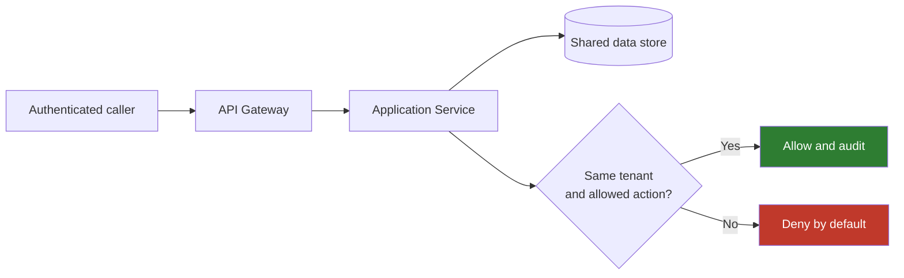
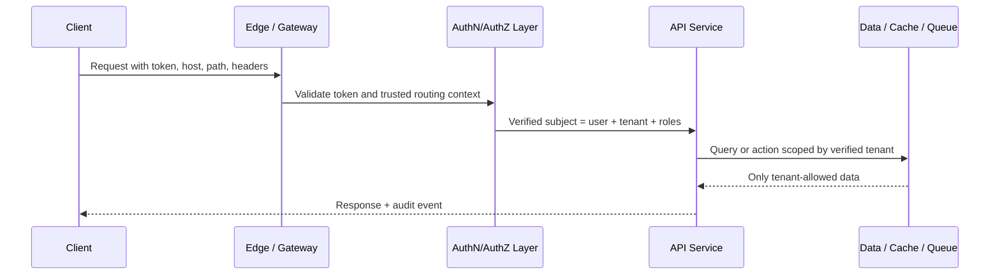
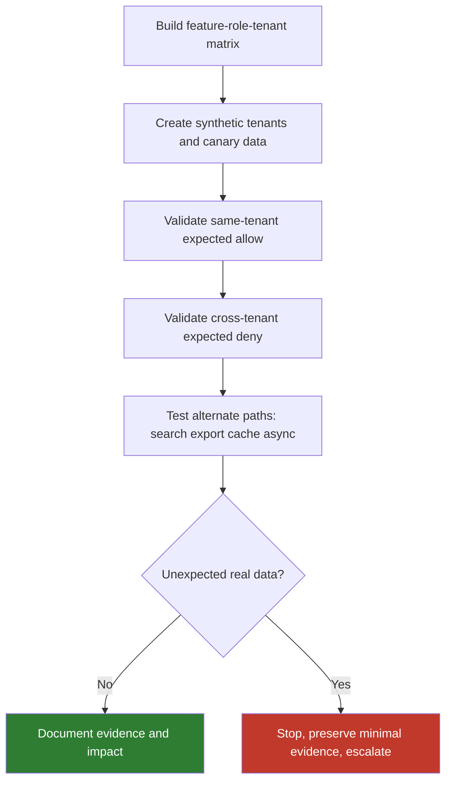
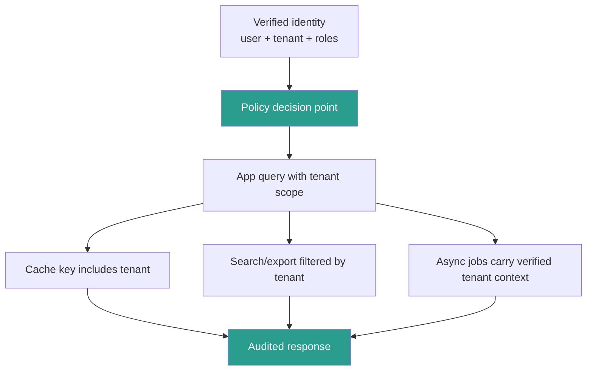

# Cross-Tenant Data Leakage

> **Phase 08 — Advanced API Vulnerabilities**  
> **Focus:** Understand how multi-tenant APIs accidentally expose one customer's data, actions, or derived artifacts to another customer, and how to review this safely during **authorized** testing.  
> **Safety note:** This note is for secure design review, authorized validation, code review, and incident triage. It explains risk, detection, and hardening. It does **not** provide harmful step-by-step abuse instructions.

This note follows the project guidance in `remember.txt`: start with a simple mental model, build toward deeper technical reasoning, and use diagrams where they make the concept easier to remember.

---

**Relevant public guidance:** OWASP API Security Top 10 2023 (especially API1:2023), OWASP Authorization Cheat Sheet, OWASP Authorization Testing Automation Cheat Sheet, OWASP Cloud Tenant Isolation project, PortSwigger IDOR guidance, AWS SaaS tenant-isolation guidance, and Microsoft Azure multitenant request-mapping guidance.

---

## Table of Contents

1. [Why cross-tenant data leakage matters](#1-why-cross-tenant-data-leakage-matters)
2. [Beginner mental model](#2-beginner-mental-model)
3. [Why this is an advanced API problem](#3-why-this-is-an-advanced-api-problem)
4. [Where tenant context comes from](#4-where-tenant-context-comes-from)
5. [High-signal failure patterns](#5-high-signal-failure-patterns)
6. [Reading the API spec with a tenant-isolation lens](#6-reading-the-api-spec-with-a-tenant-isolation-lens)
7. [Safe authorized validation workflow](#7-safe-authorized-validation-workflow)
8. [Helpful tools and commands](#8-helpful-tools-and-commands)
9. [Vulnerable vs safer implementation patterns](#9-vulnerable-vs-safer-implementation-patterns)
10. [Detection and triage](#10-detection-and-triage)
11. [Defensive architecture and mitigation](#11-defensive-architecture-and-mitigation)
12. [How to report the finding clearly](#12-how-to-report-the-finding-clearly)
13. [Key takeaways](#13-key-takeaways)
14. [Public references](#14-public-references)

---

## 1. Why Cross-Tenant Data Leakage Matters

**Cross-tenant data leakage** happens when a multi-tenant API lets one tenant access data, actions, metadata, or generated artifacts that belong to another tenant.

In SaaS systems, the whole business promise often depends on this boundary:

- tenant A should never see tenant B's records
- tenant A should never trigger tenant B's workflows
- tenant A should never receive tenant B's exports, search results, cache entries, or webhook effects

That is why cross-tenant leakage is usually treated as a **high-severity** issue:

- it breaks the most important customer trust boundary
- it can expose regulated data, secrets, or business intelligence
- it often affects many records, not just one
- it can imply deeper architectural isolation failure

### One-sentence summary

> **Authenticated is not the same as isolated.**

AWS makes this distinction clearly in its SaaS guidance: authentication and authorization alone do not automatically provide tenant isolation. Microsoft makes a similar point from another angle: mapping a request to the right tenant is a separate problem from identifying the user. If either part fails, the API can still expose the wrong customer's resources.

### What leakage can include

| Leakage type | Example | Why it matters |
| --- | --- | --- |
| **Direct object data** | Another tenant's invoice, project, ticket, order | Classic confidentiality breach |
| **Derived data** | Aggregated dashboards, analytics, search results | Often reveals high-value business intelligence |
| **Writable actions** | Approve, refund, delete, rotate key, export | Integrity impact can exceed pure data disclosure |
| **Generated artifacts** | CSV export, PDF report, backup snapshot | Often large-scale and easy to overlook |
| **Metadata** | Names, counts, tags, existence, IDs | Can enable further targeting and privacy harm |
| **Async side effects** | Webhooks, notifications, queued jobs | Leak may appear outside the original request path |

---

## 2. Beginner Mental Model

Imagine a modern office tower:

- **Authentication** is proving you work in the building.
- **Authorization** is which rooms or systems your job allows you to use.
- **Tenant isolation** is making sure employees from company A cannot enter company B's office suite, even though both companies share the same building.

That last part is the key.

A user can be:

- correctly logged in,
- correctly assigned a role,
- and still be in the **wrong tenant boundary**.

### Quick comparison

| Security control | Main question | Example failure |
| --- | --- | --- |
| **Authentication** | Who is this caller? | Forged or weak token |
| **Authorization** | Can this caller do this action? | Regular user reaches admin function |
| **Tenant isolation** | Is this action limited to the caller's tenant boundary? | Billing admin from tenant A reads invoices from tenant B |

### Diagram — the boundary that matters



### Easy sentence to remember

> **Tenant context is part of the security decision, not just routing metadata.**

---

## 3. Why This Is an Advanced API Problem

Cross-tenant leakage belongs in the **advanced** category because it is not one single bug class.

It is often a **finding pattern** caused by several different technical failures:

- broken object-level authorization
- broken object property-level authorization
- client-controlled tenant selectors
- cache key mistakes
- search or analytics index scoping failures
- asynchronous workflow context loss
- service-to-service trust drift
- outdated versions or shadow endpoints with weaker checks

### This is bigger than “just another IDOR”

PortSwigger's IDOR guidance and OWASP API1:2023 are still highly relevant: user-controlled object references are a major cause of unauthorized access. But cross-tenant leakage is broader than a simple path-parameter swap.

In real APIs, the leak may happen in:

- a search endpoint
- a GraphQL resolver
- a CSV export job
- a cache layer
- an internal microservice
- a partner callback path
- a data lake or reporting API

### Root cause vs finding pattern

| Root cause | What actually failed | How cross-tenant leakage appears |
| --- | --- | --- |
| **BOLA** | Wrong object was retrieved | Another tenant's record is returned |
| **BOPLA** | Wrong fields were exposed | Response includes another tenant's hidden attributes |
| **BFLA** | Wrong function was reachable | Tenant-wide admin/export endpoint callable by wrong tenant |
| **Cache/keying flaw** | Response reused without tenant dimension | Tenant B sees tenant A's cached response |
| **Async context loss** | Job or consumer lost subject/tenant scope | Export or webhook built from the wrong tenant context |
| **Internal API trust flaw** | Backend trusted headers or upstream too broadly | Downstream service returns cross-tenant data |
| **Spec/version drift** | Old or alternate route missed newer checks | Legacy mobile/partner path leaks cross-tenant data |

### Why APIs amplify the risk

APIs are especially prone to this problem because they are:

- **stateless** — the server reconstructs context on every request
- **structured** — identifiers, headers, and object references are explicit
- **automatable** — clients, partners, mobile apps, and jobs call the same flows repeatedly
- **distributed** — gateways, services, queues, and caches each make trust decisions

That combination means one missing boundary check can travel far.

---

## 4. Where Tenant Context Comes From

Microsoft's multitenant guidance is useful here: first determine **who** the caller is, then determine **which tenant** they are acting within. Those are related, but not identical.

### Common tenant-context sources

| Source | Example | Strength | Main risk |
| --- | --- | --- | --- |
| **Host / subdomain** | `acme.api.example.com` | Often strong for routing | Reverse-proxy confusion or incorrect host trust |
| **Path segment** | `/t/acme/invoices/123` | Easy to reason about | App may trust path tenant without binding it to identity |
| **Query string** | `?tenant=acme` | Simple for debugging | Easy to tamper with if not revalidated |
| **Custom header** | `X-Tenant-Id: acme` | Useful for controlled API clients | Dangerous if user-supplied headers are trusted |
| **Token claim** | `tenant_id=acme` | Strong when claim is signed and validated | Wrong issuer, wrong audience, or stale claim mapping |
| **API key mapping** | key maps to tenant in server lookup | Simple for machine clients | Overbroad keys or missing secondary authz |
| **Server-side session/context** | tenant resolved internally from account mapping | Strong if centralized | Drift between edge and backend services |

### Important design rule

The safest pattern is:

1. derive tenant context from a **trusted identity source**
2. bind it to the request as verified server-side context
3. use it consistently in authorization, lookup, caching, logging, and async processing

The weakest pattern is the opposite:

```text
client supplies tenant selector -> backend trusts it directly -> data lookup uses it as authority
```

### Diagram — tenant mapping and authorization are separate checks



### High-value questions

- Can one user belong to multiple tenants?
- If yes, how is the active tenant selected and verified?
- Is tenant context derived from claims, routing, or both?
- Do downstream services revalidate tenant context or just trust forwarded headers?
- Are caches, queues, exports, and search indexes keyed by tenant as well as object?

---

## 5. High-Signal Failure Patterns

The patterns below appear often in real multi-tenant APIs.

### 5.1 Object lookup without tenant scoping

This is the classic pattern behind many leaks:

```text
lookup by object ID -> return object -> no tenant restriction in query or policy
```

Even if the object ID is a UUID, that does not make the system safe. OWASP explicitly warns that unpredictable IDs help with guessing resistance, but they do not replace authorization.

### 5.2 Client-controlled tenant selectors

Danger signs include:

- `tenantId` in request body for a sensitive action
- `X-Tenant-Id` trusted from the client
- path or query tenant accepted without binding it to verified identity
- frontend-only restrictions on tenant switching

### 5.3 Cache and CDN key mistakes

This is a very common **advanced** failure mode.

The application may correctly authorize the origin request, but then cache the result using only:

- path
- method
- object ID

If tenant identity is missing from the cache key or variation rule, the next caller may receive the wrong tenant's response.

| Cache mistake | Example | Likely effect |
| --- | --- | --- |
| **No tenant dimension in key** | `/api/reports/summary` cached globally | Another tenant receives cached data |
| **Improper `Vary` handling** | response differs by auth header or tenant header, cache does not | Cross-tenant cache poisoning or leakage |
| **Search result caching** | query cached only by search term | Results from another tenant reused |
| **Generated export caching** | download URL reused too broadly | Wrong tenant receives prepared artifact |

### 5.4 Search, analytics, and export backends

These APIs are dangerous because they often work on **derived** or **aggregated** data instead of raw rows.

High-signal endpoints include:

- `/search`
- `/reports`
- `/analytics`
- `/exports`
- `/audit`
- `/events`
- GraphQL search/filter resolvers

The common failure pattern is:

```text
main app enforces tenant scoping -> secondary index/export pipeline forgets to keep the same filter
```

### 5.5 Async jobs and webhook context loss

A request may be safe at submission time but unsafe later when:

- a worker rebuilds context incorrectly
- a queue consumer trusts job payload too much
- a webhook event uses the wrong account mapping
- artifact storage paths are not tenant-bound

This matters because many leaks are discovered not on the original API call, but on the later:

- download
- callback
- notification
- export pickup

### 5.6 Internal APIs and service-to-service trust drift

Microservice notes across this repository repeat the same lesson: an internal service should not trust plain identity headers or upstream claims blindly.

High-risk signs include:

- downstream services accept `X-User-Id` or `X-Tenant-Id` without strict proxy trust
- service B accepts a token intended for service A
- backend verifies signature but not audience, scope, or tenant context
- internal admin/reporting service is broader than public API checks

### 5.7 Old versions, alternate clients, and shadow routes

OWASP API9 thinking helps here: version drift often breaks isolation.

Common examples:

- older mobile API version skips the tenant filter
- partner endpoint exposes more fields than web endpoint
- internal route is reachable from a broader network than intended
- GraphQL, REST, and export endpoints expose the same data with different policy maturity

### High-signal review table

| Surface | Questions to ask | Red flag |
| --- | --- | --- |
| **Object endpoints** | Is object lookup scoped by tenant and role? | `findById()` with no tenant filter |
| **Search/filter** | Is search index filtered per tenant before response? | Global index queried, app trims too late |
| **Exports/downloads** | Is artifact ownership bound to tenant and requestor? | Predictable job IDs or shared storage paths |
| **Headers** | Are identity or tenant headers trusted only from approved proxies? | Caller can self-assert `X-Tenant-Id` |
| **Cache/CDN** | Does cache vary by tenant/auth context? | Shared cached response across tenants |
| **Async workflows** | Does worker preserve verified tenant context? | Job payload carries tenant as plain user input |
| **Legacy/alternate APIs** | Are older versions tested with the same matrix? | New API denies, old one still leaks |

---

## 6. Reading the API Spec With a Tenant-Isolation Lens

The API specification is one of the best starting points for this topic because it reveals:

- which endpoints accept direct object references
- which operations act on high-value business objects
- which headers, query parameters, or path segments may carry tenant context
- which alternate channels exist, such as webhooks, callbacks, admin tags, or exports

### Safe illustrative OpenAPI fragment

```yaml
openapi: 3.0.3
paths:
  /v1/tenants/{tenantId}/invoices/{invoiceId}:
    get:
      summary: Get invoice
      parameters:
        - in: path
          name: tenantId
          required: true
          schema:
            type: string
        - in: path
          name: invoiceId
          required: true
          schema:
            type: string
      security:
        - bearerAuth: []
  /v1/reports/export:
    post:
      summary: Start report export
      requestBody:
        required: true
        content:
          application/json:
            schema:
              type: object
              properties:
                tenantId:
                  type: string
                reportType:
                  type: string
  /graphql:
    post:
      summary: GraphQL endpoint
```

### What this tells the reviewer immediately

| Spec clue | Why it matters |
| --- | --- |
| Path contains `tenantId` and `invoiceId` | The API is taking both a tenant selector and an object selector from the request |
| Export endpoint accepts `tenantId` in body | Must confirm server derives or validates tenant context, not just trusts body input |
| Single `/graphql` endpoint exists | Tenant-scoped data may also be reachable through alternate resolver paths |
| `bearerAuth` is present | Authentication exists, but the spec alone does not prove tenant isolation |

### Spec review questions

| Question | Why it is important |
| --- | --- |
| Does the spec describe tenancy, ownership, workspace, or organization rules explicitly? | Missing policy language is a warning sign |
| Are tenant selectors passed in path, query, header, or body? | Every caller-controlled selector deserves scrutiny |
| Do exports, search, bulk, webhook, or callback operations exist? | Derived-data paths often drift from primary authz logic |
| Are there admin, support, or partner tags? | Mixed trust models raise isolation complexity |
| Are multiple protocols or versions documented? | REST, GraphQL, gRPC, and legacy versions can diverge |
| Are async job download routes present? | The leak may exist on retrieval, not creation |

### Turn the spec into a tenant-boundary matrix

OWASP's authorization testing automation guidance is very useful here: formalize expected access across **feature**, **role**, and **data scope**.

| Operation | Tenant A owner/admin | Tenant A peer user | Tenant B equivalent user | Expected result |
| --- | --- | --- | --- | --- |
| `GET /v1/invoices/{invoiceId}` | Allow if authorized | Deny unless shared | Deny | Same-tenant object rules enforced |
| `POST /v1/reports/export` | Allow per role and report type | Deny if role too weak | Deny | Export remains tenant-bound |
| `searchInvoices(query)` | Allow only tenant A results | Allow subset per role | Deny access to tenant A documents | Search index properly filtered |
| `GET /v1/exports/{jobId}/download` | Allow only creator/tenant | Deny unless policy allows | Deny | Artifact ownership preserved |

### Good mental shortcut

> **If the spec shows an object, tenant, export, search, or workflow reference, treat it as an authorization review target.**

---

## 7. Safe Authorized Validation Workflow

This topic should be validated carefully because the impact can be large. The safest pattern is to use **dedicated test tenants** and **synthetic data**.

### Ground rules

- stay inside written authorization
- use staging or a pre-cleared environment when possible
- use canary objects owned by test tenants
- avoid touching real customer records
- if unexpected real data appears, stop and escalate through the approved process

### Recommended workflow

#### 1) Build the tenant matrix before sending requests

List:

- roles
- tenants
- objects
- actions
- expected allow/deny outcomes

This reduces accidental over-testing and makes findings easier to prove safely.

#### 2) Create at least two tenants and multiple roles

The minimum useful setup is usually:

- tenant A admin
- tenant A normal user
- tenant B equivalent user

If the platform supports shared workspaces or delegated access, include those cases too.

#### 3) Use low-risk canary objects

Good candidates:

- synthetic invoice
- empty project
- benign report
- disposable export
- sandbox document

#### 4) Compare same-tenant and cross-tenant behavior

The key is not “can something be changed,” but:

> **Does the system enforce a different result when the tenant changes but everything else stays comparable?**

#### 5) Test alternate paths to the same data

Validate the same object or dataset across:

- direct object endpoint
- list/search endpoint
- export endpoint
- GraphQL query
- mobile or partner version
- internal/admin-assisted workflow if in scope

#### 6) Check asynchronous retrieval and caching

For example:

- create export in tenant A
- verify tenant B cannot retrieve or view metadata for that artifact
- confirm cached responses differ by tenant

#### 7) Stop early if real data appears

The right response is:

- preserve minimal evidence
- record request/response metadata
- do not continue broad enumeration
- notify the owner through the approved escalation path

### Diagram — safe validation logic



### Safe example comparison requests

These examples are appropriate only in an approved environment with synthetic objects.

```bash
# Same-tenant canary read should succeed
curl -sS \
  -H "Authorization: Bearer $TENANT_A_TOKEN" \
  "$BASE_URL/v1/invoices/$TENANT_A_CANARY_INVOICE"

# Cross-tenant canary read should deny or return no data
curl -i \
  -H "Authorization: Bearer $TENANT_B_TOKEN" \
  "$BASE_URL/v1/invoices/$TENANT_A_CANARY_INVOICE"
```

### What to compare

| Signal | Safer behavior | Warning sign |
| --- | --- | --- |
| **HTTP status** | Deny or not found for cross-tenant access | Same success status and data |
| **Response body** | No foreign-tenant data | Full record or partial leakage |
| **Error shape** | Consistent denial behavior | Different errors revealing existence or metadata |
| **Timing/cache** | Tenant-specific responses | Cached or reused response from another tenant |
| **Async artifact access** | Tenant-bound ownership enforced | Job or download accessible across tenants |

---

## 8. Helpful Tools and Commands

The safest tools for this topic help formalize the API surface and compare behavior across pre-approved test accounts.

| Tool | Safe use | Example |
| --- | --- | --- |
| **`jq` / `yq`** | Extract object-bearing and export-related operations from a local OpenAPI spec | Build review inventory from `paths` |
| **Burp Suite / browser dev tools** | Compare same-tenant vs cross-tenant requests in a controlled environment | Inspect headers, tokens, and response differences |
| **Postman / Bruno / Insomnia** | Maintain separate environments per tenant and role | Prevent accidental token mixups |
| **Automated integration tests** | Encode the authorization matrix into repeatable checks | Catch regressions in CI |
| **Log search / SIEM** | Verify denied cross-tenant attempts and alerting quality | Confirm observability before incident |

### Example — extract likely review targets from a local OpenAPI file

```bash
# List routes containing tenant, export, report, or search clues
yq '.paths | keys | .[]' openapi.yaml | \
  grep -Ei 'tenant|org|workspace|project|invoice|export|report|search'
```

### Example — inspect security schemes in a local spec

```bash
yq '.components.securitySchemes' openapi.yaml
```

### Example — build a tiny authorization matrix file

```bash
cat <<'EOF' > authz-matrix.csv
operation,tenant_a_admin,tenant_a_user,tenant_b_user
get_invoice,allow,deny,deny
export_report,allow,deny,deny
search_invoices,allow_limited,allow_limited,deny
EOF
```

The OWASP authorization testing automation guidance strongly supports this matrix-based approach because it makes expected access rules explicit and testable.

---

## 9. Vulnerable vs Safer Implementation Patterns

### Vulnerable pattern — client-controlled tenant context plus global lookup

```javascript
app.get('/api/v1/invoices/:invoiceId', async (req, res) => {
  const user = requireAuth(req);

  // Dangerous: caller controls tenant context
  const requestedTenant = req.header('X-Tenant-Id');

  // Dangerous: object lookup is global
  const invoice = await db.invoice.findUnique({
    where: { id: req.params.invoiceId }
  });

  if (!invoice) {
    return res.sendStatus(404);
  }

  // Incomplete: role check without tenant/object policy
  if (!user.roles.includes('billing.read')) {
    return res.sendStatus(403);
  }

  return res.json(invoice);
});
```

### Why this is dangerous

- the client can influence tenant context
- the query is not tenant-scoped
- the role check answers “may read invoices in general?” but not “may read **this** invoice in **this** tenant?”

### Safer pattern — verified tenant context plus tenant-bound lookup

```javascript
app.get('/api/v1/invoices/:invoiceId', async (req, res) => {
  const subject = requireVerifiedSubject(req);
  // subject = { user_id, tenant_id, roles, scopes }

  const invoice = await db.invoice.findFirst({
    where: {
      id: req.params.invoiceId,
      tenant_id: subject.tenant_id
    }
  });

  if (!invoice) {
    return res.sendStatus(404);
  }

  if (!canReadInvoice(subject, invoice)) {
    auditDeny(subject, 'invoice.read', invoice.id, invoice.tenant_id);
    return res.sendStatus(403);
  }

  auditAllow(subject, 'invoice.read', invoice.id, invoice.tenant_id);
  return res.json(redactInvoiceForSubject(subject, invoice));
});
```

### Safer design principles

| Principle | Why it matters |
| --- | --- |
| **Derive tenant from verified identity** | Prevents caller-defined scope |
| **Query with tenant filter first** | Stops global lookup mistakes early |
| **Centralize object policy** | Avoids inconsistent checks across endpoints |
| **Redact by role after tenant scoping** | Prevents field leakage inside an allowed tenant |
| **Log allow/deny with both subject and resource tenant** | Makes incident triage possible |

### Database-layer defense in depth

Application checks are still necessary, but database policies can reduce blast radius.

```sql
ALTER TABLE invoices ENABLE ROW LEVEL SECURITY;

CREATE POLICY tenant_invoice_isolation ON invoices
USING (
  tenant_id = current_setting('app.tenant_id')
);
```

### Important limitation

Database row-level policies help with row visibility, but they do **not** automatically solve:

- workflow authorization
- cross-service trust
- cache key safety
- export ownership
- search index scoping
- field-level exposure

### Advanced leak sources to review in code

| Code pattern | Why it is risky |
| --- | --- |
| `findById(id)` before policy | Easy to forget tenant restrictions |
| Trusting `tenantId` from headers or body | Client becomes authority for security scope |
| Global cache key such as `invoice:{id}` | Cross-tenant cache reuse becomes possible |
| Worker job payload contains raw `tenantId` from client | Async consumer may trust unverified context |
| Search adapter builds query without tenant filter | Index returns foreign-tenant hits |
| “Admin” path bypasses normal resource checks | Support/reporting tools often become leak sources |

---

## 10. Detection and Triage

Cross-tenant issues should be detectable both as **denied attempts** and as **unexpected successful cross-boundary events**.

### What to log

| Event | Why it matters | Example fields |
| --- | --- | --- |
| **Authorization deny** | Reveals attempted boundary crossing | `subject_user`, `subject_tenant`, `resource_tenant`, `action`, `decision` |
| **Cross-tenant mismatch** | High-signal isolation event | `subject_tenant != resource_tenant` |
| **Unexpected export download** | Detects artifact ownership problems | `job_id`, `creator_tenant`, `downloader_tenant` |
| **Search hit count anomalies** | Finds overly broad indexes | `tenant_id`, `query`, `result_count` |
| **Cache mismatch** | Detects tenant-unsafe caching | cache key, vary metadata, auth context |
| **Service-to-service authz failure** | Shows trust drift internally | source service, token audience, tenant context |

### Example JSON logs

```json
{
  "event": "authz_denied",
  "action": "invoice.read",
  "subject_user": "user-123",
  "subject_tenant": "tenant-a",
  "resource_id": "inv-canary-a1",
  "resource_tenant": "tenant-b",
  "reason": "tenant_mismatch"
}
```

```json
{
  "event": "cross_tenant_artifact_attempt",
  "job_id": "exp-1042",
  "creator_tenant": "tenant-a",
  "requester_tenant": "tenant-b",
  "decision": "deny"
}
```

### Metrics worth watching

```prometheus
authz_decisions_total{result="deny",reason="tenant_mismatch"} 42
cross_tenant_request_total{surface="export_download"} 3
search_results_total{tenant="tenant-a",query_type="invoice_search"} 18
```

### Triage questions

- Was the leak a direct response, a cached response, or an async artifact?
- Did the subject and resource tenants differ?
- Was the tenant mismatch visible only on one protocol or version?
- Did the issue affect reads only, or also writes and actions?
- Is this isolated to one route, or does it indicate a shared policy failure?

### Response priority guidance

| Scenario | Typical severity thinking |
| --- | --- |
| **One tenant can read another tenant's records directly** | Usually high or critical |
| **Cross-tenant export/download works** | Often critical due to scale |
| **Metadata only leaks existence/counts** | Still serious; often medium to high |
| **Cache occasionally replays foreign data** | High due to unpredictability and customer impact |
| **Cross-tenant writes or admin actions** | Critical integrity issue |

---

## 11. Defensive Architecture and Mitigation

The goal is not just “add one more `if` statement.”

The goal is to make tenant isolation a **system property** across:

- identity
- routing
- authorization
- queries
- caches
- queues
- storage
- monitoring

### Core defensive controls

| Control | What good looks like |
| --- | --- |
| **Trusted tenant derivation** | Tenant comes from verified claims, trusted routing, or server mapping, not raw user input |
| **Central policy layer** | One reusable policy decision for subject + action + object + tenant |
| **Tenant-bound data access** | Queries, indexes, and storage paths include tenant scope |
| **Tenant-safe caching** | Cache keys and `Vary` behavior include the right identity dimensions |
| **Async context integrity** | Jobs and events carry verified tenant context and are revalidated by consumers |
| **Artifact ownership checks** | Exports, files, and pre-signed downloads are bound to tenant and requester |
| **Version consistency** | Legacy, partner, and alternate protocols use the same policy model |
| **Observability** | Logs and alerts capture subject tenant and resource tenant |

### Secure architecture checklist

- [ ] Derive tenant context from verified identity or trusted routing only
- [ ] Never trust client-supplied `tenantId` as the final authority
- [ ] Scope every object lookup by tenant before returning data
- [ ] Apply the same tenant checks to read, write, delete, and workflow actions
- [ ] Review search, reports, dashboards, and exports separately from CRUD endpoints
- [ ] Ensure caches vary by the right auth and tenant dimensions
- [ ] Preserve tenant context through queues, background jobs, and webhooks
- [ ] Revalidate tenant context in internal services, not only at the gateway
- [ ] Test older API versions and alternate channels with the same matrix
- [ ] Log and alert on tenant mismatches and denied cross-tenant attempts

### Diagram — layered isolation, not gateway-only trust



### Common mitigation mistakes

| Mistake | Why it is incomplete |
| --- | --- |
| **Switch to UUIDs only** | Harder to guess is not the same as authorized |
| **Check role but not tenant** | User may be privileged in the wrong customer boundary |
| **Enforce only at gateway** | Internal services and async workers can still drift |
| **Fix direct endpoint but ignore exports/search** | Derived-data paths often remain vulnerable |
| **Rely on frontend tenant switching rules** | UI logic is not an authorization boundary |

---

## 12. How To Report the Finding Clearly

A strong report should make the business impact obvious without overstating what was tested.

### Recommended structure

| Section | What to include |
| --- | --- |
| **Title** | Cross-tenant data leakage in `[surface]` |
| **Summary** | Which tenant boundary failed and what type of data/action crossed it |
| **Affected surfaces** | Endpoint, resolver, export path, version, or internal route |
| **Prerequisites** | What legitimate access level was used during authorized testing |
| **Observed behavior** | Cross-tenant request was incorrectly allowed or returned foreign metadata/data |
| **Expected behavior** | Tenant mismatch should have produced deny/no data |
| **Impact** | Confidentiality, integrity, regulatory, or customer-trust impact |
| **Likely root cause** | Missing tenant filter, cache key flaw, async context loss, etc. |
| **Remediation direction** | Centralize tenant-aware policy, review alternate paths, add tests and logging |

### Example concise finding statement

> **A user in tenant B was able to access a synthetic invoice belonging to tenant A through the export retrieval path, indicating that artifact access is not bound to the creator's tenant context.**

### Evidence guidance

Keep evidence minimal and safe:

- one same-tenant success
- one cross-tenant denial expectation
- one cross-tenant unexpected result
- relevant headers/status/body excerpts
- timestamps, environment, and trace IDs

If real customer data appears unexpectedly, stop and follow the approved escalation path rather than collecting more.

---

## 13. Key Takeaways

- **Cross-tenant leakage is a boundary failure, not just a single bug class.**
- **Authentication and general role checks do not guarantee tenant isolation.**
- **Tenant context must be trusted, derived, and enforced end-to-end.**
- **The API spec is a powerful map for finding high-risk object, export, search, and async surfaces.**
- **Safe testing should use synthetic tenants, canary objects, and a formal authorization matrix.**
- **Advanced leaks often live in caches, exports, search indexes, async workers, and internal APIs.**
- **Good defenses combine policy, tenant-scoped queries, tenant-safe caches, async integrity, and strong monitoring.**

### One final memory aid

```text
User identity answers:  "Who are you?"
Role answers:           "What can you do?"
Tenant isolation asks:  "For which customer boundary?"
```

---

## 14. Public References

- [OWASP API Security Top 10 2023 — API1: Broken Object Level Authorization](https://owasp.org/API-Security/editions/2023/en/0xa1-broken-object-level-authorization/)
- [OWASP Authorization Cheat Sheet](https://cheatsheetseries.owasp.org/cheatsheets/Authorization_Cheat_Sheet.html)
- [OWASP Authorization Testing Automation Cheat Sheet](https://cheatsheetseries.owasp.org/cheatsheets/Authorization_Testing_Automation_Cheat_Sheet.html)
- [OWASP Cloud Tenant Isolation Project](https://owasp.org/www-project-cloud-tenant-isolation/)
- [PortSwigger Web Security Academy — IDOR](https://portswigger.net/web-security/access-control/idor)
- [AWS SaaS Architecture Fundamentals — Tenant Isolation](https://docs.aws.amazon.com/whitepapers/latest/saas-architecture-fundamentals/tenant-isolation.html)
- [Microsoft Azure Architecture Center — Map Requests to Tenants in a Multitenant Solution](https://learn.microsoft.com/en-us/azure/architecture/guide/multitenant/considerations/map-requests)
- [CWE-285: Improper Authorization](https://cwe.mitre.org/data/definitions/285.html)
- [CWE-639: Authorization Bypass Through User-Controlled Key](https://cwe.mitre.org/data/definitions/639.html)
