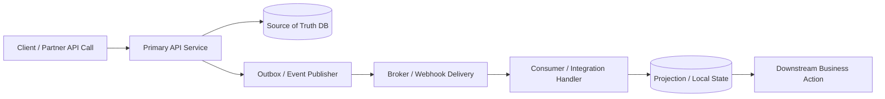
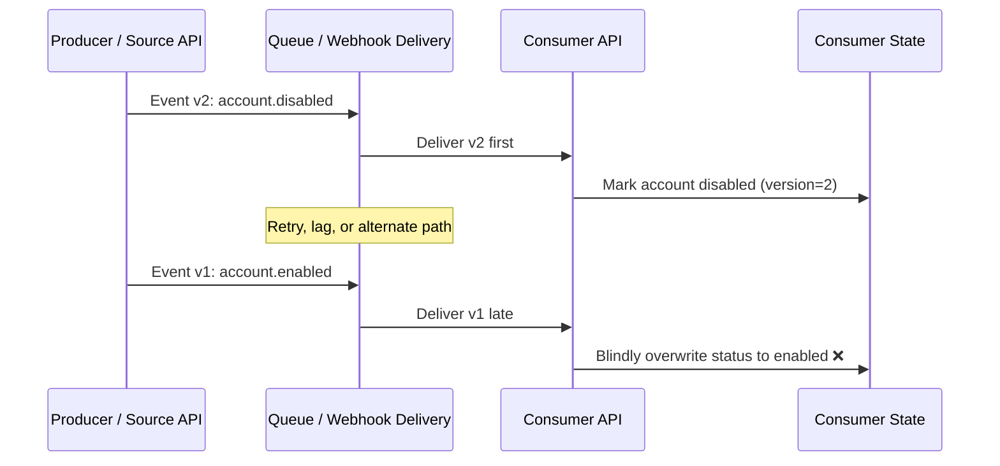
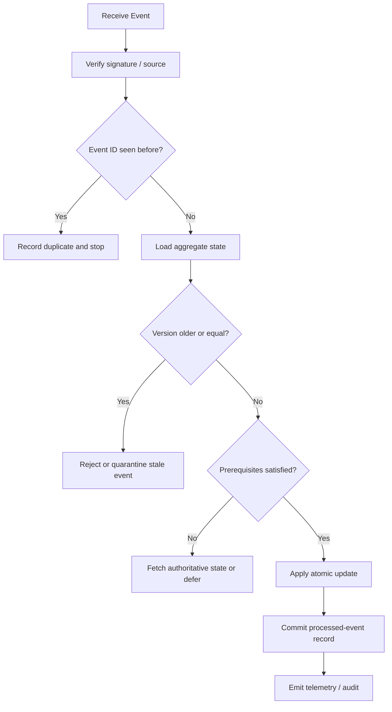

# Event Ordering Abuse

> **Module:** API Pentesting → Advanced API Vulnerabilities  
> **Difficulty:** Intermediate → Advanced  
> **Tags:** `#event-driven-api` `#webhooks` `#asyncapi` `#idempotency` `#event-ordering` `#eventual-consistency`

Event ordering abuse happens when a system assumes that **events will arrive, be processed, and affect state in the same order they originally happened**. In modern APIs, that assumption is often false.

Webhook providers retry. Queues redeliver. Consumers scale horizontally. Projections lag behind source systems. One event may arrive twice, late, or before its prerequisite. If the receiving API applies those events blindly, an attacker may not need a classic injection or memory bug at all — they may only need a business workflow that breaks when **delivery order diverges from business order**.

From an authorized, defensive testing perspective, this topic sits at the intersection of:

- **API6:2023 Unrestricted Access to Sensitive Business Flows**
- **API8:2023 Security Misconfiguration**
- **API9:2023 Improper Inventory Management**
- **API10:2023 Unsafe Consumption of APIs**

This note stays focused on **safe validation and hardening**. The goal is to understand where ordering assumptions live, how to test them responsibly, and how to design event-driven APIs that remain correct under retries, duplication, delay, and reordering.

---

## Table of Contents

1. [What This Means](#what-this-means)
2. [Why APIs Are Exposed to It](#why-apis-are-exposed-to-it)
3. [Mental Model — Business Time vs Delivery Time](#mental-model--business-time-vs-delivery-time)
4. [Where It Appears in Real API Ecosystems](#where-it-appears-in-real-api-ecosystems)
5. [Ordering Failure Modes](#ordering-failure-modes)
6. [Event Ordering Abuse vs Race Conditions](#event-ordering-abuse-vs-race-conditions)
7. [How To Read the API Spec for Ordering Risk](#how-to-read-the-api-spec-for-ordering-risk)
8. [Defensive Schema and Contract Design](#defensive-schema-and-contract-design)
9. [Authorized Validation Workflow](#authorized-validation-workflow)
10. [Detection and Telemetry](#detection-and-telemetry)
11. [Hardening Patterns](#hardening-patterns)
12. [Reporting Guidance](#reporting-guidance)
13. [Checklist](#checklist)
14. [References and Public Research](#references-and-public-research)

---

## What This Means

### Beginner explanation

Imagine a warehouse app that should follow this business timeline:

1. `order.created`
2. `payment.confirmed`
3. `order.fulfilled`
4. `order.cancelled` should be rejected once fulfillment already happened

That looks simple. But asynchronous APIs do not guarantee the receiver will see those events in that sequence.

A real receiver might get this instead:

1. `order.fulfilled`
2. `payment.confirmed`
3. `order.created`
4. `order.fulfilled` again as a retry

If the receiver's logic is:

- "apply every event as it arrives"
- "last write wins"
- "every delivery is new"

then the final state can become wrong even though **every individual event is valid**.

### One-sentence definition

> **Event ordering abuse is the exploitation of unsafe assumptions about the order, uniqueness, or timing of asynchronous API events.**

### Easy way to remember it

Think of three separate clocks:

- **Business time** — when the action really happened
- **Delivery time** — when the event reached the consumer
- **Processing time** — when the consumer committed the change

Security problems appear when a system acts as if those clocks are always the same.

---

## Why APIs Are Exposed to It

Event ordering abuse is especially relevant in modern API ecosystems because APIs are no longer only synchronous `GET` and `POST` calls.

Many business actions now span:

- REST APIs that create or update objects
- webhooks that notify another service later
- queues or streams that fan out the event
- materialized views and search indexes that lag the source of truth
- background workers that reconcile or enrich state

### Diagram — the async API path where ordering assumptions break



The important point is this:

> **The source system can be correct while the downstream consumer becomes incorrect.**

That makes this class dangerous in partner integrations, billing, logistics, IAM sync, fraud signals, webhook receivers, and internal microservice environments.

### Why “normal” platform behavior causes this

Public provider documentation repeatedly warns that ordering and uniqueness cannot be assumed:

| Public guidance | Defensive lesson |
|---|---|
| **Stripe** says webhook event delivery order is not guaranteed, duplicate deliveries can occur, and handlers should process events asynchronously. | Never depend on “created before paid” or “one delivery means one action.” |
| **GitHub** recommends responding quickly, processing via a queue, and using `X-GitHub-Delivery` as a unique delivery identifier. | Receivers must separate receipt from durable, deduplicated processing. |
| **Svix** stresses signature verification, timestamp checks, and idempotency based on message IDs. | Authenticity is necessary, but not enough; replay-safe processing still matters. |
| **Kafka / Confluent docs** distinguish at-most-once, at-least-once, and exactly-once semantics. | Delivery guarantees shape security assumptions; “at least once” means duplicates are normal. |
| **microservices.io** emphasizes transactional outbox and idempotent consumer patterns. | Correctness requires design patterns, not hope. |

---

## Mental Model — Business Time vs Delivery Time

A secure consumer must reason about **causality**, not just arrival order.

### Sequence diagram — a stale event arriving after a newer truth



The security problem is not that the late event is fake.

The problem is that the receiver failed to ask:

- Is this event **older** than what I already know?
- Is it a **duplicate**?
- Does it violate a required **state transition**?
- Should I **fetch current state** from the authoritative API instead of trusting the delivery order?

### Ordering concepts that matter

| Term | Meaning | Why it matters |
|---|---|---|
| **Event ID** | Unique identifier for one event or delivery | Supports deduplication |
| **Aggregate ID** | The object or stream the event belongs to | Lets you enforce per-object ordering |
| **Sequence / version** | Monotonic number for that aggregate | Blocks stale overwrites |
| **Occurred-at timestamp** | When the business action happened | Separates business time from arrival time |
| **Delivery attempt** | Retry count or transport attempt number | Explains duplicates and late arrival |
| **Correlation / causation ID** | Link to upstream action or chain | Helps trace multi-step workflows |

### A practical security rule

> **Never treat event arrival order as authoritative unless the contract explicitly guarantees it and the implementation actually preserves it.**

---

## Where It Appears in Real API Ecosystems

Event ordering abuse is not limited to queues. It shows up across many API styles.

| API pattern | How ordering assumptions break | Typical business impact |
|---|---|---|
| **Webhooks** | Provider retries, duplicates, delayed delivery, multiple event types racing | Double fulfillment, stale account state, wrong billing decisions |
| **Queue / stream consumers** | At-least-once delivery, parallel consumers, partitioning mistakes | Duplicate processing, stale projections, lost prerequisites |
| **Hybrid sync + async APIs** | Synchronous write succeeds, async compensating event arrives later or first | Conflicting state between UI, DB, and partner systems |
| **Microservice sagas** | Compensation and forward events cross paths | Order cancellation, refund, or entitlement drift |
| **Search / reporting projections** | Read model consumes older events after newer state exists | Exposure of wrong tenant state, policy drift, stale decisions |
| **Identity sync APIs** | Disable, enable, role-change, or group-sync events arrive out of order | Access retained after disablement or incorrect privilege assignment |
| **Payment and subscription integrations** | Invoice, charge, subscription, and refund events can be reordered | Revenue leakage, incorrect account upgrades/downgrades |

### Common real-world themes

#### 1. Terminal events without prerequisite checks

A consumer receives a terminal event such as `invoice.paid`, `user.disabled`, or `shipment.delivered` and applies it even when the local object does not exist or is older than the event expects.

#### 2. Stale overwrite by last arrival

The consumer uses a naive “last delivery wins” model instead of “highest valid version wins.”

#### 3. Duplicate side effects

The same event is processed twice and triggers external effects twice:

- shipping
- crediting
- notification grants
- reward accrual
- entitlement activation

#### 4. Cross-stream confusion

Two event types affect the same object, but the consumer tracks ordering only per delivery, not per object or workflow.

#### 5. Snapshot vs delta mismatch

One event contains the full new state, another only a delta. Applying them out of order corrupts the object.

---

## Ordering Failure Modes

### Table — what goes wrong and what the receiver should have done

| Failure mode | Insecure assumption | Safer control |
|---|---|---|
| **Blind apply** | “If it is signed, apply it.” | Verify source **and** verify state transition validity |
| **Delivery-order trust** | “Later arrival means newer truth.” | Use aggregate version or authoritative re-fetch |
| **Duplicate side effect** | “Every delivery is a new event.” | Deduplicate on event ID or business key |
| **Missing prerequisite** | “Consumer already knows prior state.” | Create dependency checks or pull missing object state |
| **Stale snapshot overwrite** | “Full payload is always current.” | Reject older versions; compare timestamps carefully |
| **Parallel worker collision** | “Two workers won’t touch the same object together.” | Partition by object, lock by key, or use conditional writes |
| **Replay-safe transport but unsafe business logic** | “Signature verification solved it.” | Add application-layer idempotency and version checks |
| **Unbounded manual redelivery** | “Operator resend is harmless.” | Quarantine old or conflicting events; require reconciliation logic |

### Diagram — secure consumer decision flow



### Safe examples of impact

| Example | What goes wrong if order is unsafe |
|---|---|
| **Identity sync** | `user.enabled` replay after `user.disabled` can restore access incorrectly |
| **Billing sync** | `subscription.cancelled` processed before `subscription.created` may create ghost or inconsistent records |
| **Order workflow** | `order.shipped` arriving before `payment.authorized` may trigger premature downstream actions |
| **Entitlements** | Old “premium granted” event can overwrite a later downgrade |
| **Fraud / risk API** | Delayed “allow” decision may override a newer “block” decision |

---

## Event Ordering Abuse vs Race Conditions

These topics overlap, but they are not identical.

| Dimension | Race condition | Event ordering abuse |
|---|---|---|
| **Core issue** | Concurrent access to shared state | Incorrect assumptions about sequence, retries, or staleness |
| **Timing** | Usually near-simultaneous | Can happen seconds, minutes, or days later |
| **Trigger** | Read-modify-write overlap | Retry, queue lag, redelivery, replay, or reconciliation |
| **Typical surface** | Synchronous request handling | Async APIs, webhooks, queues, projections |
| **Primary fix** | Locks, atomic updates, serialization | Idempotency, versions, ordering contracts, reconciliation |

A useful way to remember it:

> **Race conditions break logic at the same time; event ordering abuse breaks logic across time.**

Many mature systems have both.

---

## How To Read the API Spec for Ordering Risk

The API spec is one of the best places to detect ordering assumptions early.

For synchronous APIs, look in **OpenAPI** for:

- `callbacks`
- `webhooks`
- async follow-up behavior described in operation text
- event identifiers or idempotency headers in schemas
- state transition endpoints like `/activate`, `/cancel`, `/disable`, `/fulfill`

For event-driven APIs, look in **AsyncAPI** for:

- `channels`
- message headers
- message IDs and correlation fields
- bindings that describe transport semantics
- examples showing replay, retry, or sequencing metadata

### Why spec review matters

A spec often reveals not just the endpoint, but the **contract assumptions**:

- does the event have a stable ID?
- is there an object-level sequence number?
- are retries documented?
- is the consumer expected to fetch the latest object after a terminal event?
- is ordering guaranteed globally, per tenant, per aggregate, or not at all?

### OpenAPI clues

| Spec clue | What to ask |
|---|---|
| `webhooks:` section | What inbound event receiver exists? |
| Callback URL templating | Can different consumers receive different ordering behavior? |
| Missing idempotency header / field | How are duplicates meant to be handled? |
| State-changing endpoints plus async notifications | Which system is the source of truth? |
| Deprecated versions | Could old emitters produce incompatible or stale events? |

### AsyncAPI clues

| Spec clue | What to ask |
|---|---|
| Channel per aggregate | Is ordering intended per object? |
| Message headers with `eventId` only | Dedup exists, but where is staleness control? |
| `occurredAt` without `sequence` | How does the consumer resolve equal or skewed timestamps? |
| Multiple event types mutating same entity | Is cross-event ordering defined? |
| Bindings for transport | Does the broker preserve order per key or only per partition? |

### Example — defensive AsyncAPI message contract

```yaml
asyncapi: 3.0.0
info:
  title: Billing Events
  version: 1.0.0
channels:
  subscription.events:
    address: subscription.events
    messages:
      subscriptionChanged:
        headers:
          type: object
          required:
            - eventId
            - aggregateId
            - aggregateVersion
            - occurredAt
            - eventType
          properties:
            eventId:
              type: string
            aggregateId:
              type: string
            aggregateVersion:
              type: integer
              minimum: 1
            occurredAt:
              type: string
              format: date-time
            eventType:
              type: string
            deliveryAttempt:
              type: integer
        payload:
          type: object
          properties:
            status:
              type: string
              enum: [trialing, active, past_due, cancelled]
```

The key defensive field there is not only `eventId`.

It is `aggregateVersion`.

Without a monotonic version or equivalent sequencing rule, deduplication alone cannot stop stale state from arriving late and overwriting newer truth.

### Example — OpenAPI webhook model with receiver expectations

```yaml
openapi: 3.1.0
info:
  title: Partner Fulfillment Webhooks
  version: 1.0.0
webhooks:
  orderStatusChanged:
    post:
      requestBody:
        required: true
        content:
          application/json:
            schema:
              type: object
              required:
                - event_id
                - order_id
                - order_version
                - occurred_at
                - status
              properties:
                event_id:
                  type: string
                order_id:
                  type: string
                order_version:
                  type: integer
                occurred_at:
                  type: string
                  format: date-time
                status:
                  type: string
      responses:
        '202':
          description: Accepted for asynchronous verification and processing
```

That `202 Accepted` pattern is important:

- receive fast
- verify safely
- process asynchronously
- avoid coupling network timing to business correctness

---

## Defensive Schema and Contract Design

Event ordering abuse is much easier to prevent when the contract is explicit.

### Fields that should exist in event contracts

| Field | Purpose | Why it helps |
|---|---|---|
| **Event ID** | Uniquely identifies one event | Deduplication |
| **Aggregate / object ID** | Identifies the entity whose state changed | Per-object ordering |
| **Aggregate version / sequence** | Monotonic change number | Reject stale events |
| **Occurred-at timestamp** | Business time | Reconciliation and forensics |
| **Producer / tenant / account context** | Trust boundary and routing | Prevents cross-tenant confusion |
| **Correlation / causation ID** | Links workflow steps | Makes multi-event debugging possible |
| **Schema version** | Contract evolution marker | Prevents parser and meaning drift |
| **Delivery attempt** | Retry visibility | Helps operators distinguish replay from first delivery |

### Timestamps are helpful, but not enough

Many teams try to solve ordering with only timestamps. That helps, but it is weak by itself because of:

- clock skew
- coarse timestamp precision
- out-of-band replay
- multiple valid events occurring very close together

Prefer:

1. **monotonic aggregate versions** for correctness
2. **event IDs** for deduplication
3. **timestamps** for visibility and reconciliation

### Safe storage pattern for consumers

A common defensive pattern is:

1. store the processed event ID atomically
2. apply the state transition only if the incoming version is newer
3. emit audit telemetry either way

```sql
BEGIN;

INSERT INTO processed_events (event_id, aggregate_id, aggregate_version, received_at)
VALUES (:event_id, :aggregate_id, :aggregate_version, NOW())
ON CONFLICT (event_id) DO NOTHING;

UPDATE accounts
SET status = :new_status,
    last_event_version = :aggregate_version,
    updated_at = NOW()
WHERE id = :aggregate_id
  AND COALESCE(last_event_version, 0) < :aggregate_version;

COMMIT;
```

In practice, the application should also inspect row counts and log whether the event was:

- new and applied
- duplicate and ignored
- stale and rejected
- missing prerequisite and deferred

---

## Authorized Validation Workflow

The goal here is **controlled validation**, not production disruption.

### Scope and safety rules

- use only approved test tenants, sandboxes, or provider-supported replay features
- coordinate if redelivery, retry, or queue-delay tests could trigger alerts or financial workflows
- do not induce high-volume replay against production endpoints
- never test with another customer's objects or deliveries
- prefer **staging + local receivers + provider sandbox** over live systems

### Step 1 — Build the event map from specs and docs

Start with:

- OpenAPI `callbacks` / `webhooks`
- AsyncAPI channels and message headers
- provider docs for retry, duplicate, and ordering guarantees
- platform-specific delivery IDs and signature headers

Questions to answer:

- which events affect the same business object?
- where is ordering documented, if at all?
- what fields exist for dedup and versioning?
- what is the authoritative system of record?

### Step 2 — Capture a baseline happy path

Using your own test object and approved environment, observe a normal sequence.

Record:

- emitted event types
- event IDs
- object IDs
- versions or timestamps
- final source-of-truth state
- final consumer state

At this point, do not try to break anything. First understand the intended workflow.

### Step 3 — Validate duplicate handling safely

Use provider-supported resend or replay in a test environment where possible.

Examples of what public docs support:

- Stripe supports manual resend in Dashboard and CLI for prior events
- GitHub supports webhook redelivery and documents stable delivery IDs

Safe question:

> If the same event is delivered again, does the receiver record it as already processed and avoid a second side effect?

### Step 4 — Validate stale-event handling

Use delayed delivery, replayed historical events in a test environment, or controlled fixture ordering to answer:

- does an older version overwrite a newer version?
- does the receiver compare versions, not just timestamps?
- does it quarantine the event or re-fetch authoritative state?

A safe validation pattern is to use **pre-built fixtures** or **sandbox resend tools** rather than inventing abusive delivery floods.

### Step 5 — Validate missing-prerequisite handling

Check what the consumer does when it sees a later event before the earlier one.

Secure behavior often looks like one of these:

- fetch the latest object from the authoritative API
- defer until prerequisite state exists
- create a placeholder record with strict reconciliation rules
- reject and alert rather than applying a blind write

### Step 6 — Compare source truth vs consumer truth

This is where many findings become visible.

Build a simple matrix:

| Object | Source system state | Consumer state | Expected? |
|---|---|---|---|
| Test subscription A | `cancelled` v7 | `active` v4 | No |
| Test account B | `disabled` v3 | `enabled` v1 | No |
| Test order C | `fulfilled` v5 | `fulfilled` v5 | Yes |

If the receiver can end up behind, duplicated, or reverted after legitimate redelivery and reordering, that is strong evidence.

### Step 7 — Review code or storage patterns if allowed

Look for:

- `INSERT ... ON CONFLICT DO NOTHING` or equivalent dedup logic
- version-aware updates
- advisory locks or per-key serialization
- processed-events table
- outbox relay
- compensating transaction handlers
- queue partitioning by aggregate key

If the design lacks both deduplication and monotonic version handling, ordering risk is usually real.

---

## Detection and Telemetry

Defenders should assume retries and reordering will happen and instrument for them.

### High-signal telemetry fields

| Field | Why it matters |
|---|---|
| `event_id` | Detect duplicate processing |
| `aggregate_id` | Group all events for the same object |
| `aggregate_version` | Detect stale or missing sequences |
| `event_type` | Spot contradictory transitions |
| `received_at` | Compare transport time with business time |
| `occurred_at` | Reconstruct the real sequence |
| `delivery_attempt` | Separate retry from first delivery |
| `decision` | `applied`, `duplicate`, `stale`, `deferred`, `rejected` |

### Signals worth alerting on

- same `event_id` processed more than once
- lower aggregate version applied after a higher version
- state transition violates business rules
- consumer state repeatedly lags authoritative state for sensitive objects
- manual redelivery causes business side effects twice
- retries correlate with expensive or privileged actions

### Useful defender questions

- Which event types create external side effects?
- Which consumers can modify authorization, billing, shipping, or entitlements?
- Do all consumers log why an event was ignored or applied?
- Can operators reconcile a broken projection without replaying blindly?

### Example log shape

```json
{
  "event_id": "evt_123",
  "aggregate_id": "sub_9001",
  "aggregate_version": 7,
  "event_type": "subscription.cancelled",
  "occurred_at": "2026-03-12T11:05:00Z",
  "received_at": "2026-03-12T11:07:14Z",
  "decision": "applied",
  "consumer": "billing-projection"
}
```

A similar record with `decision: "stale_rejected"` is just as valuable.

---

## Hardening Patterns

No single control fixes event ordering abuse. Mature systems combine several.

### 1. Idempotent consumers

Every receiver should assume **at-least-once** delivery unless the contract proves otherwise.

Practical patterns:

- processed-events table keyed by event ID
- unique constraint on business object ID where appropriate
- side effects only after durable dedup decision

This aligns with Hookdeck, Svix, GitHub, and Stripe guidance.

### 2. Monotonic per-aggregate versions

Use a sequence or version per object, not just a global timestamp.

This is the strongest general defense against stale overwrites.

### 3. Transactional outbox on the producer side

The producer should not update the database and publish the event in two unrelated steps.

The transactional outbox pattern helps ensure:

- committed state leads to emitted events
- event publication order follows transactional order
- the system has a durable place to recover from relay failures

### 4. Authoritative re-fetch for terminal or ambiguous events

Stripe explicitly recommends retrieving missing objects through the API if events arrive first or out of order.

That is often the safest approach when:

- you receive a terminal event before prior context exists
- the event payload is partial
- the side effect is high value

### 5. Per-key serialization where needed

If correctness matters more than throughput for a given object class, serialize processing by:

- aggregate ID
- tenant ID
- account ID
- order ID

This reduces cross-worker conflicts.

### 6. State machine validation

Model allowed transitions explicitly.

Example:

- `pending -> active`
- `active -> suspended`
- `active -> cancelled`
- `cancelled -> active` only through a specific reactivation flow

If an event implies an illegal transition, reject or quarantine it.

### 7. Replay and redelivery controls

Transport security matters too:

- verify signatures on raw request bodies
- enforce timestamp tolerance windows
- track delivery IDs
- distinguish first delivery from resend

But remember:

> **Replay protection without state-transition validation still leaves ordering bugs alive.**

### 8. Reconciliation jobs

Even with strong design, consumers drift.

Scheduled reconciliation against the source of truth is a major defensive control for:

- billing
- entitlements
- user lifecycle state
- inventory and fulfillment
- partner integrations

### Hardening matrix

| Control | Duplicate defense | Stale-event defense | Operational benefit |
|---|---|---|---|
| Event ID dedup | Strong | Weak | Prevents replayed side effects |
| Aggregate version check | Medium | Strong | Preserves correct object history |
| Transactional outbox | Indirect | Indirect | Keeps producer and event emission aligned |
| Async queue with fast ACK | Medium | None by itself | Improves reliability under load |
| Per-key serialization | Medium | Medium | Reduces worker collisions |
| Authoritative re-fetch | Medium | Strong | Repairs incomplete or reordered flows |
| Reconciliation job | Medium | Strong | Detects long-tail drift |

---

## Reporting Guidance

A strong finding here is not “webhooks are insecure.”

It is something specific and testable, such as:

- `Partner webhook consumer applies stale order-status events without version validation`
- `Identity sync receiver processes duplicate disable/enable events without deduplication`
- `Billing projection trusts delivery order and can revert subscriptions to older states`
- `Webhook receiver verifies signatures but lacks idempotency and ordering controls`

### What to capture as evidence

- the documented delivery semantics from provider or internal spec
- the receiver's contract fields, especially missing version / sequence metadata
- controlled test evidence showing duplicate, stale, or missing-prerequisite handling failure
- final mismatch between authoritative state and consumer state
- business impact tied to a real workflow: access, billing, fulfillment, fraud, or entitlements

### Risk framing ideas

| Finding pattern | Realistic impact framing |
|---|---|
| Access lifecycle drift | Disabled or downgraded identities retain access longer than intended |
| Billing state drift | Customers receive service inconsistent with actual payment/subscription state |
| Fulfillment duplication | Operational actions happen twice because retries are treated as unique events |
| Cross-system inconsistency | Security decisions rely on stale projections instead of source truth |

---

## Checklist

```text
[ ] Reviewed OpenAPI callbacks/webhooks and AsyncAPI channels for ordering metadata
[ ] Identified the authoritative source of truth for each critical workflow
[ ] Verified whether delivery is guaranteed, per-key ordered, or explicitly unordered
[ ] Confirmed presence of event IDs and aggregate/object IDs
[ ] Confirmed presence of monotonic sequence/version fields for mutable objects
[ ] Tested duplicate delivery handling in a safe, approved environment
[ ] Tested stale or delayed event handling in a safe, approved environment
[ ] Verified behavior when prerequisite state is missing
[ ] Compared consumer state with authoritative source state after tests
[ ] Confirmed side effects are not executed twice on replay or resend
[ ] Reviewed logs for decisions like applied / duplicate / stale / deferred
[ ] Checked whether reconciliation exists for critical business workflows
```

---

## What Advanced Testers Should Remember

- Ordering problems in APIs are usually **business logic failures**, not parser bugs.
- Signed events can still be dangerous if the receiver trusts arrival order.
- Deduplication alone is not enough; it stops repeats, not stale overwrites.
- A queue that is reliable for transport may still be unsafe for downstream business state.
- “Exactly once” claims often do **not** remove the need for idempotent database updates in external systems.
- The strongest pattern is usually: **dedup + version checks + authoritative re-fetch + reconciliation**.
- The API spec is part of the attack surface because it reveals whether sequencing assumptions are explicit, missing, or contradictory.

---

## References and Public Research

- **OWASP API Security Top 10 (2023)** — API risk categories relevant to business flows, misconfiguration, inventory, and unsafe third-party API consumption  
  https://owasp.org/API-Security/editions/2023/en/0x11-t10/

- **Stripe Docs — Webhooks** — notes that event ordering is not guaranteed, duplicates can occur, manual retries exist, events should be processed asynchronously, and missing objects can be retrieved through the API  
  https://docs.stripe.com/webhooks

- **GitHub Docs — Best practices for using webhooks** — recommends quick `2xx` responses, asynchronous processing, and unique delivery tracking with `X-GitHub-Delivery`  
  https://docs.github.com/en/webhooks/using-webhooks/best-practices-for-using-webhooks

- **Svix — Receiving webhooks best practices** — emphasizes signature verification, timestamp checks, replay defense, and idempotency  
  https://www.svix.com/resources/webhook-best-practices/receiving/

- **Svix Docs — Verifying payloads** — shows signature verification on raw request bodies and receiver-side validation requirements  
  https://docs.svix.com/receiving/verifying-payloads/how

- **Hookdeck — How to implement webhook idempotency** — explains why at-least-once delivery leads to duplicates and how to build durable dedup logic  
  https://hookdeck.com/webhooks/guides/implement-webhook-idempotency

- **Confluent Docs — Kafka delivery semantics** — explains at-most-once, at-least-once, and exactly-once semantics and why retries plus external systems still require careful design  
  https://docs.confluent.io/kafka/design/delivery-semantics.html

- **microservices.io — Transactional Outbox** — explains atomic state change + message publication and why order must be preserved across transactions  
  https://microservices.io/patterns/data/transactional-outbox.html

- **microservices.io — Idempotent Consumer** — explains why message handlers can run the same database transaction more than once and how to prevent duplicate effects  
  https://microservices.io/post/microservices/patterns/2020/10/16/idempotent-consumer.html
