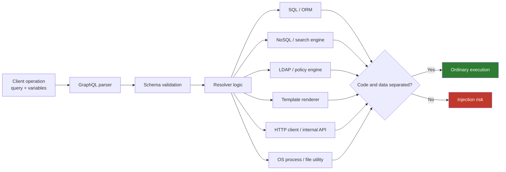
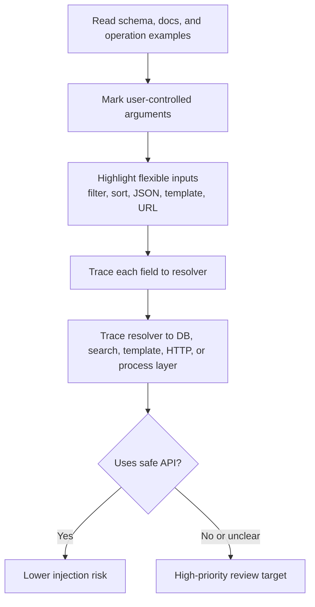

# GraphQL Injection

> **Difficulty:** Intermediate → Advanced | **Category:** API Pentesting — Advanced Vulnerabilities  
> **Focus:** Understand how GraphQL arguments become dangerous when resolvers pass them into downstream interpreters, and how to review and prevent this safely during **authorized** testing.

**GraphQL injection** is not usually about “breaking the GraphQL language itself.”  
It is usually about a GraphQL API accepting user-controlled arguments and then letting those arguments influence a **downstream interpreter** such as SQL, NoSQL, LDAP, a search engine, a template engine, a shell command, or an internal HTTP request.

That is why GraphQL injection belongs in the **advanced API vulnerabilities** phase: the visible API may look modern, typed, and well-structured, while the real risk lives deeper in resolver logic, query builders, integration adapters, and trust boundaries behind the schema.

This note follows the project guidance in `remember.txt` and the API pentesting architecture: start simple, build toward advanced reasoning, use diagrams where they improve memory, and keep the framing defensive.

---

## Table of Contents

1. [Why GraphQL Injection Matters](#1-why-graphql-injection-matters)
2. [Mental Model — GraphQL Is the Delivery Layer, Not the Sink](#2-mental-model--graphql-is-the-delivery-layer-not-the-sink)
3. [What Counts as GraphQL Injection](#3-what-counts-as-graphql-injection)
4. [Why Strong Typing Alone Does Not Save You](#4-why-strong-typing-alone-does-not-save-you)
5. [High-Signal Schema and Resolver Clues](#5-high-signal-schema-and-resolver-clues)
6. [Safe Authorized Validation Workflow](#6-safe-authorized-validation-workflow)
7. [Vulnerable vs Safer Resolver Patterns](#7-vulnerable-vs-safer-resolver-patterns)
8. [Detection and Triage](#8-detection-and-triage)
9. [Defensive Architecture and Mitigations](#9-defensive-architecture-and-mitigations)
10. [Key Takeaways](#10-key-takeaways)
11. [Public References](#11-public-references)

---

## 1. Why GraphQL Injection Matters

GraphQL changes **how clients ask for data**, but it does not magically remove classic injection risk.

PortSwigger’s GraphQL guidance is useful here: GraphQL vulnerabilities usually come from **implementation and design flaws**. OWASP makes the same point more directly: GraphQL applications still face SQL, NoSQL, OS command, LDAP, SSRF, and other injection risks whenever untrusted data reaches another interpreter unsafely.

### Why this can be deceptively dangerous

GraphQL often gives teams a false sense of safety because it offers:

- a typed schema
- a validation phase
- one central endpoint
- rich client tooling
- structured variables instead of ad hoc query strings

Those are good properties, but they do **not** guarantee safe execution.

If a resolver does any of the following, injection risk can still exist:

- builds SQL text dynamically
- passes free-form JSON into a document database query
- concatenates user input into a search or reporting expression
- forwards user-controlled URLs or paths to backend services
- treats client content as template syntax instead of plain data
- invokes OS utilities with unsafe argument construction

### Why GraphQL deserves its own note

GraphQL injection has a different review mindset from “generic API injection” because:

| GraphQL trait | Security meaning |
| --- | --- |
| One endpoint carries many operations | The risky input is often hidden inside operation variables, not the URL |
| Schema-driven design | The schema becomes your primary map for finding tainted inputs |
| Nested resolvers | One user-controlled value may fan out across multiple downstream systems |
| Flexible filtering and search patterns | Teams often expose `filter`, `where`, `search`, `sort`, or JSON-style arguments that drift too close to interpreter control |
| Rich error handling and tooling | Validation and backend errors can reveal a lot if not masked carefully |

> **If you remember one sentence, remember this:**  
> **GraphQL is rarely the dangerous interpreter. The dangerous part is the resolver path behind it.**

---

## 2. Mental Model — GraphQL Is the Delivery Layer, Not the Sink

The simplest way to think about GraphQL injection is:

> **Client input enters through a GraphQL document, but the real risk begins when a resolver turns that input into instructions for something else.**



### The important boundary

GraphQL parsing and validation answer questions like:

- Is the document syntactically valid?
- Does the field exist?
- Does this argument match the declared GraphQL type?

They do **not** answer:

- Is this string safe for SQL?
- Is this JSON object safe to pass to Mongo-style operators?
- Is this field name on an allowlist?
- Is this URL safe to fetch?
- Is this template content meant to be rendered as data or executed as logic?

That is why GraphQL validation should be viewed as **input shape checking**, not complete injection defense.

---

## 3. What Counts as GraphQL Injection

A helpful definition is:

> **GraphQL injection happens when data supplied through GraphQL arguments, variables, or input objects changes the meaning of a downstream interpreter instead of being handled as plain data.**

### Common families

| Injection family | Typical GraphQL anti-pattern | Possible impact |
| --- | --- | --- |
| **SQL / ORM injection** | Resolver concatenates `filter`, `sort`, `id`, or search text into SQL or raw ORM clauses | Unauthorized reads, state changes, auth bypass, destructive queries |
| **NoSQL injection** | Resolver accepts raw JSON or generic scalar input and passes it straight into a document query | Operator smuggling, over-broad matching, expensive queries, data leakage |
| **Search / query-language injection** | GraphQL search field is translated into Lucene, Elasticsearch, JMESPath, or proprietary search syntax unsafely | Overreach, information disclosure, resource-heavy search execution |
| **LDAP / directory injection** | Account lookup or identity resolver builds directory filters from arguments | Directory enumeration, authn or authz bypass |
| **Template / expression injection** | Notification, report, or preview mutations mix user content into executable templates | Secret exposure, unsafe rendering, possible server-side execution |
| **Command / process injection** | Export, conversion, diagnostic, or image-processing resolvers invoke shell commands or unsafe process builders | Host compromise, file exposure, service disruption |
| **HTTP / SSRF-style injection** | Resolvers allow client input to steer outbound requests or internal URLs | Internal service access, metadata exposure, trust-boundary collapse |

### What it is *not*

Not every GraphQL flaw is “GraphQL injection.” Keep the categories separate:

| Issue | Why it is different |
| --- | --- |
| Broken object-level authorization | User can access another object because authz is missing, not because an interpreter was manipulated |
| Introspection enabled | Discoverability issue, not injection |
| Excessive query depth / alias abuse | Resource-consumption issue, usually not injection |
| Sensitive field exposure | Response design or authz failure, not necessarily interpreter control |

GraphQL injection can, however, **combine** with those weaknesses. A single GraphQL API may have:

- poor field-level authorization,
- overly flexible filters,
- verbose errors,
- and weak rate limiting.

That combination often raises both exploitability and impact.

---

## 4. Why Strong Typing Alone Does Not Save You

One of the easiest mistakes is to assume:

> “The schema is typed, so injection should already be prevented.”

That assumption is incomplete.

### Where typing helps

GraphQL typing is valuable because it:

- reduces accidental ambiguity
- rejects obviously invalid shapes
- encourages explicit input models
- makes code review easier
- supports enums and custom scalars

### Where typing stops

Typing alone cannot guarantee:

- safe handling of free-form text
- safe translation into SQL, NoSQL, or search DSLs
- safe use of identifiers such as sort keys or field names
- safe use of flexible JSON scalars
- safe business meaning of input

### Practical comparison

| GraphQL feature | Security value | Remaining blind spot |
| --- | --- | --- |
| **String / Int / Boolean scalars** | Basic type safety | A valid string may still be unsafe when embedded in SQL or templates |
| **Enums** | Strong allowlisting for known choices | Only helps if the risky control really is modeled as an enum |
| **Input object types** | Encourages structured inputs | Still unsafe if fields are later concatenated into queries |
| **Custom scalars** | Can encode stronger validation rules | Only helps if validators are actually strict and consistent |
| **JSON / generic object scalars** | Flexible for advanced filters and integrations | High-risk when passed downstream without normalization |
| **Variables** | Cleaner transport of data | Safer transport does not mean safer execution |

### Special caution: JSON and “advanced filter” inputs

Apollo’s GraphQL security checklist explicitly warns about JSON scalars because they are more prone to malicious query behavior if they are not sanitized properly.

That warning is important in real APIs because GraphQL teams often expose convenient arguments like:

- `filter: JSON`
- `where: JSON`
- `query: JSON`
- `options: JSON`
- `search: String`
- `sort: String`

These look ergonomic for frontend development, but they create a large gap between **schema-level validation** and **execution safety**.

---

## 5. High-Signal Schema and Resolver Clues

During authorized review, the schema is your best starting map.

### Schema clues worth flagging

| Schema clue | Why it matters |
| --- | --- |
| `filter`, `where`, `search`, `query`, `expression` | Often converted into database or search logic |
| `sort`, `orderBy`, `fields`, `include`, `expand` | These often control identifiers, not just values |
| `url`, `callback`, `source`, `endpoint` | May steer outbound HTTP requests or internal integrations |
| `template`, `body`, `markup`, `renderOptions` | May reach a template engine, PDF generator, or expression parser |
| Custom scalar names like `JSON`, `JSONObject`, `Any`, `Map` | Weak schema constraints and hidden operator control |
| Admin or reporting mutations | Often have more powerful backends and broader privileges |

### Resolver and code clues worth flagging

| Code smell | Why it is risky |
| --- | --- |
| String-built SQL, LDAP, or search queries | User input may change logic rather than only supplying data |
| “Pass-through” use of filter objects | Clients may control operators or nested clauses too directly |
| Raw execution helpers | Shelling out, raw query APIs, dynamic templates, unsafe process execution |
| Client-controlled identifiers | Table names, column names, sort directions, collection names, field lists |
| Free-form URL fetches or upstream requests | User input may cross trust boundaries into SSRF territory |
| Verbose backend errors returned through GraphQL `errors` | They can reveal the interpreter, query structure, or stack details |

### Easy spec-first review workflow



### A useful review question

For each risky argument, ask:

> **Does this input control only a value, or can it change structure, identifiers, operators, or execution flow?**

That single question catches a surprising number of GraphQL injection designs.

---

## 6. Safe Authorized Validation Workflow

For an authorized assessment, the goal is to prove **unexpected interpreter influence**, not to dump data, damage systems, or escalate further than needed.

### Recommended workflow

1. **Read before sending**  
   Review the schema, API docs, captured traffic, and resolver code if available.

2. **Prioritize the most dangerous inputs**  
   Focus on free-form filters, JSON scalars, search arguments, sort controls, template-related mutations, outbound URL fields, and admin-style operations.

3. **Use low-impact validation first**  
   Prefer benign malformed input, boundary values, unexpected nesting, invalid enum choices, and undefined field names over aggressive payload experimentation.

4. **Observe behavior carefully**  
   Look for parser transitions, backend error leakage, timing anomalies, or evidence that validation ended too early and the downstream interpreter still saw the input.

5. **Stop at proof**  
   Once you have strong evidence that untrusted input is affecting the downstream interpreter unexpectedly, document the issue and move to root-cause confirmation instead of escalation.

6. **Prefer code review for final confirmation**  
   Resolver and data-access review is safer and often more definitive than pushing runtime validation further.

### Safe validation ideas

| Goal | Low-impact example style | What you are looking for |
| --- | --- | --- |
| Test schema strictness | Send a wrong type, wrong enum, or wrong nesting shape | Whether the GraphQL layer rejects bad input early |
| Test identifier allowlists | Use an undefined sort key or field selector | Whether the backend maps choices safely or accepts arbitrary identifiers |
| Test JSON scalar safety | Submit unexpected nested object structure in a flexible scalar | Whether raw objects flow into downstream operator handling |
| Test error hygiene | Trigger clearly invalid but harmless input | Whether DB, search, template, or stack details leak through GraphQL errors |
| Test resource guards | Stay within approved limits but vary list sizes and nesting | Whether protective controls exist before backend execution |

### Evidence patterns that are often enough

You often do **not** need a destructive demonstration if you can show:

- backend-specific parser errors surfacing through GraphQL
- the same field behaves safely for ordinary values but unsafely for flexible structures
- raw JSON operators or identifier-like values are accepted where allowlists should exist
- resolver code concatenates input directly into a downstream query or command

### What defensive testers should avoid

- escalating from “proof of unsafe influence” into destructive data modification
- broad fuzzing against production without explicit approval
- using high-volume or expensive queries to force proof
- treating every GraphQL error as exploitation proof without tracing the root cause

---

## 7. Vulnerable vs Safer Resolver Patterns

The safest way to learn GraphQL injection is to compare **design patterns**, not exploit strings.

### Example 1: SQL built from GraphQL input

#### Risky pattern

```javascript
const resolvers = {
  Query: {
    users: async (_, { status, sort }, { db }) => {
      const sql =
        `SELECT id, email, status FROM users ` +
        `WHERE status = '${status}' ` +
        `ORDER BY ${sort}`;

      return db.query(sql);
    }
  }
};
```

Why this is unsafe:

- `status` is treated as part of SQL text instead of a bound value
- `sort` controls an identifier directly
- GraphQL typing does not fix either problem

#### Safer pattern

```javascript
const SORT_FIELDS = {
  createdAt: 'created_at',
  email: 'email',
  status: 'status'
};

const resolvers = {
  Query: {
    users: async (_, { status, sort = 'createdAt' }, { db }) => {
      const orderBy = SORT_FIELDS[sort] || 'created_at';

      return db.query(
        `SELECT id, email, status
         FROM users
         WHERE status = ?
         ORDER BY ${orderBy}`,
        [status]
      );
    }
  }
};
```

What improved:

- values are parameterized
- identifiers are chosen from a server-side allowlist
- the query structure stays fixed

### Example 2: JSON scalar passed straight to a document database

#### Risky schema and resolver

```graphql
scalar JSON

type Query {
  searchUsers(filter: JSON): [User!]!
}
```

```javascript
const resolvers = {
  Query: {
    searchUsers: async (_, { filter }, { users }) => {
      return users.find(filter).toArray();
    }
  }
};
```

Why this is risky:

- the schema says almost nothing about allowed structure
- the backend trusts client-supplied query shape too much
- reviewability drops sharply because semantics live outside the schema

#### Safer pattern

```graphql
enum UserSortField {
  CREATED_AT
  EMAIL
}

input UserSearchInput {
  status: String
  emailContains: String
  sortBy: UserSortField = CREATED_AT
}
```

```javascript
const SORT_MAP = {
  CREATED_AT: 'createdAt',
  EMAIL: 'email'
};

const resolvers = {
  Query: {
    searchUsers: async (_, { input }, { users }) => {
      const query = {};

      if (input?.status) {
        query.status = input.status;
      }

      if (input?.emailContains) {
        query.email = { $regex: escapeRegex(input.emailContains), $options: 'i' };
      }

      return users
        .find(query)
        .sort({ [SORT_MAP[input?.sortBy || 'CREATED_AT']]: 1 })
        .toArray();
    }
  }
};
```

What improved:

- flexible JSON became a typed input model
- allowed fields are explicit in the schema
- resolver controls operator construction
- backend receives normalized server-built query objects

### Example 3: Template rendering mutation

#### Risky idea

A mutation that accepts both **template body** and **data** can become dangerous if the system evaluates user-supplied template syntax instead of treating it as content.

#### Safer design

- separate “content” from “template definition”
- only allow trusted administrators to manage template logic
- treat ordinary user input as data bound into pre-approved templates
- sandbox or avoid template engines with execution features where possible

The pattern is the same across SQL, search, templating, and command execution:

> **Keep interpreter structure under server control. Let the client supply only values.**

---

## 8. Detection and Triage

GraphQL injection findings should be triaged based on **sink**, **reachability**, **privilege**, and **impact**, not just on “injection exists.”

### Common signals during review

| Signal | What it may mean |
| --- | --- |
| GraphQL error response contains DB or search-engine parser text | Input reached the downstream interpreter unexpectedly |
| Generic scalar accepts deeply structured objects | Schema may be too permissive for safe execution |
| Same operation behaves very differently for undefined sort/filter values | Backend may be building identifiers or operators dynamically |
| Admin/report/export resolvers use “raw query” helpers | High-impact sink with broad privileges |
| Logs show expensive query planning or unexpected backend calls | Flexible GraphQL arguments are driving more than simple value lookups |

### Triage dimensions

| Dimension | Questions to ask |
| --- | --- |
| **Sink criticality** | Is the input reaching SQL, shell/process, template execution, search, LDAP, or internal HTTP? |
| **Exposure** | Is the operation public, authenticated-user only, admin-only, partner-only, or internal? |
| **Privilege behind the sink** | Does the DB user have write/delete/admin rights? Does the service identity reach internal systems? |
| **Data sensitivity** | Could the flaw expose credentials, PII, tenant data, finance data, or secrets? |
| **Execution controls** | Are there rate limits, timeouts, complexity limits, query allowlists, or strong input validators? |

### Severity intuition

| Situation | Typical severity direction |
| --- | --- |
| Low-privilege user can influence a powerful SQL or internal-HTTP sink | High |
| Admin-only mutation with unsafe query builder but strong operational controls | Medium to High, depending on exposure and privilege model |
| Flexible filter exists but resolver normalizes to safe server-built clauses | Lower risk |
| Risk only appears after both weak authz and unsafe resolver design are chained | Often high because the chain is realistic in API environments |

---

## 9. Defensive Architecture and Mitigations

Good GraphQL injection defense is layered. No single control is enough.

### 9.1 Schema design controls

| Control | Why it helps |
| --- | --- |
| Prefer typed input objects over generic JSON | Makes allowed structure visible and reviewable |
| Use enums for sort fields, modes, actions, and directions | Prevents arbitrary identifier control |
| Create strict custom scalars only when needed | Encodes business validation closer to the contract |
| Avoid “raw query” or “expression” arguments | Reduces interpreter exposure at the API boundary |
| Keep admin or reporting capabilities explicitly separated | Reduces accidental exposure of high-risk operations |

### 9.2 Resolver and data-access controls

| Control | Why it helps |
| --- | --- |
| Parameterize SQL and use safe query builders | Separates code from data |
| Map client choices to server-side allowlists | Protects identifiers and operators |
| Normalize flexible filters into server-built clauses | Prevents raw operator pass-through |
| Avoid shell invocation for routine tasks | Removes an entire class of dangerous sinks |
| Restrict outbound HTTP destinations | Prevents GraphQL-driven SSRF-style behavior |
| Treat all upstream and partner data as untrusted | Stops trust-boundary collapse in federated or integration-heavy graphs |

### 9.3 Platform and transport controls

GraphQL.org recommends a layered posture that includes demand control and careful discoverability decisions:

| Control | Security value |
| --- | --- |
| **Trusted documents** for first-party clients | Limits execution to approved operations in production |
| **Pagination** | Prevents unbounded data pulls |
| **Depth, breadth, and batch limits** | Constrains abusive or overly complex operations |
| **Rate limiting** | Helps absorb high-volume probing and costly operation abuse |
| **Query complexity analysis** | Blocks semantically expensive operations before execution |
| **Introspection policy** | Reduces schema discoverability when appropriate for non-public graphs |
| **Error masking** | Prevents backend parser details and stack traces from leaking |

### 9.4 Operational lessons from mature GraphQL programs

Public platform guidance shows what “production hardening” looks like in practice:

- **GraphQL.org** emphasizes trusted documents, depth/breadth limits, rate limiting, complexity analysis, and careful error handling.
- **OWASP** emphasizes allowlist validation, safe interpreter APIs, and disabling insecure defaults.
- **Apollo** highlights authorization, input sanitization, JSON scalar caution, error masking, and query controls.
- **Shopify** documents a cost-based GraphQL model where fields carry cost and overly expensive requests are throttled before they can dominate shared capacity.

### 9.5 Observability controls defenders should not skip

| What to log | Why it matters |
| --- | --- |
| `operationName` and authenticated identity | Helps tie risky behavior to actor and use case |
| Query depth, breadth, and calculated cost | Makes abnormal demand visible |
| Validation failures and denied enum / scalar checks | Shows probes and schema pressure |
| Resolver authorization failures | Highlights repeated access or discovery attempts |
| Downstream parser errors by resolver | Helps detect emerging injection patterns early |

### 9.6 A compact defensive checklist

- Model risky controls as **enums or strict input fields**, not free-form strings.
- Avoid generic `JSON` filters unless there is a very strong reason.
- Keep interpreter structure server-controlled.
- Use parameterized access libraries everywhere possible.
- Separate public-client flexibility from internal admin power.
- Apply cost, depth, and rate controls before execution becomes expensive.
- Mask backend errors in client responses, but log them internally with context.
- Review resolver code any time a field influences filtering, sorting, templates, URLs, or downstream execution.

---

## 10. Key Takeaways

### The shortest version to remember

> **GraphQL injection is usually resolver injection.**

### Five things advanced defenders should remember

1. **The schema is a map, not a guarantee.**  
   Good typing helps, but resolvers still decide how safely input is executed.

2. **Flexible inputs deserve disproportionate scrutiny.**  
   `filter`, `where`, `sort`, JSON scalars, template content, and outbound URLs are high-signal review targets.

3. **The main risk is not “special characters.”**  
   The real risk is letting untrusted input control structure, operators, identifiers, or execution flow in another interpreter.

4. **You usually do not need aggressive proof.**  
   In an authorized assessment, evidence of unexpected interpreter influence is often enough.

5. **The best defenses are layered.**  
   Schema discipline, safe resolver code, query-cost controls, rate limiting, and good observability reinforce one another.

---

## 11. Public References

- [GraphQL.org — Security](https://graphql.org/learn/security/)
- [OWASP GraphQL Cheat Sheet](https://cheatsheetseries.owasp.org/cheatsheets/GraphQL_Cheat_Sheet.html)
- [PortSwigger Web Security Academy — GraphQL](https://portswigger.net/web-security/graphql)
- [Apollo Blog — 9 Ways to Secure Your GraphQL API: Security Checklist](https://www.apollographql.com/blog/9-ways-to-secure-your-graphql-api-security-checklist)
- [Shopify Docs — API Rate Limits](https://shopify.dev/docs/api/usage/rate-limits)
