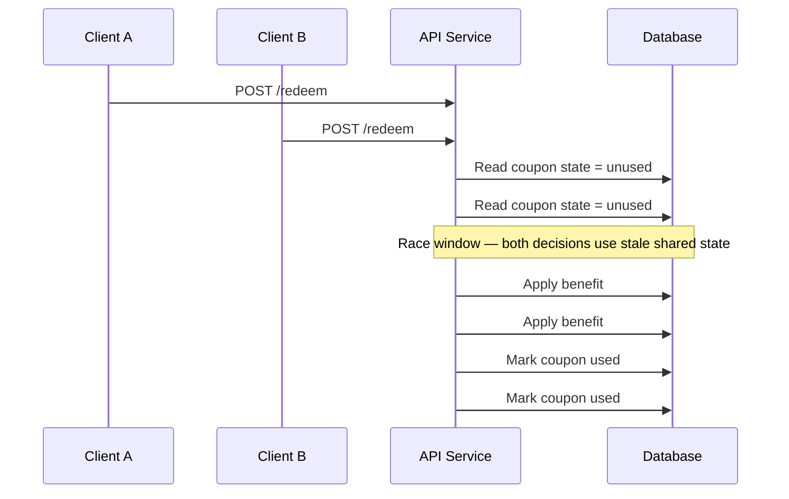
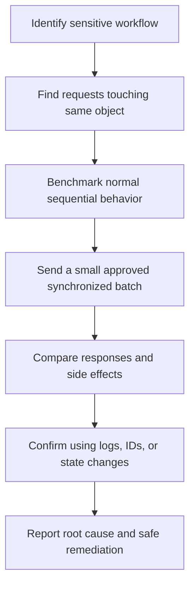
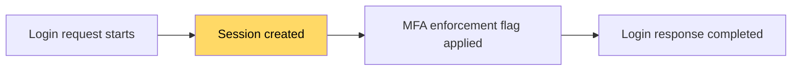
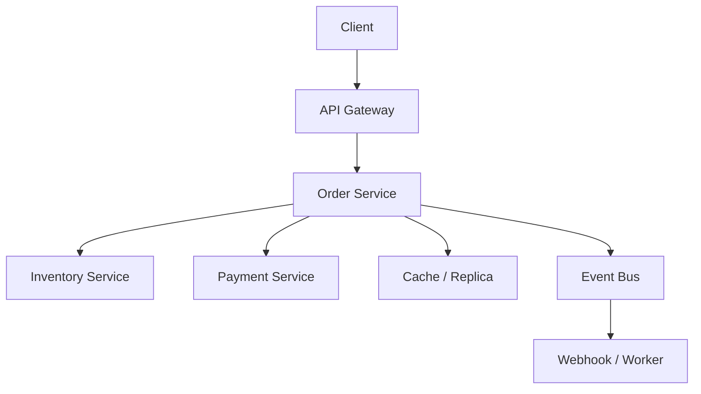

# Race Conditions in APIs

> **Module:** API Pentesting → Advanced API Vulnerabilities  
> **Difficulty:** Beginner → Advanced  
> **Focus:** Understand, safely validate, and help remediate race conditions in APIs during **authorized** security testing.

---

## 1. Overview

A **race condition** in an API happens when **two or more requests interact with the same state at nearly the same time**, and the final outcome depends on timing instead of the intended business rules.

Beginner version:

> The API checks something, decides it is allowed, and updates the system **too late**.

That gap might be tiny:

- a few milliseconds between a database read and write,
- a brief session state before MFA is enforced,
- a queue consumer processing the same event twice,
- a cache or replica returning stale state while another service already changed it.

In APIs, this matters more than many teams expect because APIs are built for:

- automation,
- retries,
- high concurrency,
- machine-to-machine workflows,
- mobile clients on unstable networks,
- asynchronous jobs, events, and webhooks.

So race conditions are not only a "fast clicking" problem. They are often a **distributed systems problem** expressed through an API.

### Quick mental model

```text
Request A: read state → check rule → update state
Request B: read same state → check same rule → update state

If both requests read before either write is committed,
then both may be accepted.
```

### Diagram — the classic API race window



The bug is usually not "two requests arrived." The bug is:

> **The system did not make the decision and the state change atomically.**

---

## 2. Why APIs Are Especially Exposed

Race conditions exist in many systems, but APIs create especially good conditions for them.

| API reality | Why it increases race risk |
| --- | --- |
| **Requests are easy to automate** | Attackers, testers, SDKs, bots, and background jobs can generate tightly timed traffic. |
| **Retries are normal** | Mobile clients, gateways, queues, and payment flows often retry on timeout or uncertainty. |
| **Business actions are exposed directly** | APIs often map straight to sensitive workflows: redeem, transfer, invite, approve, refund, rotate, reset. |
| **Microservices split state** | One business action may touch a database, cache, queue, ledger, and third-party webhook. |
| **Async delivery is common** | Webhooks and event consumers are often at-least-once, not exactly-once. |
| **High throughput is expected** | Teams optimize for performance and scale, sometimes weakening locking or consistency guarantees. |
| **Different layers enforce different rules** | Gateway limits, service logic, caches, and databases may disagree under concurrency. |

A crucial modern point: PortSwigger's research on web race conditions showed that highly precise synchronization is practical, especially with HTTP/2-era tooling and methodology. Defenders should assume that a motivated authorized tester can align requests **far more accurately** than older "manual double click" thinking suggests.

---

## 3. Core Terminology You Should Know

| Term | Meaning | Why it matters in API testing |
| --- | --- | --- |
| **Race condition** | Concurrent operations interfere with shared state | The broad vulnerability family |
| **Race window** | The brief time in which another request can observe or change the same state | Smaller windows are harder to hit, but still possible |
| **TOCTOU** | Time-of-check to time-of-use | The most common API race pattern: check first, update later |
| **Lost update** | Two writes occur, and one silently overwrites the other | Common in profile updates, quotas, role settings, stock counters |
| **Limit overrun** | A "one-time" or rate-limited action succeeds multiple times | Common in coupons, voting, gift cards, password reset, MFA, credits |
| **Idempotency** | Repeating the same operation safely yields the same result | Critical for retries, payments, and external integrations |
| **Optimistic concurrency** | The API only accepts an update if the client proves it used the latest version | Often implemented with versions or `ETag` / `If-Match` |
| **Pessimistic locking** | Access to a record is serialized while a critical section runs | Safer for some money or inventory flows, but can hurt throughput |
| **Duplicate delivery** | The same event or webhook arrives more than once | Must be expected, not treated as rare |
| **Eventual consistency** | Different components temporarily disagree on current state | Creates cross-service race opportunities even if one DB write is correct |
| **Sub-state** | A short-lived internal state during request processing | Important for advanced multi-step and multi-endpoint races |

MITRE CWE-362 describes the root issue as concurrent access without proper synchronization, and highlights that **atomicity** and **exclusive access** are what usually break. MITRE CWE-367 narrows this to the classic **check-then-use** gap.

---

## 4. Where Race Conditions Appear in Real APIs

### 4.1 Common business flows

| Flow | Shared state that collides | What can go wrong |
| --- | --- | --- |
| **Coupon / promo redemption** | coupon usage record | One-time discount applies multiple times |
| **Gift card / wallet credit** | remaining balance or redemption record | Credits multiply or balance drifts |
| **Inventory reservation** | stock counter or reservation row | Overselling or negative stock |
| **Transfers / payouts** | account balance or transaction state | Double spend, duplicate payout, inconsistent ledger |
| **Password reset / MFA / verification** | token state, session flags, challenge status | Tokens reused, sessions escape intended checks |
| **Rate limiting / quota enforcement** | per-user or per-key counters | Limits bypassed during bursts |
| **Invite / approval / role workflows** | membership state or approval state | Role applied twice, approval state bypassed, inconsistent privilege |
| **Job creation / imports / exports** | job identity and dedupe state | Duplicate long-running tasks or duplicate artifacts |
| **Webhook consumption** | event delivery ID and processed flag | Same event processed repeatedly |
| **Refund / cancel / reverse flows** | transaction lifecycle state | Cancel, refund, and fulfill states diverge |

### 4.2 By API style

| API style | Typical race hotspot | Testing question |
| --- | --- | --- |
| **REST** | `POST`, `PATCH`, `PUT`, `DELETE` on sensitive objects | Does each state change happen atomically? |
| **GraphQL** | Mutations that touch balances, carts, entitlements, invitations | Do resolvers share the same lock / transaction assumptions? |
| **gRPC / RPC** | High-throughput method calls and retries in service meshes | Are retries safe, or do they duplicate side effects? |
| **Webhook APIs** | At-least-once delivery and replay handling | Is each event deduplicated by a stable event ID? |
| **Async job APIs** | Create, poll, cancel, retry workflows | Can job state flip or duplicate under concurrency? |

---

## 5. Modern Attacker Patterns Defenders Should Expect

This section is intentionally framed for **defensive awareness and authorized testing**.

| Pattern | Why it matters now | Defender takeaway |
| --- | --- | --- |
| **Precise synchronized requests** | Modern tooling and HTTP/2 reduce network jitter enough to expose very small race windows | Do not dismiss a bug because the timing window seems "too tiny" |
| **Retry storms from real clients** | SDKs, mobile apps, and gateways may retry automatically during latency or packet loss | A bug may be exploitable by normal failure handling, not only by malicious traffic |
| **Multi-endpoint collisions** | One request changes session or workflow state while another consumes it | Test workflows, not just single endpoints |
| **Edge/core drift** | Gateway counters and core business logic may not share the same authoritative state | Rate limiting or quotas at the edge may not protect the sensitive action itself |
| **Duplicate webhook or queue processing** | At-least-once delivery is common in event-driven systems | Every consumer must be safely repeatable or deduplicated |
| **Cross-service stale reads** | Caches, replicas, and downstream services may observe old state | "The database row was correct" is not enough if another layer acted on stale data |
| **Multi-region lag** | Writes propagate slower than business decisions spread across regions | Financial, inventory, and entitlement APIs need stronger consistency design |
| **Bot-scale business logic abuse** | Automated clients can combine concurrency with valid credentials and normal API usage | Sensitive business flows need both auth controls and concurrency-safe state handling |

PortSwigger's 2023 research is especially important here because it expanded race-condition thinking beyond simple "limit overruns" into:

- hidden sub-states,
- multi-endpoint races,
- single-endpoint internal state transitions,
- deferred and asynchronous side effects.

That is exactly why advanced API race testing has to move beyond "send the same request twice."

---

## 6. Safe Authorized Testing Methodology

Race-condition testing can create real side effects. In an API environment, that means you should be more careful than usual.

### 6.1 Preconditions

Before testing:

- get explicit authorization,
- prefer **staging**, **sandbox**, or a tightly controlled test tenant,
- use **synthetic users**, **synthetic inventory**, **synthetic coupons**, or low-value objects,
- notify owners if the workflow could create alerts, jobs, refunds, or outbound webhooks,
- ensure request IDs, event IDs, and audit logs are available,
- keep concurrency **small and deliberate** during validation.

> Never validate a suspected API race by risking real customer balances, real stock, or irreversible production actions unless the engagement rules explicitly allow it and the owner has prepared for it.

### 6.2 Practical validation workflow



### 6.3 What to look for first

Ask these questions:

1. **Does the workflow touch a shared object?**  
   Example: one balance, one coupon, one invite, one session, one reservation.

2. **Is there a decision before the state change?**  
   Example: "unused?", "enough balance?", "under limit?", "token valid?", "role still pending?"

3. **Is the operation edit-or-check based, not just append-only?**  
   Appending a harmless audit row is rarely the bug. Editing a shared object is where races live.

4. **Could retries happen naturally?**  
   If yes, the risk is higher because real systems may trigger the bug accidentally.

5. **Does the workflow cross service boundaries?**  
   If yes, test for stale reads, duplicate events, and out-of-order processing.

### 6.4 High-signal test candidates

Prioritize:

- payments, refunds, credits, and gift balances,
- promo codes, entitlements, and one-time offers,
- account recovery, MFA, session rotation, and invite acceptance,
- order placement, reservation, ticketing, and stock allocation,
- bulk jobs, imports, exports, and asynchronous status transitions,
- webhook receivers and queue consumers.

---

## 7. API Race Condition Classes

### 7.1 Limit Overruns and One-Time Actions

This is the most familiar class.

The API intends a rule like:

- one use per user,
- one redemption per code,
- one verification per token,
- one bonus per event,
- ten requests per minute.

But the implementation does this:

```text
1. Check if allowed
2. Perform effect
3. Mark the action as consumed
```

If steps 1 and 3 are not part of the same atomic decision, duplicates can slip through.

### Vulnerable pattern

```sql
-- Conceptual vulnerable flow
SELECT used FROM coupons WHERE code = 'PROMO-123';
-- application sees used = false

UPDATE orders SET discount_applied = true WHERE order_id = 101;
UPDATE coupons SET used = true WHERE code = 'PROMO-123';
```

### Safer pattern

```sql
-- Atomic state transition
UPDATE coupons
SET used = true, used_by = :user_id, used_at = NOW()
WHERE code = :code
  AND used = false;

-- proceed only if exactly one row changed
```

Better still, keep the **business effect** and the **state transition** in one transaction or one durable ledger-style operation.

### Why APIs make this common

- promo redemption endpoints are easy to automate,
- retries may repeat a request after a timeout,
- API gateways may accept a burst before a downstream counter updates,
- multiple client apps may hit the same account simultaneously.

---

### 7.2 Lost Updates and Conflicting Writes

Not every race is about getting something twice. Sometimes the problem is that one update silently stomps another.

Examples:

- two admins update the same policy,
- one service disables an account while another re-enables it from stale data,
- a user updates profile settings from mobile while support updates them from the dashboard,
- a subscription or entitlement state is overwritten by an older event.

### Classic symptom

```text
GET /profile   → version 42
Client A edits timezone
Client B edits email
Both submit updates based on version 42
One write silently overwrites the other
```

### Better API design: conditional updates

MDN's documentation on `ETag` and `If-Match` shows a standard way to prevent mid-air collisions.

```http
GET /api/v1/profile
ETag: "42"
```

```http
PUT /api/v1/profile
If-Match: "42"
Content-Type: application/json

{ "timezone": "UTC" }
```

If the resource changed since version `42`, the server should reject the update, typically with `412 Precondition Failed` or a domain-specific conflict response.

### Practical takeaway

When an API allows stateful updates but does **not** use:

- version fields,
- conditional requests,
- compare-and-swap semantics,
- or a transaction-safe merge strategy,

then lost-update races deserve attention.

---

### 7.3 Hidden Sub-States and Multi-Endpoint Races

This is where race conditions become more advanced.

A single request can move the application through **temporary internal states** that are never meant to be observable externally. PortSwigger's research popularized this idea by showing that **everything is multi-step** if you look closely enough.

### Example mental model



If another request reaches a sensitive endpoint while the session exists but the protective flag is not fully enforced yet, a hidden sub-state may be exposed.

### API workflows that deserve this mindset

- login followed by privileged API access,
- password reset initiation plus token consumption,
- invite acceptance plus role upgrade,
- cancel plus refund plus fulfillment updates,
- refresh token rotation plus use of the old token,
- order placement plus stock allocation plus shipment trigger.

### Why this is easy to miss

Developers often reason about whole requests as if each one were atomic.

But server code may actually do:

- create session,
- attach claims,
- queue event,
- write audit record,
- update user state,
- invalidate previous token,
- return response.

If those steps are not protected as one safe state machine, a race can exist even when the endpoint looks fine at a high level.

---

### 7.4 Async, Deferred, and Event-Driven Races

Many modern API environments are asynchronous by design.

That creates a crucial shift:

> The vulnerability may not appear during the HTTP response at all. It may appear later, in workers, queues, webhooks, or compensating actions.

| Async component | Race pattern | Result |
| --- | --- | --- |
| **Webhook receiver** | Same event processed twice | Duplicate credit, duplicate provisioning, duplicate notification |
| **Queue consumer** | Worker retry replays a side effect | Duplicate job output or duplicate state transition |
| **Saga / workflow engine** | Cancel and fulfill events arrive out of order | Final state becomes inconsistent |
| **Outbox publisher** | Publish succeeds twice while consumer is not deduping | Repeated downstream actions |
| **Read replica** | API reads stale state right after a write | Second action is approved when it should fail |

This is why "exactly once" is often the wrong design assumption. In practice, many platforms are **at least once**, so handlers must be:

- idempotent,
- deduplicated,
- or protected by a durable uniqueness rule.

---

### 7.5 Distributed Races Across Microservices

A single API call can cross many boundaries.



This matters because each component may have different ideas about:

- current state,
- lock ownership,
- retry behavior,
- deduplication,
- transaction boundaries,
- event order.

### Common distributed failure modes

| Failure mode | Example |
| --- | --- |
| **Gateway says allowed, core says already consumed** | rate limit or quota enforced only at the edge |
| **Inventory decremented once, shipment created twice** | side effects split across services without a shared idempotency model |
| **Payment timed out, client retries, downstream later succeeds twice** | retry semantics are unclear across service boundaries |
| **Cache still says active while DB says revoked** | stale state makes a second action look valid |
| **Two regions accept the same one-time action** | replication lag turns a local success into a global race |

In advanced API systems, race conditions are often less about one SQL statement and more about **inconsistent coordination across components**.

---

## 8. High-Signal Clues During Testing and Review

You rarely start with proof. You usually start with clues.

| Clue | What it may indicate |
| --- | --- |
| Multiple success responses for a supposedly one-time action | limit overrun or duplicate processing |
| A mix of `200` and `409` / `412` responses in the same synchronized batch | some requests observed stale state before the lock or version check settled |
| Duplicate resource creation with the same business meaning | missing unique constraint or broken dedupe |
| Negative balances, negative stock, or counter drift | non-atomic decrement or inconsistent compensating logic |
| Same event ID causes multiple business effects | webhook or queue dedupe failure |
| Same idempotency key produces different effects | broken idempotency implementation |
| Logs show out-of-order state changes | event ordering issue or hidden sub-state |
| Audit log shows one logical action, but downstream artifacts show two | split transaction boundary |
| Old token works briefly after rotation or logout | session invalidation race |
| GET shows stale status right after a critical POST | cache or replica consistency issue |

### Code review smells

Look closely when you see:

- read → check → write patterns,
- boolean flags like `used`, `processed`, `redeemed`, `approved`, `sent`,
- separate tables for decision state and effect state,
- retries without request fingerprints,
- webhook consumers that trust delivery once-only,
- caches or replicas used for authorization or spend decisions,
- async state transitions without ordering guarantees,
- status updates without version checks.

---

## 9. Idempotency: One of the Most Important API Defenses

Stripe's API documentation is a strong practical reference here: the platform supports idempotent `POST` requests so clients can safely retry without accidentally creating a second object or repeating an update.

That idea is bigger than payments.

### What good idempotency means

A proper idempotency design should usually:

1. bind a request to a **stable client-supplied key**,
2. store the **first completed result** for that key,
3. return the **same result** for safe retries,
4. reject reuse of the key with **different parameters**,
5. scope the key appropriately, such as by route, actor, or tenant.

### What bad idempotency looks like

| Weak pattern | Why it fails |
| --- | --- |
| Idempotency key stored only in cache with weak TTL | duplicate requests can slip through after eviction or node change |
| Key not bound to request parameters | same key may approve a different action |
| Key checked after the business effect | duplicate side effects can already exist |
| Key scoped too broadly | unrelated operations block each other |
| Key scoped too narrowly | retries route to a different worker and bypass dedupe |

### Important nuance

Idempotency helps with retries and duplicate submissions, but it does **not** solve every race.

It does **not** replace:

- unique constraints,
- atomic state transitions,
- conditional updates,
- proper authorization,
- correct event ordering.

---

## 10. Remediation Patterns That Actually Work

### 10.1 Choose the right control for the right layer

| Layer | Strong patterns | Notes |
| --- | --- | --- |
| **API contract** | Idempotency keys, version fields, `ETag` / `If-Match`, clear retry semantics | Make safe behavior part of the interface, not tribal knowledge |
| **Application logic** | Single authoritative decision point, explicit state machine, per-object serialization for critical actions | Avoid duplicated business rules across services |
| **Database** | Atomic updates, transactions, row locking where appropriate, unique constraints, compare-and-swap | Many race bugs become impossible if the DB enforces the invariant |
| **Distributed systems** | Durable dedupe tables, inbox/outbox, ordered processing where needed, event IDs, replay-safe consumers | Design for retries and duplicate delivery |
| **Caching / replicas** | Do not make critical spend or auth decisions from stale state | Fast reads are not a justification for unsafe writes |
| **Observability** | Request IDs, idempotency keys, event IDs, trace correlation, anomaly alerts | Race conditions are easier to prove and fix when state transitions are visible |

### 10.2 Practical mitigation checklist

#### For one-time or high-value actions

- enforce the business rule at the **storage layer**, not only in API code,
- use **unique constraints** for unique business facts,
- perform the **check and consume** in one durable operation,
- return conflict responses when the action is already consumed.

#### For updates

- use resource versions or `ETag` / `If-Match`,
- reject stale writes instead of silently merging them,
- log version conflicts so teams can detect unsafe clients.

#### For payments, credits, and ledgers

- prefer **append-only ledger events** plus invariant checks,
- separate visible balance from the authoritative transaction ledger carefully,
- never rely on a cache as the final authority for spend decisions.

#### For async consumers

- require a **stable event ID**,
- store "processed" state durably,
- make downstream actions idempotent,
- handle retries and out-of-order delivery as normal conditions.

#### For sessions and auth flows

- avoid temporary privileged sub-states,
- rotate and revoke tokens atomically where possible,
- ensure old tokens cannot survive a partially completed state transition.

### 10.3 A useful rule of thumb

If the business rule is:

- only once,
- only one at a time,
- only if still current,
- only if the previous step completed,
- only while this token/session/invite is valid,

then concurrency safety must be an explicit part of the design.

---

## 11. Safe Reporting Guidance for Pentesters

When documenting an API race condition, include more than "sent concurrent requests and got two successes."

### Report these details

| Item | Why it matters |
| --- | --- |
| **Business rule broken** | Explains real impact better than raw timing detail |
| **Shared object or state** | Shows what actually collided |
| **Endpoints or workflow steps involved** | Important for multi-endpoint and distributed races |
| **Observed side effect** | Duplicate credit, duplicate order, stale privilege, inconsistent status, etc. |
| **Reliability** | Was it occasional, frequent, or near-deterministic in the approved test setup? |
| **Required conditions** | HTTP/2 support, retry behavior, replica lag, async worker timing, same tenant, same token, etc. |
| **Likely root cause** | check-then-use, missing unique constraint, bad idempotency, stale cache, async duplicate processing |
| **Safer remediation path** | Gives engineers something actionable beyond "add a lock" |

### Severity thinking

The technical race window might be small, but the impact can still be high if the bug affects:

- money movement,
- account recovery,
- privilege transitions,
- entitlement or subscription state,
- tenant isolation,
- destructive admin actions.

Remember that attack complexity is not static over time. Better tooling and retry-heavy architectures can make formerly "hard" race conditions much more realistic.

---

## 12. Quick Review Checklist

Use this when reviewing an API design or testing a workflow.

- [ ] Does the action touch a **shared object**?
- [ ] Is there a **check before a state change**?
- [ ] Can the same action be triggered by **retries** or **parallel clients**?
- [ ] Is the action protected by **idempotency**, **versioning**, or an **atomic DB rule**?
- [ ] Could **another endpoint** interact with the same object during processing?
- [ ] Could **webhooks, workers, or queues** replay the same action later?
- [ ] Are **caches or replicas** used in a security-critical decision?
- [ ] Is there a **unique business invariant** enforced at the storage layer?
- [ ] Can logs correlate request IDs, event IDs, and state transitions?
- [ ] Would the system still be correct if the same request arrived twice?

If you can answer "no" to several of these, a race-condition review is probably warranted.

---

## 13. Key Takeaways

- Race conditions in APIs are usually **business logic and state management flaws**, not merely "speed hacks."  
- The classic bug is **TOCTOU**: check now, use later, update too late.  
- Modern APIs make races more relevant because of **automation, retries, async delivery, and distributed state**.  
- Advanced cases involve **hidden sub-states**, **multi-endpoint workflows**, and **cross-service inconsistency**.  
- Safe validation should be **authorized, low-risk, and evidence-driven**.  
- Durable fixes usually combine **atomic storage rules**, **idempotency**, **conditional updates**, and **replay-safe event handling**.

---

## 📚 Sources and Further Reading

1. **PortSwigger Web Security Academy — Race conditions** — practical explanation of race windows, limit overruns, and modern testing methodology  
   https://portswigger.net/web-security/race-conditions

2. **PortSwigger Research — Smashing the state machine: The true potential of web race conditions** — important research on hidden sub-states, multi-endpoint races, and precise synchronization in modern web/API environments  
   https://portswigger.net/research/smashing-the-state-machine

3. **MITRE CWE-362 — Concurrent Execution using Shared Resource with Improper Synchronization** — formal description of race conditions, atomicity, exclusivity, consequences, and mitigations  
   https://cwe.mitre.org/data/definitions/362.html

4. **MITRE CWE-367 — Time-of-check Time-of-use (TOCTOU) Race Condition** — focused reference for the classic check-then-use flaw pattern  
   https://cwe.mitre.org/data/definitions/367.html

5. **OWASP API Security Top 10 2023 — API6: Unrestricted Access to Sensitive Business Flows** — helpful for understanding why business-critical API flows attract automation and abuse  
   https://raw.githubusercontent.com/OWASP/API-Security/refs/heads/master/editions/2023/en/0xa6-unrestricted-access-to-sensitive-business-flows.md

6. **Stripe API Docs — Idempotent requests** — concrete operational guidance for making retried API requests safe without duplicating side effects  
   https://docs.stripe.com/api/idempotent_requests

7. **MDN — `ETag` and `If-Match`** — practical explanation of conditional requests for preventing mid-air update collisions  
   https://developer.mozilla.org/en-US/docs/Web/HTTP/Headers/ETag  
   https://developer.mozilla.org/en-US/docs/Web/HTTP/Headers/If-Match
