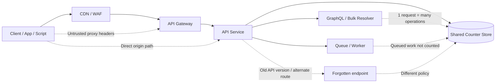
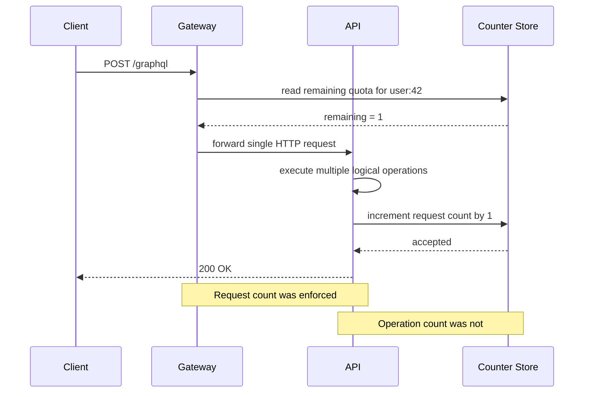

# Rate Limit Bypass

> **Difficulty:** Intermediate → Advanced | **Category:** API Pentesting — Advanced Vulnerabilities  
> **Rate limit bypass happens when an API appears to enforce throttling, quotas, or lockouts, but callers can still exceed the intended operation budget because the control is keyed, counted, placed, or synchronized incorrectly.**

---

## 🧠 What Is It? (Beginner Explanation)

A rate limit is supposed to be the API's **traffic cop**.
It decides how many times a caller can perform an action in a given period.

A **rate limit bypass** means the traffic cop is standing in the wrong place, checking the wrong ID, or counting the wrong thing.

A simple analogy:

- A stadium says each person can enter **once**.
- The guard only checks **shirt color**, not the ticket or person.
- The side gate has **no guard at all**.
- A group enters together using **one scan** even though ten people walked through.

The stadium still has a “limit,” but it is not enforcing the rule that actually matters.

In APIs, that happens when controls are based only on one weak signal, such as:

- IP address only
- request count only
- edge gateway only
- one route only
- one protocol only
- non-atomic counters only

This is why rate limit bypass is usually **not** just a performance problem.
It often becomes a **security control failure** affecting:

- login and lockout protection
- password reset and OTP workflows
- coupon / credit / gift-card logic
- report exports and bulk data pulls
- file upload or image-processing costs
- SMS / email / third-party billing abuse
- GraphQL batching and bulk mutation safety

> **Key idea:** The real question is not “does the API ever return `429 Too Many Requests`?”  
> The real question is **“does the API consistently enforce the intended business limit across all equivalent ways to perform the action?”**

---

## 🏗️ How It Works (Technical Deep Dive)

A good rate limit is not a single feature. It is a combination of:

1. **Subject identification** — who or what is being limited?
2. **Operation identification** — which action is being limited?
3. **Unit of counting** — requests, attempts, records, bytes, jobs, or cost?
4. **Time model** — fixed window, sliding window, token bucket, concurrency cap?
5. **Enforcement point** — CDN, WAF, API gateway, app, queue, or worker?
6. **Storage and consistency** — local memory, Redis, database, globally replicated store?
7. **Response contract** — `429`, `Retry-After`, lockout, challenge, audit event?

If any of those are wrong, the limit can often be bypassed.

### 1. Subject mismatch

The API limits by **IP only**, but the action is really tied to:

- an authenticated user
- an account identifier
- a tenant
- an API key
- a phone number or email address
- a device fingerprint or workload identity

If the limiter watches the wrong subject, the business rule is not enforced.

### 2. Operation mismatch

The limiter counts **HTTP requests**, but the request performs:

- multiple GraphQL operations
- a bulk REST mutation
- a batch job submission
- a streaming or WebSocket message burst
- a high-cost export or image-processing task

One HTTP request may hide many logical operations.

### 3. Placement mismatch

The edge blocks traffic, but the origin or alternate path does not.
Common examples:

- CDN limit present, direct origin access still reachable
- `/v2/` protected, `/v1/` forgotten
- REST endpoint limited, equivalent GraphQL mutation not limited
- public route limited, internal or mobile route not limited
- gateway counts requests, async workers create unlimited downstream work

### 4. Consistency mismatch

The limiter exists, but its counter is not updated safely.
That creates race windows and split-brain behavior such as:

- two requests reading the same remaining quota before either writes back
- per-node in-memory counters behind a load balancer
- multi-region lag where each region believes quota remains
- cache eviction or reset behavior that effectively grants new quota early

### 5. Response mismatch

The client sees `429`, but the expensive action still happened behind the scenes.
This is especially dangerous in asynchronous systems where the queue, worker, or third-party integration is not coupled to the limiter.

### 6. Business mismatch

The real security rule is often **not about traffic volume**.
It is about **how often a sensitive function may be used**.

Examples:

- max 5 login attempts per user + IP + device per 15 minutes
- max 3 OTP sends per phone number per hour
- max 1 password reset initiation per account every few minutes
- max 1 coupon redemption per account
- max 2 concurrent export jobs per tenant
- max 100 records returned per page regardless of client-supplied `limit`

OWASP WSTG frames this as testing whether a function can be used **more times than intended**, which is often the heart of rate-limit bypass.

### Why `429` alone is not enough

RFC 6585 defines `429 Too Many Requests`, and servers may include `Retry-After`. That is helpful, but it does **not** define:

- how the user is identified
- what unit is counted
- whether the count is global or per-resource
- whether equivalent routes share the same budget

So an API can be standards-compliant and still be insecure.

---

## 📊 Architecture / Flow Diagrams

### Diagram 1 — Where rate-limit bypass appears in API stacks



### Diagram 2 — A classic counting failure



---

## ⚙️ Technical Details

### Common rate-limiting models

| Model | How it works | Strengths | Common bypass / failure pattern |
| --- | --- | --- | --- |
| **Fixed window** | Count requests in a fixed period like 1 minute | Simple, fast | Boundary effects around reset time; coarse control |
| **Sliding window** | Evaluate activity over the last N seconds/minutes | More accurate | Harder to implement globally; consistency issues at scale |
| **Token bucket** | Tokens refill over time and each action consumes one or more tokens | Good for bursts + steady control | Often counts requests, not business cost |
| **Leaky bucket** | Smooths output rate by draining at a fixed rate | Useful for smoothing bursts | Expensive actions may still be under-counted |
| **Concurrency limit** | Cap simultaneous in-flight operations | Good for exports, jobs, uploads | Background or retried work may escape the cap |
| **Budget / weighted quota** | Different operations consume different amounts | Closest to business reality | Requires accurate operation classification |

### What mature APIs actually need to count

| What the API sees | What the business cares about | Safer control |
| --- | --- | --- |
| HTTP requests | Login attempts | Per-account + per-IP + per-device attempt budget |
| HTTP requests | GraphQL mutations in one payload | Count operations and aliases, not just envelopes |
| Requests to `/reports` | Export jobs created | Rate-limit job creation and concurrent job count |
| Requests from an IP | OTP sends to a phone number | Limit by recipient + account + IP |
| Requests to one path | Equivalent action across `/v1/`, `/v2/`, mobile, GraphQL | Share a common operation key |
| One node's local memory | Global tenant usage | Central atomic store with consistent keys |

### Spec-driven review: use the API contract as a control map

A strong API review should start with the **API specification** or equivalent contract:

- **OpenAPI / Swagger** for REST
- **GraphQL schema** for queries and mutations
- **gRPC `.proto`** for RPC methods
- internal workflow docs for async jobs and event endpoints

The contract tells you what sensitive operations exist.
The rate-limit design should then explain how each of those operations is budgeted.

A useful defensive pattern is to annotate the contract with internal metadata, even if the field is custom:

```yaml
openapi: 3.1.0
info:
  title: Example API
  version: 1.0.0
paths:
  /v1/auth/login:
    post:
      operationId: loginUser
      summary: Authenticate a user
      x-rate-limit:
        subject:
          - account_identifier
          - source_ip
        unit: login_attempt
        burst: 5
        window: 15m
  /v1/reports/export:
    post:
      operationId: createExport
      summary: Start an export job
      x-rate-limit:
        subject:
          - tenant_id
          - authenticated_user
        unit: export_job
        burst: 2
        window: 10m
```

OpenAPI itself does not standardize rate limits, but this kind of internal extension helps defenders answer the question:

> “For every documented sensitive operation, what is the exact control, where is it enforced, and what subject is it keyed on?”

### Response headers worth understanding

Many APIs expose some combination of these headers:

```http
HTTP/1.1 429 Too Many Requests
Content-Type: application/json
Retry-After: 60
RateLimit-Limit: 5
RateLimit-Remaining: 0
RateLimit-Reset: 60
```

These headers are useful for:

- client backoff behavior
- security testing visibility
- operational debugging
- proving that different routes share or do not share a common budget

But remember: **headers describe the limiter's story**. They do not prove the business rule is actually being enforced.

### Example of a safer implementation pattern

```javascript
async function enforceLimit(req, res, next) {
  const operation = normalizeOperation(req); // route or logical operation, not raw path only
  const accountId = req.user?.id ?? 'anonymous';
  const tenantId = req.user?.tenantId ?? 'public';
  const sourceIp = req.trustedClientIp; // only after trusted proxy validation

  const subject = `${tenantId}:${accountId}:${sourceIp}:${operation}`;
  const cost = operationCost(req); // batch items or expensive actions may cost >1

  const allowed = await rateStore.consume({
    key: subject,
    cost,
    windowSeconds: 60,
    limit: 10
  });

  if (!allowed.ok) {
    res.set('Retry-After', String(allowed.retryAfter));
    return res.status(429).json({ error: 'rate_limit_exceeded' });
  }

  return next();
}
```

Properties of the safer pattern:

- uses a **logical operation key**, not just the raw URL
- includes **identity context** beyond IP alone
- supports **weighted cost** for expensive or batched actions
- assumes the client IP is trusted **only after proxy validation**
- returns a predictable response contract

---

## 🔴 Attack Surface

### Common ways APIs become bypassable

| Weakness | What goes wrong | Typical impact |
| --- | --- | --- |
| **IP-only limits** | Shared NATs, cloud clients, mobile networks, or authenticated sessions make IP a weak identity | Brute-force resistance and business-flow protection degrade |
| **Proxy-header trust mistakes** | App trusts `X-Forwarded-For`, `Forwarded`, or similar headers from untrusted clients | Callers can appear as many different sources |
| **Per-request counting only** | One request carries many operations, aliases, IDs, or work items | Bulk and GraphQL paths bypass intended caps |
| **Route-specific limits only** | Equivalent functionality exists in another version, host, or protocol | Protection applies to one path but not the real workflow |
| **Gateway-only enforcement** | Origin, worker, or internal service can still execute the action | `429` may not stop actual side effects |
| **Node-local counters** | Each server has its own memory-based budget | Load balancing effectively multiplies allowed usage |
| **Race conditions** | Counter reads and writes are not atomic | Parallel requests overrun limits |
| **Weak canonicalization** | `/v1/reset`, `/v1/reset/`, `POST` vs `PUT`, or alternate content types hit different rules | Same action receives different policies |
| **Tenant-blind limits** | One noisy tenant can starve others or use many accounts to evade control | Availability and fairness problems |
| **Missing cost controls** | Large page sizes, deep GraphQL queries, or heavy uploads count as “one” | Resource exhaustion without obvious request spikes |

### Sensitive API functions that deserve special scrutiny

| Function type | Why rate-limit bypass matters |
| --- | --- |
| **Authentication** | A weak limit can turn credential validation into a brute-force exposure |
| **Password reset / OTP** | Abuse can become account lockout, messaging cost, or takeover-enabling pressure |
| **Invite / referral / coupon logic** | Business value can be multiplied beyond intended one-time use |
| **Search / export / reporting** | Large-scale data access may occur below traditional DoS thresholds |
| **File upload / transform** | CPU, storage, and image/video processing costs can spike quickly |
| **Third-party integrations** | Email, SMS, geocoding, biometrics, or fraud APIs may create direct financial loss |
| **GraphQL / bulk APIs** | One envelope can hide many logical operations |

### API-specific bypass patterns to think about

1. **REST vs GraphQL mismatch**  
   The REST endpoint is budgeted correctly, but the equivalent GraphQL mutation or batch endpoint is not.

2. **Edge vs origin mismatch**  
   The CDN returns `429`, but direct-origin traffic or a private hostname still reaches the service.

3. **Bulk endpoint mismatch**  
   `/users/export` is limited, but `/bulk/jobs` can create the same export indirectly.

4. **Tenant vs user mismatch**  
   Per-user budgets exist, but a tenant can create many service accounts and consume the same shared backend resources.

5. **Worker mismatch**  
   The synchronous API call is controlled, but each accepted request fans out into many expensive downstream tasks.

---

## 💥 Authorized Validation Workflow

> **This section is intentionally defensive.**  
> Use these steps only during approved security testing, with explicit scope, rollback plans, low-volume limits, and monitoring in place. The goal is to verify control design, not to generate harmful load.

### Prerequisites

- Written authorization for rate-limit and business-logic testing
- A staging environment or an approved production window where defenders are aware
- Defined stop conditions
- Logging and monitoring enabled before testing begins
- Low-volume, minimally disruptive test cases agreed with the owner

### Step 1 — Build a control inventory from the API contract

Start with the documented API surface:

- OpenAPI / Swagger paths and `operationId`s
- GraphQL mutations and bulk operations
- Async job-creation endpoints
- mobile-only or versioned routes
- password reset, OTP, invite, coupon, export, upload, and search flows

**Benign local review examples:**

```bash
# Inspect operations from a local OpenAPI file
jq -r '.paths | to_entries[] | [.key, (.value | keys | join(","))] | @tsv' openapi.json

# Pull out operations that usually deserve strict limits
jq -r '.paths | to_entries[] | select(.key | test("login|reset|otp|invite|export|upload|search"; "i")) | .key' openapi.json
```

### Step 2 — Observe the normal response contract

Send a small number of ordinary requests and record:

- status codes
- `Retry-After`
- any `RateLimit-*` headers
- whether counters appear shared across equivalent routes
- whether authenticated and unauthenticated calls are treated differently

```bash
curl -i https://api.example.test/v1/reports/export \
  -H 'Authorization: Bearer REDACTED' \
  -H 'Content-Type: application/json' \
  --data '{"format":"csv","scope":"summary"}'
```

This kind of single-request inspection is useful because it establishes **what the API claims the rule is**.

### Step 3 — Compare identities, not just traffic

At low volume, compare behavior across:

- same user, same IP
- same user, different approved source network
- different users in the same tenant
- same tenant across equivalent clients (web, mobile, API token)
- anonymous vs authenticated access

The point is to learn **what key the limiter really uses**.

### Step 4 — Compare equivalent operations

Review whether the same business action exists in more than one form:

- REST path and GraphQL mutation
- `/v1/` and `/v2/`
- public host and internal/mobile host
- direct action and queued job submission
- one-item endpoint and bulk endpoint

A bypass often appears because one of these paths was forgotten.

### Step 5 — Check counting semantics

Confirm whether the control counts:

- request envelopes only
- logical operations inside a request
- rows, bytes, items, or aliases
- job creations and downstream work
- concurrency as well as frequency

A common defensive finding is:

> “The platform limits requests correctly, but not the number or cost of operations performed by each request.”

### Step 6 — Stop after minimal proof

If you find a bypass condition, stop after establishing a safe, reproducible proof.
Do **not** escalate into broad load generation or high-volume verification unless the engagement explicitly authorizes it.

A good finding should document:

- which subject was supposed to be limited
- which subject was actually limited
- which route/protocol/version escaped the control
- whether the effect is brute-force exposure, business abuse, or resource-cost risk
- what logs and headers proved the mismatch

---

## 🛠️ Tools & Commands

| Tool | Defensive use | Example |
| --- | --- | --- |
| `curl` | Inspect status codes and rate-limit headers | `curl -i https://api.example.test/v1/search?q=test` |
| `httpie` | Easier header/body inspection | `http POST https://api.example.test/v1/reports/export Authorization:'Bearer REDACTED' format=csv` |
| `jq` | Review local OpenAPI specs for sensitive operations | `jq -r '.paths | keys[]' openapi.json` |
| Burp Repeater | Compare equivalent routes and observe header differences safely | Use small, approved request groups only |
| GraphQL IDE / schema tooling | Inventory mutations, aliases, and bulk operations | Review schema and operation count, not just endpoint count |
| API gateway / CDN logs | Verify whether the edge and origin see the same subject and same policy | Check request IDs, route IDs, and outcome codes |
| Redis / counter store telemetry | Confirm counters are shared and atomic | Review key cardinality, misses, resets, and region skew |

### Useful defensive checks

```bash
# See only the response headers
curl -s -D - -o /dev/null https://api.example.test/v1/auth/login

# Compare documented paths from a local OpenAPI contract
jq -r '.paths | keys[]' openapi.json | sort
```

---

## 🔍 Detection

### What defenders should look for

| Signal | What it often means |
| --- | --- |
| High-value actions succeeding with very few `429` responses | Limits may be absent, too weak, or applied to the wrong key |
| Same account or tenant appearing from many apparent IPs quickly | Proxy-header trust issue or subject mismatch |
| `RateLimit-Remaining: 0` but business actions still succeed | Response contract and enforcement path are out of sync |
| GraphQL requests with very high alias/operation counts | Per-request control is masking per-operation abuse |
| Direct-origin traffic that does not match CDN/gateway logs | Edge-only control can be bypassed |
| Different API versions showing different remaining counts | Limits are route- or version-specific instead of operation-specific |
| High downstream worker activity with modest frontend request rates | Async fan-out is bypassing the visible limiter |
| Sudden spikes in SMS, email, export, or storage bills | Resource-cost abuse even without classic DoS patterns |

### Logging fields that make investigation easier

Log these consistently:

- request ID / trace ID
- authenticated subject
- tenant ID
- trusted client IP
- route ID and logical operation ID
- protocol style (`REST`, `GraphQL`, `gRPC`, async job)
- limiter key
- limiter decision (`allow`, `block`, `challenge`)
- remaining budget and retry time
- downstream work triggered (jobs, emails, uploads, third-party calls)

### Example of a useful structured log event

```json
{
  "ts": "2026-03-12T15:04:21Z",
  "trace_id": "4d5d0e61",
  "user_id": "u_1024",
  "tenant_id": "t_acme",
  "trusted_client_ip": "198.51.100.24",
  "route": "/graphql",
  "operation": "createExport",
  "protocol": "graphql",
  "gql_operation_count": 6,
  "rate_limit_key": "t_acme:u_1024:198.51.100.24:createExport",
  "decision": "allow",
  "remaining": 0,
  "downstream_jobs_created": 6,
  "status": 200
}
```

This kind of event makes the failure obvious:

- one request was allowed
- the remaining budget hit zero
- but six jobs were still created

### Detection questions for blue teams

- Are you measuring **requests**, or **business operations**?
- Do all equivalent routes share one policy?
- Are direct-origin paths impossible from the internet?
- Are proxy headers trusted only from approved reverse proxies?
- Can a single request trigger multiple billable or expensive actions?
- Do multi-region deployments share limits consistently?
- Are async queues and workers covered by the same policy?

---

## 🛡️ Mitigation & Defense

### Design principles

1. **Limit the real subject**  
   Use the identity that matches the business rule: user, account, tenant, API key, recipient, device, or workload.

2. **Limit the real operation**  
   Key on a logical action such as `login_attempt`, `otp_send`, `create_export`, or `upload_image`, not only a raw path.

3. **Count the real cost**  
   Count aliases, bulk items, records, bytes, or job creations when needed.

4. **Enforce in more than one layer**  
   Edge controls help, but sensitive workflows often also need app-layer and worker-layer protections.

5. **Use atomic shared state**  
   Counters should live in a store designed for safe concurrent updates.

6. **Harden proxy trust**  
   Only accept `X-Forwarded-For` / `Forwarded` style headers from known reverse proxies.

7. **Make equivalent routes share policy**  
   REST, GraphQL, mobile, bulk, versioned, and internal paths should map to the same business budget where appropriate.

8. **Protect downstream spend**  
   Put quotas, concurrency caps, and billing alerts around SMS, email, storage, AI, search, and other paid integrations.

9. **Return clear responses**  
   Use `429` and `Retry-After` consistently so clients and operators can understand what happened.

10. **Instrument everything**  
    If you cannot explain why a request was allowed, your limiter is not mature enough.

### Safer reverse-proxy posture

```nginx
# Trust forwarding headers only from known proxy networks
set_real_ip_from 10.0.0.0/8;
set_real_ip_from 192.168.0.0/16;
real_ip_header X-Forwarded-For;
real_ip_recursive on;

limit_req_zone $binary_remote_addr zone=per_ip:10m rate=5r/s;
```

This helps, but it is **not sufficient** for sensitive business actions.
Those usually also need app-layer limits based on authenticated identity and operation type.

### Example defensive control matrix

| Operation | Better limiter key | Extra protection |
| --- | --- | --- |
| Login | user/account + source IP + device context | Lockout, MFA, anomaly detection |
| OTP send | account/recipient + source IP | Cooldown, delivery budget, message billing alerts |
| Password reset initiation | account + source IP | Cooldown, account abuse alerts |
| Export creation | tenant + user + operation | Concurrency cap, queue quota |
| Search | tenant + API key + cost | Page-size cap, query timeout |
| GraphQL mutation | user + operation + alias/item count | Depth, cost analysis, batch limits |
| Upload / transform | tenant + user + bytes + operation | Size cap, processing time cap, worker quotas |

### Secure engineering checklist

- [ ] Inventory all sensitive operations from OpenAPI, GraphQL schemas, `.proto` files, and async workflows
- [ ] Define one logical rate policy per sensitive business action
- [ ] Share counters across nodes and regions where the business rule is global
- [ ] Make counter updates atomic
- [ ] Count operation cost, not just request envelopes
- [ ] Apply the same policy to equivalent routes, API versions, and protocols
- [ ] Prevent direct access to origins that bypass edge enforcement
- [ ] Trust forwarding headers only from approved reverse proxies
- [ ] Rate-limit third-party spend and async fan-out, not only frontend traffic
- [ ] Emit structured logs showing limiter key, subject, decision, and downstream impact
- [ ] Alert on anomalies such as high-value action spikes, low `429` rates, and origin-only traffic
- [ ] Validate page size, batch size, upload size, and query complexity alongside rate limits

### A mature mental model

The strongest teams stop thinking in terms of **“requests per minute”** and start thinking in terms of:

- **attempts per identity**
- **expensive operations per tenant**
- **jobs in flight**
- **records or bytes returned**
- **third-party spend triggered**
- **shared global business budgets**

That shift is often what turns a bypassable rate limiter into a real abuse-prevention control.

---

## 📚 References

- [OWASP API Security Top 10 2023 — API4: Unrestricted Resource Consumption](https://owasp.org/API-Security/editions/2023/en/0xa4-unrestricted-resource-consumption/)
- [OWASP Web Security Testing Guide — WSTG-BUSL-05: Test Number of Times a Function Can Be Used Limits](https://owasp.org/www-project-web-security-testing-guide/latest/4-Web_Application_Security_Testing/10-Business_Logic_Testing/05-Test_Number_of_Times_a_Function_Can_Be_Used_Limits)
- [OWASP GraphQL Cheat Sheet — DoS Prevention and batching considerations](https://cheatsheetseries.owasp.org/cheatsheets/GraphQL_Cheat_Sheet.html)
- [OWASP Web Service Security Cheat Sheet](https://cheatsheetseries.owasp.org/cheatsheets/Web_Service_Security_Cheat_Sheet.html)
- [PortSwigger Web Security Academy — Race Conditions](https://portswigger.net/web-security/race-conditions)
- [RFC 6585 — Additional HTTP Status Codes (`429 Too Many Requests`)](https://www.rfc-editor.org/rfc/rfc6585)
