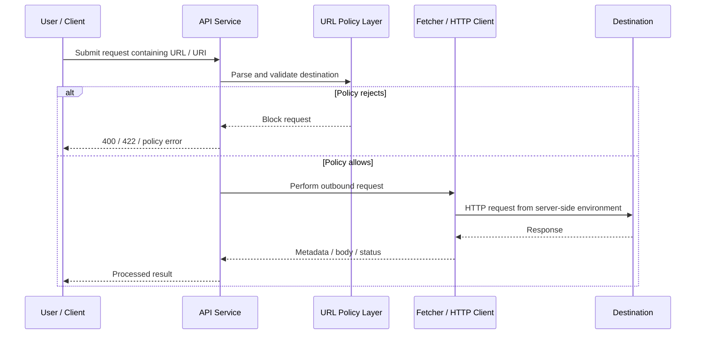
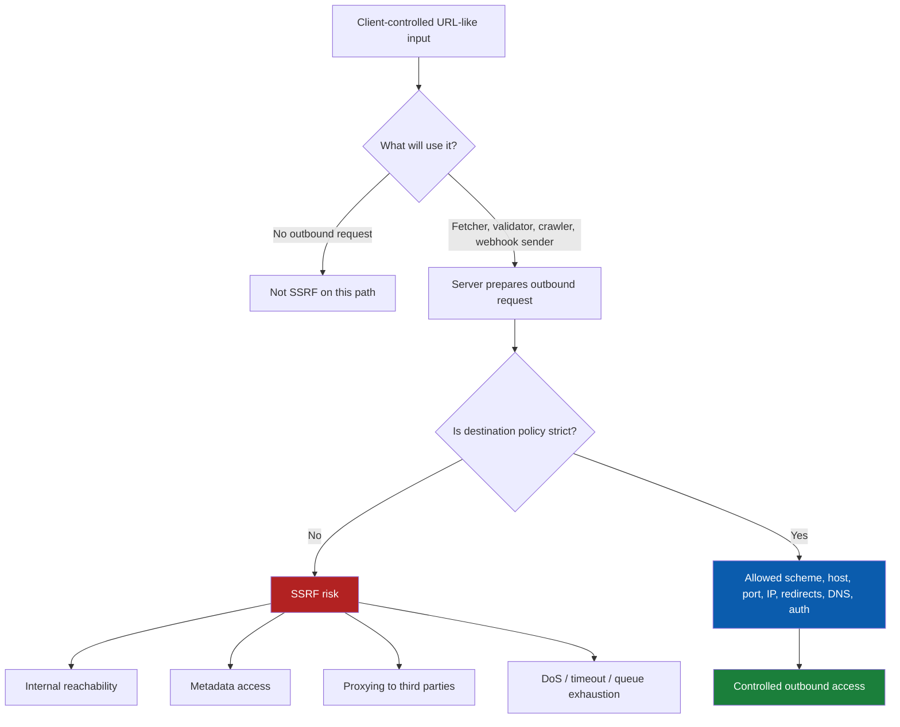
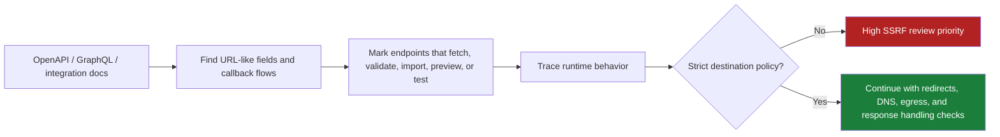

# Server-Side Request Forgery

> **Server-Side Request Forgery (SSRF) happens when an API fetches a remote resource, follows a callback, or validates a user-supplied URI without tightly controlling where that outbound request can go. In modern API environments, SSRF is especially dangerous because the vulnerable service may reach internal admin panels, cloud metadata services, service mesh components, and partner systems that are invisible from the public internet.**

---

## 🧠 What Is It? (Beginner Explanation)

Normally, a user sends a request **to** an API.

With SSRF, the user tricks the API into sending a request **for them**.

That sounds small, but it changes everything.

Instead of asking:

- “What can the attacker reach from their laptop?”

…you now have to ask:

- “What can the **server** reach from inside the environment?”

### Simple analogy

Imagine a building receptionist who is allowed to call internal extensions, maintenance rooms, and executive offices.

Visitors in the lobby cannot call those places directly.

But if the receptionist accepts any phone number written on a sticky note and dials it without checking, the visitor can abuse the receptionist’s trust.

That is the core SSRF idea:

> **The server becomes an unintended proxy.**

### Why APIs create SSRF opportunities so often

Modern APIs frequently accept network destinations as normal business input.

Examples:

- webhook callback URLs
- avatar or image import URLs
- document fetch / URL preview features
- OpenID / SSO discovery URLs
- partner connector base URLs
- webhook “send test request” features
- PDF, screenshot, or crawler services
- internal “proxy” or health-check endpoints

| API feature | Why it exists | Why SSRF risk appears |
|---|---|---|
| **Webhook registration** | Deliver events to customer systems | User supplies callback URL |
| **Import by URL** | Pull remote files or media | API fetches user-chosen location |
| **Link preview / unfurl** | Show title, image, metadata | Backend crawler visits supplied URI |
| **Connector setup** | Integrate with third-party platforms | Admin enters hostnames, base URLs, or discovery documents |
| **Remote validation / test connection** | Verify configuration during setup | “Test” request may reach unexpected internal destinations |

### The beginner mental model

If the API accepts any field that looks like:

- `url`
- `uri`
- `endpoint`
- `callback`
- `webhook`
- `baseUrl`
- `issuer`
- `jwksUri`
- `imageUrl`
- `documentUrl`

…then you should at least ask whether the server will make an outbound request because of it.

---

## 🎯 Why It Matters in API Security

OWASP API Security Top 10 2023 lists **Server Side Request Forgery** as **API7:2023**. That is a strong signal that this is not a niche edge case; it is a recurring API design and implementation problem.

SSRF also overlaps heavily with:

- **Unsafe Consumption of APIs**
- **Security Misconfiguration**
- **Broken access assumptions around internal services**
- **Cloud and container hardening failures**

### Why impact can be disproportionate

The SSRF bug might exist in a small feature, but the vulnerable server may have access to:

- private RFC1918 address space
- loopback interfaces such as `localhost`
- internal admin APIs
- cloud instance metadata services
- Kubernetes components
- service mesh or sidecar admin ports
- trusted partner networks reachable over VPN or private peering

| Impact area | What can happen | Why defenders care |
|---|---|---|
| **Confidentiality** | Internal data or metadata may be exposed | Secrets, tokens, or architecture details may leak |
| **Integrity** | Internal state-changing APIs may be invoked | SSRF can become unauthorized actions, not just reads |
| **Access control** | Network-based trust may be bypassed | Internal-only systems often trust local or private traffic |
| **Availability** | Expensive fetches or hanging requests may tie up workers | SSRF can also become a DoS amplifier |
| **Detection difficulty** | Blind SSRF may leave little user-facing evidence | Strong logging and network telemetry become essential |

### Authorized testing note

Keep SSRF work strictly inside the engagement’s scope and rules.

- Use **dedicated test accounts**.
- Prefer **controlled destinations** you own or the client explicitly approves.
- Stop at **proof of unintended outbound reachability**.
- Do **not** enumerate internal networks or attempt to retrieve sensitive metadata unless that exact action is explicitly authorized and coordinated.

---

## 🏗️ How It Works (Technical Deep Dive)

At a technical level, SSRF appears when user-controlled input crosses a trust boundary and influences an outbound request that the server performs.

A common API example looks harmless:

```http
POST /api/v1/webhooks HTTP/1.1
Host: api.example.test
Content-Type: application/json
Authorization: Bearer eyJ...

{
  "name": "billing-events",
  "target_url": "https://hooks.customer.example/events",
  "send_test": true
}
```

If the server accepts that `target_url`, performs a fetch, and does not tightly enforce destination policy, it may be vulnerable.

### Core outbound flow



The vulnerability is rarely in “HTTP” itself.

The vulnerability is usually in one or more of these failures:

- destination policy is missing or weak
- URL parsing and canonicalization are inconsistent
- redirects are followed too freely
- DNS resolution is trusted without re-checking the resulting IP
- the server can reach internal-only assets
- the API reflects the fetched response directly back to the user

### Common SSRF terms

| Term | Meaning |
|---|---|
| **Basic SSRF** | The server fetches an unintended resource and the response is visible to the tester |
| **Blind SSRF** | The server makes the request, but the response is not returned directly |
| **Second-order SSRF** | A user stores a URL now, and the dangerous fetch happens later in another workflow |
| **Redirect-assisted SSRF** | A safe-looking URL is accepted first, then the fetcher follows a redirect to somewhere unsafe |
| **Parser confusion** | Validation logic and request logic disagree about what host or scheme a URL means |
| **Cross-protocol SSRF** | The vulnerable component reaches non-HTTP services or special schemes through backend libraries |
| **Metadata service abuse** | SSRF reaches cloud instance metadata endpoints that expose environment details or credentials |

### Direct vs blind vs second-order SSRF

| Type | User-visible feedback | Typical API example | Defensive implication |
|---|---|---|---|
| **Direct SSRF** | High | URL preview returns fetched body | Easier to detect, often higher immediate impact |
| **Blind SSRF** | Low | Background webhook validation or crawler job | Requires logging, egress telemetry, or controlled callback observation |
| **Second-order SSRF** | Delayed | Stored webhook URL triggered later by a real event | Review persistence, queues, retries, and async workers |

---

## 📊 Mental Model Diagram



A useful way to think about SSRF is this:

> **Inbound validation is not enough if outbound trust is weak.**

---

## 🧭 SSRF Variants Defenders Should Recognize

SSRF is not just “user gives API a full URL.” In practice, the risky input might be partial, indirect, or hidden behind multiple parsers.

| Variant | Description | Common API surface |
|---|---|---|
| **Full-URL SSRF** | User provides complete scheme, host, and path | `callback_url`, `avatar_url`, `import_url` |
| **Host-only SSRF** | User controls a host or subdomain that the server inserts into a template | `tenantHost`, `regionEndpoint`, `baseUrl` |
| **Path-only SSRF** | Server fixes host but user controls path or query that still reaches sensitive internal functions | reverse proxies, file fetchers, internal API pass-through |
| **Stored SSRF** | URL saved in DB and fetched later by jobs or integrations | webhooks, connectors, alert destinations |
| **Schema/parser SSRF** | Different libraries disagree on host, scheme, or normalization | custom validators, mixed URL parsers, framework helpers |
| **Redirect SSRF** | Initial URL looks allowed, final target is not | previewers, validators, test-connection flows |
| **Protocol expansion** | Libraries or runtime support more than plain HTTP/S | file retrieval, legacy fetch helpers, image libraries |

### Important defensive nuance

Do **not** reduce SSRF review to “block `localhost`.”

Real SSRF defenses must account for:

- loopback ranges
- private IP ranges
- link-local ranges
- cloud metadata endpoints
- DNS re-resolution issues
- redirect handling
- URL parser disagreements
- non-HTTP schemes if the client library supports them

---

## 🧾 Using the API Spec to Find SSRF Risk

A good API specification is one of the best starting points for SSRF review.

OpenAPI, GraphQL schema docs, protobuf contracts, and integration docs often reveal where the server may perform outbound requests.

### What to look for in the spec

| Spec clue | Why it matters |
|---|---|
| `format: uri` or `format: uri-reference` | Signals a URL-like field, but only confirms syntax, not trustworthiness |
| Fields named `url`, `uri`, `callback`, `webhook`, `endpoint`, `issuer`, `baseUrl`, `discoveryUrl` | High-probability outbound sinks |
| Operations like `/preview`, `/import`, `/fetch`, `/validate`, `/connect`, `/test`, `/crawl` | These often trigger outbound requests immediately |
| Callback or webhook definitions | Reveal registration and delivery flows that need URL policy |
| Response bodies returning fetched content or status | Suggest direct SSRF or diagnostic leak paths |
| “Upload by URL” and “send test request” features | Classic SSRF introduction points |

### Important OpenAPI lesson

In OpenAPI, a field such as:

```yaml
properties:
  callback_url:
    type: string
    format: uri
```

…only says the value should look like a URI.

It does **not** mean:

- HTTPS is required
- redirects are safe
- only approved hosts are allowed
- private or link-local IP space is blocked
- DNS rebinding is handled
- the destination belongs to the registering tenant

> **`format: uri` is a syntax hint, not a security control.**

### Example: risky contract shape

```yaml
paths:
  /v1/integrations/webhooks:
    post:
      summary: Register a webhook destination
      requestBody:
        required: true
        content:
          application/json:
            schema:
              type: object
              required: [target_url]
              properties:
                target_url:
                  type: string
                  format: uri
                send_test:
                  type: boolean
```

This spec is useful for testers because it immediately raises the right questions:

- Is `target_url` restricted by policy?
- Does `send_test` trigger a real outbound call?
- Are redirects followed?
- Does the API return the fetched body or only a status object?
- Is tenant ownership of the destination verified?

### Safer contract shape

When business requirements allow it, safer designs avoid arbitrary URLs entirely:

```yaml
paths:
  /v1/integrations/webhooks:
    post:
      summary: Register a webhook destination
      requestBody:
        required: true
        content:
          application/json:
            schema:
              type: object
              required: [destination_id]
              properties:
                destination_id:
                  type: string
                  description: Server-side identifier for an approved endpoint
                send_test:
                  type: boolean
                  default: false
```

That pattern moves trust from **user-supplied network locations** to **server-side approved destinations**.

### Callback and webhook objects matter too

The OpenAPI specification formally documents **callbacks** and **webhooks**. That is helpful for documentation and tooling, but it also gives defenders a map of places where URL registration, delivery, or outbound fetch behavior may exist.

If the spec documents callbacks or webhooks, review:

- who controls the destination
- whether callbacks are per-tenant
- whether test delivery exists
- what auth the sender uses
- whether delivery happens synchronously or through a queue

### Spec-first review workflow



---

## 🔗 Common API Features That Commonly Produce SSRF

| Feature | Why teams add it | Typical mistake | Safer pattern |
|---|---|---|---|
| **Webhook registration** | Customer wants event delivery | Any URL accepted; “test delivery” hits internal destinations | Ownership checks, allowlists where possible, async delivery, no raw response reflection |
| **Avatar/media import by URL** | Easier onboarding | Backend downloader can reach internal network | Fetch through isolated media service with strict egress policy |
| **Link preview / crawler** | Better UX | HTML parser and fetcher follow arbitrary destinations | Sandbox crawler, restrict schemes, deny internal ranges |
| **Third-party connector setup** | SaaS integrations | Admin enters arbitrary hostnames or discovery URLs | Server-side templates for known providers or approved domains |
| **PDF/screenshot/render service** | Reporting and previews | Headless browser has broad network reach | Isolated rendering worker, no private network access |
| **Remote schema / config validation** | Convenience during setup | Server fetches untrusted configuration endpoints | Manual upload, signed configs, approved source list |
| **Internal proxy/debug endpoints** | Operational shortcut | “Fetch this path for diagnostics” becomes generic proxying | Remove in production or gate tightly with admin-only, fixed targets |

### API endpoints that deserve immediate attention

During review, prioritize operations with names like:

- `/webhooks`
- `/integrations`
- `/connectors`
- `/preview`
- `/crawl`
- `/import`
- `/fetch`
- `/validate`
- `/test-connection`
- `/send-test`

These names do **not** prove SSRF, but they are high-value inspection targets.

---

## ☁️ Why Cloud and Platform Environments Raise the Stakes

Modern environments place operational interfaces behind predictable local addresses or internal network paths.

That means a single SSRF bug can sometimes reach resources that were never meant to be internet-accessible.

### High-sensitivity destination classes

| Destination class | Why it is reachable from servers | Why it is sensitive |
|---|---|---|
| **Loopback / localhost** | Service can talk to itself | Local admin panels, debug ports, secondary listeners |
| **Private IP space** | App sits inside VPC/VNet/cluster | Internal APIs often rely on network location for trust |
| **Link-local addresses** | Host and container runtimes can often reach them | Metadata and local control interfaces live here |
| **Kubernetes control-related services** | Pods or nodes may have cluster reachability | Kubelet, API server paths, internal service discovery |
| **Service mesh / admin ports** | Sidecars and control agents expose local interfaces | Diagnostics and control paths often were not designed for hostile input |
| **Datastores and internal queues** | Application tiers often share network zones | Some internal services lack authentication or expect trusted callers |

### Cloud metadata services are a special case

Public cloud platforms intentionally expose metadata endpoints to workloads so applications can learn about their environment. That is useful operationally, but it makes SSRF more dangerous.

| Provider | Documented metadata location | Defensive detail that matters |
|---|---|---|
| **AWS EC2** | `169.254.169.254` | IMDSv2 uses a session token model and can be required instead of IMDSv1 |
| **Azure VM IMDS** | `169.254.169.254` | Requests must include `Metadata: true` and must not include `X-Forwarded-For` |
| **Google Compute Engine** | `metadata.google.internal` or `169.254.169.254/computeMetadata/v1` | Requests must include `Metadata-Flavor: Google` |

These provider-specific headers and token requirements improve resilience, but they do **not** replace application-layer SSRF controls.

### Kubernetes guidance matters here too

Kubernetes security guidance explicitly recommends restricting workload access to the cloud metadata API when it is not needed.

That tells defenders something important:

> **Even platform vendors assume metadata access is sensitive enough to require network controls.**

---

## 🔍 Practical Authorized Testing Workflow

The goal of professional SSRF testing is to validate **whether the API can be coerced into making unintended outbound requests**.

The goal is **not** to turn the target into a scanner, enumerate internal services, or retrieve secrets.

### 1) Confirm scope and safe destinations first

Before testing, clarify:

- are webhook and callback features in scope?
- are outbound integrations in scope?
- may you use a controlled callback collector?
- are internal destinations or metadata endpoints explicitly off-limits?
- who should be notified if you accidentally observe sensitive egress?

### 2) Use the API spec to identify likely sinks

Review the contract for:

- URL-like request fields
- callback or webhook registration
- “test connection” operations
- import/preview/fetch endpoints
- responses that return remote data

Make a short table for yourself:

| Endpoint | User-controlled field | Expected outbound action |
|---|---|---|
| `/v1/webhooks` | `target_url` | Sends test callback |
| `/v1/import` | `source_url` | Downloads remote file |
| `/v1/preview` | `url` | Fetches metadata / title / image |

### 3) Start with a controlled, benign destination

Use a destination you own or the client approved, such as an assessment callback collector.

Example of a safe validation request:

```bash
curl -sS -X POST https://api.example.test/v1/webhooks \
  -H 'Authorization: Bearer TEST_TOKEN' \
  -H 'Content-Type: application/json' \
  -d '{
    "name": "ssrf-check",
    "target_url": "https://collector.assessment.example/webhook",
    "send_test": true
  }'
```

You are looking for controlled evidence such as:

- the API accepts the URL
- the server sends a request to your collector
- request metadata shows where the call originated
- the application logs or response confirm a fetch occurred

### 4) Observe how destination policy behaves

Without using harmful destinations, you can still learn a lot.

Check whether the application:

- requires `https`
- restricts ports
- rejects IP literals
- rejects private, loopback, or link-local targets
- follows redirects
- allows user-controlled hostnames during setup
- performs fetches synchronously or in the background

### 5) Distinguish direct from blind SSRF safely

| Behavior | What it suggests | Safe validation method |
|---|---|---|
| API returns fetched body or headers | Direct SSRF | Use harmless content you control |
| API only says “test sent” | Blind SSRF likely | Confirm via your own callback logs or authorized network telemetry |
| URL saved and fetched later | Second-order SSRF | Trigger normal product workflow with your own endpoint |

### 6) Check response handling

Even when outbound access is expected, insecure response handling can worsen impact.

Look for cases where the API:

- returns raw remote response bodies to the user
- exposes remote headers verbatim
- logs fetched secrets or signed URLs
- stores remote content without sanitization
- makes security decisions based on remote data without validation

### 7) Review redirect and DNS behavior

OWASP’s SSRF guidance explicitly recommends disabling automatic redirect following for security-sensitive fetch flows.

That matters because a seemingly safe first destination can become unsafe if the client follows `3xx` responses automatically.

You do **not** need to chain this into abuse to document the issue. It is usually enough to establish one or more of these facts:

- redirects are followed automatically
- host validation occurs before the redirect, not after the final destination
- DNS resolution is trusted without verifying the resolved IP class

### 8) Check containment controls

If outbound fetching is business-required, inspect whether blast radius is reduced through:

- egress firewalls or security groups
- dedicated outbound proxy
- network policy in Kubernetes
- metadata endpoint blocking where possible
- separate low-privilege fetcher service
- short timeouts and response size limits

### 9) Stop at proof, then document clearly

A professional SSRF finding usually needs:

- the endpoint and feature involved
- the user-controlled field
- proof that the server performed an unintended or under-constrained request
- whether the issue is direct, blind, or stored
- reachable destination classes
- whether raw response data is exposed
- what egress and metadata protections exist or are missing

That is enough for a strong, actionable report.

---

## 🚩 Common Weakness Patterns

| Weakness pattern | What it looks like | Why it matters |
|---|---|---|
| **Arbitrary URL acceptance** | Any host is allowed | Broad outbound reachability from trusted infrastructure |
| **Syntax-only validation** | `format: uri` or regex-only checks | URL can still point to dangerous destinations |
| **No IP class filtering** | Private/link-local/loopback not blocked | Internal network and metadata exposure risk |
| **Automatic redirect following** | Fetcher follows `301/302/307/308` silently | Policy may validate one destination and request another |
| **DNS trust without re-checking** | Host validated once, IP changes or is not verified | Can undermine hostname-only policy |
| **Raw response reflection** | API returns fetched content verbatim | Turns blind SSRF into direct disclosure |
| **Over-privileged fetcher identity** | Outbound service has wide network or cloud rights | Expands impact from minor bug to critical issue |
| **Shared worker environment** | Fetch job runs in same network zone as core services | Lateral reachability increases |
| **No timeout / size limits** | Hanging or large fetches consume workers | Availability impact and queue exhaustion |
| **Stored URL fetched later** | Webhook or connector saved and reused | Risk persists beyond initial request |

### High-signal evidence during review

The following are especially valuable to document:

- outbound request logs to your controlled endpoint
- raw request/response captures showing acceptance of untrusted URL fields
- code paths showing `follow_redirects=True` or equivalent defaults
- absence of IP-range checks after DNS resolution
- ability to trigger test requests during registration
- API behavior that reflects remote body content directly back to the caller

---

## 🛡️ Hardening Guidance

OWASP’s SSRF prevention guidance separates defenses into two broad situations:

1. the application should only talk to **identified trusted destinations**
2. the application must sometimes talk to **arbitrary external destinations**

Those cases need different designs.

### Case 1: Only trusted destinations should ever be contacted

This is the easier and stronger security model.

| Control | Why it helps |
|---|---|
| **Allowlist exact hosts or service identifiers** | Best way to avoid arbitrary outbound requests |
| **Prefer server-side IDs over raw URLs** | Removes user control over network location |
| **Resolve and verify destination IPs** | Prevents hostnames from mapping to unsafe address classes |
| **Disable redirect following** | Prevents policy bypass through `Location` headers |
| **Restrict schemes and ports** | Avoids dangerous or unnecessary protocol surface |
| **Run fetchers in isolated network segments** | Limits what the service can reach even if validation fails |

### Case 2: External destinations are part of the business model

Some products genuinely need customer-defined URLs.

In that case, you cannot rely on a tiny allowlist, so you need stronger compensating controls.

| Control | Why it matters when arbitrary destinations are allowed |
|---|---|
| **Use a well-tested URL parser** | Reduces parser mismatch and normalization bugs |
| **Normalize then validate** | Compare canonical host, scheme, and port, not raw input text |
| **Reject loopback, private, and link-local IP ranges** | Prevents obvious internal pivots |
| **Re-check after DNS resolution** | Hostnames must not resolve to blocked ranges |
| **Disable automatic redirects** | Final destination matters, not just the first one |
| **Use tight timeouts and body size caps** | Limits DoS and large-response exposure |
| **Fetch from a dedicated egress-controlled service** | Containment is critical when policy is broader |
| **Do not return raw remote bodies** | Avoids turning outbound fetch into a data exfil channel |
| **Log security-relevant fetch decisions** | Needed for detection, forensics, and rate controls |

### Defensive controls that matter across both cases

| Control | Practical guidance |
|---|---|
| **Metadata hardening** | Require AWS IMDSv2 where possible; restrict or firewall metadata access for workloads that do not need it |
| **Kubernetes egress policy** | Default-deny egress where feasible; explicitly block metadata paths when not needed |
| **Separate identities** | The fetcher should not run with broad cloud or service credentials |
| **Async processing** | Queue outbound fetches rather than tying up user-facing API workers |
| **Content validation** | Restrict expected media types, lengths, and parser behavior |
| **Tenant binding** | Ensure one tenant cannot register destinations that affect another tenant |

### Do not trust redirects as a safety mechanism

Redirects are a normal HTTP feature, not a security feature.

If your policy says only certain destinations are allowed, then **the final destination must also be allowed**.

For many security-sensitive API fetch flows, the safest choice is simple:

> **Do not follow redirects automatically.**

---

## 🔐 Example of a Safer URL Fetcher

The exact implementation will vary by language and framework, but the security order should look something like this:

```python
from urllib.parse import urlparse
import ipaddress
import socket
import httpx

ALLOWED_SCHEMES = {"https"}
BLOCKED_NETS = [
    ipaddress.ip_network("127.0.0.0/8"),
    ipaddress.ip_network("10.0.0.0/8"),
    ipaddress.ip_network("172.16.0.0/12"),
    ipaddress.ip_network("192.168.0.0/16"),
    ipaddress.ip_network("169.254.0.0/16"),
    ipaddress.ip_network("::1/128"),
    ipaddress.ip_network("fc00::/7"),
    ipaddress.ip_network("fe80::/10"),
]


def is_blocked_ip(ip_text: str) -> bool:
    ip_obj = ipaddress.ip_address(ip_text)
    return any(ip_obj in net for net in BLOCKED_NETS)


def fetch_user_url(url: str) -> bytes:
    parsed = urlparse(url)

    if parsed.scheme not in ALLOWED_SCHEMES:
        raise ValueError("unsupported scheme")

    if not parsed.hostname:
        raise ValueError("missing hostname")

    resolved_ips = {
        info[4][0]
        for info in socket.getaddrinfo(parsed.hostname, parsed.port or 443, type=socket.SOCK_STREAM)
    }

    if any(is_blocked_ip(ip) for ip in resolved_ips):
        raise ValueError("destination resolves to blocked address space")

    with httpx.Client(follow_redirects=False, timeout=3.0, verify=True) as client:
        response = client.get(url, headers={"User-Agent": "safe-fetcher/1.0"})
        response.raise_for_status()

        content_type = response.headers.get("content-type", "")
        if "application/json" not in content_type and "text/plain" not in content_type:
            raise ValueError("unexpected content type")

        if len(response.content) > 1_000_000:
            raise ValueError("response too large")

        return response.content
```

This is still only part of the answer.

In real systems, you usually also want:

- an outbound proxy or egress gateway
- destination allowlists where possible
- additional checks at connect time
- queue isolation
- audit logging
- per-tenant rate limits
- cloud metadata blocking when unnecessary

---

## 🧪 High-Signal Findings in Real API Reviews

A strong SSRF finding often sounds like one of these:

| Finding theme | Why it is meaningful |
|---|---|
| **Arbitrary customer-supplied webhook URLs accepted and test-fetched** | Directly demonstrates under-constrained outbound reachability |
| **Preview/import endpoint fetches arbitrary URLs and reflects response body** | Shows both SSRF and immediate disclosure risk |
| **Fetcher follows redirects even though host validation is only applied to the initial URL** | Clean root cause with high exploitability potential |
| **Connector setup accepts discovery/base URLs that resolve into private address space** | High-value because it often affects admin workflows and async workers |
| **Fetcher runs from privileged network zone with access to metadata services** | Raises severity even if the API response is blind |
| **No egress policy or metadata blocking in Kubernetes/cloud workloads** | Demonstrates missing containment, not just input validation failure |

### Good remediation advice is layered

Avoid vague recommendations like “sanitize the URL.”

Prefer concrete guidance such as:

- replace raw URLs with server-side destination IDs
- restrict scheme, host, port, and resolved IP space
- disable redirects
- isolate fetchers on a dedicated network segment
- require cloud metadata protections and local firewall rules
- stop reflecting remote response bodies to untrusted callers

---

## ✅ Quick Assessment Checklist

```text
[ ] Scope for webhook, callback, connector, and import flows confirmed
[ ] API spec reviewed for URL-like fields and callback objects
[ ] Direct, blind, and stored SSRF paths considered
[ ] Controlled outbound destination prepared for safe validation
[ ] HTTPS-only policy checked
[ ] Host, scheme, and port restrictions checked
[ ] Private, loopback, and link-local IP blocking checked
[ ] Redirect behavior checked
[ ] DNS resolution and IP re-validation checked
[ ] Response reflection behavior checked
[ ] Async workers / queues reviewed for second-order SSRF
[ ] Cloud metadata reachability and hardening reviewed
[ ] Kubernetes / egress policy reviewed where relevant
[ ] Fetcher identity and network placement reviewed
[ ] Findings documented with proof of outbound request, not harmful escalation
```

---

## 📚 References

- OWASP API Security Top 10 2023 — *API7:2023 Server Side Request Forgery*  
  https://owasp.org/API-Security/editions/2023/en/0xa7-server-side-request-forgery/
- OWASP Cheat Sheet Series — *Server-Side Request Forgery Prevention Cheat Sheet*  
  https://cheatsheetseries.owasp.org/cheatsheets/Server_Side_Request_Forgery_Prevention_Cheat_Sheet.html
- CWE-918 — *Server-Side Request Forgery (SSRF)*  
  https://cwe.mitre.org/data/definitions/918.html
- PortSwigger Web Security Academy — *Server-side request forgery (SSRF)*  
  https://portswigger.net/web-security/ssrf
- OpenAPI Specification 3.1.1 — *Callbacks / Webhooks / API description structure*  
  https://swagger.io/specification/
- AWS EC2 User Guide — *Use the Instance Metadata Service to access instance metadata*  
  https://docs.aws.amazon.com/AWSEC2/latest/UserGuide/configuring-instance-metadata-service.html
- Microsoft Learn — *Azure Instance Metadata Service*  
  https://learn.microsoft.com/en-us/azure/virtual-machines/instance-metadata-service
- Google Cloud — *About VM metadata*  
  https://cloud.google.com/compute/docs/metadata/overview
- Google Cloud — *Query VM metadata*  
  https://cloud.google.com/compute/docs/metadata/querying-metadata
- Kubernetes Documentation — *Security checklist*  
  https://kubernetes.io/docs/concepts/security/security-checklist/
- MDN Web Docs — *HTTP redirections*  
  https://developer.mozilla.org/en-US/docs/Web/HTTP/Redirections
