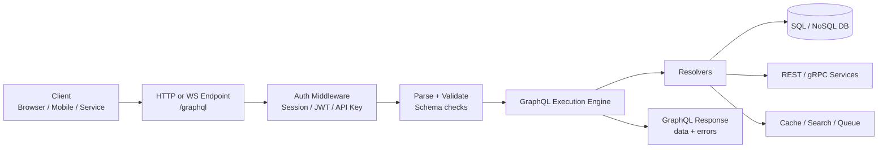
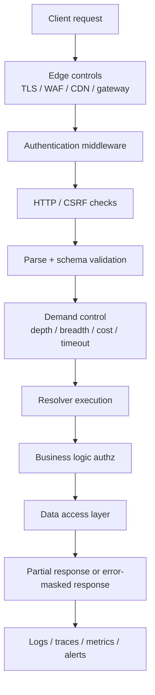
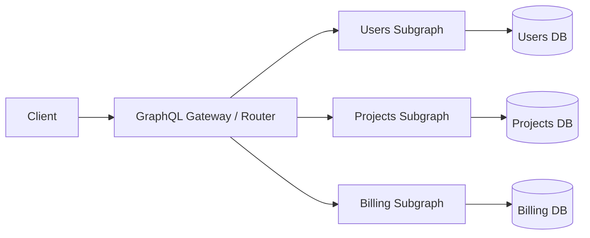

# GraphQL Architecture

> **Module:** API Pentesting → GraphQL Security  
> **Difficulty:** Beginner → Advanced  
> **Focus:** Understand how GraphQL schemas, resolvers, gateways, and subgraphs are assembled so you can assess them safely during **authorized** security work.

---

## 1. Overview

GraphQL architecture is the combination of:

- a **schema** that describes what clients are allowed to ask for,
- an **execution engine** that parses and validates operations,
- **resolvers** that actually fetch or change data,
- **context and middleware** that carry identity and policy,
- and one or more **data sources** behind the graph.

A beginner-friendly way to picture it is this:

> **REST usually spreads capability across many URLs. GraphQL concentrates capability behind one graph.**

That single endpoint often makes a system look simpler than it really is. Under the surface, a GraphQL request may pass through authentication middleware, cost analysis, business-logic authorization, caches, REST backends, databases, queues, search engines, and sometimes a federated gateway routing into multiple subgraphs.

If you remember one sentence from this note, remember this:

> **GraphQL centralizes transport, but it decentralizes trust decisions into schema design and resolver logic.**

### High-level architecture



---

## 2. Why Architecture Matters for Security

A GraphQL endpoint is not just a parser. It is an **orchestrator** for business logic.

That matters because the most important security failures usually come from **how architectural responsibilities are split**, not from the query language itself.

### What changes compared to REST?

| Question | REST mental model | GraphQL mental model | Security consequence |
| --- | --- | --- | --- |
| Where are capabilities exposed? | Many URLs and methods | One endpoint, many schema fields | Discovery shifts from path inventory to schema and resolver inventory |
| Where is authorization enforced? | Often per-route or per-controller | Often per-field or per-resolver | Inconsistent resolver checks become high risk |
| How much data can a client request? | Usually response shape is fixed | Client chooses fields and nesting | Depth, breadth, pagination, and cost controls matter much more |
| How is documentation exposed? | OpenAPI/Swagger, docs pages, route discovery | Introspection, schema descriptions, IDEs | Schema discoverability becomes a first-class concern |
| How does scaling work? | Endpoint/service based | Query-shape and resolver-cost based | Rate limiting by request count alone is often insufficient |

### The core defensive insight

Security teams often say “GraphQL is one endpoint.”

Architecturally, that is true only at the network edge.

Inside the application, GraphQL is really:

- many **entry points** (`Query`, `Mutation`, `Subscription` fields),
- many **execution paths** (resolver trees),
- many **policy decisions** (who may read or change each field),
- and many **back-end trust boundaries**.

So the real question is not “Is `/graphql` protected?”

The real question is:

> **Is every resolver path protected, bounded, and observable?**

---

## 3. Core Building Blocks

### 3.1 Architectural components

| Component | What it does | Security significance |
| --- | --- | --- |
| **Schema** | Defines types, fields, arguments, and operations | Exposes capabilities; weak schema design often leaks internal structure |
| **Query** | Read-oriented root operation | Can still be abused for excessive data access or expensive execution |
| **Mutation** | Write-oriented root operation | High-value area for authz, validation, idempotency, and audit logging |
| **Subscription** | Long-lived real-time updates | Requires connection auth, event filtering, and connection lifecycle controls |
| **Resolver** | Function that fulfills each field | Most field-level authorization bugs live here |
| **Context** | Carries user/session/tenant/request metadata | If context is incomplete or mutable, policy enforcement can fail |
| **Middleware / plugins** | Handle authn, logging, CSRF, tracing, limits | Good for coarse controls; not a replacement for resolver authz |
| **Data source** | Database, REST, gRPC, cache, queue | Injection, SSRF, and over-privileged backend access often appear here |
| **Gateway / router** | Front door for a graph or supergraph | Central point for authn, routing, limits, and telemetry |
| **Persisted or trusted documents** | Allowlisted approved operations | Strong demand-control option for first-party clients |

### 3.2 Root operation types

GraphQL organizes capabilities around root types rather than URL paths.

| Root type | Main purpose | What defenders should think about |
| --- | --- | --- |
| `Query` | Read data | Data minimization, pagination, tenant scoping, sensitive nested fields |
| `Mutation` | Change state | Authz, validation, replay resistance, auditability, side effects |
| `Subscription` | Receive updates over time | Event filtering, auth refresh, stale permissions, resource cleanup |

### 3.3 Simple schema example

```graphql
type Query {
  me: User
  project(id: ID!): Project
  projects(first: Int!, after: String): ProjectConnection!
}

type Mutation {
  updateProfile(input: UpdateProfileInput!): User!
  createApiToken(input: CreateApiTokenInput!): ApiToken!
}

type Subscription {
  projectUpdated(projectId: ID!): Project!
}

type User {
  id: ID!
  email: String!
  role: String!
  projects(first: Int!, after: String): ProjectConnection!
}
```

This looks neat and compact. But every field above still needs architectural decisions around:

- who can call it,
- how much data it may return,
- what backend it reaches,
- how errors are masked,
- and how activity is logged.

---

## 4. Request Lifecycle: From HTTP to Resolver Tree

The official GraphQL-over-HTTP guidance treats HTTP as the common transport for queries and mutations, usually through a single endpoint such as `/graphql`.

### 4.1 Common request shape

```http
POST /graphql HTTP/1.1
Host: api.example.test
Content-Type: application/json
Accept: application/graphql-response+json, application/json
Authorization: Bearer <token>

{
  "query": "query Viewer { me { id email } }",
  "variables": {},
  "operationName": "Viewer"
}
```

For safe architecture review, the important fields are:

| Field | Purpose | Security note |
| --- | --- | --- |
| `query` | GraphQL document text | Input validation starts here, but business risk does not end here |
| `variables` | Parameter values | Strong typing helps, but backend validation is still required |
| `operationName` | Selects a named operation | Valuable for logging, allowlisting, and telemetry |

### 4.2 Request execution pipeline



### 4.3 What the lifecycle means in practice

#### Authentication happens before GraphQL execution

Per GraphQL Foundation guidance, GraphQL should sit **after authentication middleware** so the request context already contains user or session identity.

Examples:

- JWT validation at the gateway,
- session cookie validation in web middleware,
- API key verification for partner clients.

#### Authorization usually happens during execution

This is a crucial architectural detail.

A request may be authenticated at the edge, but GraphQL authorization usually has to be enforced **inside business logic during resolver execution**, because access often depends on:

- the current user,
- the object being resolved,
- the tenant boundary,
- field sensitivity,
- and parent-child relationships in the resolver tree.

That is why “the gateway checked auth” is never enough on its own.

#### Partial responses are normal

A GraphQL response can contain both:

- `data`
- and `errors`

That is useful for clients, but it also means defenders must think carefully about:

- error detail leakage,
- inconsistent authz behavior,
- and whether partial data should be returned at all for sensitive operations.

---

## 5. The Single-Endpoint Illusion

One of the easiest mistakes is treating GraphQL as a single application function because it often lives at one URL.

In reality, one endpoint can hide many distinct trust boundaries.

### The boundaries hidden behind `/graphql`

| Boundary | Example | Why it matters |
| --- | --- | --- |
| **Operation boundary** | `Query.me` vs `Mutation.createApiToken` | Read and write paths have very different risk profiles |
| **Field boundary** | `User.email` vs `User.role` vs `User.billingInfo` | Sensitive fields often need separate access rules |
| **Object boundary** | One project vs another tenant’s project | BOLA/IDOR-style issues still exist in GraphQL |
| **Resolver boundary** | One field uses cache, another uses SQL, another calls REST | Different backend assumptions and failure modes |
| **Transport boundary** | HTTP for queries, WebSocket/SSE for subscriptions | Same graph, different protocol-level protections |
| **Topology boundary** | Monolith graph vs federated subgraphs | Direct subgraph access may bypass central controls |

A practical memory aid is:

> **One endpoint does not mean one policy.**

---

## 6. Common Architectural Patterns

### 6.1 Pattern comparison

| Pattern | Description | Strengths | Common defensive concerns |
| --- | --- | --- | --- |
| **Monolithic GraphQL server** | One server owns schema, resolvers, and data access | Simple mental model, fewer moving parts | Resolver auth drift, unbounded fields, direct DB overexposure |
| **Backend-for-frontend (BFF)** | GraphQL tailored to one client app, often wrapping REST services | Good client ergonomics, demand-oriented schema | Can inherit upstream auth flaws and data overexposure |
| **GraphQL facade over existing services** | GraphQL sits in front of REST/gRPC/SOAP | Consolidates client access | Easy to create “thin auth” at gateway with weak downstream enforcement |
| **Federated supergraph** | Gateway composes multiple subgraphs owned by different teams | Scales org structure and domains | Policy inconsistency, subgraph exposure, trust propagation errors |
| **Serverless / edge graph** | Short-lived resolvers or edge routing | Elastic scaling, regional performance | Cold starts, fragmented logging, inconsistent secret handling |

### 6.2 Risk tends to follow ownership boundaries

As the graph becomes more distributed, the hardest problems usually shift from parser security to **organizational consistency**:

- Who owns authz rules?
- Who approves schema changes?
- Who sets cost limits?
- Who can expose a new field?
- Who monitors subgraphs directly?

That is why architecture review is also a governance review.

---

## 7. Where Security Controls Belong

A strong GraphQL design uses **layered controls**, not one “magic” control.

### 7.1 Control placement matrix

| Layer | Good controls here | Controls that should not live here alone |
| --- | --- | --- |
| **Edge / gateway** | TLS, authentication, coarse rate limiting, CSRF protections, request size limits, allowlists, telemetry | Fine-grained field authorization |
| **GraphQL validation/execution** | Schema validation, depth limits, breadth/alias limits, query cost analysis, introspection posture, timeouts | Business ownership decisions |
| **Resolver / business logic** | Object-level and field-level authorization, tenant checks, workflow rules, audit events | Raw transport parsing |
| **Data layer** | Parameterized queries, least privilege DB roles, row-level security, safe outbound calls | Client identity decisions without higher-layer context |
| **Observability layer** | Operation names, traces, anomaly detection, error masking, alerts | Preventing business logic abuse by itself |

### 7.2 A safe resolver mindset

A defensive resolver should assume:

1. the caller may be authenticated but still unauthorized,
2. arguments may be valid GraphQL types but still semantically unsafe,
3. the field may be called in nested or repeated ways,
4. and downstream services may respond slowly or reveal too much.

```ts
const resolvers = {
  Query: {
    project: async (_parent, { id }, context) => {
      requireUser(context.user);
      const project = await projectService.getById(id);
      requireTenantAccess(context.user, project.tenantId);
      return project;
    },
  },
  Mutation: {
    createApiToken: async (_parent, { input }, context) => {
      requireUser(context.user);
      requirePermission(context.user, 'token:create');
      validateTokenInput(input);
      return tokenService.createForUser(context.user.id, input);
    },
  },
};
```

The important idea is not the syntax. It is the placement:

- **authn context** comes in,
- **authz** happens before data is returned,
- **validation** is specific to the business operation,
- and the resolver does not trust the schema alone to keep it safe.

---

## 8. Demand Control: Keeping Flexible Queries Safe

The GraphQL Foundation describes this area as **demand control**, which is a useful term because it focuses on how much work a client may ask the server to do.

### 8.1 Why demand control is architectural

A GraphQL query is not expensive just because it is large in bytes.

It may be expensive because it causes:

- deep recursion,
- broad alias fan-out,
- large list expansion,
- expensive joins,
- many downstream service calls,
- or long-lived resolver time.

### 8.2 Defensive controls that work together

| Control | What it limits | Architectural note |
| --- | --- | --- |
| **Trusted / persisted documents** | Unknown operations | Excellent for first-party clients; much harder for public APIs |
| **Pagination** | Unbounded list size | Cursor-based pagination is safer than returning full collections |
| **Depth limiting** | Excessive nesting | Helpful, but depth alone does not measure all cost |
| **Breadth / alias limiting** | Too many fields or aliases in one operation | Important against shallow-but-wide queries |
| **Batch limiting** | Too many operations in one request | Helps close request-count blind spots |
| **Cost / complexity analysis** | Semantically expensive operations | Best when weights reflect real backend cost |
| **Rate limiting** | Repeated client demand over time | Better when tied to user/client/cost, not just IP |
| **Timeouts** | Long execution paths | Needed at gateway, server, and downstream layers |
| **Caching / batching in resolvers** | Self-inflicted backend load | Prevents N+1 amplification and redundant calls |

### 8.3 Pagination is part of security, not just performance

The official GraphQL pagination guidance strongly favors bounded traversal of list relationships, typically with cursor-based models.

That matters defensively because unbounded lists increase risk of:

- excessive data exposure,
- accidental bulk export,
- memory pressure,
- and misleading assumptions that “read operations are cheap.”

---

## 9. Introspection, Discoverability, and Error Design

### 9.1 Introspection is a feature, not automatically a flaw

Per the GraphQL specification and GraphQL Foundation docs, introspection is built into GraphQL and powers developer tooling. That makes it extremely useful in development.

Architecturally, though, production use depends on the deployment model.

| Environment | Typical posture |
| --- | --- |
| **Internal development** | Introspection often enabled for tooling and iteration |
| **First-party production graph** | Common to disable or restrict introspection and rely on trusted documents |
| **Public third-party API** | Introspection may remain available, but should be paired with strong authz, limits, and monitoring |

The key defensive point is:

> **Disabling introspection may reduce discoverability, but it does not replace authorization, demand control, or error hygiene.**

### 9.2 Error messages are architectural outputs

Detailed validation and execution errors can reveal:

- field names,
- type names,
- backend technologies,
- stack traces,
- and internal service boundaries.

A safer production pattern is:

- detailed logs internally,
- normalized client-facing errors externally,
- and strong correlation between operation name, request ID, and trace data.

---

## 10. Federation and Distributed Graphs

Federation composes multiple schemas into one logical graph. This is powerful, but it creates new trust boundaries.

### 10.1 Federated architecture at a glance



### 10.2 Main federation components

| Component | Purpose | Security relevance |
| --- | --- | --- |
| **Gateway / router** | Presents one unified endpoint and routes sub-queries | Best place for centralized authn, telemetry, and coarse limits |
| **Subgraph** | Owns one domain of schema and resolvers | Must still enforce its own authorization assumptions |
| **Composition** | Merges subgraph schemas into a supergraph | Valuable governance point for detecting unsafe schema changes |
| **Entity references** | Link data across subgraphs | Cross-domain joins can leak fields if policies differ |

### 10.3 Federation-specific defensive questions

| Question | Why it matters |
| --- | --- |
| Can clients reach subgraphs directly, or only the gateway? | Direct subgraph access can bypass central policy and observability |
| Is identity forwarded safely from gateway to subgraphs? | Weak trust propagation causes “authenticated somewhere, trusted everywhere” failures |
| Are authorization rules consistent across domains? | One permissive subgraph can undermine the whole graph |
| Are composition and schema changes reviewed? | Distributed teams can accidentally expose sensitive entity fields |
| Are internal federation-only capabilities restricted? | Subgraph metadata and service descriptors should not be casually exposed |

### 10.4 The most important federation lesson

> **A federated graph is only as strong as its weakest subgraph policy.**

A gateway can centralize authentication and routing, but it cannot safely replace domain-aware authorization inside each subgraph.

---

## 11. Subscriptions and Real-Time Architecture

GraphQL is not only request/response over HTTP. Subscriptions commonly use **WebSockets** or **server-sent events** for long-lived communication.

### Why this changes the security model

With queries and mutations, each request is a relatively short transaction.

With subscriptions, the server must manage:

- connection setup,
- connection authentication,
- message authorization,
- long-lived resource usage,
- permission changes after connection start,
- and connection teardown.

### Realtime-specific design checks

| Check | Why it matters |
| --- | --- |
| Authenticate the connection at setup | Prevent anonymous long-lived channels |
| Revalidate authorization for each event path where needed | Permissions may change while the socket remains open |
| Filter events by tenant and object scope | Broadcasting too broadly is a common architecture flaw |
| Set idle and absolute connection limits | Long-lived connections consume memory and file descriptors |
| Audit subscribe/unsubscribe activity | Useful for incident response and abuse detection |

---

## 12. CSRF, Browser Clients, and Transport Details

GraphQL often looks like an API-only technology, but many deployments are still **browser-facing**.

Apollo’s CSRF guidance highlights an important transport-layer issue:

- browsers may send certain “simple” requests without preflight,
- cookies may still be included,
- and a server might execute an operation even if the response is unreadable to the attacker.

### Defensive transport patterns

| Pattern | Why it helps |
| --- | --- |
| Require `Content-Type: application/json` for POST bodies | Avoids browser “simple request” behavior for standard GraphQL POSTs |
| Be deliberate about GET support | GET is useful for safe queries and caching, but it changes CSRF and URL exposure considerations |
| Require preflight-triggering headers for browser GET flows when appropriate | Reduces risk from simple cross-site requests |
| Combine CORS policy with CSRF protections | CORS alone does not stop side effects from all browser-driven requests |

A simple way to remember this is:

> **If a browser can send it silently, your GraphQL server must be careful not to execute it silently.**

---

## 13. Secure Architecture Patterns vs Risky Patterns

| Risky pattern | Why it is risky | Safer pattern |
| --- | --- | --- |
| Auto-generating a schema directly from database structure | Makes internal data model predictable and often overexposed | Design a demand-oriented schema around business use cases |
| Relying on gateway auth alone | Downstream fields may still need object-level checks | Enforce authz in business logic and resolvers too |
| Returning full collections without pagination | Increases cost and excessive data exposure risk | Use bounded, cursor-based pagination |
| Treating query count as the main rate-limit metric | One request can still be expensive | Rate-limit with cost, depth, breadth, and identity awareness |
| Leaving detailed errors enabled in production | Reveals schema and backend internals | Mask client errors and keep rich logs internally |
| Exposing subgraphs directly “for convenience” | Weakens central policy and monitoring | Keep clients on the gateway unless there is a strong reason not to |
| Using generic JSON blobs for everything | Weakens schema-level validation benefits | Prefer explicit input types, enums, and custom scalars |
| Assuming subscriptions inherit HTTP protections automatically | Long-lived channels behave differently | Design separate auth, limits, and monitoring for realtime flows |

---

## 14. Authorized Architecture Review Checklist

Use this as a defensive review checklist during approved testing or design review.

### 14.1 Schema and capability review

- Are sensitive fields present in the public schema at all?
- Are admin or internal capabilities exposed through ordinary root types?
- Are list-returning fields paginated and bounded?
- Are custom scalars and enums used where they improve validation clarity?

### 14.2 Execution and policy review

- Is authentication performed before GraphQL execution begins?
- Is authorization enforced in resolver/business logic, not just at the edge?
- Are object ownership and tenant boundaries checked consistently?
- Are mutations validated, auditable, and least-privileged?

### 14.3 Demand-control review

- Are there depth, breadth, alias, and batch limits?
- Is there any query complexity or cost model?
- Are timeouts enforced across gateway, server, and downstream services?
- Are resolver caches or batching controls in place to reduce self-inflicted load?

### 14.4 Discoverability and error review

- Is introspection posture appropriate for the graph’s audience?
- Are production errors masked for clients but retained internally for operators?
- Are operation names captured for monitoring and anomaly detection?

### 14.5 Topology and federation review

- Can clients access only the gateway, or also subgraphs directly?
- Is identity propagated safely between graph layers?
- Are subgraph schema changes reviewed for cross-domain exposure?
- Is telemetry centralized enough to reconstruct a distributed request path?

### 14.6 Browser and realtime review

- Are browser-facing requests protected against CSRF-style execution?
- Is GET support intentional and constrained?
- Are subscriptions authenticated, filtered, bounded, and logged?

---

## 15. What Mature GraphQL Architecture Usually Looks Like

A mature GraphQL deployment generally has the following characteristics:

1. **Demand-oriented schema design** rather than database-shaped exposure.
2. **Authentication at the edge**, but **authorization in business logic**.
3. **Bounded queries** through pagination, cost controls, and timeouts.
4. **Reduced discoverability where appropriate**, but without relying on obscurity alone.
5. **Rich observability** at operation, field, and service levels.
6. **Strong governance** for schema evolution, especially in federated environments.

That combination matters more than any single feature toggle.

---

## 16. Sources and Further Reading

This note was informed by multiple public sources, especially:

- **GraphQL Foundation / GraphQL.org**
  - *Security* (`graphql.org/learn/security/`)
  - *Serving over HTTP* (`graphql.org/learn/serving-over-http/`)
  - *Introspection* (`graphql.org/learn/introspection/`)
  - *Pagination* (`graphql.org/learn/pagination/`)
  - *Federation* (`graphql.org/learn/federation/`)
- **OWASP Cheat Sheet Series**
  - *GraphQL Cheat Sheet*
- **Apollo**
  - *9 Ways to Secure Your GraphQL API: Security Checklist*
  - *CSRF prevention guidance for Apollo Router / GraphOS*
  - Federation documentation on **subgraphs** and supergraph architecture

A good way to use those sources together is:

- use **GraphQL.org** for the protocol and architectural model,
- use **OWASP** for defensive testing and control priorities,
- and use **Apollo** material for practical production patterns in real deployments.
