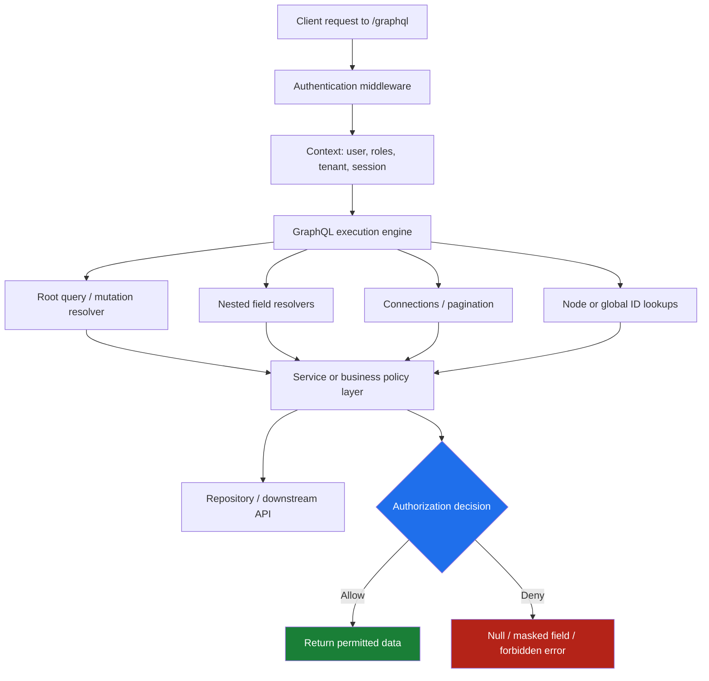

# GraphQL Authorization

> **Difficulty:** Beginner → Advanced  
> **Category:** API Pentesting → GraphQL Security  
> **Focus:** Understand how authorization decisions work across GraphQL queries, mutations, fields, and objects so you can review them safely during an **authorized** assessment and design them correctly in production.

GraphQL authorization is easy to underestimate because the API often exposes **one endpoint** instead of many. That can make the surface look simple even when the real authorization problem is spread across dozens of types, hundreds of fields, multiple roles, and several downstream services.

A useful way to remember the topic is:

> **Authentication answers “who are you?” GraphQL authorization answers “which objects, fields, and actions may this caller use at this exact point in the graph?”**

This note uses the GraphQL API contract itself as the starting point: the **schema** defines what can be requested, while the **GraphQL over HTTP** guidance defines how requests reach the service. From there, the real work is mapping business rules to resolvers, services, and data access paths.

---

## Table of Contents

1. [Why GraphQL Authorization Deserves Its Own Note](#why-graphql-authorization-deserves-its-own-note)
2. [Start with the API Contract](#start-with-the-api-contract)
3. [Mental Model — One Endpoint, Many Authorization Decisions](#mental-model--one-endpoint-many-authorization-decisions)
4. [Authorization Surfaces in GraphQL](#authorization-surfaces-in-graphql)
5. [Common Failure Patterns](#common-failure-patterns)
6. [Authorized Review Workflow](#authorized-review-workflow)
7. [Safe Validation Examples](#safe-validation-examples)
8. [Secure Design Patterns](#secure-design-patterns)
9. [Signals, Telemetry, and Operational Clues](#signals-telemetry-and-operational-clues)
10. [Defensive Hardening Checklist](#defensive-hardening-checklist)
11. [Key Takeaways](#key-takeaways)
12. [Public References](#public-references)

---

## Why GraphQL Authorization Deserves Its Own Note

In REST, authorization review often starts with endpoints:

- who can call `/users/{id}`?
- who can call `/admin/export`?
- who can `DELETE /orders/{id}`?

GraphQL compresses many of those questions into one route such as `/graphql`, but the underlying authorization problem does **not** get simpler. It becomes more granular.

A single GraphQL request can involve:

- a **root query** or **mutation**
- one or more **object lookups by ID**
- multiple **nested field resolvers**
- different **lists, connections, and pagination rules**
- downstream calls to **databases**, **REST services**, **subgraphs**, or **internal services**

That means GraphQL authorization commonly intersects with several OWASP API categories at once:

| GraphQL authorization mistake | Typical API impact | Closest OWASP API Top 10 mapping |
|---|---|---|
| Any caller can fetch another tenant’s object by ID | Object ownership failure | **API1:2023 Broken Object Level Authorization** |
| A regular user can invoke a privileged mutation | Function-level privilege failure | **API5:2023 Broken Function Level Authorization** |
| Sensitive fields are exposed when requested explicitly | Field/property overexposure | **API3:2023 Broken Object Property Level Authorization** |
| Mutation input accepts internal-only attributes | Mass-assignment style property abuse | **API3:2023 Broken Object Property Level Authorization** |
| Policy exists only in the UI, not in resolvers/services | Server-side authorization gap | API1 / API5 depending on effect |

### The GraphQL-specific trap

GraphQL feels type-safe and structured, so teams sometimes assume the schema itself is providing protection.

It is not.

The schema tells clients:

- what fields exist
- what arguments they take
- what shapes responses should have

But the schema alone does **not** decide whether:

- this user can see **this object**,
- this role can invoke **this mutation**,
- this tenant can read **this nested field**,
- or this client can update **this property**.

That decision must still be implemented and enforced.

---

## Start with the API Contract

For GraphQL, the practical API contract has two layers:

1. **The GraphQL schema** — types, fields, arguments, mutations, interfaces, unions, connections
2. **The HTTP serving model** — URL, methods, media types, request shape, response shape, caching and transport behavior

The schema is the closest thing GraphQL has to an application-level API spec. During review, it should be treated like a permission map candidate.

### What the contract tells you up front

| Contract clue | Authorization question it should trigger |
|---|---|
| `type Query` fields | Which reads are public, authenticated, role-gated, or object-scoped? |
| `type Mutation` fields | Which state changes require elevated privileges or ownership checks? |
| Sensitive fields on object types | Should all authenticated users see them, or only the owner / staff / finance role? |
| `node(id: ID!)` or generic lookup helpers | Can any caller dereference global IDs they should never access? |
| Interfaces and unions | Can alternate type paths expose privileged fields unexpectedly? |
| Connection fields like `users`, `projects`, `reports` | Are filtering and authorization applied **before** pagination and counts are computed? |
| Input types | Which properties are client-controlled, and which must remain server-controlled? |
| Schema differences by client or role | Does the API intentionally expose more fields to some callers than others? |
| HTTP GET support and caching | Could role-specific data be cached or replayed incorrectly? |

### Example schema fragment

```graphql
type Query {
  me: User!
  project(id: ID!): Project
  node(id: ID!): Node
  adminAuditLogs(first: Int = 20): AuditLogConnection!
}

type Mutation {
  updateProject(input: UpdateProjectInput!): Project!
  archiveProject(id: ID!): ArchiveProjectResult!
  changeUserRole(userId: ID!, role: Role!): User!
}

interface Node {
  id: ID!
}

type User implements Node {
  id: ID!
  email: String!
  displayName: String!
  role: Role!
  salaryBand: String
}

type Project implements Node {
  id: ID!
  name: String!
  owner: User!
  billing: BillingInfo
  members(first: Int = 20): UserConnection!
}

type BillingInfo {
  cardLast4: String
  invoiceEmail: String
  plan: String!
}

input UpdateProjectInput {
  id: ID!
  name: String
  invoiceEmail: String
  plan: String
  ownerId: ID
}
```

### What a reviewer should see immediately

From the schema alone, the first safe questions are:

- Is `adminAuditLogs` really restricted to admins?
- Does `project(id)` enforce ownership or membership?
- Is `node(id)` protected as tightly as `project(id)`?
- Can non-finance users request `billing { cardLast4 invoiceEmail }`?
- Can a normal user set `ownerId` or `plan` through `UpdateProjectInput`?
- Are hidden UI actions still callable as mutations?

That is the key mindset:

> **Every exposed field, argument, and input property is a possible authorization decision point.**

---

## Mental Model — One Endpoint, Many Authorization Decisions



The important lesson is that authorization is rarely a single gate checked once per HTTP request.

In GraphQL, the same operation may need distinct decisions for:

- the **operation itself**
- each **object** returned
- each **sensitive field** requested
- each **mutation side effect**
- each **tenant boundary** crossed

A caller may be authorized to see a project’s **name** but not its **billing** section. They may be authorized to list their own projects but not fetch arbitrary projects by ID. They may be allowed to update a display name but not reassign ownership.

---

## Authorization Surfaces in GraphQL

| Surface | What is being authorized? | Common mistake | Typical result |
|---|---|---|---|
| **Root queries** | Whether the caller may execute the read at all | Only checking “is authenticated?” | Regular users can access staff or admin reads |
| **Root mutations** | Whether the caller may trigger the action | Hidden UI button assumed to be enough | Privileged action callable directly |
| **Object lookup by ID** | Whether the caller may access a specific record | Fetch by ID without ownership/tenant check | BOLA / cross-tenant access |
| **Generic `node(id)` resolvers** | Whether global IDs can reveal arbitrary objects | Reusable lookup path bypasses stricter specific resolvers | Access path inconsistency |
| **Nested fields** | Whether the caller may see a property of an otherwise allowed object | Protecting root object but not child field | Field-level data leakage |
| **Lists and connections** | Which items belong in the collection | Filtering after pagination or after counts | Existence leakage, incorrect totals, tenant mixing |
| **Input types** | Which client-supplied properties are writable | Binding whole input objects to models | Unauthorized property changes |
| **Subscriptions** | Who may open and keep receiving events | Checking auth only when socket opens | Stale or over-broad event delivery |
| **Federation / downstream services** | Whether subgraphs re-check context and scope | Trusting upstream too much | Cross-service policy drift |
| **Caching / loaders** | Whether cached data remains scoped to the right caller | Cache key missing tenant/user context | Cross-user data exposure |

### Authorization is not just role-based

GraphQL authorization often mixes several models:

| Model | Example GraphQL rule |
|---|---|
| **Role-based (RBAC)** | Only admins may call `changeUserRole` |
| **Ownership-based** | A user may read only projects they own or belong to |
| **Attribute-based (ABAC)** | Finance fields require `department=finance` and `region=EU` |
| **Tenant-aware** | A request may access only objects whose `tenantId` matches the caller |
| **State-aware** | `archiveProject` allowed only if project is inactive and caller is owner or admin |

In real systems, these are often combined.

---

## Common Failure Patterns

### 1. Checking access only at the root resolver

A team protects `Query.project`, but forgets that the same project can also be reached from `node(id)` or from another nested path.

```text
Query.project(id)        -> ownership check exists
Query.node(id)           -> generic DB fetch, no ownership check
User.projects            -> membership check exists
```

If policy lives only in one entry point, the graph may contain a quieter path to the same object.

**Safer pattern:** enforce the permission in the shared service or business policy layer that all paths call.

---

### 2. Treating object access as enough for every field

Being allowed to read an object does not automatically mean being allowed to read every property on it.

Example:

- a user may view their project page
- but only finance staff should see billing contact details
- and only HR may see salary-related attributes on related user nodes

This is where GraphQL intersects strongly with **API3:2023 Broken Object Property Level Authorization**.

### Secure mental model

```text
Object-level authorization  = May I access this project at all?
Field-level authorization   = May I access this project's billing block?
Property write authorization = May I change this specific property?
```

---

### 3. Using directives as documentation only

A schema might contain annotations such as:

```graphql
type Mutation {
  changeUserRole(userId: ID!, role: Role!): User! @auth(requires: ADMIN)
}
```

That looks reassuring, but directives do **nothing by themselves** unless the server implementation actively interprets and enforces them.

So a reviewer should ask:

- Is the directive wired into execution?
- Is the real policy still centralized elsewhere?
- Are there fields without the directive that still need protection?

**Good rule to remember:** a directive can be excellent metadata, but it is not a control unless code makes it one.

---

### 4. Input objects mapped directly into models

This is the GraphQL version of over-posting or mass assignment.

```graphql
input UpdateProjectInput {
  id: ID!
  name: String
  ownerId: ID
  plan: String
  internalFlags: [String!]
}
```

If application code blindly copies all provided properties into a model or ORM object, the client may gain influence over fields that should remain server-controlled.

**Safer pattern:**

- allowlist writable fields explicitly
- ignore or reject internal-only properties
- authorize each sensitive property change separately

---

### 5. Caching and loaders that ignore subject or tenant context

GraphQL servers frequently use DataLoader-like patterns to reduce repeated lookups. That is good for performance, but it can be dangerous if cache keys ignore authorization context.

A risky pattern looks like this:

```text
cache key = project:123
```

A safer pattern often needs context such as:

```text
cache key = tenant:acme:user:42:project:123
```

At minimum, the authorization decision must not assume that because a record was fetched once, it is safe to reuse for every caller.

---

### 6. Pagination and counts computed before filtering

Suppose `projects(first: 20)` returns only items visible to the caller, but the API also returns:

- `totalCount`
- `pageInfo`
- aggregates

If those values are computed against the full underlying dataset before authorization filtering, the caller may learn:

- that hidden objects exist
- approximately how many there are
- whether a guessed filter matched protected records

This can become a subtle but important leakage channel.

---

### 7. Inconsistent denial behavior

Different parts of the graph may deny access in different ways:

- `403`-style GraphQL error
- `null` field
- empty list
- generic “not found” response
- partial data plus field error

Some variation is normal, but inconsistency can leak information about existence, type, ownership, or business state.

A secure design should choose denial semantics deliberately.

| Denial style | Strength | Risk if inconsistent |
|---|---|---|
| `null` for hidden field | Low-noise for sensitive field gating | Can confuse clients if not documented |
| Explicit forbidden error | Clear and auditable | Can reveal existence if used selectively |
| Empty list | Good for collection privacy in some designs | Can hide authorization bugs if used everywhere |
| “Not found” style masking | Useful for object existence hardening | May make troubleshooting harder |

---

### 8. Subscription auth checked only once

For subscriptions, the question is not just:

- who may **start** the subscription?

It is also:

- who may **continue** receiving events as roles, tenant membership, or object access change?

Long-lived connections make this easy to get wrong.

---

### 9. Federation and downstream trust drift

In federated GraphQL, the gateway may authenticate the caller, but subgraphs still need to know:

- who the caller is
- what tenant or role applies
- which downstream policy must still be enforced

A common mistake is assuming upstream filtering is enough and skipping object- or field-level checks in subgraphs or downstream services.

---

## Authorized Review Workflow

The safest way to review GraphQL authorization is to work from the contract inward, using approved identities and approved objects.

```mermaid
flowchart LR
    A[Schema / API contract] --> B[Extract roles, objects, fields, mutations]
    B --> C[Build authz matrix]
    C --> D[Use approved test accounts and test data]
    D --> E[Compare same object through every graph path]
    E --> F[Confirm policy in service / data layer]
    F --> G[Validate logs, metrics, and denial behavior]
    G --> H[Document object, field, and mutation rules]
```



### Practical review phases

| Phase | What to do | Why it matters |
|---|---|---|
| **1. Inventory actors** | List anonymous, regular, support, finance, admin, partner, service accounts, and tenant variations | Authorization bugs often hide in role assumptions |
| **2. Inventory protected assets** | Identify sensitive objects, fields, connections, and privileged mutations | Not every field has the same sensitivity |
| **3. Build a permission matrix** | Map `actor → operation → object → field → expected result` | Prevents ad hoc, incomplete testing |
| **4. Trace all graph entry points** | Check direct resolvers, `node(id)`, nested fields, list resolvers, and reusable loaders | The same object may be reachable many ways |
| **5. Use approved test data** | Validate only with in-scope accounts and owned test objects | Keeps testing safe and reproducible |
| **6. Review write paths carefully** | Check which input properties are writable and by whom | Property-level write flaws are common |
| **7. Inspect denial semantics** | Compare `null`, error, empty list, and masked-not-found behavior | Inconsistency can leak information |
| **8. Confirm observability** | Ensure denials, role failures, and policy exceptions are logged usefully | Authorization without telemetry is hard to defend |

### High-value review questions

When reading the schema or code, ask:

1. **Can the same object be reached by more than one resolver path?**
2. **Does every path converge on the same policy decision?**
3. **Are sensitive fields gated independently from object reads?**
4. **Are list filters authorization-aware before pagination and counts?**
5. **Can input objects set properties the UI never exposes?**
6. **Do loaders, caches, and federation layers preserve tenant and subject context?**
7. **Do subscriptions and long-lived sessions re-evaluate access appropriately?**

---

## Safe Validation Examples

The following examples are framed for **authorized** testing and defensive review. The goal is to confirm whether policy is enforced correctly, not to push the system beyond scope or impact other users.

### Example 1: Compare self-view vs object-view policy

```graphql
query ViewerOverview {
  me {
    id
    displayName
    role
  }
}
```

```graphql
query ProjectOverview($id: ID!) {
  project(id: $id) {
    id
    name
    owner {
      id
      displayName
    }
  }
}
```

**What to validate:**

- the caller can read only approved test projects
- ownership or membership rules are enforced consistently
- unauthorized access is denied in the documented way

---

### Example 2: Compare direct lookup vs generic node lookup

```graphql
query ProjectBySpecificPath($id: ID!) {
  project(id: $id) {
    id
    name
  }
}
```

```graphql
query ProjectByNodePath($id: ID!) {
  node(id: $id) {
    __typename
    ... on Project {
      id
      name
    }
  }
}
```

**What to validate:**

- both paths enforce the same authorization rule
- one helper path is not weaker than another
- denial behavior does not reveal protected object details unintentionally

---

### Example 3: Field-level access on an allowed object

```graphql
query ProjectBillingReview($id: ID!) {
  project(id: $id) {
    id
    name
    billing {
      plan
      invoiceEmail
      cardLast4
    }
  }
}
```

**What to validate:**

- `project` access does not automatically imply `billing` access
- sensitive subfields are masked, omitted, or denied according to policy
- staff-only fields are not exposed to ordinary users

---

### Example 4: Property-level control in mutations

```graphql
mutation UpdateProjectName($input: UpdateProjectInput!) {
  updateProject(input: $input) {
    id
    name
  }
}
```

Safe review questions for the same mutation:

- Can the caller change only `name`, or also `ownerId` and `plan`?
- Are unauthorized properties ignored, rejected, or applied incorrectly?
- Is the authorization decision tied to the specific property change, not just to “can call mutation”?

---

### Example 5: Privileged function review

```graphql
mutation ChangeRole($userId: ID!, $role: Role!) {
  changeUserRole(userId: $userId, role: $role) {
    id
    role
  }
}
```

**What to validate:**

- only explicitly privileged roles may execute the mutation
- support or tenant-admin roles are limited to their intended scope
- the mutation is not reachable through an alternate path with weaker checks

### Safe testing notes

- Use **approved test accounts** representing each role.
- Use **owned or designated test objects** instead of probing random identifiers.
- Prefer **minimal queries** that answer one policy question at a time.
- Stop at proof of incorrect authorization; do not expand impact unnecessarily.

---

## Secure Design Patterns

### 1. Centralize authorization in the business layer

Both GraphQL.org and GraphQL.js guidance emphasize a core idea:

> **Keep authorization logic in the business layer, not scattered across individual resolvers.**

Resolvers are still important, but they should usually be thin adapters.

#### Better pattern

```ts
const ProjectService = {
  async readProject(viewer, id) {
    const project = await repo.getProjectById(id);
    policy.requireProjectRead(viewer, project);
    return project;
  },

  async updateProject(viewer, input) {
    const project = await repo.getProjectById(input.id);
    policy.requireProjectEdit(viewer, project, input);

    const patch = {
      name: input.name,
      invoiceEmail: policy.canEditBilling(viewer, project)
        ? input.invoiceEmail
        : undefined,
    };

    return repo.updateProject(input.id, patch);
  },
};

const resolvers = {
  Query: {
    project: (_, { id }, ctx) => ProjectService.readProject(ctx.user, id),
  },
  Mutation: {
    updateProject: (_, { input }, ctx) => ProjectService.updateProject(ctx.user, input),
  },
};
```

### Why this helps

- every graph path can call the same policy function
- object and field decisions stay consistent
- review becomes easier because policy has a clear home

---

### 2. Deny by default, grant explicitly

A policy matrix should answer:

- who may read this object?
- who may read this field?
- who may invoke this mutation?
- who may change this property?

If the answer is unclear, defaulting to allow is dangerous.

| Design principle | GraphQL example |
|---|---|
| **Default deny** | New mutation is inaccessible until explicit policy exists |
| **Least privilege** | Support role can view account status but not billing token fragments |
| **Explicit grants** | `archiveProject` allowed for owner and admin only |
| **Context completeness** | Policy receives full user, tenant, and object state, not just a token string |

---

### 3. Treat directives as metadata plus enforcement

Schema directives can be useful for discoverability:

```graphql
directive @auth(requires: Role!) on FIELD_DEFINITION

type Mutation {
  changeUserRole(userId: ID!, role: Role!): User! @auth(requires: ADMIN)
}
```

But the implementation still needs a real enforcement layer.

Use directives to make policy visible, but do not confuse **declaration** with **execution**.

---

### 4. Separate object-level, field-level, and property-level checks

These are related, but not identical.

| Level | Example question |
|---|---|
| **Object-level** | May this caller access project `P123` at all? |
| **Field-level** | May this caller read `project.billing.invoiceEmail`? |
| **Property-level write** | May this caller change `ownerId` or `plan`? |
| **Function-level** | May this caller invoke `changeUserRole`? |

Good implementations make these layers explicit instead of collapsing them into one vague “is authorized” check.

---

### 5. Filter first, paginate second

For collections and connections:

1. determine which items the caller may access
2. then paginate, count, aggregate, and return page metadata

This avoids leaking information about unauthorized records through counts or page shape.

---

### 6. Make loaders and caches authorization-aware

A secure implementation should ensure that caching does not outlive or outscope policy.

Watch for:

- shared caches across tenants without tenant scoping
- per-request caches reused across user contexts
- object caches populated before policy checks and reused afterward

---

### 7. Re-check policy across federation and subscriptions

#### Federation

Make sure subgraphs and downstream services still know:

- caller identity
- tenant context
- role and scope
- resource state that affects authorization

#### Subscriptions

Make sure long-lived deliveries are not treated as permanently authorized just because the initial handshake succeeded.

---

### 8. Pair authorization with demand controls

Authorization is not the same as request safety.

A caller may be fully authorized yet still issue costly operations that stress resolvers. GraphQL security guidance recommends layered controls such as:

- pagination
- depth limits
- breadth / alias limits
- batching limits
- query complexity controls
- trusted documents where appropriate

These do not replace authorization, but they reduce the blast radius around it.

---

## Signals, Telemetry, and Operational Clues

Authorization quality is easier to defend when the system emits good signals.

| Signal | Why it matters |
|---|---|
| Repeated denials on the same field or mutation | Shows which controls are working and where clients are confused |
| Spikes in denied `node(id)` lookups | May indicate policy drift or overly discoverable global IDs |
| Partial responses with sensitive field errors | Useful for spotting field-level policy gaps |
| Cross-tenant cache anomalies | Strong clue for loader or cache scoping bugs |
| High-volume access to privileged operations | Helps detect misuse and validate rate controls |
| Subscription authorization failures after role changes | Shows whether long-lived access is being re-evaluated |

### What good logging should capture

Without exposing secrets, logs should ideally preserve enough context to answer:

- which operation was requested?
- which actor or service identity made it?
- which tenant or scope applied?
- which policy denied the action?
- was denial at operation, object, field, or property level?

That makes both incident response and secure maintenance easier.

---

## Defensive Hardening Checklist

### Schema and design

- [ ] Document authorization rules for every privileged query and mutation.
- [ ] Distinguish object-level, field-level, property-level, and function-level permissions.
- [ ] Review generic lookup helpers such as `node(id)` as first-class authorization surfaces.
- [ ] Keep input types minimal; do not expose internal-only properties to clients.

### Implementation

- [ ] Centralize policy checks in a business/service layer.
- [ ] Use explicit allowlists for writable properties.
- [ ] Ensure directives are backed by real enforcement code.
- [ ] Make loaders, caches, and repositories tenant- and subject-aware.
- [ ] Filter collections before computing counts and pagination metadata.
- [ ] Re-check or invalidate authorization state for subscriptions and long-lived sessions.

### Validation

- [ ] Build a role/object/field/mutation test matrix.
- [ ] Compare the same object through every graph path.
- [ ] Test both read exposure and write exposure for sensitive properties.
- [ ] Confirm denial semantics are deliberate and consistent.
- [ ] Add regression tests for previously fixed authorization bugs.

### Operations

- [ ] Log denials with enough context to debug policy issues safely.
- [ ] Alert on unusual access patterns to privileged operations.
- [ ] Review schema changes for newly exposed types, fields, and inputs.
- [ ] Pair authorization with depth, breadth, batching, and complexity controls.

---

## Key Takeaways

- GraphQL authorization is **not** a single gate at `/graphql`; it is a set of decisions across operations, objects, fields, and properties.
- The **schema is the review map**, but the **business layer must enforce** the policy.
- In GraphQL, broken authorization often appears as a mix of **BOLA**, **BFLA**, and **field/property overexposure**.
- High-risk areas include `node(id)` lookups, nested fields, broad input types, collection metadata, subscriptions, federation, and caches.
- The safest review method is contract-first, role-matrix-driven, and limited to **authorized test accounts and designated data**.

---

## Public References

- GraphQL.org — [Authorization](https://graphql.org/learn/authorization/)
- GraphQL.org — [Security](https://graphql.org/learn/security/)
- GraphQL over HTTP Draft — [GraphQL over HTTP](https://graphql.github.io/graphql-over-http/draft/)
- GraphQL.js — [Authorization Strategies](https://www.graphql-js.org/docs/authorization-strategies/)
- GraphQL.js — [Operation Complexity Controls](https://www.graphql-js.org/docs/operation-complexity-controls/)
- OWASP Cheat Sheet Series — [GraphQL Cheat Sheet](https://cheatsheetseries.owasp.org/cheatsheets/GraphQL_Cheat_Sheet.html)
- OWASP Cheat Sheet Series — [Authorization Cheat Sheet](https://cheatsheetseries.owasp.org/cheatsheets/Authorization_Cheat_Sheet.html)
- OWASP API Security Top 10 2023 — [API1: Broken Object Level Authorization](https://owasp.org/API-Security/editions/2023/en/0xa1-broken-object-level-authorization/)
- OWASP API Security Top 10 2023 — [API3: Broken Object Property Level Authorization](https://owasp.org/API-Security/editions/2023/en/0xa3-broken-object-property-level-authorization/)
- OWASP API Security Top 10 2023 — [API5: Broken Function Level Authorization](https://owasp.org/API-Security/editions/2023/en/0xa5-broken-function-level-authorization/)
- Apollo Server Docs — [Authentication and Authorization](https://www.apollographql.com/docs/apollo-server/security/authentication)
- Apollo Blog — [Access Control in GraphQL](https://www.apollographql.com/blog/access-control-in-graphql)
