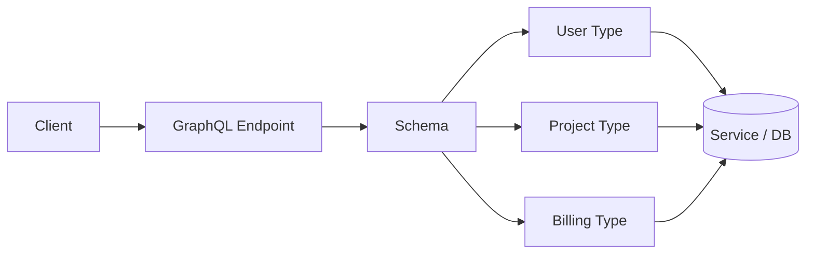
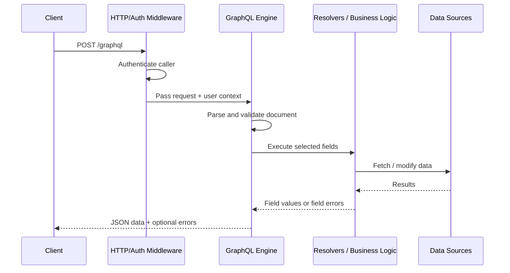
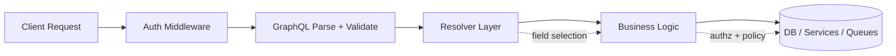

# GraphQL Basics

> **Difficulty:** Beginner → Advanced | **Category:** API Pentesting — GraphQL Security

**GraphQL** is a query language and execution model for APIs. For defenders and authorized testers, the important idea is not just that GraphQL is “one endpoint instead of many.” The important idea is that GraphQL exposes a **typed graph of data and actions**, and every field in that graph can become part of the security boundary.

This note builds the mental model for the rest of the GraphQL security section. It stays deliberately **defensive and authorization-focused**: the goal is to understand how GraphQL works well enough to review it safely, harden it correctly, and test it responsibly.

---

## Table of Contents

1. [What GraphQL Is](#1-what-graphql-is)
2. [Why Teams Use It](#2-why-teams-use-it)
3. [GraphQL vs REST: The Mental Shift](#3-graphql-vs-rest-the-mental-shift)
4. [Core Vocabulary](#4-core-vocabulary)
5. [How GraphQL Requests and Responses Look](#5-how-graphql-requests-and-responses-look)
6. [The Schema and Type System](#6-the-schema-and-type-system)
7. [How Execution Really Works](#7-how-execution-really-works)
8. [Common Query-Language Features](#8-common-query-language-features)
9. [Why GraphQL Changes the Security Model](#9-why-graphql-changes-the-security-model)
10. [Defensive Security Baseline](#10-defensive-security-baseline)
11. [Common Misconceptions](#11-common-misconceptions)
12. [Beginner → Advanced Progression](#12-beginner--advanced-progression)
13. [Key Takeaways](#13-key-takeaways)
14. [Further Reading and Research Basis](#14-further-reading-and-research-basis)

---

## 1. What GraphQL Is

GraphQL is an **API query language** plus a **runtime model** for executing those queries against a service.

At a beginner level, it helps to think of GraphQL like this:

> A client sends a structured request describing **exactly which fields it wants**, and the server resolves those fields from business logic and data sources.

That description is more precise than saying “GraphQL is like REST but different.” It highlights four properties that matter in security work:

1. **Typed contract** — the schema defines what clients are allowed to ask for.
2. **Field-level selection** — clients choose fields, not just endpoints.
3. **Graph traversal** — one request can move through related objects.
4. **Resolver execution** — each field is backed by server-side code.

GraphQL is **not**:

- a database
- a replacement for authentication
- automatically safer than REST because it is typed
- always a single monolithic backend

In practice, GraphQL often sits in front of multiple services, caches, search systems, and databases. That makes it powerful, but it also means a small schema can hide a large backend dependency graph.

---

## 2. Why Teams Use It

Teams adopt GraphQL because it solves real product and engineering problems.

| Benefit | What it means in practice | Security implication |
| --- | --- | --- |
| **Exact field selection** | Clients ask for only the fields they need | Reduces over-fetching, but increases importance of field-level authorization |
| **Single logical graph** | Frontends can fetch related data in one request | One endpoint can expose a very broad attack surface |
| **Strong typing** | Requests are validated against a schema | Validation helps, but does not replace input sanitization or authz |
| **Frontend flexibility** | Web, mobile, and internal apps can evolve faster | Schema growth can outpace security review |
| **Developer tooling** | Introspection, docs, IDEs, codegen | Great for developers, also valuable for recon if not governed |
| **Composition** | One graph can aggregate many backends | Trust boundaries may become hard to see |

### Typical real-world use cases

- web applications with complex dashboards
- mobile apps that need efficient data retrieval
- internal platforms combining many backend services
- BFF (backend-for-frontend) layers
- federated data graphs spanning multiple teams

A useful mental shortcut is:

> REST usually organizes around **endpoints and resources**. GraphQL organizes around a **schema and relationships**.

---

## 3. GraphQL vs REST: The Mental Shift

GraphQL and REST are both ways to expose application capabilities, but they shape the attack surface differently.

| Aspect | REST | GraphQL | Why this matters to defenders |
| --- | --- | --- | --- |
| **Primary unit** | Endpoint / resource | Schema / field / type | Review shifts from path-level to field-level thinking |
| **Typical URL model** | Many paths | Usually one main endpoint | Small visible surface can hide large logical scope |
| **Response shape** | Server-defined | Client-defined selection set | Output filtering becomes more important |
| **Discovery clues** | Paths, verbs, docs | Schema, introspection, IDEs, errors | Schema governance matters more |
| **Authorization habit** | Middleware per route | Resolver/business-logic checks per field | Endpoint auth alone is insufficient |
| **Performance risk** | Endpoint-specific | Depth, breadth, aliasing, batching, fan-out | Cost controls become core security controls |

### Diagram — endpoint thinking vs graph thinking



A REST review might ask, “Which paths exist?”

A GraphQL review must also ask:

- which **types** exist
- which **fields** expose sensitive data
- which **mutations** change state
- which **resolvers** touch privileged backends
- which field combinations create **expensive execution paths**

---

## 4. Core Vocabulary

The following terms appear constantly in GraphQL documentation, tooling, and security reviews.

| Term | Meaning | Security relevance |
| --- | --- | --- |
| **Schema** | The full contract of types, fields, operations, and directives | Defines the exposed logical attack surface |
| **Query** | Read-oriented operation | Main data retrieval path |
| **Mutation** | State-changing operation | Often the highest-risk business-logic surface |
| **Subscription** | Long-lived real-time operation | Adds connection lifecycle and event filtering concerns |
| **Type** | A defined shape such as `User`, `Project`, or `Invoice` | Determines what fields exist and how they nest |
| **Field** | A selectable property on a type | A field can be its own authorization boundary |
| **Resolver** | Server-side code that returns a field's value | Common location for authz mistakes and backend fan-out |
| **Scalar** | Leaf value such as `String`, `Int`, `Boolean`, `ID` | Inputs still require validation despite type checks |
| **Enum** | Finite allowed set of values | Helps constrain input and behavior |
| **Input type** | Structured type used for arguments, especially mutations | Better control than arbitrary JSON blobs |
| **Fragment** | Reusable field selection | Useful, but can hide query complexity |
| **Alias** | Renames a field in the response | Useful for clients; relevant for batching / breadth analysis |
| **Directive** | Metadata or execution hint such as `@include` | Custom directives can affect auth, caching, or validation |
| **Introspection** | Built-in ability to ask the API about its schema | Helpful for tooling; sensitive if over-exposed |
| **Persisted query / trusted document** | Client sends a known query ID instead of arbitrary query text | Reduces attack surface and supports better control |

### Easy way to remember the model

```text
GraphQL = Schema + Operations + Resolvers + Data Sources
```

If the schema is the **map**, resolvers are the **roads**, and business logic is the **checkpoint system**.

---

## 5. How GraphQL Requests and Responses Look

Although GraphQL is transport-agnostic in theory, **HTTP is the most common transport** for queries and mutations.

### 5.1 Common request structure

A typical GraphQL HTTP request contains:

- **`query`** — the GraphQL document text
- **`variables`** — input values supplied separately from the document
- **`operationName`** — the named operation to run, if needed
- **`extensions`** — optional metadata such as persisted-query information

```http
POST /graphql HTTP/1.1
Host: api.example.test
Content-Type: application/json
Accept: application/graphql-response+json, application/json
Authorization: Bearer <token>

{
  "operationName": "GetProjectOverview",
  "query": "query GetProjectOverview($projectId: ID!, $includeOwner: Boolean!) { project(id: $projectId) { id name status owner @include(if: $includeOwner) { id name } } }",
  "variables": {
    "projectId": "proj_123",
    "includeOwner": true
  }
}
```

### 5.2 Important transport notes

| Topic | Practical meaning |
| --- | --- |
| **POST** | Standard method for queries and mutations |
| **GET** | Sometimes supported for queries only; useful for caching, but query strings can leak into logs and intermediaries |
| **Content types** | Modern guidance emphasizes JSON and `application/graphql-response+json` responses |
| **Subscriptions** | Often use WebSockets or similar real-time transports rather than plain request/response HTTP |
| **Persisted queries** | Clients send a short identifier for an approved query instead of arbitrary query text |

### 5.3 Response structure

GraphQL responses usually return a top-level `data` object and may also include `errors`.

```json
{
  "data": {
    "viewer": {
      "id": "u_7",
      "name": "Ava"
    },
    "project": null
  },
  "errors": [
    {
      "message": "Not authorized to access project",
      "path": ["project"],
      "extensions": {
        "code": "FORBIDDEN"
      }
    }
  ]
}
```

### 5.4 Why the response model matters

GraphQL can return **partial success**.

That surprises people coming from REST. A request can succeed overall, yet some fields fail during execution. For defenders, this matters because:

- an HTTP `200` does not always mean every selected field succeeded
- error messages can leak schema and backend details
- partial responses can reveal more than intended if field-level checks are inconsistent
- logging and monitoring must capture both the operation and field-level failures

### Diagram — request lifecycle at a glance



---

## 6. The Schema and Type System

The schema is the center of GraphQL. It tells clients what can be requested and tells the server what shape a valid operation must follow.

### 6.1 Example schema

```graphql
type Query {
  viewer: User
  project(id: ID!): Project
  projects(first: Int = 20, after: String): [Project!]!
}

type Mutation {
  updateProject(id: ID!, input: UpdateProjectInput!): Project!
}

type Subscription {
  projectUpdated(id: ID!): Project!
}

type User {
  id: ID!
  name: String!
  email: String!
  role: Role!
}

type Project {
  id: ID!
  name: String!
  status: ProjectStatus!
  owner: User!
}

enum Role {
  ADMIN
  MEMBER
  VIEWER
}

enum ProjectStatus {
  ACTIVE
  PAUSED
  ARCHIVED
}

input UpdateProjectInput {
  name: String
  status: ProjectStatus
}
```

### 6.2 Type-system building blocks

| Type feature | What it does | Security meaning |
| --- | --- | --- |
| **Object type** | Represents a structured entity | Shapes the graph attackers and defenders reason about |
| **Scalar** | Leaf value like `String` or `ID` | Type checks help, but allowlisting and sanitization still matter |
| **Enum** | Restricts values to a known list | Reduces risky free-form input |
| **Input object** | Structured input for arguments | Safer and clearer than unbounded generic payloads |
| **List** | Repeated values, written like `[User]` | Large lists and nested lists increase performance risk |
| **Non-null** | Required value, written like `String!` | Improves predictability but changes error propagation |
| **Interface / Union** | Polymorphic output shapes | Requires careful handling of unexpected types and field exposure |
| **Directive** | Annotation or behavior modifier | Custom directives deserve review like any other logic |

### 6.3 Root operation types

Every GraphQL schema has an entry point for operations:

- **Query** for reads
- **Mutation** for writes / state changes
- **Subscription** for real-time updates

These root types are special only because they are **entry points**. Their fields still depend on ordinary resolver and business-logic behavior.

---

## 7. How Execution Really Works

GraphQL is not just “parse a query and return JSON.” A real server executes a pipeline.

### 7.1 Execution stages

| Stage | What happens | Security meaning |
| --- | --- | --- |
| **Authentication** | HTTP middleware or equivalent establishes identity | Must happen before GraphQL execution context is built |
| **Parsing** | GraphQL document is parsed into an internal representation | Invalid syntax is rejected early |
| **Validation** | Operation is checked against the schema | Prevents invalid field/type usage, but not business abuse |
| **Execution** | Selected fields are resolved | Main security boundary for authz and backend access |
| **Formatting** | Data and errors are shaped into the response | Error hygiene matters here |

### 7.2 Resolver mental model

A resolver usually receives:

- **parent** — the previously resolved object
- **args** — arguments provided for the field
- **context** — request-scoped data such as authenticated user, services, and tracing
- **info** — metadata about the field and execution path

A simplified resolver pattern looks like this:

```javascript
async function project(parent, args, context) {
  return context.projectService.getProjectForViewer({
    viewer: context.user,
    projectId: args.id
  });
}
```

The exact language does not matter. The security lesson does:

> GraphQL authorization is not solved by the schema alone. It is enforced where resolvers and business logic decide what this caller may read or change.

### Diagram — where security really sits



### 7.3 Why this changes testing strategy

In REST, a route review often starts with the path.

In GraphQL, the reviewer must map:

- root fields
- nested fields
- mutation effects
- resolver trust boundaries
- downstream systems touched by a selection set

That is why “single endpoint” does **not** mean “small review scope.”

---

## 8. Common Query-Language Features

GraphQL documents contain more than just a flat field list.

### 8.1 Named operations

Naming operations helps debugging, tracing, logging, and allowlisting.

```graphql
query GetProjectOverview($projectId: ID!) {
  project(id: $projectId) {
    id
    name
    status
  }
}
```

### 8.2 Variables

Variables keep untrusted input out of the query text and make requests easier to validate and cache.

```graphql
query GetProjectOverview($projectId: ID!) {
  project(id: $projectId) {
    id
    name
    status
  }
}
```

```json
{
  "projectId": "proj_123"
}
```

### 8.3 Fragments

Fragments reuse field selections.

```graphql
fragment ProjectCore on Project {
  id
  name
  status
}

query GetProjectAndOwner($projectId: ID!) {
  project(id: $projectId) {
    ...ProjectCore
    owner {
      id
      name
    }
  }
}
```

### 8.4 Aliases

Aliases let a client request the same field multiple times with different arguments.

```graphql
query CompareProjects($left: ID!, $right: ID!) {
  old: project(id: $left) {
    id
    name
  }
  new: project(id: $right) {
    id
    name
  }
}
```

This is legitimate client behavior, but it also means response shape alone may not tell you how much work the server performed.

### 8.5 Directives

Built-in directives like `@include` and `@skip` control conditional field execution.

```graphql
query GetViewer($includeEmail: Boolean!) {
  viewer {
    id
    name
    email @include(if: $includeEmail)
  }
}
```

Custom directives can also shape validation, caching, or authorization behavior. They should be reviewed as real logic, not decorative metadata.

### 8.6 Mutations and subscriptions

A simple mutation:

```graphql
mutation UpdateProjectStatus($id: ID!, $status: ProjectStatus!) {
  updateProject(id: $id, input: { status: $status }) {
    id
    status
  }
}
```

A simple subscription:

```graphql
subscription WatchProject($id: ID!) {
  projectUpdated(id: $id) {
    id
    status
  }
}
```

From a defensive standpoint:

- mutations are where business logic and authorization mistakes often become high impact
- subscriptions add long-lived session, channel, and event-filtering concerns

---

## 9. Why GraphQL Changes the Security Model

GraphQL rebalances risk. Some classic API problems remain, but they appear in different places.

### 9.1 Same underlying security classes, different expression

| Security concern | In REST | In GraphQL |
| --- | --- | --- |
| **Broken authorization** | Route-level access to objects/actions | Field-, type-, and mutation-level access |
| **Excessive data exposure** | Endpoint returns too much by default | Sensitive fields can be selected explicitly |
| **Injection** | Parameters and bodies feed interpreters | Arguments, custom scalars, resolvers, and downstream adapters feed interpreters |
| **DoS / resource exhaustion** | Expensive endpoints or abusive rates | Deep, broad, nested, or highly connected selection sets |
| **Inventory problems** | Undocumented paths and versions | Hidden schema capabilities, internal types, IDE exposure, federated subgraphs |

### 9.2 The most important security shift

The biggest beginner mistake is assuming the endpoint is the boundary.

In GraphQL, the real boundary is closer to this:

```text
Caller identity + schema design + resolver logic + downstream policy
```

That is why a GraphQL service can look tidy from the outside while still exposing:

- overly broad object traversal
- sensitive fields nested far below public objects
- unsafe mutations
- expensive relationship expansion
- inconsistent authorization between similar fields

---

## 10. Defensive Security Baseline

This section is the “minimum safe mental checklist” for GraphQL basics.

### 10.1 Authentication first, authorization during execution

Current GraphQL guidance emphasizes that authentication should happen in the HTTP or framework middleware layer, while authorization decisions are made when executing fields through business logic.

That means a healthy design usually looks like this:

- authenticate once per request or connection
- build a trusted user context
- enforce authorization close to the business rule and data access
- return consistent denial behavior without leaking internals

### 10.2 Protect the schema surface

| Control | Why it matters |
| --- | --- |
| **Govern introspection** | Useful for tooling, but should be a conscious production decision |
| **Disable public IDEs unless intended** | GraphiQL / Playground exposure expands discovery and misuse potential |
| **Review schema drift** | Old fields, deprecated mutations, and admin-only capabilities linger easily |
| **Use clear ownership** | Every type and field should have a responsible team |

### 10.3 Constrain query cost

OWASP and vendor guidance consistently treat performance controls as security controls in GraphQL.

Key controls include:

- **depth limits** to prevent pathological nesting
- **breadth / alias awareness** so one request cannot fan out arbitrarily
- **pagination** on list-returning fields
- **amount caps** on arguments like `first`, `last`, or custom limit parameters
- **timeouts** around expensive backend calls
- **query cost analysis** where available
- **rate limiting** that considers more than raw HTTP request count

### 10.4 Treat typed input as helpful, not magical

GraphQL typing helps reject structurally invalid input, but it does not eliminate security validation work.

Still validate:

- business-rule correctness
- string content and length
- enum and ID semantics
- custom scalar parsing
- downstream query construction
- file upload handling, if supported

### 10.5 Harden errors and metadata

Avoid leaking:

- stack traces
- resolver names
- internal service names
- SQL/ORM/search backend details
- verbose validation hints beyond what clients need
- tracing or debug extensions in untrusted contexts

### 10.6 Prefer safer production patterns

| Pattern | Defensive value |
| --- | --- |
| **Persisted / trusted queries** | Reduces arbitrary query text and improves monitoring |
| **Operation naming** | Better tracing, alerting, and abuse analysis |
| **Schema review in CI/CD** | Prevents accidental exposure through drift |
| **Field-level observability** | Helps spot hot paths, unexpected fan-out, and sensitive access |
| **Consistent pagination model** | Avoids unbounded list behavior |

### 10.7 Safe authorized-testing mindset

For an authorized reviewer, the first questions should be:

1. What is the intended schema surface in this environment?
2. Which fields and mutations are security-sensitive?
3. Where is authorization actually enforced?
4. What prevents expensive but valid-looking queries?
5. What developer conveniences are still exposed in production?

That is far more useful than treating GraphQL as “just another JSON POST endpoint.”

---

## 11. Common Misconceptions

| Misconception | Reality |
| --- | --- |
| **“GraphQL is safer because it is typed.”** | Types help validation, but they do not enforce authorization, sanitization, or business rules. |
| **“One endpoint means a smaller attack surface.”** | The visible network surface may be small, but the logical schema surface can be very large. |
| **“Disabling introspection solves GraphQL security.”** | It reduces easy discovery, but it does not fix resolver flaws, mutation risk, or expensive execution paths. |
| **“Gateway authentication is enough.”** | Authentication is necessary, but each sensitive field and action still needs correct authorization behavior. |
| **“Only mutations are dangerous.”** | Queries can leak sensitive data, consume large resources, and expose hidden relationships. |
| **“Depth limits alone prevent abuse.”** | Breadth, aliasing, batching, pagination size, and backend fan-out also matter. |
| **“GraphQL always means a single backend.”** | Many graphs aggregate multiple services, which increases trust-boundary complexity. |

---

## 12. Beginner → Advanced Progression

| Level | What the learner should understand |
| --- | --- |
| **Beginner** | A GraphQL client asks for fields from a typed schema using queries, mutations, and subscriptions. |
| **Early intermediate** | Requests include query text, variables, and operation names; responses can contain both data and errors. |
| **Intermediate** | Schemas define types and arguments; resolvers and business logic decide what data actually comes back. |
| **Upper intermediate** | GraphQL changes the security model by moving risk toward field-level authz, schema exposure, and query cost. |
| **Advanced** | Safe operation depends on schema governance, resolver policy, cost controls, error hygiene, observability, and production-safe defaults. |

### What comes next in this section

This basics note gives the foundation. The rest of the GraphQL security path goes deeper into:

- architecture
- introspection
- authorization
- query abuse
- batching and alias abuse
- injection
- denial of service
- subscription security

---

## 13. Key Takeaways

- GraphQL is a **typed graph interface**, not just a different HTTP format.
- The schema defines what can be asked, but **resolvers and business logic** decide what is actually allowed.
- A single endpoint can hide a **large logical attack surface**.
- GraphQL responses may contain **partial data and partial errors**, which changes monitoring and leakage risk.
- Strong GraphQL security depends on **field-level authorization, input validation, introspection governance, cost controls, safe errors, and good observability**.
- Defensive review should focus on **how the graph executes**, not only on whether `/graphql` exists.

---

## 14. Further Reading and Research Basis

This note was shaped using the local API architecture guidance plus public GraphQL and security references. Strong starting points include:

1. **GraphQL Foundation — Learn GraphQL**
   - Queries: fields, arguments, aliases, variables, fragments, directives
   - Schema: types, root operations, lists, non-null, enums, input objects
   - Serving over HTTP: request methods, content types, response format, partial errors
   - Authorization: authn before execution, authz in business logic

2. **GraphQL Specification (current draft)**
   - Authoritative reference for language, validation, type system, directives, and introspection

3. **OWASP GraphQL Cheat Sheet**
   - Input validation
   - access control
   - depth / amount limiting
   - pagination, timeouts, rate limiting
   - secure defaults around introspection and developer tooling

4. **Apollo security guidance**
   - Practical production advice on query depth, pagination caps, timeouts, rate limiting, and reducing attack surface

### Suggested source URLs

- `https://graphql.org/learn/queries/`
- `https://graphql.org/learn/schema/`
- `https://graphql.org/learn/serving-over-http/`
- `https://graphql.org/learn/authorization/`
- `https://graphql.org/learn/best-practices/`
- `https://spec.graphql.org/draft/`
- `https://cheatsheetseries.owasp.org/cheatsheets/GraphQL_Cheat_Sheet.html`
- `https://www.apollographql.com/blog/9-ways-to-secure-your-graphql-api-security-checklist`

> This note intentionally stays at the **fundamentals + defensive review** level. Deeper offensive detail is out of scope here and belongs only in tightly authorized, responsible testing contexts.
