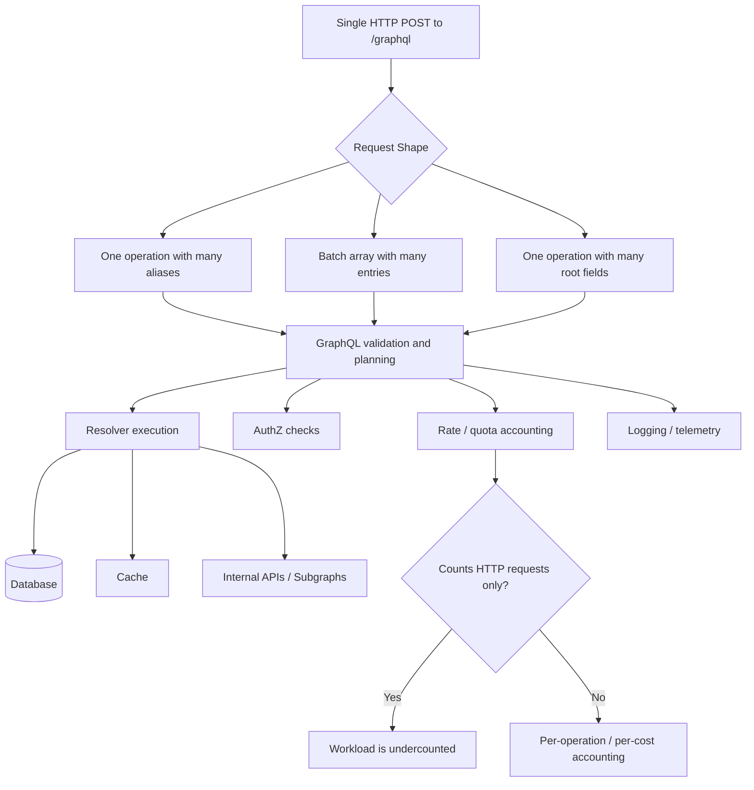
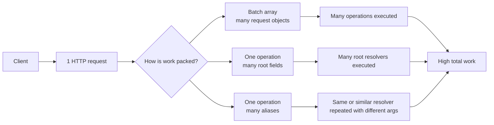
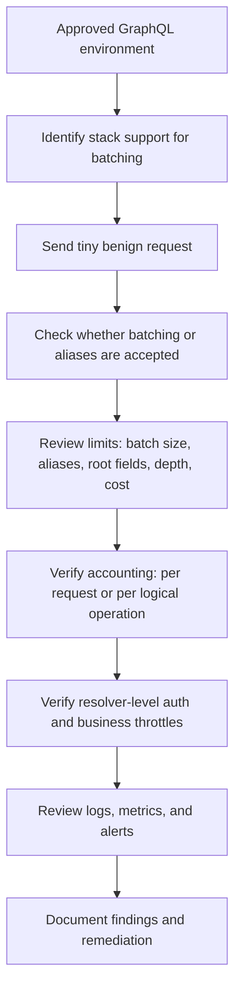
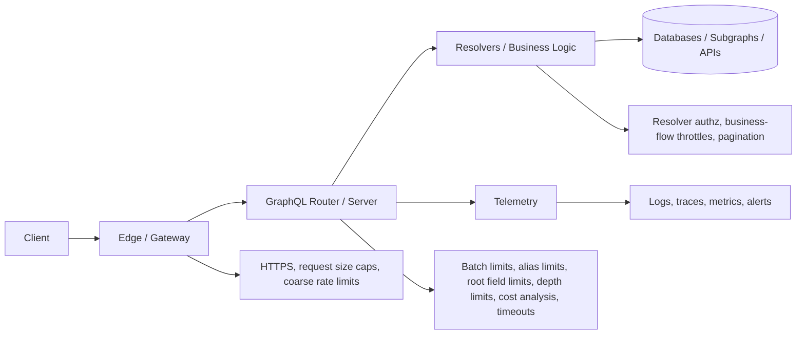

# GraphQL Batching and Alias Abuse

> **Batching and aliases are legitimate GraphQL features, but in weak deployments they can turn one “small” request into many logical operations. If defenders count only HTTP requests, they may underestimate real work, miss abusive patterns, and leave high-value business flows under-protected.**

---

## 🧠 What Is It? (Beginner Explanation)

GraphQL gives clients a lot of flexibility.

That flexibility is useful for normal applications:

- a dashboard can fetch several bits of data at once
- a mobile app can reduce round trips
- a frontend can ask for the same field in different ways using **aliases**

But that same flexibility can become dangerous when the server, gateway, or rate limiter thinks in terms of **“one HTTP request = one unit of work.”**

In reality, one GraphQL request may contain:

- **many top-level fields**
- **many aliased copies of the same field**
- **many operations bundled into one HTTP batch**
- **many backend resolver calls across databases or subgraphs**

### Easy Analogy

Think of a receptionist who counts visitors by **how many people walk in the door**.

- A normal REST request is often one person with one form.
- A GraphQL batching/alias case can be one person carrying **a stack of 50 forms**.

If the receptionist only counts people, the office workload is undercounted.

---

## 🎯 Why It Matters in Authorized API Testing

This topic matters because modern GraphQL stacks often sit behind:

- API gateways
- WAFs
- per-request rate limiters
- shared auth middleware
- logging pipelines that summarize by endpoint

That creates a common blind spot:

> **The edge sees one POST to `/graphql`, while the application may execute dozens of logical operations underneath.**

From an authorized defensive testing perspective, this can expose:

| Risk Area | What goes wrong |
|---|---|
| **Rate limiting** | A control charges one HTTP request while the server performs many logical operations |
| **Resource consumption** | Shallow but very broad queries can create heavy resolver fan-out |
| **Authorization** | A team protects the endpoint but underestimates field-level or resolver-level enforcement |
| **Business-flow protection** | Login, reset, search, invite, or checkout-related logic may not be throttled per action |
| **Monitoring** | Logs may record one request even though dozens of fields or batch entries executed |
| **Multi-service fan-out** | In federated systems, one request may become many downstream subgraph calls |

OWASP calls out GraphQL **batching attacks** specifically, and the GraphQL Foundation recommends **breadth and batch limiting** in addition to depth limiting. That combination is the core defender lesson: **wide and numerous operations matter just as much as deep ones**.

---

## 🏗️ Mental Model — One Envelope, Many Work Units



If you only remember one idea, remember this:

> **GraphQL abuse is often not about bypassing syntax. It is about exploiting a mismatch between the visible request envelope and the invisible execution cost behind it.**

---

## ⚙️ Technical Deep Dive

### Four Similar Terms You Should Not Confuse

| Term | What it is | Normal use | Security relevance |
|---|---|---|---|
| **Multiple operations in one document** | One GraphQL document contains multiple named operations | Client or developer convenience | Usually only **one** operation runs when `operationName` is selected |
| **HTTP batching** | One HTTP request contains an **array** of GraphQL request objects | Reduce round trips, keep page data consistent | Can cause many operations to execute under one HTTP request |
| **Aliases** | Renaming fields in the result, especially when querying the same field with different arguments | Compare or fetch multiple views of the same data | Can increase **breadth** dramatically within one operation |
| **Server-side batching/caching** | Internal optimization such as DataLoader combining backend fetches | Performance optimization | Helpful defense/performance feature, not the same as client abuse |

### 1) Multiple Operations in One GraphQL Document

This is often misunderstood.

```graphql
query HealthOne {
  __typename
}

query HealthTwo {
  __typename
}
```

If the client sends that document with:

```json
{
  "operationName": "HealthOne",
  "query": "query HealthOne { __typename } query HealthTwo { __typename }"
}
```

the server usually executes **only `HealthOne`**.

That is **not** the same as HTTP batching.

### 2) HTTP Batching

Some implementations support sending an **array** of GraphQL requests in one POST body.

A safe, tiny example for an approved test environment looks like this:

```json
[
  {
    "operationName": "HealthOne",
    "query": "query HealthOne { __typename }"
  },
  {
    "operationName": "HealthTwo",
    "query": "query HealthTwo { __typename }"
  }
]
```

Important implementation detail:

- **Apollo Server** does **not** support batched HTTP requests by default; it must be explicitly enabled with `allowBatchedHttpRequests: true`.
- **Apollo Router** can reject query batches unless batching is enabled, and it can enforce a maximum batch size.

That means batching is not something you should assume exists everywhere. It is often an **ecosystem or framework behavior**, not an automatic property of GraphQL itself.

### 3) Aliases

Aliases are a normal GraphQL feature used when the same field is requested with different arguments.

```graphql
query CompareCatalogViews {
  newest: products(first: 3, sort: NEWEST) {
    id
    name
  }
  topRated: products(first: 3, sort: RATING) {
    id
    name
  }
}
```

This is valid and useful.

The security issue appears when alias count becomes large enough that one shallow operation causes a lot of resolver work.

### 4) Why Depth Limits Alone Are Not Enough

Many teams add a **max depth** and assume they are safe.

That helps, but it does not stop **wide** operations.

A query can be:

- shallow
- valid
- not very large in raw bytes
- but still expensive because it contains many aliases or root fields

GraphQL.org explicitly recommends **breadth and batch limiting**, not just depth limiting.

---

## 📊 Aliases vs Batching vs Breadth



### Simple Rule

```text
Depth controls nested complexity.
Breadth controls wide complexity.
Batch limits control transport-level multiplicity.
Cost analysis ties all of that to actual work.
```

---

## Important Implementation Nuances

### Aliases Increase Breadth, Not Necessarily Height in the Way You Expect

Apollo Router distinguishes between:

- **`max_height`** → unique fields in an operation
- **`max_aliases`** → aliased field usages
- **`max_root_fields`** → root field count

That is an important defender lesson.

If a server only limits “unique fields,” repeated aliased use of the **same field** may still create a lot of work. So defenders need **alias-specific guardrails**, not just general structure limits.

### Batching and Federation Can Multiply Work Further

In federated or gateway-based architectures:

1. one client request reaches the router
2. the router parses the batch or operation
3. the router fans out to subgraphs or backend services
4. each subgraph may perform its own downstream fetches

So the true workload may be:

```text
1 HTTP request
→ 10 batch entries
→ 30 resolver groups
→ 80 subgraph/database calls
```

That is exactly why request-count-only metrics can be misleading.

### DataLoader Is Different

OWASP recommends server-side batching/caching techniques such as **DataLoader** to reduce the N+1 problem.

That is a **defensive performance optimization**.

Do not confuse:

- **good internal batching by the server**
with
- **unbounded external batching accepted from clients**

A mature implementation may use DataLoader **and still need strict alias, batch, and cost limits**.

---

## 🔍 What an Authorized Tester Should Validate

The goal here is **bounded validation**, not stress testing and not brute-force behavior.

Use:

- an approved environment
- your own test account or tenant
- tiny, low-cost requests first
- documented limits agreed in scope

### 1) Does the Stack Accept HTTP Batching at All?

First determine whether batching is supported by:

- framework documentation
- gateway/router configuration
- production vs staging differences
- a tiny benign batch such as repeated `__typename` in an approved test environment

### 2) If Batching Is Supported, What Is the Maximum Batch Size?

You are looking for evidence of:

- explicit upper bounds
- rejection before heavy execution
- predictable error handling
- clear telemetry when a batch limit is exceeded

### 3) Are Aliases and Root Fields Capped?

Check whether the implementation enforces:

- maximum aliases per operation
- maximum root fields per operation
- maximum depth
- maximum complexity or cost
- bounded list arguments such as `first`, `last`, or page size controls

### 4) Are Limits Charged Per HTTP Request or Per Logical Operation?

This is the most important validation question.

| Question | Healthy answer | Red flag |
|---|---|---|
| **Rate limit unit** | Charged per operation, per action, or per cost budget | Charged only per HTTP request |
| **Quota accounting** | Batch entries and high-cost operations reduce quota appropriately | Ten operations count the same as one |
| **Business-flow controls** | Sensitive flows have their own throttles | Sensitive mutations hidden behind one endpoint share weak global limits |
| **Logging** | Batch size, alias count, root fields, cost, and operation name are recorded | Only `POST /graphql 200` is logged |

### 5) Does Authorization Still Hold at the Resolver Level?

GraphQL authorization should live in business logic or resolvers, not only at the HTTP endpoint.

Alias-heavy or batched requests should **not** change authorization behavior.

Validate that:

- each logical access still receives normal authorization checks
- aliased access to the same field does not bypass per-object or per-field controls
- batched execution does not accidentally share context across operations in unsafe ways

### 6) Is Expensive Work Reflected in Telemetry?

You want defenders to be able to answer:

- who sent it?
- how many logical operations were inside it?
- how many aliases/root fields did it include?
- how expensive was it?
- what did it touch downstream?

If those answers are unavailable, incident response will be weak even if enforcement is partially correct.

---

## ✅ Safe Validation Workflow for Defenders



If you want one workflow to remember, use this:

> **Discover support → test safely → measure accounting → verify auth → inspect telemetry → recommend layered controls.**

---

## ✅ Tester Checklist

| Check | Secure Result | Red Flag |
|---|---|---|
| HTTP batch support | Disabled unless intentionally required, or tightly bounded if enabled | Enabled silently with no policy |
| Batch size | Explicit maximum size enforced | No batch cap |
| Alias count | Explicit maximum aliases | No alias guardrail |
| Root field count | Explicit maximum root fields | Very broad operations accepted |
| Cost model | Breadth and expensive fields contribute to cost | Only depth checked |
| Pagination | List-returning fields are bounded | Large or unbounded list arguments |
| Rate limiting | Charged per operation/action/cost | Charged only per HTTP request |
| Sensitive mutations | Separate business-flow protection | Same weak global limit as harmless queries |
| Authorization | Resolver/field-level checks remain intact | Endpoint-level trust assumptions only |
| Telemetry | Operation name, batch size, aliases, root fields, duration, and errors are visible | Logs show only generic `/graphql` requests |

---

## 🚨 Common Weaknesses

### 1) Per-Request Rate Limiting Only

This is the classic flaw.

The edge counts:

```text
1 POST /graphql
```

But the application executes:

```text
many operations, many root fields, or many aliased resolver calls
```

The control looks present, but the accounting model is wrong.

### 2) Depth Limits Without Breadth Limits

A shallow operation can still be expensive.

If the team only sets:

- max depth

but not:

- max aliases
- max root fields
- max batch size
- complexity budget

then wide operations can slip through.

### 3) No Dedicated Protection for Sensitive Business Flows

Sensitive actions such as:

- login
- password recovery helpers
- search and enumeration-like metadata lookups
- invite or coupon flows
- high-cost exports or reporting features

should usually have their own protections.

A single global “requests per minute” limit is often too coarse.

### 4) Logging That Sees Only the Envelope

Weak logs often show only:

```text
POST /graphql 200
```

That is not enough.

A defender should be able to reconstruct:

- operation names
- alias count
- root field count
- batch size
- complexity/cost
- response size
- resolver timing
- downstream service impact

### 5) Cost Analysis That Ignores Breadth

Some deployments estimate cost poorly or not at all.

Common mistakes include:

- weighting depth but not alias count
- forgetting multipliers on list-returning fields
- failing to treat high-value or expensive resolvers differently
- allowing public clients to submit arbitrary operations without trusted-document controls

### 6) Gateway / Backend Mismatch

A gateway may enforce one policy while the GraphQL server or subgraphs enforce another.

Examples of risk:

- the edge counts one request, the backend executes many
- the router logs operation count but downstream services do not
- the gateway allows batch arrays but application rate limits assume single operations

### 7) Over-Reliance on Introspection Blocking

Disabling introspection may reduce discoverability, but it does **not** solve batching or alias abuse.

This is a demand-control problem, not just a schema-discovery problem.

---

## 🧪 Healthy vs Weak Behavior

### Healthy Pattern

```text
Client sends one batched request with a few approved, low-cost operations
→ server recognizes batch size
→ policy checks aliases/root fields/cost
→ quota is charged per operation or cost
→ resolver auth remains intact
→ logs record batch size and operation names
```

### Weak Pattern

```text
Client sends one HTTP request carrying many logical units of work
→ edge counts it as one request
→ GraphQL server executes all of it
→ quotas barely move
→ logs stay generic
→ backend and business-flow protections are under-enforced
```

---

## 🛡️ Defensive Design Recommendations

### 1) Disable HTTP Batching Unless You Actually Need It

If batching is not required for a real client use case, the safest choice is often to **leave it off**.

This is especially true for:

- public APIs
- high-risk mutations
- APIs already struggling with demand control or observability

### 2) If Batching Is Needed, Bound It Hard

At minimum, define:

- maximum batch size
- maximum request body size
- maximum aliases
- maximum root fields
- maximum depth
- maximum complexity/cost
- execution timeout

These controls should reject bad requests **before** expensive execution whenever possible.

### 3) Rate Limit by Work, Not Just by Transport Envelope

Better rate-limit units include:

- logical operation count
- field or resolver cost
- specific business action count
- identity-based budgets
- token/user/client/application budgets

This matters because GraphQL lets many actions ride inside one transport request.

### 4) Use Trusted Documents for First-Party Clients

GraphQL.org recommends **trusted documents** for first-party clients.

That can:

- prevent arbitrary operations in production
- narrow the allowed query set
- make demand control more predictable
- improve observability because known operations are easier to classify

Trusted documents are usually not sufficient for public third-party APIs, but they are extremely valuable for internal apps, SPAs, and mobile clients.

### 5) Enforce Resolver-Level Authorization

GraphQL authorization belongs in the business logic layer.

Do not assume that protecting `/graphql` as an endpoint is enough.

Every object, property, and action still needs correct enforcement even when requested through:

- aliases
- many root fields
- batched operations
- federated routing paths

### 6) Bound Expensive Fields and List Arguments

List-returning fields should use:

- pagination
- sensible maximum page sizes
- cost multipliers
- potentially stricter limits for nested lists

Otherwise a “valid” query can still produce outsized load.

### 7) Instrument the Things Defenders Actually Need

At minimum, log or emit metrics for:

- authenticated principal / client ID / token subject
- operation name
- batch size
- alias count
- root field count
- depth
- complexity or cost
- response bytes
- execution time
- rejected-limit reason
- downstream resolver or subgraph timing

### 8) Separate High-Risk Workflows from General Traffic Controls

Authentication, account recovery, invitation, credit, export, billing, or search-heavy flows often need stricter controls than ordinary profile reads.

Do not let a single “GraphQL requests per minute” control stand in for action-specific abuse protection.

---

## 🧱 Layered Defense Model



A mature GraphQL defense does **not** rely on a single control.

It combines:

- edge controls
- GraphQL-specific demand controls
- resolver-level authorization
- workflow-specific throttling
- good telemetry

---

## 📈 Detection and Monitoring Ideas

These are some of the best signals for defenders.

| Signal | Why it matters |
|---|---|
| **High alias count** | Wide shallow operations may be bypassing depth-only controls |
| **Large batch size** | One request may hide many logical operations |
| **High root field count** | Heavy breadth at the top of the operation |
| **Large response-to-request size ratio** | Small request producing disproportionate work or data |
| **High resolver count per request** | Good indicator that request-count metrics are underestimating work |
| **Quota usage lower than resolver usage** | Suggests accounting mismatch |
| **Repeated operation names with unusual batch sizes** | May indicate automation or misuse |
| **Spikes in expensive resolver timings from few HTTP requests** | Classic sign that request count is not representing true demand |

### Defender Questions for SIEM / APM

Ask whether your telemetry can answer:

1. Which clients send the biggest batches?
2. Which operations have the highest alias counts?
3. Which identities generate the most resolver work per HTTP request?
4. Which fields dominate cost or execution time?
5. Which limits are being triggered most often?
6. Are sensitive mutations being throttled separately from harmless reads?

If your tooling cannot answer those questions, your GraphQL visibility is incomplete.

---

## 📝 Reporting Guidance

When reporting a finding, be precise about the mismatch you observed.

### Good Finding Language

> **The GraphQL endpoint accepts batched HTTP requests and alias-heavy operations, but edge rate limiting and quota accounting appear to count only the outer HTTP request. As a result, multiple logical operations can be processed within a single transport request without proportional throttling, logging granularity, or business-flow protection.**

### What to Describe Clearly

- whether HTTP batching is enabled
- whether alias, root field, depth, and cost limits exist
- what unit the rate limiter charges
- whether sensitive flows have dedicated throttles
- whether logs/metrics reflect actual logical work
- whether the issue exists at the gateway, GraphQL server, resolver, or downstream service layer

That framing keeps the report focused on **authorized validation, defensive design, and control failure**, not on attack theatrics.

---

## 🧠 Key Takeaways

- **Aliases and batching are legitimate features**, not inherently vulnerabilities.
- The real problem is usually an **accounting and enforcement mismatch**.
- **Depth limits alone are not enough**; breadth, aliases, root fields, batch size, and cost all matter.
- **HTTP request count is a poor sole control metric** for GraphQL demand control.
- **Resolver-level authorization** and **business-flow throttling** are critical.
- Strong GraphQL defenses combine **trusted documents, pagination, batching limits, alias limits, cost analysis, timeouts, and telemetry**.

---

## 📚 Sources and Further Reading

This note was informed by the following public sources:

1. **OWASP GraphQL Cheat Sheet** — GraphQL-specific attack patterns, including batching attacks, plus guidance on depth, amount, rate, and cost controls  
   https://cheatsheetseries.owasp.org/cheatsheets/GraphQL_Cheat_Sheet.html
2. **GraphQL.org — Security** — official guidance on demand control, trusted documents, pagination, depth limiting, breadth/batch limiting, rate limiting, complexity analysis, introspection, and error handling  
   https://graphql.org/learn/security/
3. **GraphQL.org — Queries / Aliases** — official explanation of why aliases exist and how they allow the same field to be queried with different arguments  
   https://graphql.org/learn/queries/#aliases
4. **Apollo Server — Request Format / Batching** — notes that batched HTTP requests are disabled by default and must be explicitly enabled  
   https://www.apollographql.com/docs/apollo-server/workflow/requests
5. **Apollo Router / GraphOS — Query Batching** — batching behavior, enablement, maximum batch size, metrics, and response handling  
   https://www.apollographql.com/docs/graphos/routing/performance/query-batching
6. **Apollo Router / GraphOS — Request Limits** — operation-based limits such as `max_aliases`, `max_root_fields`, `max_depth`, and parser/network guardrails  
   https://www.apollographql.com/docs/graphos/routing/security/request-limits
7. **GraphQL Foundation — GraphQL over HTTP Draft** — transport guidance and context for GraphQL over HTTP behavior  
   https://graphql.github.io/graphql-over-http/draft/
8. **Apollo Blog — Securing Your GraphQL API from Malicious Queries** — practical explanation of depth limiting, amount limiting, and query cost analysis  
   https://www.apollographql.com/blog/securing-your-graphql-api-from-malicious-queries/

---

## One Last Thing To Remember

If you find GraphQL batching or alias support during an authorized assessment, do not ask only:

- **“Can many things fit in one request?”**

Also ask:

- **“How is the real work counted?”**
- **“Which controls see the inner operations?”**
- **“Do auth, quotas, and logs follow logical work or only HTTP envelopes?”**

That is where the real security story usually is.
