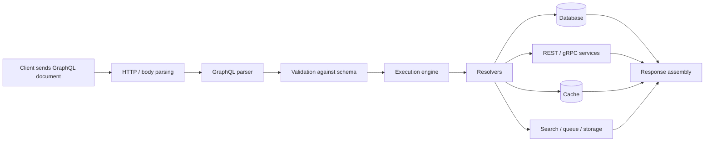
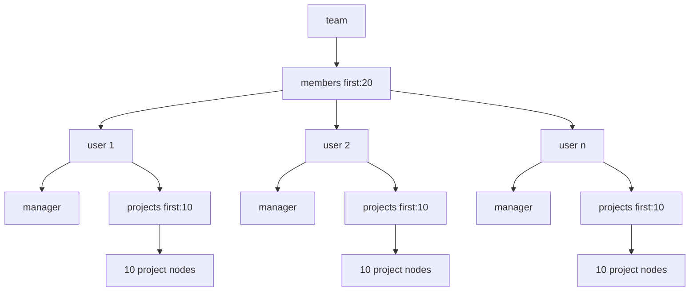
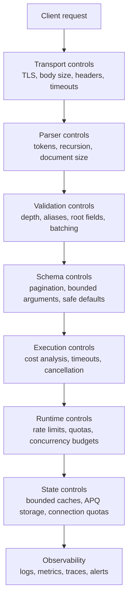
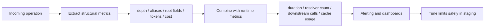

# GraphQL Denial of Service

> **Module:** API Pentesting → GraphQL Security  
> **Difficulty:** Beginner → Advanced  
> **Focus:** Understand how GraphQL availability failures emerge from query shape, resolver cost, batching, parser pressure, and cache behavior so you can assess and harden them safely during **authorized** API security work.

---

## 1. Overview

**GraphQL denial of service (DoS)** is the risk that a client can make a GraphQL API slow, unstable, or unavailable by sending operations that are disproportionately expensive for the server to parse, validate, execute, or store.

This matters because GraphQL gives clients unusual power:

- they choose the response shape
- they can traverse relationships deeply
- they can request many fields in one operation
- they can often submit multiple operations or aliases in one request
- one resolver tree can fan out into databases, REST services, caches, queues, and subgraphs

GraphQL.org’s security guidance makes an important point: many GraphQL attack vectors are really **demand-control problems**. In other words, the question is not only “is the input valid?” but also:

> **Can this request be handled safely at scale?**

A beginner-friendly mental model is this:

> **REST usually asks for one room in the building. GraphQL can ask for the floor plan, every connected hallway, and the contents of each room — all in one trip.**

If you remember one sentence from this note, remember this:

> **GraphQL DoS is usually not about raw packet volume; it is about making one “valid” request trigger too much work.**

---

## 2. Why GraphQL Changes Availability Risk

A normal HTTP API can absolutely have DoS problems, but GraphQL changes where that risk lives.

| Question | Typical REST answer | Typical GraphQL answer | Availability consequence |
| --- | --- | --- | --- |
| Where is functionality exposed? | Many endpoints and methods | Usually one endpoint with many schema entry points | One URL can hide many expensive execution paths |
| Who defines response shape? | Server usually fixes it | Client chooses fields and nesting | Query shape directly affects workload |
| How much can one request ask for? | Often limited by endpoint design | Potentially large graph traversal in one operation | One request can fan out heavily |
| Does request count reflect server cost? | Sometimes roughly yes | Often no | “Requests per minute” alone is a weak control |
| Is discovery separate from execution? | Often yes | Often closely related | Schema design and demand control become availability controls |

That is why GraphQL.org, OWASP, Apollo, and GitHub all emphasize some combination of:

- pagination
- depth limits
- breadth or alias limits
- batch limits
- query cost analysis
- timeouts
- rate limiting tied to identity and cost
- trusted or persisted documents for first-party clients

### The single-endpoint illusion

Security teams often say:

> “It is only `/graphql`.”

Operationally, that is misleading.

One GraphQL request may trigger:

1. HTTP parsing
2. JSON parsing
3. GraphQL parsing
4. schema validation
5. resolver execution
6. authorization checks
7. cache lookups
8. database queries
9. downstream REST or gRPC calls
10. logging, tracing, and response serialization

So the real question is not:

> “Can I reach the endpoint?”

The real question is:

> **What amount of work can a single accepted document force the system to perform?**

---

## 3. How One GraphQL Operation Becomes Expensive

The best way to understand GraphQL DoS is to understand where cost multiplies.

### 3.1 Request lifecycle



A request may be rejected at the parser or validation stage. That is good, because rejected requests are usually cheaper than executed ones.

If the request reaches execution, the cost often grows in ways that are easy to underestimate.

### 3.2 Common cost multipliers

| Multiplier | What it means | Why it matters |
| --- | --- | --- |
| **Depth** | How many nested field levels the operation traverses | Deep nesting can recurse through relationships and trigger repeated resolution |
| **Breadth** | How many sibling fields, aliases, or root fields are requested | Shallow queries can still be expensive if they fan out wide |
| **Amount** | How many list items a field can return | Large lists multiply all nested work below them |
| **Field cost** | Some fields are intrinsically expensive | Search, analytics, export, or aggregation fields may cost much more than scalar reads |
| **Backend fan-out** | One field triggers many downstream operations | GraphQL can amplify work across microservices or subgraphs |
| **Serialization cost** | Building, filtering, and encoding large responses | Even “successful” responses can be expensive to assemble and transmit |
| **Cache behavior** | Each request creates or stores server-side state | Unbounded caches can turn parsing into memory exhaustion |

### 3.3 Safe illustrative schema

The example below is intentionally small and defensive. It exists to explain cost, not to provide an abuse recipe.

```graphql
type Query {
  team(id: ID!): Team
}

type Team {
  id: ID!
  name: String!
  members(first: Int!, after: String): UserConnection!
}

type UserConnection {
  edges: [UserEdge!]!
  pageInfo: PageInfo!
}

type UserEdge {
  cursor: String!
  node: User!
}

type User {
  id: ID!
  displayName: String!
  manager: User
  projects(first: Int!, after: String): ProjectConnection!
}

type ProjectConnection {
  edges: [ProjectEdge!]!
  pageInfo: PageInfo!
}

type ProjectEdge {
  cursor: String!
  node: Project!
}

type Project {
  id: ID!
  name: String!
}
```

Now consider a moderate-looking operation:

```graphql
query TeamOverview($teamId: ID!) {
  team(id: $teamId) {
    members(first: 20) {
      edges {
        node {
          displayName
          manager {
            displayName
          }
          projects(first: 10) {
            edges {
              node {
                name
              }
            }
          }
        }
      }
    }
  }
}
```

This does **not** look dramatic. But cost analysis should still ask:

| Step | Potential fan-out |
| --- | --- |
| Fetch team | 1 object |
| Fetch members | 20 users |
| Fetch each manager | up to 20 more user resolutions |
| Fetch projects for each member | 20 × 10 = 200 project nodes |
| Serialize nested result | response assembly over all returned objects |

That is the key GraphQL DoS lesson:

> **Queries that look small in text can still be large in execution.**

### 3.4 Multiplication diagram



A short query string can therefore create a wide and deep resolver tree.

---

## 4. Main GraphQL DoS Patterns Defenders Should Know

GraphQL DoS is not one thing. It is a family of availability problems.

### 4.1 Pattern summary

| Pattern | What it looks like | Why it hurts | Typical controls |
| --- | --- | --- | --- |
| **Depth explosion** | Deeply nested relationships | Repeated traversal and resolver recursion | Max depth, lower list-depth limits, cost analysis |
| **Breadth / alias fan-out** | Many sibling fields or aliases in one operation | Wide execution tree in a single request | Alias limits, root-field limits, cost analysis |
| **Batch abuse** | Many operations in one HTTP request | Bypasses naive request-count rate limits | Batch limits, cost-aware rate limiting |
| **Unbounded list requests** | Large `first`, `last`, or custom count arguments | Multiplicative data and resolver growth | Pagination, argument caps, node budgets |
| **Expensive resolvers** | Search, export, aggregation, report generation | A shallow query can still be very costly | Per-field weights, async workflows, timeouts |
| **Parser stress** | Huge documents, excessive tokens, deep fragments | CPU and memory pressure before execution | Request-size, token, and recursion limits |
| **Cache / memory exhaustion** | Requests cause unbounded cache growth | Memory pressure and process crashes | Bounded caches, APQ review, eviction policies |
| **Federation amplification** | Gateway routes one query into many subgraphs | Distributed cost hidden behind one operation | Gateway limits, subgraph limits, tracing |
| **Subscription exhaustion** | Many long-lived subscriptions or expensive event fan-out | Persistent resource consumption | Connection quotas, auth refresh, per-subscription budgets |

### 4.2 Depth-based traversal

GraphQL.org recommends depth limiting because GraphQL schemas are often cyclic: users have friends, projects have owners, comments have authors, authors have comments, and so on.

Even when the underlying code is correct, overly deep traversal can be expensive.

Safe illustrative snippet:

```graphql
query ViewerSummary {
  viewer {
    manager {
      manager {
        manager {
          displayName
        }
      }
    }
  }
}
```

The important security lesson is not that nested queries are always malicious. It is that:

- deep nesting must be **bounded**
- list nesting deserves even tighter bounds than object nesting
- “valid against schema” does not mean “safe for production”

### 4.3 Breadth and alias fan-out

A query can be shallow and still expensive.

Aliases are legitimate GraphQL features, but PortSwigger and GraphQL.org both note that excessive aliasing can concentrate a large amount of work into one request.

Safe illustrative snippet:

```graphql
query Dashboard {
  userA: user(id: "1") { id displayName }
  userB: user(id: "2") { id displayName }
  userC: user(id: "3") { id displayName }
}
```

Three aliases are normal. Hundreds are not.

That is why some modern GraphQL gateways expose limits for:

- maximum aliases
- maximum root fields
- maximum unique fields or operation “height”

### 4.4 Batch operations

Some clients support sending multiple operations in a single HTTP request. That can be efficient for front-end rendering, but it can also defeat controls that only count raw requests.

A gateway that says “100 requests per minute” may still allow a client to push very large total work if each request contains many operations.

Defensive takeaway:

> **Rate limiting by HTTP request count alone is usually too weak for GraphQL.**

### 4.5 Unbounded list size and node explosion

List fields are one of the biggest availability risks in GraphQL.

GraphQL.org’s pagination guidance strongly recommends bounding list fields. GitHub’s public GraphQL API goes further and requires `first` or `last` values within fixed ranges and enforces an overall node limit.

That is a mature availability mindset:

- every connection must be explicitly sliced
- list sizes must have upper bounds
- total graph size should have a budget

If a schema still exposes fields like these, review priority should rise:

```graphql
type Query {
  users: [User!]!
  exportOrders(limit: Int): [Order!]!
}
```

Those designs are not automatically vulnerable, but they are much harder to defend safely than bounded connection patterns.

### 4.6 Expensive resolvers and business logic hotspots

Depth and size are not the whole story.

A seemingly modest field may still be expensive because it:

- triggers full-text search
- aggregates analytics
- computes recommendations
- calls slow partner APIs
- generates exports
- traverses many permission checks
- triggers an N+1 pattern in the data layer

Apollo’s malicious-query guidance emphasizes this exact point: some dangerous queries are not especially deep, but are still semantically expensive.

That is why mature systems assign **weights** to expensive fields instead of treating every field equally.

### 4.7 Parser and transport pressure

Not every GraphQL DoS starts at resolver execution.

A request can be abusive earlier in the pipeline through:

- oversized HTTP bodies
- excessive header counts
- very large variable objects
- extreme token counts
- deeply recursive fragments
- complex documents that are cheap to transmit but expensive to parse

Apollo Router documents parser and network limits specifically for this reason, including:

- maximum request bytes
- maximum parser tokens
- maximum parser recursion

These controls matter because a server that only protects execution may still be vulnerable at the parser layer.

### 4.8 Cache and memory exhaustion

Apollo warns about an important operational risk: unbounded caches can create a DoS condition even when the query logic itself is otherwise controlled.

In particular, if persisted query features or response caches store attacker-controlled or high-cardinality entries without bounds, the server can run out of memory.

This is a critical reminder:

> **Availability security is not only about CPU and database load. Memory policy matters too.**

### 4.9 Federation and subgraph amplification

Federated GraphQL systems add another layer of risk.

One gateway request may fan out into:

- several subgraphs
- multiple network hops
- entity lookups across services
- repeated joins of partial results

A gateway may think it is handling “one request,” while downstream services experience several expensive resolver chains.

That means demand control should not exist only at the edge. It should also be visible in:

- subgraph telemetry
- downstream timeout policy
- per-subgraph concurrency and resource budgets

### 4.10 Subscriptions and long-lived demand

Queries and mutations are not the whole story.

Subscriptions can create persistent availability pressure through:

- too many concurrent connections
- expensive subscription initialization
- broad event fan-out
- stale sessions that remain connected
- missing per-subscriber filtering

A GraphQL service can therefore suffer DoS-like degradation even if no single subscription message is huge.

---

## 5. Safe, Authorized Review Questions

This topic should always be approached defensively.

The goal in an authorized assessment is **not** to flood the target or “see if it falls over.” The goal is to verify whether controls exist and behave correctly with **bounded, approved, low-risk validation**.

### 5.1 Good review questions

| Review question | Why it matters | Safer evidence source |
| --- | --- | --- |
| Are all list-returning fields paginated and bounded? | Prevents node explosion | Schema review, code review, approved introspection |
| Is there a max depth and a stricter list-depth limit? | Prevents recursive traversal abuse | Gateway or server config review |
| Are alias counts and batch sizes bounded? | Prevents shallow fan-out abuse | Edge policy, integration tests, gateway docs |
| Are expensive fields weighted in a complexity model? | Depth alone is insufficient | Schema directives, complexity middleware, telemetry |
| Are rate limits tied to identity and cost? | Request count alone is weak | Rate-limit docs, policy review, headers, traces |
| Are parser and body-size limits set? | Stops pre-execution pressure | Reverse proxy, router, parser config |
| Are caches bounded? | Prevents memory exhaustion | Server config, cache backend review |
| Are subgraphs protected independently? | Gateway-only limits may be incomplete | Federation config, tracing, subgraph policy |
| Are subscription connections and fan-out bounded? | Long-lived load can exhaust resources | WebSocket/SSE config and metrics |

### 5.2 Safer validation approach

A careful authorized workflow usually looks like this:

1. **Capture normal client behavior first** using legitimate traffic, docs, or approved schema access.
2. **Identify high-risk structures** such as cyclic relationships, broad list fields, expensive search fields, and batch-capable clients.
3. **Review limits in configuration and code** before sending any non-routine requests.
4. **Use boundary tests in staging or an approved lab** rather than flooding production.
5. **Prefer “slightly above allowed maximum” checks** over stress floods. For example, verify that a depth limit rejects one level above the policy.
6. **Observe telemetry and rejection paths** to confirm the system fails safely and observably.
7. **Stop immediately** if the environment shows signs of instability.

A useful rule to remember:

> **For availability testing, proof of enforcement is better than proof of destruction.**

---

## 6. Mental Model — Layered Demand Control

GraphQL.org describes demand control as a layered problem. That is exactly the right way to think about DoS defense.



No single control is enough.

### 6.1 Control stack

| Layer | Example controls | What it primarily stops |
| --- | --- | --- |
| **Transport** | HTTPS, request-size caps, proxy timeouts, header limits | Oversized requests and slow transport abuse |
| **Parser** | Token limits, recursion limits | CPU or memory pressure during parse/AST construction |
| **Validation** | Max depth, alias limits, root-field limits, batch limits | Structurally dangerous documents before execution |
| **Schema** | Cursor pagination, bounded numeric arguments, fewer unbounded list fields | Large valid requests that should never exist |
| **Execution** | Query complexity analysis, resolver timeouts, cancellation | Semantically expensive requests |
| **Runtime** | Rate limiting by client identity and cost | Medium-cost requests repeated too often |
| **State** | Bounded APQ cache, bounded response cache, connection budgets | Memory exhaustion and persistent load |
| **Observability** | Operation metrics, tracing, alerting | Fast detection and safer tuning |

### 6.2 What a mature posture looks like

| Maturity level | Characteristics |
| --- | --- |
| **Weak** | Counts raw requests, little or no pagination, no depth or cost controls |
| **Improving** | Adds depth limits, list caps, and basic timeouts |
| **Strong** | Adds alias and batch limits, complexity analysis, cost-aware rate limits, telemetry |
| **Mature** | Uses trusted documents for first-party clients, bounded caches, node budgets, subgraph telemetry, and staged tuning of limits |

---

## 7. Technical Details That Matter in Practice

### 7.1 Depth is helpful, but not sufficient

HowToGraphQL and Apollo both make the same practical point:

- **max depth** is easy to implement and highly valuable
- but **depth alone** does not catch every expensive query

Examples of queries depth limits may miss:

- shallow but wide alias fan-out
- expensive search fields
- large list sizes at low depth
- many batched operations in one request

So a healthy rule is:

> **Depth limit = baseline. Complexity model = maturity.**

### 7.2 Breadth matters as much as depth

Apollo Router’s operation limits highlight an important idea: some queries are dangerous not because they are deep, but because they are broad.

Useful breadth signals include:

- total aliases
- total root fields
- unique field count or “height”
- batched operations per request

That matters especially for dashboard-style queries and mobile clients, where broad operations are common and need to be governed carefully instead of simply blocked blindly.

### 7.3 Node budgets are powerful

GitHub’s GraphQL resource limits provide one of the clearest public examples of availability engineering for GraphQL.

Key ideas from GitHub’s model:

- every connection requires explicit `first` or `last`
- connection arguments are bounded
- total requested nodes have an upper limit
- requests also consume points from a separate rate budget

This is valuable because it converts abstract “GraphQL complexity” into operationally meaningful budgets.

### 7.4 Complexity should reflect real backend work

A good complexity model is not only an AST game. It should reflect what fields actually cost.

| Field type | Example | Suggested weighting logic |
| --- | --- | --- |
| Cheap scalar | `id`, `displayName` | Low default weight |
| Simple object lookup | `user(id: ...)` | Small fixed weight |
| Paginated connection | `projects(first: n)` | Base weight × requested item count |
| Expensive search | `searchUsers(query: ...)` | Higher base weight |
| Aggregation / reporting | `analytics(range: ...)` | High weight, possibly async-only |
| Federated join-heavy field | entity resolution across services | Higher weight plus tracing review |

Apollo’s guidance on malicious queries is useful here: some operations are dangerous because their **business meaning** is expensive, not because they are syntactically large.

### 7.5 Timeouts are necessary, but not enough

OWASP and HowToGraphQL both discuss timeouts as a practical defense. Timeouts are important, but they are late-stage controls.

They help because they:

- limit how long expensive work can run
- keep hung downstreams from tying up workers forever
- reduce blast radius from edge cases

But they are not sufficient because:

- significant work may already be done before timeout fires
- database or cache pressure may already have been created
- retries can still create repeated load

So timeouts should be treated as a **safety net**, not the whole strategy.

### 7.6 Trusted documents are powerful for first-party clients

GraphQL.org recommends trusted documents for APIs that only serve first-party clients.

This is one of the strongest anti-DoS controls available because it changes the problem:

- instead of evaluating arbitrary documents from clients,
- the server accepts only preapproved operations.

That does **not** fit every public API. But where it fits, it drastically reduces attack surface.

### 7.7 Bounded caches are a security control

Apollo’s server documentation explicitly warns that unbounded caches can expose a GraphQL service to DoS through memory exhaustion.

That means these are not just performance choices:

- LRU size limits
- TTL limits
- separate cache budgets for persisted queries
- external cache backends with controlled eviction

They are part of security architecture.

---

## 8. Detection and Telemetry

A GraphQL DoS program is incomplete without observability.

Good defenses should not only reject abusive operations. They should also tell defenders **why** the request was risky.

### 8.1 High-value signals

| Signal | Why it is useful |
| --- | --- |
| `operationName` present vs missing | Anonymous or random operations reduce traceability |
| Request body size | Early indicator of parser/transport pressure |
| Parser token count | Detects oversized or complex documents before execution |
| Query depth | Good first structural metric |
| Alias count | Detects broad fan-out |
| Root field count | Detects “many things at once” requests |
| Estimated complexity / cost | Best structural approximation of backend work |
| Total nodes requested | Strong signal for list explosion risk |
| Resolver count per request | Reveals hidden backend work |
| Downstream call count | Shows subgraph or REST fan-out |
| Duration / p95 / p99 latency | Availability impact in production terms |
| Error code by rejection rule | Confirms which control actually fired |
| Cache size / eviction / APQ growth | Detects memory-oriented failure modes |
| Subscription connection count | Reveals long-lived resource pressure |

### 8.2 Detection pipeline



### 8.3 Example structured log fields

```json
{
  "operationName": "TeamOverview",
  "depth": 5,
  "aliases": 1,
  "rootFields": 1,
  "estimatedCost": 84,
  "requestedNodes": 220,
  "durationMs": 412,
  "resolverCount": 137,
  "downstreamCalls": 24,
  "rejectedBy": null,
  "clientId": "web-app"
}
```

For rejected operations, it is useful to log the control that fired:

```json
{
  "operationName": "Anonymous",
  "depth": 14,
  "aliases": 26,
  "estimatedCost": 912,
  "rejectedBy": "maxComplexity",
  "httpStatus": 400
}
```

### 8.4 What defenders should actually look for

Look for patterns, not single scary requests.

Examples:

- repeated requests clustering just below configured limits
- sudden increases in alias count from one client or token
- anonymous operations with unusually high cost
- rising parser rejection rates after a deployment
- large increases in APQ or response-cache cardinality
- one dashboard field suddenly dominating p95 latency
- subgraph or database saturation even when edge traffic looks normal

---

## 9. Practical Hardening Patterns

### 9.1 Start with schema design

The cheapest dangerous query is the query your schema never allowed in the first place.

Prefer patterns like:

```graphql
scalar PaginationAmount

type Query {
  team(id: ID!): Team
}

type Team {
  members(first: PaginationAmount!, after: String): UserConnection!
}
```

Instead of patterns like:

```graphql
type Query {
  allTeams: [Team!]!
}
```

Schema-level availability improvements include:

- cursor pagination for list fields
- upper bounds on list sizes
- avoiding “return everything” fields
- splitting very expensive workflows into async job patterns
- limiting or redesigning highly recursive relationships

### 9.2 Add baseline validation rules

A good minimum production baseline usually includes:

- maximum query depth
- separate lower limit for nested lists if supported
- alias limits
- root-field limits
- batch limits
- parser token and recursion limits
- request-body size limits

### 9.3 Add complexity analysis for real workloads

If your graph has expensive search, reporting, aggregation, or federated joins, static depth limits are not enough.

A conceptual JavaScript example:

```js
import depthLimit from 'graphql-depth-limit';
import { ApolloServer } from '@apollo/server';

const server = new ApolloServer({
  schema,
  validationRules: [depthLimit(8)],
  cache: 'bounded'
});
```

For more mature setups, add a complexity rule that:

- assigns higher cost to expensive fields
- multiplies cost by pagination arguments such as `first`
- rejects operations above a defined threshold
- emits the calculated cost into telemetry

Conceptually:

```js
const complexityPolicy = {
  maximumCost: 500,
  fieldCosts: {
    Query: {
      searchUsers: 20,
      analytics: 50
    },
    Team: {
      members: { base: 2, multipliers: ['first'] }
    },
    User: {
      projects: { base: 2, multipliers: ['first'] }
    }
  }
};
```

Exact implementation varies by library, but the security principle is stable.

### 9.4 Use cost-aware rate limiting

GitHub’s public GraphQL API shows a strong pattern: requests consume **points**, not just “one request.”

That is more accurate because:

- a tiny query and a very large query are not equivalent
- mutative requests may deserve different budgets
- clients can be budgeted by token, app, user, or installation

A simple mental model:

| Request | Estimated cost | Budget effect |
| --- | --- | --- |
| Small profile lookup | 1 point | negligible |
| Dashboard query | 20 points | moderate |
| Expensive search + connections | 120 points | heavy |
| Over-budget operation | rejected or delayed | budget preserved |

### 9.5 Apply timeouts and cancellation

Helpful timeout layers include:

- HTTP server timeout
- gateway-to-subgraph timeout
- resolver timeout
- database query timeout
- external API client timeout

These should be aligned so that cancellation is fast and predictable.

### 9.6 Keep caches bounded

Apollo’s guidance is direct here:

- prefer `cache: "bounded"` where supported
- disable persisted queries if you cannot store them safely
- or back them with a bounded external cache
- monitor cardinality and memory growth

A minimal server-side posture might look like:

```js
const server = new ApolloServer({
  schema,
  cache: 'bounded',
  persistedQueries: false
});
```

That is not the only safe design, but it is much safer than an unbounded default cache in production.

### 9.7 Use trusted documents when possible

For first-party clients:

- allowlist known operations
- send document IDs instead of arbitrary query text
- reject unknown documents in production

This reduces the space of possible expensive operations dramatically.

### 9.8 Harden federation explicitly

For federated graphs, review:

- gateway depth, alias, and body-size limits
- per-subgraph timeouts
- entity-resolution hot spots
- subgraph concurrency and queue saturation
- whether subgraphs are protected if reached directly

### 9.9 Do not forget subscriptions

For subscription-heavy deployments, add:

- maximum concurrent connections per identity
- maximum subscriptions per connection
- server-side idle timeouts
- per-event filtering before fan-out
- telemetry on message rate and subscriber counts

---

## 10. A Compact Defensive Checklist

### Minimum baseline

- [ ] All list-returning fields are paginated
- [ ] Pagination arguments have strict upper bounds
- [ ] Request-body size limits are configured
- [ ] Parser token / recursion limits are configured
- [ ] Query depth limit exists
- [ ] Alias and root-field limits exist
- [ ] Timeouts exist for resolvers and downstream calls
- [ ] Basic rate limiting exists per identity
- [ ] Caches are bounded
- [ ] Rejections are logged with a clear reason

### Mature posture

- [ ] Complexity analysis weights expensive fields
- [ ] Rate limiting consumes cost points, not just request counts
- [ ] Total requested nodes have a budget
- [ ] Trusted documents are used for first-party clients
- [ ] Gateway and subgraphs are both instrumented
- [ ] Subscription quotas are enforced
- [ ] APQ / response-cache cardinality is monitored
- [ ] Staging tests verify limits slightly above threshold without stressing production

---

## 11. Key Takeaways

- GraphQL DoS is usually about **work amplification**, not raw network volume.
- The most important risks come from **depth, breadth, list size, expensive resolvers, parser pressure, and memory policy**.
- **Depth limits are necessary but not sufficient**.
- **Pagination, complexity analysis, and cost-aware rate limiting** are central GraphQL controls.
- **Trusted documents** can be one of the strongest protections for first-party clients.
- **Bounded caches** are part of security, not just performance tuning.
- The safest authorized testing validates **control enforcement**, not service collapse.

---

## 12. References

- GraphQL.org — Security: `https://graphql.org/learn/security/`
- GraphQL.org — Pagination: `https://graphql.org/learn/pagination/`
- OWASP GraphQL Cheat Sheet: `https://cheatsheetseries.owasp.org/cheatsheets/GraphQL_Cheat_Sheet.html`
- PortSwigger Web Security Academy — GraphQL: `https://portswigger.net/web-security/graphql`
- Apollo Blog — Securing Your GraphQL API from Malicious Queries: `https://www.apollographql.com/blog/securing-your-graphql-api-from-malicious-queries/`
- Apollo Blog — 9 Ways to Secure Your GraphQL API Security Checklist: `https://www.apollographql.com/blog/9-ways-to-secure-your-graphql-api-security-checklist`
- Apollo Router — Request Limits: `https://www.apollographql.com/docs/graphos/routing/security/request-limits`
- Apollo Server — Cache Backends / Ensuring a bounded cache: `https://www.apollographql.com/docs/deploy-preview/662d74d12706a81c5b92bd20/apollo-server/v3/performance/cache-backends`
- GitHub Docs — GraphQL Resource Limitations: `https://docs.github.com/en/graphql/overview/resource-limitations`
- HowToGraphQL — Security: `https://www.howtographql.com/advanced/4-security/`
