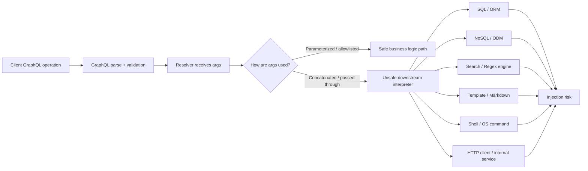
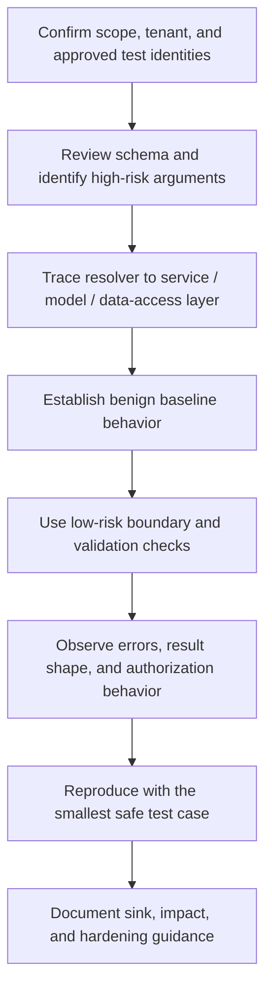
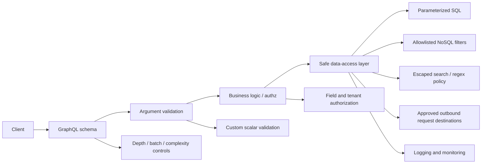

# GraphQL Injection

> **Module:** API Pentesting → GraphQL Security  
> **Difficulty:** Beginner → Advanced  
> **Focus:** Understand what “GraphQL injection” really means, where it appears in resolvers and data-access layers, and how to assess and harden it during **authorized** API security work.

---

## 1. Overview

**GraphQL injection** is not a special parser bug in GraphQL itself.
It is the risk that **client-controlled GraphQL arguments** are passed unsafely into a **downstream interpreter** such as:

- SQL
- NoSQL query builders
- regex engines
- full-text search DSLs
- template engines
- shell commands
- HTTP requests to internal services
- ORM / ODM filter builders

That distinction matters.

A beginner-friendly way to think about it is:

> **GraphQL is the delivery format. The real injection usually happens one layer deeper.**

So when people say “GraphQL injection,” they usually mean one of these situations:

- a resolver concatenates a GraphQL argument into SQL,
- a GraphQL `JSON` or `JSONObject` input is passed directly into a MongoDB filter,
- a `search`, `where`, `filter`, or `orderBy` argument is trusted too much,
- a mutation argument is used to build a shell command, URL, or template without strict validation.

The GraphQL layer may look strongly typed and safe, while the resolver behind it still contains the real bug.

---

## 2. Why It Matters

GraphQL changes the *shape* of injection risk even when it does not create the root cause by itself.

### 2.1 One endpoint can hide many data flows

A single `/graphql` endpoint may expose:

- account lookup
- search
- reporting
- export functions
- admin workflows
- federation lookups across subgraphs
- file, webhook, or integration configuration changes

That means a resolver injection flaw can sit behind one apparently normal GraphQL operation and still reach sensitive backends.

### 2.2 GraphQL makes generic inputs tempting

Developers often want flexible APIs, so they add inputs such as:

- `search: String`
- `filter: JSON`
- `where: JSONObject`
- `sort: String`
- `metadata: JSON`
- `options: JSON`

Those patterns are convenient, but they often weaken the type guarantees that make GraphQL attractive in the first place.

### 2.3 Strong typing can create false confidence

Teams sometimes assume:

> “Because the schema is typed, injection is solved.”

That is not true.

GraphQL typing helps, but **resolver behavior** still determines whether user input becomes code, operators, selectors, or unsafe control data in downstream systems.

### Quick risk matrix

| Question | If the answer is “yes” | Security meaning |
| --- | --- | --- |
| Do resolvers accept raw `JSON` / `JSONObject` inputs? | The schema may allow highly expressive user-controlled structures | Injection risk increases sharply |
| Are `search`, `filter`, `where`, or `orderBy` arguments passed through unchanged? | Business logic may be delegating trust to the client | Review priority increases |
| Are database queries built with string concatenation or dynamic fragments? | User input can influence query syntax | High risk |
| Are error messages exposing backend parser details? | Attackers and testers learn the downstream stack faster | Signal quality increases |
| Is authorization handled only at the GraphQL route or gateway? | A resolver injection flaw may also become an authz issue | Impact increases |

---

## 3. What the API Spec Gives You — and What It Does Not

The GraphQL specification and GraphQL.org guidance are helpful here because they explain both the strengths and the limits of the type system.

### 3.1 What GraphQL does give you

The GraphQL language and validation rules require structured inputs:

- arguments are **named**,
- values must be of the **correct declared type**,
- input objects use **schema-defined fields**,
- variables are passed separately from the operation text,
- input and output types are separated in the type system.

That is already better than many ad hoc JSON APIs.

### 3.2 What GraphQL does **not** give you automatically

GraphQL does **not** automatically ensure that:

- a string is safe for SQL,
- a JSON object is safe for MongoDB or Elasticsearch,
- a URL points only to approved destinations,
- a regex argument is harmless,
- a sort field is one of the server's approved columns,
- a custom scalar validates all dangerous forms consistently,
- a resolver enforces authorization correctly.

### Mental model

| GraphQL feature | What it helps with | What it does **not** solve |
| --- | --- | --- |
| Built-in scalar types | Basic shape and type correctness | Semantic validation and downstream interpreter safety |
| Input objects | Explicit field structure | Unsafe business logic using otherwise valid fields |
| Variables | Cleaner client-side argument passing | Unsafe server-side query construction |
| Validation phase | Rejects malformed operations early | Injection inside valid, accepted argument values |
| Custom scalars | Can tighten validation | Can also become overly permissive if implemented loosely |

### The key takeaway

> **GraphQL validation constrains syntax, not business meaning.**

A value can be perfectly valid GraphQL and still be unsafe for the SQL engine, NoSQL driver, search layer, or command interpreter that receives it later.

---

## 4. Mental Model — Where Injection Actually Happens



This is the most important model in the note.

The GraphQL parser is often **not** the vulnerable component.
The vulnerable component is commonly one of these:

- the resolver,
- a service class called by the resolver,
- a repository or model helper,
- an ORM / ODM convenience wrapper,
- a search adapter,
- a downstream service integration.

---

## 5. Common GraphQL Injection Patterns

GraphQL injection is best understood as a **family of downstream injection patterns**.

| Pattern | Typical GraphQL trigger | Backend risk | Why it happens |
| --- | --- | --- | --- |
| **SQL injection** | `search`, `filter`, `sort`, `id`, `reportQuery` | Query manipulation, data exposure, data modification | Resolver concatenates strings or unsafe query fragments |
| **NoSQL / query-selector injection** | `where: JSON`, `filter: JSONObject`, raw object inputs | Selector / operator smuggling, auth bypass, broad data matching | Untrusted objects passed directly to Mongo-like filters |
| **Search / regex injection** | `search`, `pattern`, `query`, `match` | Overbroad matching, regex abuse, expensive search execution | User input becomes a regex or DSL fragment |
| **Order / field-name injection** | `orderBy`, `sort`, `groupBy`, `field` | Unsafe dynamic identifiers or expression injection | Developers try to parameterize identifiers that should be allowlisted |
| **Template / markup injection** | `template`, `message`, `body`, `preview` | Unsafe rendering or code execution in template engines | Resolver forwards raw content into a template context |
| **Command / path injection** | `filename`, `converter`, `image`, `report` | OS command execution or unsafe file handling | Resolver shells out or builds command strings |
| **SSRF-style request injection** | `url`, `webhookUrl`, `callback`, `avatarUrl` | Internal network access, metadata exposure, pivoting | Resolver makes network requests from user-provided locations |

### Important nuance

Not every unsafe argument is a classic “injection” bug.
For example:

- a user-controlled `webhookUrl` may be closer to SSRF,
- a user-controlled `template` may be closer to SSTI,
- a user-controlled object ID may be more like BOLA / IDOR.

But in practice, they often appear in GraphQL reviews under the same umbrella because the **GraphQL argument is what reaches the dangerous backend sink**.

---

## 6. High-Risk Schema Designs and Code Smells

Some schema shapes deserve immediate attention during review.

### 6.1 Schema smells

| Schema pattern | Why it deserves review | Safer direction |
| --- | --- | --- |
| `search: String` | May be embedded directly into SQL, regex, or search DSL | Keep it simple, bounded, and escaped; prefer exact filters when possible |
| `where: JSON` | Removes most of GraphQL's structural safety | Replace with explicit input objects |
| `filter: JSONObject` | Easy path to operator / selector smuggling | Explicit fields plus allowlisted operators |
| `sort: String` | Developers often use it as a raw column or field name | Use enums mapped to server-side constants |
| `options: JSON` | May let clients override server-side behavior | Split into narrow typed fields |
| `metadata: JSON` | Can become a hidden pass-through channel | Validate shape, depth, size, and semantics |
| Broad custom scalars | May accept almost any structure or text form | Use constrained scalars with shared validation logic |

### 6.2 Resolver smells

| Code smell | Why it is dangerous |
| --- | --- |
| `db.query("..." + args.search)` | Classic dynamic query construction |
| `collection.find(args.where)` | Raw filter pass-through |
| `new RegExp(args.pattern)` | User-controlled regex behavior |
| `ORDER BY ${args.sort}` | Identifier injection risk |
| `fetch(args.url)` | SSRF-style sink |
| `exec("tool " + args.file)` | Command injection sink |
| `template.render(args.body)` | Template injection or unsafe rendering |

### 6.3 Federation and gateway nuance

In federated systems, the danger may be one layer further away:

- the gateway accepts a benign-looking GraphQL argument,
- forwards it to a subgraph,
- the subgraph resolver forwards it to a database or service,
- the bug lives in the subgraph or downstream service layer.

That means injection review should follow the data flow, not stop at the gateway schema.

---

## 7. Why `JSON` and Custom Scalars Change the Risk Profile

One of the clearest lessons from public GraphQL security research is that **overly flexible scalar design can undo the safety benefits of a typed schema**.

### 7.1 JSON-like scalars are powerful but risky

A `JSON` or `JSONObject` scalar can be useful, but it effectively says:

> “The client may supply an arbitrarily shaped structure here.”

That may be appropriate for some metadata use cases.
It is usually a poor fit for:

- database filters,
- query options,
- sorting controls,
- search criteria,
- authorization-relevant selectors.

### 7.2 Why this matters for NoSQL backends

Mongo-style query engines support operators such as comparison, logical, existence, and regex predicates.
If the application treats user-controlled objects as trusted query filters, those operators may become reachable indirectly.

The risk is not “MongoDB is insecure.”
The risk is:

> **the application accepted a structure that was too expressive for the intended business action.**

### 7.3 Custom scalars need consistent validation

GraphQL.js documentation emphasizes that custom scalars should validate consistently across both:

- `parseValue` for variables
- `parseLiteral` for inline literals

If one path is stricter than the other, the schema may behave differently depending on how the client sends the value.
That is a classic source of inconsistent enforcement.

### Safe design principle

| Approach | Security posture |
| --- | --- |
| `where: JSON` | High risk unless very tightly controlled downstream |
| `where: UserFilterInput` with explicit fields | Stronger default |
| `sort: String` | Weak |
| `sort: UserSortField!` enum | Stronger |
| Generic `JSON` custom scalar everywhere | Broad attack surface |
| Narrow custom scalars like `EmailAddress`, `URL`, `DateTime` | Much safer when validated correctly |

---

## 8. Safe, Authorized Assessment Workflow

This topic belongs inside **authorized API testing** only.
The goal is not to “see what breaks.”
The goal is to determine whether valid GraphQL inputs can influence unsafe downstream behavior.



### 8.1 Start with schema review

Prioritize arguments named like:

- `search`
- `filter`
- `where`
- `query`
- `pattern`
- `sort`
- `orderBy`
- `url`
- `options`
- `metadata`
- `raw`

### 8.2 Trace the sink

A useful review question is:

> “What interpreter or engine ultimately consumes this value?”

Examples:

- SQL driver?
- ORM query builder?
- Mongo filter?
- Elasticsearch query DSL?
- regex constructor?
- file or shell API?
- HTTP client?

### 8.3 Use low-risk checks first

For an approved test environment, safer early checks include:

- baseline valid values,
- empty values,
- maximum-length boundary values,
- unexpected but non-destructive characters,
- invalid enum values,
- wrong-type attempts that should be rejected by GraphQL,
- unexpected object structure in staging or a local review environment.

### Example — benign baseline vs validation check

```graphql
query SearchUsers($term: String!) {
  searchUsers(term: $term) {
    id
    displayName
  }
}
```

Baseline variable:

```json
{
  "term": "alice"
}
```

A reviewer might then check how the system handles clearly bounded edge cases such as:

- empty or whitespace-only search terms,
- unusually long input,
- invalid Unicode normalization,
- disallowed sort values,
- an unexpected input object field that the schema should reject.

The purpose is to observe:

- whether validation is happening at the schema layer,
- whether the backend emits unsafe parser errors,
- whether authorization changes unexpectedly,
- whether the application returns more data than the feature implies.

### 8.4 Stop at strong signal

If a low-risk test already proves that untrusted data reaches an unsafe sink, that is often enough.
Do **not** turn a confirmed issue into destructive data manipulation.

---

## 9. How to Recognize a Real Finding

Not every odd error is proof of injection.
The best findings show a credible chain:

1. **GraphQL argument is client-controlled**
2. **Resolver passes it into a dangerous sink**
3. **Validation / sanitization / parameterization is missing or incomplete**
4. **Observable behavior changes in a way consistent with unsafe downstream interpretation**

### Signal table

| Observation | What it may mean | Confidence |
| --- | --- | --- |
| GraphQL rejects wrong types before execution | Schema validation is doing its job | Low signal for injection by itself |
| Backend leaks SQL / Mongo / regex parser details | Downstream interpreter is visible | Medium |
| Raw JSON filters are passed into a model method | Strong code-level evidence | High |
| `sort` or `orderBy` maps directly to raw identifiers | Likely injection or logic risk | High |
| A custom scalar accepts overly broad shapes | Validation boundary may be too weak | Medium |
| Parameterized SQL and allowlisted sort mapping are present | Risk is reduced materially | Strong mitigating evidence |

### Good reporting language

Prefer precise wording such as:

- **unsafe downstream query construction from GraphQL arguments**
- **NoSQL query-selector injection through GraphQL JSON input**
- **dynamic sort-field injection risk in GraphQL resolver**
- **insufficient validation of custom scalar used in resolver sink**

That is usually more useful than the vague label “GraphQL injection.”

---

## 10. Secure Implementation Patterns

### 10.1 SQL-backed resolver

#### Unsafe pattern

```js
const resolvers = {
  Query: {
    users: async (_root, args, { db }) => {
      const sql = `SELECT id, email, role FROM users WHERE email LIKE '%${args.search}%'`;
      return db.query(sql);
    }
  }
};
```

The GraphQL schema may say `search: String`, but that does **not** make string interpolation safe.

#### Better pattern

```js
const resolvers = {
  Query: {
    users: async (_root, args, { db }) => {
      const search = String(args.search ?? '').trim();
      if (search.length > 100) {
        throw new Error('search is too long');
      }

      return db.query(
        'SELECT id, email, role FROM users WHERE email ILIKE $1',
        [`%${search}%`]
      );
    }
  }
};
```

### 10.2 Dynamic sort fields

Parameters usually protect **values**, not **identifiers**.
So raw `ORDER BY ${args.sort}` patterns are still dangerous.

#### Better pattern

```js
const SORT_FIELDS = {
  CREATED_AT: 'created_at',
  EMAIL: 'email'
};

const resolvers = {
  Query: {
    users: async (_root, args, { db }) => {
      const sortColumn = SORT_FIELDS[args.sortField] ?? 'created_at';
      return db.query(
        `SELECT id, email, created_at FROM users ORDER BY ${sortColumn} DESC`
      );
    }
  }
};
```

The safe part is the **enum-to-constant mapping**, not the string interpolation itself.

### 10.3 Mongo / ODM-backed resolver

#### Unsafe pattern

```js
const resolvers = {
  Query: {
    users: async (_root, args, { User }) => {
      return User.find(args.where);
    }
  }
};
```

This is exactly the kind of pattern that turns GraphQL flexibility into selector-injection risk.

#### Better pattern

```js
const resolvers = {
  Query: {
    users: async (_root, args, { User, mongoose }) => {
      const where = {};

      if (args.email) {
        where.email = { $eq: args.email };
      }

      if (args.role) {
        where.role = { $eq: args.role };
      }

      return User.find(mongoose.sanitizeFilter(where));
    }
  }
};
```

This is stronger because it:

- uses explicit fields,
- wraps comparisons in expected operators,
- avoids raw client-supplied filter objects,
- uses a framework-level hardening feature (`sanitizeFilter`) where appropriate.

### 10.4 Replace broad JSON inputs with typed inputs

#### Weaker schema

```graphql
scalar JSON

type Query {
  users(where: JSON): [User!]!
}
```

#### Stronger schema

```graphql
enum UserSortField {
  CREATED_AT
  EMAIL
}

enum UserRole {
  ADMIN
  USER
}

input UserFilterInput {
  email: String
  role: UserRole
}

type Query {
  users(filter: UserFilterInput, sortField: UserSortField = CREATED_AT): [User!]!
}
```

This does **not** magically solve all security issues, but it removes a large amount of unnecessary expressiveness.

---

## 11. Authorization Still Matters

GraphQL.js guidance strongly recommends keeping authorization in the **business logic layer**, not relying only on per-resolver convenience checks.
That matters here because injection findings often become worse when authorization is weak.

### Why the two issues combine badly

If a resolver already has one of these problems:

- overbroad data access,
- weak tenant scoping,
- poor field-level authz,
- raw filter pass-through,

then injection-like input handling can magnify the impact.

### Practical rule

> **Treat input safety and authorization as separate controls that must both hold.**

A graph is not secure if:

- the query is parameterized but returns data across tenant boundaries, or
- the resolver has authz checks but unsafe query construction still lets user input alter execution.

---

## 12. Demand Control and Trusted Documents Help — But Do Not Fix Resolver Injection

GraphQL.org recommends controls such as:

- trusted or persisted documents,
- pagination,
- depth limiting,
- breadth and batch limiting,
- rate limiting,
- query complexity analysis.

These are important, but they solve a different problem.

### What they help with

| Control | Primary benefit |
| --- | --- |
| Trusted documents | Reduce arbitrary client-crafted operations in first-party environments |
| Depth / breadth limits | Reduce abusive query shapes |
| Complexity analysis | Control expensive operations |
| Rate limiting | Reduce brute-force and broad abuse patterns |

### What they do **not** solve

If a trusted mutation still passes `args.search` into SQL unsafely, the resolver is still vulnerable.

So the right mental model is:

> **Demand control reduces attack surface; it does not replace safe sink handling.**

---

## 13. Defensive Architecture for Safer GraphQL Data Flows



A mature design separates responsibilities clearly:

- **schema** defines expected shape,
- **custom scalars** validate narrow formats,
- **business logic** enforces authz and workflow rules,
- **data-access layer** uses parameterization and allowlists,
- **platform controls** handle complexity and monitoring.

---

## 14. Detection and Monitoring Ideas

Injection prevention is primary, but good telemetry helps too.

| Signal | Why it matters |
| --- | --- |
| Repeated validation failures on `filter`, `where`, `search`, `sort` args | Shows probing of risky inputs |
| Errors mentioning SQL, Mongo, regex, LDAP, shell, or HTTP client internals | Indicates backend detail leakage |
| Unusually broad result sets after narrowly scoped queries | May signal selector or authz problems |
| Frequent requests against flexible search or export operations | Good candidate for deeper review |
| Large numbers of rejected custom scalar values | May reveal active testing or broken client assumptions |
| Sudden spikes in expensive search / regex operations | May indicate abuse or accidental pathological input |

### Logging nuance

Do not solve observability by indiscriminately logging full GraphQL request bodies, secrets, or personal data.
Sanitize logs while still capturing:

- operation name,
- identity / tenant context,
- validation outcome,
- resolver path,
- normalized error category,
- query cost / timing metadata.

---

## 15. Common Misconceptions

| Misconception | Better answer |
| --- | --- |
| “GraphQL is strongly typed, so injection is impossible.” | Strong typing helps, but resolvers can still pass safe-looking values unsafely downstream |
| “Using variables prevents injection everywhere.” | Variables help clients avoid manual escaping, but server-side sinks still need validation and parameterization |
| “JSON scalars are just more convenient.” | They also remove structural guarantees and often widen the attack surface |
| “If introspection is off, attackers cannot find risky inputs.” | Discoverability is separate from sink safety |
| “ORMs and ODMs solve this automatically.” | Only if they are used safely and without raw pass-through patterns |
| “This is only a SQL problem.” | GraphQL arguments can influence NoSQL, regex, search DSLs, templates, commands, and HTTP requests too |

---

## 16. Defensive Review Checklist

```text
[ ] Identify all GraphQL arguments named search/filter/where/query/sort/orderBy/url/options/raw/metadata
[ ] Determine which resolvers pass user input into SQL, NoSQL, search, regex, templates, shells, or outbound HTTP
[ ] Replace broad JSON inputs with explicit input objects where feasible
[ ] Replace raw sort strings with enums mapped to server-side constants
[ ] Parameterize SQL and avoid concatenating query fragments
[ ] Avoid raw client-supplied NoSQL filters; use allowlisted fields/operators
[ ] Validate custom scalars consistently in both parseValue and parseLiteral
[ ] Enforce authorization in business logic, not only at the GraphQL route or gateway
[ ] Add depth / batch / complexity / rate controls as separate hardening layers
[ ] Reduce backend error leakage and monitor risky resolver paths
```

---

## 17. If You Remember Only One Thing

> **GraphQL injection is usually not a flaw in the GraphQL language itself.**  
> It is a sign that a resolver or downstream service treated GraphQL arguments as trusted query logic, selectors, or control data. The safest fix is almost always the same: constrain the schema, validate semantics, parameterize sinks, allowlist identifiers and operators, and enforce authorization in business logic.

---

## 18. References and Further Reading

Public sources used for this note:

1. **GraphQL.org — Learn: Security**
   - Explains that GraphQL validation helps, but argument values may still require sanitization and business-layer controls.
2. **GraphQL Specification (draft), especially input values, input objects, and validation sections**
   - Useful for understanding what the type system guarantees and where its guarantees stop.
3. **GraphQL.js — Passing Arguments**
   - Helpful for understanding how arguments and variables are supplied to resolvers.
4. **GraphQL.js — Authorization Strategies**
   - Recommends keeping authorization in business logic rather than scattering it only across resolvers.
5. **GraphQL.js — Advanced Custom Scalars**
   - Emphasizes consistent validation in both `parseValue` and `parseLiteral`, which is important for security-sensitive inputs.
6. **OWASP GraphQL Cheat Sheet**
   - Recommends strict input validation, allowlisting, parameterized statements, and layered defenses.
7. **PortSwigger Web Security Academy — GraphQL**
   - Useful for understanding how unsanitized GraphQL arguments and schema design issues appear during testing.
8. **Apollo — GraphQL security guidance**
   - Practical recommendations on validation, error masking, discoverability reduction, and demand control.
9. **Pete Corey — GraphQL NoSQL Injection through JSON Types**
   - Clear demonstration of how broad JSON scalars can undermine GraphQL's safety benefits when passed into Mongo-style queries.
10. **Mongoose documentation and sanitizeFilter guidance**
    - Concrete example of defensive hardening against query-selector injection in Mongo-backed applications.
11. **MongoDB query predicate operator reference**
    - Useful for understanding why operator-bearing objects are too expressive to accept from untrusted clients without strict control.
12. **Escape — SQL Injection in GraphQL**
    - Practical defensive discussion of how GraphQL arguments can become unsafe SQL when resolvers build dynamic queries incorrectly.
