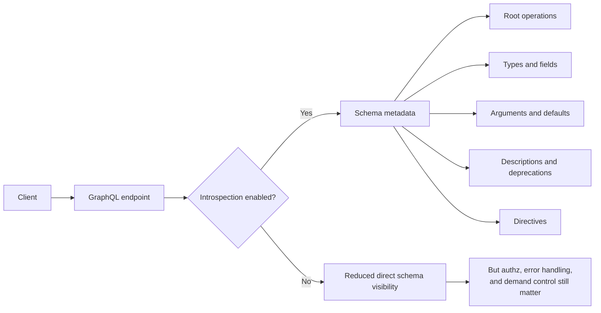
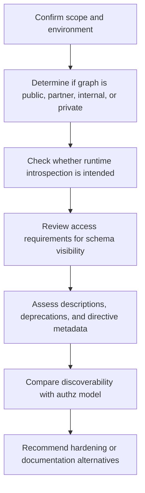
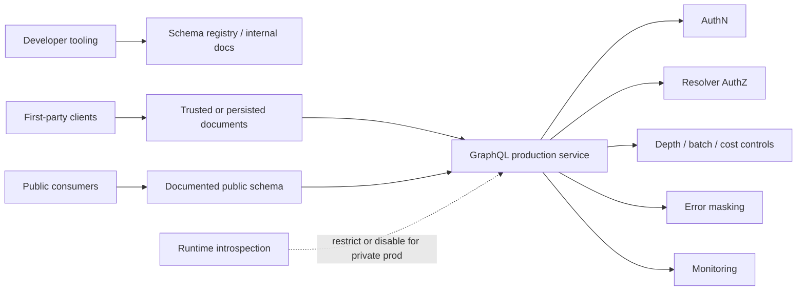

# GraphQL Introspection

> **Module:** API Pentesting → GraphQL Security  
> **Difficulty:** Beginner → Advanced  
> **Focus:** Understand how GraphQL introspection works, why it helps developers, when it creates defensive risk, and how to assess and harden it during **authorized** API security work.

---

## 1. Overview

**GraphQL introspection** is the built-in mechanism that lets a client ask a GraphQL server about its own schema.

In plain English, it means the API can describe:

- which root operations exist
- which types exist
- which fields each type exposes
- which arguments fields accept
- whether fields are deprecated
- which descriptions and directives are attached to the schema

That is not a vendor feature bolted on later. It is part of GraphQL itself.

A beginner-friendly way to think about it is:

> **REST docs are usually written next to the API. GraphQL docs can be generated by asking the API to describe itself.**

That is why GraphiQL, Apollo tooling, Postman, schema explorers, and code generation tools feel so convenient around GraphQL.

It is also why introspection matters in security reviews.

---

## 2. Why It Matters

Introspection is neither automatically “good” nor automatically “bad.”

It is a **discovery feature**.
Whether it becomes a security problem depends on:

- who can use it
- in which environment it is available
- what the schema reveals
- whether authorization is enforced independently of discoverability
- whether other controls exist around query execution and error handling

### Quick mental model

| Question | If the answer is “yes” | Security meaning |
| --- | --- | --- |
| Can unauthenticated users introspect the schema? | The graph is self-documenting to anyone who reaches it | Discovery risk increases |
| Do descriptions include internal notes? | The schema leaks implementation context | Information disclosure risk increases |
| Are admin or legacy operations visible? | Sensitive workflows become easier to find | Review priority increases |
| Is introspection disabled, but error suggestions remain verbose? | Schema discovery is still partially possible | Hardening is incomplete |
| Are resolver authz checks strong everywhere? | Discovery is less damaging | Exposure is reduced, not eliminated |

### Introspection has real defensive value too

| Legitimate use | Why teams want it |
| --- | --- |
| IDEs and API explorers | Powers autocomplete, docs, and field discovery |
| Client code generation | Produces typed clients and fragments |
| Schema governance | Helps compare versions and deprecations |
| Testing and QA | Lets approved teams validate schema shape quickly |
| Documentation | Generates up-to-date references directly from the graph |

So the right question is usually **not** “Should GraphQL have introspection?”

The better question is:

> **Who should be able to introspect which schema, in which environment, under which controls?**

---

## 3. What the GraphQL Specification Says

The official GraphQL specification defines an **introspection system** as part of the type system.

Three names matter immediately:

| Meta-field / type | What it does | Where it appears |
| --- | --- | --- |
| `__typename` | Returns the concrete runtime type name | On object, interface, and union selections |
| `__schema` | Exposes the schema as a structured object | On the root operation type |
| `__type(name: ...)` | Returns metadata about one named type | On the root operation type |

The specification also defines the core introspection types below.

| Introspection type | What it describes |
| --- | --- |
| `__Schema` | Root operation types, all known types, directives |
| `__Type` | A specific type, its kind, fields, interfaces, enum values, possible types |
| `__Field` | A field, its arguments, type, description, deprecation status |
| `__InputValue` | An argument or input field, including default values |
| `__EnumValue` | Enum entries and their deprecation metadata |
| `__Directive` | Directive names, arguments, locations, and descriptions |

### Why this matters for defenders

If introspection is available, a client can often learn much more than just “this is GraphQL.”
It can learn:

- the API's **root entry points**
- the **shape of business objects**
- the **required arguments** for operations
- the **deprecated but still present** functionality
- descriptions that may reveal internal workflow or business meaning

That makes introspection a form of **high-quality attack-surface documentation** when exposed too broadly.

---

## 4. Mental Model — What Introspection Exposes



A useful way to remember the exposure is:

```text
Introspection answers:
What exists? + How is it called? + What does it return? + What changed?
```

---

## 5. What Becomes Visible in Practice

When teams think about introspection exposure, they often focus only on field names.
That is too narrow.

A mature review should look at **all metadata classes** that may leak value.

| Schema element | What a reviewer learns | Why it matters |
| --- | --- | --- |
| Query / Mutation root fields | Available entry points | Reveals business capabilities |
| Field arguments | Required IDs, filters, enums, input objects | Shows how operations are driven |
| Type relationships | Object nesting and graph traversal | Helps map data dependencies |
| Deprecation markers | Old but still present features | Useful for legacy-risk review |
| Descriptions | Human explanations from developers | May leak internal language or workflow details |
| Directives | Cross-cutting behavior or custom semantics | Can reveal framework and policy design |
| Enum values | Allowed state transitions or roles | Helps map workflow logic |
| Default values | Assumptions and fallback behavior | Can expose risky implicit behavior |

### Example — benign schema metadata

A minimal, safe example of introspection output might reveal:

```json
{
  "data": {
    "__type": {
      "name": "Mutation",
      "fields": [
        {
          "name": "updateProfile",
          "isDeprecated": false,
          "args": [
            { "name": "input" }
          ]
        }
      ]
    }
  }
}
```

Even that small response is enough to tell a reviewer:

- a mutation root exists
- `updateProfile` is callable in some form
- it expects an `input` argument
- it is not currently marked deprecated

That is useful for authorized testing and useful for an attacker too.

---

## 6. Security Impact — What Defenders Should Actually Worry About

Introspection is usually an **information disclosure and attack-surface acceleration** issue, not a direct compromise by itself.

### 6.1 Faster schema discovery

A schema that would otherwise require documentation access, source code review, or repeated trial-and-error can become immediately visible.

### 6.2 Easier identification of sensitive workflows

Operation names such as these are not vulnerabilities by themselves:

- `adminUsers`
- `exportInvoices`
- `disableMfa`
- `rotateApiKey`
- `deleteOrganization`

But they tell a reviewer where the high-risk review effort should go.

### 6.3 Description leakage

Descriptions are one of the most overlooked problems.
Helpful internal notes can unintentionally reveal:

- trust assumptions
- legacy transition plans
- role names
- internal service behavior
- business scoring logic
- hidden operational warnings

### 6.4 Deprecated surface stays discoverable

A field marked deprecated may still be callable.
In practice, deprecated GraphQL functionality often maps to:

- migrations not fully retired
- legacy mobile clients
- old admin behavior
- compatibility shims

That makes deprecation metadata highly relevant during API inventory review.

### 6.5 Introspection disablement is not a complete control

The GraphQL security guidance from GraphQL.org explicitly notes that disabling introspection is a form of **security through obscurity**.
It may reduce discoverability, but it does **not** replace:

- authentication
- authorization
- error hygiene
- query depth and complexity controls
- batch and alias limits
- rate limiting
- monitoring

That is one of the most important ideas in this note.

> **If unauthorized users can still call sensitive resolvers, turning off introspection only hides the map — it does not lock the doors.**

---

## 7. Introspection vs. `__typename` vs. Error-Based Discovery

These are often mixed together, but they are not the same thing.

| Mechanism | Primary purpose | Typical security meaning |
| --- | --- | --- |
| `__typename` | Tells clients the runtime type of a selected object | Commonly legitimate and often needed by clients/caches |
| `__type` / `__schema` | Reveals schema metadata | Main introspection exposure decision point |
| Validation errors / suggestions | Helps developers correct invalid queries | Can leak schema clues even if introspection is off |

### Important nuance

Many production teams disable `__schema` and `__type` but still allow:

- verbose validation errors
- “Did you mean ...?” suggestions
- publicly reachable GraphiQL / Playground

In that case, the environment may still be too discoverable.

---

## 8. Safe, Authorized Assessment Workflow

This topic belongs squarely inside **authorized API testing**.
The goal is not to abuse a target. The goal is to understand whether schema discoverability matches the intended exposure model.

### Recommended review sequence



### Practical review questions

| Review question | Why it matters |
| --- | --- |
| Is introspection enabled in production, staging, both, or neither? | Environment intent matters |
| Is schema visibility anonymous, authenticated, or role-scoped? | Exposure should match trust level |
| Are schema descriptions sanitized for public consumption? | Descriptions often leak context |
| Are GraphiQL / Playground endpoints reachable? | Tooling exposure changes discoverability |
| Are deprecated fields still callable? | Legacy exposure may remain live |
| Do different roles see the same schema? | Role-specific schema filtering may matter |
| If introspection is off, do errors still leak field names? | Hardening may be partial |
| Is there a schema registry or static reference replacing runtime introspection? | Good alternative for private APIs |

### Low-risk validation examples

For an approved environment, a reviewer might perform a **minimal, non-destructive** check such as:

```graphql
query IntrospectionProbe {
  __typename
}
```

And if schema visibility is explicitly in scope, a tightly scoped metadata check such as:

```graphql
query QueryTypeReview {
  __type(name: "Query") {
    name
    fields {
      name
      isDeprecated
    }
  }
}
```

These examples are intentionally limited.
They are enough to confirm behavior without turning the note into an abuse playbook.

---

## 9. How To Judge the Finding

Whether exposed introspection is a serious issue depends on context.

### Exposure matrix

| Situation | Typical interpretation | Common report posture |
| --- | --- | --- |
| Public developer API with strong docs and expected self-discovery | Often acceptable if authz and demand controls are strong | Informational or low severity |
| Private production graph for first-party apps, introspection open to the internet | Usually unnecessary exposure | Low to medium, depending on what is revealed |
| Introspection reveals sensitive descriptions, admin workflows, or legacy operations | Information disclosure with attack-surface amplification | Medium or higher if exposure materially helps follow-on risk |
| Introspection disabled but GraphiQL and verbose errors remain exposed | Partial hardening only | Often low to medium |
| Role-sensitive schema visible equally to low-privilege users | May indicate privilege boundary weakness | Medium or higher depending on callable behavior |

### A good reporting mindset

Do not overstate the issue as “introspection = compromise.”

Report it as one of these, depending on evidence:

- **unnecessary schema disclosure**
- **overly broad production discoverability**
- **exposure of sensitive schema metadata**
- **incomplete hardening of GraphQL developer features**
- **role-inappropriate visibility of privileged operations**

That framing is usually more accurate and more useful to engineering teams.

---

## 10. Production Design Guidance

### 10.1 Decide by API audience

One of the clearest decisions is whether the graph is **public** or **private**.

| API type | Default posture that often makes sense |
| --- | --- |
| Public third-party API | Introspection may be acceptable if documentation, authz, and abuse controls are mature |
| Partner API | Usually prefer gated access and explicit docs over anonymous introspection |
| Private first-party API | Commonly disable runtime introspection in production and use internal schema tooling instead |
| Internal-only API | Restrict by network, identity, and environment, not by assumption alone |

This lines up with guidance from GraphQL.org and Apollo: private production APIs often do **not** need open runtime introspection once client operations are already known.

### 10.2 Use alternatives for private graphs

Instead of relying on production introspection, many teams do better with:

- schema registries
- checked-in SDL files
- generated static documentation
- CI schema diffing
- trusted or persisted documents for first-party clients

### 10.3 Treat descriptions as publishable text

If a field or type description would be embarrassing or risky in a public document, do not place it in schema descriptions that may surface through tooling or introspection.

### 10.4 Separate discoverability from authorization

A hardened design assumes:

- some users may learn operation names
- some clients may infer parts of the schema
- errors may still reveal clues

Therefore, **resolver-level authorization** must stand on its own.

### 10.5 Control demand as well as discovery

OWASP and GraphQL.org both emphasize that introspection hardening is only one part of GraphQL defense.
Also implement:

- pagination for list fields
- depth limits
- breadth / alias / batch limits
- query complexity or cost analysis where needed
- execution timeouts
- application-aware rate limits
- error-message reduction outside development

---

## 11. Recommended Defensive Architecture



This is the key production idea:

> **Private graphs should usually get their discoverability from controlled tooling, not from anonymous runtime schema exposure.**

---

## 12. Implementation Patterns

### Apollo Server example

A commonly cited pattern is to disable runtime introspection in production with environment-based configuration:

```js
const server = new ApolloServer({
  typeDefs,
  resolvers,
  introspection: process.env.NODE_ENV !== 'production'
});
```

That pattern is useful, but remember what it does **not** solve:

- weak resolver authorization
- verbose error messages
- overly permissive batching
- excessive query depth or cost

### Review checklist for framework configuration

| Control area | What to verify |
| --- | --- |
| Introspection | Enabled only where intentionally needed |
| GraphiQL / Playground | Not exposed broadly in production |
| Error formatting | Stack traces and detailed suggestions reduced outside dev |
| Demand control | Depth, breadth, batch, and timeout limits present |
| Auth integration | Resolver authz not delegated solely to obscurity |
| Documentation path | Internal teams have a safe replacement for runtime discovery |

---

## 13. Detection and Monitoring Ideas

Introspection attempts can also be useful telemetry.

| Signal | Why it helps |
| --- | --- |
| Requests containing `__schema` or `__type` | Direct indicator of schema discovery attempts |
| Access to GraphiQL / Playground routes | Shows developer-feature exposure |
| Large metadata responses | Can indicate schema enumeration or tooling use |
| Repeated validation errors with near-miss field names | Suggests schema inference attempts |
| Burst patterns from one identity or IP | Helps distinguish normal tooling from suspicious enumeration |

### Logging nuance

Be careful not to log sensitive tokens or entire request bodies indiscriminately.
Detection should improve security visibility without creating a new data-handling problem.

---

## 14. Common Misconceptions

| Misconception | Better answer |
| --- | --- |
| “Introspection is a vulnerability.” | Not by itself; it is a discovery feature whose risk depends on context and surrounding controls |
| “If I disable introspection, my graph is secure.” | No; authz and execution controls still matter most |
| “Public GraphQL APIs must always disable introspection.” | Not always; some public APIs intentionally support schema discovery |
| “`__typename` should always be blocked too.” | Usually no; many legitimate clients depend on it |
| “Only field names matter.” | Descriptions, directives, deprecations, enums, and defaults can be equally revealing |

---

## 15. Defensive Review Checklist

```text
[ ] Confirm whether runtime introspection is intended for this environment
[ ] Confirm whether anonymous users can reach schema metadata
[ ] Review GraphiQL / Playground exposure
[ ] Review whether descriptions contain internal-only information
[ ] Review deprecated fields and legacy operations still visible in the schema
[ ] Review whether schema visibility differs appropriately by role
[ ] Review whether verbose validation errors still leak schema clues
[ ] Review depth / batch / breadth / timeout / cost controls
[ ] Review whether resolver authz stands independently of discoverability
[ ] Recommend schema registry or static docs for private production graphs where appropriate
```

---

## 16. If You Remember Only One Thing

> **GraphQL introspection is best understood as discoverability control, not access control.**  
> Disabling it can reduce unnecessary exposure, especially for private production graphs, but real security still depends on resolver authorization, demand controls, safe error handling, and clear environment-specific design.

---

## 17. References and Further Reading

Public sources used for this note:

1. **GraphQL.org — Learn: Introspection**
   - Explains `__typename`, `__schema`, `__type`, and the role of introspection in tooling.
2. **GraphQL.org — Learn: Security**
   - Emphasizes that disabling introspection can reduce discoverability but is not sufficient on its own.
3. **GraphQL Specification (October 2021), Section 4: Introspection**
   - Defines the introspection system and the `__Schema`, `__Type`, `__Field`, `__InputValue`, `__EnumValue`, and `__Directive` types.
4. **OWASP GraphQL Cheat Sheet**
   - Recommends restricting introspection and GraphiQL in production/public environments and pairing that with broader GraphQL controls.
5. **Apollo Blog — Why You Should Disable GraphQL Introspection in Production**
   - Useful perspective on why many private production graphs disable runtime introspection and use schema registries instead.
