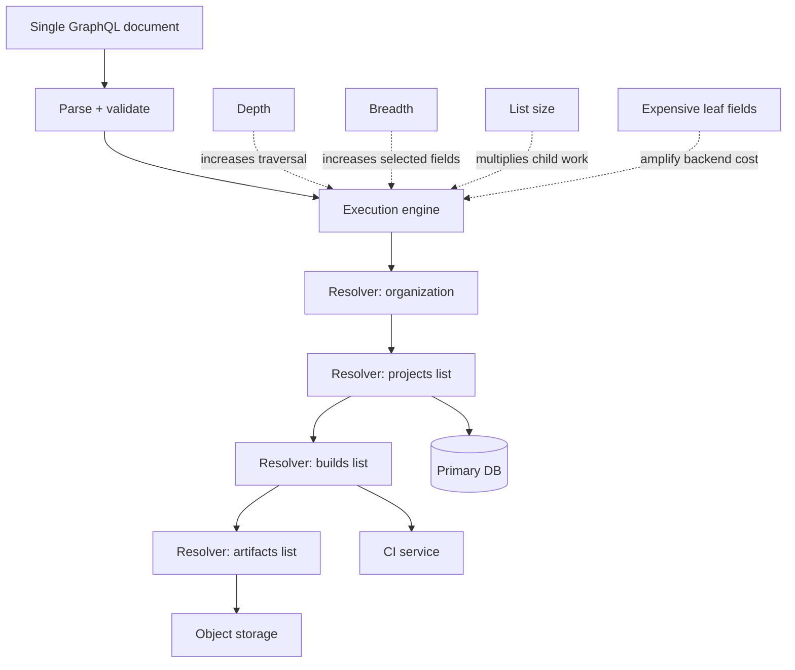
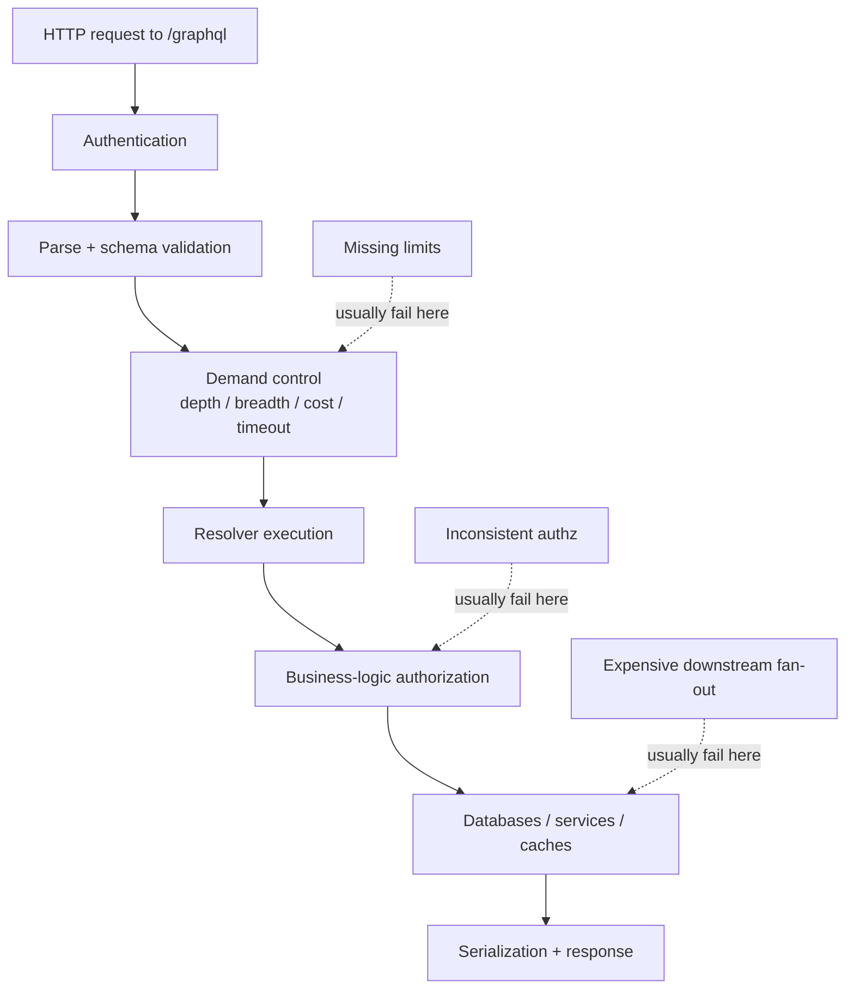
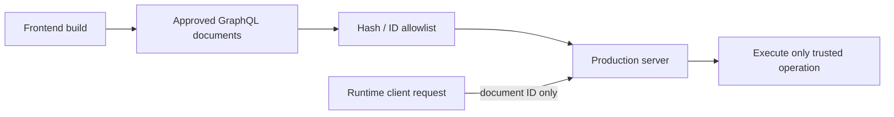
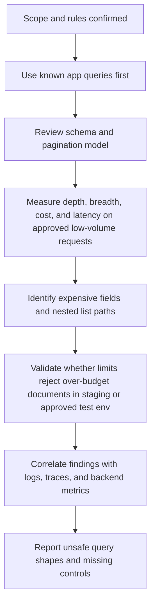

# GraphQL Query Abuse

> **Module:** API Pentesting → GraphQL Security  
> **Difficulty:** Beginner → Advanced  
> **Focus:** Understand how legitimate GraphQL query flexibility can be abused to amplify data access, backend work, and operational cost — and how to assess and harden it safely during **authorized** API security work.

---

## 1. Overview

**GraphQL query abuse** is the misuse of otherwise valid GraphQL operations to make the server do **far more work** or return **far more data** than the application team expected.

That is what makes it different from classic injection:

- the syntax can be perfectly valid
- the request may look like a normal GraphQL document
- the server may return `200 OK`
- the damage often comes from **shape, size, depth, fan-out, and resolver cost**, not from broken parsing

A beginner-friendly way to remember it is:

> **REST abuse often means hitting too many endpoints. GraphQL query abuse often means making one endpoint do too much.**

This matters because a single GraphQL document can:

- walk many object relationships in one request
- trigger many resolver calls under the surface
- pull large lists through nested connections
- reach expensive fields such as search, reporting, or cross-service joins
- expose authorization drift through nested traversal
- inflate infrastructure cost even when outright denial of service never happens

So the main defensive question is not just:

> “Is `/graphql` reachable?”

It is:

> **“Can one approved-looking query create disproportionate load, scope, or data access?”**

---

## 2. Why It Matters

GraphQL was designed to let clients ask for exactly the data they need. That is a strength, but it also changes the abuse model.

### 2.1 What changes compared to fixed-response APIs

| Topic | Traditional fixed-response API | GraphQL API | Security consequence |
| --- | --- | --- | --- |
| Response shape | Server largely decides | Client chooses fields | Data minimization becomes harder to guarantee |
| Traversal | Usually one resource path at a time | One query can cross many relationships | Object-graph fan-out becomes a risk factor |
| Query size | Often constrained by endpoint design | Structure is highly flexible | Depth, breadth, and list bounds matter more |
| Cost visibility | Endpoint cost is easier to estimate | Cost depends on the document shape | Per-request counting alone is weak |
| Authorization surface | Usually route/controller-centric | Often field/resolver-centric | Nested fields may bypass expectations |

### 2.2 Query abuse is not only a DoS problem

When teams hear “malicious query,” they often think only about availability. That is too narrow.

| Abuse outcome | What it can look like |
| --- | --- |
| **Availability impact** | Slow requests, resolver pileups, DB saturation, queue backlogs |
| **Operational cost impact** | Extra compute, cache churn, search load, third-party API spend |
| **Data overreach** | Oversized nested responses, cross-object traversal, excessive field selection |
| **Authorization drift** | A low-risk root field leads to sensitive child data deeper in the graph |
| **Monitoring blind spots** | HTTP request counts look normal while backend work explodes |

OWASP API4:2023 frames this broader issue as **unrestricted resource consumption**, and GraphQL is one of the clearest places where that risk appears.

---

## 3. What Public Guidance Says

Several public sources converge on the same message: **GraphQL needs demand control, not just syntax validation.**

### 3.1 Core guidance themes

| Source | Defensive takeaway |
| --- | --- |
| **GraphQL.org Security** | Use demand control: trusted documents, pagination, depth limits, breadth/batch limits, rate limiting, and complexity analysis |
| **GraphQL.org Authorization** | Keep authorization in the business-logic layer, not scattered inconsistently across resolvers |
| **OWASP GraphQL Cheat Sheet** | Add input validation, pagination, depth/amount limits, timeouts, cost controls, and safe defaults |
| **OWASP API4:2023** | Limit per-request operations, records per page, execution time, and resource use |
| **PortSwigger GraphQL guidance** | Discovery features help attackers build queries faster, so exposure and error hygiene matter too |
| **GitHub GraphQL operational limits** | Real-world public APIs often enforce point budgets, node limits, and required pagination |

### 3.2 The important architectural lesson

The GraphQL Foundation guidance is especially useful because it treats this as a **layered** problem:

1. **Transport protections** still matter.
2. **Schema design** must bound list growth and field reach.
3. **Execution controls** must estimate or cap query cost.
4. **Authorization** must be enforced where business decisions happen.
5. **Observability** must reflect GraphQL work, not just raw HTTP count.

If you remember one public-guidance sentence from this note, remember this:

> **A valid GraphQL document can still be an abusive request.**

---

## 4. Mental Model — Why One Query Can Do Too Much

A GraphQL server does not execute a query as one monolithic action. It executes a **tree** of field resolutions.

That means the real cost of a query is often closer to:

```text
total work ≈ field breadth × nesting depth × list cardinality × per-field resolver cost
```

Even when each individual resolver is correct, the combined execution shape can still be unsafe.

### 4.1 Visualizing amplification



### 4.2 Why pagination arguments matter so much

A query that asks for:

- 20 projects
- each with 20 builds
- each with 20 artifacts

is not just “depth 3.”

It may imply work across **8,000 child objects**, before you even count additional metadata fields, downstream service calls, authorization checks, logging, caching, and serialization.

### 4.3 The “looks normal” problem

This is why query abuse is tricky operationally:

- the request may fit in one HTTP packet
- it may pass schema validation
- it may use documented fields only
- it may not trigger classic WAF signatures
- it may not exceed a simple “requests per minute” limit

The backend still pays the full cost.

---

## 5. Where Query Abuse Comes From

Query abuse usually appears when **flexibility exceeds guardrails**.

### 5.1 Common root causes

| Root cause | What it means in practice | Why it becomes risky |
| --- | --- | --- |
| **Unbounded list fields** | `users`, `orders`, `events`, or `searchResults` can return too much data | Cardinality multiplies everything below them |
| **Deep relationship chains** | Parent → child → sibling → related object traversal | Encourages runaway resolver trees |
| **Resolver cost asymmetry** | Some fields are cheap, others trigger reports/search/external calls | Shallow queries can still be expensive |
| **Missing field-level authz** | Root object is allowed, child field is too broad | Abuse becomes a data access problem |
| **Naive rate limiting** | Limit is based only on HTTP request count | One document can still contain huge work |
| **Verbose discovery features** | Introspection or rich errors expose the shape of the graph | Abusive documents are easier to construct |
| **No operation allowlist for first-party apps** | Any ad-hoc query is accepted in production | Clients can send shapes the team never reviewed |

### 5.2 Query abuse often starts in “good” features

The same features that make GraphQL pleasant for developers can create risk if left unbounded:

| Legitimate feature | Defensive risk when uncontrolled |
| --- | --- |
| Field selection | Over-fetching sensitive fields or metadata |
| Nested relationships | Exponential fan-out through the object graph |
| Flexible list arguments | Large pages and expensive child resolution |
| Fragments | Complex documents become hard to reason about manually |
| Schema discoverability | Attackers can iterate toward high-cost paths faster |
| Developer tooling | Playground/IDE exposure lowers experimentation cost |

---

## 6. Common Forms of GraphQL Query Abuse

This section focuses on the main abuse patterns defenders should recognize.

### 6.1 Deep nesting and cyclical traversal

The classic example is a graph where object relationships can bounce back and forth:

- user → projects
- project → members
- member → projects

That does **not** mean the schema is wrong. It means the graph has the potential for **repeated traversal** if no depth or cost control exists.

### 6.2 Wide selection sets

A query can be shallow but still expensive if it asks for many sibling fields, especially when those fields map to separate services or expensive resolvers.

Examples of commonly expensive field families include:

- analytics summaries
- permissions matrices
- audit/event histories
- large markdown or HTML renderings
- object counts or aggregation fields
- cross-service enrichment fields

### 6.3 Unbounded or oversized list requests

GraphQL.org and OWASP both emphasize pagination because list fields are where cost often explodes.

Common warning signs:

- list fields with no required pagination arguments
- `first` / `last` values with no upper bound
- nested list-of-list patterns
- offset-style pagination on very large collections
- fields that return “all” records for convenience

### 6.4 Expensive leaf fields hidden inside legitimate objects

Some fields are dangerous not because they are deeply nested, but because they trigger expensive backend behavior.

Examples:

- full-text search fields
- export preparation fields
- report-generation status fields backed by large joins
- fields that call billing, scoring, or fraud services
- fields that dereference many external objects

### 6.5 Authorization drift through nested paths

A query abuse issue can become an access-control issue when the graph allows a user to start from an allowed object and then walk into fields the product team never intended for that audience.

This is why GraphQL.org recommends keeping authorization in a consistent business-logic layer rather than scattering logic ad hoc in individual resolvers.

### 6.6 Query abuse via “normal looking” client behavior

Not all abuse is obviously malicious. A broken mobile build, over-eager dashboard widget, or AI-generated client integration can unintentionally create abusive queries too.

From a blue-team perspective, the problem is still the same:

> **The graph accepted a document whose cost was out of proportion to its value.**

---

## 7. Query Abuse vs. Nearby GraphQL Security Topics

This note sits next to several related topics in the GraphQL security path. The distinctions matter.

| Topic | Main question | How it differs from query abuse |
| --- | --- | --- |
| **GraphQL introspection** | Can users discover the schema too easily? | Query abuse is about what a document does once accepted |
| **GraphQL authorization** | Can the caller access this field/object/action? | Query abuse may still occur even when authn/authz is otherwise correct |
| **Batching and alias abuse** | Can many operations or repeated fields be packed into one request? | Adjacent pattern; this note focuses more on a single document’s structure and cost |
| **GraphQL injection** | Can user input break backend interpreters or parsers? | Query abuse often uses perfectly valid values and syntax |
| **GraphQL denial of service** | Can the graph be made unavailable? | DoS is one possible outcome; query abuse also causes cost and data exposure problems |

A practical rule:

> **Query abuse is the broad category. DoS is one outcome. Batching/alias abuse is one technique family.**

---

## 8. Safe Example Schema and Harmless Demonstrations

The examples below are intentionally **small and non-destructive**. They are for architecture understanding, not attack execution.

### 8.1 Example schema

```graphql
type Query {
  organization(id: ID!): Organization
}

type Organization {
  id: ID!
  name: String!
  projects(first: Int!): ProjectConnection!
}

type ProjectConnection {
  nodes: [Project!]!
  pageInfo: PageInfo!
}

type Project {
  id: ID!
  name: String!
  builds(first: Int!): BuildConnection!
  members(first: Int!): UserConnection!
}

type BuildConnection {
  nodes: [Build!]!
}

type Build {
  id: ID!
  status: String!
  artifacts(first: Int!): ArtifactConnection!
}

type ArtifactConnection {
  nodes: [Artifact!]!
}

type Artifact {
  id: ID!
  filename: String!
}

type UserConnection {
  nodes: [User!]!
}

type User {
  id: ID!
}

type PageInfo {
  hasNextPage: Boolean!
  endCursor: String
}
```

### 8.2 A reasonable client query

```graphql
query OrgDashboard {
  organization(id: "org_demo") {
    id
    name
    projects(first: 5) {
      nodes {
        id
        name
      }
    }
  }
}
```

This is the kind of request a product team can reason about easily.

### 8.3 A structurally riskier query shape

```graphql
query OrgDashboardExpanded {
  organization(id: "org_demo") {
    projects(first: 5) {
      nodes {
        id
        name
        builds(first: 5) {
          nodes {
            id
            status
            artifacts(first: 5) {
              nodes {
                id
                filename
              }
            }
          }
        }
        members(first: 5) {
          nodes {
            id
          }
        }
      }
    }
  }
}
```

Nothing above is syntactically suspicious. Yet even with very small page sizes, the graph now has to:

- resolve multiple nested lists
- hydrate multiple object types
- potentially perform many auth checks
- serialize a much larger response
- possibly reach several different backends

That is the heart of query abuse: **legitimate syntax, disproportionate work**.

### 8.4 How defenders should read such a query

| Question | Why it matters |
| --- | --- |
| Are all list fields paginated and capped? | Prevents cardinality explosion |
| Are nested lists allowed to chain freely? | Deep list nesting multiplies cost quickly |
| Are all child fields authorized independently where needed? | Allowed parents do not imply allowed descendants |
| Do these fields hit the same datastore or different services? | Cross-service joins raise cost and failure complexity |
| Is there a request budget or complexity score? | Request count alone will miss this |

---

## 9. Abuse Dimensions Defenders Should Evaluate

A mature review should not ask only “how deep is the query?” It should score several dimensions.

### 9.1 Demand dimensions

| Dimension | What to measure | Typical concern |
| --- | --- | --- |
| **Depth** | How many layers of nested selections exist? | Repeated traversal and recursive fan-out |
| **Breadth** | How many fields, sibling selections, or connection branches are requested? | Wide resolver work even in shallow queries |
| **Cardinality** | How many items can each list return? | Multiplication of child work |
| **List depth** | How many list-returning fields can nest inside one another? | Explosive growth patterns |
| **Resolver weight** | Which fields are unusually slow or expensive? | Shallow-but-costly queries |
| **Response size** | How much data can one query serialize? | Memory pressure and client/API inefficiency |
| **Auth complexity** | How many field/object policy decisions fire per request? | Slow or inconsistent authorization paths |

### 9.2 Field classes that deserve special scrutiny

| Field class | Why it deserves attention |
| --- | --- |
| `search`, `lookup`, `report`, `analytics`, `export` | Often hides costly joins or index work |
| `count`, `summary`, `aggregate` | Looks small in output, large in backend effort |
| Rich nested connections | Can multiply quickly under depth |
| Cross-tenant or cross-org references | Higher data exposure risk if scoping fails |
| “Convenience” fields for dashboards | Often query many child objects in one go |
| HTML/markdown rendering or transform fields | CPU-heavy and easy to underestimate |

---

## 10. Where Query Abuse Hides in Architecture

Teams often protect the GraphQL endpoint at the edge but leave the expensive decisions deeper in execution.

### 10.1 Request lifecycle with abuse checkpoints



### 10.2 Why middleware-only protection is not enough

A gateway can validate a token and still completely miss query abuse if it cannot answer questions like:

- Is this field unusually expensive?
- How many nodes could this document expand into?
- Are these nested connections acceptable for this caller?
- Does this operation match a trusted, reviewed document?
- Is the caller consuming budget too quickly for their role or plan?

That is why business-layer demand control matters.

---

## 11. Detection and Observability

If defenders log only the raw request path `/graphql`, they will miss most of the useful signal.

### 11.1 What to log for GraphQL query abuse detection

| Field | Why it matters |
| --- | --- |
| `operationName` | Lets you distinguish normal app operations from ad-hoc documents |
| Authenticated principal / API key / tenant | Required for per-user budgeting and scoping analysis |
| Query hash / document ID | Useful for persisted/trusted document tracking |
| Estimated complexity or cost score | Direct signal for expensive requests |
| Depth and list-depth counts | Helps baseline safe vs risky documents |
| Top-level field count / breadth | Catches wide queries |
| Node estimate or returned node count | Useful for pagination enforcement |
| Resolver timing by field | Identifies hotspots and hidden expensive leaves |
| Response size | Large payloads often correlate with abuse and over-fetching |
| Error count and error paths | Helps spot masked authz drift or failing expensive fields |

### 11.2 Operational signals worth alerting on

| Signal | Why it is suspicious |
| --- | --- |
| Anonymous or ad-hoc operations with high complexity | Suggests unreviewed query shapes |
| Sudden increase in depth or breadth for one identity | Often indicates experimentation or runaway client behavior |
| Large responses paired with `200 OK` | GraphQL can “succeed” while still causing harm |
| Same identity hitting many expensive root fields quickly | Better indicator than request count alone |
| High p95/p99 latency for one document hash | Points to specific query shapes worth controlling |
| Repeated partial responses on expensive paths | Can indicate authz drift or unstable downstream services |

### 11.3 Example log shape

```json
{
  "path": "/graphql",
  "operationName": "OrgDashboardExpanded",
  "principal": "user_123",
  "tenant": "org_demo",
  "queryHash": "sha256:8b...",
  "depth": 5,
  "listDepth": 3,
  "breadth": 11,
  "estimatedCost": 185,
  "returnedNodes": 84,
  "responseBytes": 18240,
  "durationMs": 742,
  "status": 200
}
```

The key point is not the exact field names. The key point is that your telemetry should describe the **document**, not just the endpoint.

---

## 12. Hardening and Prevention

There is no single fix. Strong GraphQL hardening uses several controls together.

### 12.1 Schema design controls

GraphQL.org’s security and pagination guidance starts with one of the most important controls: **paginate list fields**.

| Control | Why it helps |
| --- | --- |
| **Require pagination on large list fields** | Prevents “return everything” behavior |
| **Use bounded `first` / `last` values** | Caps list growth per field |
| **Prefer cursor-based pagination** | More stable and easier to reason about than huge offsets |
| **Avoid deeply nested list-of-list designs where possible** | Reduces multiplicative traversal |
| **Separate expensive fields from common dashboard fields** | Makes cost easier to govern |
| **Minimize default field sets in convenience objects** | Reduces accidental over-fetching |

#### Safe schema pattern example

```graphql
scalar PaginationAmount

type Query {
  projects(first: PaginationAmount!, after: String): ProjectConnection!
}
```

The point is not the exact scalar name. The point is that the schema itself should communicate and enforce safe limits.

### 12.2 Execution controls

| Control | Defensive purpose |
| --- | --- |
| **Depth limiting** | Stops overly recursive traversal |
| **List-depth limiting** | Specifically constrains nested list multiplication |
| **Breadth limiting** | Caps top-level fields and selected field counts |
| **Complexity analysis** | Estimates cost using weights, not just depth |
| **Timeouts** | Limits how long one request can consume resources |
| **Concurrency caps** | Prevents one operation from exploding downstream parallelism |
| **Response size limits** | Prevents large serialization and transfer costs |
| **Per-user or per-token budgets** | Makes repeated expensive requests visible and enforceable |

### 12.3 Trusted documents for first-party clients

GraphQL.org recommends **trusted documents** for first-party applications.

That means:

1. approved operations are generated during development
2. the server stores hashes or IDs for those operations
3. production clients send the approved ID instead of arbitrary query text
4. the server rejects unknown documents

This is one of the strongest controls for private or first-party graphs because it removes most ad-hoc query abuse entirely.



**Important limitation:** GraphQL.org also notes that trusted documents are usually not suitable for truly public APIs where third parties need freedom to compose queries.

### 12.4 Authorization and data-minimization controls

GraphQL query abuse often overlaps with “too much data through a valid path.” That means authorization and data shaping still matter.

| Control | Why it matters |
| --- | --- |
| **Centralize authorization in business logic** | Reduces inconsistent nested-field behavior |
| **Apply field- and object-level policy consistently** | Parent access should not imply child sensitivity is safe |
| **Return only the fields the caller is entitled to see** | Prevents query flexibility from becoming data overreach |
| **Mask execution errors** | Stops error responses from teaching callers about costly or hidden fields |
| **Separate internal/admin fields from public graphs where possible** | Reduces blast radius if query controls fail |

### 12.5 Real-world operational example: budget the graph

GitHub’s public GraphQL API is a useful defender case study because it enforces multiple layers of demand control:

- point-based rate limits
- node limits
- required `first` / `last` values on connections
- upper bounds on those values

Even if your implementation details differ, the lesson is portable:

> **Budget GraphQL by work, not by path count alone.**

---

## 13. Defensive Review Questions for Authorized Testing

During an authorized assessment, these questions are often more useful than raw payload creativity.

### 13.1 Schema and execution questions

| Question | What a “good” answer sounds like |
| --- | --- |
| Are all large list fields paginated? | “Yes, and `first` / `last` are bounded.” |
| Are any fields known to be unusually expensive? | “Yes, they are cost-weighted and monitored.” |
| Is complexity analysis enforced before resolver execution? | “Yes, high-cost documents are rejected early.” |
| Are first-party clients restricted to trusted documents? | “Yes, production accepts only approved operations.” |
| Are root and child field authz checks centralized? | “Yes, policy lives in the business layer.” |
| Are query metrics visible in logs and dashboards? | “Yes, we track depth, cost, latency, and response size.” |

### 13.2 Product and architecture questions

| Question | Why it matters |
| --- | --- |
| Which fields trigger cross-service requests or heavy joins? | Those fields often dominate real cost |
| Which dashboard or search features are performance-sensitive? | User-visible features often drive abuse patterns |
| Which operations are allowed for third-party clients? | Public exposure changes the control strategy |
| Are there legacy mobile clients that rely on broad queries? | Legacy compatibility often weakens demand control |
| Can one authenticated user traverse data across tenants or organizations through nested fields? | Cost and data exposure can combine |

---

## 14. Safe Authorized Validation Workflow

The goal here is **evidence without disruption**.

### 14.1 Recommended workflow



### 14.2 Good testing habits

- Prefer **staging or test environments** for limit validation.
- Start from **real client documents** rather than inventing arbitrary large ones.
- Increase complexity only within the rules of engagement and only enough to confirm control behavior.
- Capture **telemetry evidence** such as latency, complexity scores, and server-side rejection messages.
- Stop when you have proof of a missing safeguard; do not turn validation into load generation.

### 14.3 What not to do

Because this note is intentionally defensive, avoid turning “query abuse testing” into:

- production stress testing without explicit authorization
- brute-force experimentation against unknown graphs
- repeated large-document submission to prove a point the first rejection already proved
- business-impactful validation where a lower-risk staging check would answer the question

---

## 15. Reporting Guidance

When writing findings, frame them in terms of **disproportionate work**, **unsafe data reach**, and **missing demand control**.

### 15.1 Example finding language

- **“The GraphQL API accepts deeply nested and high-cardinality queries without effective demand-control safeguards.”**
- **“Several list-returning fields do not enforce practical page bounds, allowing one request to expand into excessive backend work.”**
- **“Resolver cost appears highly asymmetric, but the API applies request-count rate limits rather than query-cost budgeting.”**
- **“Nested field traversal exposes data and computation beyond what the product workflow appears to require for this user role.”**
- **“The production graph accepts ad-hoc documents where a trusted-document model would materially reduce query-abuse risk for first-party clients.”**

### 15.2 Evidence that strengthens a report

| Evidence type | Why it helps |
| --- | --- |
| Query shape diagram | Explains fan-out clearly to non-specialists |
| Measured latency increase | Shows real cost without needing destructive volume |
| Field-level timing or trace data | Proves which resolvers dominate work |
| Missing pagination or high bounds | Demonstrates design weakness directly |
| Lack of complexity rejection | Shows a control gap, not just a theoretical risk |
| Missing operation logging | Supports observability findings |

---

## 16. Hardening Checklist

Use this as a concise defensive review list.

### Schema and API design

- [ ] Large list fields require pagination
- [ ] `first` / `last` or equivalent arguments have hard upper bounds
- [ ] Nested list-of-list patterns are minimized or specially governed
- [ ] Expensive fields are clearly identified and justified
- [ ] Internal/admin-only fields are segregated where possible

### Execution safeguards

- [ ] Depth limits are enforced
- [ ] List-depth or nested-connection limits are enforced
- [ ] Breadth / selected-field limits are enforced where appropriate
- [ ] Query complexity analysis or equivalent budget control exists
- [ ] Request and resolver timeouts are configured
- [ ] Response-size or node-count controls exist

### Authorization and safe defaults

- [ ] Authorization decisions live in the business-logic layer
- [ ] Sensitive nested fields do not inherit access implicitly from parent objects
- [ ] Error responses are masked appropriately in production
- [ ] Discovery features are exposure-appropriate for the environment

### Operations and monitoring

- [ ] Operation names or trusted-document IDs are logged
- [ ] Complexity, depth, size, and latency are observable
- [ ] High-cost operations are rate-limited or budgeted per identity
- [ ] Alerts exist for unusual query cost or response size spikes
- [ ] First-party clients use trusted documents if feasible

---

## 17. Key Takeaways

- GraphQL query abuse is usually about **valid documents doing disproportionate work**, not broken syntax.
- Depth alone is not enough; defenders must think about **breadth, cardinality, list depth, and resolver weight** too.
- Query abuse can cause **DoS, cost spikes, excessive data access, and authorization drift**.
- Strong defenses combine **schema design, execution guardrails, business-layer authorization, and observability**.
- Public guidance from GraphQL.org, OWASP, PortSwigger, Apollo, and GitHub all points toward the same principle:

> **Treat GraphQL demand as a budgeted resource, not a free-form text input that merely needs parsing.**

---

## 18. 📚 Sources and Further Reading

This note was informed by the following public sources:

1. **GraphQL Foundation — Security**  
   https://graphql.org/learn/security/
2. **GraphQL Foundation — Authorization**  
   https://graphql.org/learn/authorization/
3. **GraphQL Foundation — Pagination**  
   https://graphql.org/learn/pagination/
4. **OWASP GraphQL Cheat Sheet**  
   https://cheatsheetseries.owasp.org/cheatsheets/GraphQL_Cheat_Sheet.html
5. **OWASP API Security Top 10 2023 — API4: Unrestricted Resource Consumption**  
   https://raw.githubusercontent.com/OWASP/API-Security/refs/heads/master/editions/2023/en/0xa4-unrestricted-resource-consumption.md
6. **PortSwigger Web Security Academy — GraphQL**  
   https://portswigger.net/web-security/graphql
7. **Apollo Blog — Securing Your GraphQL API from Malicious Queries**  
   https://www.apollographql.com/blog/securing-your-graphql-api-from-malicious-queries/
8. **GitHub Docs — Rate limits and query limits for the GraphQL API**  
   https://docs.github.com/en/graphql/overview/rate-limits-and-query-limits-for-the-graphql-api

---

## One Last Thing To Remember

A GraphQL endpoint can look quiet at the network layer and still be dangerously noisy in the application layer.

If you are reviewing GraphQL query abuse, do not stop at:

- “the request was valid”
- “the response was `200 OK`”
- “the API only has one endpoint”

Ask instead:

- **How much work did this document cause?**
- **How much data could it traverse?**
- **Which business rules did it force the server to evaluate?**
- **Which control should have stopped it earlier?**

That is the mindset that turns GraphQL query abuse from a vague performance concern into a precise security review topic.
