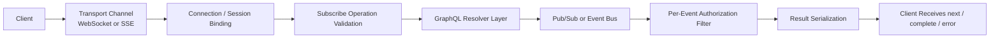
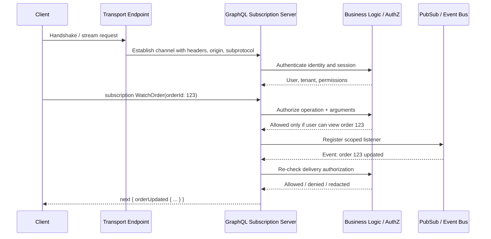
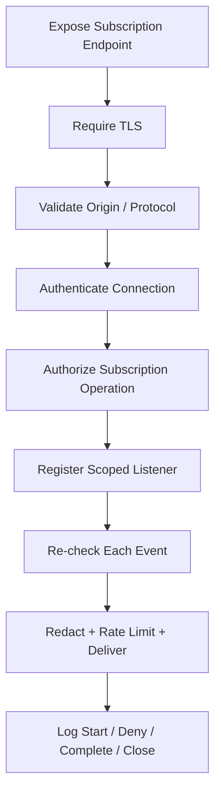

# GraphQL Subscription Security

> **Module:** API Pentesting → GraphQL Security  
> **Difficulty:** Intermediate → Advanced  
> **Tags:** `#graphql` `#subscriptions` `#websocket` `#sse` `#graphql-ws` `#authorization` `#real-time` `#api-security`

GraphQL subscriptions add a **real-time, long-lived, stateful channel** to an API that many teams otherwise think of as simple request/response. That changes the security model immediately: instead of authorizing one HTTP request and returning one JSON response, the server may authenticate a client once, keep context in memory for minutes or hours, subscribe that client to an event stream, and repeatedly push data as backend events occur.

That is why subscription security is not just “GraphQL security plus WebSockets.” It is really:

- **GraphQL operation security**
- **transport security** (`WebSocket` or `SSE`)
- **session and token lifecycle security**
- **pub/sub and event-routing security**
- **per-event authorization and data minimization**
- **resource control and observability**

> **Authorization required:** Subscription testing touches long-lived channels, authenticated sessions, and live events. Only validate subscription behavior against systems explicitly in scope and under approved rules of engagement.

---

## Table of Contents

1. [Why Subscription Security Matters](#why-subscription-security-matters)
2. [What a GraphQL Subscription Actually Is](#what-a-graphql-subscription-actually-is)
3. [Architecture and Trust Boundaries](#architecture-and-trust-boundaries)
4. [Transport and Protocol Choices](#transport-and-protocol-choices)
5. [Where Authorization Must Happen](#where-authorization-must-happen)
6. [Common Failure Patterns](#common-failure-patterns)
7. [Defensive Review Workflow](#defensive-review-workflow)
8. [Detection and Hardening Priorities](#detection-and-hardening-priorities)
9. [Checklist](#checklist)
10. [References and Public Research](#references-and-public-research)

---

## Why Subscription Security Matters

Queries and mutations are usually **short-lived**. A client sends a request, the server executes resolvers, and the response is returned.

Subscriptions are different:

- the connection may stay open for a long time
- identity and authorization state may become **stale**
- events may be broadcast from a **shared pub/sub backend**
- many clients may share the same transport endpoint and event bus
- security logs often capture the **start of the stream**, but not every decision made during delivery

A useful way to remember it:

> **Secure subscriptions are not “authenticate once, stream forever.”**  
> They are **authenticate the channel, authorize the subscription, and re-check each emitted event**.

### Why they are easy to get wrong

| Dimension | Query / Mutation | Subscription |
|---|---|---|
| **Lifetime** | Short | Long-lived |
| **Transport** | Usually HTTP | Often WebSocket, sometimes SSE |
| **Auth freshness** | Re-evaluated every request | May be bound at connect time and never refreshed |
| **Data path** | Resolver returns one response | Resolver may attach to a stream and emit many results |
| **Logging** | Often one log line per request | Often only handshake / start / stop is visible |
| **Blast radius** | One response | Repeated leakage over time |
| **Scaling model** | Stateless-friendly | State, fan-out, and backpressure matter |

This is why GraphQL subscriptions often inherit:

- **GraphQL risks**: field-level authorization mistakes, error leakage, operation cost problems
- **WebSocket/SSE risks**: origin handling, token placement, reconnect logic, state exhaustion
- **event-driven risks**: over-broadcasting, tenant mix-ups, stale entitlements, weak filtering

---

## What a GraphQL Subscription Actually Is

The GraphQL specification defines **subscription operations** as a distinct operation type. They are commonly used to receive incremental updates such as chat messages, order status changes, notifications, dashboards, or collaborative edits.

A simple schema example:

```graphql
type Subscription {
  orderUpdated(orderId: ID!): OrderUpdate!
}

type OrderUpdate {
  id: ID!
  status: String!
  updatedAt: String!
}
```

A client operation might look like this:

```graphql
subscription WatchOrder($orderId: ID!) {
  orderUpdated(orderId: $orderId) {
    id
    status
    updatedAt
  }
}
```

### Important spec detail

Per the GraphQL specification and graphql.org subscription guidance:

- a subscription operation is a real GraphQL operation, not a special side channel
- a document can contain multiple named operations
- **each subscription operation must have exactly one root field**
- the GraphQL spec does **not** mandate a transport protocol

That last point matters a lot. GraphQL over HTTP is increasingly standardized for queries and mutations, but subscriptions are still typically implemented through **community protocols** on top of **WebSockets** or **Server-Sent Events (SSE)**. In practice, many organizations bolt a separate real-time layer onto an otherwise HTTP-focused GraphQL deployment.

### The mental model

A subscription is usually not “run resolver once and keep the socket open.” It is closer to:

1. authenticate a connection
2. accept a subscription operation
3. bind that operation to a backend event source
4. filter or map events into GraphQL results
5. repeatedly send `next` messages until completion or disconnect



If any one of those stages is weak, the subscription can leak data even when the GraphQL schema itself looks fine.

---

## Architecture and Trust Boundaries

The safest way to reason about subscription security is to map it as **five linked trust boundaries**.

| Layer | What lives here | Key security question |
|---|---|---|
| **Transport** | WebSocket handshake or SSE response stream | Who is allowed to open and maintain the channel? |
| **Connection context** | token, cookie, session, connection params, origin, subprotocol | Which identity is bound to the stream? |
| **Operation layer** | GraphQL document, variables, field selection | Is this subscription operation allowed at all? |
| **Event layer** | pub/sub topic, broker message, backend event | Which events are eligible for this subscriber? |
| **Delivery layer** | serialized payload returned to client | Does each emitted payload still match current authorization? |

A secure design forces **all five layers** to agree on the same identity and scope.

### A common real-world failure

Many systems do this:

- authenticate at socket open
- accept a broad subscription like `orderUpdated`
- publish all order events to a shared topic
- rely on the client to ignore events it should not see

That is not authorization. That is **hope**.

A safer design is:

- validate the transport and origin
- bind the authenticated user and tenant to connection state
- authorize the subscription arguments before registering it
- subscribe only to a scoped topic or apply strict server-side filtering
- re-check access before each payload is delivered

### End-to-end security flow



The most important line in that diagram is not the handshake. It is:

> **Re-check delivery authorization**

That is where mature systems separate themselves from brittle ones.

---

## Transport and Protocol Choices

GraphQL subscriptions are usually carried over either **WebSockets** or **Server-Sent Events (SSE)**.

| Transport | Common protocol / convention | Why teams use it | Main security focus |
|---|---|---|---|
| **WebSocket** | `graphql-transport-ws` (modern), older legacy protocols in some deployments | Full-duplex, multiplexing, widely supported client libraries | origin validation, subprotocol pinning, connection auth, CSWSH risk, connection quotas |
| **SSE** | GraphQL over SSE conventions / protocol | Simpler server→client streaming over HTTP, easier with some proxies | auth on reconnect, cache controls, token placement, browser connection limits, reservation token hygiene |

### Why protocol choice matters

The GraphQL spec does not define the transport, so your **real security boundary** often comes from the surrounding protocol.

#### WebSocket-specific concerns

WebSockets inherit the RFC 6455 browser security model, which is **origin-based**, not the same as normal same-origin assumptions people often make for HTTP APIs. If cookies authenticate the channel and the server does not validate origin properly, the system can inherit **cross-site WebSocket hijacking** risk.

WebSockets also introduce:

- negotiated subprotocols via `Sec-WebSocket-Protocol`
- long-lived state and heartbeat logic
- reconnect behavior after abnormal closure
- multiplexing multiple operations on one socket
- separate close codes and lifecycle events that monitoring should capture

#### SSE-specific concerns

SSE avoids the WebSocket handshake and subprotocol negotiation, but it does **not** remove security responsibilities.

Defenders still need to think about:

- whether auth is sent in headers, cookies, or URL parameters
- whether reconnects re-use stale authorization
- whether reverse proxies or caches could retain sensitive event streams
- whether tokens in query strings or reservation URLs end up in logs
- how browser or HTTP/1 connection limits affect reliability and reconnect storms

### `graphql-transport-ws` message types that matter

The `graphql-ws` protocol specification is helpful because it makes the lifecycle explicit.

| Message | Direction | Security meaning |
|---|---|---|
| `connection_init` | Client → Server | Initial identity / connection parameters arrive here; rate-limit and validate carefully |
| `connection_ack` | Server → Client | The server is explicitly accepting the connection context |
| `subscribe` | Client → Server | The actual operation arrives here; this is a separate authorization point |
| `next` | Server → Client | Every emitted payload should already be scoped and sanitized |
| `error` | Server → Client | Must not leak stack traces, schema details, or backend secrets |
| `complete` | Bidirectional | Signals termination; useful for cleanup and auditability |
| `ping` / `pong` | Bidirectional | Needed for liveness, but can also amplify resource usage if uncontrolled |

### One subtle but important design lesson

In `graphql-transport-ws`, a **socket** is not the same thing as an authorized **operation**. A client may authenticate successfully and still submit a subscription it is **not allowed** to run.

That means:

- **connection auth is necessary**
- **operation auth is also necessary**
- **event-delivery auth is still necessary after that**

---

## Where Authorization Must Happen

Many implementations only think about authorization at one point. Subscription security requires **multiple checkpoints**.

| Stage | What should be decided here | Common mistake | Recommended control |
|---|---|---|---|
| **1. Handshake / stream setup** | TLS, endpoint exposure, origin, subprotocol | accepting any origin or any protocol name | require `wss://` where applicable, validate origin, allowlist subprotocols |
| **2. Connection init** | identity binding, session creation, rate limits | trusting client-supplied metadata blindly | authenticate token/cookie, normalize claims, reject malformed init payloads |
| **3. Subscribe request** | operation validity and argument-level access | assuming connected user can subscribe to anything | authorize subscription field + arguments + tenant/object scope |
| **4. Event publish / route** | event-topic eligibility | broad fan-out on shared topics | use tenant-scoped topics or strict server-side filters |
| **5. Event delivery** | whether this specific event still belongs to this user | never re-checking after connect | re-validate or re-hydrate entitlements for each payload or at controlled intervals |
| **6. Reconnect / revocation** | whether access is still valid after token expiry, role change, logout | letting streams survive permission changes forever | short-lived auth, disconnect on revocation, force fresh auth on reconnect |

### The most common authorization bug

The classic bug looks like this:

- user is allowed to subscribe when the connection starts
- user’s role, tenant membership, or object access changes later
- subscription keeps streaming data because the server never re-checks authorization

This is especially dangerous in:

- admin dashboards
- support tooling
- multi-tenant SaaS telemetry
- trading, billing, and fraud streams
- chat, collaboration, and presence systems

### Safer authorization pattern

```text
Connection accepted
    ↓
Operation authorized
    ↓
Server registers only scoped listener(s)
    ↓
Each event is checked against current user/tenant/object rules
    ↓
Payload is redacted or dropped if authorization no longer holds
```

### Defensive pseudocode

```ts
onChannelOpen(request) {
  requireTLS(request)
  validateOrigin(request.headers.origin)
  requireSubprotocol('graphql-transport-ws', request)
  return authenticate(request)
}

onSubscribe(context, operation) {
  enforceTrustedDocumentOrCostLimits(operation)
  authorizeSubscription(context.user, operation)
  return registerScopedStream(context.user, operation)
}

onEvent(context, event) {
  if (!canReceiveEvent(context.user, event)) return SKIP
  return redactToLeastPrivilege(context.user, event)
}
```

The critical idea is simple:

> **Never trust the event bus to preserve authorization for you.**  
> Pub/sub systems route messages; they do not understand your business rules unless you enforce them there.

---

## Common Failure Patterns

The table below captures the highest-signal issues defenders and authorized testers should look for.

| Failure pattern | What it looks like | Why it is dangerous | Defensive fix |
|---|---|---|---|
| **Connect-time auth only** | Server authenticates once, then never re-checks | Privilege or tenant changes do not stop the stream | Re-authorize at subscribe time and at delivery time |
| **Over-broad pub/sub topics** | One shared topic for all tenants or objects | Cross-tenant or cross-user event leakage | Use scoped topics and server-side filters |
| **Trusting client-supplied scope** | Client sends `tenantId`, `userId`, or channel name and server trusts it | Users can request data outside their scope | Derive scope from server-side identity, not client claims |
| **Cross-site WebSocket exposure** | Cookie-authenticated socket accepts hostile origins | Another site may open a socket as the victim | Validate `Origin`, use anti-CSRF binding where needed, prefer explicit tokens |
| **Protocol confusion / mixed legacy support** | Multiple WebSocket protocols accepted without need | More parsing paths, more misconfiguration, more logging gaps | Allow only required subprotocols and retire legacy ones |
| **No quota or backpressure** | Unlimited connections, subscriptions, payload size, or slow consumers | Memory, CPU, broker, and fan-out exhaustion | Bound queues, limit concurrent subscriptions, cap payload size, drop slow consumers |
| **Sensitive error leakage** | Internal exceptions or schema hints streamed to clients | Operational details and schema internals leak continuously | Mask errors, standardize close/error codes |
| **Weak cleanup on disconnect** | Subscription registrations survive closed channels | Ghost listeners, stale resource usage, phantom fan-out | Ensure deterministic unsubscribe and broker cleanup |
| **Unsafe reconnect semantics** | Auto-reconnect silently restores access with stale tokens | Revoked users continue receiving data | Re-authenticate on reconnect and expire subscriptions with tokens |
| **Client-side filtering instead of server-side filtering** | Server sends broad stream; client hides what it should not display | Data already left the trust boundary | Filter and redact on the server before emit |

### 1. Connect-time auth only

This is the number one subscription design flaw.

If access is checked only once, then any later change in:

- role
- group membership
- project assignment
- tenant membership
- account status
- token revocation

may not take effect until the socket dies.

### 2. Over-broad event fan-out

If every `invoiceUpdated` event lands on the same backend topic and the GraphQL layer performs weak filtering, mistakes become systemic.

A memorable rule:

> **Narrow topics reduce blast radius; narrow delivery checks eliminate it.**

### 3. Cross-site WebSocket hijacking inheritance

If GraphQL subscriptions use cookie-authenticated WebSockets, they inherit the same origin and CSRF-style concerns as other browser WebSocket applications. Many teams protect normal POST requests carefully but forget that a browser can also open a WebSocket with the victim’s cookies if the server accepts the origin.

### 4. Resource exhaustion and reconnect storms

Subscriptions create persistent state in:

- API workers
- WebSocket/SSE handlers
- in-memory maps
- broker subscriptions
- downstream database or cache listeners

Even without a classic “deep query” issue, an implementation can fail under:

- too many concurrent channels
- too many live subscriptions per channel
- excessively broad subscriptions
- large payload fan-out
- slow readers
- repeated reconnects after network churn

### 5. Observability gaps

A team may log:

- the initial handshake
- maybe the subscription start

but not:

- which user subscribed to which object or tenant
- how many live subscriptions they hold
- how many events were delivered
- which events were dropped by authorization checks
- why a socket was closed

That makes incident response much harder.

---

## Defensive Review Workflow

This workflow is intentionally **defensive and low-noise**. It is meant for secure design review, blue-team validation, or authorized testing.

### 1. Inventory the real-time surface

Record:

- endpoint path or URL
- transport type: WebSocket or SSE
- subprotocol, if any
- whether the same `/graphql` path is reused
- auth mechanism: cookie, bearer token, connection params, reservation token
- whether multiple operations can share one socket/stream

### 2. Map the subscription schema and business meaning

For each subscription field, ask:

- what business event triggers it?
- what object or tenant boundary should scope it?
- who should receive it?
- which fields in the emitted payload are sensitive?
- what should happen if authorization changes after subscription starts?

A subscription field that sounds harmless, like `presenceUpdated` or `jobStatusChanged`, can still leak:

- internal identifiers
- user activity patterns
- queue names
- infrastructure timing
- tenant existence
- moderation or fraud workflow signals

### 3. Verify transport protections

For WebSockets, validate:

- `wss://` in production
- strict origin validation
- exact `Sec-WebSocket-Protocol` handling
- heartbeat and timeout behavior
- safe handling of cookies versus explicit bearer tokens

For SSE, validate:

- cache-control headers appropriate for sensitive streams
- reconnection behavior
- whether tokens ever appear in URLs or logs
- reservation token scope, TTL, and one-time use if implemented

### 4. Verify authorization at three different times

Check that authorization is enforced:

1. **when the connection is created**
2. **when the subscription operation is registered**
3. **when each event is emitted**

If any one of those is missing, the design is incomplete.

### 5. Verify scoping on the event path

Follow the event from source to sink:

```text
backend event → broker topic → subscription resolver/filter → GraphQL payload → client
```

Ask:

- Is the topic already tenant-scoped?
- If not, where exactly is tenant scoping enforced?
- Is filtering done on the server or merely in the client UI?
- Can one backend event fan out to users with different entitlements?
- Are sensitive fields removed before serialization?

### 6. Verify freshness and revocation behavior

Long-lived subscriptions must have a clear answer for:

- token expiry
- logout
- session invalidation
- permission downgrade
- tenant removal
- account suspension

A mature answer usually includes one or more of:

- short-lived access tokens
- server-driven disconnect on revocation
- forced re-authentication on reconnect
- periodic context refresh for long-lived streams

### 7. Verify demand control and resource limits

Check for separate limits on:

- connections per IP / identity / tenant
- subscriptions per connection
- events per second
- bytes per second
- payload size
- queue depth for slow consumers
- reconnect rate

GraphQL.org’s security guidance on **trusted documents**, **depth limits**, **breadth/batch limits**, and **query complexity analysis** still matters here, especially when a client can start many operations over one channel.

### 8. Verify cleanup and auditability

When a client disconnects or completes a subscription, make sure the server:

- unregisters listeners
- frees in-memory state
- detaches broker subscriptions
- logs the stop reason and close code
- avoids leaving ghost streams behind

---

## Detection and Hardening Priorities

### High-value telemetry to collect

| Signal | Why it matters | Example fields to log |
|---|---|---|
| **Handshake / stream open** | Shows entry into the real-time plane | user, tenant, IP, origin, protocol, path, auth type |
| **`connection_init` failures** | Detects malformed or abusive connect attempts | close code, reason, payload size, source IP |
| **Subscription start** | Creates auditable link between identity and stream | operation name, object/tenant scope, variables summary |
| **Authorization-denied deliveries** | Reveals attempted overreach and mis-scoping | user, subscription field, event type, denial reason |
| **Event fan-out volume** | Detects unusual breadth or leakage | event type, recipient count, tenant count |
| **Slow-consumer drops / queue pressure** | Early sign of resource exhaustion | queue depth, dropped events, socket ID |
| **Reconnect storms** | Signals outages or scripted churn | reconnect count, interval, client fingerprint |
| **Close codes** | Helpful for protocol and abuse triage | `4403`, `4408`, `4429`, normal close, timeout |

### Hardening priorities

1. **Use secure transport by default**
   - `wss://` for WebSockets
   - strict TLS everywhere
   - no mixed-content fallback

2. **Pin protocol behavior tightly**
   - allow only the subprotocol(s) you truly support
   - retire legacy transports you no longer need
   - treat unknown message types as protocol violations

3. **Prefer server-derived scope**
   - derive `tenantId`, `userId`, and allowed object scope from the authenticated server context
   - never rely on the client to tell you what it may receive

4. **Authorize repeatedly, not once**
   - at connect time
   - at subscribe time
   - at delivery time

5. **Use trusted documents where possible**
   - especially for first-party clients
   - reduce the attack surface of arbitrary subscription documents

6. **Enforce resource budgets**
   - connection count
   - operation count
   - payload size
   - event rate
   - queue depth
   - timeout / idle timeout

7. **Design for revocation**
   - decide how streams end when access changes
   - document the expected maximum stale-access window

8. **Minimize what gets emitted**
   - emit least-privilege payloads
   - avoid pushing raw backend objects if clients only need a few fields

9. **Mask errors**
   - no stack traces
   - no broker names
   - no resolver internals
   - no schema hints beyond what is necessary

10. **Log enough to investigate incidents**
    - who opened the stream
    - what they subscribed to
    - what close reason ended it
    - whether any deliveries were denied or dropped

### A compact hardening diagram



### Practical design notes

#### For WebSockets

- validate `Origin` intentionally, especially for cookie-authenticated channels
- require the expected subprotocol instead of accepting anything vaguely GraphQL-like
- monitor protocol close codes and abnormal reconnect behavior
- keep heartbeat settings and idle timeouts explicit

#### For SSE

- set strict cache controls for sensitive streams
- avoid putting bearer tokens in URLs where possible
- if reservation tokens exist, keep them short-lived and single-use where feasible
- understand reconnect semantics and whether `Last-Event-ID` or equivalent state could interact with authorization

---

## Checklist

- [ ] Subscription transport identified: WebSocket or SSE
- [ ] Endpoint path, host, and subprotocol documented
- [ ] `wss://` or equivalent secure transport enforced in production
- [ ] Origin validation reviewed for browser-reachable WebSocket subscriptions
- [ ] Connection authentication behavior documented
- [ ] Subscription operation authorization reviewed separately from connection auth
- [ ] Event-routing and topic scoping mapped end to end
- [ ] Server-side filtering confirmed; no reliance on client-side hiding
- [ ] Delivery-time authorization or equivalent freshness control verified
- [ ] Revocation, logout, and permission-change behavior documented
- [ ] Limits exist for connections, subscriptions, event rate, payload size, and slow consumers
- [ ] Error messages and close reasons are safe for production exposure
- [ ] Disconnect and cleanup behavior removes broker/listener state
- [ ] Logging captures open, subscribe, deny, complete, and close events
- [ ] Trusted documents or cost controls considered for first-party clients

---

## References and Public Research

These sources are especially useful for writing or reviewing a defensive subscription security model:

- **GraphQL Specification (October 2021) — Subscription operations**  
  Canonical source for GraphQL subscription semantics and validation rules, including the idea that a subscription operation is a real GraphQL operation and carries specific structural rules.

- **GraphQL.org — Learn / Subscriptions**  
  Clear explanation that GraphQL subscriptions are transport-agnostic, commonly implemented with WebSockets or SSE, and more complex to operate at scale because connection context must be preserved over time.

- **GraphQL.org — Learn / Security**  
  Strong guidance on layered security, trusted documents, depth and breadth controls, query complexity analysis, and the fact that transport-layer protections still matter for GraphQL.

- **GraphQL.org — Learn / Authorization**  
  Important reminder that authorization belongs in the business logic layer and should not be treated as a one-off edge check. This principle maps directly to subscription delivery decisions.

- **`graphql-ws` Protocol Specification (`graphql-transport-ws`)**  
  Excellent operational reference for message types such as `connection_init`, `subscribe`, `next`, `error`, `complete`, `ping`, and `pong`, including useful close-code semantics.

- **RFC 6455 — The WebSocket Protocol**  
  Core reference for WebSocket handshake behavior, origin-based browser security model, control frames, connection limits, and general security considerations.

- **GraphQL over HTTP Draft Specification**  
  Useful because it explicitly shows that subscriptions are outside the current HTTP draft’s scope, explaining why teams often introduce a separate real-time path with different security assumptions.

- **GraphQL over SSE Protocol**  
  Helpful for understanding SSE-based subscription transport, distinct vs single-connection modes, reconnect behavior, and security-sensitive token handling patterns.

- **OWASP GraphQL Cheat Sheet**  
  Good defensive guidance on access control, insecure defaults, demand control, and input validation that still applies when a GraphQL API exposes subscriptions.

- **PortSwigger WebSockets guidance**  
  Practical material for understanding real-time transport risks, especially handshake handling, message tampering considerations in authorized testing, and cross-site WebSocket concerns.

### Final mental model

Think of GraphQL subscription security as **stream authorization**, not just schema authorization.

The mature question is:

> **“Who can open the channel, which stream can they attach to, which events can reach them over time, and how do we prove that in logs?”**
