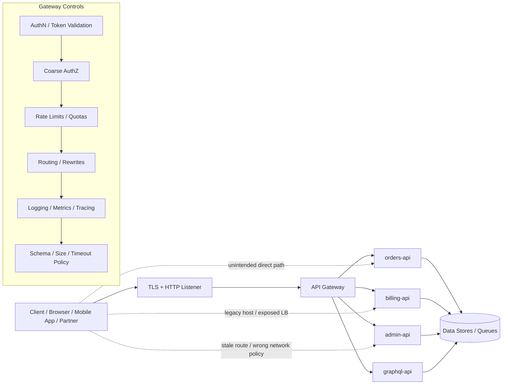
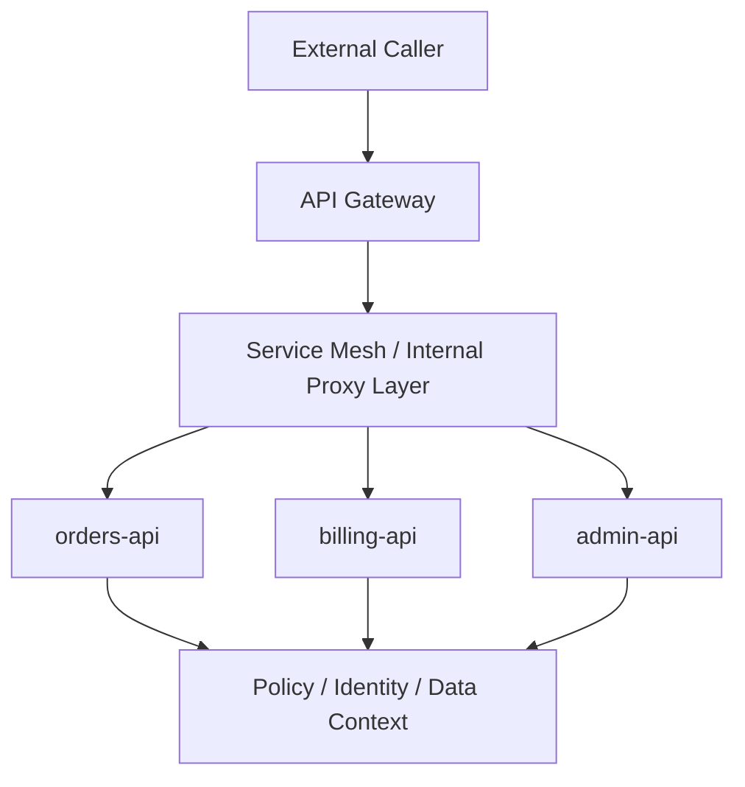
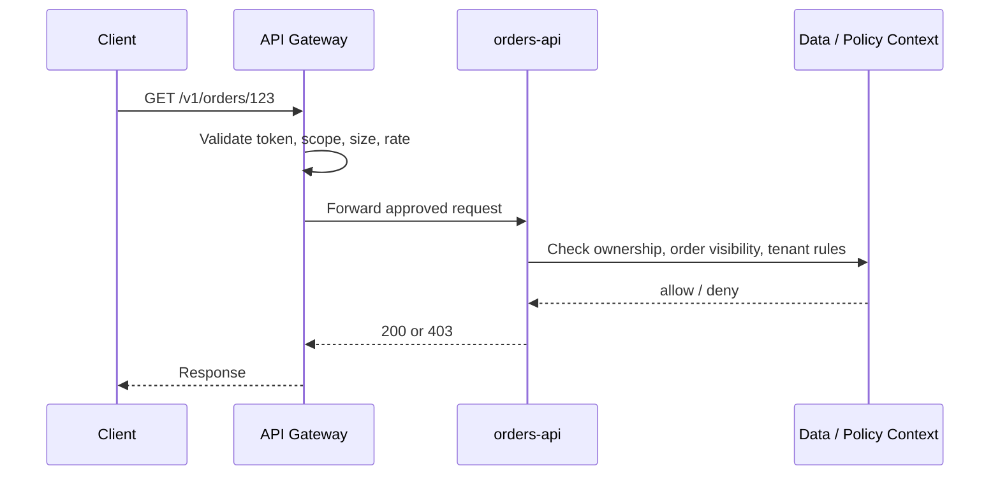

# API Gateway Security

> **Difficulty:** Beginner → Advanced | **Category:** API Pentesting / Microservices Security

An **API gateway** is the main entry point for north-south traffic in a microservices environment. It usually handles routing, TLS termination, authentication, coarse authorization, quotas, logging, protocol translation, and request shaping before traffic reaches backend services.

That makes the gateway extremely important — but also dangerous to misunderstand.

A secure gateway is **not** “the one place where security happens.” It is one **policy enforcement point** in a larger trust system that still needs strong service-to-service identity, service-level authorization, inventory control, and defensive telemetry.

A simple rule to remember:

> **The gateway should reduce attack surface, not become the only thing standing between the internet and your internal APIs.**

This note is written for **authorized, defensive security review** only.

---

## Table of Contents

1. [Why API Gateways Matter](#why-api-gateways-matter)
2. [What an API Gateway Actually Does](#what-an-api-gateway-actually-does)
3. [A Beginner Mental Model](#a-beginner-mental-model)
4. [Reading Gateway Security from the API Spec](#reading-gateway-security-from-the-api-spec)
5. [Gateway vs Service Mesh vs Backend Services](#gateway-vs-service-mesh-vs-backend-services)
6. [The Most Important Security Boundary: Edge Auth Is Not Enough](#the-most-important-security-boundary-edge-auth-is-not-enough)
7. [Common API Gateway Security Failure Modes](#common-api-gateway-security-failure-modes)
8. [Identity Propagation, Token Validation, and Trust Headers](#identity-propagation-token-validation-and-trust-headers)
9. [Rate Limiting, Resource Protection, and Business Flow Defense](#rate-limiting-resource-protection-and-business-flow-defense)
10. [Normalization, Translation, and Protocol Security](#normalization-translation-and-protocol-security)
11. [Authorized Review Methodology](#authorized-review-methodology)
12. [Defensive Design Patterns and Hardening Guidance](#defensive-design-patterns-and-hardening-guidance)
13. [Quick Checklist](#quick-checklist)
14. [Key Takeaways](#key-takeaways)
15. [References and Public Research](#references-and-public-research)

---

## Why API Gateways Matter

Microservices create many separately deployable services, but that usually means:

- more routes
- more trust boundaries
- more identity flows
- more versions
- more internal network paths
- more opportunities for policy drift

A gateway exists to give that complexity a controlled front door.

NIST SP 800-204 describes core microservices capabilities such as **authentication and access management, secure communication, monitoring, throttling, load balancing, and resiliency**, and notes that these capabilities are often bundled into frameworks such as **API gateways** and **service meshes**.

That is the strategic value of the gateway:

- it can reduce accidental exposure
- it can centralize common controls
- it can standardize how clients enter the platform
- it can improve observability and policy consistency

But it also creates **concentration risk**:

- one routing mistake may expose many services
- one weak trust assumption may affect every downstream API
- one inventory gap may keep deprecated routes alive
- one logging mistake may leak tokens or PII at scale

### Security meaning in one sentence

> **A gateway compresses many microservice risks into one edge layer — which helps defenders only if backend services still defend themselves.**

---

## 📊 Diagram — Gateway as Security Chokepoint and Bypass Risk



The secure design goal is not just “all clients use the gateway.”

The secure design goal is:

1. **approved clients enter through the gateway**
2. **downstream services only trust authenticated, policy-compliant traffic**
3. **direct access to internal services is prevented or independently rejected**

---

## What an API Gateway Actually Does

Teams often say “the gateway handles security,” but that phrase is too vague to be useful.

A gateway usually handles several *different* categories of work.

| Gateway function | What it does | Why it helps | Why it is not enough by itself |
|---|---|---|---|
| **TLS termination** | Accepts HTTPS and presents certificates | Central certificate management | Backend traffic still needs protection and identity |
| **Routing** | Sends requests to the correct service | Hides internal topology | Wrong routes can expose admin or legacy functions |
| **Authentication** | Validates sessions, API keys, JWTs, mTLS identities | Standardizes who the caller is | Authenticated is not the same as authorized |
| **Coarse authorization** | Blocks clearly disallowed routes/scopes/roles | Good first barrier | Object-level and business-level rules still belong deeper |
| **Rate limiting / quotas** | Slows abuse and protects capacity | Reduces brute force and cost spikes | Business flow abuse can still happen behind “allowed” traffic |
| **Header normalization** | Strips or rewrites forwarding headers | Reduces trust confusion | Backend must still trust only approved metadata |
| **Schema / request filtering** | Enforces body size, types, media types | Stops malformed or oversized input early | App-specific semantic validation still happens in services |
| **Observability** | Adds logs, request IDs, traces, metrics | Good for detection and incident response | Bad logging can leak secrets at scale |
| **Protocol mediation** | REST↔gRPC, WebSocket upgrades, HTTP/2 handling | Simplifies clients | Translation layers can create parser/normalization mismatches |
| **Version steering** | Routes `/v1`, `/v2`, canary, or partner-specific flows | Useful for safe rollout | Deprecated or shadow routes often linger here |

A practical way to think about it:

- the gateway is excellent for **shared controls**
- the service is still responsible for **resource-specific truth**

---

## A Beginner Mental Model

Think of an API gateway like **airport security plus a dispatcher**.

- It checks whether you appear allowed to enter the airport
- It decides which gate you should go to
- It can stop obviously forbidden items
- It can slow crowding and meter flow
- It records who entered and when

But airport security does **not** decide whether you personally may enter the cockpit, cargo hold, or maintenance room.

That deeper decision still belongs to the specific destination.

In API terms:

- **gateway** = identity check, broad policy, routing, traffic control
- **service** = object-level authorization, property filtering, business rules, data ownership rules

If the service blindly trusts “the request came through the gateway,” the system usually becomes fragile.

---

## Reading Gateway Security from the API Spec

The API spec is one of the fastest ways to understand how the gateway is *supposed* to behave.

A good OpenAPI description can reveal:

- public entry points
- base URLs and versions
- authentication models
- route grouping
- deprecated operations
- gateway-specific vendor extensions
- hints about internal routing or policy intent

### What to mine from the spec first

| Spec area | What it may reveal | Why it matters for gateway review |
|---|---|---|
| **`servers`** | Public, staging, regional, or legacy gateway hosts | Helps identify entry points and version sprawl |
| **`securitySchemes`** | Bearer auth, API keys, OAuth2, mTLS expectations | Shows intended caller identity model |
| **Global `security`** | Default auth rules for all operations | Useful for spotting accidentally public APIs |
| **Per-operation `security`** | Route exceptions, partner-only routes, admin routes | High-value place for policy drift |
| **`paths`** | Actual exposed functions | Core route inventory |
| **`tags`** | Service boundaries or team ownership hints | Helps map microservice domains behind the gateway |
| **`deprecated`** | Legacy operations still documented | Useful for retirement and deny-by-default review |
| **Vendor extensions (`x-...`)** | Upstream clusters, rate-limit classes, internal flags | Often leaks implementation or policy intent |
| **Examples / schemas** | Sensitive fields, large payloads, admin-only objects | Helps identify data exposure and resource-consumption risk |

### Example OpenAPI clues

```yaml
openapi: 3.1.0
info:
  title: Platform API
  version: 2025-03-01
servers:
  - url: https://api.example.com
    description: Production gateway
  - url: https://partner-api.example.com
    description: Partner gateway
components:
  securitySchemes:
    bearerAuth:
      type: http
      scheme: bearer
      bearerFormat: JWT
paths:
  /v1/orders/{orderId}:
    get:
      tags: [orders]
      security:
        - bearerAuth: [orders:read]
  /v1/admin/users:
    get:
      tags: [admin]
      security:
        - bearerAuth: [admin:read]
      deprecated: false
x-rate-limit-tier: standard
x-upstream-cluster: orders-v1
```

### What that spec tells a defender

Even this small spec suggests:

- there are at least **two gateway-facing hosts**
- JWT bearer auth is expected
- routes likely map to separate **orders** and **admin** domains
- scopes differ by route sensitivity
- vendor extensions may expose upstream naming or traffic policy intent

### Critical warning

> **The API spec describes intended behavior, not guaranteed enforcement.**

A mature gateway review compares:

1. **what the spec says**
2. **what the gateway config says**
3. **what backend services actually enforce**

That three-way comparison is where many real issues appear.

---

## Gateway vs Service Mesh vs Backend Services

Modern microservices security gets easier once you separate these layers mentally.

| Layer | Typical traffic focus | Common security role | Main limitation |
|---|---|---|---|
| **API gateway** | North-south traffic | Edge auth, routing, rate limits, protocol mediation, external exposure control | Cannot safely be the only authorization layer |
| **Service mesh / sidecars** | East-west traffic | Service identity, mTLS, traffic policy, retries, telemetry | Usually does not understand full business context |
| **Backend service** | Domain-specific operations | Object/property authorization, business rules, data ownership checks | May be inconsistent without platform guidance |

### Simple architecture view



### Secure interpretation

- **Gateway** decides whether the caller should reach a service class at all
- **Mesh/internal proxy** helps ensure only trusted services talk to each other
- **Service** decides whether this caller may access **this specific object, field, or workflow**

This is why OWASP’s Microservices Security Cheat Sheet warns that **authorization only at the edge** has limitations and may violate defense-in-depth if used as the sole control model.

---

## The Most Important Security Boundary: Edge Auth Is Not Enough

This is the core architectural lesson of gateway security.

A gateway can reliably enforce:

- whether a token is present
- whether the token signature is valid
- whether an API key exists
- whether a path is generally allowed for a role or scope
- whether the request is too large or too frequent

But it often cannot safely decide:

- whether user `A` may read order `12345`
- whether support staff may see `email` but not `ssn`
- whether a refund is allowed in the current business state
- whether this request should be permitted after internal risk signals change
- whether a specific downstream service should trust a forwarded user identity as-is

### Coarse vs fine-grained enforcement

| Decision type | Best place to enforce | Example |
|---|---|---|
| **Is the caller authenticated?** | Gateway and possibly service | Verify token/API key/mTLS identity |
| **Can this caller reach admin routes at all?** | Gateway | Block obvious role/scope mismatches |
| **Can this user read this specific invoice?** | Backend service | Object-level authorization |
| **Can this role modify this property?** | Backend service | Property-level authorization |
| **Is this workflow allowed right now?** | Backend service + domain policy | Business flow enforcement |
| **Should internal service A call service B?** | Mesh/internal policy + service | East-west identity and authorization |

### Diagram — Coarse edge policy vs service truth



### Zero Trust reading

OWASP’s Zero Trust Architecture guidance, aligned with NIST SP 800-207 principles, emphasizes:

- do not trust internal location by default
- secure communications regardless of network location
- make access decisions dynamically and per session
- enforce policy at multiple points, not just the perimeter

That maps directly to gateway security:

> **A request should not become trusted just because it crossed the gateway once.**

---

## Common API Gateway Security Failure Modes

The fastest way to understand gateway risk is to study the recurring failure patterns.

### 1. Gateway bypass / direct-to-service exposure

This happens when backend services are reachable without going through the intended edge controls.

Common causes:

- public load balancers in front of internal services
- cloud security groups that allow broad inbound access
- Kubernetes Services or ingresses exposed more widely than intended
- direct pod or node reachability from a shared network
- old DNS records or legacy hosts still resolving

Why it matters:

- WAF rules may be skipped
- auth or token checks may differ
- deprecated routes may remain reachable
- logging and rate limiting may be incomplete

### 2. Edge-only authorization

This is when the gateway checks a role/scope once and the service assumes everything downstream is fine.

Why it fails:

- object ownership is not known at the edge
- property-level rules are often service-specific
- business state changes faster than static route rules
- route-level decisions are too broad for sensitive APIs

This maps strongly to **OWASP API1, API3, API5, and API6** classes.

### 3. Incorrect token validation

Common examples include:

- validating signature but not **issuer**
- validating issuer but not **audience**
- accepting expired or overly long-lived tokens
- treating all JWTs from the same identity provider as equally valid for all services
- forwarding end-user tokens to too many downstream services

RFC 9700 emphasizes **token replay prevention** and **audience restriction**. In gateway terms, that means a valid token should also be the **right token for the right service**.

### 4. Trusting inbound identity headers from clients

Headers such as these are often security-sensitive:

- `X-Forwarded-For`
- `Forwarded`
- `X-Real-IP`
- `X-Original-URL`
- `X-Forwarded-Proto`
- `X-User-Id`
- `X-Authenticated-User`
- `X-Request-Id`

The secure pattern is:

- strip or overwrite client-supplied versions of trusted proxy headers
- rebuild trusted metadata at the gateway
- ensure backend services only trust those headers from approved proxies

If services accept user identity or source-IP claims directly from the client path, access control and logging can become unreliable.

### 5. Route confusion and normalization mismatch

A gateway and backend may disagree about:

- path case handling
- encoded slashes
- duplicated slashes
- dot-segments
- trailing slashes
- method overrides
- host/path rewriting
- header-based rewrites

Why that matters:

- access policy may apply to one normalized view of the request
- the backend may execute a different view
- “blocked” and “allowed” can diverge silently

### 6. Resource protection that is too shallow

A gateway may rate-limit requests but still miss:

- expensive search queries
- large fan-out GraphQL operations
- bulk exports
- costly report generation
- SMS/email/third-party-triggering workflows
- queue amplification behind one low-volume endpoint

This maps directly to **OWASP API4: Unrestricted Resource Consumption** and **API6: Unrestricted Access to Sensitive Business Flows**.

### 7. Inventory drift and deprecated routes

Gateways are often where version drift survives operationally:

- `/v1` is still routed for a forgotten mobile client
- `beta-api.example.com` still resolves
- old admin paths remain in route config but not docs
- a migration leaves both legacy and new upstreams active

This is strongly related to **OWASP API9: Improper Inventory Management**.

### 8. Overly verbose logs, traces, and error handling

Centralized edge telemetry is powerful, but risky if it captures:

- bearer tokens
- API keys
- session cookies
- sensitive personal data
- internal upstream names
- full request/response bodies for high-risk routes

A gateway is often the *largest* single collection point for API metadata, so redaction quality matters enormously.

### 9. Weak east-west trust after gateway admission

A common misconception is:

> “If the request passed the gateway, internal services can trust it.”

That assumption breaks down when:

- one internal service is compromised
- a shared cluster network is overly permissive
- traffic can be replayed internally
- service identity is weak or absent
- internal admin APIs accept any in-cluster caller

### 10. Operations-owned policy bottlenecks

OWASP notes an operational limitation of edge-only authorization: platform teams often own the gateway, while service teams own the business logic.

That can create a harmful split:

- service teams move fast
- edge policy changes move slowly
- real authorization logic drifts into code or exceptions
- the gateway policy becomes broad, permissive, or stale

That is not just a process issue. It becomes a technical security issue when coarse central policy no longer matches service reality.

---

## Identity Propagation, Token Validation, and Trust Headers

One of the hardest parts of gateway security is deciding **what identity information should move downstream**.

### Common identity propagation models

| Model | What the gateway sends to services | Benefits | Risks |
|---|---|---|---|
| **Forward original user JWT** | Same bearer token used at edge | Simple, preserves end-user context | Token may be over-broad for downstream services |
| **Token exchange / internal token** | Gateway swaps for narrower internal token | Better audience control and least privilege | Added complexity and token lifecycle design |
| **Opaque session + introspection** | Service checks token state with auth service | Strong central revocation | Added latency and dependency |
| **Gateway-injected identity headers** | Headers like `X-User-Id`, `X-Roles` | Simple for legacy services | Very dangerous unless stripped, rebuilt, and trusted only from gateway |
| **mTLS service identity + user context** | Separate machine identity plus end-user claims | Strong separation of caller and service identity | Requires careful policy design |

### What good validation looks like

At minimum, token validation should account for:

- signature or proof of possession
- issuer (`iss`)
- audience (`aud`)
- expiry (`exp`)
- not-before (`nbf`) where relevant
- authorized scopes/claims for the route
- tenant or environment boundaries

### Why audience matters so much

RFC 9700 emphasizes that access tokens should be **audience restricted** so a token intended for one resource server is not accepted by unrelated resources.

In microservices, that means:

- `orders-api` should not blindly accept a token meant for `billing-api`
- internal admin APIs should not accept generic user tokens without specific audience and policy checks
- partner-facing tokens should not become universal internal passports

### Trust-header rule

If a gateway injects identity metadata, backend services should treat it as trustworthy **only if** all of these are true:

1. the network path is restricted to approved proxies or mesh identities
2. the gateway strips conflicting inbound headers from clients
3. downstream services authenticate the immediate caller
4. the metadata format is stable, minimal, and documented
5. high-risk decisions are still re-validated against service-local policy

### Secure pattern example

```text
Client sends: Authorization: Bearer <external token>
Gateway does: validate token, strip spoofable identity headers, create trusted context
Service does: verify caller identity, enforce object/business authorization
```

### Useful defensive principle

> **Forward only the identity context a service truly needs, and make every downstream service verify that the immediate sender is allowed to assert it.**

---

## Rate Limiting, Resource Protection, and Business Flow Defense

Rate limiting is one of the most visible gateway controls, but it is easy to overestimate.

### What edge limits are good at

Gateways are very good at controlling:

- raw request rate
- connection count
- body size
- burst handling
- simple API-key or IP quotas
- noisy repeated failures

### What they often miss

They often miss **cost asymmetry** and **business semantics**.

Examples:

- one request triggers a huge database scan
- one “allowed” export pulls millions of rows
- one checkout-like workflow triggers expensive downstream providers
- one GraphQL request fans out into many backend calls
- one partner route allows high-volume batch operations by design

### Resource-defense table

| Control | Best enforced at gateway | Must also exist in services / downstream systems |
|---|---|---|
| **Requests per second** | Yes | Sometimes |
| **Body size** | Yes | Yes for domain-specific ceilings |
| **Timeouts** | Yes | Yes |
| **Concurrent expensive jobs** | Rarely sufficient | Yes |
| **Per-user business flow limits** | Partially | Yes |
| **Third-party cost protection** | Partially | Yes |
| **Pagination caps** | Helpful | Yes |
| **Idempotency for retries** | Usually not | Yes |

### Safe design lesson

> **The gateway can meter traffic volume, but only the domain service really knows transaction cost, business intent, and acceptable workflow frequency.**

---

## Normalization, Translation, and Protocol Security

Gateways frequently sit between different protocols or different interpretations of the same protocol.

Examples include:

- browser traffic at HTTP/1.1 → backend over HTTP/2
- REST → gRPC upstream
- WebSocket upgrade → internal event service
- external JSON → internal Protobuf or event messages

Every translation layer creates a risk that two components disagree.

### High-value normalization questions

| Question | Why it matters |
|---|---|
| **Do gateway and backend normalize paths the same way?** | Prevents route confusion and auth bypasses |
| **Are duplicate or conflicting forwarding headers stripped?** | Prevents client-controlled trust metadata |
| **Are method overrides supported?** | Can create route-policy mismatches |
| **Are content type and body parsers aligned?** | Avoids request smuggling-like semantic disagreement |
| **Are encoded delimiters handled consistently?** | Prevents rewrite or path confusion |
| **Does protocol translation preserve security context correctly?** | Prevents losing caller identity or policy meaning |

### gRPC and HTTP/2 note

When a gateway fronts gRPC or HTTP/2 services, defenders should think about:

- strict header and pseudo-header handling
- consistent authentication context across translation boundaries
- reflection or admin endpoints exposed only through approved paths
- max message sizes and timeout controls
- which service methods are internet-facing vs internal-only

### GraphQL note

A gateway in front of GraphQL should consider:

- query depth/complexity controls
- persisted queries where appropriate
- file upload rules
- batching implications for quotas and abuse controls
- schema exposure policy in the intended environment

### WebSocket note

A gateway handling upgrades should still enforce:

- authentication before upgrade
- origin and route policy where relevant
- connection lifetime limits
- message size and rate policies
- clean logging/redaction for long-lived channels

---

## Authorized Review Methodology

This workflow is intentionally **defensive and bounded**. It is about validating architecture and controls, not abusing them.

### 1. Start with the API spec and route inventory

Review the approved API documentation or OpenAPI description and extract:

- public hosts
- versions
- auth models
- admin or partner tags
- deprecated operations
- large or high-risk request/response schemas
- vendor extensions that hint at upstream routing or policy tiers

### 2. Map the real traffic path

For each important route, identify:

- external listener
- gateway or ingress
- internal proxy/mesh if any
- backend service
- downstream dependencies

The question is not just “what endpoint exists?”

The better question is:

> **Which controls apply at each hop, and which assumptions are made between hops?**

### 3. Separate authentication, authorization, and routing responsibilities

For every sensitive route, determine:

- what the gateway validates
- what the service validates
- what data source or policy engine informs the decision
- what happens if the gateway is bypassed or misroutes traffic

### 4. Verify downstream reachability policy

Review whether backend services are:

- private by default
- reachable only from approved proxies/mesh identities
- protected by network policies / security groups / firewall rules
- using mTLS or equivalent service identity where appropriate

### 5. Review trusted header handling

Document which headers are considered authoritative and confirm:

- the gateway strips client-supplied versions
- the gateway recreates approved values consistently
- services only trust those headers from authenticated internal callers

### 6. Review token policy, not just token format

A gateway that “supports JWT” is not enough information.

Confirm:

- expected issuer(s)
- expected audience(s)
- scope/role mapping rules
- token lifetime expectations
- revocation/introspection behavior where applicable
- whether sensitive downstream services require narrower internal tokens

### 7. Review cost and abuse controls

Look beyond request-per-second limits and examine:

- endpoint-specific quotas
- expensive searches or exports
- file size and upload policy
- queue-triggering routes
- outbound provider-triggering routes
- retry, backoff, and idempotency design

### 8. Review lifecycle and inventory hygiene

Check whether the gateway still routes:

- deprecated API versions
- shadow hosts
- temporary partner paths
- old admin endpoints
- debugging or health surfaces exposed too broadly

### 9. Review logging and redaction

At the gateway layer, verify that logs and traces:

- preserve request IDs and useful metadata
- redact tokens, secrets, and sensitive personal data
- avoid indiscriminate full-body logging on sensitive routes
- distinguish authentication failure from authorization failure cleanly

### 10. Review failure behavior

The most useful architectural question is often:

> **What happens when an internal dependency fails?**

For example:

- if token introspection is unavailable, is access denied or accidentally allowed?
- if the policy service is stale, does the gateway fail closed or open?
- if the route config cannot load, what becomes reachable?
- if a downstream service times out, are retries safe and bounded?

---

## Defensive Design Patterns and Hardening Guidance

The strongest gateway programs usually combine platform controls with service-local truth.

### Recommended patterns

| Pattern | Why it is strong |
|---|---|
| **Gateway authentication + service authorization** | Keeps shared auth logic centralized while preserving object/business checks in services |
| **Private-by-default backends** | Reduces bypass opportunities |
| **mTLS or equivalent service identity internally** | Prevents “internal network = trusted” assumptions |
| **Audience-restricted tokens** | Stops one token from becoming universal access across services |
| **Header allowlist + strip/rebuild model** | Prevents spoofed trust metadata |
| **Per-route request size, timeout, and schema policy** | Reduces resource abuse and parser mismatch |
| **Explicit deprecation and route retirement process** | Shrinks shadow surface over time |
| **Policy-as-code with versioning and review** | Reduces ad hoc edge drift |
| **Central telemetry with redaction standards** | Improves detection without mass secret leakage |
| **Canary and version routing with deny-by-default fallback** | Makes migrations safer |

### PAP / PDP / PEP thinking

OWASP’s Microservices Security Cheat Sheet uses classic access-control terminology that is very useful here:

- **PAP** — where policy is authored and managed
- **PDP** — where the decision is computed
- **PEP** — where the decision is enforced
- **PIP** — where policy data comes from

An API gateway is often a **PEP** and sometimes part of a **PDP** workflow, but it rarely has all the domain context needed to be the only decision-maker.

That is why mature systems often use:

- edge enforcement for shared coarse policy
- embedded or centralized policy decisions for domain-aware rules
- service-local enforcement for object and workflow truth

### Secure gateway configuration principles

1. **Deny by default** for unmatched routes and methods
2. **Strip and rebuild trusted headers**
3. **Validate issuer, audience, expiry, and scopes**
4. **Use least-privilege identity propagation**
5. **Require authenticated internal callers for sensitive services**
6. **Keep admin, debug, and health surfaces explicitly separated**
7. **Bound request size, timeout, and concurrency**
8. **Log richly, but redact aggressively**
9. **Retire deprecated routes on a schedule**
10. **Continuously compare docs/specs to live route config**

### Example of safe header-handling intent

```text
Client input headers      -> treat as untrusted by default
Trusted proxy metadata    -> generated by the gateway
Backend authorization     -> based on verified token/context, not raw client headers
```

### Example of safe token-handling intent

```text
External token valid?          yes
Correct issuer?                yes
Correct audience for service?  yes
Required scope/role present?   yes
Service-specific authz check?  still required
```

---

## Quick Checklist

Use this as a compact review list.

### Exposure and routing

- [ ] Public APIs enter through approved gateway listeners only
- [ ] Backend services are private by default
- [ ] Deprecated hosts and versions are retired, not just undocumented
- [ ] Admin/debug routes are separated and intentionally exposed
- [ ] Unmatched paths and methods fail closed

### Authentication and authorization

- [ ] Gateway validates the correct auth scheme for each route
- [ ] JWT or token checks include **issuer**, **audience**, **expiry**, and expected claims
- [ ] Sensitive services do not rely on edge-only authorization
- [ ] Object/property/business authorization is enforced in services
- [ ] Internal service calls have authenticated machine identity

### Headers and trust context

- [ ] Client-supplied forwarding or identity headers are stripped or overwritten
- [ ] Backend services trust proxy metadata only from approved callers
- [ ] `X-Forwarded-*`, `Forwarded`, and internal identity headers have documented meaning
- [ ] Request IDs are stable and safe to log

### Resource protection

- [ ] Route-specific timeouts, body limits, and quotas exist
- [ ] Expensive endpoints have service-side guardrails too
- [ ] GraphQL/gRPC/WebSocket routes have protocol-appropriate limits
- [ ] Third-party cost-triggering flows are bounded and monitored

### Telemetry and operations

- [ ] Gateway logs redact tokens, API keys, secrets, and sensitive bodies
- [ ] Failure paths are understood and fail safely
- [ ] Policy changes are versioned and reviewed
- [ ] Spec, gateway config, and runtime behavior are compared regularly

---

## Key Takeaways

1. **An API gateway is a powerful control point, not a complete security model.**
2. **The API spec is a high-value map of intended gateway behavior, but runtime enforcement must be verified.**
3. **Gateway authentication and coarse policy should be paired with service-level authorization and internal identity controls.**
4. **Header provenance, token audience, inventory hygiene, and bypass prevention are four of the most important gateway review themes.**
5. **The strongest microservices environments treat the gateway as one enforcement layer inside a zero-trust, defense-in-depth architecture.**

If you remember one sentence from this note, remember this:

> **Use the gateway to centralize shared controls, but design every downstream service as if misplaced trust at the edge is eventually possible.**

---

## References and Public Research

This note was informed by the following public sources and standards:

1. **OWASP Microservices Security Cheat Sheet**  
   https://cheatsheetseries.owasp.org/cheatsheets/Microservices_Security_Cheat_Sheet.html
2. **OWASP API Security Top 10 (2023)**  
   https://owasp.org/API-Security/editions/2023/en/0x11-t10/
3. **NIST SP 800-204 — Security Strategies for Microservices-based Application Systems**  
   https://csrc.nist.gov/pubs/sp/800/204/final
4. **OWASP Zero Trust Architecture Cheat Sheet**  
   https://cheatsheetseries.owasp.org/cheatsheets/Zero_Trust_Architecture_Cheat_Sheet.html
5. **RFC 9700 — OAuth 2.0 Security Best Current Practice**  
   https://datatracker.ietf.org/doc/html/rfc9700
6. **OpenAPI Specification**  
   https://spec.openapis.org/oas/latest.html
