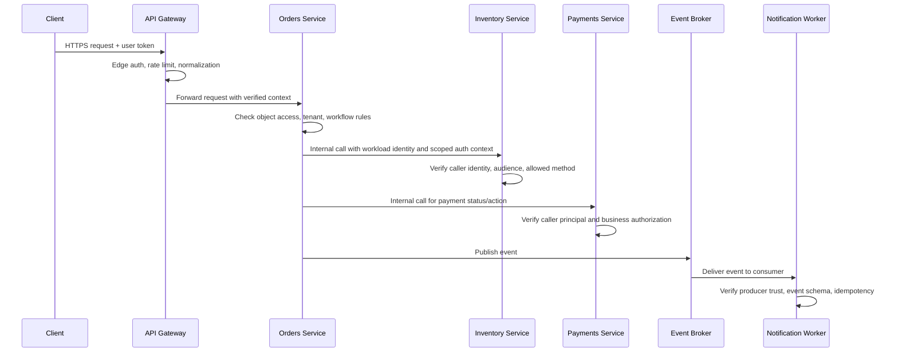
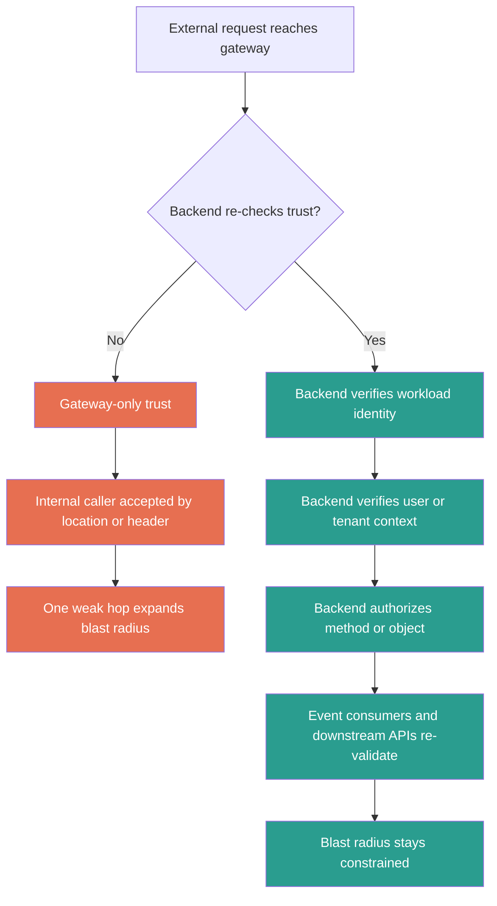
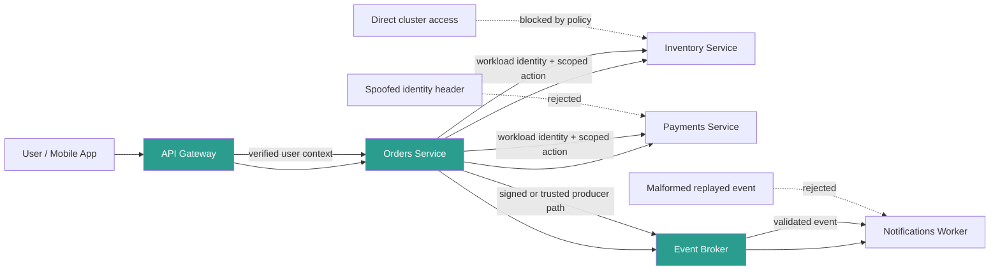

# East-West Traffic Trust

> **East-west traffic trust** is the set of assumptions, identities, and policies that govern how internal services accept requests from other internal services. In a microservices environment, weak east-west trust turns one small foothold, misrouted request, or leaked workload credential into a much larger blast radius.

---

> **Audience:** Beginner → Advanced  
> **Category:** API Pentesting — Microservices Security  
> **Focus:** understanding how to map, validate, and harden internal service-to-service trust without relying on “internal network = trusted” assumptions  
> **Authorized-use note:** this note is for approved security reviews, design reviews, defensive validation, and lab work. It avoids harmful step-by-step abuse instructions and emphasizes safe, non-destructive checks.

---

**Relevant risks:** OWASP API2:2023, API5:2023, API8:2023, API9:2023, API10:2023  
**Spec anchors:** OpenAPI `servers`, `paths`, `tags`, `security`, `components.securitySchemes`, header parameters, callbacks, `webhooks`

---

## Table of Contents

1. [What East-West Traffic Means](#1-what-east-west-traffic-means)
2. [Why East-West Trust Matters So Much](#2-why-east-west-trust-matters-so-much)
3. [Beginner Mental Model](#3-beginner-mental-model)
4. [Diagram 1: Where Trust Decisions Actually Happen](#4-diagram-1-where-trust-decisions-actually-happen)
5. [What “Trust” Really Includes](#5-what-trust-really-includes)
6. [Reading the API Spec as an East-West Trust Map](#6-reading-the-api-spec-as-an-east-west-trust-map)
7. [Common East-West Trust Models](#7-common-east-west-trust-models)
8. [Common Failure Patterns](#8-common-failure-patterns)
9. [Diagram 2: Trust Collapse vs Layered Verification](#9-diagram-2-trust-collapse-vs-layered-verification)
10. [Safe, Authorized Validation Workflow](#10-safe-authorized-validation-workflow)
11. [Detection and Telemetry Ideas](#11-detection-and-telemetry-ideas)
12. [Defensive Controls and Hardening Priorities](#12-defensive-controls-and-hardening-priorities)
13. [Worked Example: Orders, Inventory, and Payments](#13-worked-example-orders-inventory-and-payments)
14. [Diagram 3: Worked Example Flow](#14-diagram-3-worked-example-flow)
15. [Practical Review Checklist](#15-practical-review-checklist)
16. [Public References](#16-public-references)
17. [Key Takeaways](#17-key-takeaways)

---

## 1. What East-West Traffic Means

In API and microservices discussions, people often separate traffic into two broad directions:

| Direction | Plain meaning | Typical examples | Main trust question |
|---|---|---|---|
| **North-south** | Traffic crossing the outer edge of the platform | browser → gateway, mobile app → public API, partner → edge endpoint | Can this outside caller enter the platform safely? |
| **East-west** | Traffic moving **inside** the platform between services, workers, queues, meshes, and internal APIs | order service → inventory service, worker → billing API, service → message broker | Should this internal caller be trusted for **this exact action**? |

A beginner-friendly way to remember it:

```text
North-south = entering the campus
East-west   = moving between buildings inside the campus
```

That distinction matters because a modern public API call rarely stops at the gateway. One user request can fan out into many internal hops:

- gateway → auth service
- gateway → order service
- order service → inventory service
- order service → payment service
- order service → event broker
- worker → notification service

Every one of those hops is a **new trust decision**, even if the original user was already authenticated.

---

## 2. Why East-West Trust Matters So Much

Microservices increase agility, but they also increase the number of identities, routes, retries, and policy boundaries inside the platform.

Public guidance converges on the same lesson:

- **Istio security documentation** highlights that microservices need traffic encryption, mutual TLS, fine-grained access policies, and auditing.
- **SPIFFE** explains why IP-based trust does not scale well in dynamic environments where workloads move, restart, and change frequently.
- **Kubernetes NetworkPolicy** documentation makes clear that traffic is often broadly allowed by default unless isolation policies are deliberately applied.
- **OWASP API9:2023** warns that microservices, Kubernetes, and multiple deployments make it easy to forget exposed internal hosts and stale versions.
- **OWASP API10:2023** warns that developers often trust integrated APIs too much and weaken validation or transport requirements.
- **OWASP’s gRPC Security Cheat Sheet** emphasizes transport security, mTLS, per-method authorization, reflection control, and secure discovery.

### Why this becomes a real security problem

| Architectural reality | What teams hope is true | What often fails in practice |
|---|---|---|
| Many internal services communicate constantly | “Internal traffic is already trusted” | Network location gets treated as identity |
| Gateways enforce strong edge controls | “Downstream services are therefore safe” | Backends stop re-checking auth and authorization |
| Service meshes add mTLS | “We solved service security” | Transport identity exists, but business authorization is still weak |
| Tokens are forwarded internally | “The next service knows enough to trust them” | Audience, scope, tenant, or user context drift across hops |
| Dynamic discovery improves resilience | “Inventory stays accurate automatically” | Stale, shadow, debug, beta, or direct-backend paths linger |
| Async pipelines improve decoupling | “The producer validated everything already” | Queue consumers accept messages with weaker checks |

### The core lesson

> **East-west trust is not just about encryption. It is about whether every internal hop verifies identity, intended audience, authorization, and context before acting.**

---

## 3. Beginner Mental Model

Imagine a company campus with many buildings:

- the **front gate** checks whether you may enter the campus
- each **building** checks whether you may enter that building
- some **rooms** inside the building require extra privileges
- deliveries from another building still need verification
- a badge that opens one lab should not automatically open every lab

That is how east-west trust should work in microservices.

### Four short rules worth remembering

```text
Inside the network is not identity.
A secure channel is not authorization.
A known service is not a universally trusted service.
Forwarded user context is not proof unless it is re-validated.
```

### Why beginners get confused

A lot of platforms look secure from the outside:

- strong login
- clean API gateway
- TLS everywhere
- modern Kubernetes or service mesh setup

But the important question is deeper:

> **Once a request is inside, who is allowed to call what, on whose behalf, and with which proof?**

That is the real east-west question.

---

## 4. Diagram 1: Where Trust Decisions Actually Happen



### What the diagram teaches

A single external request often becomes **several internal trust decisions**:

1. edge acceptance
2. service identity verification
3. user or tenant context validation
4. object/function authorization
5. event producer or consumer trust
6. audit and traceability

If any one hop silently assumes “the previous component already checked that,” trust can collapse.

---

## 5. What “Trust” Really Includes

In microservices, trust is not one thing. It is a stack of different questions.

| Trust layer | Practical question | Good evidence | Common failure |
|---|---|---|---|
| **Transport trust** | Is the channel protected from interception or tampering? | TLS, mTLS, strong cipher configuration | plaintext internal traffic, optional TLS, bad certificate validation |
| **Workload identity** | Which service or workload is really calling? | client cert, SPIFFE ID, short-lived service token | trusting source IP, pod CIDR, or a static header |
| **Propagated user context** | Is this action still tied to the right user, tenant, or workflow? | verified claims, token exchange, signed context | blindly trusting forwarded `X-User-Id` or `X-Tenant-Id` |
| **Authorization** | Is this caller allowed to perform this exact method or action? | per-service ACLs, scopes, method policy, object checks | “any authenticated internal service may call anything” |
| **Data trust** | Can payloads, events, or API responses from another service be safely used? | schema validation, sanitization, bounded parsers | treating internal or third-party data as automatically safe |
| **Reachability trust** | Can only the intended services reach the target at all? | NetworkPolicies, mesh policy, deny-by-default routing | direct pod or service access from broad namespaces |
| **Operational trust** | Can defenders tell who called what and why? | logs, traces, correlation IDs, denied-call visibility | missing audit trail, anonymous service calls |

### Important distinction

A system can have **strong transport trust** and still have **weak authorization trust**.

For example:

- mTLS proves the caller has *some* valid workload identity
- but it does **not** automatically prove that the caller should be allowed to reserve inventory, issue refunds, or read another tenant’s data

That is why internal service trust must be both:

- **authenticated**, and
- **constrained**

---

## 6. Reading the API Spec as an East-West Trust Map

The API specification is often your fastest safe map of where trust is *supposed* to exist.

The OpenAPI Specification explicitly says an API description lets humans and computers understand service capabilities without source code or traffic inspection. That is useful here because east-west trust is often partially revealed by documentation before you ever look at runtime behavior.

### What to extract from the spec

| Spec field | What it may reveal | Why it matters for east-west trust |
|---|---|---|
| **`servers`** | public, staging, regional, partner, or internal hosts | may reveal direct-backend or mesh-visible entry points |
| **`paths`** | internal-looking routes such as `/internal/`, `/admin/`, `/worker/` | suggests where gateway and backend trust may differ |
| **`tags`** | service boundaries like `orders`, `inventory`, `billing` | helps reconstruct which microservice probably owns which operation |
| **`security`** | whether operations require bearer auth, mTLS, API key, etc. | highlights routes with weak or missing declared protection |
| **`components.securitySchemes`** | auth models including `mutualTLS` | shows whether workload identity is designed into the contract |
| **Header parameters** | tracing, tenant, region, or correlation headers | helps distinguish benign routing headers from dangerous identity headers |
| **`callbacks` / `webhooks`** | outbound trust relationships | expands the map beyond request/response APIs |
| **Vendor extensions (`x-...`)** | upstream names, gateway clusters, internal metadata | may leak implementation details or hidden service structure |

### Example OpenAPI clues

```yaml
openapi: 3.1.0
info:
  title: Orders Platform API
  version: 2.3.0
servers:
  - url: https://api.example.com/v2
    description: Public gateway
  - url: https://orders.mesh.internal
    description: Internal service endpoint
components:
  securitySchemes:
    bearerAuth:
      type: http
      scheme: bearer
      bearerFormat: JWT
    serviceMTLS:
      type: mutualTLS
paths:
  /orders/{orderId}:
    get:
      tags: [orders]
      security:
        - bearerAuth: [orders.read]
  /internal/inventory/reservations:
    post:
      tags: [inventory, internal]
      security:
        - serviceMTLS: []
        - bearerAuth: [inventory.reserve]
webhooks:
  stockLow:
    post:
      description: Inventory notifies subscribed systems
```

From a defensive review perspective, that tiny spec already suggests:

- a **public gateway** and an **internal service address**
- separate **orders** and **inventory** boundaries
- internal calls that expect **mTLS** and **scoped authorization**
- an outbound webhook or event trust path

### Safe, authorized spec review commands

Use these only on approved local spec copies:

```bash
# Show declared hosts / base URLs
jq -r '.servers[]?.url' openapi.json | sort -u

# List documented operations
jq -r '.paths | to_entries[] | .key as $p | .value | keys[] | "\(ascii_upcase) \($p)"' openapi.json

# Review declared security schemes
jq '.components.securitySchemes' openapi.json

# Surface routes with no visible security block
jq -r '.paths | to_entries[] | select(.value | tostring | contains("security") | not) | .key' openapi.json
```

### Important limitation

The spec is your **starting map**, not perfect truth.

OWASP API9 is especially relevant here: in sprawling microservice estates, documentation can drift from reality. Good east-west review compares:

1. **documented trust**
2. **configured trust**
3. **actually enforced trust**

---

## 7. Common East-West Trust Models

Different platforms solve internal trust in different ways.

| Trust model | How it works | Main strength | Main risk | Good review question |
|---|---|---|---|---|
| **Gateway-propagated user token** | edge validates user token and forwards claims internally | simple end-user continuity | backend assumes the gateway checked everything | does every backend still verify audience, tenant, and action? |
| **OAuth client credentials / token exchange** | service gets a service token or exchanged token for the next hop | clearer audience and scope boundaries | overbroad scopes, cross-service replay, long-lived service tokens | is the token valid only for the intended internal API? |
| **mTLS between services** | both sides authenticate during TLS | strong channel + workload identity | teams confuse workload identity with full authorization | does any valid internal cert get too much access? |
| **SPIFFE / workload identity** | workloads receive short-lived X.509 or JWT identities | avoids static secrets and IP-based trust | poor identity-to-policy mapping, trust-domain confusion | is authorization tied to the specific workload principal? |
| **Service mesh policy** | sidecars/perimeter proxies enforce encryption and policy | centralized policy and telemetry | bypass routes, policy drift, app-layer blind spots | can a direct path skip mesh or backend checks? |
| **Legacy shared secret / internal header** | static API key, HMAC, or custom header proves caller | easy to adopt | spoofing, replay, secret sprawl, poor attribution | is network location or a header being treated as identity? |

### A good design principle

The strongest internal designs usually combine:

- **short-lived workload identity**
- **encrypted transport**
- **per-service authorization**
- **restricted reachability**
- **observable policy decisions**

Not every environment will use the same stack, but the principles stay the same.

---

## 8. Common Failure Patterns

### 1. Internal network location is treated as identity

This is the classic failure:

```text
“Traffic came from inside the cluster, so it must be trusted.”
```

Why it is dangerous:

- SSRF, compromised workloads, or misrouted requests can inherit “trusted” status
- one weak internal component becomes a platform-wide stepping stone

### 2. Gateway-only enforcement

The edge verifies the user, but the backend does not re-check enough context.

Common signs:

- direct service hostname behaves differently from the public gateway path
- internal route accepts requests because a proxy or upstream header is assumed to be clean
- backends rely on “already authenticated” instead of verifying intended audience and action

### 3. Any valid service identity can call any internal API

This often happens after adopting a service mesh or mTLS.

The platform improves authentication, but authorization remains flat:

- every mesh principal can reach every service
- every valid client cert is treated as broadly trusted
- method-level or action-level restrictions do not exist

### 4. Identity headers are trusted from the wrong hop

Examples include:

- `X-User-Id`
- `X-Tenant-Id`
- `X-Role`
- `X-Forwarded-Client-Cert`
- custom “verified-service” headers

These may be safe **only** if a trusted proxy adds them and backends reject user-supplied versions.

### 5. Token audience, scope, or tenant context drifts across hops

A token valid for service A should not automatically work for service B.

Bad patterns include:

- ignoring `aud`
- reusing one internal token across many services
- forwarding end-user claims into unrelated service contexts
- weak tenant scoping on internal lookups

### 6. Inventory and discovery blind spots

OWASP API9 is directly relevant here.

In microservices, trust often breaks around forgotten assets:

- beta hosts
- old versions
- direct pod or node ports
- staging routes using production data
- internal-only services accidentally reachable from broader networks

### 7. Async trust gap

A synchronous API may validate input correctly, but downstream queues and consumers often trust the producer too much.

Defensive questions:

- does the consumer verify producer identity?
- is the message schema validated again?
- are duplicate or replayed events handled safely?
- is tenant context preserved correctly?

### 8. gRPC and mesh blind spots

East-west traffic commonly uses gRPC because it is efficient and strongly typed.

OWASP’s gRPC guidance highlights several defensive review points:

- TLS and preferably mTLS in production
- method-level authentication and authorization
- message size and timeout limits
- secure service discovery
- disabling reflection in production when not needed

### 9. Unsafe trust in adjacent or third-party APIs

East-west flows often extend beyond purely internal calls.

A service may fetch data from:

- an internal platform API
- a partner API
- a SaaS webhook source
- an enrichment or fraud provider

OWASP API10 reminds defenders that “trusted API” does **not** mean “safe input.” Internal workflows should still validate, sanitize, limit redirects, set timeouts, and bound resource usage.

---

## 9. Diagram 2: Trust Collapse vs Layered Verification



### Why this matters

The difference between a resilient microservice platform and a fragile one is often **not** whether it has modern components.

It is whether every hop does enough verification to prevent one mistaken assumption from turning into broad lateral trust.

---

## 10. Safe, Authorized Validation Workflow

Only test internal APIs, service meshes, registries, or cluster controls that are **explicitly in scope**.

If your approval does **not** include cluster-level inspection, stop at documentation, logs, config review, or staging validation.

### Recommended workflow

| Phase | Goal | Safe evidence sources |
|---|---|---|
| **1. Map documented trust** | understand intended architecture | OpenAPI, architecture diagrams, gateway docs, mesh docs |
| **2. Map runtime trust** | identify real internal callers and paths | traces, service map, logs, inventory data, approved traffic captures |
| **3. Validate identity controls** | confirm services authenticate each other explicitly | test certs, approved service tokens, policy review |
| **4. Validate authorization** | confirm the internal caller is allowed only what it needs | lower-privilege test identities, scope review, method checks |
| **5. Compare inventory and enforcement** | find drift between docs and reality | OpenAPI vs live routes vs discovery metadata |
| **6. Review failure handling** | reduce blast radius during outages or misuse | denied-call logs, timeout policy, retry and queue handling |

### Safe command examples

Use only in approved environments and with approved identities:

```bash
# Review declared internal auth models from a local API spec
jq '.components.securitySchemes' openapi.json

# Review Kubernetes network isolation posture
kubectl get networkpolicies -A

# Review one policy in detail
kubectl describe networkpolicy allow-orders-to-inventory -n production

# Observe whether an approved internal endpoint requests a client certificate
openssl s_client -connect inventory.internal.example:443 -servername inventory.internal.example

# Enumerate gRPC services only on an explicitly approved target
grpcurl inventory.internal.example:443 list
```

### What “good” validation looks like

A safe, authorized review usually focuses on questions like:

- Does the target reject unauthenticated internal calls?
- Does a lower-privilege internal identity get blocked from higher-risk methods?
- Do direct-backend paths enforce the same or stronger checks than the gateway path?
- Does the consumer re-validate messages and context after queue or broker hops?
- Are denied attempts visible in logs and traces?

That is enough to learn a lot without doing anything destructive.

---

## 11. Detection and Telemetry Ideas

Strong east-west trust is easier to defend when policy decisions are visible.

| Signal | Why it matters |
|---|---|
| **mTLS handshake failures** | reveals services presenting wrong or missing identities |
| **401/403 between internal services** | shows policy is actually being enforced and where misuse occurs |
| **Unexpected service-to-service pairs** | reveals new or suspicious call paths |
| **Direct-to-pod or direct-backend traffic** | may indicate gateway or mesh bypass |
| **Audience / scope mismatch errors** | catches token replay across services |
| **Reflection or schema discovery against production gRPC** | may indicate unnecessary exposure or suspicious probing |
| **Retry storms and large internal responses** | can point to timeout, resource, or abuse resilience issues |
| **Queue consumer validation failures** | helps detect malformed or untrusted events |
| **Missing correlation IDs across hops** | weakens incident reconstruction and accountability |

### High-value telemetry questions

Defenders should be able to answer:

1. Which service called this API?
2. On whose behalf was it acting?
3. Was the request allowed by workload identity, by user context, or both?
4. Which policy allowed or denied it?
5. Did the same request cross sync and async boundaries?
6. Can we distinguish normal retries from suspicious repetition?

If those answers are not available, east-west trust is probably harder to defend than the architecture diagram suggests.

---

## 12. Defensive Controls and Hardening Priorities

No single control fixes east-west trust. Use layers.

| Control | What it helps solve | Important limitation |
|---|---|---|
| **Default-deny ingress and egress NetworkPolicies** | reduces broad reachability between namespaces or pods | L3/L4 isolation is not workload identity or business authorization |
| **mTLS with short-lived cert rotation** | authenticates workloads and encrypts traffic | any valid cert may still be over-trusted if policy is too broad |
| **Workload identity such as SPIFFE/SPIRE** | avoids static secrets and IP-based trust | identity still needs method/action authorization mapping |
| **Audience-restricted, short-lived service tokens** | reduces replay and token sprawl | does not help if services ignore `aud`, scope, or tenant context |
| **Backend authorization on every hop** | prevents gateway-only trust failures | requires consistent implementation across teams |
| **Secure service discovery and reflection controls** | reduces exposed metadata and unneeded API surface | discovery still needs ACLs and inventory discipline |
| **Async producer/consumer validation** | keeps queue and webhook hops from becoming blind spots | extra validation must be maintained across schemas and versions |
| **Rate, size, and timeout limits** | reduces resource abuse and cascading failures | availability controls do not replace authz |
| **Structured logs and traces** | improves accountability and incident response | logging sensitive data creates its own risk |
| **Version retirement and host inventory** | shrinks shadow routes and stale trust assumptions | requires continuous operational discipline |

### Important Kubernetes nuance

Kubernetes NetworkPolicies are useful, but their own documentation makes two important points:

1. policies only work if the network plugin actually enforces them
2. traffic between pods is allowed unless isolation policies are applied

So the right mindset is:

> **Reachability controls are necessary, but identity and authorization must still exist above them.**

---

## 13. Worked Example: Orders, Inventory, and Payments

Imagine a commerce platform with these components:

- public API gateway
- `orders-service`
- `inventory-service`
- `payments-service`
- event broker
- `notifications-worker`

### What good east-west trust looks like

1. **Gateway authenticates the user** and normalizes external headers.
2. **Orders service** verifies the user can act on that order.
3. For internal calls, **orders-service** uses a workload identity or tightly scoped service token.
4. **Inventory service** verifies the caller is really `orders-service` and that the action is specifically allowed.
5. **Payments service** does the same, instead of trusting “anything internal.”
6. The event broker and notification worker treat the event as a new trust boundary, not as already-safe input.
7. Network policy prevents unrelated services from reaching payments or inventory directly.

### What weak east-west trust looks like

- `inventory-service` accepts any request from the cluster network
- `payments-service` trusts a forwarded header that claims the caller is orders
- the worker accepts any message with the right JSON shape
- a beta version of the internal API still exists with weaker auth

### Why this matters

In the strong design, one compromised internal component still has a **constrained** blast radius.

In the weak design, one compromised internal component can inherit a broad “trusted internal” position.

---

## 14. Diagram 3: Worked Example Flow



### Key lesson from the example

Good east-west trust does **not** assume one earlier check is enough forever.

Instead, each downstream component answers:

- who is calling?
- what are they asking to do?
- on whose behalf are they acting?
- should this action be allowed here?

---

## 15. Practical Review Checklist

```text
[ ] Do internal services require explicit workload identity rather than source IP alone?
[ ] Do backends re-check authorization instead of relying only on the gateway?
[ ] Are service tokens short-lived, audience-restricted, and scope-limited?
[ ] Are mTLS or workload identities mapped to least-privilege authorization rules?
[ ] Are user, tenant, and role headers accepted only from trusted proxies and re-validated?
[ ] Are direct-backend, beta, and deprecated internal paths inventoried and retired?
[ ] Do queue consumers, workers, and webhook handlers validate producer trust and message shape?
[ ] Are NetworkPolicies or equivalent controls limiting unnecessary internal reachability?
[ ] Are denied east-west requests visible in logs, traces, and alerts?
[ ] Can the team explain the trust decision at every major internal hop?
```

---

## 16. Public References

- **OpenAPI Specification 3.1.1** — why API descriptions help humans and computers understand capabilities, hosts, operations, and security models:  
  https://swagger.io/specification/
- **OWASP API Security Top 10 2023 — API9: Improper Inventory Management** — especially relevant for stale hosts, versions, and microservice sprawl:  
  https://owasp.org/API-Security/editions/2023/en/0xa9-improper-inventory-management/
- **OWASP API Security Top 10 2023 — API10: Unsafe Consumption of APIs** — relevant when internal workflows trust adjacent or third-party APIs too much:  
  https://owasp.org/API-Security/editions/2023/en/0xaa-unsafe-consumption-of-apis/
- **Istio Security Concepts** — encryption, mTLS, authorization policies, identity, auditing, and zero-trust-oriented service security:  
  https://istio.io/latest/docs/concepts/security/
- **SPIFFE Overview** — why first-class workload identity matters in dynamic environments and why IP-based trust alone does not scale:  
  https://spiffe.io/docs/latest/spiffe-about/overview/
- **Kubernetes Network Policies** — how ingress/egress isolation works and why deliberate policy is required:  
  https://kubernetes.io/docs/concepts/services-networking/network-policies/
- **OWASP gRPC Security Cheat Sheet** — transport security, mTLS, per-method authorization, secure discovery, size limits, and production reflection guidance:  
  https://cheatsheetseries.owasp.org/cheatsheets/gRPC_Security_Cheat_Sheet.html

---

## 17. Key Takeaways

- East-west traffic trust is about **how internal services trust each other**, not just how outsiders reach the platform.
- In microservices, every internal hop is a **new trust boundary**, even after the user is authenticated.
- The most common mistake is treating **network location** or a previously checked header as enough proof.
- Strong designs combine **restricted reachability, explicit workload identity, scoped authorization, and observable policy decisions**.
- The API spec is a valuable starting map for east-west trust, but OWASP API9 reminds us that documentation drift is common.
- Service meshes and mTLS help a lot, but **transport security is not the same as business authorization**.
- Defensive review should stay safe and authorized: compare documented trust, configured trust, and actually enforced trust without disruptive testing.
