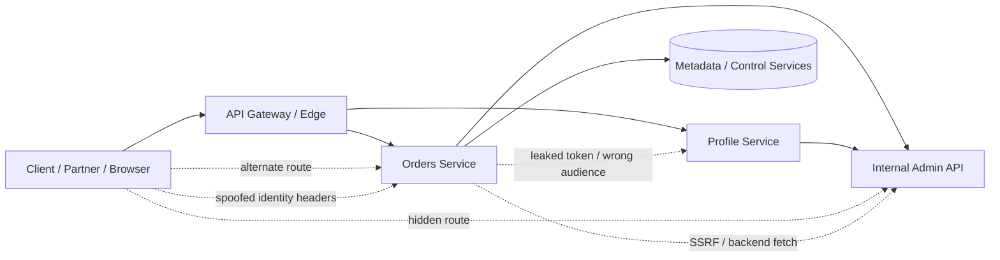
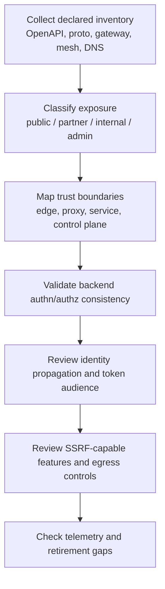

# Internal API Attacks

> **Module:** API Pentesting → Microservices & API Gateway Security  
> **Difficulty:** Intermediate → Advanced  
> **Focus:** Learn how “internal-only” APIs become reachable or over-trusted in modern platforms, how to validate those risks safely during **authorized** testing, and how defenders reduce blast radius.

---

## 🧠 What Is It? (Beginner Explanation)

An **internal API attack** is not defined by a secret exploit. It is defined by a **broken trust assumption**.

In a microservices platform, many APIs are meant to be reachable only by:

- an API gateway,
- a trusted backend service,
- an internal admin tool,
- a background worker,
- or a workload with a machine identity.

Problems start when the system treats **“came from inside”** as proof that the request is safe.

That can happen when:

- a backend service is reachable directly without going through the gateway,
- a service trusts proxy-added headers even on alternate paths,
- a token issued for one service works against another,
- a fetcher or webhook feature can reach internal-only routes,
- an internal admin/debug API exists but does not enforce strong authorization,
- inventory and documentation do not reflect what is actually deployed.

A simple way to remember it:

> **Internal API attacks are usually trust-boundary failures, not endpoint-discovery magic.**

---

## Why This Topic Matters

The API learning-path spec for this section emphasizes exactly the right ideas for this note:

- **north-south vs east-west trust**,
- **service-to-service identity**,
- **gateway policy vs backend enforcement**,
- **internal admin APIs**,
- and **direct service exposure**.

Public guidance aligns with that framing:

- **NIST SP 800-207** says zero trust means no implicit trust based only on network location.
- **NIST SP 800-204** highlights microservices features like API gateways, service mesh, service discovery, secure communication, throttling, and monitoring because those features directly affect internal API risk.
- **OWASP Microservices Security Cheat Sheet** explicitly warns that gateway-only authorization has limits and recommends defense in depth.
- **OWASP API Security Top 10** maps many internal API failures to **BOLA, BFLA, Security Misconfiguration, and Improper Inventory Management**.

So this topic is not “extra advanced trivia.” It is a core way modern API systems fail.

---

## 🌐 North-South vs East-West Trust

| Traffic type | Typical path | Main identity question | Common bad assumption | Why it matters for internal API attacks |
| --- | --- | --- | --- | --- |
| **North-south** | client → edge → gateway | “Who is the external caller?” | The gateway solved everything | Edge controls are valuable, but backend authorization may still be missing |
| **East-west** | service → service | “Which workload is calling, and on whose behalf?” | Anything inside the network is trusted | Internal services often expose the highest-value actions and data |
| **Control-plane / ops path** | admin tool / CI / mesh / registry → runtime service | “Who may change policy, routing, or credentials?” | Internal tooling is always safe | Internal APIs often sit behind ops paths, debug interfaces, and stale automation |

A lot of organizations build strong **north-south** controls and much weaker **east-west** controls. That gap is where many internal API problems live.

---

## 📊 Mental Model — Intended Flow vs Broken Trust



### What this diagram teaches

- The **intended path** is usually through the gateway.
- The **dangerous paths** are alternate ones:
  - direct-to-service reachability,
  - internal admin routes,
  - SSRF-driven backend access,
  - token replay between services,
  - spoofed headers or over-trusted identity context.

---

## 🔎 Start With the API Spec, Not Guesswork

For internal API work, the best starting point is the **declared contract**:

- OpenAPI / Swagger,
- gRPC `.proto` or reflection output,
- GraphQL schema,
- gateway route config,
- service discovery metadata,
- service mesh policy,
- deployment manifests / ingress / internal DNS naming.

The API spec is not proof that the system is secure, but it is the best baseline for asking:

1. **Which routes are supposed to exist?**
2. **Which hosts and base paths are supposed to expose them?**
3. **Which auth models are supposed to protect them?**
4. **Which operations are tagged as admin, internal, partner, or deprecated?**
5. **Which alternate environments or server URLs exist in the docs?**

### High-value spec fields for this topic

| Spec / config clue | What it may reveal | Why it matters |
| --- | --- | --- |
| **`servers` / base URLs** | gateway host, staging host, internal host, regional host | A documented “internal” or legacy host may widen exposure |
| **`security` / auth schemes** | expected JWT, API key, mTLS, OAuth, workload identity | Lets you compare declared protection with live behavior |
| **tags / groupings** | admin, billing, support, internal, partner, debug | High-value internal functions often appear here first |
| **deprecated routes** | old versions and migration leftovers | Internal API risk often comes from retirement failure |
| **vendor extensions / upstream names** | service names, cluster names, internal routing hints | Useful for trust-boundary mapping and inventory review |
| **webhooks / callbacks** | backend-initiated traffic paths | Important because internal APIs are often reached through async flows |

### Safe local analysis examples

Use a local copy of an approved spec whenever possible:

```bash
# Review declared server URLs
jq -r '.servers[]?.url' openapi.json | sort -u

# Review tagged areas that may indicate internal/admin surface
jq -r '.tags[]?.name' openapi.json | sort -u

# List operations and compare them with gateway inventory
jq -r '.paths | keys[]' openapi.json
```

> **Defender mindset:** Treat the spec as an **inventory baseline**, then compare it with actual exposure. Internal API attacks often come from the gap between those two.

---

## 🧭 The Main Internal API Attack Patterns

| Pattern | What breaks | Typical signal | OWASP overlap | Strong defensive control |
| --- | --- | --- | --- | --- |
| **Direct-to-service exposure** | Backend is reachable outside intended path | Service answers directly when gateway should be mandatory | API8, API9 | Network segmentation + backend authn/authz |
| **Gateway-only security** | Edge checks exist, backend trust is too broad | Edge denies but alternate backend path behaves differently | API5, API8 | Defense in depth at gateway and service layer |
| **Header-trusted identity** | Backend trusts controllable headers as identity proof | `X-Authenticated-*` or similar headers influence decisions incorrectly | API2, API5, API8 | Trusted proxy chain + header sanitization + signed context |
| **Cross-service token replay** | Token audience/scope is not enforced tightly | Token for Service A is accepted by Service B | API2, API5 | Audience binding, narrow scopes, sender constraints |
| **SSRF into internal APIs** | Backend fetch capability can reach trusted internal routes | URL-based feature unexpectedly touches internal services | API7, API8 | Allowlists, egress control, metadata hardening, IMDSv2 |
| **Internal BOLA/BFLA** | Internal services miss object/function authorization | “Internal” role or service identity bypasses business checks | API1, API5 | Per-object and per-function checks in backend code |
| **Debug/admin/ops route exposure** | Non-public paths still perform sensitive actions | health/debug/admin surface exposes more than intended | API5, API8, API9 | Separate admin plane, strict authz, limited reachability |
| **Discovery / inventory leakage** | Service naming and stale exposure reveal paths | registry, DNS, old hosts, beta services, direct listeners | API9 | Accurate inventory, retirement, scoped docs |
| **Mesh or policy gap** | mTLS exists but authorization is incomplete | Strong transport identity but weak workload authorization | API5, API8 | Mesh authz policy + service-level authz + least privilege |

---

## 1) Direct-to-Service Exposure and Gateway Bypass

### What it is

A route is meant to follow:

```text
client → gateway → backend service
```

But in reality, a second path exists:

```text
client / partner / internal foothold → backend service directly
```

That direct path may bypass:

- gateway authentication,
- rate limiting,
- header normalization,
- logging,
- WAF rules,
- route-level policy,
- or protocol translation.

### Why this happens

Common reasons include:

- internal DNS names resolving more broadly than expected,
- a load balancer or ingress exposing a service listener directly,
- staging or beta hosts sharing real backends,
- service discovery metadata pointing to routable listeners,
- old direct paths remaining after gateway adoption.

### Safe, authorized validation ideas

| Validation goal | Safe check |
| --- | --- |
| Confirm intended path | Review diagrams, ingress, gateway routes, and spec `servers` |
| Compare edge and backend behavior | From an approved vantage point, compare whether the same route gets the same `401/403` behavior through both paths |
| Confirm backend re-checks authorization | Use an approved low-privilege identity and verify denial still happens even when the gateway is bypassed in staging or internal test scope |
| Check observability | Verify direct backend hits are visible in logs, traces, and mesh telemetry |

### Defensive lesson

The gateway is a **policy concentration point**, not a complete authorization boundary.

OWASP’s microservices guidance and NIST guidance both push the same principle:

> **Internal services should not rely on path topology alone for security.**

---

## 2) Over-Trusted Identity Propagation and Header Spoofing

### What it is

Microservices often need user or workload context to make downstream decisions. The problem is **how that identity is propagated**.

A dangerous pattern is:

- the edge authenticates a request,
- a service converts that identity into plain headers,
- downstream services trust those headers as if they came from a cryptographically trusted source.

OWASP’s Microservices Security Cheat Sheet warns that clear or self-signed identity propagation can be unsafe because the receiving service is forced to trust the caller too much.

### Common risky headers and context carriers

- `X-User-Id`
- `X-Role`
- `X-Authenticated-User`
- `X-Forwarded-Client-Cert`
- `X-Forwarded-User`
- tenant IDs or org IDs passed in headers without trusted derivation

### What good looks like

| Weak pattern | Stronger pattern |
| --- | --- |
| Plain headers trusted by any caller on the network | Headers accepted only from explicitly trusted proxies and stripped elsewhere |
| External bearer token reused everywhere internally | Internal signed identity context or dedicated internal token model |
| Broad proxy trust | Short, explicit trusted-proxy chain |
| Identity without integrity | Signed or mutually authenticated identity propagation |

### Safe validation idea

In an approved test environment, submit **obviously bogus** identity headers and verify that:

- the service ignores them,
- a trusted proxy overwrites or strips them,
- or the service still requires a real token/certificate-based identity.

```http
GET /internal/orders HTTP/1.1
Host: orders.internal.example
X-Authenticated-User: bogus-user
X-Role: admin
```

**Expected defensive behavior:** the backend should deny, ignore, or overwrite self-asserted identity unless it arrived through an explicitly trusted and sanitized chain.

---

## 3) Cross-Service Token Replay and Audience Confusion

### What it is

A token may be valid in general but **not valid for this service**.

Internal API problems happen when:

- Service B accepts a token meant for Service A,
- scopes are too broad,
- internal services validate only signature and expiry but not audience,
- a gateway-issued context works against direct backend listeners,
- a machine token grants much broader access than its real job requires.

### Why it matters

In microservices, access is often controlled by **machine identity** more than user identity. If those tokens are reusable across too many services, one credential can open multiple internal doors.

### Strong defensive checks

| Check | Why it matters |
| --- | --- |
| **Audience (`aud`) restriction** | Stops one service token being replayed to another |
| **Narrow scopes / claims** | Prevents “one token can do everything internally” |
| **Short TTLs** | Reduces value of leaked service tokens |
| **Sender constraints (mTLS / proof-of-possession)** | Makes replay harder |
| **Per-service policy** | Ensures workload identity is mapped to allowed actions, not just accepted as “internal” |

### Important nuance

**mTLS authenticates the workload channel.** It does **not** automatically answer:

- what data the caller may read,
- which function it may invoke,
- or whether it should act on behalf of a particular user.

That distinction is easy to forget in service-mesh environments.

---

## 4) SSRF and Backend Fetch Paths Into Internal APIs

### What it is

A public-facing API feature may fetch URLs or call backend resources on behalf of the user:

- webhook verification,
- URL import,
- image fetch,
- PDF rendering,
- Open Graph preview,
- connector/integration setup,
- callback testing.

If that fetch path can reach internal-only routes, the external feature becomes a **bridge into internal APIs**.

OWASP’s SSRF Prevention Cheat Sheet highlights exactly this pattern: the vulnerable application becomes a proxy to an internal system.

### Why microservices make this worse

Microservice platforms often contain:

- many routable internal hostnames,
- metadata services,
- admin panels,
- health and control endpoints,
- and service discovery systems.

So SSRF is often not “just internal HTTP.” It can become **internal API trust abuse**.

### Defensive lessons from public guidance

- Use **allowlists** when the destination set is known.
- Enforce **egress controls** so workloads cannot call arbitrary internal targets.
- Harden cloud metadata services.
- On AWS, requiring **IMDSv2** adds defense in depth against SSRF, open proxies, and simple metadata abuse.
- Treat backend fetchers as privileged components that need their own monitoring and constraints.

### Safe validation questions

1. Which features initiate server-side requests?
2. Are internal destinations explicitly allowed or accidentally reachable?
3. Are redirects followed in ways that bypass intended validation?
4. Can the component reach metadata or control-plane services?
5. Is the backend fetch identity narrower than the user-facing application identity?

---

## 5) Internal BOLA and BFLA Still Exist

One of the easiest mistakes in microservices is assuming that once a request is “internal,” business authorization is finished.

That is wrong.

### Internal API risk is often just classic API risk moved deeper

| External name | Internal microservice version of the same problem |
| --- | --- |
| **BOLA** | internal service accepts object ID and returns another tenant’s or user’s data |
| **BOPLA** | internal service returns sensitive properties because the caller is “trusted” |
| **BFLA** | internal admin or support function is callable by a broader role/service than intended |
| **Security misconfiguration** | internal route lacks TLS/authn or trusts wrong headers |
| **Inventory mismanagement** | deprecated internal listener or beta host still exists |

### Examples of internal-only functions that need strong authorization

- export endpoints,
- refund / approve / cancel / disable operations,
- support tooling APIs,
- bulk search and reporting,
- admin workflow transitions,
- tenant or organization management,
- feature-flag and rollout control APIs.

### Core lesson

Internal workload identity is **not** a substitute for authorization.

The right question is not:

> “Is this request from inside?”

The right questions are:

- **Which workload is calling?**
- **On whose behalf is it calling?**
- **Which object, tenant, or function is it allowed to access?**

---

## 6) Inventory Drift, Discovery Metadata, and Hidden Internal Surface

OWASP API9:2023 stresses that weak inventory and retirement practices create real security exposure. In microservices environments, this often appears as:

- undocumented internal hosts,
- beta or staging APIs using production-like data,
- old versions still reachable,
- service discovery metadata exposing internal names and ports,
- mesh listeners or admin endpoints left open,
- “temporary” partner routes that never disappeared.

### High-signal inventory questions

| Question | Why it matters |
| --- | --- |
| **Which hosts are public, partner-only, internal-only, and admin-only?** | Exposure class should be explicit, not assumed |
| **Which API version is live on each host?** | Old versions often keep weaker controls |
| **Who owns the route or service?** | Unowned internal APIs stay weak the longest |
| **What data does the service touch?** | Internal APIs are often high-value even when undocumented |
| **How is the route retired?** | Without retirement discipline, shadow exposure accumulates |

### Easy memory hook

> **Hidden internal API surface is usually an inventory problem before it becomes an exploitation problem.**

---

## 7) Mesh and Policy Gaps

Service meshes, workload identities, and network policies are powerful, but they solve only part of the problem.

### What they help with

- encrypted east-west traffic,
- workload authentication,
- traffic visibility,
- route policy,
- segmentation,
- certificate rotation.

### What they do **not** automatically solve

- object ownership,
- user-level authorization,
- function-level authorization,
- safe identity propagation semantics,
- stale admin routes,
- overly broad machine privilege.

### Important platform nuance

Public Kubernetes guidance makes clear that **NetworkPolicy** controls traffic at layer 3/4 and is additive. That is useful for reducing reachability, but it is not a replacement for application-layer authorization.

Public SPIFFE guidance similarly emphasizes **workload identity** through short-lived identity documents. That is a strong foundation, but defenders still need a mapping from:

```text
authenticated workload identity
→ allowed service actions
→ allowed user-delegated actions
→ allowed object/tenant scope
```

If that mapping is missing, the platform may have beautiful mTLS and still weak internal API authorization.

---

## 🧪 Safe Authorized Validation Workflow

Use a **low-noise, inventory-first** workflow.



### Recommended review order

1. **Declared inventory**  
   OpenAPI, gateway config, service discovery, mesh policy, environment manifests.

2. **Exposure classification**  
   Which listeners are public, partner, internal, admin, batch-only, or control-plane only?

3. **Reachability validation**  
   From approved vantage points, confirm whether backends can be reached directly and whether they behave differently.

4. **Identity validation**  
   Check workload auth, token audience, proxy trust, header sanitization, and delegation context.

5. **Authorization validation**  
   Confirm the backend still enforces object-, property-, and function-level policy.

6. **Backend-fetch review**  
   Identify SSRF-capable features and constrain internal reachability.

7. **Monitoring review**  
   Ensure direct hits, unusual east-west paths, denied authz, and token misuse are observable.

---

## 📈 What Defenders Should Log and Detect

| Signal | Why it matters |
| --- | --- |
| **Direct hits to backend service listeners** | Indicates gateway bypass, alternate routing, or unexpected exposure |
| **Denied requests with trusted-identity headers present** | Good signal for header spoofing attempts or broken proxy chains |
| **Token accepted by unexpected service** | Suggests audience confusion or broad validation logic |
| **Service-to-service call path never seen before** | Useful east-west anomaly for lateral movement or SSRF effects |
| **Requests from web-facing service to admin/control endpoints** | Strong sign of backend fetch abuse or compromised trust path |
| **Deprecated host or beta API traffic** | Reveals inventory drift and retirement failure |
| **Repeated `401/403` on internal APIs by one workload** | Useful signal of least-privilege mismatches or misuse |
| **Calls missing expected correlation IDs / identity claims** | May indicate bypass around standard ingress or mesh path |

### Good telemetry sources

- gateway access logs,
- backend service logs,
- distributed tracing,
- service mesh telemetry,
- identity-provider token logs,
- egress proxy / DNS / flow logs,
- cloud metadata and control-plane audit logs.

---

## 🛡️ Defensive Design Principles

| Principle | Why it reduces internal API risk |
| --- | --- |
| **Assume no implicit trust from network location** | Aligns with zero-trust guidance and blocks “internal = safe” thinking |
| **Enforce authn and authz at the backend too** | Prevents gateway-only trust collapse |
| **Use narrow, short-lived machine credentials** | Reduces blast radius from leaked tokens or secrets |
| **Bind tokens to audience and, where possible, sender** | Limits cross-service replay |
| **Prefer signed internal identity context over plain headers** | Reduces spoofing and trust confusion |
| **Constrain egress from fetch-capable services** | Reduces SSRF reach into internal APIs |
| **Separate admin/control APIs from normal runtime paths** | Shrinks accidental exposure |
| **Maintain an explicit API host/version inventory** | Reduces shadow/internal/deprecated route risk |
| **Use segmentation and network policy, but do not stop there** | Reachability controls help, but app-layer authorization still matters |
| **Log denied internal auth and unusual east-west patterns** | Detection quality often determines incident blast radius |

---

## ✅ Practical Review Checklist

```text
[ ] Do internal services require explicit identity, not just internal network reachability?
[ ] If the gateway is bypassed in a test environment, does the backend still enforce authn/authz?
[ ] Are proxy-added identity headers sanitized and trusted only from known components?
[ ] Are service tokens audience-restricted, short-lived, and minimally scoped?
[ ] Are internal admin/debug/support routes separated and strongly authorized?
[ ] Do fetch-capable features have destination allowlists and egress controls?
[ ] Are metadata/control-plane services protected against simple backend reachability abuse?
[ ] Are service discovery, old hosts, and deprecated versions inventoried and retired?
[ ] Do mesh / NetworkPolicy controls reduce reachability without replacing backend authorization?
[ ] Are direct backend hits and unusual east-west flows visible to defenders?
```

---

## 🧩 Key Takeaways

- Internal API attacks are mainly about **broken trust propagation**.
- The most important failures are usually:
  - **gateway bypass**,
  - **over-trusted headers or identity context**,
  - **cross-service token replay**,
  - **SSRF into internal routes**,
  - **internal admin/BOLA/BFLA issues**,
  - and **inventory drift**.
- Strong microservice security needs **defense in depth**:
  - edge enforcement,
  - backend enforcement,
  - workload identity,
  - segmentation,
  - egress control,
  - and good telemetry.
- **mTLS, service mesh, SPIFFE, and NetworkPolicy help a lot** — but none of them, by themselves, prove that an internal API request is authorized.
- If you remember one sentence, remember this:

> **“Internal” is a routing description, not a security guarantee.**

---

## 📚 Sources and Further Reading

This note was informed by the following public sources:

1. **OWASP Microservices Security Cheat Sheet** — gateway limitations, service-level authorization, identity propagation, service-to-service authentication, and defense-in-depth guidance  
   https://cheatsheetseries.owasp.org/cheatsheets/Microservices_Security_Cheat_Sheet.html
2. **OWASP API Security Top 10 2023 — API1 Broken Object Level Authorization** — why internal APIs still need object-level authorization  
   https://raw.githubusercontent.com/OWASP/API-Security/refs/heads/master/editions/2023/en/0xa1-broken-object-level-authorization.md
3. **OWASP API Security Top 10 2023 — API5 Broken Function Level Authorization** — why admin/support/internal functions need explicit authorization  
   https://raw.githubusercontent.com/OWASP/API-Security/refs/heads/master/editions/2023/en/0xa5-broken-function-level-authorization.md
4. **OWASP API Security Top 10 2023 — API8 Security Misconfiguration** — hardening gaps, unnecessary exposure, TLS, header handling, and uniform processing  
   https://raw.githubusercontent.com/OWASP/API-Security/refs/heads/master/editions/2023/en/0xa8-security-misconfiguration.md
5. **OWASP API Security Top 10 2023 — API9 Improper Inventory Management** — deprecated hosts, version sprawl, and documentation blind spots  
   https://raw.githubusercontent.com/OWASP/API-Security/refs/heads/master/editions/2023/en/0xa9-improper-inventory-management.md
6. **OWASP SSRF Prevention Cheat Sheet** — defensive framing for backend fetch paths, allowlists, and SSRF-resistant design  
   https://cheatsheetseries.owasp.org/cheatsheets/Server_Side_Request_Forgery_Prevention_Cheat_Sheet.html
7. **NIST SP 800-204** — microservices security strategies covering API gateways, service mesh, service discovery, secure communication, throttling, and monitoring  
   https://csrc.nist.gov/pubs/sp/800/204/final
8. **NIST SP 800-207 Zero Trust Architecture** — no implicit trust based solely on network location  
   https://csrc.nist.gov/pubs/sp/800/207/final
9. **SPIFFE Overview** — workload identity concepts and short-lived identity documents (SVIDs) for service authentication  
   https://spiffe.io/docs/latest/spiffe-about/overview/
10. **Kubernetes Network Policies** — scope and limits of L3/L4 segmentation in clustered environments  
    https://kubernetes.io/docs/concepts/services-networking/network-policies/
11. **AWS EC2 Instance Metadata Service documentation** — IMDSv2 as defense in depth against open proxies and SSRF-style metadata abuse  
    https://docs.aws.amazon.com/AWSEC2/latest/UserGuide/configuring-instance-metadata-service.html
