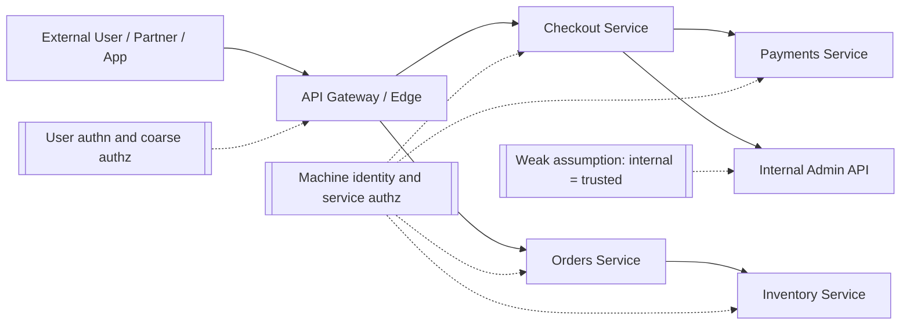
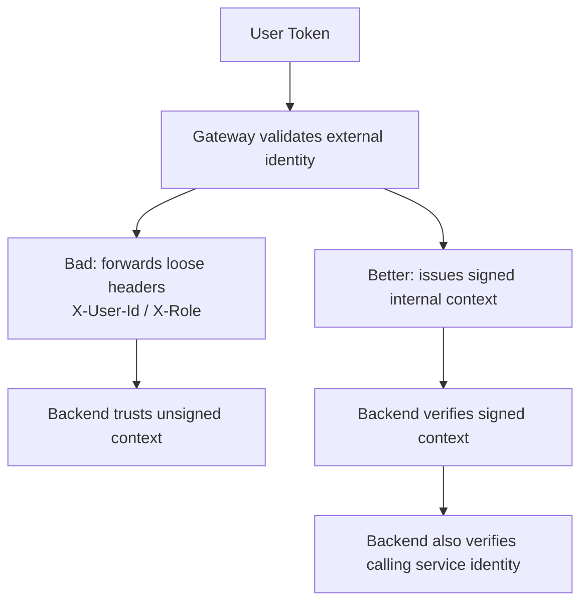
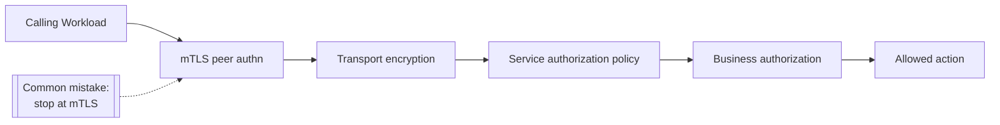

# Machine Identity Abuse

> **Difficulty:** Beginner → Advanced | **Category:** API Pentesting / Microservices Security

Machine identity abuse happens when **non-human credentials** — service accounts, workload tokens, mTLS certificates, mesh identities, CI/CD federation tokens, or internal API keys — are trusted **more broadly than intended**.

In modern API environments, that matters because many important calls are no longer made by browsers or mobile users. They are made by **services talking to other services**. If that trust path is weak, one compromised workload can become the API equivalent of a valid internal user with a badge, a keyring, and too many approvals.

A simple way to remember it:

> **Machine identity abuse is account takeover for services.**

---

## Table of Contents

1. [Why Machine Identity Matters](#why-machine-identity-matters)
2. [Beginner Mental Model](#beginner-mental-model)
3. [What Counts as a Machine Identity?](#what-counts-as-a-machine-identity)
4. [Common Machine Identity Mechanisms](#common-machine-identity-mechanisms)
5. [Where Trust Usually Breaks](#where-trust-usually-breaks)
6. [Identity Propagation and Translation](#identity-propagation-and-translation)
7. [mTLS, Service Meshes, and Their Limits](#mtls-service-meshes-and-their-limits)
8. [High-Signal Review Areas in Authorized Assessments](#high-signal-review-areas-in-authorized-assessments)
9. [Detection and Telemetry](#detection-and-telemetry)
10. [Defensive Design Guidance](#defensive-design-guidance)
11. [Common Misconceptions](#common-misconceptions)
12. [Quick Checklist](#quick-checklist)
13. [Further Reading](#further-reading)

---

## Why Machine Identity Matters

A microservices environment usually has at least two trust planes:

- **North-south traffic** — user, partner, or external client → gateway / edge API
- **East-west traffic** — service → service inside the platform

Security teams often put strong attention on the first plane and weaker attention on the second. That creates a common gap:

- the gateway authenticates the user
- the gateway enforces coarse policy
- internal services trust whatever arrives from the gateway or a peer service
- backend services do not re-check enough context

That is exactly where machine identity abuse appears.

### Why current guidance keeps pointing here

Multiple public sources converge on the same lesson:

| Source theme | What it emphasizes | Why it matters here |
|---|---|---|
| **OWASP API Security Top 10 (2023)** | Broken authentication, security misconfiguration, improper inventory management, unsafe consumption | Machine identity problems often combine all four |
| **OWASP Microservices Security Cheat Sheet** | Gateway controls alone are not enough; use defense in depth and service-level authorization | A valid internal caller still needs backend checks |
| **NIST SP 800-204 / 204A** | Secure service-to-service interaction, service mesh controls, monitoring, key management | Microservice trust is an architectural security problem, not only a code problem |
| **SPIFFE / SPIRE guidance** | Strong workload identity, short-lived credentials, trust domains | Workload identity needs explicit scoping and rotation |
| **Kubernetes guidance** | Prefer short-lived, rotating service account tokens; avoid long-lived static tokens | Static workload credentials are high-value abuse targets |
| **GitHub Actions OIDC guidance** | Replace duplicated long-lived cloud secrets with short-lived federation | CI/CD is part of the machine identity path too |

### Why the impact can be high

A single over-privileged service identity can expose:

- internal admin APIs
- cross-service data access
- background jobs and queue processors
- deployment or control-plane actions
- cloud or cluster APIs
- secrets or metadata services

That is why machine identity issues often look like **lateral movement through legitimate APIs**, not a classic one-endpoint exploit.

---

## 📊 Diagram — North-South vs East-West Trust



The key defender question is not only:

> "Can the user authenticate at the edge?"

It is also:

> **"Can every internal service prove who is calling, what that caller is allowed to do, and whether the call still makes sense after the gateway step?"**

---

## Beginner Mental Model

Think about a modern API platform like an office building:

- the **user badge** is the human identity
- the **delivery robot badge** is the machine identity
- the **front desk** is the API gateway
- the **internal floors** are backend services
- the **server room** is the admin or control-plane API

If the front desk only checks that the delivery robot belongs to the company, but any robot can then enter the server room, the building is not secure.

That is the same problem in APIs:

- a service may be **authenticated**
- but still **over-trusted**
- and may still be allowed to perform actions it should never perform

### Human identity vs machine identity

| Identity type | Typical example | Main security question |
|---|---|---|
| **Human identity** | Browser session, mobile user token, SSO login | Is this person really who they claim to be? |
| **Application identity** | Public API key, OAuth client ID | Which software client is calling? |
| **Machine identity** | Service account, workload token, mTLS cert, SPIFFE ID | Which workload or service instance is calling? |
| **Mixed identity** | User token propagated through internal services | Which user initiated the action, and which service is acting on the user's behalf? |

In distributed systems, the most important errors often happen in the **mixed identity** case.

---

## What Counts as a Machine Identity?

A machine identity is any credential or verifiable attribute used by software to identify itself to another system.

### Common examples in real environments

| Mechanism | Example | Where it appears |
|---|---|---|
| **Service account** | `system:serviceaccount:payments:checkout` | Kubernetes workloads, controllers, jobs |
| **Workload certificate** | `spiffe://prod.example/payments/checkout` | Service mesh, workload identity systems, mTLS |
| **Service token / JWT** | signed token carrying service claims and scopes | Internal APIs, job workers, control-plane calls |
| **OAuth client credential** | non-user token from client credentials flow | partner integrations, background services |
| **Internal API key** | key shared between services or jobs | legacy internal APIs, cron jobs, webhook senders |
| **Federated OIDC token** | CI/CD job identity exchanged for cloud access | GitHub Actions, cloud deployment pipelines |
| **Cloud workload principal** | IAM role / service principal / managed identity | cloud APIs, storage, secret managers |

### Concrete identity examples

```text
Kubernetes service account:
system:serviceaccount:orders:worker

SPIFFE ID:
spiffe://prod.example/ns/orders/sa/worker

GitHub OIDC subject claim:
repo:org/repo:environment:prod

Cloud service principal:
checkout-api@prod-project.iam.example
```

These identities are different in format, but they all answer the same question:

> **What software component is making this call?**

---

## Common Machine Identity Mechanisms

Not all machine identities provide the same security properties.

| Mechanism | Strengths | Typical weakness | Important defender note |
|---|---|---|---|
| **Static API key** | Easy to deploy, easy to integrate | Long-lived, easy to copy, often poorly scoped | Good for compatibility, weak for high-trust internal use |
| **Service JWT / bearer token** | Rich claims, easy to pass between services | Replay risk if stolen, scope drift, validation mistakes | Strong only if expiry, audience, issuer, and scopes are enforced |
| **OAuth client credentials** | Standardized, auditable, revocable | Can still become over-broad or long-lived in practice | Better than shared secrets when well-governed |
| **mTLS certificate** | Strong mutual authn, transport encryption, server and client identity | Teams assume authn automatically means authz | Identity proof is not the same as action approval |
| **SPIFFE X.509-SVID** | Short-lived workload identity, good for automated rotation | Requires trustworthy issuance and clear trust domains | Excellent for workload identity when operationally mature |
| **SPIFFE JWT-SVID** | Useful where cert-based identity is hard | Token replay concerns remain | Per SPIFFE guidance, X.509 is usually preferred when possible |
| **Federated OIDC token** | Short-lived, no stored cloud secret, strong provenance | Trust policy mistakes can over-issue access | Excellent for CI/CD and workload federation if claims are tightly matched |

### Security properties to compare

| Property | Questions to ask |
|---|---|
| **Lifetime** | Is it short-lived or effectively permanent? |
| **Rotation** | Is rotation automatic, manual, or mostly never done? |
| **Replay resistance** | If copied, can it be used elsewhere? |
| **Scope** | What exact service actions, APIs, or resources does it permit? |
| **Audience binding** | Is it meant for one API or many? |
| **Revocation** | Can defenders disable it quickly? |
| **Observability** | Can defenders see where it was issued and used? |
| **Trust root** | Who signs it, validates it, and distributes trust bundles? |

### The goal is not "more credentials"

The goal is:

- fewer long-lived secrets
- stronger identity proof
- narrower scopes
- clearer trust domains
- better visibility

That is why current guidance consistently pushes toward **short-lived, automatically rotated, strongly bound identities**.

---

## Where Trust Usually Breaks

Machine identity abuse rarely starts with a magical bypass. It usually starts with a bad trust assumption.

### High-value failure patterns

| Failure pattern | What it looks like | Why it is dangerous |
|---|---|---|
| **Internal equals trusted** | Any internal service can call sensitive backend APIs | One foothold becomes broad lateral movement |
| **Gateway-only enforcement** | Edge checks auth, backend assumes request was already approved | Alternate internal paths bypass intended controls |
| **Over-scoped service identity** | Service token or cert grants broad access across domains | Compromise of one workload exposes many services |
| **Blind identity forwarding** | Downstream services trust user headers or peer assertions without signed provenance | Caller can inherit authority it did not truly earn |
| **Stale credentials** | Old tokens, keys, certificates, or service accounts still work | Forgotten trust becomes exploitable trust |
| **Weak audience / issuer validation** | Internal services accept tokens not meant for them | Cross-service token reuse becomes possible |
| **Permissive mesh mode** | mTLS or policy is optional rather than enforced | Legacy/plaintext or unauthenticated traffic survives |
| **Identity-rich, policy-poor design** | System knows who the caller is but not what it may do | Authentication succeeds, authorization fails |
| **Inventory drift** | Old services, sidecars, jobs, and admin endpoints remain reachable | Defenders do not know all trust paths |

### What abuse often looks like in practice

From a defender's viewpoint, machine identity abuse often appears as one of these patterns:

1. A workload gains access to a service credential it should not have.
2. The stolen or reused identity is accepted by another service.
3. The receiving service enforces **who** loosely and **what** even more loosely.
4. The call looks legitimate because it uses a valid internal principal.

That is why this problem can be difficult to detect with simple "invalid login" thinking.

---

## Identity Propagation and Translation

Microservices often need to pass identity context from one layer to another.

That creates two distinct questions:

1. **Which service is calling?**
2. **On whose behalf is it calling?**

Those are not the same thing.

### Example request chain

```text
User authenticates at the gateway
→ Gateway validates user token
→ Checkout service calls Payments service
→ Payments service needs both:
   - service identity of Checkout service
   - user/business context for the requested action
```

If the backend only sees a loose header like `X-User-Role: admin` or blindly trusts a forwarded user token, the trust chain is weak.

### Safer mental model

OWASP's microservices guidance strongly favors **controlled identity propagation**, not arbitrary header trust.

| Pattern | Risk level | Why |
|---|---|---|
| **Plain forwarded user headers** | High risk | Downstream services must trust upstream behavior completely |
| **Self-signed or locally invented internal claims** | High risk | Easy to over-trust or implement inconsistently |
| **Signed internal identity representation from trusted issuer** | Better | Preserves provenance if validation is consistent |
| **Separate machine identity + explicit user context** | Best common pattern | Distinguishes caller identity from delegated business context |

### Diagram — Identity Translation Done Well vs Poorly



### Practical rule

A backend service should ideally evaluate at least three things:

- **peer identity** — which service or workload made the call
- **request context** — which user, tenant, job, or workflow the action belongs to
- **action authorization** — whether that specific operation is allowed in this path

If any one of those is missing, trust tends to spread too far.

---

## mTLS, Service Meshes, and Their Limits

Service meshes are popular because they help standardize identity, encryption, policy distribution, and telemetry for east-west traffic.

NIST SP 800-204A describes service mesh as a strong way to apply security requirements consistently, and Istio's security model similarly separates:

- **peer authentication**
- **request authentication**
- **authorization policies**
- **audit / telemetry**

That separation is important because many teams stop after enabling mTLS and assume they are done.

They are not.

### What mTLS actually gives you

mTLS is extremely valuable. It can provide:

- mutual authentication between client and server workloads
- encryption in transit
- integrity protection
- a strong basis for workload identity

### What mTLS does **not** automatically solve

| Control problem | Does mTLS solve it by itself? | Why not |
|---|---|---|
| Prove the peer is a known workload | **Yes, if configured correctly** | That is core mTLS value |
| Decide whether that workload should call this API | **No** | That is authorization |
| Limit business actions by role, tenant, or workflow | **No** | Needs application or policy-layer logic |
| Stop misuse of a valid but over-scoped identity | **No** | Valid identity can still be too powerful |
| Remove legacy direct paths that bypass mesh controls | **No** | Architecture and routing still matter |
| Prevent abuse of leaked bearer tokens outside the TLS session | **No** | mTLS does not fix application-layer token replay |

### Diagram — mTLS Is a Layer, Not the Whole Stack



### Common service mesh gaps

| Gap | Example defender concern |
|---|---|
| **Permissive mode left enabled** | Plaintext traffic still accepted during or after migration |
| **Sidecar bypass path** | Direct pod-to-pod or host-network path exists outside intended enforcement |
| **Identity not mapped to policy** | Service identity is known but not used in authz decisions |
| **Shared service account across many workloads** | One identity represents too much of the environment |
| **Weak trust-domain separation** | Staging and production identities are closer than they should be |
| **Telemetry without decision quality** | Logs show connections but not whether the action should have been allowed |

### Easy way to remember

> **mTLS answers “who is on the wire?”**
>
> **Authorization must still answer “what may this caller do here?”**

---

## High-Signal Review Areas in Authorized Assessments

The goal in an authorized assessment is not to "attack the mesh" blindly.

The goal is to map whether machine trust is:

- well identified
- well scoped
- well enforced
- well rotated
- well monitored

### 1. Identity inventory

Build an inventory of non-human identities used by the API platform:

- service accounts
- mesh identities
- OAuth clients
- internal API keys
- queue / job worker identities
- CI/CD workload identities
- cloud principals used by services

A missing inventory is already a risk signal because it usually correlates with **API9: Improper Inventory Management**.

### 2. Issuance and lifetime review

Ask:

- Who issues the credential?
- How long does it live?
- Is rotation automatic?
- Can it be revoked quickly?
- Are multiple environments sharing the same trust roots or service names?

Short-lived credentials are not magic, but long-lived hidden credentials are a very common problem.

### 3. Scope and audience review

Check whether each identity is bound to:

- a specific service or workload
- a specific API audience
- a specific namespace / trust domain / environment
- a small set of required actions

If one identity can read internal admin data, call unrelated services, and deploy infrastructure, the scoping model is already broken.

### 4. Gateway vs backend enforcement review

A critical review question is:

> **If the request reaches the backend through a different internal path, does the backend still make the right authorization decision?**

That is where many designs fail.

### 5. Identity propagation review

Review how user or workflow context is passed downstream:

- Is it signed or otherwise strongly verifiable?
- Is it created only by trusted issuers?
- Do downstream services validate it?
- Is service identity evaluated separately from user context?

### 6. Secret handling review

Machine credentials are often exposed by accident in:

- CI logs
- debug logs
- example configs
- environment variables
- old Helm charts / manifests
- error traces
- developer documentation
- long-lived secrets copied between systems

### 7. Mesh and runtime posture review

Check whether the platform has:

- strict or permissive peer authentication
- consistent authorization policies
- identity-aware telemetry
- clear separation of staging, test, and production trust
- direct service paths outside intended proxies

### Assessment questions worth asking

| Question | Why it is high signal |
|---|---|
| **Can one service identity reach unrelated internal APIs?** | Reveals over-broad trust and lateral movement risk |
| **Are backend services independently authorization-aware?** | Distinguishes defense in depth from gateway-only design |
| **Are old service accounts, keys, or certificates still valid?** | Finds stale trust that often survives migrations |
| **Is workload identity short-lived and automatically rotated?** | Shows operational maturity of machine authn |
| **Do logs show service principal, destination, action, and result?** | Determines whether abuse will be detectable |
| **Are admin or control-plane APIs callable by ordinary workloads?** | High-value impact path if allowed |

---

## Detection and Telemetry

Good machine identity security is not only prevention. It is also **explainability**.

If a service called something sensitive, defenders should be able to answer:

- which workload identity made the call
- from which namespace / environment / cluster / runner
- using which credential type
- on whose behalf, if relevant
- against which destination
- for which action
- with what policy result

### High-value telemetry fields

| Telemetry field | Why it matters |
|---|---|
| **Source principal** | Tells you which workload identity initiated the call |
| **Destination service / API** | Shows lateral movement path |
| **Requested action** | Distinguishes harmless read from privileged mutation |
| **User / tenant context** | Critical for mixed human + machine flows |
| **Token issuer / audience / subject** | Helps catch wrong-token acceptance |
| **Certificate subject / SPIFFE ID** | Useful for mTLS identity review |
| **Policy decision** | Separates allowed from blocked attempts |
| **Correlation ID / trace ID** | Lets defenders reconstruct multi-service call chains |
| **Credential age / issuance time** | Helpful for spotting stale or anomalous tokens |

### Detection patterns defenders care about

| Pattern | Why it is suspicious |
|---|---|
| **A service identity calling a new destination it has never used before** | Possible lateral movement or drift |
| **One service identity suddenly touching admin APIs** | Indicates over-scope or abuse |
| **Calls from identities tied to deprecated jobs or retired services** | Suggests stale credentials or hidden workloads |
| **Traffic accepted in plaintext or permissive mode where strict mTLS is expected** | Indicates control bypass or unfinished migration |
| **Tokens intended for one audience accepted by multiple services** | Signals weak audience validation |
| **High-volume internal calls with valid authn but unusual workflow context** | Looks like business-flow abuse using legitimate machine trust |

### Logging quality matters

OWASP's microservices guidance emphasizes correlation and structured logging for exactly this reason.

A log line that only says:

```text
request allowed
```

is weak.

A stronger record looks more like:

```text
source_principal=spiffe://prod.example/orders/worker
source_namespace=orders
user_context=tenant:acme / user:12345
requested_action=refund:create
destination_service=payments-api
policy_result=deny
trace_id=8d3c...
```

That kind of logging turns "internal traffic" from a blind spot into something defenders can reason about.

---

## Defensive Design Guidance

Machine identity security improves when teams treat service trust like a real authorization domain, not just a networking feature.

### 1. Separate authentication from authorization

- Authenticate the calling workload strongly.
- Authorize the action explicitly.
- Do not let "valid internal principal" become a blanket permission.

### 2. Prefer short-lived, automatically rotated credentials

Public guidance from SPIFFE, Kubernetes, and GitHub's OIDC model all push in the same direction:

- reduce stored long-lived secrets
- rotate automatically
- bind identities tightly to context

### 3. Scope identities narrowly

Bind identities to:

- one service or workload role
- one environment
- one trust domain
- minimal required APIs and actions

The best service identity is not the strongest one.

It is the **smallest useful one**.

### 4. Keep gateway enforcement, but do not stop there

The OWASP microservices guidance is clear on defense in depth:

- keep coarse policy at the gateway
- add service-level authorization
- preserve business-level checks in the application

That layered model survives alternate internal paths better than gateway-only designs.

### 5. Use signed internal identity context where needed

If downstream services need user or workflow context:

- generate it from a trusted issuer
- validate it downstream
- keep it internal only
- separate it from the calling service identity

### 6. Tighten service mesh posture

- move from permissive to strict modes where feasible
- remove bypass paths around policy enforcement points
- ensure identity actually feeds authorization policy
- separate trust domains cleanly across environments

### 7. Reduce unnecessary credential exposure

Examples of valuable hardening moves:

- disable automatic service account token mounting for pods that do not need it
- remove old API keys from configs and examples
- keep secrets out of logs
- replace duplicated CI/CD cloud secrets with federation where appropriate

#### Example — safer Kubernetes posture for a pod that does not need cluster API access

```yaml
apiVersion: v1
kind: Pod
metadata:
  name: reporting-worker
spec:
  serviceAccountName: reporting-worker
  automountServiceAccountToken: false
```

That is not a universal default for every workload, but it illustrates the principle:

> **Only mount machine credentials where they are actually needed.**

### 8. Build machine identity governance, not just mechanisms

Good governance includes:

- ownership of every non-human identity
- issuance source and trust root tracking
- documented purpose and allowed destinations
- age and rotation visibility
- retirement workflows for old identities

Without governance, even technically strong identity systems drift.

---

## Common Misconceptions

| Misconception | Reality |
|---|---|
| **"Internal traffic is trusted traffic."** | Internal paths are often exactly where over-trust accumulates |
| **"mTLS means the service is secure."** | mTLS proves a peer identity and encrypts transport; it does not replace authorization |
| **"If the gateway validated the request, the backend does not need to."** | Backend services still need service-aware and business-aware authorization |
| **"Short-lived tokens remove the need for logging and scope controls."** | A short-lived but over-scoped token can still do serious damage |
| **"Workload identity only matters in Kubernetes."** | It also matters in CI/CD, cloud federation, serverless, VMs, and legacy internal APIs |
| **"Only user tokens cause account takeover risk."** | Compromised service identities can create broader and quieter impact than user accounts |
| **"A service mesh automatically fixes trust propagation."** | Meshes help standardize transport identity, but business context and backend policy still need design |

---

## ✅ Quick Checklist

```text
[ ] Inventory all machine identities used by the API platform
[ ] Distinguish north-south identity from east-west identity
[ ] Confirm which services rely on gateway-only enforcement
[ ] Verify backend services still authorize sensitive actions independently
[ ] Review service token, certificate, and service account lifetimes
[ ] Check for over-scoped identities that can reach unrelated internal APIs
[ ] Validate issuer, audience, and scope checks for internal bearer tokens
[ ] Review how user context is propagated between services
[ ] Confirm mesh posture is strict where expected and not easily bypassed
[ ] Look for stale service accounts, old keys, and deprecated workloads still trusted
[ ] Confirm logs record source principal, destination, action, and policy result
[ ] Report trust-domain, environment, or inventory drift clearly
```

---

## Further Reading

These public references are especially useful for keeping this topic current and grounded in real architecture guidance:

- **OWASP API Security Top 10 (2023)** — overview of Broken Authentication, Security Misconfiguration, Improper Inventory Management, and Unsafe Consumption of APIs  
  https://owasp.org/API-Security/editions/2023/en/0x11-t10/

- **OWASP Microservices Security Cheat Sheet** — guidance on gateway vs service-level authorization, identity propagation, service-to-service authentication, and logging  
  https://cheatsheetseries.owasp.org/cheatsheets/Microservices_Security_Cheat_Sheet.html

- **NIST SP 800-204 — Security Strategies for Microservices-based Application Systems** — architectural security strategies for API gateways, service meshes, and service trust  
  https://csrc.nist.gov/pubs/sp/800/204/final

- **NIST SP 800-204A — Building Secure Microservices-based Applications Using Service-Mesh Architecture** — deployment guidance for service-mesh security infrastructure  
  https://csrc.nist.gov/pubs/sp/800/204/a/final

- **SPIFFE Overview** — why dynamic distributed systems need first-class workload identity  
  https://spiffe.io/docs/latest/spiffe-about/overview/

- **SPIFFE Concepts** — workload identity, trust domains, SVIDs, trust bundles, and why X.509-SVIDs are often preferred over JWT-SVIDs  
  https://spiffe.io/docs/latest/spiffe-about/spiffe-concepts/

- **Istio Security Concepts** — peer authentication, request authentication, authorization policy, identity provisioning, and trust bundles  
  https://istio.io/latest/docs/concepts/security/

- **Kubernetes Service Accounts** — service-account behavior, projected tokens, automatic rotation, and why long-lived tokens are discouraged  
  https://kubernetes.io/docs/concepts/security/service-accounts/

- **GitHub Actions OIDC** — practical example of replacing long-lived deployment secrets with short-lived federated machine identity  
  https://docs.github.com/en/actions/concepts/security/openid-connect

---

## Bottom Line

Machine identity abuse is what happens when a platform knows **that a service is real**, but fails to decide **what that service should actually be allowed to do**.

For authorized testers and defenders, the right mindset is:

- inventory the non-human identities
- map where trust is translated or propagated
- verify that backends enforce their own rules
- reduce lifetime and scope of machine credentials
- make east-west decisions visible in logs and telemetry

If user authentication is the front door of API security, **machine identity is the hallway system behind it**. That hallway needs locks too.
