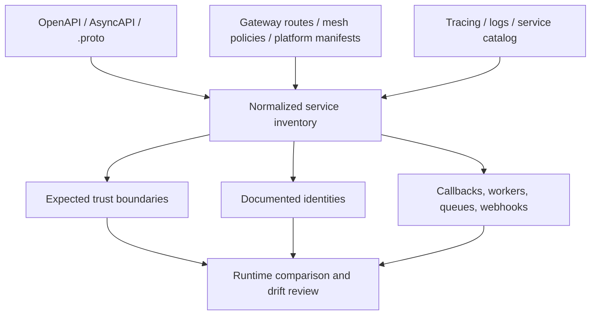
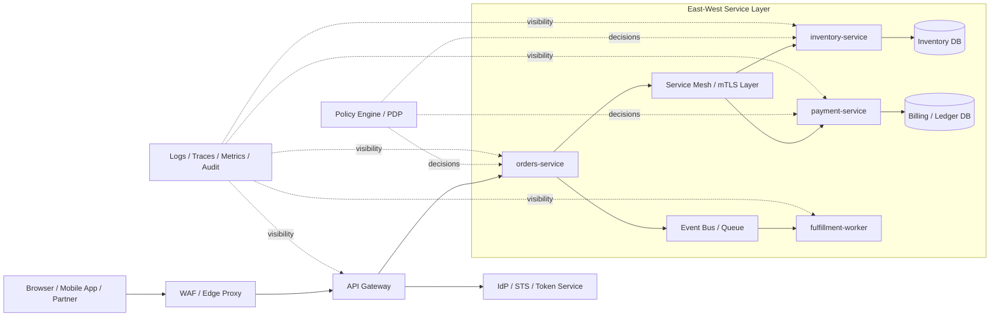
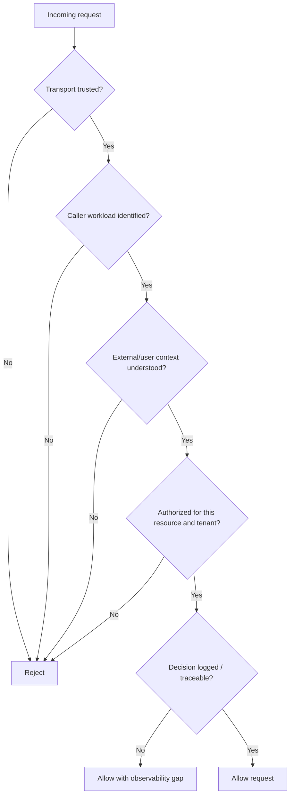
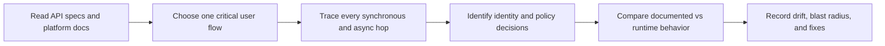
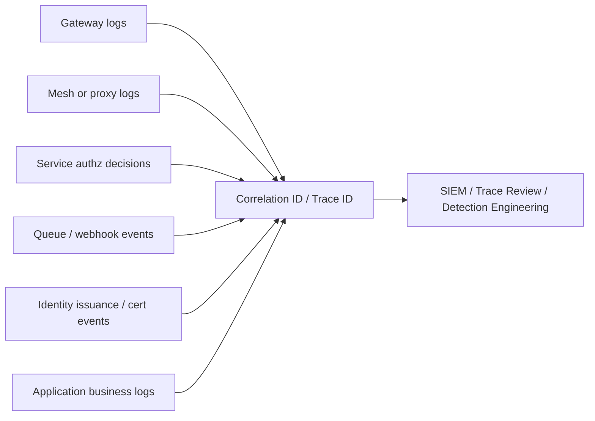

# Microservices Security

> **Microservices security is the practice of making sure many small APIs do not quietly trust each other too much. In authorized API testing, the job is to verify identity, authorization, and observability at every hop — not just at the edge.**

> **Authorized use only:** This note is for defensive review, architecture assessment, and approved validation in environments you own or are explicitly authorized to test. Favor low-impact confirmation, configuration review, tracing, and staging validation over intrusive probing.

---

## Table of Contents

1. [What Is It? (Beginner Explanation)](#1-what-is-it-beginner-explanation)
2. [Start With the API Spec and Platform Artifacts](#2-start-with-the-api-spec-and-platform-artifacts)
3. [Why Microservices Change the Security Model](#3-why-microservices-change-the-security-model)
4. [How a Secure Request Should Flow](#4-how-a-secure-request-should-flow)
5. [Control Layers That Matter Most](#5-control-layers-that-matter-most)
6. [Common Failure Patterns](#6-common-failure-patterns)
7. [A Safe Authorized Review Workflow](#7-a-safe-authorized-review-workflow)
8. [Detection and Telemetry](#8-detection-and-telemetry)
9. [Hardening Principles](#9-hardening-principles)
10. [Quick Review Checklist](#10-quick-review-checklist)
11. [References](#11-references)

---

## 1. What Is It? (Beginner Explanation)

A **microservices architecture** breaks one application into many smaller services.

Instead of one large backend doing everything, you might have:

- `api-gateway`
- `auth-service`
- `orders-service`
- `inventory-service`
- `billing-service`
- `notification-worker`
- `search-service`

Each service usually exposes an API, consumes an API, or both.

That creates speed and scale benefits, but it also creates a security problem:

> **One user action may turn into many trusted internal API calls.**

If those internal hops are weakly protected, a system that looks secure from the outside can still fail badly on the inside.

### Easy analogy

A monolith is like a single building with one guarded front desk.

A microservices platform is more like a campus:

- one main gate at the street,
- many buildings behind it,
- staff-only doors,
- internal mailrooms,
- badge readers,
- service corridors,
- and shared utilities.

If security exists only at the front gate, anyone who gets inside can move too freely.

### Three terms to understand immediately

| Term | Plain-English meaning | Why it matters |
| --- | --- | --- |
| **North-south traffic** | Requests entering or leaving the platform | Edge auth, gateway controls, public exposure |
| **East-west traffic** | Service-to-service traffic inside the platform | Internal trust is where many serious failures happen |
| **Workload identity** | The identity of the calling service, pod, job, or sidecar | Internal APIs must know *which service* is calling, not just that traffic came from “inside” |

### The most important beginner mental model

In a microservices request path, you may have **multiple identities at once**:

1. the **end user** or external client,
2. the **calling workload** or service,
3. the **resource or tenant context** being accessed.

Good systems keep these separate.

Weak systems blur them together.

That is where confused-deputy problems, tenant leaks, over-trusted internal calls, and authorization drift appear.

---

## 2. Start With the API Spec and Platform Artifacts

For microservices work, the API specification is still your starting point — but it is rarely the whole story.

A public-facing **OpenAPI** file may describe the edge contract well while saying little about:

- internal service-to-service APIs,
- event-driven flows,
- queue consumers,
- service mesh policy,
- direct backend exposure,
- or older internal versions still deployed.

So the right approach is:

> **Use the API spec as the baseline contract, then expand it with platform artifacts until you have a real trust-boundary map.**

### Artifact types that matter

| Artifact | What it gives you | Why it matters in microservices |
| --- | --- | --- |
| **OpenAPI / Swagger** | Public and internal HTTP routes, auth expectations, versions, callbacks | Baseline route inventory and documented security assumptions |
| **AsyncAPI / event schemas** | Topics, channels, producers, consumers, message fields | Event-driven surfaces are easy to forget and hard to monitor |
| **`.proto` files / gRPC reflection docs** | Service names, methods, messages | Internal RPC surfaces often carry strong trust assumptions |
| **Gateway config** | Published routes, auth filters, rate limits, header transforms | Shows what is protected at the edge and what may be bypassable |
| **Service mesh policy** | mTLS mode, workload identity, authorization policy, sidecar behavior | Reveals whether east-west trust is strict, permissive, or inconsistent |
| **Kubernetes / platform manifests** | Services, ingress, network policies, service accounts, namespaces | Shows reachability, segmentation, and identity anchors |
| **Tracing and logs** | Real runtime call chains | Helps detect undocumented service-to-service paths |
| **Service catalog / CMDB / ownership data** | Team ownership and lifecycle state | Critical for remediation, deprecation, and inventory accuracy |

### What to extract from the API spec first

Even if you already know OpenAPI well, these fields become especially important in a microservices environment:

| OpenAPI area | Why it matters here |
| --- | --- |
| `servers` | Tells you hosts, base paths, environments, regional endpoints |
| `paths` + methods | Gives the declared external surface |
| `security` and `securitySchemes` | Shows expected auth at the edge |
| `tags` / operation grouping | Often reveals admin, partner, internal, or beta functions |
| `deprecated: true` | Strong signal for version drift and forgotten services |
| `callbacks` / `webhooks` | Adds secondary or outbound API surfaces |
| schemas and examples | Shows tenant fields, service IDs, role names, and object boundaries |

### Small OpenAPI example

A tiny fragment like this already tells you a lot:

```yaml
openapi: 3.1.0
servers:
  - url: https://api.example.com
components:
  securitySchemes:
    bearerAuth:
      type: http
      scheme: bearer
      bearerFormat: JWT
security:
  - bearerAuth: []
paths:
  /orders/{id}:
    get:
      operationId: getOrder
      tags: [orders]
      responses:
        '200':
          description: Order returned
```

From a microservices-security perspective, you would immediately ask:

- Does `orders-service` also expose a **direct internal route** outside the gateway?
- Does the runtime use the **same authorization model** shown in the spec?
- Which downstream services does this route call?
- Is tenant context enforced only at the gateway, or again inside the service?
- Are callbacks, workers, or partner flows also involved?

### Mental model — build a layered inventory



### The key lesson

In a monolith, one route often maps to one codebase.

In microservices, one edge route may fan out into:

- several internal APIs,
- an identity translation step,
- policy-engine lookups,
- one or more queues,
- and multiple data stores.

That is why **API spec review** must become **service-flow review**.

---

## 3. Why Microservices Change the Security Model

Microservices do not create entirely new security principles.

They change **where security decisions happen**, **how often they happen**, and **how easy they are to get out of sync**.

### Monolith vs microservices from a security-testing viewpoint

| Question | Monolith tendency | Microservices tendency | Security consequence |
| --- | --- | --- | --- |
| Where is auth enforced? | Often in one app layer | At gateway, proxy, service, and business logic layers | Drift between layers becomes common |
| How many internal trust boundaries exist? | Fewer | Many | Each hop can introduce identity or authorization mistakes |
| How easy is inventory? | Easier to map | Harder to map | Hidden services and old versions persist longer |
| How many protocols appear? | Often mostly HTTP | HTTP, gRPC, events, queues, webhooks | More parsers, more contracts, more blind spots |
| How does one request behave? | Simpler path | Fan-out across many services | Resource exhaustion and tracing problems increase |
| What is the blast radius of one weak identity? | Often local | Potentially platform-wide | Weak east-west trust enables lateral movement |
| How is policy updated? | In one codebase or shared middleware | Through gateways, meshes, libraries, sidecars, and config | Policy drift is easy to create |

### Why zero trust matters more here

NIST SP 800-207 emphasizes that trust should not be granted based only on network location.

That idea matters enormously in microservices because platforms often still carry old assumptions like:

- “traffic from this namespace is trusted,”
- “anything behind the gateway is internal,”
- “mesh membership means authorization,”
- “service account possession implies business permission.”

Those assumptions are exactly what mature adversaries try to exploit.

### Why NIST SP 800-204 and 800-204A matter here

NIST’s microservices guidance highlights that distributed APIs need more than just authentication at the public edge. Secure microservices also need:

- secure service discovery,
- service-to-service authentication,
- authorization,
- secure communication,
- load balancing and throttling,
- monitoring,
- and resilient platform controls.

In other words:

> **Microservices security is not one control. It is a chain of controls that must agree with each other.**

---

## 4. How a Secure Request Should Flow

A secure microservices request is not just “user authenticated at the gateway.”

A secure request path should answer, at each hop:

1. **Who is the user or originating client?**
2. **Which workload is calling right now?**
3. **Is this caller allowed to perform this action on this resource for this tenant?**
4. **Can we audit the decision later?**

### Big-picture architecture



### Three identity layers that should remain distinct

| Identity layer | Typical examples | What the receiving service must decide |
| --- | --- | --- |
| **External identity** | user ID, customer account, partner application, API consumer | Which user or client originated the request? |
| **Workload identity** | service account, mTLS certificate, SPIFFE ID, sidecar identity | Which service is calling me right now? |
| **Business context** | tenant ID, order owner, region, data sensitivity, requested action | Is this action allowed on this object in this context? |

If a platform mixes these together, problems follow quickly.

Examples:

- a service treats “valid mTLS” as equivalent to “authorized for all tenant data,”
- a downstream API trusts a user role passed in a header by another service,
- a worker replays old business context without validating freshness or scope,
- a service account with broad infrastructure rights is reused for multiple apps.

### A healthy decision chain



### Questions to ask at each hop

| Question | Good answer | Red flag |
| --- | --- | --- |
| How is the caller identified? | mTLS, SPIFFE, signed internal token, validated JWT | Source IP, namespace name, or header alone |
| How is user context propagated? | Signed, internal-only, narrow, auditable | Raw external token reuse everywhere or self-asserted headers |
| Where is authorization enforced? | At gateway *and* service *and* business rule layer where needed | Only at edge or only in one shared proxy |
| Is the token or certificate meant for this audience? | `aud`, trust domain, SAN, SPIFFE ID, scope all checked | Any valid token/cert is accepted everywhere |
| Can the decision be reconstructed later? | Correlation ID + trace + authz decision logs | Missing hop-level logging or trace breaks |

---

## 5. Control Layers That Matter Most

Microservices security is easiest to understand as stacked control layers.

### Core control stack

| Layer | Typical controls | Why it matters | Common failure |
| --- | --- | --- | --- |
| **Edge / gateway** | TLS termination, JWT/OAuth validation, coarse authz, rate limits, routing | Protects north-south traffic and public contract | Teams assume gateway protection is enough |
| **Transport and workload identity** | mTLS, SPIFFE/SPIRE, service accounts, cert rotation | Proves which workload is calling which service | Internal traffic treated as trusted by location only |
| **Service-level authorization** | Policy engine, embedded PDP, code-level business checks | Enforces fine-grained rules close to the resource | Broad gateway allowlist, weak backend authorization |
| **Identity propagation** | Internal signed identity structure, scoped claims, correlation IDs | Lets downstream services know the origin safely | User roles or tenant IDs forwarded in spoofable headers |
| **Async/event layer** | Queue auth, webhook signatures, schema validation, idempotency, replay controls | Events are APIs too | Producers and consumers trust topic access too broadly |
| **Segmentation** | Network policies, egress controls, namespace isolation, firewall rules | Limits blast radius and lateral movement | Flat east-west reachability across the cluster |
| **Secrets and key lifecycle** | Short-lived credentials, automated rotation, secret stores, KMS/HSM | Reduces long-lived machine credential abuse | Shared secrets in images, CI, or config maps |
| **Observability and audit** | Structured logs, traces, correlation IDs, policy-decision logs | Makes drift and misuse detectable | Logging gaps between gateway, mesh, and services |
| **Resilience controls** | Timeouts, retries, circuit breakers, throttling, bulkheads | Prevents one weak flow from cascading | Fan-out endpoints amplify DoS or cost shocks |

### Network segmentation is necessary but not sufficient

Kubernetes NetworkPolicies are extremely useful, but they operate at **network** scope.

They answer questions like:

- which pods may connect,
- from which namespace,
- on which port.

They do **not** answer:

- whether this service should access this customer’s data,
- whether the token audience is correct,
- whether the user is allowed to approve a refund,
- whether a queue message is fresh or replayed.

So a good rule of thumb is:

> **Network policy reduces reachability. Authorization decides legitimacy. You need both.**

### Common identity patterns for east-west APIs

| Pattern | Good fit | Main weakness | Defensive preference |
| --- | --- | --- | --- |
| **Static API key** | Legacy service integrations | Long-lived, replayable, weak attribution | Keep narrow, rotate often, replace where possible |
| **OAuth 2.0 client credentials** | Machine-to-machine API access | Bearer replay, overbroad scope, wrong audience | Short TTL, strict scopes, audience validation |
| **mTLS-bound OAuth tokens (RFC 8705)** | Strong service auth where certs are manageable | TLS termination and certificate lifecycle complexity | Good for higher-trust internal APIs |
| **DPoP-bound tokens (RFC 9449)** | Sender-constrained HTTP where mTLS is impractical | Client complexity and uneven ecosystem support | Useful selectively; not a universal replacement |
| **SPIFFE / SPIRE X.509 or JWT SVID** | Dynamic workloads in heterogeneous environments | Trust-domain and policy-mapping mistakes | Strong platform identity with automated rotation |
| **Internal signed identity token / “passport”** | Propagating user context inside the platform | Dangerous if exposed externally or over-trusted | Keep internal-only, signed, scoped, and short-lived |

### Why policy decoupling matters

OWASP and OPA both point toward the same lesson:

- keep **policy logic** centralized or standardized enough to stay consistent,
- but do not pretend one gateway or one proxy can express every business rule.

That usually leads to three layers:

1. **coarse policy** at the edge,
2. **fine-grained policy** at the service or sidecar level,
3. **business-specific authorization** in application logic.

---

## 6. Common Failure Patterns

Microservices failures are often not dramatic “one bug” stories.

They are usually **trust mismatches** between platform layers.

### High-signal pattern summary

| Pattern | What it looks like | Why it matters |
| --- | --- | --- |
| Edge-only security | Gateway checks auth, backend service does not | Direct backend reachability becomes dangerous |
| Over-trusted east-west traffic | Any internal workload can call any internal API | One foothold turns into lateral movement |
| Identity propagation confusion | Headers or external tokens reused inside | Downstream services trust unverified user context |
| Machine identity sprawl | Shared service accounts, static secrets, broad scopes | Weak attribution and easy credential abuse |
| Async blind spots | Queues, callbacks, and workers lack equivalent controls | Hidden business flows bypass normal review |
| SSRF into internal APIs | User-controlled fetchers can reach trusted services | External input gains internal reach |
| Policy drift | Gateway, mesh, and app code disagree | Security is inconsistent and hard to reason about |
| Tenant-context drift | One service loses or changes tenant binding | Cross-tenant leakage and confused deputy issues |
| Inventory and version drift | Deprecated or shadow services remain live | Old controls and hidden routes survive |
| Resource amplification | One request fans out too widely or retries too aggressively | Cost spikes, instability, and partial outages |

### 6.1 Edge-only authorization and backend bypass

This is one of the most common and most dangerous patterns.

The gateway may validate user authentication perfectly, but if an internal service is reachable through:

- a misconfigured ingress,
- an internal load balancer,
- a sidecar bypass,
- a preview hostname,
- or an SSRF-capable function,

then the backend still needs its **own** trust checks.

**Safe validation focus:**

- review whether internal services are reachable outside the intended path,
- confirm internal services reject unauthenticated or wrongly authenticated requests,
- verify trusted identity headers are stripped or rewritten at the edge,
- check that direct service exposure is explicitly controlled and documented.

### 6.2 Over-trusted east-west traffic

A platform may encrypt east-west traffic but still trust it too broadly.

Typical weak assumptions:

- “it came from our cluster, so it is okay,”
- “the namespace is internal,”
- “mesh membership equals authorization,”
- “all service accounts in this environment are equivalent.”

This is where **strict workload identity** matters.

mTLS is valuable, but only if the receiving side actually checks the caller identity and maps it to policy.

**Safe validation focus:**

- confirm whether mTLS is `STRICT`, permissive, or inconsistently applied,
- review caller identity mapping from certificate, SAN, or SPIFFE ID to policy,
- verify plaintext fallback or trust-on-first-hop patterns do not exist in production,
- identify whether any namespace or workload can overreach by default.

### 6.3 Identity propagation mistakes

Downstream services often need user context, but the propagation method matters.

Weak patterns include:

- forwarding the original external access token everywhere,
- trusting `X-User-Role` or `X-Tenant-Id` from upstream services without strong verification,
- having every service mint its own “user context” structure,
- letting services modify identity claims without an authoritative signer.

OWASP’s microservices guidance recommends separating external tokens from internal identity representation where possible.

**Safe validation focus:**

- determine whether internal user context is signed by a trusted issuer,
- verify downstream services know which issuer and audience are valid,
- review whether internal identity material is ever exposed back to browsers or partners,
- check that user identity and service identity are evaluated independently.

### 6.4 Service identity sprawl and static secrets

Machine identity can become unmanageable very quickly.

Common warning signs:

- one client secret shared by many services,
- tokens with broad wildcard scopes,
- hardcoded credentials in CI/CD or container images,
- long-lived certificates or keys with weak rotation,
- shared Kubernetes service accounts for unrelated applications.

This weakens attribution and massively increases blast radius.

**Safe validation focus:**

- inventory which credentials identify which workload,
- review TTL, rotation, and revocation paths,
- confirm one service cannot silently impersonate another,
- prefer short-lived workload identities over shared static secrets.

### 6.5 Async blind spots: queues, webhooks, workers, and event buses

Many teams secure synchronous APIs better than asynchronous ones.

But a queue consumer or webhook handler is still part of the application’s trust chain.

Common gaps:

- topic-level access far broader than business need,
- no signature or origin validation for webhook-like deliveries,
- workers consuming messages without re-checking tenant or authorization context,
- weak replay controls,
- missing idempotency around sensitive actions.

**Safe validation focus:**

- map producers and consumers for critical topics,
- review message signing, schema validation, and replay protections,
- verify that sensitive actions are re-authorized or strongly contextualized downstream,
- check dead-letter queues and alerting for abuse or malformed message patterns.

### 6.6 SSRF and internal API reachability

Microservices often expose fetchers, importers, URL previewers, webhook senders, and callback validators.

If those components can reach:

- internal service DNS names,
- metadata services,
- mesh admin endpoints,
- control-plane services,
- or partner-only APIs,

then SSRF can become a bridge from a public input to a trusted internal boundary.

**Safe validation focus:**

- review egress policies and destination allowlists,
- confirm cloud metadata endpoints and internal admin endpoints are blocked where appropriate,
- verify fetcher-style components cannot reach arbitrary internal destinations,
- trace whether internal services treat such requests as fully trusted.

### 6.7 Policy drift between gateway, mesh, and service code

A mature microservices estate may have policy in many places:

- gateway route config,
- identity provider scopes,
- service mesh authorization policies,
- sidecar filters,
- embedded libraries,
- application code,
- data-layer row or tenant filters.

Drift happens when those layers disagree.

Examples:

- gateway says route is admin-only, backend does not,
- mesh allows all service accounts in a namespace, app expects narrow callers,
- service code checks role but not tenant,
- one environment still runs permissive defaults.

**Safe validation focus:**

- compare documented policy with effective runtime policy,
- review environment-specific overrides and “temporary” exceptions,
- check whether denial paths are consistent between layers,
- prefer one clear source of truth for shared decisions where practical.

### 6.8 Tenant-context drift and confused deputy problems

One service may legitimately act for many users or tenants.

That creates risk when a downstream service trusts the caller service too much and stops checking **which tenant or resource** is being accessed.

Typical causes:

- tenant ID dropped during internal fan-out,
- cache keyed only by object ID instead of tenant + object,
- worker retries using stale authorization context,
- internal admin service acting on behalf of callers without strong scoping.

**Safe validation focus:**

- trace tenant identity from edge to data access,
- confirm every service uses the same tenant-binding rules,
- review caching and batch-processing paths carefully,
- check for privileged internal services that can become confused deputies.

### 6.9 Inventory and version drift

OWASP API Security Top 10 highlights improper inventory management for a reason.

Microservices make it easy to accumulate:

- forgotten preview environments,
- region-specific variations,
- old gateway routes,
- admin or internal-only APIs exposed externally,
- deprecated versions that still have live credentials or data access.

**Safe validation focus:**

- compare current runtime inventory against documented specs and service catalogs,
- verify deprecation and retirement processes actually remove exposure,
- review whether old routes still accept current credentials,
- identify undocumented hosts, versions, and callback receivers.

### 6.10 Resource amplification and cascading failure

One edge request may trigger:

- many downstream API calls,
- expensive retries,
- queue bursts,
- third-party API consumption,
- and cache or database pressure.

So microservices security also includes **resource governance**.

A platform may be functionally correct but still unsafe if:

- batch size is effectively unbounded,
- fan-out is uncontrolled,
- retries multiply traffic during partial failure,
- rate limits exist only at the edge,
- one noisy tenant can exhaust shared internal dependencies.

**Safe validation focus:**

- identify high-fan-out endpoints and sensitive business flows,
- review per-tenant and per-service throttling,
- confirm timeouts, retries, and circuit breakers are intentionally configured,
- inspect whether internal workers can amplify failure faster than users can see it.

---

## 7. A Safe Authorized Review Workflow

The safest and highest-signal microservices review workflow is evidence-driven.

It relies more on **contracts, policy, traces, logs, and controlled validation** than on blind probing.

### Recommended workflow

| Step | Goal | Useful evidence |
| --- | --- | --- |
| **1. Build the baseline** | Define what should exist | OpenAPI, AsyncAPI, `.proto`, gateway config, service catalog |
| **2. Pick critical flows** | Focus on business-relevant paths | checkout, account access, billing, admin actions, partner sync |
| **3. Map trust boundaries** | Identify every hop that changes trust or identity | gateway, mesh, worker, queue, policy engine, data store |
| **4. Validate identity at each hop** | Confirm user and workload identity are both handled correctly | token docs, cert policy, SPIFFE IDs, trace metadata |
| **5. Compare policy layers** | Detect drift between edge, mesh, and service code | authz policies, code review, route config, test cases |
| **6. Review async and indirect paths** | Include queues, callbacks, background jobs, imports, webhooks | event schemas, topic ACLs, worker config, delivery logs |
| **7. Inspect observability** | Ensure bad decisions are visible and attributable | trace IDs, authz denials, mesh logs, audit events |
| **8. Document blast radius** | Explain impact if one trust boundary fails | dependency maps, ownership, data sensitivity, recovery notes |

### A practical review sequence



### What “safe validation” looks like here

In an authorized engagement, safer validation often means:

- using **approved test identities** instead of trying to coerce production identities,
- reviewing **configuration and traces** before sending many requests,
- validating **denial behavior** with bounded checks,
- confirming direct backend exposure through approved architecture review or narrow test paths,
- exercising queue and worker flows in staging or replay-safe ways,
- and stopping once the trust failure is demonstrated.

### Low-impact evidence sources

| Evidence source | Why it is high signal |
| --- | --- |
| Gateway route definitions | Show what is intentionally published |
| Service mesh authn/authz policy | Show east-west expectations directly |
| Distributed traces | Reveal real call chains and hidden dependencies |
| Authz decision logs | Prove where decisions are actually made |
| Service account / workload identity mapping | Connect workloads to permissions |
| Queue ACLs and consumer groups | Show who can publish and consume |
| Ownership metadata | Helps distinguish shadow service from managed service |

### Questions that produce strong findings

- Can the same business action be explained **hop by hop**?
- Does every service know **who** called it and **for whom** the action is being taken?
- If the gateway were bypassed, would the backend still reject invalid callers?
- Does the event-driven path enforce the same business rules as the synchronous path?
- If one workload identity is compromised, how far can it realistically move?
- Would operations detect misuse quickly, or only after user impact?

---

## 8. Detection and Telemetry

Microservices security without observability becomes guesswork.

You need enough telemetry to answer:

- who called whom,
- with which identity,
- for which resource or tenant,
- under which policy decision,
- and with what downstream effects.

### What strong telemetry looks like



### Signals worth monitoring closely

| Signal | What it may indicate |
| --- | --- |
| Unexpected service-to-service pairs | Shadow paths, lateral movement, or undocumented integrations |
| mTLS handshake failures or cert-validation errors | Misconfiguration, spoofing attempts, or broken rotation |
| Sudden spikes in `401` / `403` for one internal API | Policy drift, token misuse, or caller change |
| Requests carrying identity headers from untrusted sources | Header spoofing or gateway bypass |
| Unusual certificate or token issuance volume | Credential abuse, automation drift, or compromised workload |
| Missing correlation IDs in critical flows | Observability gap or path outside the intended platform |
| Dead-letter queue spikes or consumer rejects | Malformed, replayed, or unauthorized messages |
| One workload touching unusually many services | Overprivileged identity or lateral movement behavior |
| Changes to mesh mode, authz policy, or allow-all rules | Security posture regression |

### Logging guidance that matters here

OWASP’s microservices guidance stresses that logging should support accountability and traceability.

That usually means:

- each service emits structured logs,
- log shipping is decoupled from application logic,
- correlation IDs follow the call chain,
- central logging does not become a single blind spot,
- and sensitive data is minimized before shipping.

### Good questions for detection engineering

- Do we alert when a new service starts calling a sensitive internal API?
- Do we notice when mTLS shifts from strict to permissive?
- Can we distinguish user-originated traffic from background-job traffic?
- Do queue consumers log the originating request or correlation chain?
- Can we tell which policy denied a request and why?
- Are secrets, tokens, or PII accidentally present in traces or logs?

---

## 9. Hardening Principles

Microservices security improves when teams make a few architectural ideas non-negotiable.

### 9.1 No implicit trust based on network location

This is the core zero-trust lesson.

A request is not trustworthy just because it came from:

- an internal subnet,
- a Kubernetes cluster,
- a service mesh,
- or a VPN-connected segment.

Each receiving service should evaluate identity and authorization explicitly.

### 9.2 Defense in depth across layers

OWASP’s microservices guidance is clear here:

- **gateway** decisions are useful but coarse,
- **service-level** decisions are where fine-grained rules become enforceable,
- **business logic** still needs to enforce application-specific constraints.

A healthy model is:

- edge checks broad entry conditions,
- internal services check who is calling,
- business logic checks whether the requested action is allowed.

### 9.3 Prefer short-lived, automatable workload identity

Short-lived workload credentials reduce the damage of leakage and make rotation practical.

Strong options often include:

- mTLS with automated certificate rotation,
- SPIFFE/SPIRE-style workload identities,
- narrowly scoped client credentials,
- sender-constrained tokens where appropriate.

### 9.4 Separate external user tokens from internal identity propagation

Passing raw external tokens through every internal hop creates unnecessary coupling and exposure.

A safer pattern is often:

- edge validates the external token,
- platform derives a trusted internal representation,
- downstream services validate that internal representation,
- and the internal representation never leaks back out.

### 9.5 Externalize shared policy, but keep business rules close to data

OPA and similar PDP models help reduce drift, but business rules still belong near the business object.

A simple example of policy-as-code might look like this:

```rego
package authz

default allow := false

allow if {
  input.service == "orders"
  input.method == "GET"
  input.tenant == input.resource.tenant
  "orders.read" in input.scopes
}
```

That kind of rule is far easier to reason about than scattered, inconsistent checks.

### 9.6 Use segmentation and egress control to shrink blast radius

A secure platform should make it hard for one workload to talk to everything.

Good practice usually includes:

- namespace or environment separation,
- least-privilege NetworkPolicies,
- egress restrictions for fetchers and webhooks,
- and explicit controls around metadata or control-plane endpoints.

### 9.7 Treat async APIs as first-class citizens

Queue consumers, workers, callbacks, and webhooks should get the same design attention as synchronous APIs:

- producer identity,
- consumer identity,
- message integrity,
- replay resistance,
- idempotency,
- traceability,
- and authorization context.

### 9.8 Keep the inventory alive

Good inventory is not a document you write once.

It is an operational process that keeps track of:

- hosts,
- versions,
- services,
- queues,
- callbacks,
- owners,
- identities,
- and retirement state.

### 9.9 Protect the control plane too

In microservices, the most sensitive systems are often not the customer-facing ones.

High-value control points include:

- identity providers and token services,
- service mesh control planes,
- secret stores and KMS,
- admission controllers,
- policy repositories,
- CI/CD systems,
- and gateway configuration pipelines.

If those are weak, the entire service estate becomes easier to alter or impersonate.

### Hardening summary table

| Principle | Why it matters | Example outcome |
| --- | --- | --- |
| Explicit workload identity | Stops “internal = trusted” assumptions | Each service knows exactly which workload called it |
| Layered authorization | Prevents gateway-only trust | Backend still rejects invalid direct callers |
| Short-lived credentials | Limits credential abuse window | Rotated certs or tokens reduce long-term replay value |
| Policy consistency | Reduces drift | Gateway, mesh, and app rules align |
| Tight egress and segmentation | Shrinks lateral movement | SSRF or compromised jobs hit fewer destinations |
| Async security parity | Closes hidden trust gaps | Workers and webhooks enforce equivalent controls |
| Strong observability | Makes misuse visible | Hop-by-hop traces and authz logs support detection |
| Live inventory | Reduces shadow and legacy exposure | Old versions and preview services are retired cleanly |

---

## 10. Quick Review Checklist

- [ ] The API spec has been used as the baseline, and expanded with gateway, mesh, async, and platform artifacts.
- [ ] Public, partner, internal, async, and deprecated service surfaces are all included in the inventory.
- [ ] Every critical hop has a clear workload identity model.
- [ ] Internal services do not trust client-supplied identity headers without strong verification.
- [ ] Gateway security is backed by service-level authorization where needed.
- [ ] East-west traffic uses strong authentication and does not rely on network location alone.
- [ ] mTLS, if expected, is enforced consistently and not left in permissive mode by accident.
- [ ] User identity propagation is signed, scoped, and clearly separated from service identity.
- [ ] Tenant or resource ownership is validated at the service and data access layers.
- [ ] Queue consumers, workers, callbacks, and webhooks are reviewed as first-class API surfaces.
- [ ] Direct backend exposure and SSRF-reachable internal paths have been explicitly assessed.
- [ ] Service credentials are short-lived, attributable, and rotated automatically where possible.
- [ ] Network and egress controls reduce lateral movement and metadata/control-plane reachability.
- [ ] Correlation IDs and authz decision logs make the full path reconstructable.
- [ ] Old versions, preview hosts, and shadow services are tracked and retired intentionally.
- [ ] Timeouts, retries, throttling, and circuit breakers are reviewed for abuse resistance and failure amplification.

---

## 11. References

- [OWASP Microservices Security Cheat Sheet](https://cheatsheetseries.owasp.org/cheatsheets/Microservices_Security_Cheat_Sheet.html)
- [OWASP API Security Top 10 – 2023](https://owasp.org/API-Security/editions/2023/en/0x11-t10/)
- [OpenAPI Specification](https://swagger.io/specification/)
- [NIST SP 800-204 – Security Strategies for Microservices-based Application Systems](https://csrc.nist.gov/pubs/sp/800/204/final)
- [NIST SP 800-204A – Building Secure Microservices-based Applications Using Service-Mesh Architecture](https://csrc.nist.gov/pubs/sp/800/204/a/final)
- [NIST SP 800-207 – Zero Trust Architecture](https://csrc.nist.gov/pubs/sp/800/207/final)
- [SPIFFE Overview](https://spiffe.io/docs/latest/spiffe-about/overview/)
- [Istio Security Concepts](https://istio.io/latest/docs/concepts/security/)
- [Kubernetes Network Policies](https://kubernetes.io/docs/concepts/services-networking/network-policies/)
- [Open Policy Agent Documentation](https://www.openpolicyagent.org/docs/latest/)
- [RFC 8705 – OAuth 2.0 Mutual-TLS Client Authentication and Certificate-Bound Access Tokens](https://www.rfc-editor.org/rfc/rfc8705)
- [RFC 9449 – OAuth 2.0 Demonstrating Proof-of-Possession (DPoP)](https://www.rfc-editor.org/rfc/rfc9449)
