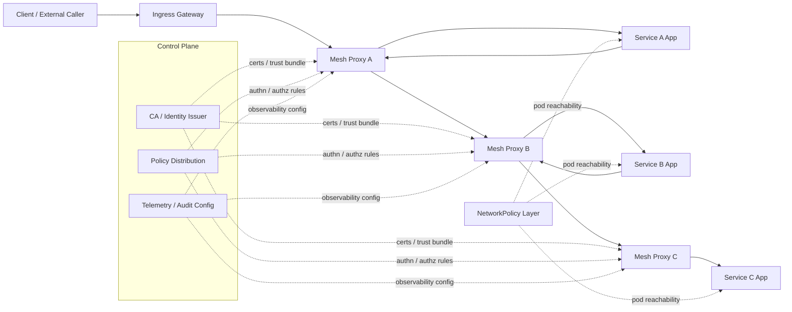
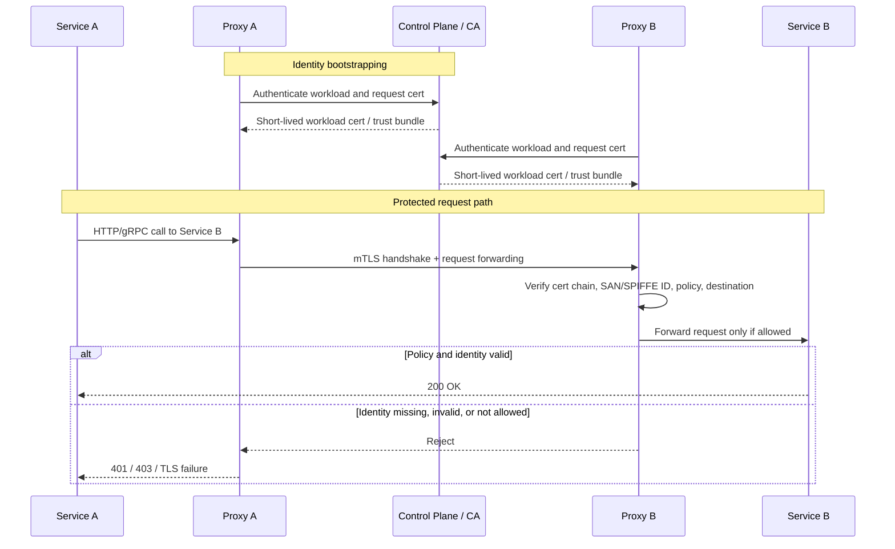

# Service Mesh Security

> **Module:** API Pentesting → Microservices Security  
> **Difficulty:** Intermediate → Advanced  
> **Focus:** Understand how service meshes secure east-west API traffic, what they do **not** solve, and how to validate them safely during **authorized** security testing.

---

## 1. Overview

A **service mesh** is an infrastructure layer that manages **service-to-service communication** inside distributed applications.

In practice, that usually means:

- a **proxy** next to each workload, or a transparent node-level proxy layer
- a **control plane** that distributes identity and policy
- **mutual TLS (mTLS)** for workload-to-workload traffic
- **authorization rules** for which service may call which other service
- **telemetry and audit data** about internal API traffic

For API security, a service mesh matters because many critical APIs are **not public-facing**. They are the internal APIs between:

- `api-gateway` → `users-service`
- `checkout-service` → `inventory-service`
- `orders-service` → `payments-service`
- `worker` → `notifications-service`

Those calls are often more trusted than internet-facing traffic.
If that trust is weak, an attacker who gains:

- SSRF into an internal network,
- a foothold in one pod,
- a stolen service credential,
- or access to an unmeshed workload

may be able to move laterally across internal APIs.

A good beginner sentence to remember is:

> **A service mesh tries to replace “trust the network” with “trust the verified workload identity.”**

---

## 2. Why It Matters to API Security

Service mesh security sits directly at the intersection of:

- **API authentication**
- **service-to-service authorization**
- **microservice trust boundaries**
- **east-west traffic visibility**
- **zero trust architecture**

NIST SP 800-207 describes zero trust as a model where there is **no implicit trust based only on network location**. That idea is central to service meshes.

Without strong internal controls, organizations often rely on assumptions such as:

- “it is inside Kubernetes, so it is trusted”
- “only the gateway can reach that backend”
- “this header came from a trusted proxy”
- “that namespace is internal, so auth can be relaxed”

Those assumptions fail regularly in real incidents.

### OWASP API Security connection

Mesh weaknesses often contribute to or amplify:

| OWASP API Risk | Why a mesh matters |
| --- | --- |
| **API2: Broken Authentication** | Weak workload identity, bad certificate validation, or spoofable trust headers break internal authentication. |
| **API5: Broken Function Level Authorization** | A service may be authenticated but still over-privileged to call admin or sensitive internal routes. |
| **API8: Security Misconfiguration** | Permissive mTLS, default-allow policy, exposed admin ports, and stale trust anchors are classic mesh misconfigurations. |
| **API9: Improper Inventory Management** | Unmeshed services, old namespaces, legacy gateways, and shadow APIs create bypass paths around mesh enforcement. |
| **API10: Unsafe Consumption of APIs** | Internal services may trust upstream internal calls too much, including risky outbound egress patterns. |

---

## 3. What a Service Mesh Actually Adds

A service mesh is **not** just “TLS for Kubernetes.”
It usually combines several control layers.

| Layer | What it does | Security value |
| --- | --- | --- |
| **Data plane** | Proxies handle traffic between workloads | Enforcement point for mTLS, policy, telemetry |
| **Control plane** | Distributes config and trust material | Central policy and identity management |
| **Identity system** | Issues workload identities, often X.509 certs or JWTs | Replaces IP-based trust with workload-based trust |
| **Policy engine** | Decides who may call what | Fine-grained service authorization |
| **Telemetry pipeline** | Collects metrics, traces, and audit signals | Detects drift, abuse, and policy failures |
| **Ingress / egress controls** | Governs traffic entering or leaving the mesh | Restricts exposure and outbound dependencies |

### Mesh vs gateway vs network policy

These are related, but they are not the same thing.

| Control | Main focus | Typical OSI / logic layer | Important limitation |
| --- | --- | --- | --- |
| **API gateway** | North-south traffic at the edge | HTTP / API layer | Does not automatically secure east-west traffic |
| **Service mesh** | East-west service communication | Usually L4-L7 via sidecars/proxies | Does not automatically fix business logic flaws |
| **Kubernetes NetworkPolicy** | Pod-to-pod network reachability | L3-L4 | No built-in workload identity or request-aware auth |
| **Application authz** | Endpoint and business operation decisions | App layer | Can be bypassed if internal trust assumptions are weak |

Kubernetes NetworkPolicies are still important. They restrict pod communication at the network level, but they do **not** replace mesh identity and application authorization.

---

## 4. Big-Picture Architecture



### Mental model

Think of a secure mesh as answering five questions for every internal API call:

1. **Can these workloads talk at all?**
2. **Are both sides strongly identified?**
3. **Is the channel encrypted?**
4. **Is this caller authorized for this destination and action?**
5. **Will we have logs or telemetry proving what happened?**

---

## 5. How a Secure Mesh Request Should Work



### Key security idea

The **application container** often does not directly manage certificates.
The mesh proxy does that on its behalf.

That is convenient, but it creates a subtle risk:

> If traffic can bypass the proxy, it may bypass the mesh security model too.

That is why “mesh enabled” is not the same as “mesh enforced.”

---

## 6. Workload Identity: The Foundation of Mesh Security

The hardest problem in internal API security is not encryption.
It is **identity**.

A mesh needs a way to answer:

> Which workload is really making this request?

### Common identity sources

| Identity model | Example | Notes |
| --- | --- | --- |
| **Kubernetes service account identity** | `system:serviceaccount:payments:checkout` | Common in Kubernetes-native meshes |
| **SPIFFE ID** | `spiffe://prod.local/ns/payments/sa/checkout` | Standardized workload identity format |
| **X.509 SAN / URI SAN** | URI SAN carries workload identity | Common in mTLS certificate-based meshes |
| **JWT workload identity** | Signed service token with workload claims | Sometimes used alongside or instead of X.509 |
| **VM / node / platform identity** | VM role, machine identity, cloud workload identity | Important in hybrid environments |

### SPIFFE and SPIRE

SPIFFE defines a standard for workload identity.
A core concept is the **SVID** (**SPIFFE Verifiable Identity Document**), which is usually:

- an **X.509 SVID** for certificate-based identity, or
- a **JWT SVID** for token-based identity

SPIFFE matters because it gives organizations a consistent identity model across:

- Kubernetes
- VMs
- bare metal
- multi-cluster environments
- mixed cloud environments

That becomes important when an internal API spans more than one platform.

### What to validate safely

| Check | Why it matters | Safe validation idea |
| --- | --- | --- |
| Identity is derived from workload trust, not IP address | IP-based trust collapses during lateral movement | Review policy sources and cert SAN / SPIFFE mappings |
| Identity is short-lived | Limits blast radius if stolen | Review certificate TTL and rotation settings |
| Identity is environment-scoped | Prevents staging or dev identities from working in prod | Verify trust domain and issuer boundaries |
| Identity maps to least privilege | Prevents “any internal service may call everything” | Review authz rules per service account / principal |

---

## 7. Mutual TLS (mTLS) in a Mesh

### What mTLS provides

Normal TLS authenticates the **server**.
**Mutual TLS** authenticates **both client and server**.

In a service mesh, mTLS usually provides:

- **confidentiality** — traffic is encrypted
- **integrity** — traffic is harder to tamper with in transit
- **peer authentication** — the destination knows which workload connected
- **channel binding for policy** — authz rules can reference the authenticated caller

### Why mTLS alone is not enough

mTLS answers:

> “Who are you?”

It does **not** fully answer:

> “What are you allowed to do?”

A service can be strongly authenticated and still be over-privileged.
That is why meshes need both:

- **authentication**
- **authorization**

### Important modes and pitfalls

| Mode / issue | Meaning | Security concern |
| --- | --- | --- |
| **Strict mTLS** | Only mutually authenticated traffic is allowed | Strongest baseline for meshed traffic |
| **Permissive mTLS** | Plaintext and mTLS may both be accepted | Useful for migration, risky if left enabled |
| **Opportunistic encryption** | Traffic may encrypt when possible | Can hide silent downgrade paths |
| **Unmeshed workload** | Some pods or services are outside the mesh | Creates bypass or trust gaps |
| **Proxy skip ports** | Certain ports bypass proxy handling | Internal plaintext or unobserved traffic may remain |

### Real-world product examples

- **Istio** documents peer authentication, request authentication, authorization policies, and automated certificate rotation through the control plane and Envoy-based enforcement points.
- **Linkerd** documents automatic mTLS for meshed TCP traffic, with workload certificates bound to Kubernetes service accounts and rotated automatically.
- **Consul** documents a built-in CA and Envoy sidecars for service-to-service encryption and policy.

### Linkerd detail worth remembering

According to Linkerd documentation:

- workload certificates are short-lived and automatically rotated
- the default install trust anchor has a limited lifetime and needs operational planning
- mTLS can exist without full authorization enforcement unless policy is configured

That is a classic lesson for testers:

> **Encrypted traffic does not automatically mean least-privilege traffic.**

---

## 8. Authorization: The Part That Usually Fails

Once the mesh knows who the caller is, it must decide what that caller may do.

### Common policy dimensions

| Policy dimension | Example | Why it matters |
| --- | --- | --- |
| **Source identity** | `checkout-service` may call `inventory-service` | Basic service ACL |
| **Destination identity** | Only traffic to `payments-service` on port `8443` | Limits lateral reach |
| **Method / path** | `GET /stock` allowed, `POST /admin/reprice` denied | Prevents function overreach |
| **Namespace / environment** | `staging` callers may not reach `prod` | Prevents cross-environment trust bleed |
| **JWT / request claims** | User token claims influence routing or authz | Important at ingress and service boundaries |
| **Egress destination** | Only approved external APIs allowed | Reduces SSRF and data exfiltration risk |

### Secure policy mindset

A mature mesh should move toward:

- **deny by default**
- **explicit allow rules**
- **identity-based policy**
- **environment separation**
- **narrow egress**

### Dangerous anti-patterns

| Anti-pattern | Why it is dangerous |
| --- | --- |
| `allow-all` internal policy | Turns the mesh into observability-only, not security |
| Namespace-level blanket trust | One compromise can unlock many services |
| Identity headers trusted from clients | Attackers may spoof `X-Forwarded-Client-Cert` or similar headers if not sanitized |
| Gateway-only authz | Direct backend paths may bypass enforcement |
| Coarse “internal-admin” role | Encourages privilege creep across many services |

---

## 9. Mesh Security Does Not Replace Application Security

This is one of the most important concepts in microservices security.

A mesh is powerful, but it does **not** solve every API risk.

| Problem | Can a mesh help? | Can a mesh fully solve it? | Why |
| --- | --- | --- | --- |
| **Encrypt internal traffic** | ✅ Yes | ✅ Mostly | mTLS is a core mesh feature |
| **Identify calling workload** | ✅ Yes | ✅ Usually | Strong workload identity is a core design goal |
| **Restrict which service may call which service** | ✅ Yes | ✅ Often | Identity-based policy is a good fit |
| **BOLA / IDOR** | ⚠️ Partly | ❌ No | The app still decides which object a caller may access |
| **Broken function-level auth inside one service** | ⚠️ Partly | ❌ No | The app still owns business operation authorization |
| **Mass assignment / excessive data exposure** | ❌ Rarely | ❌ No | Response and object design are application issues |
| **SSRF blast radius** | ✅ Partly | ❌ No | Egress rules help, but vulnerable code still matters |
| **Rate limiting business flows** | ⚠️ Sometimes | ❌ Usually | Meshes can help shape traffic, but business logic still matters |
| **Shadow or stale APIs** | ⚠️ Partly | ❌ No | Telemetry helps, but inventory and retirement still require process |

### Practical takeaway

> **A secure mesh reduces transport and trust-boundary risk. It does not remove the need for strong API authorization and secure application design.**

---

## 10. Common Failure Modes and Misconfigurations

This is where most real findings come from.

| Finding pattern | What it looks like | Why it is risky | Safe validation idea |
| --- | --- | --- | --- |
| **Permissive mTLS left in place** | Workloads accept plaintext and mTLS | Attackers may use non-mTLS paths after gaining internal reach | Review peer auth mode and compare behavior with approved test traffic |
| **Unmeshed pods or namespaces** | Some workloads have no proxy / no transparent mesh path | Internal APIs may be reachable without mesh controls | Inventory which workloads are actually meshed |
| **Direct pod or service access bypasses gateway** | Backend is reachable directly inside cluster or via legacy LB | Edge auth may be bypassed | Validate whether backend still enforces auth when reached through approved internal path |
| **Overbroad allow policies** | Many principals can call sensitive services | One compromise expands rapidly | Review source principals and wildcard rules |
| **Trust based on headers** | App trusts `X-Forwarded-*` or client-cert headers from wrong sources | Header spoofing can impersonate trusted callers | Confirm headers are stripped and re-added only by trusted proxies |
| **Weak trust-domain separation** | Dev, test, and prod identities overlap | Lower-trust environments may reach higher-trust services | Review trust anchors, issuers, and principal namespaces |
| **Certificate rotation gaps** | Expired certs, stale trust anchors, failed SDS updates | Outages or insecure emergency fallbacks may occur | Inspect cert expiry and rotation health |
| **Missing egress restrictions** | Internal services can call arbitrary external destinations | SSRF and exfiltration blast radius grows | Review egress policy, service entries, and outbound allowlists |
| **Admin / debug interfaces exposed through mesh** | Envoy admin, reflection, health, metrics, or debug routes exposed too broadly | Info disclosure or control-plane targeting | Inventory management/admin ports and exposure paths |
| **Telemetry blind spots** | Skip ports, raw TCP, bypass routes, or unlogged internal traffic | Incidents become harder to detect and investigate | Compare policy coverage to observed traffic sources |

---

## 11. Safe, Authorized Validation Workflow

The goal is to **verify controls**, not to abuse them.

### Step 1: Inventory what is actually in the mesh

Start with questions like:

- Which namespaces are meshed?
- Which workloads are not meshed?
- Which services are intentionally excluded?
- Are there legacy ingress or direct load balancer paths?
- Are VM or hybrid workloads using the same trust model?

### Step 2: Review transport posture

Check whether the environment is:

- **strict mTLS** by default
- partially permissive for migration
- mixed between namespaces
- dependent on legacy plaintext ports

### Step 3: Review identity and trust anchors

Validate:

- certificate issuer and trust bundles
- trust domain naming
- environment separation
- rotation cadence
- expiry monitoring

### Step 4: Review authorization posture

Look for:

- deny-by-default patterns
- service-specific allow rules
- wildcard principals
- namespace-wide blanket allows
- egress restrictions for high-risk services

### Step 5: Confirm there is no easy bypass

In approved test environments, verify whether:

- direct backend access still requires auth
- non-mTLS paths are rejected where expected
- unmeshed services are isolated properly
- debug / admin paths are not reachable from low-trust workloads

### Step 6: Review telemetry and incident usefulness

Ask whether responders can answer:

- which workload called which service
- whether the call used mTLS
- which identity was presented
- why a policy denied or allowed the request
- whether unusual east-west traffic stands out

---

## 12. Useful Defensive Commands

Use these only in approved environments and with authorized cluster access.

### Kubernetes and mesh inventory

```bash
# Inventory mesh-related policies
kubectl get peerauthentication -A
kubectl get authorizationpolicy -A
kubectl get networkpolicy -A

# Review workloads and namespaces
kubectl get ns --show-labels
kubectl get pods -A -o wide
kubectl get svc -A
```

### Certificate and proxy health checks

```bash
# Observe whether a service requests a client certificate
openssl s_client -connect api.internal.example:443 -servername api.internal.example -showcerts

# Istio examples
istioctl proxy-status
istioctl proxy-config secret <pod-name> -n <namespace>

# Linkerd examples
linkerd check
linkerd viz edges -n <namespace>
```

### Safe in-cluster validation from an approved test workload

```bash
# Example: compare expected protected behavior from a controlled test pod
kubectl exec -n security-test deploy/curl -- \
  curl -skI https://inventory.default.svc.cluster.local/health
```

The purpose of commands like these is to confirm:

- whether the service is reachable at all
- whether TLS and identity are present
- whether policy behavior matches the design

Not to brute-force or bypass.

---

## 13. Example Secure Baseline Patterns

The exact syntax depends on the mesh, but the principles are stable.

### A. Strict transport authentication

```yaml
apiVersion: security.istio.io/v1beta1
kind: PeerAuthentication
metadata:
  name: default
  namespace: payments
spec:
  mtls:
    mode: STRICT
```

**Why it matters:**
plaintext fallback should not remain enabled longer than necessary.

### B. Narrow service-to-service allow rule

```yaml
apiVersion: security.istio.io/v1beta1
kind: AuthorizationPolicy
metadata:
  name: inventory-allow-checkout-read
  namespace: inventory
spec:
  selector:
    matchLabels:
      app: inventory-service
  rules:
  - from:
    - source:
        principals:
        - cluster.local/ns/payments/sa/checkout-service
    to:
    - operation:
        methods: ["GET"]
        paths: ["/stock", "/stock/*"]
```

**Why it matters:**
this is much safer than “any internal service in the cluster may call inventory.”

### C. Network-level default deny around sensitive pods

```yaml
apiVersion: networking.k8s.io/v1
kind: NetworkPolicy
metadata:
  name: payments-default-deny
  namespace: payments
spec:
  podSelector: {}
  policyTypes:
  - Ingress
  - Egress
```

**Why it matters:**
NetworkPolicy and mesh policy complement each other.
Even if the mesh is strong, L3/L4 isolation still reduces blast radius.

---

## 14. Questions to Ask During a Review

When reviewing service mesh security, good questions often uncover more than raw scanning.

### Architecture questions

- Which workloads are meshed, and which are intentionally outside the mesh?
- Is sidecarless / ambient / transparent mode used anywhere, and how is enforcement verified?
- Are there legacy load balancers, node ports, or direct service exposures outside the mesh path?
- Are multi-cluster or hybrid workloads sharing trust anchors appropriately?

### Identity questions

- What identifies a workload: service account, SPIFFE ID, VM identity, JWT, or something else?
- How are certificates or SVIDs issued and rotated?
- Can identities from one environment be accepted in another?
- What happens when issuance or rotation fails?

### Policy questions

- Is there a deny-by-default posture?
- Are wildcard principals used?
- Are admin routes segregated from normal service traffic?
- How is egress restricted for sensitive services?

### Operations questions

- Who owns trust-anchor rotation?
- Are expired or soon-to-expire certs monitored?
- Are denied requests logged with enough context?
- Can the team prove that internal APIs are not reachable around the mesh?

---

## 15. Red Flags That Often Indicate Real Risk

| Red flag | Why it deserves attention |
| --- | --- |
| “Internal traffic is trusted because it is on the cluster network.” | That is the exact assumption zero trust tries to remove. |
| “We enabled the mesh, so auth is handled.” | A mesh may encrypt without enforcing least privilege. |
| “Permissive mode is temporary.” | Temporary states often become long-term exposure. |
| “Only the gateway can reach that service.” | Direct service paths, SSRF, and unmeshed workloads can break this assumption. |
| “The app reads client identity from a header.” | Unless the proxy sanitizes and re-injects it safely, spoofing risk exists. |
| “We do not know which services are outside the mesh.” | That is an inventory and bypass problem. |
| “Certificates rotate automatically, so we do not monitor them.” | Automation without visibility fails badly during expiry events. |

---

## 16. Secure Design Principles for Mesh-Protected APIs

If you remember only a few design principles, remember these:

1. **Use workload identity, not network location, as the trust anchor.**
2. **Prefer strict mTLS over permissive mode once migration is complete.**
3. **Adopt deny-by-default authorization where practical.**
4. **Treat mesh authz as complementary to application authz, not a replacement.**
5. **Layer NetworkPolicy, mesh policy, and application controls together.**
6. **Restrict egress for sensitive services to reduce SSRF and exfiltration impact.**
7. **Monitor certificate rotation, trust anchors, and policy drift continuously.**
8. **Maintain accurate inventory of meshed, unmeshed, legacy, and shadow APIs.**

---

## 17. Final Takeaways

A service mesh can be one of the strongest controls in a microservices environment when it is used correctly.

It can provide:

- strong workload identity
- automatic mTLS
- centralized service authorization
- better east-west visibility
- stronger zero trust alignment

But it also creates new review questions:

- Is it truly enforced, or just deployed?
- Are all workloads actually inside the trust model?
- Is authorization narrow, or basically open?
- Are there bypass paths around the proxy or policy engine?
- Does the organization understand its internal API inventory?

The most important testing mindset is:

> **Do not assume “mesh present” means “mesh secure.” Validate identity, enforcement, scope, and bypass resistance separately.**

---

## 18. Further Reading

These public references informed the security model summarized in this note:

- **Istio Security Concepts** — workload identity, mTLS, authorization, and policy enforcement architecture  
  https://istio.io/latest/docs/concepts/security/
- **Linkerd Automatic mTLS** — automatic meshed mTLS, trust anchors, certificate rotation, and caveats  
  https://linkerd.io/2.16/features/automatic-mtls/
- **SPIFFE Overview** — standardized workload identity, SVIDs, and heterogeneous environment support  
  https://spiffe.io/docs/latest/spiffe-about/overview/
- **Consul Service Mesh / Connect** — built-in CA, Envoy sidecars, and service mesh configuration  
  https://developer.hashicorp.com/consul/docs/connect
- **Kubernetes Network Policies** — additive L3/L4 policy model and enforcement prerequisites  
  https://kubernetes.io/docs/concepts/services-networking/network-policies/
- **OWASP API Security Top 10 (2023)** — especially API8 and API9 for misconfiguration and inventory issues  
  https://owasp.org/API-Security/editions/2023/en/0x11-t10/
- **NIST SP 800-207** — zero trust principle that trust should not be granted solely based on network location  
  https://csrc.nist.gov/publications/detail/sp/800-207/final
