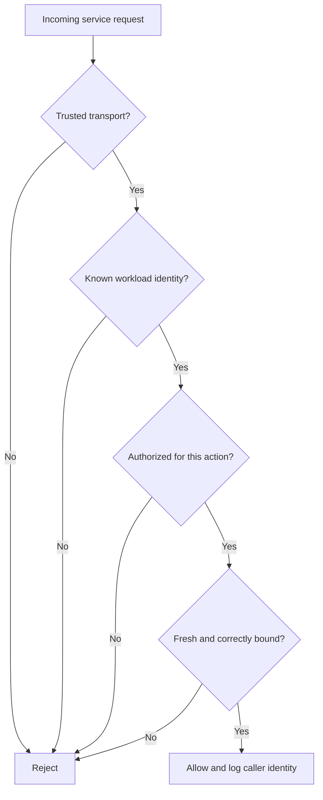
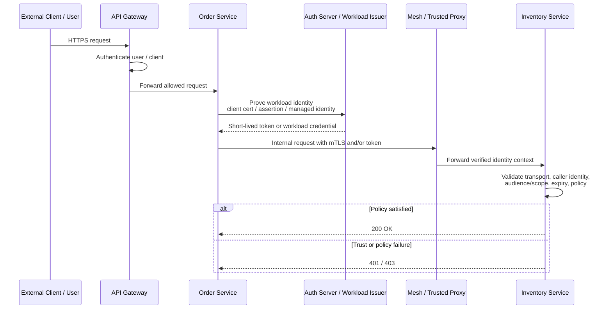
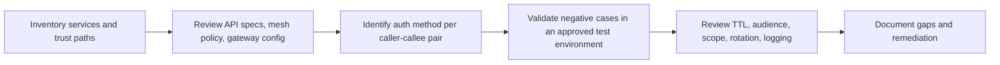

# Service-to-Service Authentication

> **In a microservices environment, the hardest question is often not “is the user logged in?” but “which workload is calling which other workload, on whose behalf, with what rights, and can that trust be replayed somewhere else?”**

---

## Table of Contents

1. [Overview](#1-overview)
2. [Why Microservices Make This Harder](#2-why-microservices-make-this-harder)
3. [A Simple Mental Model: TIAF](#3-a-simple-mental-model-tiaf)
4. [How a Trusted Call Chain Should Work](#4-how-a-trusted-call-chain-should-work)
5. [Identity Layers Inside a Microservice Request](#5-identity-layers-inside-a-microservice-request)
6. [Common Authentication Patterns](#6-common-authentication-patterns)
7. [Choosing the Right Pattern](#7-choosing-the-right-pattern)
8. [Identity Propagation and Delegation](#8-identity-propagation-and-delegation)
9. [What Commonly Goes Wrong](#9-what-commonly-goes-wrong)
10. [How It Appears in OpenAPI / API Specs](#10-how-it-appears-in-openapi--api-specs)
11. [Safe Authorized Review Workflow](#11-safe-authorized-review-workflow)
12. [Detection and Observability](#12-detection-and-observability)
13. [Defensive Hardening Checklist](#13-defensive-hardening-checklist)
14. [Key Takeaways](#14-key-takeaways)
15. [Sources and Further Reading](#15-sources-and-further-reading)

---

## 1. Overview

**Service-to-service authentication** is how one workload proves its identity to another workload **without a human login flow**.

Examples:

- `order-service` calling `inventory-service`
- an API gateway calling an internal billing API
- a background worker calling a fraud engine
- a gRPC service calling another gRPC service inside a mesh
- a Kubernetes workload using managed cloud identity to reach storage or secrets services

In a monolith, many authorization decisions happen inside one process boundary.
In microservices, the same business action often crosses:

- multiple services,
- multiple protocols,
- multiple trust boundaries,
- and sometimes multiple identity systems.

That is why service-to-service authentication is not just an implementation detail. It is a **core security control for east-west traffic**.

A useful beginner sentence is:

> **User authentication proves who the person is. Service-to-service authentication proves which workload is acting.**

A more advanced sentence is:

> **Good microservice security requires both workload identity and workload-specific authorization, not just internal network reachability.**

---

## 2. Why Microservices Make This Harder

Microservices increase the number of identities, hops, and places where trust can fail.

| Topic | Simpler application model | Microservices model | Security consequence |
|---|---|---|---|
| Identity count | One app identity plus users | Many workload identities plus users | More credentials, more policy, more drift risk |
| Enforcement points | One or a few | Gateway, sidecar, service, queue consumer, cloud API | Inconsistent enforcement becomes common |
| Network trust | Often implicit inside one app tier | Many east-west paths | “Internal means trusted” becomes dangerous |
| Credential usage | Fewer secrets or tokens | Many tokens, certs, keys, assertions, service accounts | Secret sprawl or over-trust can appear fast |
| Failure blast radius | Often localized | One weak workload can pivot into many others | Lateral movement risk increases |
| Inventory problem | Smaller surface | More hosts, versions, internal routes, mesh paths | OWASP API9-style blind spots grow |

NIST SP 800-204A emphasizes that microservices introduce security needs around **service-to-service interaction, secure token services, key management, service discovery, and continuous monitoring**. In other words, the architecture itself creates new authentication and authorization work.

---

## 3. A Simple Mental Model: TIAF

A target service should answer four questions before it trusts another service.

| Letter | Question | Meaning |
|---|---|---|
| **T — Transport** | Is the channel trusted? | TLS, mTLS, proxy chain, termination point |
| **I — Identity** | Which workload is this? | Client cert, SPIFFE ID, managed identity, OAuth client, signed assertion |
| **A — Authorization** | What is it allowed to do here? | Audience, scope, method/path policy, resource policy |
| **F — Freshness** | Is the credential current and bound correctly? | Expiry, rotation, replay resistance, sender constraint |

If any one of these fails, the call should not be trusted.



This model is easy to remember because it prevents a common mistake:

> **Authentication alone is not enough.** A valid workload identity with the wrong audience, wrong scope, or stale credential is still unsafe.

---

## 4. How a Trusted Call Chain Should Work

A healthy microservice call chain usually combines **identity issuance**, **secure transport**, and **local authorization**.



Important design lesson:

- **The gateway is not the only trust point.**
- **The destination service still needs its own enforcement.**
- **The service should know whether the caller is acting on its own behalf, or carrying user context downstream.**

If a backend trusts only “traffic from the gateway subnet” or “requests with a familiar header,” it is not really authenticating a workload.

---

## 5. Identity Layers Inside a Microservice Request

One internal API call may contain several identity-related signals at once.

| Layer | What it means | Common examples | Common mistake |
|---|---|---|---|
| **Transport identity** | Who proved identity at the TLS layer | mTLS client cert, mesh-issued cert | Assuming TLS termination automatically preserves trust to the app layer |
| **Workload identity** | Which machine/service/process is calling | SPIFFE ID, managed identity, service account, OAuth client ID | Treating all internal workloads as equivalent |
| **Authorization artifact** | What the caller can do | OAuth access token, JWT with scopes, signed assertion | Accepting a token without checking `aud`, scope, or issuer |
| **User context** | Which end user triggered the action | downstream user claims, exchanged token, propagated principal | Forwarding user identity everywhere without least privilege |
| **Network context** | Where traffic came from | source IP, namespace, subnet, mesh metadata | Mistaking location for identity |

### The most important mental distinction

| Concept | Meaning | Safe interpretation |
|---|---|---|
| **Who is calling?** | Workload identity | `checkout-service` or `spiffe://prod/ns/shop/sa/checkout` |
| **For whom is it acting?** | User or delegated subject context | user `alice@example.com`, tenant `acme`, job `nightly-sync` |
| **What can it do?** | Authorization policy | `inventory.read` only, not `inventory.write` |

That separation matters because many high-impact bugs happen when one of these gets confused with another.

---

## 6. Common Authentication Patterns

No single pattern solves every service-to-service trust problem. Mature environments often combine more than one.

### 6.1 OAuth 2.0 Client Credentials

Per RFC 6749, the **client credentials grant** lets a client obtain an access token **on its own behalf**.

This is a strong fit when:

- a service is acting as itself,
- the target API wants scopes or audiences,
- tokens should be short-lived,
- and the organization already has an authorization server.

**Strengths**

- standardized
- easy to express scopes and audiences
- can be short-lived
- works well with API gateways and internal resource servers

**Weaknesses if poorly implemented**

- bearer replay if tokens are stolen
- over-broad scopes
- missing or weak audience validation
- shared client secrets across many workloads

**Defensive review focus**

- Is the token really for this resource server?
- Is the token lifetime short enough?
- Are scopes narrow and workload-specific?
- Are direct backend paths enforcing the same checks as gateway paths?

### 6.2 Mutual TLS (mTLS)

mTLS authenticates both sides during the TLS handshake. This gives the server strong proof that the client holds the private key for the presented certificate.

This is especially common in:

- service meshes,
- gRPC deployments,
- highly regulated APIs,
- and internal east-west traffic that needs strong workload identity.

**Strengths**

- channel security plus client identity
- difficult to spoof without key possession
- good fit for automated workload certificates

**Weaknesses if poorly implemented**

- TLS termination can break the trust model if identity is only forwarded in headers
- any valid internal cert may become over-trusted
- operational complexity may push teams into unsafe fallback modes

**Defensive review focus**

- Does the destination actually require a client certificate?
- Is authorization tied to certificate identity, not just certificate presence?
- Are proxy-added headers such as `X-Forwarded-Client-Cert` sanitized and trusted only from known components?

### 6.3 Certificate-Bound Access Tokens

RFC 8705 describes two related ideas:

1. using mTLS for OAuth client authentication, and
2. binding access tokens to the client certificate.

That second property matters because it reduces classic bearer-token risk.

> **A certificate-bound token should only be usable by the client that holds the matching private key.**

This is often stronger than plain bearer tokens in high-trust microservice environments.

### 6.4 JWT Client Assertions (`private_key_jwt`)

RFC 7523 defines how a JWT can be used for OAuth client authentication and authorization grants.

In practice, a workload signs a short-lived assertion with its private key when talking to the token endpoint.

**Why teams use it**

- avoids long-lived shared client secrets
- supports asymmetric trust
- works well with JWKS-based key rotation

**Defensive review focus**

- exact `aud` validation at the token endpoint
- strict issuer / subject mapping
- short lifetime and unique `jti`
- reliable key rotation and retirement

### 6.5 Workload Identity Systems (SPIFFE / SPIRE and similar)

SPIFFE describes a framework for assigning workload identities in dynamic environments and issuing short-lived identity documents called **SVIDs**.

A workload identity might look like:

```text
spiffe://prod.example.internal/ns/payments/sa/charge-service
```

SPIFFE-based approaches are attractive because they reduce secret sprawl:

- no long-lived static secret in the image,
- automatic rotation,
- consistent identity across Kubernetes, VMs, and heterogeneous platforms.

**Critical nuance:**
SPIFFE or a service mesh gives you a strong **identity plane**, but you still need a strong **authorization plane**. “Any valid mesh identity can call any service” is not a secure design.

### 6.6 Managed Cloud Workload Identity

Cloud platforms increasingly let workloads obtain short-lived identity without embedding permanent cloud credentials.

Typical patterns include:

- pod-to-cloud identity mapping,
- VM or function managed identity,
- federated workload identity tied to cluster or deployment attributes.

**Strengths**

- avoids storing static cloud API keys
- central lifecycle control
- strong auditability if configured well

**Common failure mode**

- broad cloud role permissions turn “application access” into “infrastructure access.”

### 6.7 Legacy Patterns Still Seen in Real Systems

Not every microservice estate is modern. You will still see:

- shared API keys,
- HMAC-signed requests,
- static service account tokens,
- custom headers such as `X-Service-Name`,
- IP allowlists.

These are not always invalid, but they need more careful scrutiny because they often provide weaker identity, weaker replay resistance, or weaker attribution.

---

## 7. Choosing the Right Pattern

Use this table as a defensive design and review shortcut.

| Pattern | Best fit | Main advantage | Main risk if misused | Reviewer question |
|---|---|---|---|---|
| **Client credentials** | Service acting on its own behalf | Standardized scoped tokens | Bearer replay, over-broad scopes | Is `aud` enforced and scope narrow? |
| **mTLS** | Strong internal workload identity | Identity bound to transport | Termination/header trust mistakes | Is identity verified end-to-end? |
| **mTLS + cert-bound token** | High-assurance internal APIs | Strong replay resistance | Operational complexity | Can a stolen token work without the cert? |
| **`private_key_jwt`** | Strong client auth to token endpoint | No shared secret sprawl | Replay or weak key lifecycle | Are `aud`, `exp`, `jti`, and key rotation enforced? |
| **SPIFFE / workload identity** | Dynamic microservice estates | Short-lived automated identity | Over-broad trust domain | Is authorization workload-specific? |
| **Managed cloud identity** | Workloads reaching cloud APIs | No static cloud creds | Role overreach | Does the workload get only the permissions it needs? |
| **API key / static header** | Legacy or low-risk integrations | Simple to deploy | Weak attribution and leakage risk | Why is this still sufficient here? |

A practical rule:

> **Prefer short-lived, automatable, workload-specific identity over long-lived shared secrets.**

---

## 8. Identity Propagation and Delegation

One of the most confusing parts of microservice security is deciding **whose authority** the downstream service should evaluate.

### Common models

| Model | What it means | Good use case | Main security question |
|---|---|---|---|
| **Service acts as itself** | Downstream only trusts workload identity | background sync, cache refresh, internal jobs | Is the service over-privileged? |
| **Service carries user context** | Downstream needs to know which user triggered the action | fine-grained per-user authorization | Is user context validated and minimized? |
| **Service exchanges for a narrower token** | Downstream gets purpose-limited context | high-assurance multi-hop flows | Is the exchanged token truly narrower? |
| **Service identity + user context** | Both machine and user matter | payments, approvals, multi-tenant workflows | Are both identities logged and enforced consistently? |

### The common architectural mistake

Teams often forward the original user token through many services by default.

That creates several problems:

- too many services can see sensitive claims,
- tokens may be valid for unintended audiences,
- debugging or tracing systems may capture them,
- downstream services may mistake user context for service identity.

A better question is:

> **Does the downstream service need the original user identity, or only a narrower authorization decision?**

---

## 9. What Commonly Goes Wrong

These are high-signal issues in microservice estates.

| Finding pattern | Why it matters | Typical impact |
|---|---|---|
| **Gateway-only authentication** | Backend paths trust the gateway but are reachable directly | auth bypass or inconsistent enforcement |
| **Network location treated as identity** | SSRF, compromised pod, or lateral foothold becomes a trusted caller | internal pivoting |
| **Any valid workload cert can call any service** | Authentication exists, but authorization is missing | broad east-west access |
| **Bearer tokens accepted without audience checks** | Token for Service A works on Service B | cross-service replay |
| **Long-lived service credentials** | Secret leakage stays useful for too long | persistent unauthorized access |
| **Shared HMAC/JWT MAC key across services** | Any verifier can become a token issuer | trust collapse between services |
| **Spoofable identity headers trusted** | Caller can self-assert identity | proxy/gateway bypass |
| **Mesh bypass path exists** | Sidecar or gateway policy can be skipped | uneven enforcement |
| **Staging and production trust overlap** | lower-trust environment reaches higher-trust services | environment boundary failure |
| **Telemetry stores tokens or cert details unsafely** | logs and traces become credential sources | secondary compromise risk |
| **Legacy fallback remains enabled** | modern control can be bypassed with older mechanism | policy downgrade |
| **No inventory of internal APIs and callers** | teams do not know who should talk to what | blind spots, stale trust, API9 issues |

### A particularly important mistake: shared symmetric JWT validation keys

OWASP's REST Security Cheat Sheet notes a crucial distributed-systems problem: if multiple services validate JWTs using the same MAC key, then **any service that can validate can also mint tokens**.

That means compromise of one internal service may compromise the trust model for many others.

In large microservice environments, this is a strong reason to prefer:

- asymmetric signatures,
- token introspection where appropriate,
- sender-constrained tokens for sensitive paths,
- and workload-specific authorization regardless of token validity.

---

## 10. How It Appears in OpenAPI / API Specs

OpenAPI can describe **what security mechanisms exist**, but not the full operational trust model.

That matters because a spec may show:

- `mutualTLS`,
- OAuth 2.0 client credentials,
- bearer token expectations,
- operation-level security overrides,
- and scope requirements.

But it will usually **not** fully capture:

- certificate issuance and trust bundles,
- mesh policy,
- header sanitization rules,
- workload attestation,
- environment separation,
- or fallback trust paths.

### OpenAPI 3.1 example for internal service auth

```yaml
openapi: 3.1.0
info:
  title: Internal Inventory API
  version: 1.0.0
components:
  securitySchemes:
    workloadMTLS:
      type: mutualTLS
    serviceOAuth:
      type: oauth2
      flows:
        clientCredentials:
          tokenUrl: https://auth.example.internal/oauth/token
          scopes:
            inventory.read: Read inventory levels
            inventory.write: Modify inventory levels
security:
  - workloadMTLS: []
paths:
  /internal/items/{itemId}:
    get:
      security:
        - serviceOAuth:
            - inventory.read
      responses:
        '200':
          description: Inventory item
    patch:
      security:
        - serviceOAuth:
            - inventory.write
      responses:
        '200':
          description: Updated inventory item
```

### What to look for in the spec

| Spec area | Review question | Why it matters |
|---|---|---|
| `components.securitySchemes` | Which auth models exist? | Shows expected trust mechanisms |
| Global `security` | Is there a default trust requirement? | Reveals baseline assumptions |
| Operation-level `security` | Are sensitive routes overriding global rules? | Good place to catch anonymous or weaker access |
| OAuth scopes | Are scopes narrow and business-specific? | Broad scopes often become internal overreach |
| Multiple schemes | Is the API allowing either mTLS or bearer auth? | Useful, but may also reveal unexpected fallback |
| Server definitions | Are internal, staging, or partner hosts mixed together? | Inventory and environment hygiene issue |

### Important OpenAPI limitation

The OpenAPI security guidance is intentionally terse. It is good for declaring mechanisms such as `mutualTLS` or `clientCredentials`, but the **PKI model, onboarding, certificate issuance, trust domain, and policy delivery remain out of scope**.

That is why spec review must be paired with:

- gateway configuration review,
- mesh policy review,
- environment inventory,
- and runtime validation.

---

## 11. Safe Authorized Review Workflow

This workflow stays defensive and non-destructive.



### Step-by-step review goals

| Step | Goal | Example evidence |
|---|---|---|
| **1. Map callers and callees** | Learn who is supposed to talk to whom | architecture diagrams, service catalog, mesh policy, DNS/service discovery data |
| **2. Identify auth mechanism** | Understand how identity is proven | OpenAPI security schemes, gateway settings, mTLS config, OAuth docs |
| **3. Validate denial paths** | Confirm missing or wrong identity is rejected | `401`, `403`, TLS handshake failure, policy denial log |
| **4. Review binding** | Confirm token or cert only works where intended | `aud`, issuer, SAN/SPIFFE ID, scope, method-level policy |
| **5. Review credential lifecycle** | Limit blast radius from leakage | short TTLs, automatic rotation, revocation or trust-bundle refresh |
| **6. Review direct paths** | Ensure edge controls are not the only controls | internal hostname, alternate port, debug route, sidecar bypass path |
| **7. Review logging** | Make misuse visible | denied scope logs, mTLS failures, unusual caller identity on sensitive route |

### Safe observation examples

Only use these in an approved environment with approved test identities.

```bash
# Confirm a protected internal API does not allow anonymous access
curl -i https://inventory.example.internal/internal/items/42

# Observe whether the server requests a client certificate during TLS setup
openssl s_client -connect inventory.example.internal:443 -servername inventory.example.internal
```

```bash
# Inspect a JWT payload locally without modifying it
python3 - <<'PY'
import base64, json

def b64url_decode(s):
    s += '=' * (-len(s) % 4)
    return base64.urlsafe_b64decode(s)

token = 'eyJhbGciOiJSUzI1NiIsInR5cCI6IkpXVCJ9.eyJpc3MiOiJhdXRoLmV4YW1wbGUuaW50ZXJuYWwiLCJhdWQiOiJpbnZlbnRvcnkiLCJzY29wZSI6ImludmVudG9yeS5yZWFkIiwiZXhwIjoxNzAwMDAwMDAwfQ.signature'
payload = json.loads(b64url_decode(token.split('.')[1]))
print(json.dumps(payload, indent=2))
PY
```

The point of these checks is not offensive manipulation. It is to confirm:

- protection exists,
- identities are visible,
- and the trust model matches the intended design.

---

## 12. Detection and Observability

Microservice authentication should be observable at both the control plane and the application plane.

| Signal | Why it matters | Good defensive question |
|---|---|---|
| Repeated mTLS handshake failures | May indicate broken clients, expiry, or probing | Which workload is failing and why now? |
| Invalid audience / invalid scope denials | Shows tokens are reaching the wrong service or wrong operation | Is there replay, misrouting, or overbroad client behavior? |
| Unexpected caller identity on sensitive route | Highlights policy drift or compromise | Should this service ever call this method? |
| Direct backend traffic not seen through gateway/mesh path | Suggests bypass path | Is policy only enforced at the edge? |
| Sudden token issuance spike for one client | Could indicate abuse or automation error | Why does this workload suddenly need many new tokens? |
| Calls from staging identity into production service | Strong environment-boundary alert | Are trust domains separated correctly? |
| Old certs or trust bundles still accepted | Weak lifecycle control | How quickly does revocation or rotation become effective? |
| Missing caller identity in traces/logs | Investigation gap | Can responders tell which workload performed the action? |

### What good logging usually includes

- caller workload identity
- destination service and route/method
- auth mechanism used
- issuer / trust domain
- policy result: allowed or denied
- denial reason when safe to record
- request correlation or trace identifier
- environment / cluster / namespace context

### What to avoid logging carelessly

- raw access tokens
- reusable shared secrets
- private keys
- unnecessary certificate material beyond what responders need

A clean rule is:

> **Log identity decisions, not reusable credentials.**

---

## 13. Defensive Hardening Checklist

### Architecture and policy

- Treat **internal** as a routing description, not a trust decision.
- Require explicit workload identity for east-west traffic.
- Enforce authorization at the destination service, not only at the gateway.
- Separate staging, development, and production trust domains.
- Maintain an inventory of services, owners, routes, and expected callers.

### Credential design

- Prefer short-lived credentials over long-lived shared secrets.
- Use workload-specific identities rather than one credential shared by many services.
- Prefer asymmetric client authentication or workload certificates over broad shared secrets where practical.
- Use sender-constrained or certificate-bound tokens for high-sensitivity internal APIs.
- Rotate credentials automatically and test retirement of old trust material.

### Token and certificate validation

- Validate issuer, audience, expiry, and scope consistently.
- Bind authorization policy to the actual workload identity.
- Verify SAN, SPIFFE ID, or managed identity mapping as designed.
- Reject missing, expired, or malformed credentials early.
- Do not trust identity headers from untrusted sources.

### Mesh and gateway safety

- Confirm that sidecar or proxy bypass paths do not weaken enforcement.
- Sanitize and tightly control forwarded identity headers.
- Review TLS termination points and downstream trust assumptions.
- Ensure service discovery and routing changes do not silently change trust boundaries.

### Monitoring and response

- Alert on repeated denials, wrong audiences, and environment-crossing callers.
- Record both service identity and user context where both matter.
- Review logs and traces for token leakage.
- Include workload identity in incident response playbooks.

---

## 14. Key Takeaways

- Service-to-service authentication is about **proving workload identity** and then **restricting what that workload can do**.
- In microservices, the security challenge is bigger because every hop can introduce a new trust decision.
- A simple way to remember the model is **TIAF**: **Transport, Identity, Authorization, Freshness**.
- Strong patterns include **client credentials**, **mTLS**, **certificate-bound tokens**, **JWT client assertions**, and **workload identity systems**.
- Service meshes and workload identity platforms improve consistency, but they do **not** replace destination-side authorization.
- OpenAPI can declare internal auth mechanisms such as `mutualTLS` and `clientCredentials`, but it cannot fully describe the operational trust model by itself.
- High-signal findings usually involve **gateway-only auth, weak audience checks, over-broad trust domains, shared secrets, spoofable headers, and missing inventory**.

If you remember only one sentence, remember this:

> **The secure microservice question is not merely “can this request be authenticated?” but “can this specific workload use this specific credential to perform this specific action on this specific target right now?”**

---

## 15. Sources and Further Reading

This note was informed by the following public sources:

1. **RFC 6749 — The OAuth 2.0 Authorization Framework**  
   https://www.rfc-editor.org/rfc/rfc6749.txt
2. **RFC 7523 — JSON Web Token (JWT) Profile for OAuth 2.0 Client Authentication and Authorization Grants**  
   https://www.rfc-editor.org/rfc/rfc7523.txt
3. **RFC 8705 — OAuth 2.0 Mutual-TLS Client Authentication and Certificate-Bound Access Tokens**  
   https://datatracker.ietf.org/doc/html/rfc8705
4. **SPIFFE Overview** — workload identity, SVIDs, and heterogeneous environments  
   https://spiffe.io/docs/latest/spiffe-about/overview/
5. **NIST SP 800-204A** — Building Secure Microservices-Based Applications Using Service-Mesh Architecture  
   https://csrc.nist.gov/pubs/sp/800/204/a/final
6. **OpenAPI security guidance** — Security Scheme Object, `mutualTLS`, and OAuth 2.0 descriptions  
   https://learn.openapis.org/specification/security.html
7. **OpenAPI Specification 3.1**  
   https://spec.openapis.org/oas/v3.1.0.html
8. **OWASP REST Security Cheat Sheet** — HTTPS, local access control, JWT validation, and distributed trust considerations  
   https://cheatsheetseries.owasp.org/cheatsheets/REST_Security_Cheat_Sheet.html
9. **OWASP API Security Top 10 2023** — Broken Authentication, Security Misconfiguration, Improper Inventory Management  
   https://owasp.org/API-Security/editions/2023/en/0xa2-broken-authentication/  
   https://owasp.org/API-Security/editions/2023/en/0xa8-security-misconfiguration/  
   https://owasp.org/API-Security/editions/2023/en/0xa9-improper-inventory-management/
