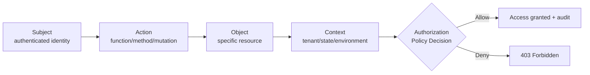
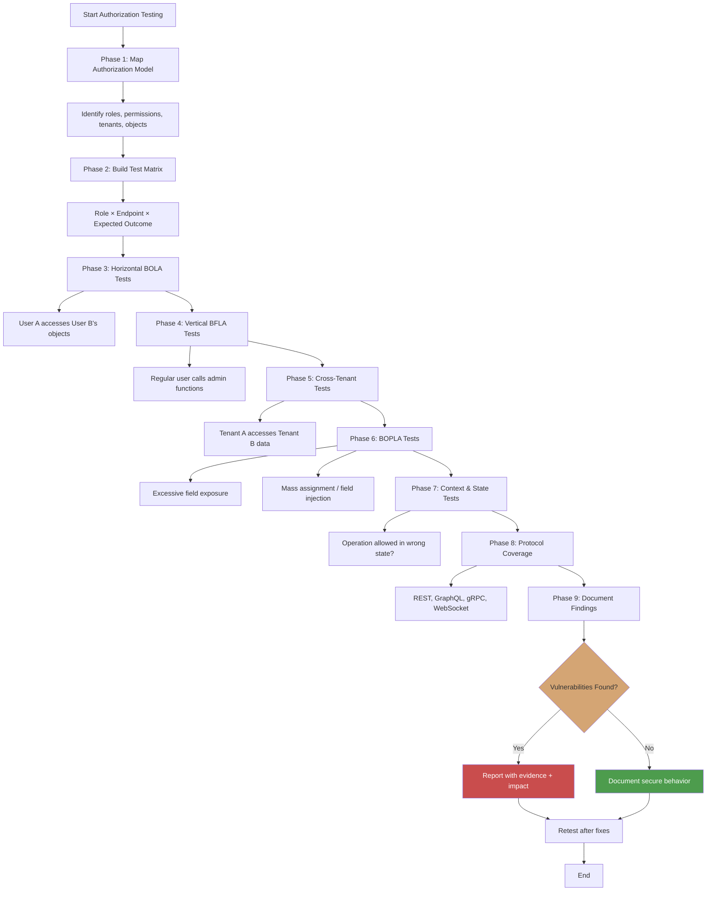

# Authorization Testing Methodology

> **Authorization testing validates whether an API enforces the right access decisions for the right subjects on the right resources under the right conditions. It is one of the most critical pentesting phases because authorization failures directly expose business data, financial operations, and tenant boundaries.**

---

## 🧠 What Is It? (Beginner Explanation)

Think of a hospital:

- **Authentication** is showing your ID at the front desk.
- **Authorization** is what medical records, rooms, lab results, and systems you are allowed to access once inside.

Authorization testing asks:

- Can a **regular patient** access another patient's records?
- Can a **nurse** access admin-only pharmacy controls?
- Can someone in **Department A** see Department B's financial reports?
- Can a **read-only auditor** modify critical settings?

In APIs, authorization flaws are:

- **Broken Object Level Authorization (BOLA)**: accessing the wrong records
- **Broken Function Level Authorization (BFLA)**: reaching the wrong functions
- **Broken Property Level Authorization (BOPLA)**: reading or changing the wrong fields

This guide covers how to **systematically test** for all of these in APIs.

---

## 🎯 Why Authorization Testing Is Critical for APIs

OWASP API Security Top 10 consistently ranks authorization issues at the top:

- **API1:2023** — Broken Object Level Authorization (BOLA)
- **API5:2023** — Broken Function Level Authorization (BFLA)
- **API3:2023** — Broken Object Property Level Authorization (BOPLA)

### Why APIs are especially prone

| API Characteristic | Authorization Risk |
|---|---|
| **Object-centric design** | Every request carries object references (IDs, keys, paths) |
| **Stateless by default** | No server-side session context to implicitly scope queries |
| **Microservices** | Identity and ownership context may degrade across service hops |
| **Multiple protocols** | REST, GraphQL, gRPC, WebSocket each need consistent policy |
| **Programmatic access** | No UI to hide sensitive operations; everything is reachable |
| **Machine-to-machine flows** | Service accounts often have broad, poorly scoped permissions |

### The Core Problem

```text
Authentication proves who you are.
Authorization proves what you are allowed to do.
```

If an API only checks the first and assumes the second, every authenticated caller becomes dangerous.

---

## 🧭 Mental Model: Four Authorization Dimensions

Every API request should answer four questions:

| Dimension | Security Question | Example |
|---|---|---|
| **Subject** | Who is making the request? | User Alice, service `billing-worker`, admin Bob |
| **Action** | What are they trying to do? | Read, update, delete, approve, export, refund |
| **Object** | What resource is being accessed? | Invoice `INV-42`, project `proj_9f3a`, tenant `acme-corp` |
| **Context** | Under what conditions? | Same tenant, workflow state, time window, IP location |

Authorization testing systematically validates all four.



---

## 📋 Authorization Testing Phases

A thorough authorization test follows these phases:

### Phase 1: Understand the Authorization Model

Before testing, map out:

1. **Identity sources**
   - How do users authenticate? (JWT, OAuth, API keys, mTLS)
   - What claims or attributes define identity? (`sub`, `email`, `role`, `tenant_id`)

2. **Role and permission model**
   - What roles exist? (admin, user, support, finance, service account)
   - What permissions or scopes are defined?
   - Is it RBAC, ABAC, or a hybrid?

3. **Tenancy model**
   - Is this a single-tenant or multi-tenant API?
   - How is tenant isolation enforced?
   - Where is tenant context stored? (token claim, header, database scope)

4. **Object ownership model**
   - Who owns what? (user owns profile, team owns project, tenant owns invoices)
   - Are there nested relationships? (project → members, invoice → line items)

5. **Sensitive operations**
   - Which endpoints change state? (create, update, delete, approve, export)
   - Which operations are high-privilege? (user deletion, refund, key rotation)

### Phase 2: Build an Authorization Matrix

Create a table mapping **roles × operations × expected outcomes**.

| Role | Operation | Expected Result | Notes |
|---|---|---|---|
| Anonymous | `GET /api/health` | Allow | Public endpoint |
| Anonymous | `GET /api/users/me` | Deny (401) | Authentication required |
| User Alice | `GET /api/users/alice` | Allow | Own profile |
| User Alice | `GET /api/users/bob` | Deny (403) | Horizontal BOLA |
| User Alice | `PATCH /api/users/alice` | Allow | Own resource |
| User Alice | `DELETE /api/users/bob` | Deny (403) | Vertical + horizontal |
| User Alice | `POST /api/admin/export` | Deny (403) | BFLA — function-level |
| Support Bob | `GET /api/tickets/123` | Allow | If assigned or in same tenant |
| Support Bob | `POST /api/invoices/refund` | Deny (403) | Finance-only function |
| Admin Carol | `DELETE /api/users/{id}` | Allow | Admin privilege |
| Admin Carol | `GET /api/tenants/{other}/data` | Deny (403) | Cross-tenant (if multi-tenant) |

This matrix becomes your **testing specification**.

---

## 🔬 Systematic Testing Approach

### Test Category 1: Horizontal BOLA (Same Role, Different User)

**Goal:** Verify that User A cannot access User B's resources.

#### Test Steps

1. **Identify object-bearing endpoints**
   - Look for path parameters: `/api/invoices/{id}`, `/api/projects/{projectId}`
   - Query parameters: `/reports?accountId=...`
   - Request body fields: `{ "targetUserId": "..." }`

2. **Create test objects**
   - User Alice creates object X
   - User Bob creates object Y

3. **Attempt cross-access**
   - Alice requests Bob's object Y
   - Bob requests Alice's object X

4. **Expected outcome**
   - `403 Forbidden` or `404 Not Found` (depending on policy)
   - No data from the other user's object in response

#### Example Test Case

```http
# Alice's token
GET /api/v1/invoices/inv_bob_1042 HTTP/1.1
Host: api.example.com
Authorization: Bearer <alice-token>
```

**Secure response:**
```http
HTTP/1.1 403 Forbidden
{
  "error": "forbidden",
  "message": "You do not have permission to access this resource"
}
```

**BOLA vulnerability signal:**
```http
HTTP/1.1 200 OK
{
  "id": "inv_bob_1042",
  "userId": "bob",
  "amount": 99.99,
  "status": "paid"
}
```

#### What to Check

- Read operations (`GET`)
- Write operations (`PATCH`, `PUT`)
- Delete operations (`DELETE`)
- Sub-actions (`POST /invoices/{id}/refund`, `POST /projects/{id}/archive`)

---

### Test Category 2: Vertical BFLA (Lower Privilege → Higher Privilege)

**Goal:** Verify that regular users cannot call admin/privileged functions.

#### Test Steps

1. **Map privileged endpoints**
   - Admin routes: `/api/admin/*`, `/api/internal/*`
   - Sensitive actions: export, batch operations, user management
   - State-changing operations: approve, refund, delete, promote

2. **Attempt as lower-privileged user**
   - Use regular user token
   - Call admin endpoint directly

3. **Expected outcome**
   - `403 Forbidden`
   - No privileged action executed

#### Example Test Case

```http
# Regular user token attempting admin export
POST /api/admin/users/export HTTP/1.1
Host: api.example.com
Authorization: Bearer <regular-user-token>
Content-Type: application/json

{
  "format": "csv",
  "filters": {}
}
```

**Secure response:**
```http
HTTP/1.1 403 Forbidden
{
  "error": "insufficient_permissions"
}
```

**BFLA vulnerability signal:**
```http
HTTP/1.1 202 Accepted
{
  "jobId": "export_7f3c",
  "status": "queued"
}
```

#### Critical Areas

- **Admin endpoints** — user management, system config
- **HTTP method escalation** — `GET` allowed but `DELETE` not checked
- **GraphQL mutations** — privileged resolvers
- **Async operations** — export, report generation, batch jobs

---

### Test Category 3: Cross-Tenant BOLA (Multi-Tenant APIs)

**Goal:** Verify that Tenant A cannot access Tenant B's data.

#### Test Steps

1. **Identify tenant boundaries**
   - Tenant ID in JWT claim
   - Tenant header (`X-Tenant-ID`)
   - Subdomain-based tenancy

2. **Create test data in different tenants**
   - Tenant A: User Alice, Project X
   - Tenant B: User Bob, Project Y

3. **Attempt cross-tenant access**
   - Alice (Tenant A) requests Project Y (Tenant B)

4. **Expected outcome**
   - Complete denial
   - No data leakage

#### Example Test Case

```http
# Tenant A user accessing Tenant B's project
GET /api/v1/projects/proj_tenant_b_001 HTTP/1.1
Host: api.example.com
Authorization: Bearer <tenant-a-token>
```

**Secure response:**
```http
HTTP/1.1 404 Not Found
```

**Cross-tenant vulnerability:**
```http
HTTP/1.1 200 OK
{
  "id": "proj_tenant_b_001",
  "tenantId": "tenant_b",
  "name": "Confidential Project",
  "data": "..."
}
```

#### What Else to Test

- Tenant ID manipulation in headers
- Cached responses leaking across tenants
- Search/filter endpoints not scoped to tenant
- Admin operations within tenant boundary

---

### Test Category 4: Broken Object Property Level Authorization (BOPLA)

**Goal:** Verify that users cannot read or write fields beyond their authorization.

#### Read-side BOPLA

**Scenario:** API returns sensitive fields that should be hidden.

```http
GET /api/v1/users/me HTTP/1.1
Authorization: Bearer <user-token>
```

**Vulnerable response:**
```json
{
  "id": "usr_42",
  "email": "alice@example.com",
  "firstName": "Alice",
  "isAdmin": false,
  "internalNotes": "flagged for review",
  "creditScore": 720,
  "passwordHash": "$2b$..."
}
```

**Problem:** Regular user sees `internalNotes`, `creditScore`, `passwordHash`.

#### Write-side BOPLA (Mass Assignment)

**Scenario:** API accepts fields that should be server-controlled.

```http
PATCH /api/v1/users/me HTTP/1.1
Authorization: Bearer <user-token>
Content-Type: application/json

{
  "firstName": "Alice Updated",
  "isAdmin": true,
  "accountBalance": 10000
}
```

**Vulnerable behavior:**
```http
HTTP/1.1 200 OK
{
  "id": "usr_42",
  "firstName": "Alice Updated",
  "isAdmin": true,
  "accountBalance": 10000
}
```

**Problem:** User elevated privilege or changed protected fields.

#### Testing Approach

1. **Read testing**
   - Compare responses for different roles
   - Look for internal, sensitive, or admin-only fields

2. **Write testing**
   - Include unexpected fields in `POST`, `PATCH`, `PUT` requests
   - Try: `role`, `isAdmin`, `userId`, `ownerId`, `tenantId`, `balance`, `credits`

3. **Expected secure behavior**
   - Sensitive fields filtered from responses
   - Disallowed fields ignored or rejected with clear error

---

### Test Category 5: Method-Based Authorization

**Goal:** Verify that authorization is enforced per HTTP method, not just per path.

#### Common Pattern

| Path | Method | Expected Access |
|---|---|---|
| `/api/users/me` | `GET` | Authenticated users |
| `/api/users/me` | `PATCH` | Authenticated users (own data) |
| `/api/users/{id}` | `GET` | Admin only |
| `/api/users/{id}` | `DELETE` | Admin only |

#### Test Case

```http
# Path may be protected for GET, but what about DELETE?
DELETE /api/v1/projects/proj_123 HTTP/1.1
Authorization: Bearer <regular-user-token>
```

**If vulnerable:**
```http
HTTP/1.1 204 No Content
```

**Expected:**
```http
HTTP/1.1 403 Forbidden
```

#### What to Test

- `GET` vs `POST` vs `PATCH` vs `DELETE` on same resource
- `OPTIONS`, `HEAD`, `TRACE` — sometimes reveal metadata
- Custom methods or actions (`POST /approve`, `POST /cancel`)

---

### Test Category 6: GraphQL Authorization

GraphQL presents unique challenges:

- Single endpoint (`/graphql`)
- Schema introspection may reveal hidden operations
- Resolver-level authorization often inconsistent

#### Testing Approach

1. **Enumerate available queries and mutations**

```graphql
query IntrospectionQuery {
  __schema {
    queryType { fields { name } }
    mutationType { fields { name } }
  }
}
```

2. **Test object-level access**

```graphql
query GetUserProfile($userId: ID!) {
  user(id: $userId) {
    id
    email
    profile {
      firstName
      lastName
      internalNotes
    }
  }
}
```

Variables:
```json
{
  "userId": "usr_bob"
}
```

**As Alice's token:** Should deny access to Bob's profile.

3. **Test privileged mutations**

```graphql
mutation ApproveRefund($invoiceId: ID!) {
  approveRefund(invoiceId: $invoiceId) {
    success
    refundId
  }
}
```

**As regular user:** Should deny.

4. **Test nested field access**

```graphql
query {
  me {
    id
    profile {
      firstName
      sensitiveInternalField
    }
  }
}
```

**Expected:** `sensitiveInternalField` should be null or cause error.

#### Common GraphQL Authorization Gaps

- Introspection enabled in production
- Some resolvers check auth, others don't
- Nested fields bypass top-level checks
- Mutations missing authorization entirely

---

### Test Category 7: API Version Drift

Older API versions often have weaker authorization.

#### Test Approach

1. **Identify all versions**
   - `/api/v1/...`
   - `/api/v2/...`
   - Legacy endpoints still active

2. **Test authorization on each**
   - Same resource, different version
   - Check if old version bypasses new protections

#### Example

```http
# v2 is protected
GET /api/v2/admin/reports HTTP/1.1
Authorization: Bearer <user-token>
# Response: 403 Forbidden

# v1 may be vulnerable
GET /api/v1/admin/reports HTTP/1.1
Authorization: Bearer <user-token>
# Response: 200 OK with data
```

---

### Test Category 8: Rate Limiting and Resource Authorization

**Goal:** Verify that authorized but excessive access is prevented.

#### What to Test

- Bulk exports (should require elevated privilege)
- Mass queries (pagination limits, scope restrictions)
- Repeated access to many objects (enumeration protection)

#### Example

```http
# Should regular user be able to export all users?
GET /api/v1/users/export?format=csv HTTP/1.1
Authorization: Bearer <regular-user-token>
```

**Expected:**
- `403 Forbidden` for regular user
- Admin-only endpoint

---

### Test Category 9: Context-Dependent Authorization

Some operations should only be allowed under specific conditions.

#### Examples

| Operation | Context Requirement |
|---|---|
| Approve invoice | Invoice in `pending_approval` state |
| Refund payment | Within 30-day window |
| Delete user | User not actively subscribed |
| Export audit logs | From same tenant + admin role |

#### Testing Approach

1. **Understand business rules**
2. **Create test objects in different states**
3. **Attempt operation on invalid state**

```http
# Try to approve an already-approved invoice
POST /api/v1/invoices/inv_123/approve HTTP/1.1
Authorization: Bearer <admin-token>
```

**Expected:**
```http
HTTP/1.1 409 Conflict
{
  "error": "invoice_already_approved"
}
```

---

## 🧪 Practical Testing Tools and Techniques

### Tool: Burp Suite

**Effective for:**
- Repeater for manual authorization testing
- Intruder for testing multiple IDs with different tokens
- Autorize extension for automated horizontal/vertical checks

**Technique:**
1. Configure two browser sessions (User A, User B)
2. Proxy both through Burp
3. Send User A's requests to Repeater
4. Replace authorization header with User B's token
5. Observe responses

### Tool: Postman/Insomnia

**Effective for:**
- Building authorization test collections
- Environment variables for different user tokens
- Pre-request scripts to automate token rotation

**Example Collection Structure:**
```
Authorization Tests
├── Setup
│   ├── Get Alice Token
│   ├── Get Bob Token
│   └── Get Admin Token
├── Horizontal BOLA Tests
│   ├── Alice accesses Bob's invoice (should fail)
│   └── Bob accesses Alice's project (should fail)
├── Vertical BFLA Tests
│   ├── User calls admin endpoint (should fail)
│   └── Support calls finance function (should fail)
└── Cross-Tenant Tests
    └── Tenant A accesses Tenant B data (should fail)
```

### Tool: Custom Scripts

Python script for systematic authorization testing:

```python
import requests

class AuthTester:
    def __init__(self, base_url):
        self.base_url = base_url
        self.tokens = {}
    
    def set_token(self, user, token):
        self.tokens[user] = token
    
    def test_bola(self, user_a, user_b, endpoint):
        """Test if user_a can access user_b's resource"""
        headers = {"Authorization": f"Bearer {self.tokens[user_a]}"}
        response = requests.get(f"{self.base_url}{endpoint}", headers=headers)
        
        return {
            "user_requesting": user_a,
            "resource_owner": user_b,
            "endpoint": endpoint,
            "status_code": response.status_code,
            "vulnerable": response.status_code == 200
        }

# Usage
tester = AuthTester("https://api.example.com")
tester.set_token("alice", "token_alice")
tester.set_token("bob", "token_bob")

result = tester.test_bola("alice", "bob", "/api/v1/invoices/inv_bob_001")
print(result)
```

### Tool: jwt.io / JWT Debugger

**Effective for:**
- Decoding JWTs to understand claims
- Identifying role, tenant, scope claims
- Checking token expiration

**What to look for:**
```json
{
  "sub": "usr_alice",
  "email": "alice@example.com",
  "role": "user",
  "tenant_id": "tenant_a",
  "scope": "profile:read invoices:read",
  "aud": "api.example.com",
  "exp": 1678901234
}
```

Check if these are enforced server-side.

---

## 🎭 Authorization Testing Matrix Template

Use this template for systematic coverage:

### Matrix 1: Role × Endpoint

| Endpoint | Anonymous | User | Support | Admin | Expected Behavior |
|---|:---:|:---:|:---:|:---:|---|
| `GET /health` | ✅ | ✅ | ✅ | ✅ | Public |
| `GET /api/users/me` | ❌ | ✅ | ✅ | ✅ | Authenticated only |
| `PATCH /api/users/me` | ❌ | ✅ | ✅ | ✅ | Own resource |
| `GET /api/users/{id}` | ❌ | ❌ | ✅ | ✅ | Support+ |
| `DELETE /api/users/{id}` | ❌ | ❌ | ❌ | ✅ | Admin only |
| `POST /api/admin/export` | ❌ | ❌ | ❌ | ✅ | Admin only |

✅ = Expected Allow  
❌ = Expected Deny

### Matrix 2: User × Object

| User | Object Owner | Operation | Expected Result |
|---|---|---|---|
| Alice | Alice | `GET /invoices/inv_alice_1` | Allow |
| Alice | Bob | `GET /invoices/inv_bob_1` | Deny |
| Alice | Bob | `PATCH /projects/proj_bob_1` | Deny |
| Bob | Alice | `DELETE /tickets/tkt_alice_1` | Deny |

### Matrix 3: Tenant × Resource

| Requester Tenant | Resource Tenant | Operation | Expected Result |
|---|---|---|---|
| Tenant A | Tenant A | `GET /projects/proj_a_1` | Allow |
| Tenant A | Tenant B | `GET /projects/proj_b_1` | Deny |
| Tenant B | Tenant A | `GET /invoices/inv_a_1` | Deny |

---

## 🚨 Common Authorization Vulnerabilities

### 1. Missing Authorization Check

**Pattern:**
```python
@app.get("/api/invoices/<invoice_id>")
def get_invoice(invoice_id):
    user = require_auth()  # Only checks authentication
    invoice = Invoice.get(invoice_id)
    return jsonify(invoice.to_dict())
```

**Problem:** No check if user owns the invoice.

### 2. Trusting Client-Supplied Context

**Pattern:**
```python
@app.post("/api/reports")
def create_report():
    tenant_id = request.headers.get('X-Tenant-ID')  # User-controlled!
    data = fetch_data(tenant_id)
    return jsonify(data)
```

**Problem:** Attacker can supply any tenant ID.

### 3. Authorization at Gateway Only

**Pattern:**
```
User → Gateway (checks auth) → Microservice (trusts gateway)
```

**Problem:** If microservice is reached directly or via different path, no auth check.

### 4. Inconsistent Authorization Across Protocols

**Pattern:**
- REST endpoint properly checks ownership
- GraphQL resolver for same data does not

**Problem:** Same resource, different entry point, different security.

### 5. UUID as Security

**Pattern:**
```
GET /api/files/a7f3c8d2-1e4a-4b9c-8d3f-9e8b7c6a5d4e
```

**Assumption:** "It's a random UUID, so it's secure."

**Problem:** UUIDs prevent guessing but don't replace authorization. If leaked/logged/shared, still accessible.

---

## 🛡️ Defense-in-Depth Recommendations

### 1. Enforce Authorization on Every Request

```python
@app.get("/api/invoices/<invoice_id>")
def get_invoice(invoice_id):
    user = require_auth()
    invoice = Invoice.get(invoice_id)
    
    # Authorization check
    if invoice.user_id != user.id and not user.is_admin:
        abort(403)
    
    return jsonify(invoice.to_dict())
```

### 2. Scope Queries to Authorized Dataset

**Instead of:**
```sql
SELECT * FROM invoices WHERE id = :invoice_id;
```

**Do:**
```sql
SELECT * FROM invoices 
WHERE id = :invoice_id 
  AND tenant_id = :current_tenant_id
  AND user_id = :current_user_id;
```

### 3. Centralize Authorization Logic

```python
def authorize(user, action, resource):
    """Central policy decision point"""
    if action == "delete" and not user.is_admin:
        return False
    
    if hasattr(resource, 'user_id') and resource.user_id != user.id:
        return False
    
    if hasattr(resource, 'tenant_id') and resource.tenant_id != user.tenant_id:
        return False
    
    return True

@app.delete("/api/invoices/<invoice_id>")
def delete_invoice(invoice_id):
    user = require_auth()
    invoice = Invoice.get(invoice_id)
    
    if not authorize(user, "delete", invoice):
        abort(403)
    
    invoice.delete()
    return "", 204
```

### 4. Use Allow Lists, Not Deny Lists

**Vulnerable:**
```python
if user.role != "banned":
    allow_access()
```

**Secure:**
```python
if user.role in ["admin", "support"]:
    allow_access()
else:
    deny_access()
```

### 5. Validate Across All Protocol Surfaces

Ensure consistent enforcement in:
- REST endpoints
- GraphQL resolvers
- gRPC methods
- WebSocket message handlers
- Background job triggers
- File download/export paths

---

## 📊 Authorization Testing Diagram



---

## 📝 Authorization Test Report Template

### Finding: Horizontal BOLA on Invoice API

**Severity:** High

**Affected Endpoint:**
```
GET /api/v1/invoices/{invoiceId}
```

**Description:**
Authenticated users can access invoices belonging to other users by modifying the `invoiceId` parameter. The API validates authentication but does not verify ownership.

**Steps to Reproduce:**
1. Authenticate as User Alice (user ID: `usr_alice`)
2. Create invoice: `inv_alice_001`
3. Authenticate as User Bob (user ID: `usr_bob`)
4. Create invoice: `inv_bob_001`
5. As Alice, request: `GET /api/v1/invoices/inv_bob_001`
6. Observe: Successful response with Bob's invoice data

**Evidence:**
```http
GET /api/v1/invoices/inv_bob_001 HTTP/1.1
Host: api.example.com
Authorization: Bearer eyJhbGc...(alice's token)

HTTP/1.1 200 OK
{
  "id": "inv_bob_001",
  "userId": "usr_bob",
  "amount": 99.99,
  "items": [...]
}
```

**Impact:**
- **Confidentiality:** Unauthorized access to financial data
- **Compliance:** GDPR/PCI-DSS violation
- **Scope:** All invoice endpoints affected (~50,000 invoices)

**Recommendation:**
Add ownership check before returning invoice data:
```python
if invoice.user_id != current_user.id and not current_user.is_admin:
    abort(403, "Forbidden")
```

**CWE:** CWE-639: Authorization Bypass Through User-Controlled Key

**OWASP:** API1:2023 Broken Object Level Authorization

---

## ✅ Authorization Testing Checklist

### Pre-Testing

- [ ] Understand authentication mechanism (JWT, OAuth, API keys)
- [ ] Map all roles and permission levels
- [ ] Identify tenant boundaries (if multi-tenant)
- [ ] Document object ownership model
- [ ] Build authorization test matrix
- [ ] Set up test users/accounts in all relevant roles

### Horizontal BOLA Testing

- [ ] Test read access across users (same role)
- [ ] Test write/update access across users
- [ ] Test delete access across users
- [ ] Test sub-actions (approve, refund, archive, etc.)
- [ ] Test nested resources (e.g., `/projects/{id}/members/{memberId}`)

### Vertical BFLA Testing

- [ ] Test admin endpoints with regular user token
- [ ] Test each HTTP method separately (GET, POST, PATCH, DELETE)
- [ ] Test privileged mutations (GraphQL)
- [ ] Test privileged RPC methods (gRPC)
- [ ] Test export/batch/async operations

### Cross-Tenant Testing (if applicable)

- [ ] Test cross-tenant object access
- [ ] Test tenant ID manipulation in headers/params
- [ ] Test admin operations cross-tenant
- [ ] Test search/filter scoping
- [ ] Test cached responses

### BOPLA Testing

- [ ] Compare response fields across roles
- [ ] Test mass assignment on create/update
- [ ] Test field-level read restrictions
- [ ] Test sensitive field filtering

### Protocol-Specific Testing

- [ ] REST endpoints
- [ ] GraphQL queries and mutations
- [ ] gRPC methods
- [ ] WebSocket message handlers
- [ ] File download/export paths

### Edge Cases

- [ ] Test old API versions
- [ ] Test rate limiting on bulk operations
- [ ] Test authorization in error conditions
- [ ] Test OPTIONS, HEAD, TRACE methods
- [ ] Test authorization with expired tokens
- [ ] Test authorization with tokens for different APIs (audience mismatch)

### Validation

- [ ] Confirm 403/404 responses are consistent
- [ ] Verify no data leakage in error messages
- [ ] Check that timing doesn't reveal existence
- [ ] Verify authorization is enforced server-side, not just client-side

---

## 🔍 Advanced Testing Scenarios

### Scenario 1: Token Swapping

Some APIs validate token signature but not audience or issuer.

**Test:**
1. Obtain token for API A
2. Use it to call API B (different service)

**Expected:** Token rejected (wrong audience)

### Scenario 2: Role Claim Manipulation

If roles are in JWT and signature isn't validated properly:

**Test:**
1. Decode JWT
2. Modify `role` claim
3. Re-encode without re-signing
4. Send request

**Expected:** Signature validation failure

**If vulnerable:** Role escalation

### Scenario 3: Authorization in Error Paths

Sometimes authorization is checked in happy path but not error handlers.

**Test:**
1. Cause an error condition (invalid input, missing field)
2. Observe error response

**Check:** Does error message leak unauthorized data?

### Scenario 4: Cached Authorization

**Test:**
1. User A accesses resource (cached response)
2. User B requests same resource
3. Check if User B receives cached response with User A's data

**Expected:** Cache scoped by user/tenant

---

## 📚 References

- **OWASP API Security Top 10 (2023)**
  - API1: Broken Object Level Authorization  
    https://owasp.org/API-Security/editions/2023/en/0xa1-broken-object-level-authorization/
  - API5: Broken Function Level Authorization  
    https://owasp.org/API-Security/editions/2023/en/0xa5-broken-function-level-authorization/
  - API3: Broken Object Property Level Authorization  
    https://owasp.org/API-Security/editions/2023/en/0xa3-broken-object-property-level-authorization/

- **OWASP Cheat Sheets**
  - Authorization Testing Automation  
    https://cheatsheetseries.owasp.org/cheatsheets/Authorization_Testing_Automation_Cheat_Sheet.html
  - Authorization Cheat Sheet  
    https://cheatsheetseries.owasp.org/cheatsheets/Authorization_Cheat_Sheet.html
  - Insecure Direct Object Reference Prevention  
    https://cheatsheetseries.owasp.org/cheatsheets/Insecure_Direct_Object_Reference_Prevention_Cheat_Sheet.html

- **MITRE CWE**
  - CWE-639: Authorization Bypass Through User-Controlled Key  
    https://cwe.mitre.org/data/definitions/639.html
  - CWE-862: Missing Authorization  
    https://cwe.mitre.org/data/definitions/862.html
  - CWE-285: Improper Authorization  
    https://cwe.mitre.org/data/definitions/285.html

- **PortSwigger Web Security Academy**
  - Access Control Vulnerabilities  
    https://portswigger.net/web-security/access-control
  - IDOR  
    https://portswigger.net/web-security/access-control/idor

- **NIST**
  - NIST SP 800-162: Guide to Attribute Based Access Control (ABAC)  
    https://csrc.nist.gov/pubs/sp/800/162/upd2/final
  - NIST Glossary: Authorization  
    https://csrc.nist.gov/glossary/term/authorization

- **Industry Guidance**
  - OAuth 2.0 Security Best Current Practice  
    https://datatracker.ietf.org/doc/html/draft-ietf-oauth-security-topics
  - OWASP Testing Guide: Authorization Testing  
    https://owasp.org/www-project-web-security-testing-guide/latest/4-Web_Application_Security_Testing/05-Authorization_Testing/README
