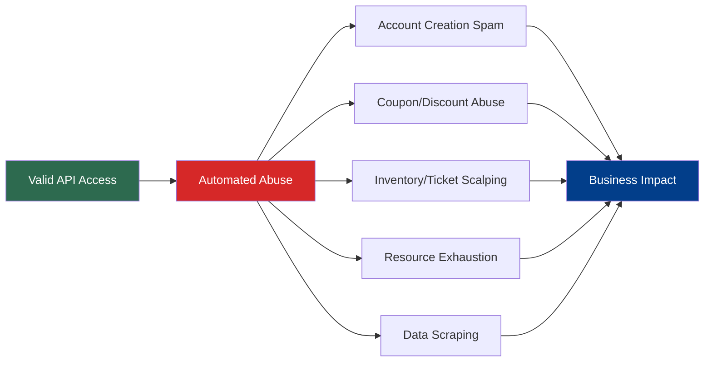
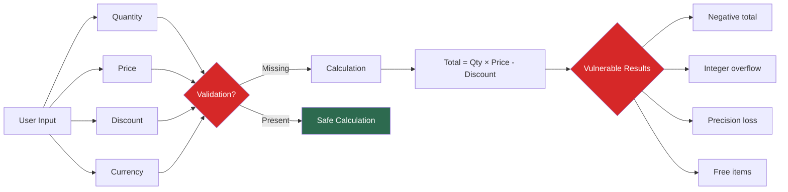
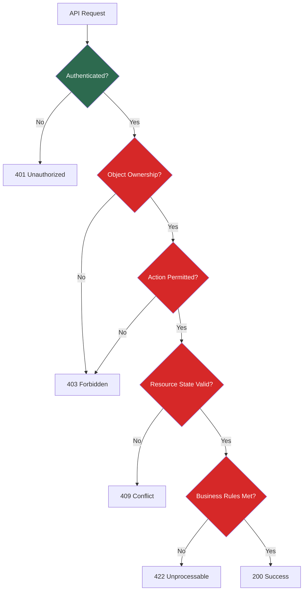
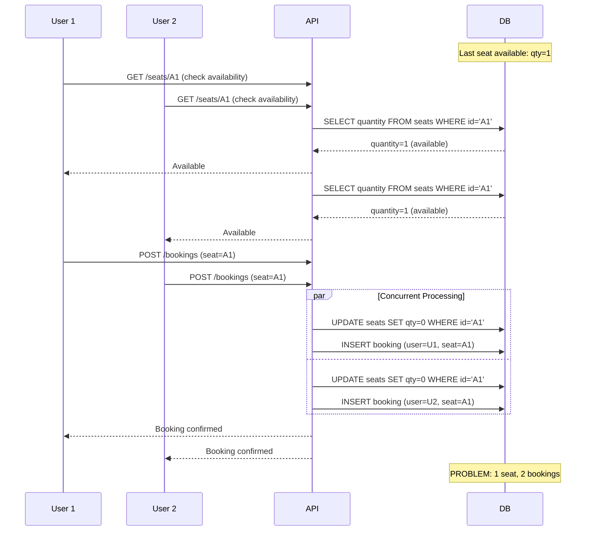

# Business Logic Exploitation

> **Business logic exploitation in APIs is about finding and validating flaws in application workflows, state transitions, and business rules that attackers can abuse using valid API calls. In authorized security testing, your goal is to identify where missing constraints, weak validation, or flawed assumptions allow unintended outcomes without directly attacking infrastructure or users.**

---

## 🧠 What Is It? (Beginner Explanation)

**Business logic vulnerabilities** occur when an API's intended workflow can be abused in ways the developers never anticipated — but without breaking the API itself.

Think of it like this:

- **Technical vulnerabilities** are when you break the API's code (SQL injection, XSS, buffer overflow)
- **Business logic vulnerabilities** are when you follow the API's code but break its intended **purpose**

### Real-world analogies

| Scenario | Technical Attack | Business Logic Attack |
|----------|------------------|----------------------|
| E-commerce checkout | SQLi in payment form | Apply discount code multiple times |
| Banking transfer | Buffer overflow in amount field | Transfer negative amounts to gain money |
| Ticket booking | XSS in name field | Reserve 1000 tickets by automating API calls |
| Password reset | Command injection | Reset any user's password via email enumeration |
| Referral rewards | Session hijacking | Create circular referrals for infinite credits |

The key difference:

> Technical attacks break **how the code runs**.  
> Business logic attacks break **what the code allows**.

---

## 📊 Why Business Logic Matters Now

OWASP API Security Top 10 2023 includes **API6:2023 Unrestricted Access to Sensitive Business Flows** for a reason.

### Modern attack trends show:



### Statistics from recent research:

- **83%** of organizations experience API security incidents annually (Salt Security, 2023)
- **71%** of API attacks involve authentication abuse, not injection (Akamai, 2023)
- **Automated abuse** accounts for over **30%** of all API traffic at major platforms
- Business logic flaws average **30-90 days to detect** versus 1-7 days for technical exploits

### Why traditional security tools miss this

| Defense Layer | What It Catches | What It Misses |
|---------------|----------------|----------------|
| WAF | SQL injection, XSS, known attack patterns | Valid requests used wrong |
| Rate limiting | Excessive calls from one IP | Distributed slow abuse |
| Schema validation | Invalid JSON, wrong types | Valid data in wrong sequence |
| SAST/DAST | Code flaws, injection points | Missing business rule checks |
| Signature detection | Known exploit patterns | Novel workflow abuse |

Business logic testing requires **understanding the application's purpose**, not just its technical implementation.

---

## 🔍 Start With The API Spec

Before testing, analyze the API documentation to understand intended behavior.

### OpenAPI/Swagger clues

Look for workflow hints in API specifications:

```yaml
openapi: 3.1.0
paths:
  /v1/cart/items:
    post:
      summary: Add item to shopping cart
      parameters:
        - name: quantity
          schema:
            type: integer
            minimum: 1
            maximum: 10
  /v1/cart/checkout:
    post:
      summary: Complete purchase
      requestBody:
        properties:
          coupon_code:
            type: string
          payment_method:
            type: string
  /v1/orders/{id}/cancel:
    post:
      summary: Cancel order
      parameters:
        - name: id
          schema:
            type: string
```

### What to extract for business logic testing

| Spec Element | Business Logic Test Ideas |
|--------------|---------------------------|
| `minimum`/`maximum` constraints | Test boundary values: 0, negative, just above max |
| Operation sequences | Map workflow: cart → checkout → order → cancel |
| Optional vs required fields | Test omitting "required" business fields |
| Status transitions | Document state machine, test invalid transitions |
| Rate limit hints | Test if limits are per-user, per-IP, or global |
| Discount/coupon fields | Test stacking, reuse, timing, expiration |
| Nested resource relationships | Test orphaned resources, wrong ownership |
| Idempotency keys | Test duplicate transaction prevention |

---

## 🏗️ Business Logic Attack Surface Map

```mermaid
flowchart TD
    BL[Business Logic Attack Surface] --> AUTH[Authentication Flow]
    BL --> STATE[State & Workflow]
    BL --> DATA[Data Validation]
    BL --> RESOURCE[Resource Access]
    BL --> ECONOMIC[Economic Logic]
    
    AUTH --> AUTH1[Registration abuse]
    AUTH --> AUTH2[Password reset bypass]
    AUTH --> AUTH3[Multi-factor bypass]
    AUTH --> AUTH4[Session management]
    
    STATE --> STATE1[Order/cart manipulation]
    STATE --> STATE2[Status transition abuse]
    STATE --> STATE3[Workflow skipping]
    STATE --> STATE4[Race conditions]
    
    DATA --> DATA1[Integer overflow]
    DATA --> DATA2[Negative values]
    DATA --> DATA3[Type confusion]
    DATA --> DATA4[Missing constraints]
    
    RESOURCE --> RESOURCE1[Rate limit bypass]
    RESOURCE --> RESOURCE2[Batch operation abuse]
    RESOURCE --> RESOURCE3[Quota circumvention]
    RESOURCE --> RESOURCE4[Priority manipulation]
    
    ECONOMIC --> ECONOMIC1[Coupon/discount stacking]
    ECONOMIC --> ECONOMIC2[Currency manipulation]
    ECONOMIC --> ECONOMIC3[Referral fraud]
    ECONOMIC --> ECONOMIC4[Pricing calculation flaws]
    
    style BL fill:#023e8a,color:#fff
    style AUTH fill:#2d6a4f,color:#fff
    style STATE fill:#2d6a4f,color:#fff
    style DATA fill:#2d6a4f,color:#fff
    style RESOURCE fill:#2d6a4f,color:#fff
    style ECONOMIC fill:#d62828,color:#fff
```



---

## 🎯 Core Business Logic Vulnerability Patterns

### Pattern 1: Missing Rate & Resource Limits

**The flaw:** API allows unlimited or excessive consumption of sensitive operations.

#### Test cases

| Test | Valid Request | Expected Behavior | Actual Abuse |
|------|---------------|-------------------|--------------|
| Unlimited signup | `POST /v1/users` | Create account | Spam 10,000 fake accounts |
| No referral cap | `POST /v1/referrals` | Track referral | Self-referral loops for infinite credits |
| Unbounded search | `GET /v1/search?q=*` | Return results | Scrape entire database via pagination |
| Batch endpoint abuse | `POST /v1/notifications (100 users)` | Send notifications | DDoS target users |

#### Testing methodology

```bash
# Test 1: Account creation rate limits
for i in {1..100}; do
  curl -X POST https://api.example.com/v1/users \
    -H "Content-Type: application/json" \
    -d "{\"email\":\"test$i@disposable.com\",\"password\":\"Test123!\"}" &
done
wait
# Expected: 429 Too Many Requests or CAPTCHA
# Vulnerable: All 100 accounts created

# Test 2: Referral loop detection
# Step 1: Create user A with referral code from user B
# Step 2: Create user B with referral code from user A
# Step 3: Check if both receive referral bonuses
curl -X POST https://api.example.com/v1/users \
  -d '{"email":"userA@test.com","referral_code":"USER_B_CODE"}'

curl -X POST https://api.example.com/v1/users \
  -d '{"email":"userB@test.com","referral_code":"USER_A_CODE"}'

# Test 3: Pagination scraping
page=1
while true; do
  response=$(curl "https://api.example.com/v1/products?page=$page&limit=100")
  echo "$response" >> scraped_data.json
  if ! echo "$response" | jq -e '.next_page' > /dev/null; then
    break
  fi
  ((page++))
done
# Vulnerable if no total pagination limit or query cost tracking
```

#### Real-world impact examples

- **2021: NFT platform** — Attackers automated minting API calls during drops, acquiring limited items faster than legitimate users
- **2022: E-commerce site** — Unlimited coupon code validation API allowed enumeration of valid codes
- **2023: Booking platform** — No limits on reservation holding time allowed attackers to "squat" on inventory

---

### Pattern 2: Workflow State Manipulation

**The flaw:** API doesn't properly enforce valid state transitions in multi-step workflows.

#### State transition diagram

```mermaid
stateDiagram-v2
    [*] --> Draft: Create order
    Draft --> PendingPayment: Add items
    PendingPayment --> Paid: Submit payment
    Paid --> Shipping: Process
    Shipping --> Delivered: Complete
    Delivered --> [*]
    
    Draft --> Cancelled: Cancel
    PendingPayment --> Cancelled: Cancel
    
    note right of Paid: Invalid transition:\nPaid → Draft\nPaid → Cancelled
    note right of Shipping: Invalid transition:\nShipping → Draft
```

#### Test matrix for order workflow

| Current State | Valid Transitions | Invalid Transitions to Test |
|---------------|-------------------|----------------------------|
| Draft | → PendingPayment, Cancelled | → Shipping, Delivered |
| PendingPayment | → Paid, Cancelled | → Shipping, Draft |
| Paid | → Shipping | → Draft, Cancelled, PendingPayment |
| Shipping | → Delivered | → Cancelled, Draft |
| Delivered | → [End] | → Any other state |

#### Testing methodology

```bash
# Test 1: Skip payment step
# Create order
order_id=$(curl -X POST https://api.example.com/v1/orders \
  -H "Authorization: Bearer $TOKEN" \
  -d '{"items":[{"id":"ITEM1","qty":1}]}' | jq -r '.id')

# Try to mark as paid without payment
curl -X PATCH https://api.example.com/v1/orders/$order_id \
  -H "Authorization: Bearer $TOKEN" \
  -d '{"status":"paid"}'
# Expected: 400 Bad Request or 403 Forbidden
# Vulnerable: Status updated to "paid"

# Test 2: Cancel already-shipped order
curl -X POST https://api.example.com/v1/orders/$order_id/cancel \
  -H "Authorization: Bearer $TOKEN"
# Expected: 400 "Cannot cancel shipped order"
# Vulnerable: Order cancelled, funds refunded but item already shipped

# Test 3: Reuse completed order
curl -X PATCH https://api.example.com/v1/orders/$completed_order_id \
  -H "Authorization: Bearer $TOKEN" \
  -d '{"status":"pending_payment"}'
# Vulnerable if allows resetting delivered orders to pending
```

#### Real-world impact examples

- **2020: Ride-sharing app** — Users could cancel rides after completion but before payment processing, avoiding charges
- **2022: SaaS platform** — Downgrading subscription didn't properly validate if user had active premium features, allowing continued access
- **2023: Gaming platform** — Players manipulated in-game purchase state to receive items without payment

---

### Pattern 3: Numeric & Calculation Flaws

**The flaw:** API doesn't validate numeric boundaries, signs, or calculation logic.

#### Vulnerable calculation points



#### Test cases

| Test Category | Test Value | Why It Matters |
|---------------|-----------|----------------|
| **Negative quantities** | `quantity: -5` | May add money instead of deducting |
| **Zero values** | `price: 0` | Items become free |
| **Integer overflow** | `quantity: 2147483648` | Wraps to negative or zero |
| **Floating point precision** | `price: 0.0000001` | Rounds to zero |
| **Currency mismatch** | Send USD, receive EUR calculation | Exchange rate abuse |
| **Discount over 100%** | `discount_percent: 150` | Negative total (credit) |

#### Testing methodology

```bash
# Test 1: Negative quantity
curl -X POST https://api.example.com/v1/cart/items \
  -H "Authorization: Bearer $TOKEN" \
  -d '{
    "product_id": "PROD123",
    "quantity": -10
  }'
# Vulnerable if: Adds money to balance or creates invalid order

# Test 2: Extreme discount stacking
curl -X POST https://api.example.com/v1/cart/apply-coupon \
  -d '{"code":"SAVE20"}' # 20% off

curl -X POST https://api.example.com/v1/cart/apply-coupon \
  -d '{"code":"FIRST50"}' # 50% off

curl -X POST https://api.example.com/v1/cart/apply-coupon \
  -d '{"code":"SPECIAL40"}' # 40% off
# Vulnerable if: Total discount > 100%, resulting in credit

# Test 3: Price manipulation via race condition
# Terminal 1: Update cart with item at $100
curl -X POST https://api.example.com/v1/cart/items \
  -d '{"product":"ITEM1","quantity":1}' &

# Terminal 2: Simultaneously change quantity to 1000
curl -X PATCH https://api.example.com/v1/cart/items/1 \
  -d '{"quantity":1000}' &

# Terminal 3: Checkout immediately
curl -X POST https://api.example.com/v1/cart/checkout &
# Vulnerable if: Race allows checkout before price recalculation

# Test 4: Integer overflow
curl -X POST https://api.example.com/v1/cart/items \
  -d '{
    "product_id": "PROD456",
    "quantity": 2147483647,
    "price": 0.01
  }'
# Check if total calculation overflows to negative or zero
```

#### Calculation validation checklist

```python
# Secure calculation example (pseudocode)
def calculate_order_total(items, discount_code):
    # Validate inputs
    for item in items:
        if item.quantity <= 0 or item.quantity > MAX_QUANTITY:
            raise ValidationError("Invalid quantity")
        if item.price < 0:
            raise ValidationError("Invalid price")
    
    # Calculate subtotal
    subtotal = sum(item.quantity * item.price for item in items)
    
    # Validate discount
    discount = get_discount(discount_code)
    if discount.percentage < 0 or discount.percentage > 100:
        raise ValidationError("Invalid discount")
    
    # Apply discount
    discount_amount = subtotal * (discount.percentage / 100)
    total = subtotal - discount_amount
    
    # Final validation
    if total < 0:
        raise ValidationError("Invalid total")
    
    return round(total, 2)  # Prevent precision issues
```

---

### Pattern 4: Authorization Context Bypass

**The flaw:** API validates authentication but not authorization context for business operations.

#### Authorization layers that can fail



#### Test scenarios

| Test | Description | Expected | Vulnerable Behavior |
|------|-------------|----------|---------------------|
| Cross-user operations | User A cancels User B's order | 403 Forbidden | Order cancelled |
| Role escalation | Standard user accesses admin endpoint | 403 Forbidden | Access granted |
| Time-based restrictions | Cancel non-refundable ticket | 400 Bad Request | Cancellation succeeds |
| Quota exceeded | User downloads 1000 reports (limit: 10/day) | 429 Too Many | All downloads succeed |
| Concurrent conflicts | Two users book last available seat | One succeeds, one fails | Both succeed |

#### Testing methodology

```bash
# Test 1: Cross-account resource manipulation
# As User A, get User B's order ID (via leaked info, timing attack, or IDOR)
user_b_order="b1c2d3e4"

# Try to cancel User B's order using User A's token
curl -X POST https://api.example.com/v1/orders/$user_b_order/cancel \
  -H "Authorization: Bearer $USER_A_TOKEN"
# Expected: 403 or 404
# Vulnerable: Order cancelled

# Test 2: Function-level access control
# Standard user tries admin function
curl -X GET https://api.example.com/v1/admin/users \
  -H "Authorization: Bearer $REGULAR_USER_TOKEN"
# Expected: 403
# Vulnerable: User list returned

# Test 3: Resource quota bypass via API version
# Exhaust quota on v2 API
for i in {1..10}; do
  curl https://api.example.com/v2/reports/download
done

# Try same resource via v1 API
curl https://api.example.com/v1/reports/download
# Vulnerable if: v1 and v2 don't share quota tracking

# Test 4: Time-based business rule bypass
# Book refundable ticket
ticket_id=$(curl -X POST https://api.example.com/v1/tickets \
  -d '{"event":"CONF2024","type":"refundable"}' | jq -r '.id')

# Wait until past refund deadline
# Try to refund anyway
curl -X POST https://api.example.com/v1/tickets/$ticket_id/refund
# Vulnerable if: API doesn't validate refund deadline
```

---

### Pattern 5: Coupon & Promotion Abuse

**The flaw:** Discount mechanisms lack proper validation, timing checks, or reuse prevention.

#### Common coupon vulnerabilities

| Vulnerability | Attack Method | Impact |
|---------------|---------------|--------|
| **Reuse allowed** | Apply same code multiple times | Excessive discounts |
| **No expiration check** | Use expired codes | Unexpected discounts |
| **Stacking allowed** | Combine incompatible codes | > 100% discount |
| **No minimum purchase** | Use $50 coupon on $1 item | Free items + credit |
| **Weak code generation** | Brute force sequential codes | Unlimited discount access |
| **User type mismatch** | New-user code used by existing users | Unintended discounts |
| **Referral loops** | Circular referrals | Infinite credits |

#### Testing methodology

```bash
# Test 1: Coupon reuse
curl -X POST https://api.example.com/v1/cart/coupons \
  -d '{"code":"SAVE20"}'
# Check cart total

curl -X POST https://api.example.com/v1/cart/coupons \
  -d '{"code":"SAVE20"}'
# Vulnerable if: Discount applied twice

# Test 2: Stacking incompatible coupons
curl -X POST https://api.example.com/v1/cart/coupons \
  -d '{"code":"FIRST_ORDER_50"}'  # 50% off for new users

curl -X POST https://api.example.com/v1/cart/coupons \
  -d '{"code":"LOYALTY_30"}'  # 30% off for loyalty members
# Vulnerable if: Both apply, giving 80% off

# Test 3: Minimum purchase bypass
curl -X POST https://api.example.com/v1/cart \
  -d '{"items":[{"id":"CHEAP_ITEM","price":1}]}'

curl -X POST https://api.example.com/v1/cart/coupons \
  -d '{"code":"SAVE50_MINIMUM100"}'  # $50 off orders over $100
# Vulnerable if: $50 discount applied to $1 purchase

# Test 4: Expired coupon acceptance
curl -X POST https://api.example.com/v1/cart/coupons \
  -d '{"code":"EXPIRED_2020_CODE"}'
# Vulnerable if: Expired code still validates

# Test 5: Coupon code enumeration
for code in $(seq -f "SAVE%04g" 1 10000); do
  response=$(curl -s -X POST https://api.example.com/v1/coupons/validate \
    -d "{\"code\":\"$code\"}")
  if echo "$response" | grep -q "valid"; then
    echo "Valid code found: $code"
  fi
done
# Vulnerable if: No rate limiting on validation endpoint
```

#### Secure coupon validation logic

```python
def validate_and_apply_coupon(cart, coupon_code, user):
    # Fetch coupon
    coupon = Coupon.query.filter_by(code=coupon_code).first()
    if not coupon:
        raise CouponNotFound
    
    # Check expiration
    if coupon.expires_at < datetime.now():
        raise CouponExpired
    
    # Check usage limits
    usage_count = CouponUsage.query.filter_by(
        coupon_id=coupon.id,
        user_id=user.id
    ).count()
    if usage_count >= coupon.max_uses_per_user:
        raise CouponAlreadyUsed
    
    # Check user eligibility
    if coupon.new_users_only and user.order_count > 0:
        raise CouponNotEligible
    
    # Check minimum purchase
    if cart.subtotal < coupon.minimum_purchase:
        raise MinimumNotMet
    
    # Check stacking rules
    if cart.coupons and not coupon.stackable:
        raise CouponNotStackable
    
    # Apply discount
    discount = calculate_discount(cart.subtotal, coupon)
    
    # Record usage
    CouponUsage.create(coupon_id=coupon.id, user_id=user.id)
    
    return discount
```

---

### Pattern 6: Race Conditions in Concurrent Operations

**The flaw:** API doesn't properly handle simultaneous requests that modify shared resources.

#### Race condition vulnerability points



#### Test scenarios

| Resource Type | Race Condition | Expected Behavior | Vulnerable Behavior |
|---------------|----------------|-------------------|---------------------|
| Inventory | Two users buy last item | One succeeds, one fails | Both succeed (overselling) |
| Credits | Two withdrawals of full balance | One succeeds | Both succeed (negative balance) |
| Unique username | Two users claim same name | One succeeds | Both succeed (duplicate) |
| Coupon use limit | Apply "one-time" coupon twice | One succeeds | Both succeed |
| File upload quota | Upload at quota limit | One succeeds | Both succeed (over quota) |

#### Testing methodology

```bash
# Test 1: Inventory race condition
# Scenario: 1 item in stock, 2 simultaneous purchases

# Terminal 1 & 2 (run simultaneously):
curl -X POST https://api.example.com/v1/cart/checkout \
  -H "Authorization: Bearer $USER1_TOKEN" \
  -d '{"items":[{"id":"LIMITED_ITEM","qty":1}]}' &

curl -X POST https://api.example.com/v1/cart/checkout \
  -H "Authorization: Bearer $USER2_TOKEN" \
  -d '{"items":[{"id":"LIMITED_ITEM","qty":1}]}' &

wait
# Expected: One 200 OK, one 409 Conflict (sold out)
# Vulnerable: Both return 200 OK

# Test 2: Balance withdrawal race
balance=$(curl https://api.example.com/v1/wallet/balance \
  -H "Authorization: Bearer $TOKEN" | jq -r '.balance')

# Withdraw full balance twice simultaneously
curl -X POST https://api.example.com/v1/wallet/withdraw \
  -d "{\"amount\":$balance}" &

curl -X POST https://api.example.com/v1/wallet/withdraw \
  -d "{\"amount\":$balance}" &

wait
# Expected: One succeeds, one fails with "insufficient balance"
# Vulnerable: Both succeed, balance goes negative

# Test 3: Coupon one-time-use bypass
# Apply same coupon from two sessions simultaneously
curl -X POST https://api.example.com/v1/cart/coupons \
  -H "Authorization: Bearer $TOKEN" \
  -d '{"code":"ONETIME50"}' &

curl -X POST https://api.example.com/v1/cart/coupons \
  -H "Authorization: Bearer $TOKEN" \
  -d '{"code":"ONETIME50"}' &

wait
# Vulnerable if: Coupon applied twice

# Test 4: Automated race condition testing with GNU parallel
seq 1 100 | parallel -j 50 curl -X POST \
  https://api.example.com/v1/reservations \
  -H "Authorization: Bearer token_{}" \
  -d '{"resource":"SINGLE_RESOURCE"}'
# Check how many succeeded vs expected (should be 1)
```

#### Mitigation patterns to test for

| Pattern | Description | How to Test |
|---------|-------------|-------------|
| **Optimistic locking** | Version number in update | Modify same resource twice, second should fail |
| **Pessimistic locking** | Database row lock | Concurrent updates should queue, not conflict |
| **Idempotency keys** | Unique request ID | Same key twice should return same result |
| **Atomic operations** | Database transactions | Check for partial state updates |
| **Distributed locks** | Redis/Memcached locks | Test cross-server race conditions |

---

## 🛠️ Business Logic Testing Toolkit

### Manual testing tools

```bash
# Burp Suite Repeater - Send modified requests
# 1. Capture legitimate workflow in Proxy
# 2. Send to Repeater
# 3. Modify values (negative numbers, skip steps, reorder)
# 4. Compare responses

# cURL - Test specific scenarios
curl -X POST https://api.example.com/v1/endpoint \
  -H "Authorization: Bearer $TOKEN" \
  -d @test_payload.json \
  -w "\nHTTP Status: %{http_code}\nTime: %{time_total}s\n"

# jq - Parse and analyze responses
curl https://api.example.com/v1/orders | \
  jq '.orders[] | select(.total < 0)'
# Find orders with negative totals

# HTTPie - Human-friendly HTTP client
http POST https://api.example.com/v1/cart/items \
  Authorization:"Bearer $TOKEN" \
  product_id=123 \
  quantity:=-5
```

### Automated testing frameworks

```python
# pytest example for business logic tests
import pytest
import requests

BASE_URL = "https://api.example.com"

class TestCouponLogic:
    def test_coupon_reuse_prevention(self, user_token):
        """Test that coupon cannot be applied multiple times"""
        headers = {"Authorization": f"Bearer {user_token}"}
        
        # Apply coupon first time
        r1 = requests.post(
            f"{BASE_URL}/v1/cart/coupons",
            headers=headers,
            json={"code": "TESTCODE20"}
        )
        assert r1.status_code == 200
        
        # Try to apply same coupon again
        r2 = requests.post(
            f"{BASE_URL}/v1/cart/coupons",
            headers=headers,
            json={"code": "TESTCODE20"}
        )
        assert r2.status_code == 400
        assert "already applied" in r2.json()["error"].lower()
    
    def test_expired_coupon_rejected(self, user_token):
        """Test that expired coupons are rejected"""
        headers = {"Authorization": f"Bearer {user_token}"}
        
        r = requests.post(
            f"{BASE_URL}/v1/cart/coupons",
            headers=headers,
            json={"code": "EXPIRED_2020"}
        )
        assert r.status_code == 400
        assert "expired" in r.json()["error"].lower()
    
    def test_minimum_purchase_enforced(self, user_token):
        """Test coupon requires minimum purchase"""
        headers = {"Authorization": f"Bearer {user_token}"}
        
        # Add item below minimum
        requests.post(
            f"{BASE_URL}/v1/cart/items",
            headers=headers,
            json={"product_id": "CHEAP_ITEM", "quantity": 1}
        )
        
        # Try to apply coupon with $100 minimum
        r = requests.post(
            f"{BASE_URL}/v1/cart/coupons",
            headers=headers,
            json={"code": "SAVE50_MIN100"}
        )
        assert r.status_code == 400
        assert "minimum" in r.json()["error"].lower()

class TestInventoryLogic:
    def test_negative_quantity_rejected(self, user_token):
        """Test that negative quantities are rejected"""
        headers = {"Authorization": f"Bearer {user_token}"}
        
        r = requests.post(
            f"{BASE_URL}/v1/cart/items",
            headers=headers,
            json={"product_id": "ITEM123", "quantity": -10}
        )
        assert r.status_code == 400
        
    def test_overselling_prevented(self, user_token):
        """Test that stock quantity is enforced"""
        # Implementation depends on test data setup
        pass
```

### Race condition testing script

```python
import concurrent.futures
import requests

def test_race_condition(endpoint, token, payload, num_requests=50):
    """
    Execute multiple simultaneous requests to detect race conditions
    """
    results = []
    
    def make_request():
        try:
            r = requests.post(
                endpoint,
                headers={"Authorization": f"Bearer {token}"},
                json=payload,
                timeout=5
            )
            return r.status_code, r.json()
        except Exception as e:
            return None, str(e)
    
    # Execute requests concurrently
    with concurrent.futures.ThreadPoolExecutor(max_workers=num_requests) as executor:
        futures = [executor.submit(make_request) for _ in range(num_requests)]
        results = [f.result() for f in concurrent.futures.as_completed(futures)]
    
    # Analyze results
    success_count = sum(1 for status, _ in results if status == 200)
    
    print(f"Total requests: {num_requests}")
    print(f"Successful: {success_count}")
    print(f"Expected: 1 (if testing single resource)")
    
    if success_count > 1:
        print("⚠️  RACE CONDITION DETECTED")
    
    return results

# Usage
test_race_condition(
    endpoint="https://api.example.com/v1/bookings",
    token="your_token",
    payload={"seat_id": "A1"},
    num_requests=50
)
```

---

## 📋 Business Logic Testing Checklist

### Pre-testing preparation

- [ ] Review API documentation and specs (OpenAPI, Postman collections)
- [ ] Map all workflows and state machines
- [ ] Identify business-critical operations (payment, authorization, resource allocation)
- [ ] Document intended behavior and constraints
- [ ] Identify all numeric fields and calculations
- [ ] List all discount/coupon/promotion mechanisms
- [ ] Map user roles and permission boundaries

### Authentication & authorization logic

- [ ] Test password reset with enumeration
- [ ] Test account takeover via session/token manipulation
- [ ] Test multi-factor authentication bypass
- [ ] Test role escalation (user → admin)
- [ ] Test cross-account resource access
- [ ] Test API key with insufficient restrictions
- [ ] Test service account privilege abuse

### State & workflow logic

- [ ] Test skipping workflow steps
- [ ] Test invalid state transitions
- [ ] Test reverting to previous states
- [ ] Test concurrent state modifications
- [ ] Test idempotency of critical operations
- [ ] Test workflow with missing prerequisites

### Data validation logic

- [ ] Test negative numbers in all numeric fields
- [ ] Test zero values
- [ ] Test maximum integer values (overflow)
- [ ] Test floating point precision edge cases
- [ ] Test special values (null, empty, undefined)
- [ ] Test missing required fields
- [ ] Test extra unexpected fields

### Economic & pricing logic

- [ ] Test negative prices
- [ ] Test zero prices
- [ ] Test discount stacking
- [ ] Test coupon reuse
- [ ] Test expired coupons
- [ ] Test minimum purchase bypass
- [ ] Test currency mismatch exploitation
- [ ] Test referral/reward loops

### Resource & rate limit logic

- [ ] Test unlimited resource consumption
- [ ] Test rate limit bypass via multiple IPs/sessions
- [ ] Test quota circumvention via API versioning
- [ ] Test batch endpoint abuse
- [ ] Test concurrent resource allocation (race conditions)
- [ ] Test priority queue manipulation

### Time-based logic

- [ ] Test actions before valid start time
- [ ] Test actions after expiration time
- [ ] Test timezone manipulation
- [ ] Test leap year/month edge cases
- [ ] Test time-based rate limits with clock skew

---

## 🎓 Real-World Case Studies

### Case Study 1: Starbucks Race Condition (2020)

**Vulnerability:** Race condition in gift card transfer API allowed unlimited money generation.

**Attack flow:**
1. User creates two accounts (A and B)
2. Loads $100 into account A
3. Simultaneously transfers $100 from A→B multiple times
4. Race condition allows multiple transfers before balance check

**Impact:** Attackers generated thousands of dollars in fraudulent credits.

**Root cause:** API checked balance before deduction, but didn't use atomic transactions.

**Fix:** Implement database row-level locking and atomic balance updates.

```sql
-- Vulnerable code
SELECT balance FROM accounts WHERE id = 'A';
-- if balance >= transfer_amount:
UPDATE accounts SET balance = balance - 100 WHERE id = 'A';
UPDATE accounts SET balance = balance + 100 WHERE id = 'B';

-- Secure code
UPDATE accounts 
SET balance = balance - 100 
WHERE id = 'A' AND balance >= 100;
-- Check rows affected before proceeding
```

---

### Case Study 2: Shopify Discount Stacking (2019)

**Vulnerability:** Multiple discount codes could be applied without validation.

**Attack flow:**
1. Find multiple valid coupon codes
2. Add item to cart
3. Apply all coupons via API calls
4. Total discount exceeded item price
5. Checkout with negative total (credit to account)

**Impact:** Loss of revenue and fraudulent account credits.

**Root cause:** No validation that total discount percentage ≤ 100%.

**Fix:** Implement coupon compatibility matrix and total discount cap.

```python
# Secure discount logic
def apply_discount(cart, coupon):
    current_discount_total = sum(c.amount for c in cart.coupons)
    new_discount = calculate_discount(coupon, cart.subtotal)
    
    if current_discount_total + new_discount > cart.subtotal:
        raise DiscountExceedsTotal
    
    if coupon.exclusive and len(cart.coupons) > 0:
        raise CouponNotStackable
    
    cart.coupons.append(coupon)
```

---

### Case Study 3: United Airlines Mileage Plus (2015)

**Vulnerability:** Negative mileage transfer allowed unlimited miles.

**Attack flow:**
1. Discover transfer API accepts negative values
2. Transfer -100,000 miles from account A to B
3. Account A gains 100,000 miles
4. Account B also gains 100,000 miles

**Impact:** Millions of fraudulent miles created.

**Root cause:** No validation that transfer amount > 0.

**Fix:** Strict input validation and idempotency checks.

```python
def transfer_miles(from_account, to_account, amount):
    # Validate positive amount
    if amount <= 0:
        raise ValueError("Transfer amount must be positive")
    
    # Validate sufficient balance
    if from_account.miles < amount:
        raise InsufficientMiles
    
    # Atomic transaction
    with transaction():
        from_account.miles -= amount
        to_account.miles += amount
        TransferLog.create(from=from_account, to=to_account, amount=amount)
```

---

## 🛡️ Defense Recommendations

### Design-level protections

```mermaid
flowchart TD
    A[Business Logic Protection] --> B[Input Validation]
    A --> C[State Management]
    A --> D[Resource Limits]
    A --> E[Monitoring]
    
    B --> B1[Positive integers only]
    B --> B2[Range validation]
    B --> B3[Type checking]
    B --> B4[Business rule validation]
    
    C --> C1[State machine enforcement]
    C --> C2[Idempotency keys]
    C --> C3[Optimistic locking]
    C --> C4[Atomic transactions]
    
    D --> D1[Rate limiting per user/IP/resource]
    D --> D2[Quota enforcement]
    D --> D3[Concurrent operation limits]
    D --> D4[Resource allocation caps]
    
    E --> E1[Anomaly detection]
    E --> E2[Usage pattern analysis]
    E --> E3[Business metric monitoring]
    E --> E4[Alert on unusual flows]
    
    style A fill:#023e8a,color:#fff
    style B fill:#2d6a4f,color:#fff
    style C fill:#2d6a4f,color:#fff
    style D fill:#2d6a4f,color:#fff
    style E fill:#2d6a4f,color:#fff
```



### Implementation best practices

| Defense Layer | Technique | Example |
|---------------|-----------|---------|
| **Input validation** | Whitelist allowed values | `if qty not in range(1, 101): reject` |
| **State enforcement** | Explicit state machine | FSM library with transition validators |
| **Concurrency control** | Database locks | `SELECT ... FOR UPDATE` |
| **Idempotency** | Request deduplication | Idempotency key header + TTL cache |
| **Rate limiting** | Distributed rate limiter | Redis-based sliding window |
| **Anomaly detection** | Behavioral analysis | ML model on API usage patterns |
| **Business rules** | Centralized policy engine | Open Policy Agent (OPA) |

### Monitoring & detection

```python
# Example: Anomaly detection for business logic abuse
def detect_suspicious_activity(user_id, action, value):
    """
    Monitor for patterns indicating business logic abuse
    """
    # Historical baseline
    avg_transactions = get_user_avg_transactions(user_id, days=30)
    avg_value = get_user_avg_transaction_value(user_id, days=30)
    
    # Anomaly thresholds
    if action == "purchase":
        if value > avg_value * 10:
            alert(f"Unusual transaction value: {value} vs avg {avg_value}")
        
        hourly_count = get_transaction_count(user_id, hours=1)
        if hourly_count > avg_transactions * 5:
            alert(f"Unusual transaction frequency: {hourly_count}/hour")
    
    if action == "coupon_use":
        coupon_count = get_coupon_usage(user_id, hours=1)
        if coupon_count > 5:
            alert(f"Excessive coupon usage: {coupon_count} in 1 hour")
    
    if action == "referral":
        # Check for circular referrals
        if detect_referral_loop(user_id):
            alert(f"Circular referral detected for user {user_id}")
```

---

## 🔗 Additional Resources

### OWASP references
- [OWASP API Security Top 10 2023](https://owasp.org/www-project-api-security/)
- [OWASP API6:2023 - Unrestricted Access to Sensitive Business Flows](https://owasp.org/API-Security/editions/2023/en/0xa6-unrestricted-access-to-sensitive-business-flows/)
- [OWASP Testing Guide - Business Logic Testing](https://owasp.org/www-project-web-security-testing-guide/latest/4-Web_Application_Security_Testing/10-Business_Logic_Testing/README)

### Research & whitepapers
- PortSwigger: Business Logic Vulnerabilities
- HackerOne: Business Logic Bug Bounty Reports
- SANS: API Security and Business Logic Flaws
- Wallarm: API Abuse and Bot Management

### Tools
- **Burp Suite Pro** - Manual testing and workflow analysis
- **Postman** - API workflow testing and automation
- **OWASP ZAP** - Automated security scanning
- **k6** - Load and race condition testing
- **Locust** - Distributed load testing
- **Apache JMeter** - Performance and race testing

### Testing methodologies
- OWASP API Security Testing Checklist
- NIST SP 800-115 - Technical Guide to Information Security Testing
- PTES (Penetration Testing Execution Standard)
- OSSTMM (Open Source Security Testing Methodology Manual)

---

## 📝 Summary

Business logic exploitation in APIs targets **intended functionality used in unintended ways**:

**Key takeaways:**
1. **Valid access ≠ authorized use** — Attackers abuse legitimate APIs more than injecting code
2. **Test workflows, not just endpoints** — Map state machines and business rules
3. **Numbers need validation** — Negative values, overflow, and precision matter
4. **Timing matters** — Race conditions, expirations, and concurrency create vulnerabilities
5. **Defense requires understanding intent** — WAFs and schema validation miss business logic flaws

**Testing approach:**
- Start with API spec and documentation
- Map workflows and state transitions
- Test boundary conditions and invalid sequences
- Automate race condition detection
- Validate business rule enforcement

**For defenders:**
- Implement input validation at business logic layer
- Use state machines for complex workflows
- Apply rate limiting per resource type
- Monitor for anomalous usage patterns
- Test economic calculations extensively before production

Business logic security is about **understanding what the application should do and proving it can't be made to do anything else**.

---

> **Note:** All testing techniques described here are for **authorized security testing only**. Always obtain proper authorization, follow rules of engagement, and test only in approved environments. Unauthorized testing of these techniques may violate laws including the Computer Fraud and Abuse Act (CFAA), GDPR, and other regulations.
