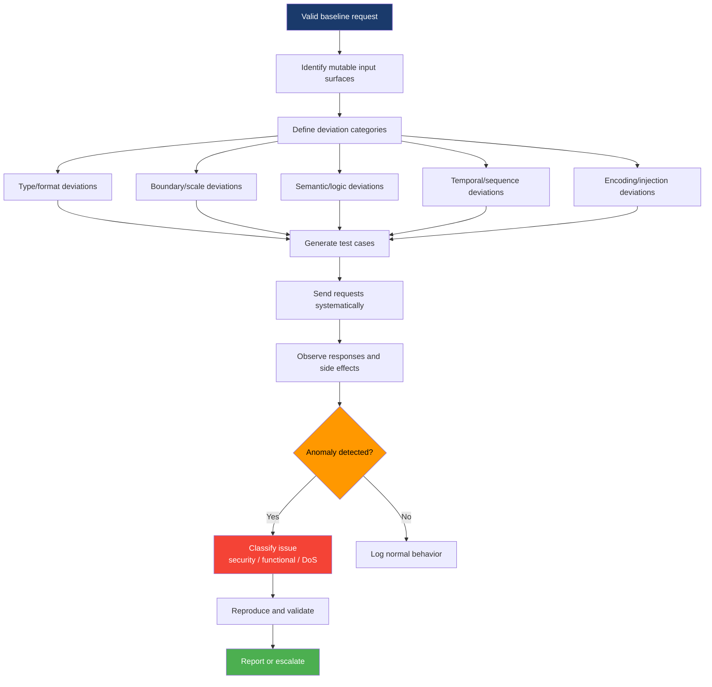
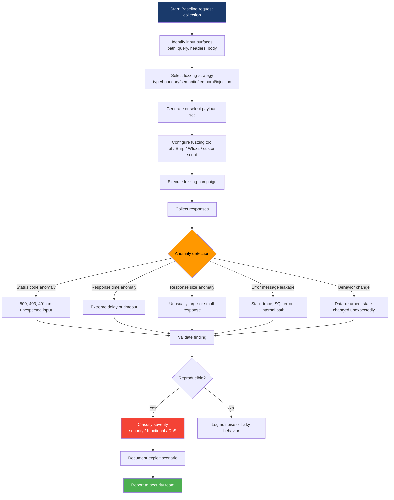

# Endpoint Fuzzing

> **Endpoint fuzzing is the systematic process of sending unexpected, malformed, boundary-case, or semantically deviant input to API endpoints to discover unhandled errors, logic flaws, hidden behaviors, security weaknesses, and resource exhaustion conditions that escape formal validation and testing.**

---

## 🧠 What Is It? (Beginner Explanation)

Think of an API like a customer service desk with strict rules about what requests they will accept.

- They expect polite, well-formed questions in the right language.
- They publish rules about what formats are valid.
- They train their team to handle common problems.

But what happens when you:

- send a massive request that breaks their systems?
- use characters they never expected?
- send 10,000 requests per second?
- combine inputs that technically pass validation but make no business sense?
- reference objects that do not exist or belong to someone else?

**Endpoint fuzzing** is the practice of deliberately sending these weird, extreme, unexpected inputs in a systematic way to see how the API actually behaves under stress, chaos, and edge cases.

The goal is not random chaos. The goal is **structured provocation** — sending requests that might expose:

- logic bugs that allow unauthorized actions
- error messages that leak sensitive data
- parser flaws that open injection or DoS vectors
- missing validation that allows BOLA, mass assignment, or SSRF
- race conditions or resource exhaustion

### Real-world analogy

Imagine quality-testing a door lock. You can test it with the correct key — that checks normal operation.

But real attackers test it with:

- the wrong key
- no key
- 1,000 keys per second
- a bent key
- a key made of ice or rubber
- tools that manipulate the lock mechanism in unexpected ways

**Fuzzing is systematically trying all the "wrong keys" to see which ones expose a design flaw, manufacturing defect, or logic error.**

---

## 🎯 Why Endpoint Fuzzing Matters

API documentation and automated tests usually cover the happy path. Fuzzing systematically explores the **space between documented behavior and actual behavior**.

That gap is where security problems live.

### The coverage problem

Traditional API testing usually validates:

- ✅ valid input produces expected output
- ✅ documented errors return the right status code
- ✅ authentication is enforced on protected routes

But attackers care about:

- ❓ what happens when input is technically valid but semantically wrong?
- ❓ what happens when you send gigantic payloads or deeply nested objects?
- ❓ what happens when you reference objects that exist but belong to someone else?
- ❓ what happens when you send thousands of requests in rapid sequence?
- ❓ what happens when you violate implicit ordering or state assumptions?
- ❓ what error messages leak information the spec never intended to expose?

Fuzzing is the discipline of turning those questions into testable probes.

### Modern API context

Modern APIs face unique fuzzing challenges because:

- **Auto-binding and reflection** — frameworks automatically map JSON fields to internal objects, so undocumented properties can slip through
- **Microservice boundaries** — gateway validation may pass, but downstream services may have weaker input handling
- **GraphQL and flexibility** — deeply nested queries, field aliases, and batching open new fuzz surfaces
- **Rate limit drift** — endpoints that appear rate-limited during normal traffic may have gaps under specific conditions or error states
- **Multi-tenant state** — fuzzing often exposes cross-tenant leakage or authorization drift

OWASP API Security Top 10 2023 identifies several categories where fuzzing plays a key detection role:

| OWASP API Risk | How fuzzing helps detect it |
|---|---|
| **API1: Broken Object Level Authorization (BOLA)** | ID parameter fuzzing reveals if objects belonging to other users can be accessed |
| **API2: Broken Authentication** | Credential fuzzing, token manipulation, and session state fuzzing expose weak or bypassed authentication |
| **API3: Broken Object Property Level Authorization** | Mass assignment fuzzing tests if undocumented or restricted properties can be set |
| **API4: Unrestricted Resource Consumption** | Payload size, nesting depth, array length, and request rate fuzzing test for DoS conditions |
| **API5: Broken Function Level Authorization** | HTTP method fuzzing and endpoint enumeration reveal accessible admin or restricted operations |
| **API6: Unrestricted Access to Sensitive Business Flows** | Sequential fuzzing of multi-step processes tests for logic bypass and state manipulation |
| **API8: Security Misconfiguration** | Error fuzzing and stack trace induction reveal configuration drift and verbose error modes |
| **API9: Improper Inventory Management** | Version fuzzing and alternate-path fuzzing discover old, undocumented, or shadow APIs |
| **API10: Unsafe Consumption of APIs** | URL and callback fuzzing test SSRF and downstream injection risk |

---

## 🧩 Core Mental Model — Fuzzing Is Structured Deviation

Beginners sometimes think fuzzing means "send random garbage."

Modern fuzzing is smarter than that. It is better described as:

> **Starting from valid input and making precise, systematic deviations to learn how the system responds to each category of unexpected behavior.**



The key insight: **fuzzing is not noise, it is signal engineering.** Each fuzzed input tests a hypothesis about what the system should reject or handle safely.

---

## 📚 Fuzzing Categories and Attack Surface

### 1. Type and Format Fuzzing

**What it tests:** Whether the API correctly validates data types, formats, and encoding.

**Why it matters:** Weak type validation can lead to injection, parser errors, or unexpected type coercion.

| Input class | Examples | What it can expose |
|---|---|---|
| **Wrong types** | Send string where number expected, object where string expected | Type confusion, auto-coercion bugs |
| **Null / undefined** | `null`, empty string, missing field | Null pointer exceptions, logic flaws |
| **Special characters** | `' " ; & < > \| \n \r \0 % $ #` | Injection risk, encoding issues |
| **Unicode / multibyte** | Emoji, RTL markers, zero-width, homoglyphs | Validation bypass, display injection, collation bugs |
| **Invalid JSON/XML** | Truncated, malformed, extra commas, unclosed brackets | Parser crash, error message leakage |
| **Encoding mismatches** | UTF-8 vs. Latin-1, URL double-encoding, base64 padding | Bypass filters, inject through decoder stack |

**Example payloads:**

```json
// Type mismatch
{"userId": "abc123"}           // string instead of int
{"userId": true}               // boolean instead of int
{"userId": [1, 2, 3]}          // array instead of scalar

// Null variations
{"userId": null}
{"userId": ""}
{"userId": "null"}
// Omit userId entirely

// Special characters
{"username": "admin'--"}
{"username": "<script>alert(1)</script>"}
{"username": "../../etc/passwd"}
{"username": "${7*7}"}
```

---

### 2. Boundary and Scale Fuzzing

**What it tests:** Whether the API enforces limits on size, depth, count, and resource consumption.

**Why it matters:** Unbounded input can cause DoS, memory exhaustion, or expose O(n²) algorithmic complexity.

| Boundary class | Examples | What it can expose |
|---|---|---|
| **Very large values** | `INT_MAX`, `999999999`, `9e999` | Integer overflow, allocation failures |
| **Very small or negative** | `-1`, `-999999`, `0`, `0.0000001` | Index underflow, logic errors |
| **Massive strings** | 1MB, 10MB, 100MB payloads | Memory exhaustion, timeout, WAF bypass |
| **Deep nesting** | 100-level nested objects or arrays | Stack overflow, parser limits |
| **Long arrays** | 10,000-element array | O(n²) loops, DB query cartesian products |
| **Precision extremes** | `1.7976931348623157e+308`, `5e-324` | Float rounding, scientific notation handling |

**Example payloads:**

```json
// Large integer
{"amount": 2147483647}         // INT_MAX
{"amount": 9999999999999999}   // beyond 32-bit range

// Negative / zero
{"quantity": -1}
{"page": 0}
{"limit": -100}

// Massive string
{"description": "A" * 1000000}

// Deep nesting (JSON bomb)
{"a": {"a": {"a": {"a": ... }}}}   // 100+ levels

// Long array
{"tags": ["tag"] * 10000}
```

---

### 3. Semantic and Logic Fuzzing

**What it tests:** Whether the API enforces business rules, referential integrity, and logical consistency.

**Why it matters:** Validation can pass on format but fail on meaning, leading to BOLA, IDOR, or workflow bypass.

| Semantic class | Examples | What it can expose |
|---|---|---|
| **Non-existent IDs** | `userId: 999999`, `orderId: "fake123"` | Error disclosure, enumeration |
| **Other users' IDs** | Change `userId` from `42` to `43` | BOLA / IDOR |
| **Invalid states** | Set order status to `"shipped"` before payment | Workflow bypass |
| **Contradictory fields** | `{"approved": true, "status": "rejected"}` | Logic inconsistency |
| **Out-of-range dates** | `"1900-01-01"`, `"2099-12-31"`, `"1970-01-01"` | Epoch bugs, date parsing errors |
| **Impossible combinations** | Free tier with enterprise features enabled | Privilege escalation |

**Example payloads:**

```json
// BOLA testing
GET /api/users/1337/profile     // Try other user IDs
GET /api/orders/ABC123          // Try predictable order IDs

// State manipulation
PATCH /api/orders/123
{"status": "completed"}         // Try skipping payment step

// Contradictory values
{"planType": "free", "maxUsers": 10000}
{"accountLocked": false, "loginAttempts": 999}
```

---

### 4. Temporal and Sequence Fuzzing

**What it tests:** Whether the API enforces correct ordering, state transitions, and timing constraints.

**Why it matters:** Race conditions, TOCTOU bugs, and state machine flaws often appear under concurrent or out-of-order requests.

| Temporal class | Examples | What it can expose |
|---|---|---|
| **Out-of-order operations** | DELETE before CREATE, PATCH before POST | State assumption violations |
| **Duplicate requests** | Send same idempotent request 100 times | Duplicate charges, inventory errors |
| **Concurrent modification** | Two clients PATCH same object simultaneously | Race condition, lost updates |
| **Replay attacks** | Reuse old request with valid signature/token | Replay vulnerability |
| **Timing delays** | Pause between multi-step operations | Session timeout bypass, TOCTOU |

**Example scenarios:**

```bash
# Race condition testing
# Terminal 1:
curl -X PATCH /api/balance/subtract/100 &

# Terminal 2 (simultaneously):
curl -X PATCH /api/balance/subtract/100 &

# Both may succeed even if balance < 200

# Sequence violation
POST /api/checkout/confirm       # Try before adding items
DELETE /api/account              # Try while active subscription exists
```

---

### 5. Injection and Encoding Fuzzing

**What it tests:** Whether user input is safely passed to interpreters (SQL, NoSQL, LDAP, OS shell, template engines).

**Why it matters:** Injection is still a top API risk; fuzzing is how you discover unsafe sinks.

| Injection class | Payload examples | Target interpreter |
|---|---|---|
| **SQL injection** | `' OR '1'='1`, `'; DROP TABLE users--` | SQL databases |
| **NoSQL injection** | `{"$gt": ""}`, `{"$ne": null}` | MongoDB, etc. |
| **Command injection** | `; ls`, <code>&#124; whoami</code>, `` `id` `` | OS shell |
| **LDAP injection** | `*)(uid=*))(|(uid=*` | LDAP directory |
| **Template injection** | `{{7*7}}`, `<%= system('id') %>` | Jinja, ERB, Thymeleaf |
| **XPath injection** | `' or '1'='1`, `//user[name/text()='admin']` | XML query engines |
| **Expression language** | `${applicationScope}`, `#context['xwork.MethodAccessor']` | OGNL, SpEL |

**Example payloads:**

```json
// SQL injection
{"username": "admin' OR '1'='1'-- "}
{"search": "'; DROP TABLE products--"}

// NoSQL injection (MongoDB)
{"username": {"$gt": ""}, "password": {"$gt": ""}}
{"userId": {"$ne": null}}

// Command injection
{"filename": "report.pdf; cat /etc/passwd"}
{"hostname": "localhost | whoami"}

// Template injection
{"greeting": "Hello {{7*7}}"}
{"template": "${T(java.lang.Runtime).getRuntime().exec('id')}"}
```

---

### 6. Authorization and Authentication Fuzzing

**What it tests:** Whether endpoints enforce correct authentication and authorization under edge cases.

**Why it matters:** Missing or inconsistent auth checks are the most common API vulnerability class.

| Auth fuzzing class | Examples | What it can expose |
|---|---|---|
| **Missing token** | Remove `Authorization` header entirely | Unprotected endpoints |
| **Expired / invalid token** | Use old JWT, tampered signature | Weak validation |
| **Other user's token** | Use Token A to access User B's data | Horizontal privilege escalation |
| **Privilege escalation** | Use low-privilege token on admin endpoint | Vertical privilege escalation |
| **HTTP method tampering** | Change `GET` to `POST`, `PUT`, `DELETE` | Method-based auth bypass |
| **Header case manipulation** | `authorization` vs. `Authorization` | Case-sensitive parsing bugs |

**Example scenarios:**

```bash
# Missing authentication
curl -X GET https://api.example.com/admin/users
# (No Authorization header)

# Invalid token
curl -H "Authorization: Bearer invalid_token_xyz" \
  https://api.example.com/api/profile

# Method fuzzing
# If GET /api/users is public, try:
POST /api/users
DELETE /api/users/123
PUT /api/users/123

# Header case fuzzing
authorization: Bearer <token>
AUTHORIZATION: Bearer <token>
X-API-KEY: vs. x-api-key:
```

---

## 🛠️ Fuzzing Tools and Techniques

### Manual Fuzzing with cURL and Scripting

**Best for:** Understanding baseline behavior, targeted testing, learning.

```bash
# Basic type fuzzing
curl -X POST https://api.example.com/users \
  -H "Content-Type: application/json" \
  -d '{"userId": "not_a_number"}'

# Boundary fuzzing
curl -X POST https://api.example.com/transfer \
  -H "Content-Type: application/json" \
  -d '{"amount": -1000000}'

# ID enumeration
for id in {1..100}; do
  curl -s "https://api.example.com/orders/$id" | grep -i "unauthorized"
done

# Header fuzzing
curl -X GET https://api.example.com/admin \
  -H "X-Forwarded-For: 127.0.0.1" \
  -H "X-Original-URL: /admin" \
  -H "X-Rewrite-URL: /admin"
```

---

### Burp Suite Intruder

**Best for:** Parameter-level fuzzing, payload iteration, manual proxy-based testing.

| Attack type | Use case |
|---|---|
| **Sniper** | Fuzz one parameter at a time |
| **Battering ram** | Use same payload in all positions |
| **Pitchfork** | Pair payloads across positions |
| **Cluster bomb** | Cartesian product of all payload combinations |

**Common payload sets:**

- **Fuzzing - quick**: Basic special characters and boundary cases
- **Fuzzing - full**: Comprehensive injection and encoding payloads
- **Numbers**: Integers, floats, negatives, MAX/MIN values
- **Null payloads**: Empty, null, undefined variations

**Workflow:**

1. Send request to Intruder
2. Mark injection points with `§parameter§`
3. Select payload set (built-in or custom)
4. Configure grep match or response analysis
5. Launch attack and review anomalies

---

### ffuf (Fuzz Faster U Fool)

**Best for:** High-speed endpoint and parameter discovery.

```bash
# Endpoint fuzzing
ffuf -u https://api.example.com/FUZZ \
  -w /usr/share/wordlists/api-endpoints.txt \
  -mc 200,201,204,301,302,401,403 \
  -t 50

# Parameter fuzzing
ffuf -u "https://api.example.com/search?FUZZ=test" \
  -w /usr/share/wordlists/params.txt \
  -mc 200

# ID enumeration
ffuf -u "https://api.example.com/users/FUZZ" \
  -w <(seq 1 10000) \
  -mc 200,201 \
  -t 20

# Method fuzzing
ffuf -u https://api.example.com/api/endpoint \
  -w methods.txt:METHOD \
  -X METHOD \
  -mc all -fc 404
```

---

### Wfuzz

**Best for:** Flexible fuzzing with rich filtering and post-processing.

```bash
# Basic fuzzing
wfuzz -z file,payloads.txt \
  -H "Content-Type: application/json" \
  -d '{"user":"FUZZ"}' \
  https://api.example.com/login

# Multi-position fuzzing
wfuzz -z file,users.txt -z file,roles.txt \
  -d '{"username":"FUZZ","role":"FUZ2Z"}' \
  https://api.example.com/register

# Filter by response code and size
wfuzz -z range,1-1000 \
  --hc 404 --hw 0 \
  https://api.example.com/orders/FUZZ
```

---

### Nuclei

**Best for:** Template-driven vulnerability scanning with fuzzing modules.

```bash
# Run all API fuzzing templates
nuclei -u https://api.example.com -t ~/nuclei-templates/fuzzing/

# Custom template example
cat > api-fuzz.yaml <<EOF
id: api-boundary-test
info:
  name: API Boundary Fuzzing
  severity: medium

requests:
  - method: POST
    path:
      - "{{BaseURL}}/api/transfer"
    body: '{"amount":"{{amount}}"}'
    payloads:
      amount:
        - "-1"
        - "999999999"
        - "0"
    matchers:
      - type: status
        status:
          - 500
          - 400
EOF

nuclei -t api-fuzz.yaml -u https://api.example.com
```

---

### Radamsa (Mutation-Based Fuzzer)

**Best for:** Protocol-level fuzzing, generating unexpected malformed input.

```bash
# Generate mutated payloads
echo '{"userId":123,"action":"transfer"}' | radamsa -n 100 > fuzz-payloads.txt

# Use with other tools
cat baseline-request.json | radamsa | \
  xargs -I {} curl -X POST https://api.example.com/api \
    -H "Content-Type: application/json" \
    -d '{}'
```

---

### RESTler (Stateful API Fuzzer)

**Best for:** Grammar-based fuzzing, dependency-aware testing (Microsoft Research).

```bash
# Compile OpenAPI spec
python Restler.py compile --api_spec openapi.json

# Run fuzzing
python Restler.py fuzz \
  --grammar_file Compile/grammar.py \
  --dictionary_file dict.json \
  --settings settings.json \
  --target_ip api.example.com \
  --target_port 443
```

RESTler automatically infers dependencies (e.g., "create user before updating user") and generates sequences that respect API state.

---

### Custom Scripting with Python

**Best for:** Complex logic, stateful fuzzing, custom analysis.

```python
import requests
import json

BASE_URL = "https://api.example.com"
TOKEN = "your_bearer_token"

# Boundary fuzzing
test_values = [
    -1, 0, 1, 999999999, 2147483647, -2147483648,
    "", "null", None, "admin", "'OR'1'='1", 
    "A" * 10000, {"$gt": ""}, [1, 2, 3]
]

for val in test_values:
    payload = {"amount": val}
    r = requests.post(
        f"{BASE_URL}/transfer",
        json=payload,
        headers={"Authorization": f"Bearer {TOKEN}"}
    )
    
    print(f"Payload: {val} | Status: {r.status_code} | Length: {len(r.text)}")
    
    if r.status_code == 500 or "error" in r.text.lower():
        print(f"[!] Anomaly detected: {r.text[:200]}")
```

---

## 📊 Fuzzing Workflow Diagram



---

## 🔍 Analyzing Fuzzing Results

### What to Look For

| Signal | What it means | Example |
|---|---|---|
| **500 Internal Server Error** | Unhandled exception, possible logic flaw | Sending array instead of string crashes handler |
| **400 with verbose error** | Validation message leaks schema info | `"field 'adminRole' is not allowed"` reveals hidden property |
| **403 Forbidden (unexpected)** | Authorization check triggered by unusual input | Accessing endpoint with modified role value |
| **429 rate limit (inconsistent)** | Rate limit applies to some endpoints but not others | Admin endpoints lack throttling |
| **Response time spike** | Algorithmic complexity or resource exhaustion | Deeply nested JSON causes O(n²) parser behavior |
| **Empty 200 response** | Data filtered out, possible authorization check | User A's token + User B's ID returns empty instead of 403 |
| **Different content length** | Payload triggered different code path | Injection payload returns longer response |
| **Stack traces / debug info** | Development mode enabled, leaks internal structure | Error reveals framework version, file paths, DB schema |

---

### Building an Anomaly Baseline

Before you can detect anomalies, you need a **baseline of normal behavior**.

**Baseline collection:**

```bash
# Collect normal responses
for i in {1..100}; do
  curl -s https://api.example.com/endpoint | jq -c '{status, length: (. | tostring | length), time}' >> baseline.jsonl
done

# Analyze distribution
cat baseline.jsonl | jq -s 'group_by(.status) | map({status: .[0].status, count: length})'
```

Then during fuzzing, flag responses that deviate significantly:

- status code not in baseline set
- response time > 2× median
- response size > 2× median or < 0.5× median
- new error patterns or keywords

---

## 🛡️ Defense Perspective — What Fuzzing Tests

Defenders use fuzzing to validate their input handling and error response:

### Input Validation Checklist

- [ ] **Type enforcement** — reject wrong types at API gateway
- [ ] **Format validation** — use strict regex, enum, or schema checks
- [ ] **Range enforcement** — apply min/max on numbers, string length, array size
- [ ] **Null handling** — explicit policy on null vs. missing vs. empty
- [ ] **Encoding normalization** — decode and validate in a single encoding
- [ ] **Injection prevention** — parameterized queries, safe templating, no shell execution
- [ ] **Resource limits** — max request size, nesting depth, array length, rate limits

### Error Handling Checklist

- [ ] **Generic error messages** — never leak SQL errors, stack traces, or internal paths
- [ ] **Consistent status codes** — 401 for auth, 403 for authz, 400 for validation
- [ ] **Logging without leakage** — log full error server-side, return safe message to client
- [ ] **Graceful degradation** — handle parser errors without crashing
- [ ] **Rate limit error responses** — do not reveal whether resource exists during throttling

---

## ⚠️ Fuzzing Safely and Legally

### Authorization Requirements

**Never fuzz production APIs without written authorization.**

Fuzzing generates abnormal traffic that can:

- trigger rate limits and security alerts
- cause resource exhaustion or service degradation
- corrupt data if endpoints have side effects
- violate terms of service and computer fraud laws

**Authorized environments:**

- ✅ Your own development and staging APIs
- ✅ Bug bounty programs with explicit fuzzing rules
- ✅ Client-authorized penetration testing with documented scope
- ✅ Dedicated testing environments set up for security research

**Never:**

- ❌ Fuzz production systems without authorization
- ❌ Ignore rate limits or continue after being blocked
- ❌ Test third-party APIs unless explicitly invited
- ❌ Use fuzzing to harm, disrupt, or exfiltrate data

---

### Rate Limiting and Throttling

Always fuzz **responsibly**:

```bash
# Add delay between requests
ffuf -u https://api.example.com/FUZZ \
  -w wordlist.txt \
  -p 0.5-1.0              # 0.5-1.0 second delay
  -t 5                     # Max 5 concurrent threads

# Use wfuzz rate limiting
wfuzz -z file,payloads.txt \
  --req-delay 1 \           # 1 second between requests
  https://api.example.com/FUZZ

# Custom Python throttling
import time
for payload in payloads:
    response = fuzz(payload)
    time.sleep(0.5)
```

---

### Fuzzing Staging vs. Production

| Environment | Safe to fuzz? | Considerations |
|---|---|---|
| **Local dev** | ✅ Yes | Full freedom, no external impact |
| **CI/CD test** | ✅ Yes | Automate fuzzing in pipeline |
| **Staging** | ⚠️ With approval | May share data or services with prod |
| **Production** | ❌ Only with explicit authorization | Requires careful scoping, monitoring, rollback plan |

**Best practice:** Set up a **dedicated fuzzing environment** that mirrors production architecture but uses isolated data and services.

---

## 📈 Advanced Fuzzing Techniques

### 1. Grammar-Based Fuzzing

Instead of random mutation, use API specification to guide generation.

**Tools:**

- **RESTler** — generates valid request sequences from OpenAPI
- **Schemathesis** — property-based testing using API schema
- **Dredd** — validates API against spec and fuzzes edge cases

**Example with Schemathesis:**

```bash
pip install schemathesis

# Fuzz all endpoints defined in OpenAPI spec
schemathesis run https://api.example.com/openapi.json \
  --base-url https://api.example.com \
  --hypothesis-max-examples=1000 \
  --checks all
```

---

### 2. Stateful Fuzzing

Most fuzzers send independent requests. Stateful fuzzing maintains session state and dependencies.

**Why it matters:** Many vulnerabilities require multi-step sequences:

1. Create account
2. Login
3. Modify profile with injection payload
4. Escalate privileges
5. Access admin endpoint

**Tools:**

- **RESTler** — infers dependencies from spec
- **Dredd** — supports hooks for stateful testing
- **Custom scripts** — manage session tokens and state transitions

**Example workflow:**

```python
# Step 1: Register
r1 = requests.post(f"{BASE_URL}/register", json={"user": "fuzzuser"})
token = r1.json()["token"]

# Step 2: Fuzz profile update
for payload in injection_payloads:
    r2 = requests.patch(
        f"{BASE_URL}/profile",
        json={"bio": payload},
        headers={"Authorization": f"Bearer {token}"}
    )
    analyze_response(r2)
```

---

### 3. Differential Fuzzing

Compare responses from two implementations or versions.

**Use cases:**

- New API version vs. old version (detect regressions)
- Gateway behavior vs. direct backend behavior
- Different environments (staging vs. prod)

**Example:**

```bash
# Compare v1 vs. v2
curl https://api.example.com/v1/users/123 > v1.json
curl https://api.example.com/v2/users/123 > v2.json
diff v1.json v2.json
```

---

### 4. Corpus-Based Fuzzing

Start with known-good requests (corpus) and mutate them.

**Tools:**

- **AFL (American Fuzzy Lop)** — coverage-guided fuzzing
- **libFuzzer** — integrates with LLVM for binary fuzzing
- **Radamsa** — general-purpose mutation fuzzer

**Workflow:**

```bash
# Collect baseline requests into corpus
mkdir corpus
curl https://api.example.com/endpoint1 > corpus/req1.json
curl https://api.example.com/endpoint2 > corpus/req2.json

# Fuzz using mutations
radamsa -o fuzzed-%n.json -n 1000 corpus/*.json

# Send fuzzed payloads
for f in fuzzed-*.json; do
  curl -X POST https://api.example.com/endpoint -d @$f
done
```

---

## 🔬 Real-World Fuzzing Case Studies

### Case Study 1: Mass Assignment via Undocumented Property

**Target:** User profile update endpoint

**Baseline request:**

```json
POST /api/profile
{"name": "Alice", "email": "alice@example.com"}
```

**Fuzzing approach:** Add undocumented properties based on common patterns.

**Payload:**

```json
{"name": "Alice", "email": "alice@example.com", "role": "admin", "isAdmin": true, "accountType": "premium"}
```

**Result:** Property `"role"` was accepted and changed user privileges.

**Root cause:** Framework auto-binding without property allowlist.

---

### Case Study 2: SQL Injection in Search Filter

**Target:** Product search with filter

**Baseline:**

```http
GET /api/products?category=electronics&price_max=1000
```

**Fuzzing approach:** Inject SQL metacharacters in `category`.

**Payload:**

```http
GET /api/products?category=electronics' OR '1'='1'-- &price_max=1000
```

**Result:** Returned all products, bypassing category filter.

**Root cause:** Dynamic SQL concatenation instead of parameterized query.

---

### Case Study 3: DoS via Nested JSON

**Target:** User-generated content creation

**Baseline:**

```json
POST /api/posts
{"title": "Hello", "body": "World"}
```

**Fuzzing approach:** Send deeply nested JSON.

**Payload:**

```json
{"title": "Test", "body": {"a": {"a": {"a": {"a": ... }}}}}  // 1000 levels deep
```

**Result:** Parser consumed excessive CPU, causing timeout and 503 errors for other users.

**Root cause:** No recursion depth limit on JSON parser.

---

### Case Study 4: BOLA via ID Enumeration

**Target:** Order details endpoint

**Baseline:**

```http
GET /api/orders/1001
Authorization: Bearer <user_token>
```

**Fuzzing approach:** Iterate order IDs.

**Payload:**

```bash
for id in {1000..2000}; do
  curl -H "Authorization: Bearer $TOKEN" https://api.example.com/api/orders/$id
done
```

**Result:** User could access orders belonging to other users.

**Root cause:** Authorization check only validated token presence, not ownership.

---

## 📋 Fuzzing Checklist for Penetration Testers

### Pre-Fuzzing Reconnaissance

- [ ] Collect API specification (OpenAPI, GraphQL schema, WSDL)
- [ ] Capture baseline traffic (Burp, mitmproxy, HAR export)
- [ ] Identify all input surfaces (path, query, headers, body)
- [ ] Map authentication and authorization mechanisms
- [ ] Document normal status codes and response patterns
- [ ] Confirm authorization and scope for testing

### Type and Format Fuzzing

- [ ] Test wrong data types (string ↔ int ↔ bool ↔ array)
- [ ] Test null, empty, and missing values
- [ ] Test special characters and encoding
- [ ] Test invalid JSON/XML structure
- [ ] Test Unicode edge cases

### Boundary and Scale Fuzzing

- [ ] Test integer boundaries (INT_MIN, INT_MAX, -1, 0)
- [ ] Test very large strings (1MB, 10MB)
- [ ] Test deep nesting (100+ levels)
- [ ] Test long arrays (10,000+ elements)
- [ ] Test extreme numeric precision

### Semantic and Logic Fuzzing

- [ ] Test non-existent resource IDs
- [ ] Test other users' resource IDs (BOLA)
- [ ] Test invalid state transitions
- [ ] Test contradictory field combinations
- [ ] Test out-of-range dates

### Injection Fuzzing

- [ ] Test SQL injection patterns
- [ ] Test NoSQL injection patterns
- [ ] Test command injection patterns
- [ ] Test template injection patterns
- [ ] Test LDAP/XPath injection patterns

### Authorization Fuzzing

- [ ] Test endpoints without authentication
- [ ] Test expired/invalid tokens
- [ ] Test privilege escalation (low → high)
- [ ] Test horizontal privilege escalation (user A → user B)
- [ ] Test HTTP method tampering

### Temporal and Sequence Fuzzing

- [ ] Test out-of-order operations
- [ ] Test duplicate requests
- [ ] Test concurrent modification (race conditions)
- [ ] Test replay attacks
- [ ] Test timing-based bypasses

### Error Handling Analysis

- [ ] Review all error messages for information disclosure
- [ ] Check for stack traces in responses
- [ ] Verify consistent error status codes
- [ ] Test that errors do not reveal internal state

---

## 📚 References and Further Reading

### OWASP Resources

- [OWASP API Security Top 10 2023](https://owasp.org/API-Security/editions/2023/en/0x00-header/)
- [OWASP API Security Project](https://owasp.org/www-project-api-security/)
- [OWASP Testing Guide - API Testing](https://owasp.org/www-project-web-security-testing-guide/latest/4-Web_Application_Security_Testing/12-API_Testing/)
- [OWASP Fuzzing Guide](https://owasp.org/www-community/Fuzzing)

### Security Research

- [PortSwigger Web Security Academy - API Testing](https://portswigger.net/web-security/api-testing)
- [API Security Best Practices - NIST SP 800-204](https://csrc.nist.gov/publications/detail/sp/800-204/final)
- [The Web Application Hacker's Handbook - Chapter 20: Fuzzing](https://www.wiley.com/en-us/The+Web+Application+Hacker%27s+Handbook%3A+Finding+and+Exploiting+Security+Flaws%2C+2nd+Edition-p-9781118026472)

### Tools and Projects

- [ffuf - Fuzz Faster U Fool](https://github.com/ffuf/ffuf)
- [Wfuzz - Web Application Fuzzer](https://github.com/xmendez/wfuzz)
- [RESTler - Stateful REST API Fuzzer](https://github.com/microsoft/restler-fuzzer)
- [Schemathesis - Property-based testing for API schemas](https://github.com/schemathesis/schemathesis)
- [Radamsa - General Purpose Fuzzer](https://gitlab.com/akihe/radamsa)
- [Nuclei - Fast vulnerability scanner](https://github.com/projectdiscovery/nuclei)

### Academic Papers

- [REST API Fuzzing by Coverage Level Guided Blackbox Testing](https://ieeexplore.ieee.org/document/9159094)
- [RESTler: Stateful REST API Fuzzing (Microsoft Research)](https://www.microsoft.com/en-us/research/publication/restler-stateful-rest-api-fuzzing/)
- [Automated API Fuzzing Using Neural Networks](https://dl.acm.org/doi/10.1145/3460120.3484768)

### Industry Guides

- [HackerOne API Security Testing Methodology](https://www.hackerone.com/ethical-hacker/api-hacking-101)
- [Burp Suite - API Testing Best Practices](https://portswigger.net/burp/documentation/desktop/testing-workflow/api-testing)
- [Postman - API Fuzzing Guide](https://learning.postman.com/docs/writing-scripts/script-references/test-examples/)

---

## 🎯 Key Takeaways

1. **Fuzzing is structured deviation** — not random noise, but systematic exploration of edge cases.

2. **Normal testing covers the happy path; fuzzing covers the 99 other paths** where security bugs live.

3. **APIs are uniquely vulnerable** because they auto-bind input, compose microservices, and expose flexible query languages.

4. **Effective fuzzing requires baseline knowledge** — you must know what "normal" looks like before you can detect anomalies.

5. **Fuzzing complements but does not replace manual testing** — use it to scale discovery, then investigate findings deeply.

6. **Always fuzz with authorization** — fuzzing can disrupt services and violate laws if done without permission.

7. **The best defense is to fuzz your own APIs** before attackers do — integrate fuzzing into CI/CD and security review processes.

---

**Remember:** Fuzzing is both an offensive and defensive practice. Attackers use it to find vulnerabilities. Defenders use it to validate input handling, test error resilience, and harden their APIs against unexpected behavior. The goal is not chaos — it's **disciplined exploration of what happens when assumptions break**.
